
## What we are building

Alice adds a $79 pair of shoes to her cart on her laptop. An hour later she opens her phone, and the shoes are still there. She clicks Buy, the shoes ship, and her credit card gets charged exactly once.

That is the whole product. It sounds like three database rows. The interesting problems are hiding underneath.

Five hard problems show up in every real cart:

1. **Cross-device sync.** The cart must live on the server, not in a browser cookie. A cookie only works on one device.
2. **Guest-to-user merge.** Alice browses as a guest, adds 3 items, then logs in. She already had 2 items saved. Now what?
3. **Inventory race.** The cart says a shoe is in stock. Twenty minutes later, someone else took the last pair. Alice clicks Buy.
4. **Idempotent checkout.** Alice's phone drops the network mid-checkout. The app retries. She must not get two orders or two charges.
5. **Abandoned cart cleanup.** Sixty percent of carts are never bought. Ghost carts pile up. Guest cart tokens accumulate in the database forever.

We will start with the smallest version that works, then add one piece at a time as each problem appears.

---

## The lifecycle of one cart

Every cart moves through a small set of states. Picture it once before drawing any architecture.

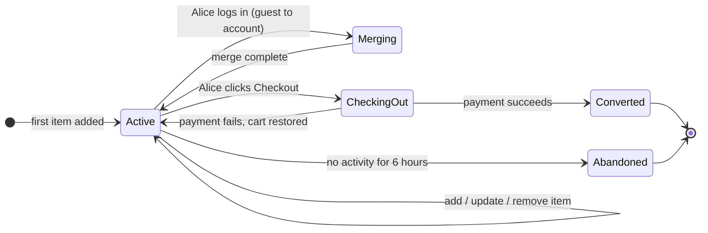

Everything else in this design (Redis, Kafka, inventory holds, price drift handling) is a complication on top of this one state machine.

> **Take this with you.** A cart is a small state machine per user. The hard part is not the state machine. It is what happens between Active and Converted.

---

## How big this gets

Same product, two very different sizes.

| Input | Small shop (500 DAU) | Big shop (1M DAU) |
|-------|---------------------|-------------------|
| Carts per day | 150 | 300,000 |
| Cart writes per second (peak) | ~0.01 | ~21 |
| Cart icon reads per second (peak) | ~0.06 | ~350 |
| Active carts at any moment | ~50 | ~25,000 |
| Live storage | ~33 MB/year | ~7 GB |

<details markdown="1">
<summary><b>Show: how the numbers come out</b></summary>

Assume 30% of visitors add at least one item. Average cart has 3 items, edited twice.

**Small shop (500 visitors/day):**
- Carts: 500 × 30% = 150 per day
- Cart writes: 150 × 2 edits = 300/day, so **0.003/sec steady**
- Cart icon reads: 500 visitors × 10 page views = 5,000/day, so **0.06/sec**
- Active carts: 150 carts × ~8h average life / 24h = **~50 open at any moment**
- Storage: 150 carts × 3 items × 200 bytes = ~90 KB/day, ~33 MB/year

**Big shop (1M visitors/day):**
- Carts: 1M × 30% = 300,000/day, so **3.5/sec steady**
- Cart writes: 600,000/day, so **7/sec steady, 21/sec peak**
- Cart icon reads: 1M × 10 page views = 10M/day, so **115/sec steady, 350/sec peak**
- Active carts (30-day TTL): 300,000 × 30 days / 30 = **~25,000 open at any moment**
- Storage: 300K carts × 3 items × 200 bytes = ~180 MB/day, ~7 GB live

The number that matters: writes are tiny even at 1M users. Any database handles 21 writes/sec. The real challenge is the cart icon read on every page: 350/sec with a tight latency target. That single endpoint sets the caching strategy.

| Metric | At 1M users |
|--------|-------------|
| **Writes/sec (peak)** | ~21. Any database handles this. |
| **Icon reads/sec (peak)** | ~350. This is the design constraint. |
| **Active carts in Redis** | ~25,000. About 5 MB as compact hashes. |
| **Real bottleneck** | Cart icon read on every page, not the buy button. |

</details>

> **Take this with you.** The cart is a read-heavy problem disguised as a write problem. Optimize the icon read, not the add-item write.

---

## The smallest version that works

One Postgres, one app server, logged-in users only.

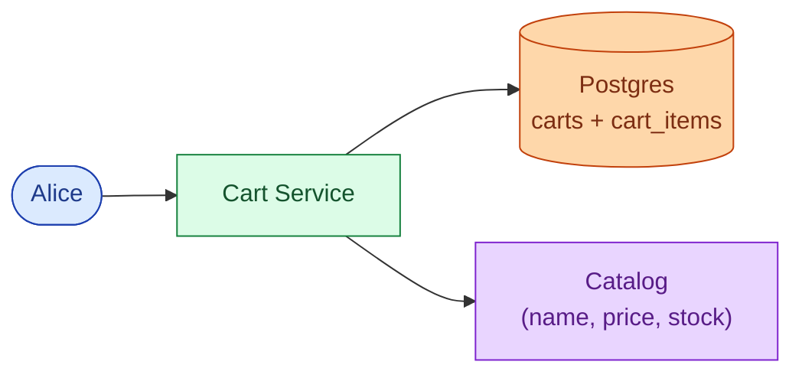

Three endpoints carry the full product at this stage.

| Endpoint | What it does |
|----------|--------------|
| `GET /api/v1/cart` | Return items, quantities, snapshot prices, and live availability |
| `POST /api/v1/cart/items` | Add an item or increase its quantity |
| `PATCH /api/v1/cart/items/{sku}` | Update quantity; qty 0 removes the item |

<details markdown="1">
<summary><b>Show: the two tables</b></summary>

```sql
CREATE TABLE carts (
    cart_id     UUID PRIMARY KEY,
    user_id     BIGINT,
    cart_token  UUID,
    status      TEXT NOT NULL DEFAULT 'active',
    item_count  INT NOT NULL DEFAULT 0,
    created_at  TIMESTAMPTZ NOT NULL DEFAULT NOW(),
    updated_at  TIMESTAMPTZ NOT NULL DEFAULT NOW(),
    expires_at  TIMESTAMPTZ
);

CREATE TABLE cart_items (
    cart_id              UUID NOT NULL REFERENCES carts(cart_id),
    sku                  TEXT NOT NULL,
    qty                  INT NOT NULL CHECK (qty > 0 AND qty <= 99),
    snapshot_price_cents INT NOT NULL,
    added_at             TIMESTAMPTZ NOT NULL DEFAULT NOW(),
    PRIMARY KEY (cart_id, sku)
);
```

`item_count` is denormalized on the `carts` row. The cart icon on every page only needs that one number: one row read, no JOIN, no catalog call.

`snapshot_price_cents` records what Alice saw when she added the item. If the price changes tomorrow, the audit trail still shows what she was shown.

</details>

This is enough for a hundred users. The interesting question is what breaks first as the system grows.

---

## Decision 1: where does the cart live for guests?

Marketing asks: can users browse and add items without creating an account? Almost every real shop says yes. This single answer changes the data model and adds a merge step at login.

The fix is a `cart_token`: a random UUID stored in a browser cookie. The cart lives on the server, keyed by that token instead of a user ID. The cookie just points at the row.

Now a new problem: Alice builds a guest cart with 3 shoes over 20 minutes. She logs in. She already had 2 shoes saved from last week.

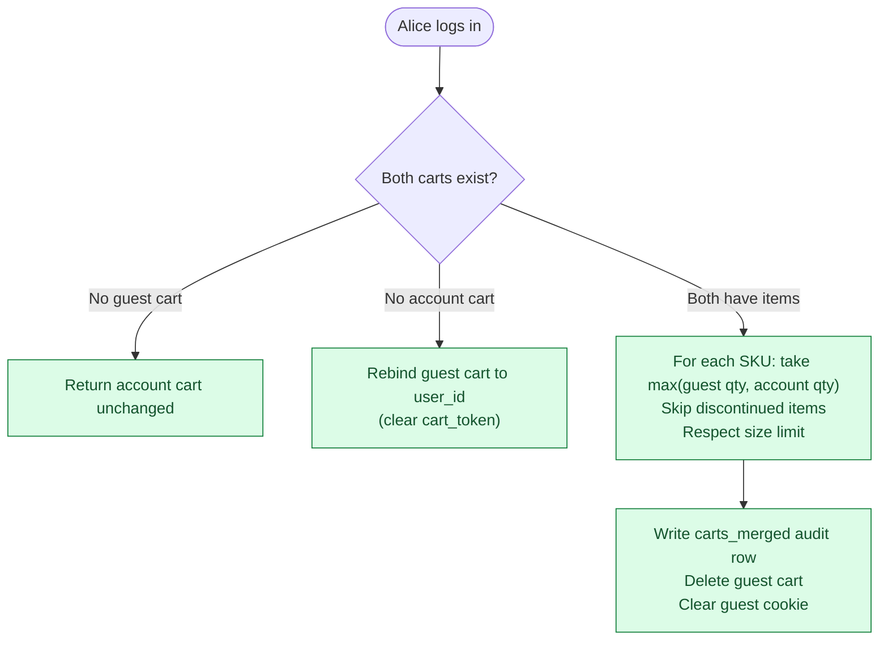

The quantity rule matters. If the guest cart has 2 of shoe-A and the account cart has 1, Alice almost certainly wants 2, not 3. **Take the max, not the sum.**

The merge runs inside a serializable transaction. Alice might double-click Log In. Two concurrent merge calls race. The second finds the guest cart already deleted and returns the account cart unchanged. No duplicate merge.

<details markdown="1">
<summary><b>Show: the carts_merged audit table and merge sketch</b></summary>

```sql
CREATE TABLE carts_merged (
    merge_id        UUID PRIMARY KEY,
    user_id         BIGINT NOT NULL,
    anonymous_token UUID,
    anonymous_items JSONB NOT NULL,
    account_items   JSONB NOT NULL,
    merged_items    JSONB NOT NULL,
    rule_applied    TEXT NOT NULL,
    trimmed_items   JSONB,
    occurred_at     TIMESTAMPTZ NOT NULL DEFAULT NOW()
);
```

Every merge writes a row here regardless of outcome: rebind, full merge, or no-op. When Alice emails support "my cart is wrong after I logged in," you have the answer. The data is cheap to store. The audit is irreplaceable.

```python
def merge_carts(anonymous_token, user_id):
    with db.transaction(isolation="serializable"):
        anon_cart = db.fetch_cart(cart_token=anonymous_token, lock=True)
        user_cart  = db.fetch_cart(user_id=user_id, lock=True)

        if anon_cart is None:
            return user_cart

        if user_cart is None:
            db.update(anon_cart.id, user_id=user_id, cart_token=None)
            audit_merge(user_id, anonymous_token, rule="rebind")
            return db.fetch_cart(user_id=user_id)

        merged  = {item.sku: item.copy() for item in user_cart.items}
        trimmed = []
        for item in anon_cart.items:
            if not catalog.is_available(item.sku):
                trimmed.append(item.sku)
                continue
            if item.sku in merged:
                merged[item.sku].qty = min(
                    max(item.qty, merged[item.sku].qty), MAX_QTY_PER_ITEM
                )
            else:
                if len(merged) >= MAX_CART_ITEMS:
                    trimmed.append(item.sku)
                    continue
                merged[item.sku] = item

        db.replace_items(user_cart.id, merged.values())
        db.delete(anon_cart.id)
        audit_merge(user_id, anonymous_token, rule="qty:max", trimmed=trimmed)
        return db.fetch_cart(user_id=user_id)
```

</details>

> **Take this with you.** The merge on login is where most cart designs break. Max-qty rule, one serializable transaction, audit row, clear the cookie.

---

## Decision 2: how do we handle the inventory race?

Alice adds a shoe to her cart at 2 PM. At 2:20 PM she clicks Buy. Someone else took the last pair at 2:15 PM. Three approaches handle this. None is perfect.

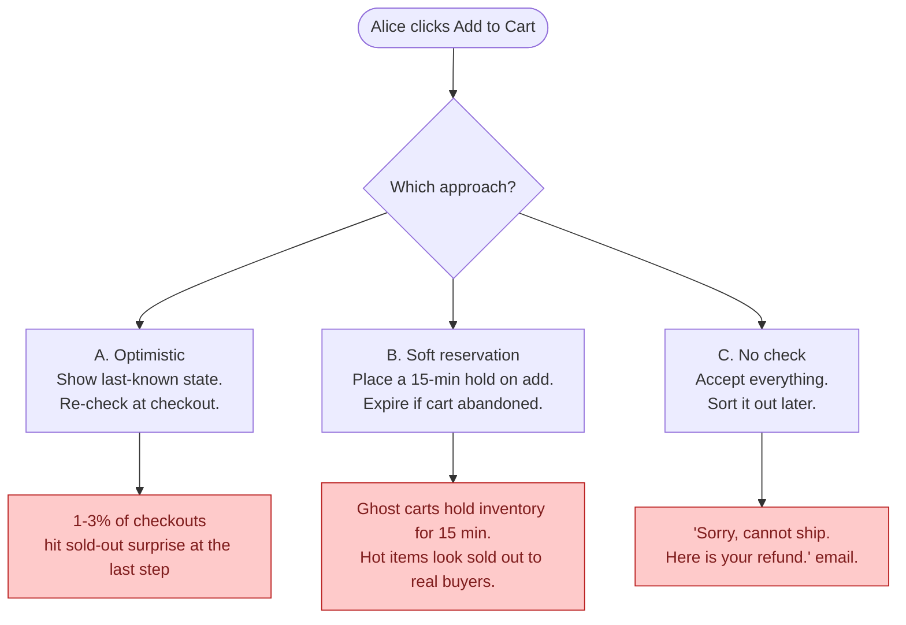

<details markdown="1">
<summary><b>Show: comparison table and recommendation</b></summary>

| Approach | Normal case | Failure mode | Build cost | Right for |
|----------|-------------|--------------|------------|-----------|
| **A. Optimistic** | Works fine. Checkout re-checks. | 1-3% of checkouts find item gone at the last step. | Low. | Default for most shops. |
| **B. Soft reservation** | User never sees a sold-out surprise mid-checkout. | Ghost carts hold inventory for 15 min. Hot items show as sold out to real buyers. | High. Inventory needs hold, release, and TTL expiry logic. | Concert tickets, limited sneaker drops. |
| **C. No check** | Always accepts. Fast. | "Cannot ship, here is your refund." | Near zero. | Pre-orders, print-on-demand. |

**Default: optimistic. Reservation only for SKUs explicitly flagged `requires_reservation=true`.**

Industry cart abandonment is 60-70%. If every add-to-cart held inventory for 15 minutes, ghost carts would make real inventory look empty. That is right for a Taylor Swift ticket sale. Wrong for shoes.

Division of responsibility:
- **Cart service:** read-only availability check on add. Show what we believe. No writes to inventory.
- **Order service:** authoritative `try_reserve(sku, qty)` at checkout. If it fails, no order, no charge.

The cart's job is to show good information. The order service's job is to make the buy real.

</details>

> **Take this with you.** The cart shows what is probably true. The Order Service makes it actually true. Never put the inventory guarantee in the cart.

---

## Decision 3: how do we make checkout idempotent?

Alice's phone drops the connection mid-checkout. The app retries. Without idempotency, the cart service processes the checkout twice and charges her twice.

The fix is an `Idempotency-Key` header on every mutating request: a UUID the client generates once per logical operation. The server records the key and the result. If the same key arrives again, it returns the recorded result without re-processing.

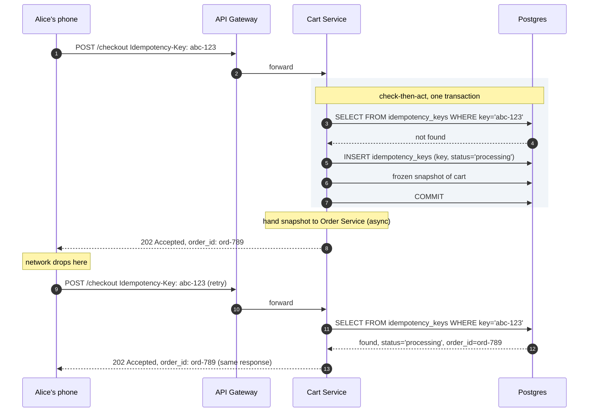

The cart does not clear until the Order Service emits a `cart.converted` event. Payment failure emits `cart.checkout_failed`, holds release, and the cart is intact for editing.

> **Take this with you.** Idempotency keys plus a frozen snapshot. The key catches retries. The snapshot decouples cart state from payment outcome.

---

## Decision 4: how do we serve the cart icon fast?

The cart icon appears on every page. At 1M users, that is 350 icon reads per second. Each read only needs one number: how many items are in Alice's cart.

The naive path is a `SELECT COUNT(*) FROM cart_items WHERE cart_id = ?`. At 350/sec this starts showing up in slow query logs within a few weeks of launch.

Two things fix this. First, denormalize `item_count` onto the `carts` row and keep it updated in the same transaction as item changes. Second, cache the whole cart hash in Redis so icon reads never touch Postgres.

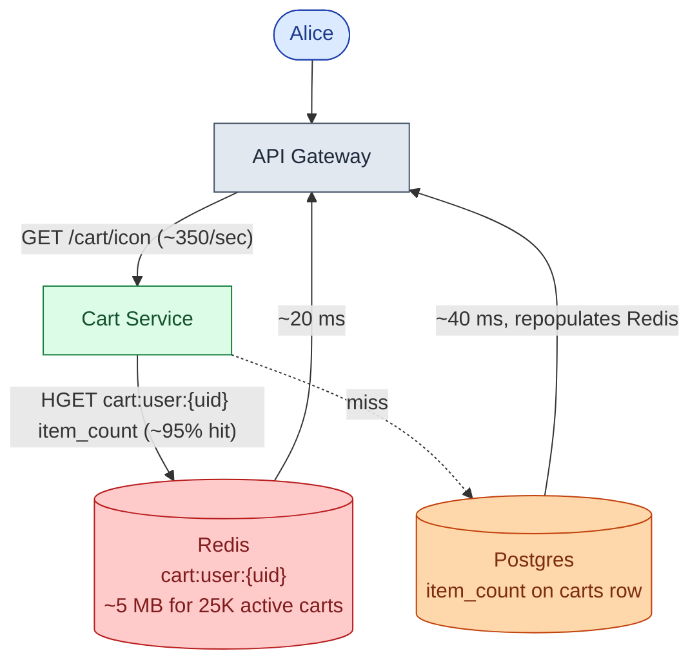

Redis holds the compact cart: SKU, qty, snapshot price. One HGET returns the count. Catalog and inventory results are not stored in Redis; they change too fast and are fetched fresh on each full cart page load.

> **Take this with you.** Denormalize `item_count`. Cache it in Redis. One field read, no JOIN, no catalog call. That is how the icon stays under 20 ms.

---

## Decision 5: how do we clean up abandoned carts?

60-70% of carts are never purchased. Guest carts accumulate with no user to notify. At 1M users, that is 180,000 abandoned carts per day with no automatic cleanup.

Two separate problems: finding carts to email, and deleting dead rows.

**Finding carts to email:** a nightly job queries carts where `status = 'active'` and `updated_at` is exactly 6 hours old, within a narrow window.

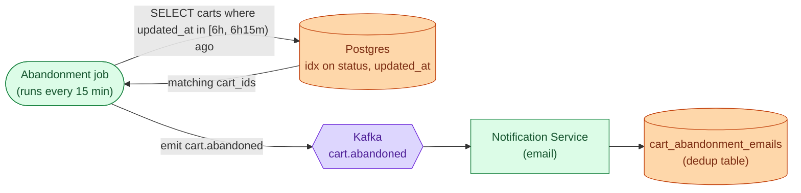

The narrow time window means the query only touches carts that just crossed the threshold. The partial index on `(status, updated_at)` makes it fast regardless of total cart count.

**Deleting dead rows:** guest carts get `expires_at = NOW() + 30 days`, refreshed on every activity. A nightly GC job deletes rows where `expires_at < NOW()` and `status != 'converted'`. Converted carts stay for the order audit trail.

> **Take this with you.** Narrow time windows, not full scans. Emit events to Kafka, do not email directly from the job. Dedup on delivery, not on send.

---

## The full architecture

Putting the five decisions together.

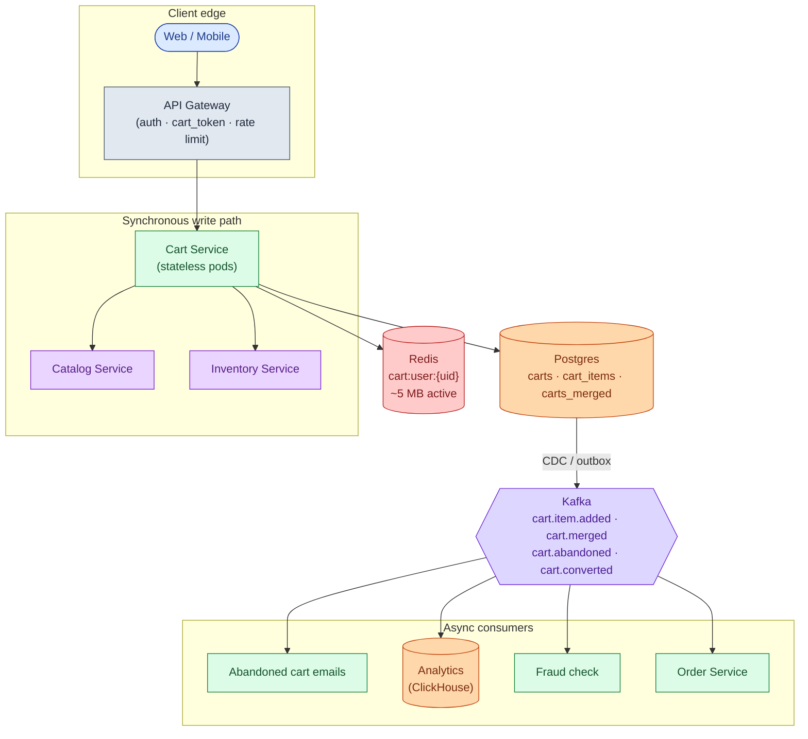

Each component in one sentence:

| Component | Purpose |
|-----------|---------|
| API Gateway | Auth, cart_token cookie issuance, rate limiting per IP and user. |
| Cart Service | Stateless. Owns merge logic, size limits, price snapshot, idempotency check. |
| Catalog Service | Name, image, current price per SKU. Called on cart page load, in parallel with Inventory. |
| Inventory Service | Stock availability. Cart reads it. Never writes to it. |
| Postgres | Source of truth. Three tables: `carts`, `cart_items`, `carts_merged`. |
| Redis | Fast cache for active carts. Icon read lives here (~5 MB for 25K active carts). |
| Kafka | Carries cart events to downstream teams. Abandonment, analytics, fraud, order service. |
| Order Service | Authoritative inventory reserve + payment. Cart does not clear until Order Service confirms. |
| Analytics, Fraud, Emails | Downstream consumers. If any dies, cart adds and reads still work. |

---

## Walk: add to cart, end to end

Alice adds a shoe on her laptop.

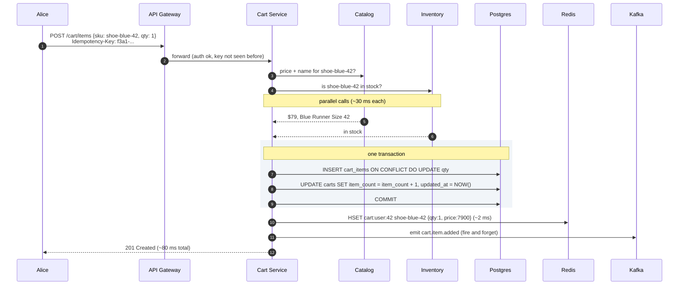

Three details worth noting:

1. Catalog and Inventory are called in parallel. Total latency is `max(catalog, inventory)`, not the sum.
2. The DB write and the `item_count` update are one transaction. A crash mid-write rolls back cleanly.
3. Redis is written after the commit. If Redis fails, Postgres has the truth and repopulates on the next read.

---

## Walk: cross-device sync

Alice adds shoes on her laptop at 2 PM. She opens her phone at 3 PM.

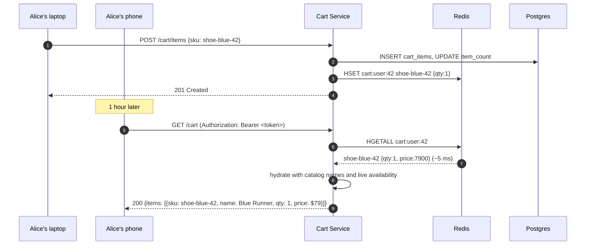

The cart is keyed by `user_id`, not by device. Any device with a valid session token reads the same cart. No sync protocol needed.

---

## The hard sub-problem: inventory hold timing

When a soft reservation is used (flagged SKUs like limited drops), the hold timer creates a cascading problem.

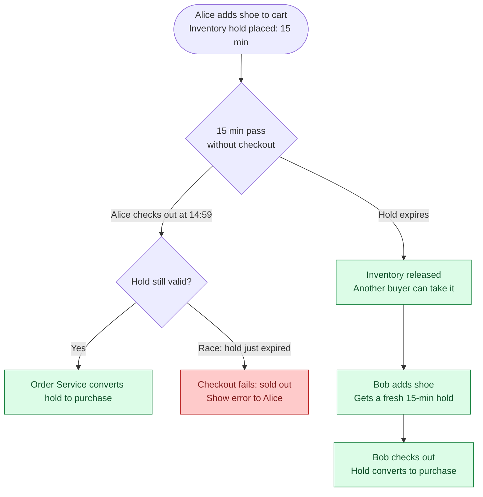

The race at the bottom (hold just expired while checkout is in flight) is unavoidable. The mitigation is a grace window: the Order Service attempts the reserve even if the hold shows as expired within the last 30 seconds. If the inventory count still has availability, the purchase goes through.

| Hold timer | Trade-off |
|------------|-----------|
| 5 minutes | Fewer ghost holds. More sold-out surprises at checkout. |
| 15 minutes | Standard for limited drops. Significant ghost hold problem at high abandonment. |
| 30 minutes | Feels safe for the user. Ghost holds lock out real buyers for half an hour. |

For most shops: skip holds entirely. Use optimistic inventory. Reserve only at checkout, inside the Order Service, as an atomic step with payment.

> **Take this with you.** Hold timers solve one problem (surprise at checkout) and create another (ghost holds blocking real buyers). Keep them short and scope them to SKUs that genuinely need them.

---

## Follow-up questions

Try answering each in 2 or 3 sentences before opening the solution.

1. **Bots stuff a cart with 10,000 items.** What goes wrong? How do you stop it?

2. **Phone-to-laptop sync delay.** Alice adds a shoe on her phone. She opens her laptop 5 seconds later. The cart shows the old state. How long is acceptable? How do you fix it?

3. **Redis goes down mid-day.** All active carts are cached in Redis. What does Alice see? How do you recover without losing any carts?

4. **Price went up.** Alice added a shoe at $79 last week. Today it is $89. What does she pay? What does she see at checkout?

5. **Abandoned cart emails.** You want to email shoppers 6 hours after their last activity. How do you find those carts without scanning every active cart every minute?

6. **Anonymous carts pile up.** When do you delete them? What happens if a user returns after 90 days with the same old cookie?

7. **Two people share one account.** Both log in from different cities and add items at the same time. What happens?

8. **Currency switch.** Alice adds a shoe priced in USD. She switches the site to EUR. What happens to the snapshot price?

9. **Item becomes restricted.** Alice added a legal item. A new regulation restricts shipping it to her state. She goes to checkout. What does the system do?

10. **Save for later.** Alice wants to move an item from her cart to a wishlist. Is this the cart service's job? Where does the wishlist live?

11. **Checkout race.** Two sessions for the same user both hit checkout within 100 ms of each other (browser tab dupe, mobile + desktop). What prevents a double order?

12. **Cart grows to 200 items.** When do you enforce a size limit? Where does the limit live?

---

## Related problems

- **[Approval Management (011)](../011-approval-management/question.md).** Same patterns: state per user, event stream on changes, audit table on transitions.
- **[Coupon Redemption (014)](../014-coupon-redemption/question.md).** The cart holds a coupon code. The coupon service decides validity. Same service boundary as inventory.
- **[Read-Heavy System Patterns (017)](../017-read-heavy-patterns/question.md).** The cart icon read on every page is a classic read-heavy load. The Redis-plus-DB pattern applies directly.
- **[Write-Heavy System Patterns (018)](../018-write-heavy-patterns/question.md).** The Kafka event stream for analytics is the write-heavy pattern at scale.
- **[Help Desk Ticketing (019)](../019-helpdesk-ticketing/question.md).** "My cart is wrong after login" support tickets need the `carts_merged` audit table to answer.


<div class="pr-solution-divider"></div>


## Solution: Shopping Cart Service

### The short version

A shopping cart is a small amount of mutable state per user: add items, change quantities, buy or leave. The state machine is trivial. What makes the design interesting is five specific problems: cross-device sync, guest-to-user merge at login, the inventory race at checkout, idempotent checkout under retries, and cleaning up abandoned carts without blocking the write path.

The answers: Postgres as source of truth, Redis as a fast read layer for icon counts, Kafka for downstream teams, and a careful merge algorithm on login. At 1M users, cart writes are only ~21/sec. The real load is the 350 icon reads per second that appear on every page of the site.

---

### 1. The two questions that matter most

**Guests or login only?** If guests can add without an account, you need a `cart_token` cookie, a server-side guest cart, a merge endpoint at login, and an audit table for what changed. This is the harder path and the right one for almost every real shop.

**What does "in stock" mean?** Optimistic (show last-known, re-check at checkout), soft reservation (hold inventory on add), or no check? This single decision changes how inventory and checkout interact. The right default is optimistic, with soft holds only for explicitly flagged SKUs.

Everything else follows from these two.

---

### 2. The math

| Scale | Carts/day | Writes/sec (peak) | Icon reads/sec (peak) | Active carts | Live storage |
|-------|-----------|-------------------|-----------------------|--------------|--------------|
| Small (500 DAU) | 150 | 0.01 | 0.06 | ~50 | ~33 MB/year |
| Big (1M DAU) | 300,000 | 21 | 350 | ~25,000 | ~7 GB |

What the numbers say:

- Writes are tiny even at 1M users. A single Postgres handles 21 writes/sec without effort.
- The icon read is the load to optimize: 350/sec with a target under 20 ms. That pushes you to Redis and denormalized `item_count`.
- 25,000 active carts fit in Redis as compact hashes. About 5 MB total. Trivial.
- The bottleneck is not the cart writes. It is the Inventory service, which is called on every full cart page load.

---

### 3. The API

Five endpoints carry the whole product.

```
GET    /api/v1/cart
POST   /api/v1/cart/items          Idempotency-Key: <uuid>
PATCH  /api/v1/cart/items/{sku}    qty: 0 means remove
DELETE /api/v1/cart/items/{sku}
POST   /api/v1/cart/merge          body: {"anonymous_token": "<uuid>"}
```

`GET /cart` returns a hydrated response: SKU + qty from Postgres/Redis, joined with name, image, and current price from Catalog, and availability from Inventory. The join happens on the server. Never push it to the browser.

| Status code | Meaning |
|-------------|---------|
| 201 | Item added |
| 200 | Item already present, quantity updated |
| 400 | Quantity out of range or bad SKU |
| 404 | SKU does not exist |
| 409 | SKU is restricted (region, age gate) |
| 410 | SKU is discontinued |
| 422 | Cart is full (100-item limit) |

Load-bearing choices:

- **Idempotency-Key required on writes.** A phone retries on flaky Wi-Fi. Without the key, a dropped connection gives qty 2 when the user wanted 1, or two checkout attempts.
- **Snapshot price and current price both return on every read.** Snapshot is what Alice saw when she added. Current is what she pays. Show both. Audit needs both.
- **Checkout returns a session token, not an order.** The cart does not clear until the Order Service confirms payment. Payment failure leaves the cart intact.

---

### 4. The data model

Three tables: two for live data, one for audit.

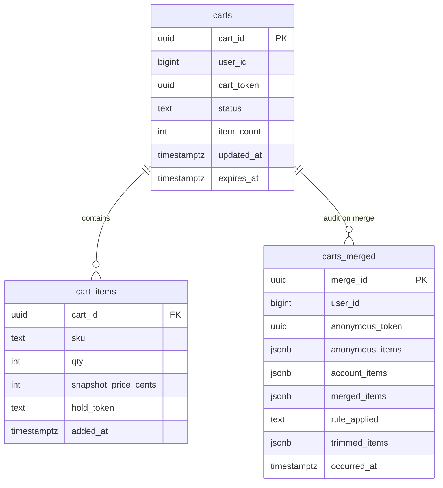

<details markdown="1">
<summary><b>Show: the full SQL</b></summary>

```sql
CREATE TABLE carts (
    cart_id          UUID PRIMARY KEY,
    user_id          BIGINT,
    cart_token       UUID,
    status           TEXT NOT NULL DEFAULT 'active',
    item_count       INT NOT NULL DEFAULT 0,
    created_at       TIMESTAMPTZ NOT NULL DEFAULT NOW(),
    updated_at       TIMESTAMPTZ NOT NULL DEFAULT NOW(),
    expires_at       TIMESTAMPTZ,
    CHECK ((user_id IS NULL) <> (cart_token IS NULL))
);

CREATE UNIQUE INDEX idx_carts_user
    ON carts (user_id) WHERE status = 'active' AND user_id IS NOT NULL;
CREATE UNIQUE INDEX idx_carts_token
    ON carts (cart_token) WHERE status = 'active' AND cart_token IS NOT NULL;
CREATE INDEX idx_carts_abandonment
    ON carts (updated_at) WHERE status = 'active';

CREATE TABLE cart_items (
    cart_id              UUID NOT NULL REFERENCES carts(cart_id) ON DELETE CASCADE,
    sku                  TEXT NOT NULL,
    qty                  INT NOT NULL CHECK (qty > 0 AND qty <= 99),
    snapshot_price_cents INT NOT NULL,
    added_at             TIMESTAMPTZ NOT NULL DEFAULT NOW(),
    updated_at           TIMESTAMPTZ NOT NULL DEFAULT NOW(),
    hold_token           TEXT,
    PRIMARY KEY (cart_id, sku)
);

CREATE INDEX idx_cart_items_sku ON cart_items (sku);

CREATE TABLE carts_merged (
    merge_id          UUID PRIMARY KEY,
    user_id           BIGINT NOT NULL,
    anonymous_token   UUID,
    anonymous_items   JSONB NOT NULL,
    account_items     JSONB NOT NULL,
    merged_items      JSONB NOT NULL,
    rule_applied      TEXT NOT NULL,
    trimmed_items     JSONB,
    occurred_at       TIMESTAMPTZ NOT NULL DEFAULT NOW()
);

CREATE INDEX idx_merged_user ON carts_merged (user_id, occurred_at DESC);
```

</details>

Four choices worth defending:

**The CHECK constraint** enforces that exactly one of `user_id` or `cart_token` is set. A cart is either owned or guest. After merge, the guest row is deleted and the constraint ensures no cart becomes orphaned.

**`item_count` is denormalized.** The cart icon on every page needs one number: one Redis field read, no JOIN, no catalog call. Updated in the same transaction as item changes so it never goes stale.

**`snapshot_price_cents` on cart_items.** Records the price when Alice added the item. The total is computed fresh at checkout from current prices. The snapshot is for display and audit.

**`carts_merged` has no business logic.** It is a record of what happened. Every merge writes a row: what was in each cart, what the rule was, what was trimmed. When a user emails support, you have the answer.

Why Postgres and not DynamoDB? Merging two carts atomically is one transaction. Idempotency key checks are one transaction. The data is small (7 GB at 1M users). Postgres gives ACID in one box. DynamoDB would require a custom transaction layer for merge.

---

### 5. The merge algorithm

This is where most cart designs break.

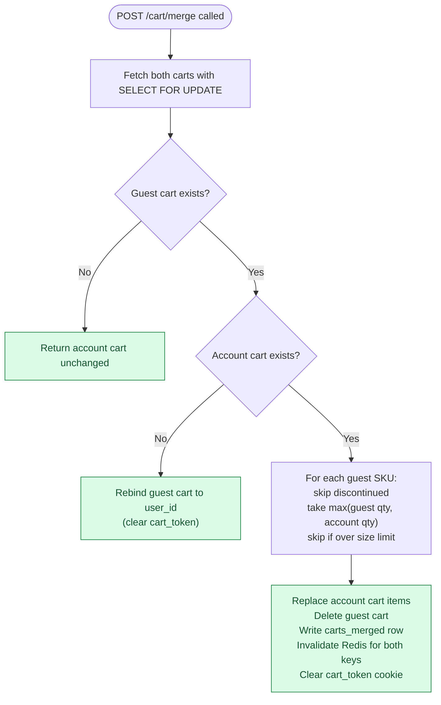

<details markdown="1">
<summary><b>Show: the merge in code</b></summary>

```python
def merge_carts(anonymous_token, user_id):
    with db.transaction(isolation="serializable"):
        anon_cart = db.fetch_cart(cart_token=anonymous_token, lock=True)
        user_cart  = db.fetch_cart(user_id=user_id, lock=True)

        if anon_cart is None:
            return user_cart

        if user_cart is None:
            db.update(anon_cart.id, user_id=user_id, cart_token=None)
            audit_merge(user_id, anonymous_token, rule="rebind")
            invalidate_redis(anonymous_token, user_id)
            return db.fetch_cart(user_id=user_id)

        merged  = {item.sku: item.copy() for item in user_cart.items}
        trimmed = []
        for item in anon_cart.items:
            if not catalog.is_available(item.sku):
                trimmed.append({"sku": item.sku, "reason": "discontinued"})
                continue
            if item.sku in merged:
                merged[item.sku].qty = min(
                    max(item.qty, merged[item.sku].qty), MAX_QTY_PER_ITEM
                )
            else:
                if len(merged) >= MAX_CART_ITEMS:
                    trimmed.append({"sku": item.sku, "reason": "size_limit"})
                    continue
                merged[item.sku] = item

        db.replace_items(user_cart.id, merged.values())
        db.delete(anon_cart.id)
        audit_merge(user_id, anonymous_token, rule="qty:max", trimmed=trimmed)
        invalidate_redis(anonymous_token, user_id)
        return db.fetch_cart(user_id=user_id)
```

</details>

Three things make this safe:

- **Serializable isolation.** Alice double-clicks Log In. Two merge calls race. The second finds the guest cart deleted and returns the account cart unchanged. No duplicate merge.
- **Audit always written.** Storage is cheap. Support tickets are not.
- **Cookie cleared in the response.** `Set-Cookie: cart_token=; Max-Age=0`. No re-merge on the next page load.

The classic mistake: doing the merge in the browser. The browser does not know the account cart, cannot enforce limits, and cannot run a transaction. Always server-side.

---

### 6. The architecture


Five things to notice:

- The cart service never **writes** to inventory. It reads. The inventory decrease happens at checkout in the Order Service. An inventory outage does not break add-to-cart.
- Catalog and inventory are called in **parallel** on cart read. Latency is `max(catalog, inventory)`, not the sum.
- Redis holds the compact cart (SKU + qty + snapshot price). Catalog and inventory results are not cached there; they change too fast.
- Postgres is source of truth. Redis is an accelerator. If Redis loses data, Postgres repopulates it on the next cache miss.
- Notifications, analytics, and fraud sit downstream of Kafka. If any of them dies, carts still work.

---

### 7. A request, end to end

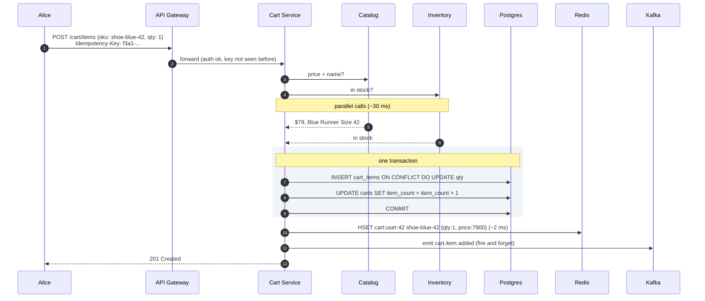

Target latencies:

| Operation | P99 target |
|-----------|------------|
| Cart icon count (Redis hit) | ~20 ms |
| Full cart read (parallel catalog + inventory) | ~80 ms |
| Add item (inventory round-trip is the bottleneck) | ~150 ms |
| Merge on login | ~200 ms |

---

### 8. Inventory strategy

Three options. The right default is optimistic.

| Option | Failure mode | Build cost | Use when |
|--------|--------------|------------|----------|
| **Optimistic** (re-check at checkout) | 1-3% of checkouts find item gone last-second | Low | Default for most shops |
| **Soft reservation** (hold on add, TTL expiry) | Ghost carts make real stock look empty | High | Concert tickets, limited drops |
| **No check** (accept all, sort later) | "Cannot ship, refund coming" email | Near zero | Pre-orders, print-on-demand |

The division of responsibility: the cart shows good information. The Order Service makes the buy real. For SKUs the catalog flags `requires_reservation=true`, the cart calls Inventory to place a TTL hold and stores the `hold_token` on `cart_items`. The hold releases when the user removes the item, the TTL expires, or checkout converts it to a purchase.

Hold timer trade-offs:

| Timer | Effect |
|-------|--------|
| 5 min | Fewer ghost holds, more sold-out surprises at checkout |
| 15 min | Standard for limited drops, significant ghost hold problem at high abandonment |
| 30 min | Comfortable for users, blocks real buyers for half an hour |

For most shops: skip holds. Use optimistic. Reserve only at checkout, inside the Order Service, as an atomic step with payment.

---

### 9. The scaling journey: 10 users to 1 million

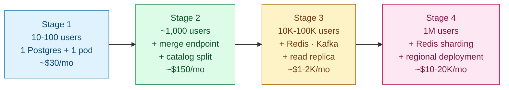

#### Stage 1: 10 to 100 users

One Postgres, one app instance. Cart and catalog in the same app. Guest carts use a `cart_token` cookie. No Redis, no Kafka, no abandonment emails. Inventory is a SELECT on the products table. Ships in three days.

#### Stage 2: 1,000 users

What breaks: marketing wants abandoned-cart emails. People want phone-to-laptop sync. The catalog deserves its own service.

Split catalog (and eventually inventory) into their own services. Build the merge endpoint and the `carts_merged` audit table. Add a nightly job for abandoned carts. Still no Redis, still no Kafka. One Postgres read replica handles all reads.

#### Stage 3: 100,000 users

Several things break at once:

- Cart icon reads (~12/sec) appear in slow query logs.
- Cart page load is slow because each load joins with catalog over HTTP for 5+ items.
- A flash sale on limited stock shows "available" to 5,000 users when 100 pairs remain.
- Inventory has a 30-second blip. Every cart add fails because the service blocks on it.

Fixes in order: Redis as cart cache (write-through, 95%+ hit rate). Inventory check becomes best-effort with fallback to "show available, confirm at checkout." Reservation only for flagged SKUs. Kafka replaces polling for downstream consumers. Nightly GC deletes expired anonymous carts.

#### Stage 4: 1 million users

New problems:

- Redis single-node failure means 25,000 empty-looking carts for ten seconds.
- Write contention on `item_count` update surfaces under load.
- Bots add 50 items per second across thousands of guest carts, hammering inventory.
- EU expansion requires regional data storage.

Shard Redis by `hash(user_id) % N`, one primary and one replica per shard. Rate-limit add-to-cart per IP and per `cart_token`. Regional deployment for EU with a local Redis and a Postgres replica. Async checkout: cart emits a frozen snapshot to Kafka, Order Service handles payment and the atomic reserve, user polls for order status.

The cart itself is comfortable at this scale. The bottleneck moves to inventory and checkout.

---

### 10. Reliability

**Redis dies mid-day.** Cart reads fall through to Postgres at ~40 ms instead of ~20 ms. Users see slightly slower pages; nobody loses their cart because Postgres is the truth. On recovery, the first read for each user repopulates Redis. A circuit breaker switches to "DB only" mode after N Redis failures. `cart.redis.hit_rate` drops to 0. Alert fires.

**Postgres primary dies.** Standard failover (30-60 seconds). Writes return 503 with `Retry-After`. Reads continue from replicas. Queued writes retry on recovery.

**Inventory service goes down.** Cart shows last-known availability or a "confirm at checkout" badge. Cart adds continue. More users hit a sold-out surprise at checkout during the outage. Acceptable.

**Checkout starts and payment fails.** The Order Service handles it. The cart does NOT clear until it receives a `cart.converted` event. Payment failure emits `cart.checkout_failed`. Holds release. User edits and retries.

**Race between remove-item and in-flight checkout.** Checkout took a frozen snapshot of the cart at the moment it started. The removal hits the live cart but does not affect the in-flight checkout. If checkout succeeds, snapshot items are bought. The live cart (minus purchased items) remains.

---

### 11. Observability

| Metric | Why it matters |
|--------|----------------|
| `cart.icon_count.p99` | Tightest SLO. Runs on every page. Alert at >40 ms. |
| `cart.read.p99` | Cart page load. Alert at >200 ms. |
| `cart.write.p99` | Spike means DB contention. |
| `cart.redis.hit_rate` | Should be >95%. Drop means shard imbalance or repopulation storm. |
| `cart.merge.rate` | Spike means auth is broken and re-merging on every request. |
| `cart.merge.size_trimmed.rate` | Non-zero often means the size limit is too low. |
| `inventory.check.timeout_rate` | Drives the fallback path frequency. Alert at >5%. |
| `cart.abandonment.rate` | Marketing's headline metric. Alert on sudden >20% shift. |
| `cart.size.p99` | Bot signal if p99 > 50 items. |
| `kafka.cart_events.consumer_lag` | If this grows, abandonment emails stop arriving. |
| `db.replication_lag.p99` | Read replicas must stay under 1 second. |

Page on: `cart.icon_count.p99` > 40 ms for 5 min, `redis.hit_rate` < 80% for 5 min, Kafka lag > 5 min, cart write error rate > 2%.

Ticket on: merge rate spike, size-trimmed rate spike, inventory timeout rate > 5%.

---

### 12. Follow-up answers

**1. Bots stuffing a cart with 10,000 items.**

Hard size limits (100 items, 99 qty per SKU) return 422. Rate-limit `POST /cart/items` at 30/min per IP and 60/min per logged-in user. WAF rules at the edge for known bot user-agents. Shorter TTL for guest carts from IPs that never load a product page. For determined attackers, push detection upstream: CAPTCHA on suspicious checkout patterns, account-level fraud scoring.

**2. Phone-to-laptop sync delay.**

The phone's add writes to Postgres and Redis immediately. The laptop's next page load reads the updated state. No push needed. If the cart page is already open on the laptop, it shows stale data until refresh. To make it live: push a `cart.item.added` event over a WebSocket per user. More infrastructure for a marginal UX win. Most shops skip it.

**3. Redis dies mid-day.**

Circuit breaker switches to "DB only" mode after N Redis failures. Cart reads fall through to Postgres at ~40 ms. Nobody loses cart contents. On recovery, the first read for each user repopulates Redis via the cache-miss path. The `cart.redis.hit_rate` metric drops to 0 and alerts fire. Postgres is the truth; do not try to serve stale data from anywhere else.

**4. Price went up.**

Cart page shows current price ($89) with a note "was $79 when added." At checkout, if the difference passes the threshold (10% or $5, whichever is smaller), the response includes `price_change_acknowledgement_required: true`. The UI shows a banner. The user confirms. The second checkout call carries `price_change_acknowledged: true`. The order record captures both prices. What Alice pays: always current. The snapshot is for display and audit only.

**5. Abandoned cart detection.**

Naive scan of all active carts every minute is slow at 100K+ carts. Use a narrow time-window query instead.

<details markdown="1">
<summary><b>Show: the abandonment query</b></summary>

```sql
SELECT cart_id, user_id FROM carts
WHERE status = 'active'
  AND user_id IS NOT NULL
  AND updated_at >= NOW() - INTERVAL '6 hours 15 minutes'
  AND updated_at <  NOW() - INTERVAL '6 hours'
  AND NOT EXISTS (
    SELECT 1 FROM cart_abandonment_emails
    WHERE cart_id = carts.cart_id
  );
```

This touches only carts that just crossed the 6-hour threshold. The partial index on `(updated_at) WHERE status = 'active'` makes it fast. For each result, emit `cart.abandoned` to Kafka. The notification service consumes and sends. Record in `cart_abandonment_emails` to prevent duplicates.

At scale, swap the SQL for a Redis sorted set keyed by `updated_at`. Pop expired entries every 15 minutes. More efficient, more moving parts.

</details>

**6. Anonymous carts pile up.**

Anonymous carts get `expires_at = NOW() + 30 days`, refreshed on activity. A nightly GC job deletes expired guest rows. User returns after 90 days with the old cookie: the lookup returns nothing. The cart service issues a new token, sets the cookie, and returns an empty cart. No error shown. If they log in, there is nothing to merge; account cart loads normally.

**7. Shared account, simultaneous edits.**

Both sessions resolve to the same `cart_id` via the unique index on `(user_id) WHERE status = 'active'`. Adds use `INSERT ... ON CONFLICT (cart_id, sku) DO UPDATE SET qty = qty + ?`. Concurrent adds for the same SKU sum correctly (each is an explicit user action; sum is right here, unlike at merge). Removes use a plain DELETE; first-wins. Both users see each other's edits on next page load.

**8. Currency switch.**

Cart stores `snapshot_price_cents` in the original transaction currency. Catalog returns prices in any requested currency at hydration time. When Alice switches to EUR, displayed prices recompute against the catalog's current EUR prices. The snapshot stays in the original currency. At checkout, Alice is charged in the displayed currency. The order record captures both currencies for accounting. Never silently change the expected total without showing the user.

**9. Item becomes restricted before checkout.**

On cart page load, catalog and inventory return availability as `restricted_in_region`. The cart service displays the item with a "cannot ship to your address" badge. The checkout button disables until the item is removed. If the user somehow reaches checkout: the Order Service re-checks every item against the shipping address. Restricted items appear in the error response. No payment is attempted.

**10. Save for later.**

This belongs to a Wishlist Service. The cart holds items to buy; the wishlist holds items to remember. The interaction: the UI calls `POST /wishlist/items {sku}` then `DELETE /cart/items/{sku}`. Two calls, not atomic. If the wishlist add succeeds and the cart delete fails, the item sits in both (annoying, not broken). The UI retries the cart delete in the background. An alternative is one endpoint `POST /cart/items/{sku}/move_to_wishlist` that calls both internally. Larger shops keep the services separate.

**11. Checkout race (two sessions, same user).**

Both sessions share the same `cart_id` via the unique index. The idempotency key is per checkout attempt. A checkout call reads the cart, writes a `checkout_sessions` row with a unique `(cart_id, session_id)` constraint, and emits a frozen snapshot. The second checkout call finds the constraint already occupied and returns a conflict. Only one Order Service call happens. The lock is at the `checkout_sessions` row, not the cart.

**12. Cart grows to 200 items.**

Enforce the limit in the application layer, not just in the API response. On `POST /cart/items`, count current items before inserting. If `item_count >= 100`, return 422 with a clear error. The limit also lives as a constraint-check in the cart service config (not hardcoded) so the business can adjust it. Bot detection (question 1) is the more important line of defense; a 100-item limit alone does not stop a bot adding 1,000 items across 10 carts.

---

### 13. Trade-offs worth stating out loud

**Cookie vs DB vs Redis.** Cookie alone is too small (4 KB) and does not sync across devices. In-memory session does not scale past one server. DB alone gets slow on icon reads at scale. Redis+DB is right once DB reads appear in slow query logs. Start with DB-only. Add Redis when metrics demand it. Never Redis-only: you lose durability.

**Optimistic vs reservation.** Reservation on every add burns headroom for ghost carts (60-70% abandonment). Optimistic surprises 1-3% of buyers at the last checkout step. Mix: optimistic by default, reservation for explicitly flagged SKUs. That is the senior answer.

**Sync vs async checkout.** Synchronous checkout is simpler but couples cart latency to payment and fulfillment. Async checkout (frozen snapshot to Kafka, then Order Service) absorbs spikes and isolates failures. Trade-off: a "processing" page instead of instant confirmation. Sync is fine at small scale. Async is required on Black Friday.

**Why one cart per user, not many.** Some sites offer "birthday cart" or "work cart." Multiple carts add significant complexity (which is active? merge across them? share with family?). Build it only when customers ask.

**Why Postgres and not DynamoDB.** ACID for merge and `ON CONFLICT` add. Analytical queries for abandonment detection. Small data volume. Postgres covers all three. DynamoDB would require a custom transaction layer for merge and a separate scan layer for abandonment.

**What to revisit at 10M+ users.** Physical shard Postgres by `user_id`. Move from Redis-as-cache to Redis-as-source-of-truth for active carts with periodic Postgres flushes. Push cart logic to CDN-adjacent workers for sub-50 ms global reads. Pre-aggregate the abandonment funnel in ClickHouse so the cart service is not running analytics queries directly.

---

### 14. Common mistakes

**"Just store the cart in localStorage."** Misses multi-device sync, bot concerns, and the merge problem at login. Fine for a demo. Loses the design problem.

**No merge discussion.** Second-most-asked follow-up after inventory. Walk in with a stance: max-qty rule, one serializable transaction, audit row, clear the cookie.

**"Reservation on add to cart for everything."** Common junior answer. Then the interviewer asks about 60-70% abandonment, ghost holds, and the design unravels. The right answer is optimistic by default with named exceptions.

**Ignoring price drift.** "Whatever price is in the cart is what they pay" is wrong and sometimes illegal. Snapshot vs current, surface the difference, require confirmation at threshold.

**Checkout lives in the cart service.** Checkout is its own service: payment, address check, atomic inventory reserve, order creation, post-purchase events. Cart hands off via a frozen snapshot.

**Forgetting the icon read.** Every page loads the cart count. That endpoint dominates QPS. Denormalize `item_count`, cache in Redis, target <20 ms p99.

**Treating inventory as a hard dependency on add.** If inventory is down, add-to-cart should degrade gracefully, not fail. Show a "confirm at checkout" badge and continue.

**Designing for huge write throughput.** Even at 1M DAU you see ~20 writes/sec. Do not propose Cassandra because "carts are write-heavy." They are not.

**No audit trail on merge.** Without `carts_merged`, every "my cart is wrong after login" support ticket is unsolvable. Cheap to add. The data is irreplaceable.

The three signals that separate a strong answer from a generic CRUD answer: a confident merge policy (max-qty, serializable, audit), optimistic-by-default inventory with named exceptions, and explicit handling of price drift with acknowledgment at checkout.

