
## The scene

You sit down. The interviewer opens a browser tab.

> *"We sell shoes online. About 500 customers a day today. You know the cart experience: add items, change the count, leave for two hours, come back, and your stuff is still there."*
>
> *"Build that. And plan for growth."*

They lean back. *"This one sounds easy."*

That smile is a warning.

The word **cart** sounds like a checkbox. Three buttons, one table, done in a day. The real questions hide in the gaps:

- Where does the cart actually live? In the browser? On the server? In Redis?
- A guest adds 3 items, then logs in. They already had 2 items saved. What does the cart show?
- The cart says "in stock." Twenty minutes later the user clicks Buy. Someone else took the last pair. What now?
- The cart icon appears on every page. At a million users, that is 350 reads per second. From what?

We will start with a 10-person prototype and add one pressure at a time, watching the design grow.

---

## Step 1: Picture one cart

Before boxes and arrows, just picture what one cart **is**. Alice adds shoes. She changes her mind. She buys.

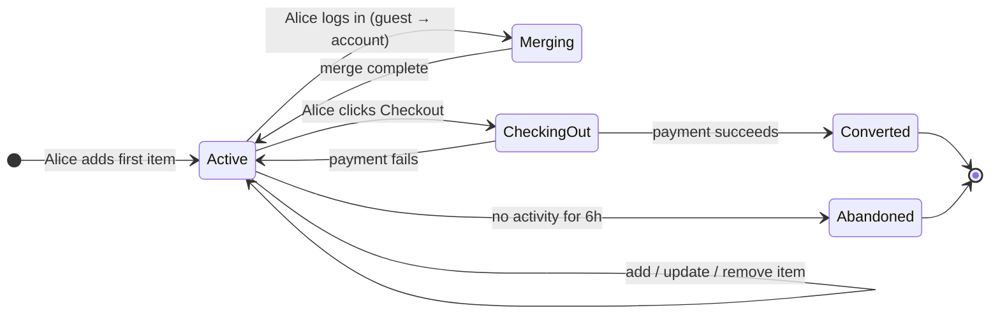

Everything added later (Redis, Kafka, reservations, price drift) is a complication on top of this one diagram.

> **Take this with you.** A cart is a small state machine per user. The interesting part is not the state machine. It is what happens between Active and Converted.

---

## Step 2: Ask the right questions

In a real interview, write down your questions before drawing anything. Not twenty. Five good ones that change the design.

<details markdown="1">
<summary><b>Show: 5 questions that change the design</b></summary>

1. **Guests or login only?** Can someone add items without an account? Almost every real shop says yes. This single answer decides whether you need merge logic at login. *Almost always: yes, guests can add.*

2. **How long does a cart live?** One hour? One day? Thirty days? A short cart can live in Redis with a TTL. A thirty-day cart needs Postgres as the source of truth, because Redis is not a durable store.

3. **Multi-device sync?** If Alice adds a shoe on her phone, does she see it on her laptop five minutes later? If yes, the cart must live on the server. A cookie in the browser will not work across devices.

4. **What does "in stock" mean?** Three very different options:
   - Hold it for Alice for 15 minutes (soft reservation)
   - Show her the last-known state and re-check at checkout (optimistic)
   - Accept the order and sort it out later (no check)
   These three options lead to three different architectures.

5. **Who does the checkout?** Does the cart service complete the purchase, or does it hand off a frozen snapshot to an order service? The answer changes who owns the inventory decrease and the payment call.

A strong candidate also asks: *"Is sending notifications part of this service, or a separate one?"* The cart emits events. A notification service consumes them. Keep those two things apart.

</details>

---

## Step 3: How big is this thing?

Same shop, two very different sizes.

| Company | Visitors/day | Carts/day | Writes/sec | Reads/sec | Active now |
|---------|--------------|-----------|------------|-----------|------------|
| Small shop | 500 | 150 | ~0.003 | ~0.06 | ~50 |
| Big shop (1M users) | 1,000,000 | 300,000 | 7 (peak 21) | 115 (peak 350) | ~25,000 |

<details markdown="1">
<summary><b>Show: how the numbers come out</b></summary>

Assume 30% of visitors add at least one item. Average cart: 3 items, edited twice.

**Small shop (500 visitors/day):**
- Carts: 500 × 30% = 150/day
- Cart writes: 150 × 2 edits = 300/day → **0.003/sec**
- Cart icon reads: 500 visitors × 10 page views = 5,000/day → **0.06/sec**
- Active carts: 150 carts × average life of ~8h / 24h ≈ **50 open at any moment**
- Storage: 150 × 3 items × 200 bytes ≈ 90 KB/day. One year: ~33 MB.

**Big shop (1M visitors/day):**
- Carts: 300,000/day → **3.5/sec** steady, **10/sec** at peak
- Cart writes: 600,000/day → **7/sec** steady, **21/sec** at peak
- Cart icon reads: 1M × 10 page views = 10M/day → **115/sec** steady, **350/sec** at peak
- Active carts: 300,000 × 30-day TTL / 30 ≈ **25,000 open at any moment**
- Storage: 300k carts × 3 items × 200 bytes ≈ 180 MB/day. One month of live carts: ~5.5 GB.

**The number that matters:** writes are tiny even at 1M users. A single Postgres handles 20 writes/sec without breathing hard. The real challenge is the cart icon read on every page: 350/sec at peak, with a tight latency requirement. That is the bottleneck.

| Metric | At 1M users |
|--------|-------------|
| Writes/sec | ~21 peak. Any database handles this. |
| Reads/sec | ~350 peak. This is the real challenge. |
| Storage | ~7 GB live. Nothing. |
| Real bottleneck | Cart icon read on every page. Not the buy button. |

</details>

> **Take this with you.** The cart is a read-heavy problem disguised as a write problem. Optimize the cart icon read, not the add-item write.

---

## Step 4: The smallest thing that works

Forget scale. We are a 10-person startup. Logged-in only. One Postgres table. One server.

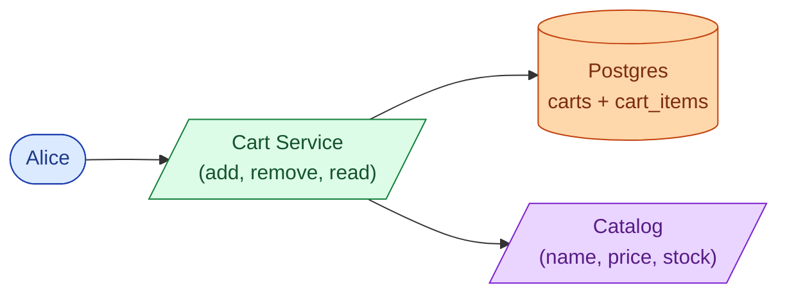

Alice adds a shoe. Here is the full sequence.

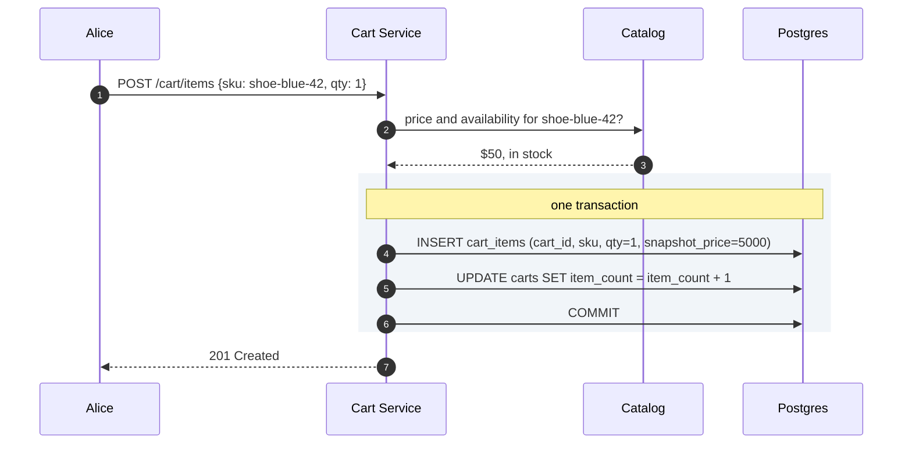

<details markdown="1">
<summary><b>Show: the two tables</b></summary>

```sql
CREATE TABLE carts (
    cart_id     UUID PRIMARY KEY,
    user_id     BIGINT,
    cart_token  UUID,
    status      TEXT NOT NULL DEFAULT 'active',
    item_count  INT NOT NULL DEFAULT 0,
    created_at  TIMESTAMPTZ NOT NULL DEFAULT NOW(),
    updated_at  TIMESTAMPTZ NOT NULL DEFAULT NOW(),
    expires_at  TIMESTAMPTZ
);

CREATE TABLE cart_items (
    cart_id              UUID NOT NULL REFERENCES carts(cart_id),
    sku                  TEXT NOT NULL,
    qty                  INT NOT NULL CHECK (qty > 0 AND qty <= 99),
    snapshot_price_cents INT NOT NULL,
    added_at             TIMESTAMPTZ NOT NULL DEFAULT NOW(),
    PRIMARY KEY (cart_id, sku)
);
```

`item_count` is denormalized on the `carts` row. The cart icon on every page only needs that one number. One row read, no JOIN, no catalog call.

`snapshot_price_cents` records what the price was when Alice added the item. If the price changes tomorrow, the audit trail still shows what she saw.

</details>

> **Take this with you.** Two tables and a stateless service carry the whole product for the first thousand users. The interesting work starts when something breaks.

---

## Step 5: The first crack

Everything above works fine for logged-in users. Marketing then asks: *"Can guests add items without signing in? Most competitors do that."*

You look at your code. You have `user_id` everywhere. For guests there is no user_id yet.

The fix: give guests a `cart_token`, a random UUID stored in a browser cookie. The cart lives on the server, keyed by that token instead of a user ID. The cookie just points at the row.

Now a new problem surfaces. Alice builds a guest cart with 3 shoes over 20 minutes. She logs in. She already had 2 shoes saved in her account from last week.

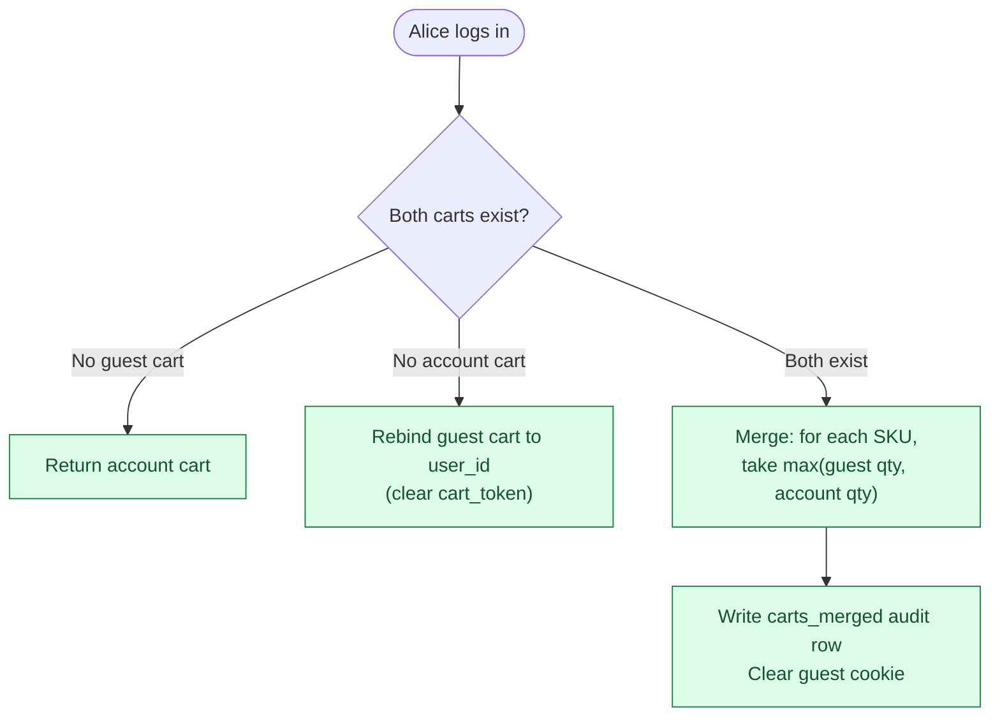

The quantity rule matters: if the guest cart has 2 of shoe-A and the account cart has 1, the user almost certainly wants 2, not 3. Summing would surprise them. **Take the max, not the sum.**

<details markdown="1">
<summary><b>Show: the merge in code</b></summary>

```python
def merge_carts(anonymous_token, user_id):
    with db.transaction(isolation="serializable"):
        anon_cart = db.fetch_cart(cart_token=anonymous_token, lock=True)
        user_cart = db.fetch_cart(user_id=user_id, lock=True)

        if anon_cart is None:
            return user_cart

        if user_cart is None:
            db.update(anon_cart.id, user_id=user_id, cart_token=None)
            audit_merge(user_id, anonymous_token, rule="rebind")
            return db.fetch_cart(user_id=user_id)

        merged = {item.sku: item.copy() for item in user_cart.items}
        trimmed = []
        for item in anon_cart.items:
            if not catalog.is_available(item.sku):
                trimmed.append(item.sku)
                continue
            if item.sku in merged:
                merged[item.sku].qty = min(
                    max(item.qty, merged[item.sku].qty), MAX_QTY_PER_ITEM
                )
            else:
                if len(merged) >= MAX_CART_ITEMS:
                    trimmed.append(item.sku)
                    continue
                merged[item.sku] = item

        db.replace_items(user_cart.id, merged.values())
        db.delete(anon_cart.id)
        audit_merge(user_id, anonymous_token, rule="qty:max", trimmed=trimmed)
        return db.fetch_cart(user_id=user_id)
```

Four things that look small but are not:

1. **Serializable isolation.** Alice double-clicks Log In. Two merge calls race. The second finds the guest cart already deleted and does nothing. No duplicate merge.
2. **Audit always written.** Whether rebind, merge, or no-op, write a row to `carts_merged`. When Alice emails support "my cart is wrong after I logged in," you have the answer.
3. **Discontinued items skipped silently.** Show a banner: "Some guest cart items are no longer available."
4. **Cookie cleared after merge.** The response sets `Set-Cookie: cart_token=; Max-Age=0`. Otherwise the next page load tries to merge again.

</details>

> **Take this with you.** The merge on login is where most cart designs break. Max-qty rule, one transaction, audit row, clear the cookie.

---

## Step 6: Build the architecture, one layer at a time

We have a guest-capable cart with merge. Now grow it. Add **one layer at a time**, one reason per layer.

### v1: just the service

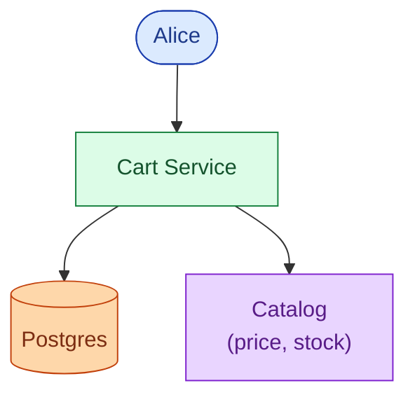

Fine for 100 users.

### v2: inventory is a separate team

The catalog now splits into two: a Catalog service (name, image, price) and an Inventory service (stock level). Different teams own them. The cart reads from both in parallel on every cart page load.

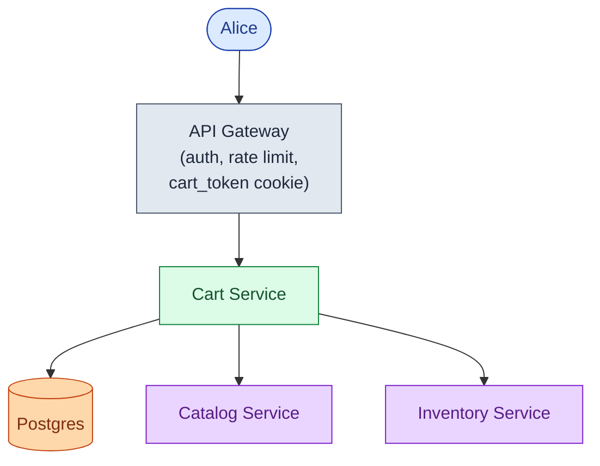

### v3: the cart icon read starts hurting

Cart icon reads at 350/sec show up in slow query logs. Add Redis. Active carts live as a hash per user. The cart service writes through to Postgres and caches in Redis. Icon reads hit Redis first.

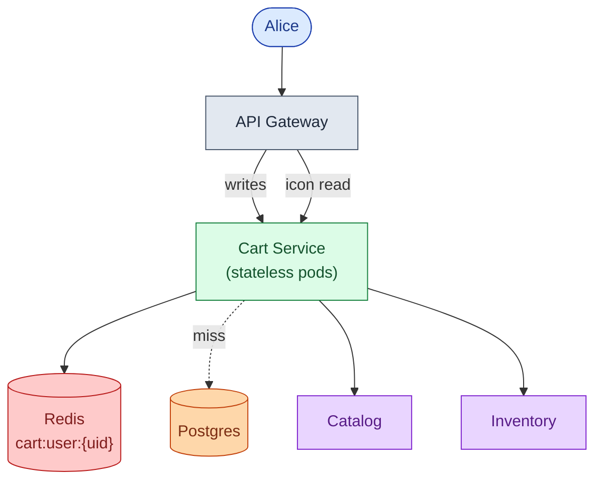

### v4: downstream teams want cart events

Marketing wants abandoned-cart emails. Analytics wants the funnel. Fraud wants to see add patterns. These should not slow the write path. Add Kafka. Cart events flow out; consumers subscribe.

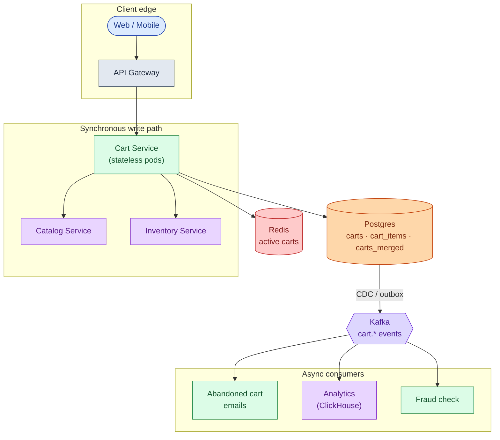

Each box, in one line:

| Box | What it does |
|-----|--------------|
| **API Gateway** | Authenticates the caller, hands out `cart_token` cookies for guests. |
| **Cart Service** | Stateless. Owns merge logic, size limits, price snapshot. |
| **Catalog Service** | Returns name, image, current price for each SKU. |
| **Inventory Service** | Returns stock availability. Cart reads it; never writes to it. |
| **Postgres** | Source of truth. Durable. Small (7 GB at 1M users). |
| **Redis** | Fast cache for active carts. The icon read lives here. |
| **Kafka** | Carries cart events to any team that wants them. |
| **Abandoned cart, Analytics, Fraud** | Consumers. Not on the write path. If one dies, carts still work. |

> **Take this with you.** If the abandoned-cart emailer dies at 3 a.m., new add-to-carts still flow. Emails just queue up. Anything reactive lives after Kafka, not before.

---

## Step 7: One add-to-cart, end to end

Alice adds a shoe. Watch what happens.

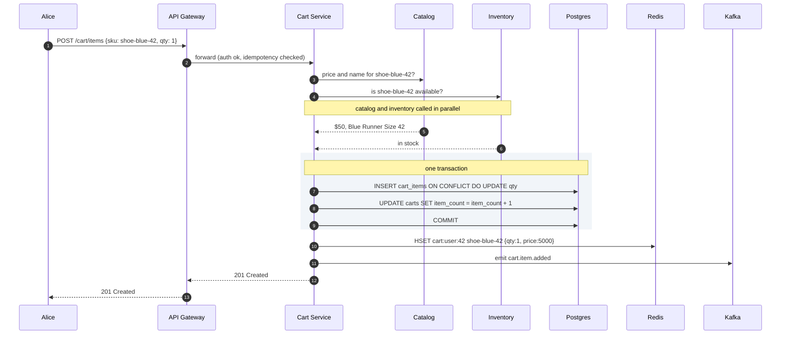

Three details worth naming:

1. Catalog and inventory are called **in parallel**. Total latency is `max(catalog, inventory)`, not the sum. Free speedup.
2. The DB write and the `item_count` update are **one transaction**. Crashes mid-write roll back cleanly.
3. Redis is written **after** the commit. If Redis fails, Postgres has the truth.

---

## Step 8: Inventory check at checkout

The cart tells Alice a shoe is in stock when she adds it. Twenty minutes later she clicks Buy. The shoe is gone. Someone else took the last pair.

Three approaches. None is perfect.

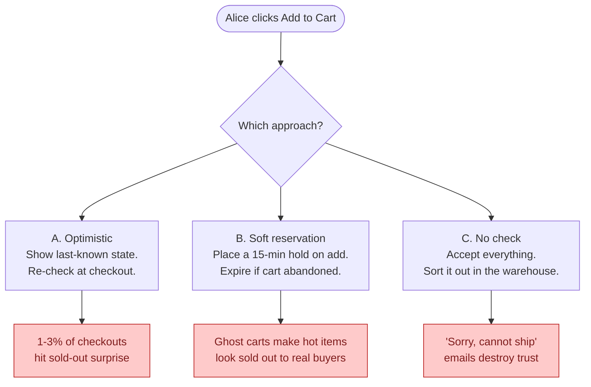

<details markdown="1">
<summary><b>Show: comparison table and recommendation</b></summary>

| Approach | Normal case | Failure mode | Cost to build | Right for |
|----------|-------------|--------------|---------------|-----------|
| **A. Optimistic** | Works. Checkout re-checks. | 1-3% of checkouts find the item gone last-second. | Low. | Default for most shops. |
| **B. Soft reservation** | User never sees "sold out" mid-checkout. | Ghost carts hold inventory. Hot items show "sold out" to real buyers. | High. Inventory needs hold/release/expiry logic. | Concert tickets, limited sneaker drops. |
| **C. No check** | Always accepts. | "Cannot ship, here is your refund." | Near zero. | Pre-orders, print-on-demand. |

**Recommendation: optimistic by default. Reservation only for explicitly flagged SKUs.**

Industry abandonment rates are 60-70%. If every add-to-cart held inventory for 15 minutes, ghost carts would make real inventory look empty. That is right for a Taylor Swift concert. Wrong for shoes.

The division of responsibility:
- **On add to cart:** read-only inventory check. Show the user what we believe. No writes.
- **On cart page load:** re-read, cached for ~30 seconds.
- **On checkout:** the Order Service does the authoritative `try_reserve(sku, qty)`. If it fails, no order and no charge.

The cart's job is to show good information. The Order Service's job is to make the buy real.

</details>

> **Take this with you.** The cart shows what is probably true. The Order Service makes it actually true. Never conflate the two.

---

## Step 9: Price drift

Alice added shoe-blue-42 at $50 last Tuesday. Today the price is $55. She goes to checkout.

What does she pay? What does she see?

The rule most shops use:

- Show the **current price** in the cart, with a small note: "was $50 when added."
- Charge the current price at checkout.
- If the difference passes a threshold (10% or $5, whichever is smaller), **require the user to confirm** before payment.

Why confirm? EU consumer law requires it. And a silent $10 price bump on a $50 item is a bad surprise that generates chargebacks.

The `snapshot_price_cents` column on `cart_items` stores what Alice saw when she added. The current price comes from the Catalog service on every read. The UI shows both. Analytics keeps both. The checkout confirmation captures both in the order record.

> **Take this with you.** Snapshot price is for trust and audit. Current price is what gets charged. Show both.

---

## Follow-up questions

Try to answer each in 2 or 3 sentences before opening the solution.

1. **Bots stuff a cart with 10,000 items.** What goes wrong? How do you stop it?

2. **Phone-to-laptop sync delay.** Alice adds a shoe on her phone. She opens her laptop 5 seconds later. The cart shows the old state. How long is acceptable? How do you fix it?

3. **Redis goes down mid-day.** All active carts are in Redis. What does the user see? How do you recover quietly?

4. **Price went up.** Alice added a shoe at $50 last week. Today it is $55. What does she pay? What does she see?

5. **Abandoned cart emails.** You want to email shoppers 6 hours after their last activity. How do you find those carts without scanning every cart every minute?

6. **Anonymous carts pile up.** When do you delete them? What happens if a user comes back after 90 days with the old cookie?

7. **Two people share an account.** Both log in from different cities. Both add items at the same time. What happens?

8. **Currency switch.** Alice adds a shoe priced in USD. She switches the site to EUR. What happens to her cart?

9. **Item becomes restricted.** Alice added a legal item. A new regulation restricts shipping it to her state. She goes to checkout. What does the system do?

10. **Save for later.** Alice wants to move an item from her cart to a wishlist. Is this the cart's job? Where does the wishlist live?

---

## Related problems

- **[Approval Management (011)](../011-approval-management/question.md).** Same patterns: state per user, event stream on changes, audit table on merge. The `carts_merged` table is the same idea as the approval audit log.
- **[Coupon Redemption (014)](../014-coupon-redemption/question.md).** The cart holds a coupon code. The coupon service decides if it is valid. Same service boundary as inventory.
- **[Read-Heavy System Patterns (017)](../017-read-heavy-patterns/question.md).** The cart icon read on every page is a classic read-heavy load. The Redis-plus-DB pattern applies directly.
- **[Write-Heavy System Patterns (018)](../018-write-heavy-patterns/question.md).** The Kafka event stream for analytics is write-heavy at scale.
- **[Help Desk Ticketing (019)](../019-helpdesk-ticketing/question.md).** "My cart is wrong" support tickets need the `carts_merged` audit table to answer.


<div class="pr-solution-divider"></div>


## Solution: Shopping Cart Service

### The short version

A shopping cart is a small amount of mutable state per user. You add items, change quantities, and eventually buy or leave. The state machine is trivial. What makes the design interesting is three specific problems:

1. Where does the cart live when a guest becomes a logged-in user, and what survives the merge?
2. What does "in stock" mean when stock changes every second, and whose job is the guarantee?
3. How do you serve the cart icon on every page at 350 reads per second without hammering the database?

The answers: Postgres as source of truth, Redis as a fast layer for icon reads, Kafka for downstream teams, and a careful merge algorithm at login. Scale is not the hard part. At 1 million users the whole site generates about 20 cart writes per second. The hard part is the 350 reads per second on the icon, plus the merge logic, the price drift policy, and the inventory handoff boundary.

---

### 1. The two questions that matter most

**Guests or login only?** If guests can add without an account, you need a `cart_token` cookie, a guest-to-logged-in merge endpoint, and an audit table for what changed. If it is login-only, you skip all of that.

**What does "in stock" mean?** Optimistic (show last-known, re-check at checkout), soft reservation (hold on add), or no check? This single decision changes how inventory and checkout interact. The right default is optimistic, with reservation only for explicitly flagged SKUs.

Everything else (cart size limits, price drift policy, abandoned-cart detection) follows from these two answers.

---

### 2. The math, in plain numbers

| Scale | Carts/day | Writes/sec | Icon reads/sec | Active now | Storage |
|-------|-----------|------------|----------------|------------|---------|
| Small (500 DAU) | 150 | 0.003 | 0.06 | ~50 | 33 MB/year |
| Big (1M DAU) | 300,000 | 7 (peak 21) | 115 (peak 350) | ~25,000 | ~7 GB live |

What the numbers say:

- Writes are tiny even at 1M users. Postgres handles 21 writes/sec without effort.
- The icon read is the load to optimize. 350/sec with a <20 ms target is what pushes you to Redis.
- 25,000 active carts fit in Redis with room to spare (about 5 MB as lean hashes).
- The real bottleneck is not the cart at all. It is the Inventory service, which gets called on every cart page load.

---

### 3. The API

Five endpoints carry the whole product.

```
GET  /api/v1/cart
POST /api/v1/cart/items          Idempotency-Key: <uuid>
PATCH /api/v1/cart/items/{sku}   qty: 0 means remove
DELETE /api/v1/cart/items/{sku}
POST /api/v1/cart/merge          body: {"anonymous_token": "<uuid>"}
```

`GET /cart` returns a hydrated response: SKU + qty from Postgres/Redis, joined with name/image/current price from Catalog, and availability from Inventory. The join happens on the server. Never push it to the browser.

| Status code | Meaning |
|-------------|---------|
| 201 | Item added |
| 200 | Item already present, quantity updated |
| 400 | Quantity out of range or bad SKU |
| 404 | SKU does not exist |
| 409 | SKU is restricted (region, age gate) |
| 410 | SKU is discontinued |
| 422 | Cart is full (100-item limit) |

Load-bearing choices:

- **Idempotency-Key is required on writes.** A phone retries on flaky Wi-Fi. Without the key you get qty 2 when the user wanted 1.
- **Both snapshot price and current price return on every read.** Snapshot is what Alice saw when she added. Current is what she pays. Show both. Audit needs both.
- **Checkout returns a session token, not an order.** The cart does not clear until the Order Service confirms payment. If payment fails, the cart is intact.

---

### 4. The data model

Three tables: two for live data, one for audit.

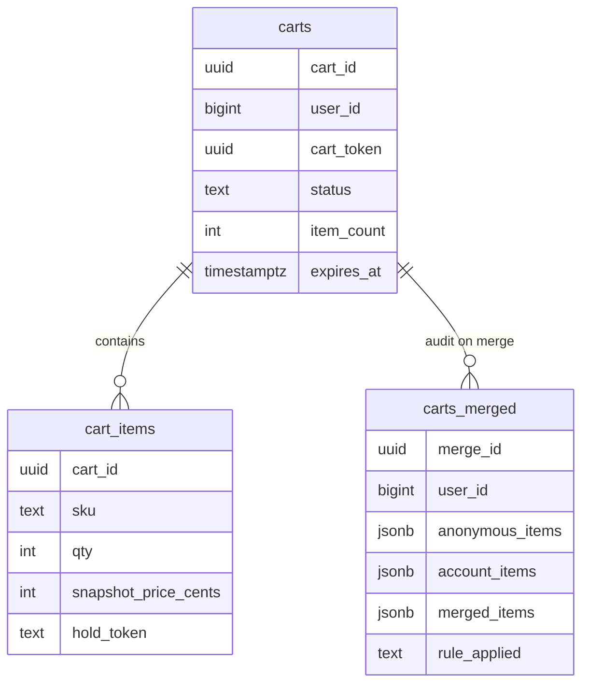

<details markdown="1">
<summary><b>Show: the full SQL</b></summary>

```sql
CREATE TABLE carts (
    cart_id          UUID PRIMARY KEY,
    user_id          BIGINT,
    cart_token       UUID,
    status           TEXT NOT NULL DEFAULT 'active',
    item_count       INT NOT NULL DEFAULT 0,
    created_at       TIMESTAMPTZ NOT NULL DEFAULT NOW(),
    updated_at       TIMESTAMPTZ NOT NULL DEFAULT NOW(),
    expires_at       TIMESTAMPTZ,
    CHECK ((user_id IS NULL) <> (cart_token IS NULL))
);

CREATE UNIQUE INDEX idx_carts_user
    ON carts (user_id) WHERE status = 'active' AND user_id IS NOT NULL;
CREATE UNIQUE INDEX idx_carts_token
    ON carts (cart_token) WHERE status = 'active' AND cart_token IS NOT NULL;
CREATE INDEX idx_carts_abandonment
    ON carts (updated_at) WHERE status = 'active';

CREATE TABLE cart_items (
    cart_id              UUID NOT NULL REFERENCES carts(cart_id) ON DELETE CASCADE,
    sku                  TEXT NOT NULL,
    qty                  INT NOT NULL CHECK (qty > 0 AND qty <= 99),
    snapshot_price_cents INT NOT NULL,
    added_at             TIMESTAMPTZ NOT NULL DEFAULT NOW(),
    updated_at           TIMESTAMPTZ NOT NULL DEFAULT NOW(),
    hold_token           TEXT,
    PRIMARY KEY (cart_id, sku)
);

CREATE INDEX idx_cart_items_sku ON cart_items (sku);

CREATE TABLE carts_merged (
    merge_id          UUID PRIMARY KEY,
    user_id           BIGINT NOT NULL,
    anonymous_token   UUID,
    anonymous_items   JSONB NOT NULL,
    account_items     JSONB NOT NULL,
    merged_items      JSONB NOT NULL,
    rule_applied      TEXT NOT NULL,
    trimmed_items     JSONB,
    occurred_at       TIMESTAMPTZ NOT NULL DEFAULT NOW()
);

CREATE INDEX idx_merged_user ON carts_merged (user_id, occurred_at DESC);
```

</details>

Four choices worth defending:

**The CHECK constraint** enforces that exactly one of `user_id` or `cart_token` is set. A cart is either owned or guest. After merge, the guest row is deleted.

**`item_count` is denormalized.** The cart icon on every page needs one number. One row read, no JOIN, no catalog call. Updated in the same transaction as item changes so it never goes stale.

**`snapshot_price_cents` on cart_items.** Each item records the price when it was added. The total is computed fresh at checkout from current prices. The snapshot is for display and audit.

**`carts_merged` has no business logic in it.** It is a record of what happened. Every merge writes a row: what was in each cart, what the rule was, what was trimmed. When a user emails support, you have the answer.

Why Postgres and not DynamoDB? Merging two carts is one transaction. Removing an item and releasing its inventory hold is one transaction. The data is small (7 GB at 1M users). ACID matters here. Postgres gives all of it in one box.

---

### 5. The merge algorithm

This is where most cart designs break. The full algorithm:

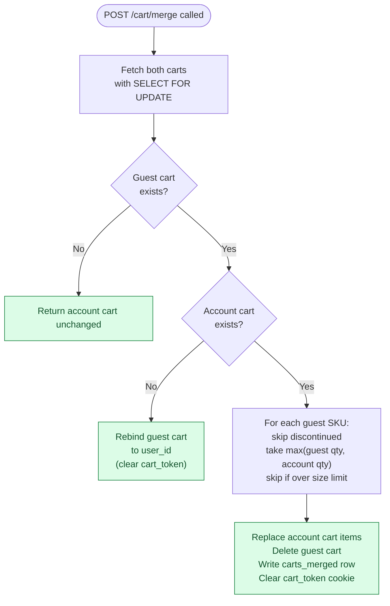

<details markdown="1">
<summary><b>Show: the merge in code</b></summary>

```python
def merge_carts(anonymous_token, user_id):
    with db.transaction(isolation="serializable"):
        anon_cart = db.fetch_cart(cart_token=anonymous_token, lock=True)
        user_cart = db.fetch_cart(user_id=user_id, lock=True)

        if anon_cart is None:
            return user_cart

        if user_cart is None:
            db.update(anon_cart.id, user_id=user_id, cart_token=None)
            audit_merge(user_id, anonymous_token, rule="rebind")
            invalidate_redis(anonymous_token, user_id)
            return db.fetch_cart(user_id=user_id)

        merged = {item.sku: item.copy() for item in user_cart.items}
        trimmed = []
        for item in anon_cart.items:
            if not catalog.is_available(item.sku):
                trimmed.append({"sku": item.sku, "reason": "discontinued"})
                continue
            if item.sku in merged:
                merged[item.sku].qty = min(
                    max(item.qty, merged[item.sku].qty), MAX_QTY_PER_ITEM
                )
            else:
                if len(merged) >= MAX_CART_ITEMS:
                    trimmed.append({"sku": item.sku, "reason": "size_limit"})
                    continue
                merged[item.sku] = item

        db.replace_items(user_cart.id, merged.values())
        db.delete(anon_cart.id)
        audit_merge(user_id, anonymous_token, rule="qty:max", trimmed=trimmed)
        invalidate_redis(anonymous_token, user_id)
        return db.fetch_cart(user_id=user_id)
```

</details>

Three things make this safe:

- **Serializable isolation.** Alice double-clicks Log In. Two merge calls race. The second finds the guest cart deleted and returns the account cart unchanged.
- **Audit always written.** Storage is cheap. Support tickets are not.
- **Cookie cleared after merge.** Response sets `Set-Cookie: cart_token=; Max-Age=0`. No re-merge on next page load.

The classic mistake: doing the merge in the browser. The browser does not know the account cart, cannot enforce limits, and cannot run a transaction. Always server-side.

---

### 6. The architecture

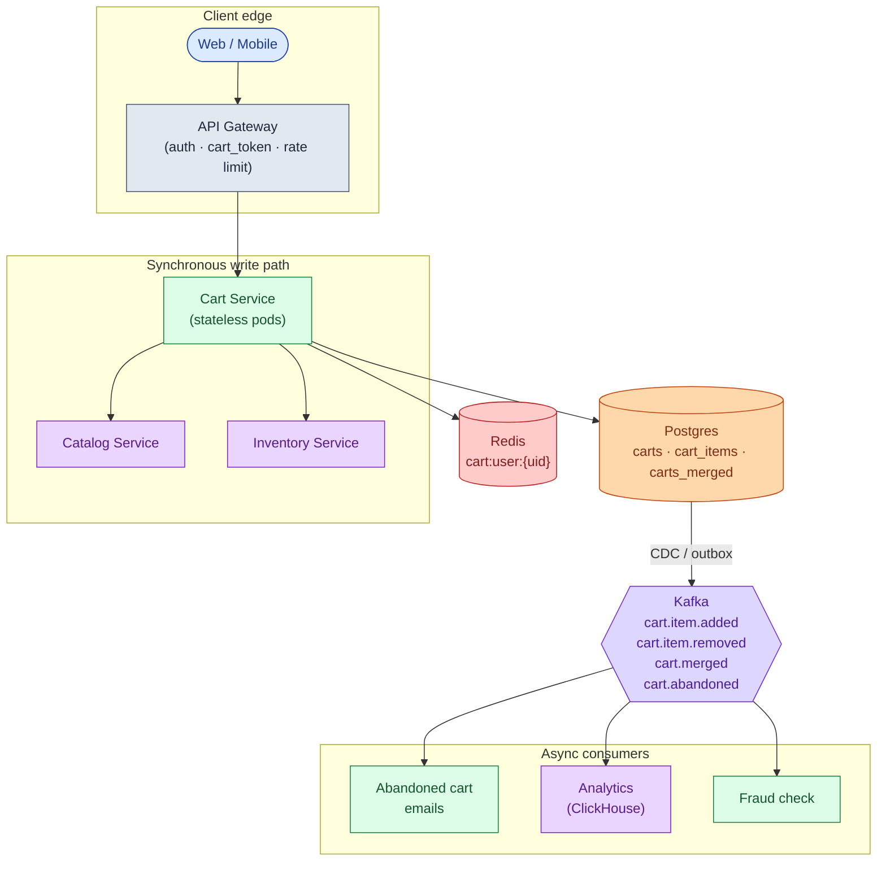

Five things to notice:

- The cart service never **writes** to inventory. It reads. The inventory decrease happens at checkout in the Order Service. An inventory outage does not break add-to-cart.
- Catalog and inventory are called in **parallel** on cart read. Latency is `max(catalog, inventory)`, not the sum.
- Redis holds the compact cart (SKU + qty + snapshot_price). Catalog and inventory results are not cached there; they change too fast.
- Postgres is still source of truth. Redis is an accelerator. If Redis loses data, Postgres can repopulate it.
- Notifications, analytics, fraud sit downstream of Kafka. If any of them dies, carts still work.

---

### 7. A request, end to end

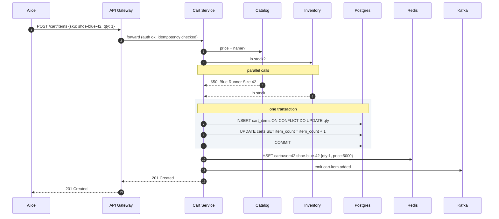

Target latencies:

| Operation | P99 |
|-----------|-----|
| Cart icon count | ~20 ms (Redis hit, one field read) |
| Full cart read | ~80 ms (parallel catalog + inventory hydration) |
| Add item | ~150 ms (inventory round-trip is the bottleneck) |

The icon count is fast because `item_count` is denormalized on the `carts` row. One Redis field. No JOIN. No catalog call.

---

### 8. Inventory strategy

Three options. The right default is optimistic.

| Option | Failure mode | Build cost | Use when |
|--------|--------------|------------|----------|
| **Optimistic** (re-check at checkout) | 1-3% of checkouts find item gone last-second | Low | Default for most shops |
| **Soft reservation** (hold on add, TTL expiry) | Ghost carts make real stock look empty | High | Concert tickets, limited drops |
| **No check** (accept all, sort in warehouse) | "Cannot ship, refund coming" email | Near zero | Pre-orders, print-on-demand |

The division of responsibility matters. The cart's job is to show good information. The Order Service's job is to make the buy real. Never put the guarantee in the cart.

For SKUs the catalog flags `requires_reservation=true`, the cart calls the Inventory service to place a TTL hold and stores the `hold_token` on the `cart_items` row. The hold is released if the user removes the item, the TTL expires, or checkout converts it to a real purchase.

---

### 9. The scaling journey: 10 users to 1 million

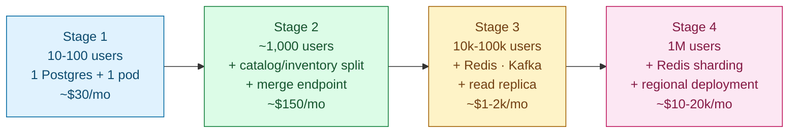

#### Stage 1: 10 to 100 users

One Postgres, one app instance. Cart and catalog in the same app. Guest carts use a `cart_token` cookie. No Redis, no Kafka, no abandonment emails. Inventory is a SELECT on the products table. Ships in three days.

You see ten carts a day. Postgres is not working. Anything more is over-engineering.

#### Stage 2: 1,000 users

Marketing wants abandoned-cart emails (highest-ROI campaign in e-commerce). The catalog deserves its own service. People want phone-to-laptop sync.

Split inventory and catalog into their own services. Build the merge endpoint and the `carts_merged` audit table. Add a nightly job that finds carts inactive for >6h and queues emails. Enforce size limits. Still no Redis, still no Kafka. One Postgres read replica handles all reads.

#### Stage 3: 100,000 users

Several things break at once:

- Cart icon reads (~12/sec) appear in slow query logs.
- Cart page load is slow because each load joins with catalog over HTTP for 5+ items.
- A flash sale on a limited sneaker shows "available" to 5,000 users when 100 pairs remain.
- Inventory has a 30-second blip. Every cart add fails because the service blocks on it.

Fixes in order: Redis as cart cache (write-through, 95%+ hit rate). Inventory check becomes best-effort with a fallback to "show as available, confirm at checkout." Reservation only for flagged SKUs. Kafka replaces the polling pattern. Postgres read replica for cart reads on Redis miss. Nightly GC deletes expired anonymous carts.

#### Stage 4: 1 million users

New problems:

- Redis single-node failure means 25,000 empty carts for ten seconds.
- Write contention on `item_count` update surfaces under load.
- A bot adds 50 items/second across thousands of guest carts, hammering inventory.
- EU expansion requires regional data storage.

Shard Redis by `hash(user_id) % N`, one primary and one replica per shard. Rate-limit add-to-cart per IP and per `cart_token`. Regional deployment for EU with a local Redis and a Postgres replica. Async checkout pipeline: cart emits a frozen snapshot to Kafka, Order Service handles payment and the atomic reserve, user polls.

The cart itself is comfortable at this point. The bottleneck moves to inventory and checkout.

---

### 10. Reliability

**Redis dies mid-day.** Cart reads fall through to Postgres at ~80 ms instead of ~20 ms. Users notice slightly slower pages. Nobody loses their cart because Postgres is the truth. On recovery, the first read for each user repopulates Redis. A circuit breaker switches to "DB only" mode after N Redis failures. `cart.redis.hit_rate` drops to 0. Alert fires.

**Postgres primary dies.** Standard failover (30-60 seconds). Writes return 503 with `Retry-After`. Reads continue from replicas. After recovery, queued writes retry.

**Inventory service goes down.** Cart shows last-known availability or a "confirm at checkout" badge. Cart adds continue. More users hit a sold-out surprise at checkout during the outage. Acceptable.

**Checkout starts and payment fails.** The Order Service handles it. The cart does NOT clear until it gets a `cart.converted` event. Payment failure emits `cart.checkout_failed`. Any holds release. User edits and retries.

**Race between remove-item and checkout starting.** Checkout took a frozen snapshot of the cart. The removal hits the live cart but does not affect the in-flight checkout. If checkout succeeds, snapshot items are bought. The live cart (minus purchased items) remains.

---

### 11. Observability

| Metric | Why it matters |
|--------|----------------|
| `cart.icon_count.p99` | Tightest SLO. Runs on every page. Alert at >40 ms. |
| `cart.read.p99` | Cart page load. Alert at >200 ms. |
| `cart.write.p99` | Spike means DB contention is back. |
| `cart.redis.hit_rate` | Should be >95%. Drop means shard imbalance or repopulation storm. |
| `cart.merge.rate` | Spike means auth is broken and re-merging every request. |
| `cart.merge.size_trimmed.rate` | Non-zero often means the size limit is too low. |
| `inventory.check.timeout_rate` | Drives the fallback path frequency. |
| `cart.abandonment.rate` | Marketing's headline. Alert on >20% sudden shift. |
| `cart.size.p99` | Bot signal if p99 > 50 items. |
| `kafka.cart_events.consumer_lag` | If this grows, abandonment emails stop arriving. |
| `db.replication_lag.p99` | Read replicas must stay under 1 second. |

Page on: `cart.icon_count.p99` > 40 ms for 5 min, `redis.hit_rate` < 80% for 5 min, `kafka.lag` > 5 min, cart write error rate > 2%.

Ticket on: merge rate or size-trimmed rate sudden spike, inventory timeout rate > 5%.

---

### 12. Follow-up answers

**1. Bots stuffing a cart with 10,000 items.**

Hard size limits (100 items, 99 qty per SKU) as a 422 response. Rate limit `POST /cart/items` at 30/min per IP and 60/min per logged-in user. WAF rules at the edge for known bot user-agents. Shorter TTL for guest carts created from IPs that never load a product page. For determined attackers, push detection upstream: CAPTCHA on suspicious checkout patterns, account-level fraud scoring.

**2. Phone-to-laptop sync delay.**

The phone's add writes to Postgres and Redis immediately. The laptop's next page load sees the new state. No push happens. Acceptable: visible on next interaction. If the cart page is already open on the laptop, it shows stale data until refresh. To make it live: a WebSocket per user pushing `cart.item.added` events. More infrastructure, marginal UX win. Most shops skip it.

**3. Redis dies mid-day.**

Circuit breaker switches the cart service to "DB only" mode after N Redis failures. Cart reads fall through to Postgres at ~80 ms. Users see slightly slower pages; nobody loses cart contents. On recovery, the first read for each user repopulates Redis via a cache-miss path. The `cart.redis.hit_rate` metric drops to 0 and alerts fire. Do not try to serve stale data from anywhere else. Postgres is the truth.

**4. Price went up.**

Cart page shows current price ($55) with a note "was $50 when added." At checkout, if the difference passes the threshold (10% or $5, whichever is smaller), the response includes `price_change_acknowledgement_required: true`. The UI shows a banner. The user clicks "Confirm." The second checkout call carries `price_change_acknowledged: true`. The order record captures both prices. What they pay: always current. The snapshot is for display and audit only.

**5. Abandoned cart detection.**

Naive scan of all active carts every minute is slow at 100k+ carts. Right approach: time-window batching.

<details markdown="1">
<summary><b>Show: the abandonment query</b></summary>

```sql
SELECT cart_id, user_id FROM carts
WHERE status = 'active'
  AND user_id IS NOT NULL
  AND updated_at >= NOW() - INTERVAL '6 hours 15 minutes'
  AND updated_at <  NOW() - INTERVAL '6 hours'
  AND NOT EXISTS (
    SELECT 1 FROM cart_abandonment_emails
    WHERE cart_id = carts.cart_id
  );
```

This touches only carts that just crossed the 6-hour threshold. The partial index on `(status, updated_at)` makes it fast. For each result, emit `cart.abandoned` to Kafka. The notification service consumes and sends. Record in `cart_abandonment_emails` to prevent duplicates.

At scale, swap the SQL for a Redis sorted set of `cart_id` by `updated_at`. Pop expired entries every minute. More efficient, more moving parts.

</details>

**6. Anonymous carts pile up.**

Anonymous carts get a 30-day TTL (`expires_at = NOW() + 30 days`, refreshed on activity). A nightly GC job deletes expired guest rows. User returns after 90 days with the old cookie: the lookup returns nothing. The cart service issues a new token, sets the cookie, returns an empty cart. No error shown. If they log in: nothing to merge. Account cart loads normally.

**7. Shared account, simultaneous edits.**

Both sessions resolve to the same `cart_id` via the unique index on `(user_id) WHERE status = 'active'`. Adds use `INSERT ... ON CONFLICT (cart_id, sku) DO UPDATE SET qty = qty + ?`. Concurrent adds for the same SKU sum correctly (each is an explicit user action; sum is right here, unlike at merge). Removes use a plain DELETE; first-wins. Both users see each other's edits on next page load. Real-time push via WebSocket is a niche add-on, not the default.

**8. Currency switch.**

Cart stores `snapshot_price_cents` in the original transaction currency. Catalog returns prices in any requested currency at hydration time. When Alice switches to EUR, displayed prices recompute against the catalog's current EUR prices. The snapshot stays in the original currency. At checkout, Alice is charged in the displayed currency. The order record captures both currencies for accounting. Never silently change the expected total without showing the user.

**9. Item becomes restricted before checkout.**

On cart page load, catalog and inventory return availability as `restricted_in_region`. The cart service displays the item with a "cannot ship to your address" badge. The checkout button disables until the item is removed. If the user somehow reaches checkout: the Order Service re-checks every item against the shipping address. Restricted items appear in the error response. No payment is attempted. The user sees: "Some items in your cart cannot be shipped to this address."

**10. Save for later.**

Move-to-wishlist belongs to a Wishlist Service. The cart holds items to buy. The wishlist holds items to remember. The interaction: the UI calls `POST /wishlist/items {sku}` then `DELETE /cart/items/{sku}`. Two calls, not atomic. If the wishlist add succeeds and the cart delete fails, the item sits in both places (annoying, not broken). The UI retries the cart delete in the background. An alternative is one endpoint `POST /cart/items/{sku}/move_to_wishlist` that calls both internally. More cohesive UX. Couples two services. Fine for a small shop; larger shops usually keep them separate.

---

### 13. Trade-offs worth saying out loud

**Cookie vs DB vs Redis.** Cookie alone is too small (4 KB) and does not sync across devices. In-memory session does not scale past one server. DB alone gets slow on icon reads at scale. Redis+DB is right once DB reads appear in slow query logs. Start with DB-only. Add Redis when metrics demand it. Never Redis-only: you would lose durability.

**Optimistic vs reservation.** Reservation on every add-to-cart burns headroom for ghost carts (60-70% abandonment rate). Optimistic surprises 1-3% of buyers at the last checkout step. Mix: optimistic by default, reservation for explicitly marked SKUs. That is the senior answer.

**Sync vs async checkout.** Synchronous checkout is simpler but couples cart latency to payment and fulfillment. Asynchronous checkout (frozen snapshot → Kafka → Order Service) absorbs spikes and isolates failures. Trade-off: a "processing" page instead of instant confirmation. Sync is fine at small scale. Async is required on Black Friday.

**Why one cart per user, not many.** Some sites offer "birthday cart" or "work cart." Multiple carts add significant complexity (which is active? merge across them? share with family?). Build it only when customers ask. Most never do.

**Why Postgres and not DynamoDB.** ACID for merge and `ON CONFLICT` add. Analytical queries for abandonment detection. Small data volume. Postgres covers all three. DynamoDB would require a custom transaction layer for merge and a separate scan layer for abandonment.

**What you would revisit at 10M+ users.** Physical shard Postgres by `user_id`. Move from Redis-as-cache to Redis-as-source-of-truth for active carts with periodic Postgres flushes. Push cart logic to CDN-adjacent workers for sub-50 ms global reads. Pre-aggregate the abandonment funnel in ClickHouse so the cart service is not running analytics queries directly.

---

### 14. Common mistakes

**"Just store the cart in localStorage."** Misses multi-device sync, bot concerns, and the merge problem at login. Fine for the smallest demo. Loses the design problem.

**No merge discussion.** Second-most asked follow-up after inventory. Walk in with a stance: max-qty rule, one serializable transaction, audit row, clear the cookie.

**"Reservation on add to cart for everything."** A common junior answer. Then the interviewer asks about 60-70% abandonment, ghost holds, and the design unravels. The right answer is optimistic by default with named exceptions.

**Ignoring price drift.** "Whatever price is in the cart is what they pay" is wrong and sometimes illegal. Snapshot vs current, surface the difference, require confirmation at threshold.

**Checkout lives in the cart service.** Checkout is its own service: payment, address check, atomic inventory reserve, order creation, post-purchase events. Cart hands off via a frozen snapshot.

**Forgetting the icon read.** Every page loads the cart count. That endpoint dominates QPS. Denormalize `item_count`, put it in Redis, target <20 ms p99.

**Treating inventory as a hard dependency on add.** If inventory is down, add-to-cart should degrade gracefully, not fail. Show a "confirm at checkout" badge and move on.

**Designing for huge write throughput.** Even at 1M DAU you see ~20 writes/sec. Do not propose Cassandra because "carts are write-heavy." They are not.

**No audit trail on merge.** Without `carts_merged`, every "my cart is wrong after login" support ticket is unsolvable. Cheap to add. The data is irreplaceable.

The three signals that separate a strong answer from a generic CRUD answer: a confident merge policy, optimistic-by-default inventory with named exceptions, and explicit handling of price drift with acknowledgment at checkout.

