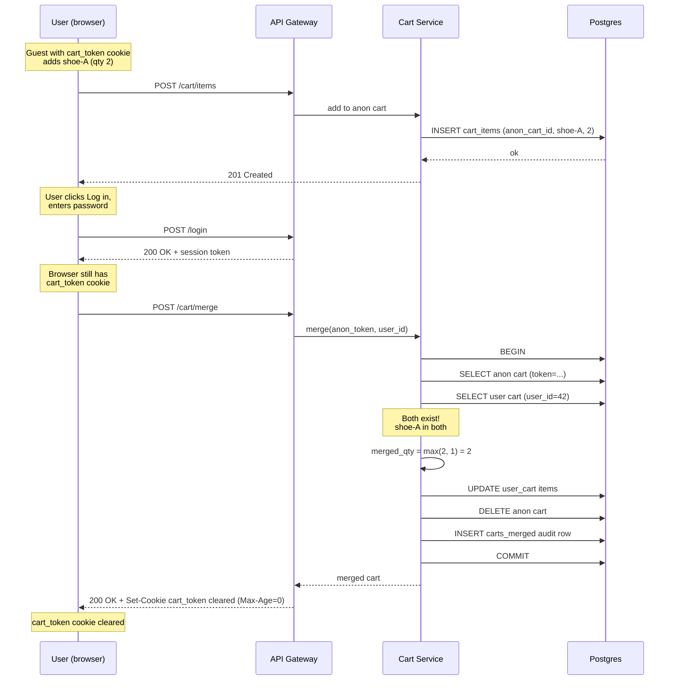
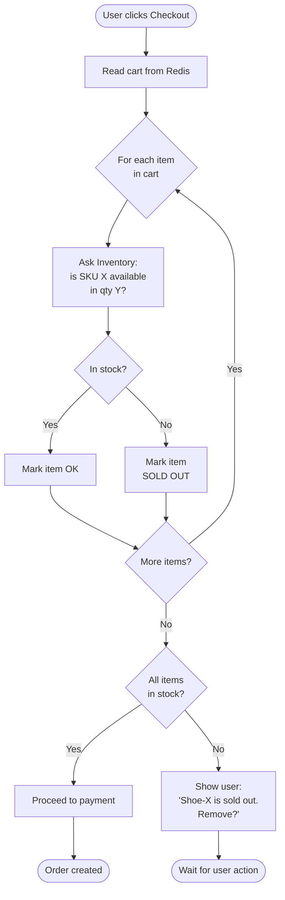


## The scene

You sit down for the interview. The interviewer turns their laptop toward you.

> *"We sell shoes online. Today we get about 500 customers a day. We want a shopping cart. You know the kind. You add items, change the count, leave for two hours, come back, and your stuff is still there. Build that. And we plan to grow."*

They smile. *"This one is easy. Or it should be."*

That smile is a warning.

A cart looks like a tiny project. Three buttons. One table. Done in a day. But the real work hides in places you do not see at first:

- Where does the cart actually live? In the browser? On the server? In a cookie? In a database?
- A guest user adds 3 items. Then they log in. They already had 2 items in their account from last week. What now?
- The cart says "in stock." Five minutes later, the user clicks Buy. Someone else just took the last one. What do you do?
- A million people use your site at once. The page must still load fast. How?

We will walk this from a 500-customer shop up to a 1-million-user marketplace. At each step, something will break. Naming what breaks is half the job.

A quick word about words: **SKU** means "stock keeping unit." It is just a code for one specific item. Like "blue-running-shoe-size-42" is one SKU. We will use SKU and "item" to mean the same thing.

---

## Step 1: Ask before you draw

Stop. Do not draw boxes yet.

Sit for 5 minutes. Write down the questions you would ask the interviewer.

A good answer is not 20 questions about every tiny detail. It is the small set of questions where a different answer would change your whole design.

<details markdown="1">
<summary><b>Show: 8 questions that change the design</b></summary>

1. **Guests or login only?** Can someone add items without an account? Almost every real site says yes. This one answer decides if you need merge logic at login.

2. **How long does a cart live?** One hour? One day? Forever? A short cart can live in memory. A forever cart needs a database.

3. **Phone and laptop both?** If I add a shoe on my phone, do I see it on my laptop too? If yes, the cart must live on the server. Cookies in the browser will not work.

4. **What does "in stock" mean?** Three options:
   - Reserved for me right now (hold it for 15 minutes)
   - You can see it, but anyone can buy it
   - Last we checked it was here, but we are not sure
   
   These are very different to build.

5. **Are there limits?** Can someone add 50,000 items to one cart? Bots will try. A normal limit is 100 different items, 99 of each.

6. **Price changed. Now what?** Item was $50 when added. Now it is $55. Which price does the user pay? Usually the new price, but you must show the user clearly.

7. **Coupons here or somewhere else?** Coupons are usually a different service. The cart just holds the code.

8. **Where does the cart end?** The cart stops when the user clicks "Place Order." After that, a new thing called an order takes over.

If you walked in asking only "how many users," you would miss the merge problem, the inventory problem, and the price problem. Those three are where the design actually lives.

> Why ask these first? Because if you start drawing boxes before you know the answers, you will draw the wrong boxes. The interviewer wants to see that you think before you build.

</details>

---

## Step 2: How big is this thing?

Same problem, two sizes. Do the math.

**Small shop today:**

- 500 visitors per day
- 30% add at least one item
- Average cart: 3 items, edited 2 times before buying
- 60% of carts are left without buying (this is normal for online shops)

**One million users:**

- 1 million visitors per day
- Same behavior
- Busy hour is 3 times the normal rate
- Logged-in carts last 30 days

Try to figure out these numbers for both sizes:

1. Cart writes per second
2. Cart reads per second (every page shows the cart icon with a number)
3. How many carts are open right now
4. How much disk space the carts need
5. Inventory checks per second at the busy hour

<details markdown="1">
<summary><b>Show: the math, plain numbers</b></summary>

**Small shop (500 users/day):**

- Carts made: 500 x 30% = 150 per day. About 6 per hour.
- Edits: 150 x 2 = 300 writes per day. About 0.003 per second. Tiny.
- Reads: ~10 page views per visit x 500 = 5,000 reads per day. About 0.06 per second.
- Open carts right now: about 50.
- Disk: 150 carts x 3 items x ~200 bytes = 90 KB per day. After one year, ~33 MB.

You could build this with one database table and one server. A laptop running at home could handle it.

**Big site (1 million users/day):**

- Carts made: 300,000 per day. About 3.5 per second normal, 10 per second at peak.
- Writes: 600,000 per day. About 7 per second normal, 21 per second at peak.
- Reads: 10 million page views x cart-icon-check = 10 million per day. About 115 per second normal, 350 per second at peak.
- Open carts right now: about 25,000.
- Disk: 300k x 30 days x 3 items x 200 bytes = ~5.5 GB. Plus headers. Total around 7 GB.
- Inventory checks at peak: ~400 per second.

**What does this tell us?**

| Thing | Even at 1M users |
|-------|------------------|
| Writes | Tiny (~20/sec). Any database handles this. |
| Reads | Big (~350/sec). This is the real challenge. |
| Storage | 7 GB. Nothing. |
| Real bottleneck | The inventory service getting hammered. |

> Why does this matter? Because the cart is not a "make it fast to write" problem. It is a "make reads fast" problem. The cart icon on every page is what kills you, not the buy button.

</details>

---

## Step 3: Where does the cart actually live?

This is the biggest question in cart design. Four places it could live. Each has a real trade-off.

The four options:

- **A. Cookie only.** Cart goes inside the browser cookie. Sent to server with every request.
- **B. Server memory.** Cart kept in the app server's RAM, keyed by session ID.
- **C. Database (Postgres).** Cart saved in a regular database table.
- **D. Database + Redis.** Postgres holds the truth. Redis is a fast cache in front.

For each option, think about: who can read it, what happens on a new device, what happens if the server restarts, and what it costs.

<details markdown="1">
<summary><b>Show: the comparison table and the right answer</b></summary>

| Where | How it works | Good | Bad | Use when |
|-------|--------------|------|-----|----------|
| Cookie only | Cart written into a browser cookie | No server work. Survives server restart. | Cookie max size is ~4 KB (so ~30 items max). Sent on every request. No sync across devices. Lost if user clears cookies. | Small demo sites only |
| Server memory | Cart kept in app server RAM | Fastest reads. No outside system. | Lost on server restart. Breaks with more than one server. | Never in real life |
| Database (Postgres) | Cart saved in rows | Safe. Survives anything. Can run queries on it. | Database read on every cart-icon view. At 350 reads/sec, the DB feels it. | Default for small to medium sites |
| Redis cache + DB | Cart in Redis for speed. DB has the truth. Write to both. | Sub-millisecond reads. Scales well. DB still safe. | Two systems to keep in sync. More moving parts. | Right answer once you hit 10k+ daily users |

**The recommendation:**

- **Anonymous users (no login):** Cart on the server. The cookie holds only a small token (a UUID like `7f3a-...`). The token points to the cart row.
- **Logged-in users:** Cart on the server, keyed by user ID.
- **Backend:** Start with just Postgres. Add Redis when database reads start hurting (around 10k daily users).

> Why not cookie only? Cookies are tiny (4 KB max). They get sent on every request, so a fat cookie slows every page. They do not sync between phone and laptop. They die when the user clears cookies. The cookie is good only as a token (small UUID) pointing to the server-side cart.

> Why not server memory? Junior engineers love this because it is fast in their laptop tests. But the moment you add a second server, half the users see an empty cart on alternate page loads. Mention this answer just to dismiss it.

</details>

---

## Step 4: Draw the system

Try to fill in the blanks. Six boxes are missing. Think about:

- Who handles the user's request at the edge?
- Where does the cart live?
- What speeds up reads?
- Where is the source of truth?
- How do other systems hear about cart changes?
- Who tells the cart what is in stock?

```
                Client (web, mobile)
                        |
                        v
                +-----------------+
                |    [ ? ]        |  sits at the edge,
                |                 |  checks who you are
                +--------+--------+
                         |
                         v
                +-----------------+
                |  Cart Service   |  the brain
                +--+------+-------+
                   |      |
            read   |      |  writes events
                   v      |
              +--------+  |
              | [ ? ]  |  |  fast cache for active carts
              +----+---+  |
                   |      |
                   v      v
              +------------------+
              |   [ ? ]          |  source of truth
              +------------------+
                          |
                          v
                   +-------------+
                   |   [ ? ]     |  event stream for others
                   +-------------+

       Other services called directly:
              +----------------+
              |   [ ? ]        |  tells us what is in stock
              +----------------+
              +----------------+
              |   [ ? ]        |  gives us name, image, price
              +----------------+
```

<details markdown="1">
<summary><b>Show: the full picture</b></summary>

```
                Client (web, mobile)
                        |
                        v
                +-------------------+
                |   API Gateway     |  TLS, login check,
                |                   |  rate limit,
                |                   |  cart_token cookie
                +---------+---------+
                          |
                          v
                +-------------------+
                |   Cart Service    |  stateless pods
                |                   |  merge logic,
                |                   |  size limits,
                |                   |  price snapshot
                +--+------+-------+-+
                   |      |       |
            read   |      |       |  emit events
                   v      |       |
              +--------+  |       |
              | Redis  |  |       |  cart:user:{id}
              | active |  |       |  TTL 30 days
              | carts  |  |       |
              +----+---+  |       |
                   | write|       |
                   |through       |
                   v      v       |
              +------------------+|
              | Postgres         ||  carts,
              | source of truth  ||  cart_items,
              |                  ||  carts_merged
              +------------------+|
                                  |
                                  v
                          +-------------+
                          | Kafka       |  cart.item.added
                          | cart.*      |  cart.item.removed
                          |             |  cart.merged
                          |             |  cart.abandoned
                          +------+------+
                                 |
              +------------------+-----------+----------+
              v                  v           v          v
        +----------+   +-------------+  +--------+  +-------+
        |Abandoned |   | Analytics   |  | Recs   |  | Fraud |
        |cart      |   |             |  | engine |  | check |
        |emails    |   |             |  |        |  |       |
        +----------+   +-------------+  +--------+  +-------+

      Called directly (sync):
              +-------------------+
              | Inventory Service |  is SKU X in stock?
              |                   |  cart asks on add and read
              +-------------------+
              +-------------------+
              | Catalog / Pricing |  name, image, price now
              | Service           |
              +-------------------+
```

What each piece does:

- **API Gateway.** First stop. Checks TLS (encryption), checks who you are, limits how fast you call us, hands out a `cart_token` cookie for guests.
- **Cart Service.** The brain. Has no memory of its own. Knows how to merge carts, enforce size limits, snapshot prices.
- **Redis (active carts).** Fast cache. Holds your cart as `cart:user:42 -> {shoe-blue: 2, shoe-red: 1}`. Sub-millisecond reads. Items stay for 30 days.
- **Postgres.** The truth. Used when Redis misses, and for slow queries like "find abandoned carts."
- **Kafka.** Event bus. Cart writes events here but does not wait. Other services pick them up later.
- **Inventory Service.** Owned by another team. Cart asks "is shoe-blue-42 in stock?" Cart never writes to it.
- **Catalog Service.** Returns the name, picture, and current price of items.

> Why is the cart service "stateless"? Because if a cart pod dies, we just start another one. All the actual cart data is in Redis and Postgres. The pod is just a worker. This means we can run 10 pods, or 100, or 1,000. They are all the same.

</details>

---

## Step 5: The guest-to-login merge

A guest user adds 3 items over 20 minutes. They click "Log in." They already had 2 items in their account from last week.

What does the cart show after login?

This is the part most people get wrong.

Think about these cases:

- Guest cart has shoe-A (qty 1) and shoe-B (qty 2). Account cart is empty.
- Guest cart has shoe-A (qty 1). Account cart has shoe-C (qty 1).
- Guest cart has shoe-A (qty 2). Account cart has shoe-A (qty 1). What is the final qty?
- Guest cart has shoe-A. Account cart has shoe-A, but shoe-A is now sold out forever.
- Guest cart is empty. Account cart has shoe-C.

What do you do with the guest's `cart_token` cookie after the merge?

Here is a sequence diagram of the merge. Try to predict each step.



<details markdown="1">
<summary><b>Show: the merge rules and the code</b></summary>

**The rule for overlapping items: take the bigger number, not the sum.**

If a user added 2 of shoe-A on their phone (as a guest), and they had 1 of shoe-A in their account cart from yesterday, what did they want?

Almost always: "I want 2." Not "I want 3." Adding them would surprise the user. Max is safer.

Exception: things that really should add up (like gift cards or digital items). Those are special cases per category.

**Some teams pick "guest cart wins" instead.** This is also OK. The most recent action is the most accurate. Easier to explain. But you lose items from the older session that the user still wanted.

Whichever you pick, **tell the user clearly**: "We combined your guest cart with your saved cart." Show what changed.

**The code:**

```python
def merge_carts(anonymous_token, user_id):
    with db.transaction():
        anon_cart = cart_store.get_by_token(anonymous_token)
        user_cart = cart_store.get_by_user(user_id)

        # Case 1: no guest cart, nothing to do
        if anon_cart is None:
            return user_cart

        # Case 2: guest cart but no account cart yet
        # Just rebind the guest cart to the user
        if user_cart is None:
            cart_store.rebind(anon_cart.id, user_id=user_id, clear_token=True)
            audit_merge(user_id, anon_cart.id, source="rebind")
            return cart_store.get_by_user(user_id)

        # Case 3: both exist. Merge.
        merged_items = {}
        for sku, item in user_cart.items.items():
            merged_items[sku] = item.copy()

        for sku, anon_item in anon_cart.items.items():
            # Skip discontinued items
            if not catalog.is_available(sku):
                continue
            if sku in merged_items:
                # Both carts had this item. Take the bigger qty.
                merged_items[sku].qty = max(anon_item.qty, merged_items[sku].qty)
                # But cap at the max per-item limit
                merged_items[sku].qty = min(merged_items[sku].qty, MAX_QTY_PER_ITEM)
            else:
                merged_items[sku] = anon_item

        # If the merged cart is too big, trim it
        if len(merged_items) > MAX_CART_ITEMS:
            merged_items = trim_to_limit(merged_items, MAX_CART_ITEMS)

        cart_store.replace(user_cart.id, merged_items)
        cart_store.delete(anon_cart.id)
        audit_merge(user_id, anon_cart.id, source="merge",
                    rules={"qty": "max"})

        return cart_store.get_by_user(user_id)
```

**Six small things doing real work:**

1. **Idempotent.** A user might double-click "Log in." The second merge call must do nothing. We handle this by checking if the anon cart exists first, and by clearing the cookie after.

2. **Audit trail.** Write a row to `carts_merged`. This saves you when a user emails support saying "my cart is wrong after I logged in." You can look back and see exactly what happened.

3. **Cookie cleanup.** Clear the `cart_token` cookie after merge (`Set-Cookie: cart_token=; Max-Age=0`). Otherwise the next page load tries to merge again.

4. **Discontinued items.** If the item is sold out forever, skip it silently. Show a small banner: "Some items in your guest cart are no longer available."

5. **Size limit.** A user with 80 items in their account cart and 80 in their guest cart goes over the 100-item limit. Trim with a clear rule (keep the newest) and tell the user.

6. **Race condition.** User logs in on two devices at the same time. Both call merge. The first one wins. The second one finds the anon cart already gone and does nothing.

> Why do the merge on the server, not the browser? Because the browser cannot be trusted. It does not know the account's cart. It cannot enforce limits. The merge must be one transaction on the server.

</details>

---

## Step 6: Inventory check at checkout

The cart says "in stock" when the user adds an item. Twenty minutes later, they click checkout. Now the item is gone.

Or worse: the user successfully checks out and pays. Then your warehouse says "we have no shoes."

Three approaches. None of them is perfect.

**A. Optimistic.** Cart shows the last-known stock. At checkout, re-check. If gone, tell the user "this is sold out now, please remove it."

**B. Soft reservation (TTL hold).** Adding to cart places a 15-minute hold on the item. If the user does not buy, the hold expires. If they buy, the hold becomes a real purchase.

**C. No checks.** Take the order. Charge the card. If we cannot ship, refund.

Here is the flow for option A (optimistic) at checkout.



<details markdown="1">
<summary><b>Show: the comparison and the right answer</b></summary>

| Option | Normal case | Bad case | Cost to build | Right for |
|--------|-------------|----------|---------------|-----------|
| **A. Optimistic** | Cart shows it. Checkout works. | 1-3% of checkouts find the item gone at the last second. User has to remove and retry. | Low. Just a read on add. | Most online shops. Default. |
| **B. Soft reservation** | Add to cart, item is yours for 15 minutes. User never sees "sold out" mid-checkout. | Hot items show fake "sold out" because empty carts hold them. | High. Inventory service needs holds, releases, expirations. | Concert tickets. Limited sneaker drops. Anything with low supply and high demand. |
| **C. No checks** | Always works at checkout. | "Sorry, we cannot ship, here is your refund" email. Hurts trust. | Almost zero. | Pre-orders. Print-on-demand. Things with unlimited supply. |

**The recommendation: optimistic by default. Reservation only for special items.**

The default is option A. The cart reads inventory when the user adds (green check). It re-reads on cart page load (refresh badge). At checkout, the **order service** does the final, authoritative check and decreases the stock count atomically.

For special items (concert tickets, limited drops), the catalog marks the SKU as `requires_reservation=true`. The cart calls the inventory service to place a TTL hold. The hold token is stored on the cart_item row. If the user removes the item or the hold expires, the cart releases the hold.

> Why not reservation for everything? Because 60-70% of carts are abandoned (industry standard). If every add held inventory for 15 minutes, you would show "sold out" to real buyers while ghost carts sit on the items. This is fine for a Taylor Swift concert. Bad for shoes.

> Why not "no checks" by default? Because "we cannot ship, sorry" emails destroy trust quickly. Only acceptable when supply is truly unlimited (digital goods, print-on-demand).

**Where the check happens:**

- **On add to cart:** read-only. Show state to user. No writes.
- **On cart page load:** re-read (cached for ~30 seconds).
- **On checkout:** authoritative write. The order service calls `try_reserve(sku, qty)`. If it fails, no order.

> Why is the cart's job only to "show good info"? Because the guarantee belongs at checkout, not at the cart. The cart shows what we believe is true. The order service makes it real.

</details>

---

## Follow-up questions

Try to answer each in 2 or 3 sentences before opening the solution.

1. **Bots stuff a cart with 10,000 items.** What goes wrong? How do you stop it?

2. **Phone-to-laptop sync delay.** User adds an item on their phone. Opens their laptop 5 seconds later. Cart shows the old state. How long is OK? How do you make it fresh?

3. **Redis dies in the middle of the day.** All active carts in Redis are gone. What does the user see? How do you recover quietly?

4. **Price went up.** User added a shoe at $50 last week. Today it is $55. They click checkout. What price do they pay? What do they see?

5. **Abandoned cart detection.** You want to send "you left this" emails after 6 hours of no activity. How do you find these carts without scanning every cart every minute?

6. **Anonymous carts pile up forever.** When do you delete them? What happens if a user comes back after 90 days with the old cookie?

7. **Two people share an account.** Both log in at the same time from different cities. Both add items. What happens?

8. **Currency and language.** User adds an item priced in USD. Switches the site to EUR. What happens to the cart?

9. **Item becomes restricted.** User added a legal item. A new law restricts shipping it to their state. They go to checkout. What does the system do?

10. **Save for later (wishlist).** User wants to move an item from cart to wishlist. Is this the cart's job? Where does the wishlist live?

---

## Related problems

- **[Approval Management (011)](../011-approval-management/question.md).** Different topic, same patterns. State per user. Event stream on changes. Audit trail. The cart's `carts_merged` table is the same idea as approval's audit log.
- **[Coupon Redemption (014)](../014-coupon-redemption/question.md).** The cart holds the coupon code. The coupon service decides if it is valid. Same boundary as inventory.
- **[Read-Heavy System Patterns (017)](../017-read-heavy-patterns/question.md).** The cart-icon read on every page is a classic read-heavy load. The Redis-plus-DB pattern applies.
- **[Write-Heavy System Patterns (018)](../018-write-heavy-patterns/question.md).** The Kafka event stream for analytics is write-heavy at scale.
- **[Help Desk Ticketing (019)](../019-helpdesk-ticketing/question.md).** "My cart is wrong" support tickets need the merge audit table to answer.


<div class="pr-solution-divider"></div>


## Solution: Shopping Cart Service

### The short version

A shopping cart is a small thing per user. You add items. You change counts. You buy.

What makes it tricky is not how many writes you handle (very few). It is three calls you have to make:

1. **Where does the cart live?** In the cookie? On the server? Both?
2. **What happens when a guest cart meets an account cart at login?**
3. **What does "in stock" mean when stock changes every second?**

The design starts with one Postgres table behind one stateless service. When the cart icon read on every page starts showing up in your slow query logs, you put Redis in front. Events flow to Kafka so other teams can hear them: abandoned cart emails, analytics, fraud, recommendations.

Cart writes stay tiny even at a million users. The real hot path is the cart icon count on every page load, and the inventory check on every cart view.

The interesting work lives at the edges. Merging a guest cart into an account cart with a sane quantity rule. Picking between optimistic and reservation-based stock checks. Handling price drift without breaking trust. And quietly deleting millions of carts nobody is ever coming back to.

---

### 1. The questions that mattered

Of the eight questions in the question file, two reshape the whole design:

- **Inventory accuracy:** optimistic, reservation, or no check?
- **Multi-device sync:** does the cart follow the user across devices?

Skip either and the first follow-up will catch you.

> Why these two? Because every other question (limits, coupons, currency) just adds a small rule. These two change which boxes you draw.

---

### 2. The math, in plain numbers

| Scale | Carts/day | Writes/sec | Reads/sec | Active now | Storage |
|-------|-----------|-----------|-----------|------------|---------|
| Small (500 DAU) | 150 | 0.003 | 0.06 | ~50 | 33 MB / year |
| Big (1M DAU) | 300,000 | 7 (peak 21) | 115 (peak 350) | ~25,000 | ~7 GB live |

A few things jump out:

- Writes stay tiny even at 1 million users. Postgres handles 20 writes/sec without breathing.
- Reads beat writes 20 to 1. The cart icon on every page is the read that matters.
- 25,000 active carts fit in Redis with room to spare (about 5 MB).
- The real bottleneck is not the cart at all. It is the inventory service getting hit on every cart view.

> Why are writes so small? Because a normal user adds 3 items and edits twice. That is 5 writes per cart, total. Even with millions of users, that adds up to under 25 writes per second. Do not over-build for write throughput.

---

### 3. The API

Five endpoints carry the whole product.

```
GET /api/v1/cart
Authorization: Bearer <token>          # if logged in
Cookie: cart_token=<uuid>              # if guest

Response 200:
{
  "cart_id": "crt_abc123",
  "user_id": "usr_42",
  "items": [
    {
      "sku": "shoe-blue-42",
      "qty": 2,
      "snapshot_price_cents": 5000,
      "current_price_cents": 5500,
      "availability": "in_stock",
      "name": "Blue Runner Size 42",
      "image_url": "..."
    }
  ],
  "updated_at": "2026-05-23T10:15:00Z",
  "expires_at": "2026-06-22T10:15:00Z"
}
```

```
POST /api/v1/cart/items
Idempotency-Key: <uuid>
{ "sku": "shoe-blue-42", "qty": 1 }
```

| Code | What it means |
|------|---------------|
| 201 | Item added |
| 200 | Item already there, quantity went up |
| 400 | Quantity out of range, or bad SKU |
| 404 | SKU does not exist |
| 409 | SKU is restricted (region, age) |
| 410 | SKU is discontinued |
| 422 | Cart is full (100 items) |

```
PATCH /api/v1/cart/items/{sku}        # qty: 0 removes
DELETE /api/v1/cart/items/{sku}
POST /api/v1/cart/merge               # body: {"anonymous_token": "<uuid>"}
POST /api/v1/cart/checkout            # returns a session, not an order
```

The checkout response returns a session ID and a frozen snapshot, good for 15 minutes. The real order is created by a different service when payment clears.

**A few small choices that look small but are not:**

- **Idempotency-Key on writes is required.** A phone retries on flaky Wi-Fi. Double-tapping "Add" without the key gets you qty 2 when the user wanted 1.

- **GET /cart returns hydrated data.** The cart service joins the bare cart (SKU + qty) with the catalog (name, image, current price) and inventory (availability) on the server. Never push that join to the browser. The browser cannot batch the calls and it would be slow.

- **Both snapshot price and current price come back on every read.** Snapshot is what they saw when they added. Current is what they pay. UI shows current. Analytics needs both.

- **Checkout returns a session, not an order.** The cart only clears when the checkout/payment service confirms.

> Why a session instead of an order? Because payment might fail. If the cart cleared on checkout-start, a payment failure would leave the user with no cart and an angry email. The session lets us pause and recover.

---

### 4. The data model

Three tables. Two for live data, one for audit.

```sql
-- One row per cart. A user has at most one active cart.
CREATE TABLE carts (
    cart_id          UUID PRIMARY KEY,
    user_id          BIGINT,                       -- NULL for guests
    cart_token       UUID,                         -- NULL for logged-in users
    status           SMALLINT NOT NULL DEFAULT 1,  -- 1=active, 2=converted, 3=abandoned, 4=expired, 5=merged
    item_count       INT NOT NULL DEFAULT 0,       -- for fast cart-icon reads
    created_at       TIMESTAMPTZ NOT NULL DEFAULT NOW(),
    updated_at       TIMESTAMPTZ NOT NULL DEFAULT NOW(),
    expires_at       TIMESTAMPTZ,                  -- 30 days from last update
    CHECK ((user_id IS NULL) <> (cart_token IS NULL))   -- exactly one is set
);

CREATE UNIQUE INDEX idx_carts_user
    ON carts (user_id) WHERE status = 1 AND user_id IS NOT NULL;
CREATE UNIQUE INDEX idx_carts_token
    ON carts (cart_token) WHERE status = 1 AND cart_token IS NOT NULL;
CREATE INDEX idx_carts_expires
    ON carts (expires_at) WHERE status = 1;
CREATE INDEX idx_carts_abandoned
    ON carts (updated_at) WHERE status = 1;

CREATE TABLE cart_items (
    cart_id              UUID NOT NULL REFERENCES carts(cart_id) ON DELETE CASCADE,
    sku                  TEXT NOT NULL,
    qty                  INT NOT NULL CHECK (qty > 0 AND qty <= 99),
    snapshot_price_cents INT NOT NULL,
    added_at             TIMESTAMPTZ NOT NULL DEFAULT NOW(),
    updated_at           TIMESTAMPTZ NOT NULL DEFAULT NOW(),
    hold_token           TEXT,                     -- if SKU needed a reservation
    PRIMARY KEY (cart_id, sku)
);

CREATE INDEX idx_cart_items_sku ON cart_items (sku);

-- Audit for merges. Saves you from support tickets.
CREATE TABLE carts_merged (
    merge_id          UUID PRIMARY KEY,
    user_id           BIGINT NOT NULL,
    anonymous_token   UUID,
    anonymous_items   JSONB NOT NULL,
    account_items     JSONB NOT NULL,
    merged_items      JSONB NOT NULL,
    rule_applied      TEXT NOT NULL,              -- "qty:max" | "anon_wins" | "rebind"
    trimmed_items     JSONB,                      -- if size limit forced drops
    occurred_at       TIMESTAMPTZ NOT NULL DEFAULT NOW()
);

CREATE INDEX idx_merged_user ON carts_merged (user_id, occurred_at DESC);
```

**Four choices worth defending:**

- **The CHECK constraint:** exactly one of `user_id` or `cart_token` is set. A cart is either guest or owned. After merge, the guest row is deleted. Never demoted.

- **`item_count` is denormalized.** The cart icon on every page only needs the count. One row read instead of a JOIN. Updated in the same transaction as item changes, so it never goes stale.

- **`snapshot_price_cents` lives on cart_items.** Each item snapshots its price when added. The total is computed at checkout, never stored stale.

- **`carts_merged` saves your support team.** When a user emails "my cart disappeared after I logged in," you query by user_id and see exactly what happened.

> Why Postgres and not DynamoDB or Cassandra? Because merging two carts is one transaction. Removing an item and releasing its hold is one transaction. The data is small (7 GB at a million users). ACID matters. Postgres gives you all of it in one box.

---

### 5. The architecture

The whole picture on one screen.

```
                Client (web, mobile)
                        |
                        v
                +-------------------+
                |   API Gateway     |  TLS, auth, rate limit,
                |                   |  cart_token cookie
                +---------+---------+
                          |
                          v
                +-------------------+
                |   Cart Service    |  stateless pods
                |                   |  merge logic, limits,
                |                   |  price snapshot
                +--+------+-------+-+
                   |      |       |
            read   |      |       |  emit events
                   v      |       |
              +--------+  |       |
              | Redis  |  |       |  cart:user:{uid}
              | active |  |       |  TTL 30 days
              | carts  |  |       |
              +----+---+  |       |
                   | write|       |
                   |through       |
                   v      v       |
              +------------------+|
              | Postgres         ||  carts, cart_items,
              | source of truth  ||  carts_merged
              +------------------+|
                                  |
                                  v
                          +-------------+
                          | Kafka       |  cart.item.added
                          | cart.*      |  cart.item.removed
                          |             |  cart.merged
                          |             |  cart.abandoned
                          +------+------+
                                 |
            +--------------------+--------+----------+
            v                    v        v          v
        +---------+   +------------+ +---------+ +--------+
        |Abandoned|   | Analytics  | | Recs    | | Fraud  |
        |cart     |   | (ClickHouse| | engine  | | check  |
        |emails   |   |  funnel)   | |         | |        |
        +---------+   +------------+ +---------+ +--------+

       Called directly (sync):
              +-------------------+
              | Inventory Service |  is SKU X in stock?
              +-------------------+
              +-------------------+
              | Catalog / Pricing |  name, image, current price
              +-------------------+
```

**Four things worth noticing:**

- The cart service **never writes to inventory**. It only reads. The real inventory decrease happens at checkout, in a different service. This is why an inventory outage does not break add-to-cart.

- **Catalog and inventory are called in parallel** on cart read. Total latency is `max(catalog, inventory)`, not the sum.

- **Redis holds the small slow-changing part:** SKU + qty + snapshot_price + hold_token. Catalog and inventory results are NOT cached here. They change too fast.

- **Notifications, analytics, recommendations sit downstream of Kafka.** If the notifier is down, carts still work. The emails just queue up.

> Why call catalog in parallel with inventory? Because waiting for them in sequence doubles your latency. If catalog takes 30 ms and inventory takes 40 ms, sequential = 70 ms, parallel = 40 ms. Free speedup.

---

### 6. What an "add to cart" looks like, end to end

```
   Client    Gateway   Cart Svc  Catalog  Inventory  Postgres  Redis    Kafka
     |          |         |         |         |         |        |        |
     | POST /items        |         |         |         |        |        |
     +--------->|         |         |         |         |        |        |
     |          | idempotency check |         |         |        |        |
     |          +-------->|         |         |         |        |        |
     |          |         | check sku & price |         |        |        |
     |          |         +-------->|         |         |        |        |
     |          |         |<--------+         |         |        |        |
     |          |         | check stock       |         |        |        |
     |          |         +------------------>|         |        |        |
     |          |         |<------------------+         |        |        |
     |          |         | (if reserved SKU: place_hold)         |        |
     |          |         |                                                |
     |          |         | BEGIN TX          |         |        |        |
     |          |         +------------------------------>|     |        |
     |          |         | INSERT cart_items ON CONFLICT |     |        |
     |          |         | UPDATE carts SET item_count   |     |        |
     |          |         | COMMIT                        |     |        |
     |          |         |<------------------------------+     |        |
     |          |         |                                                |
     |          |         | HSET cart:user:{uid}                  |        |
     |          |         +-------------------------------------->|        |
     |          |         |                                                |
     |          |         | emit cart.item.added                           |
     |          |         +-------------------------------------------->| |
     |          | 201 OK  |                                                |
     |          |<--------+                                                |
     | 201 OK   |         |                                                |
     |<---------+         |                                                |
```

**Reads are much shorter.** Gateway routes to the Cart Service. Redis hit returns the bare cart in single-digit ms. Then catalog and inventory get called in parallel for hydration. A cold miss falls through to Postgres and repopulates Redis.

**Target latencies:**

| Operation | P99 |
|-----------|-----|
| Cart icon count | ~20 ms (runs on every page, must be fast) |
| Full cart read | ~80 ms (parallel hydration is the bottleneck) |
| Add item | ~150 ms (inventory round-trip is the slow part) |

> Why is the cart icon so much faster than the full cart read? Because the count is denormalized on the `carts` row. One field read. No JOINs. No catalog call. No inventory call. Just `SELECT item_count FROM carts WHERE user_id = ?`.

---

### 7. The merge problem

This is the part most people get wrong. A guest user adds three items over twenty minutes. They log in. They already had two items in their account from last week.

What does the merged cart look like?

**The rule: take the bigger quantity, not the sum.**

If a user added 2 of shoe-A on their phone (as guest), and they had 1 of shoe-A in their account from yesterday, they almost certainly meant "I want 2," not "I want 3." Adding surprises users. Max is safer.

Exception: items that should add (gift cards, digital downloads). Special-cased per category.

Some teams pick "guest wins" instead. Also defensible. The most recent action is most accurate. Easier to explain. But you lose items from the older session.

Whichever you pick, **tell the user clearly**: "We combined your guest cart with your saved cart."

```python
def merge_carts(anonymous_token, user_id):
    with db.transaction(isolation="serializable"):
        anon_cart = db.fetch_cart(cart_token=anonymous_token, lock_for_update=True)
        user_cart = db.fetch_cart(user_id=user_id, lock_for_update=True)

        if anon_cart is None:
            return user_cart

        if user_cart is None:
            # Just rebind the guest cart to the user.
            db.update(anon_cart.id, user_id=user_id, cart_token=None, updated_at=NOW())
            audit_merge(user_id, anonymous_token, [], anon_cart.items, anon_cart.items, "rebind")
            invalidate_redis_keys(anonymous_token, user_id)
            emit_event("cart.merged", ...)
            return db.fetch_cart(user_id=user_id)

        # Both exist. Merge with max-qty.
        merged = {item.sku: item.copy() for item in user_cart.items}
        trimmed = []
        for anon_item in anon_cart.items:
            if not catalog.is_available(anon_item.sku):
                trimmed.append({"sku": anon_item.sku, "reason": "discontinued"})
                continue
            if anon_item.sku in merged:
                merged[anon_item.sku].qty = min(
                    max(anon_item.qty, merged[anon_item.sku].qty),
                    MAX_QTY_PER_ITEM
                )
            else:
                if len(merged) >= MAX_CART_ITEMS:
                    trimmed.append({"sku": anon_item.sku, "reason": "size_limit"})
                    continue
                merged[anon_item.sku] = anon_item

        db.replace_items(user_cart.id, merged.values())
        db.delete(anon_cart.id)
        audit_merge(user_id, anonymous_token, user_cart.items, anon_cart.items,
                    list(merged.values()), "qty:max", trimmed=trimmed)
        invalidate_redis_keys(anonymous_token, user_id)
        emit_event("cart.merged", ...)
        return db.fetch_cart(user_id=user_id)
```

**Three things make this safe:**

- **Serializable isolation.** Two simultaneous merges of the same guest cart cannot both succeed. The second finds the cart deleted and returns the user cart. Double-clicking "Log in" is a no-op the second time.

- **Audit always written.** Whether rebind, merge, or no-op, we capture what happened. Storage is cheap. Support tickets are not.

- **Cookie cleared after merge.** Otherwise the next page load tries to merge again, finds nothing, and just makes noise in your logs.

> Why merge anonymous cart with logged-in cart on login? Because if you do not, the user just lost the items they added before logging in. Worst experience possible. The "keep the bigger quantity" rule handles the common case where they had the same item in both carts.

The classic mistake is doing the merge in the browser. The browser cannot be trusted. It does not know the account cart. It cannot enforce limits. The merge must be one server-side transaction.

---

### 8. Inventory check at checkout

Three approaches, none perfect.

**Optimistic.** Cart shows last-known state. Checkout does the real check and atomic decrease. Normal case: works. Rare case: 1-3% of checkouts hit "no longer available." Cost: low. Right for: most online shops.

**Soft reservation with TTL.** Adding to cart places a 15-minute hold. Checkout converts it to a permanent buy. Abandonment releases it. Normal case: user never sees "sold out" mid-checkout. Rare case: hot products look artificially low because ghost carts hold them. Cost: high. Right for: limited drops, event tickets.

**No checks.** Always works at checkout. Warehouse figures it out. Normal case: fast. Rare case: "we cannot ship, here is your refund" email. Right for: pre-orders, print-on-demand.

**The recommendation: optimistic by default. Reservation only for special items.**

The default is optimistic. Cart reads inventory when item is added (green check). Reads again on cart load. The **order service** does the real reserve at checkout. For SKUs the catalog flags `requires_reservation=true` (limited drops, concert tickets), the cart places a TTL hold and stores the `hold_token` on the cart_item row.

> Why optimistic by default? Industry abandonment rates run 60-70%. If every add-to-cart held inventory for 15 minutes, you would show "sold out" to real buyers while ghost carts sit on the items. Right for a Taylor Swift concert. Wrong for shoes.

The point most people miss: **the cart's job is to show good info, not to guarantee the buy.** That guarantee belongs at checkout.

---

### 9. The scaling journey: 10 to 1 million users

This is what interviewers care about most. At every step, name what just broke and what fixes it. Build nothing too early.

#### Stage 1: 10 to 100 users

One Postgres. One app server. Cart and catalog in the same app. Guest carts use a `cart_token` cookie pointing at a row. No Redis. No Kafka. No abandonment emails. Inventory is a SELECT on the products table. About $30/month. Ships in three days.

You see ten carts a day. Postgres is bored. Anything more is over-engineering.

#### Stage 2: 1,000 users

Marketing wants abandoned-cart emails (highest-ROI campaign in e-commerce). The catalog deserves its own service. People want phone-to-laptop sync.

Split inventory and catalog into separate services. Build the login-time merge endpoint and the `carts_merged` audit table. Add a nightly cron that finds carts inactive >6h and queues an email through a simple `pending_emails` table. Enforce cart size limits (100 items, 99 qty). About $150/month.

Still no Redis. One Postgres read replica handles all reads. Still no Kafka. The polling pattern works fine at this scale.

#### Stage 3: 100,000 users

Several things break at once:

- Cart icon reads (~12/sec) show up in slow query logs.
- Cart page load creeps up because each load joins with catalog over HTTP for 5+ items.
- Inventory has a 30-second blip. Every cart add fails because you block on it.
- A flash sale on a limited sneaker shows "available" to 5,000 users when you have 100 pairs.

Fixes, in order:

- Redis as cart cache. Active carts live as a hash per user. Write-through. 95%+ hit rate.
- Inventory check becomes best-effort. Timeout falls back to "show as available, re-check at checkout."
- Reservation only for special SKUs (catalog flags them, cart places hold).
- Kafka replaces the polling pattern.
- Postgres read replica for cart reads on miss.
- Nightly GC job deletes anonymous carts past their expiry.

About $1-2k/month.

#### Stage 4: 1 million users

New problems:

- You need HA on Redis (single-node outage = 25,000 empty carts + angry customers).
- Write contention on the `carts` row's `item_count` update is surfacing.
- A bot adds 50 items/sec across thousands of guest carts and melts inventory.
- You expand to Europe. Customers complain about price drift legally (some places require notice).

Solutions:

- Shard Redis by `hash(user_id) % N`. 1 primary + 1 replica per shard.
- Logically shard Postgres by user_id (physical sharding not yet needed).
- Regional deployment for EU with local Redis and Postgres replica. Writes still go to US primary.
- Async checkout pipeline. Cart emits `cart.checkout_started` with a frozen snapshot. Order service does payment and atomic reserve. User polls.
- Rate limit add-to-cart per IP and per cart_token.
- Price drift policy: if any item's price changed by >10% or >$5, the checkout response shows a banner and the user must confirm.

About $10-20k/month.

The cart itself is comfortable. The new bottleneck is inventory, which has its own scaling story.

#### At 10M+ users

The cart's architecture stops changing. 16 or 32 Redis shards. Physical Postgres sharding by user_id. The cart team becomes its own service team. The action moves to inventory, checkout, fulfillment, personalization. The cart stops being the interesting system in the building.

> Why does the cart's complexity flatten out? Because the cart is a simple key-value problem with one quirky merge step. Once you have Redis + Postgres + Kafka + sharding, you have all the parts. The work moves to harder problems.

---

### 10. Reliability

**Redis dies mid-cart.** Two flavors:

- Single shard fails over to replica in ~10s. Cart reads for affected users go to Postgres (slow but works). Writes queue and retry.
- Entire cluster down: cart falls through to Postgres for every read at ~80 ms instead of ~5 ms. Users notice slightly slower pages. Nobody notices missing carts because Postgres is the truth.

**Postgres primary dies.** Standard failover (30-60s). Writes return 503 with `Retry-After`. Reads continue from replicas. After recovery, queued writes retry.

**Inventory service down.** Cart shows last-known availability or "we will confirm at checkout." Cart adds work. Risk is more "sold out at checkout" surprises during the outage.

**Checkout starts but payment fails.** The order service handles it. The cart does NOT clear until it gets a `cart.converted` event. If payment fails, the order service emits `cart.checkout_failed`, any holds are released, and the user can edit and retry.

**Race: user removes an item while checkout is starting.** Checkout took a frozen snapshot of the cart. The removal hits the live cart but does not affect the in-flight checkout. If checkout succeeds, snapshot items are bought. Live cart minus what was bought remains for more shopping.

**Network split between regions.** EU cart reads continue from EU replica (stale by a few seconds). EU writes queue locally and retry. If the split lasts more than a minute, surface "we are having trouble saving your cart."

---

### 11. What to watch

| Metric | Why it matters |
|--------|----------------|
| `cart.read.p99` regional | Headline SLO for cart page load |
| `cart.write.p99` | Spike = DB contention is back |
| `cart.icon_count.p99` | Even tighter SLO. Runs on every page. |
| `cart.redis.hit_rate` | Should be >95%. Drop = repopulation storm or shard imbalance. |
| `cart.merge.rate` | Sudden spike = someone broke auth (re-merging every request) |
| `cart.merge.size_trimmed.rate` | Often non-zero = raise the size limit |
| `inventory.timeout.rate` | Drives the fallback path |
| `cart.checkout_started.rate` | Conversion funnel |
| `cart.abandonment.rate` | Marketing's headline. Alert on big jumps. |
| `cart.size.p99` | Detects bot-stuffed carts. Alert if p99 > 50 items. |
| `cart.add.rate_limit_hits` | Bot signal |
| `cart.price_drift.acknowledgements` | Compliance + UX |
| `kafka.cart_events.lag` | If this lags, abandonment emails stop arriving |
| `db.replication_lag.p99` | Read replicas must stay <1s |

**Page on:** cart.read.p99 > 200 ms for 5 min, redis.hit_rate < 80% for 5 min, kafka.lag > 5 min, cart.write error rate > 2%.

**Ticket on:** merge.rate or size_trimmed.rate sudden spike, inventory.timeout.rate > 5%.

---

### 12. Gotchas a senior interviewer listens for

**Abandonment timezones.** "After 6 hours of no activity" runs in UTC, never in the user's local time. Daylight savings transitions otherwise double-email or skip users. Store `updated_at` as TIMESTAMPTZ. Compute "6 hours ago" in UTC.

**Cart bloat from bots.** Coupon spam, scrapers. Hard size limits (100 items, 99 qty). Per-IP and per-cart_token rate limits on add. Surface `cart_full` as 422.

**Bot carts skewing analytics.** A scraper opening 10k guest carts daily pollutes your "average cart size" metric. Flag carts where `cart_token` was created but never accessed from a real session. Exclude from headline metrics.

**Price drift.** Show both prices in the UI. At checkout, if the difference passes the threshold, require explicit acknowledgment. Record it in audit. EU consumer law requires this. Other places may too.

**Currency mismatch.** User in USD adds an item, switches to EUR. Re-display in EUR with current FX. Snapshot stays in original. Display computes converted. Never silently change the expected total.

**Restricted items at checkout.** Item legal at add-time becomes restricted (regulation change, shipping address differs). Order service re-checks against shipping rules. Restricted items surface as "cannot ship, remove or change address."

**Multi-tab edits.** ETags on cart responses. PATCH includes `If-Match`. Conflicts return 409 with the latest cart. UI shows "your cart was updated elsewhere."

**Anonymous cookies that never die.** Browser keeps `cart_token` forever. After 30 days the cart is gone but the cookie still points at nothing. On read, treat "cookie present, no row" as "give them a new token." Do not show an error.

**Decimal places.** Integer cents everywhere internally. Never store `9.99` as a float. Floats break promo math eventually.

**Migration from a legacy cart.** Run dual-write during migration. Resolve conflicts user by user with a written rule.

> Why integer cents and not floats? Because `0.1 + 0.2 = 0.30000000000000004` in float math. After a million transactions, you have lost real money. Cents as integers makes arithmetic exact.

---

### 13. Follow-up answers

**1. Cart bloat from bots.**

Symptoms: a single guest cart with 10k items, or a cart doing add/remove/add/remove at 50/sec.

Layered defenses:

- Per-cart size limit (100) as a 422.
- Per-qty limit (99).
- Rate limit on `POST /cart/items` (30/min per IP, 60/min per logged-in user; configurable up for legit B2B bulk-add).
- WAF rules at the edge for obvious bot user-agents.
- Bot detection: guest carts from IPs that never load a product page get shorter TTL.

For determined attackers, nothing in the cart layer alone stops them. Push detection upstream: CAPTCHA on suspicious checkout patterns, account-level fraud detection.

**2. Phone-to-laptop sync delay.**

Phone's add writes to Redis and DB. Both update right away. Laptop's next page load sees the new state. No push to laptop. The user has to interact. If the cart page is already open on laptop, they see stale data until they refresh.

To make it live: WebSocket per user pushing cart-change events. Cost: more infrastructure for a marginal UX win. Most online shops skip it.

Acceptable: visible on next page load. Sub-100 ms after request reaches Redis.

**3. Redis dies mid-cart.**

Entire cluster down for 5 minutes during peak.

User experience: first cart load after Redis dies fetches from Postgres at ~50 ms instead of ~10 ms. User does not notice. Cart writes continue normally (DB first, Redis update silently fails, next read repopulates). Once Redis is back, first cart load for each user repopulates the hash. Cold start, ~30s to warm up.

Internally: circuit breaker switches to "DB only" mode after N Redis failures in a row. Re-probes regularly. The `cart.redis.hit_rate` metric drops to 0 during the outage. Alerts fire.

What you do NOT do: try to serve stale data from somewhere else. The DB is truth. Redis is just an accelerator.

**4. Price drift.**

User added at $50 last week. Today is $55.

- Cart page: shows current ($55) with "was $50 when added."
- Total uses current prices.
- At checkout: response returns live total. If any item's difference passes threshold (10% or $5), response includes `price_change_required_acknowledgement: true`. UI shows a banner. User clicks "Confirm changes." Second checkout call carries `price_change_acknowledged: true`. Audit row captures original snapshot and confirmed current price.

What they pay: always current. The snapshot is for info and audit only. The exception is "price guarantee" promotions, which are a separate feature.

**5. Cart abandonment detection.**

Naive: scan all carts every minute where `status = active AND updated_at < NOW() - 6h`. At 100k+ active carts, that is slow.

Right approach: time-window batching.

```sql
SELECT cart_id, user_id FROM carts
WHERE status = 1
  AND user_id IS NOT NULL
  AND updated_at >= NOW() - INTERVAL '6 hours 15 minutes'
  AND updated_at <  NOW() - INTERVAL '6 hours'
  AND NOT EXISTS (
    SELECT 1 FROM cart_abandonment_emails
    WHERE cart_id = carts.cart_id
  );
```

Finds carts that just crossed the 6-hour threshold in this 15-minute job run. Touches a small slice. Index on `(status, updated_at)` is the partial index that supports it. For each result, emit `cart.abandoned` to Kafka. Notification service consumes and sends. Record in `cart_abandonment_emails` to dedupe.

At scale, swap the SQL for a Redis sorted set of `cart_id` by `updated_at`. zrange-pop expired entries every minute. More efficient, more moving parts.

**6. Anonymous cart TTL and the returning user.**

Anonymous carts get 30-day TTL. Nightly GC:

```sql
DELETE FROM carts WHERE status = 1 AND user_id IS NULL AND expires_at < NOW();
```

User comes back after 90 days with the old `cart_token` cookie. Lookup returns nothing. Cart Service issues a new token, sets the cookie, returns an empty cart. No error.

If they log in: nothing to merge. Account cart loads normally.

**7. Shared account, simultaneous edits.**

Two people on the same account both adding items.

Both sessions resolve to the same `cart_id` via the unique index on `user_id WHERE status = 1`. Adds use `INSERT ON CONFLICT (cart_id, sku) DO UPDATE SET qty = qty + ?`. Concurrent adds for the same SKU sum correctly (each is an explicit user action; sum is right here, unlike merge). Removes use straight DELETE. Race is first-wins, second sees zero rows. `carts.item_count` is updated in the same transaction. Both users see each other's edits on next page load.

No real-time push by default. If you want it, WebSocket per session subscribed to `cart:{user_id}` events. Niche feature.

**8. Currency and locale.**

Cart stores `sku`, `qty`, and `snapshot_price_cents` in the original transaction currency. Catalog returns prices in a configurable currency at hydration time.

User switches locale: cart's display recomputes against the new currency's prices (catalog refreshes FX hourly). Snapshot stays in original. Displayed prices change. UI shows "Prices shown in EUR. Original prices were in USD." At checkout, user is charged in the displayed currency. Order record captures both for accounting.

**9. Item becomes restricted before checkout.**

User added vape juice (legal when added). Their state passed a regulation. Item is no longer shippable to their ZIP.

At cart load: catalog/inventory returns availability as `restricted_in_region`. Cart Service displays the item with "cannot ship to your address" badge. Checkout button disabled until removed. At checkout, if the user bypassed: Order Service re-checks each item against the shipping address. Restricted items return in the error. Checkout fails atomically. No payment attempted.

User sees: "Some items in your cart cannot be shipped to this address. Remove them or change your address."

**10. Save for later (wishlist).**

"Move to wishlist" belongs to a separate Wishlist Service. The cart holds items the user wants to buy. The wishlist holds items they want to remember.

The interaction: UI button calls `POST /wishlist/items {sku}` then `DELETE /cart/items/{sku}`. Two calls, not atomic. If wishlist add works but cart delete fails, the item is in both places (annoying, not broken). UI retries the cart delete in the background.

Alternative: single `POST /cart/items/{sku}/move_to_wishlist` endpoint that does both. More cohesive UX. Couples the two services. Fine for a small site. Large sites usually own the two services separately and stick with the two-call dance.

---

### 14. Trade-offs worth saying out loud

**Cookie vs DB vs Redis.** Cookie alone is too small and does not sync. In-memory session does not scale past one server. DB alone gets slow on cart-icon reads at scale. Redis+DB is right once DB reads become noticeable. Start with DB-only. Add Redis when metrics demand it. Never start with Redis-only because you lose durability.

**Eager vs lazy inventory check.** Eager (reservation on add) burns inventory headroom for ghost carts. Lazy (re-check at checkout) sometimes disappoints users at the last step. Default lazy. Eager only for explicitly marked SKUs. Mixing the two by SKU is the senior answer.

**Sync vs async checkout.** Sync is simpler but couples cart latency to all downstream systems. Async absorbs spikes and isolates failures. Trade-off: worse UX (the "processing" page). At small scale sync is fine. At Black Friday scale async is required.

**Why one cart per user, not many.** Some sites support multiple carts ("birthday cart", "work cart"). Adds significant complexity (which is active? merge across them? share with family?). Do not build it until customers ask. Most never ask.

**Why Postgres, not NoSQL.** ACID for merge and add-on-conflict. Analytical queries for abandonment. Small data volume. Postgres covers all three. DynamoDB would force you to build your own transaction layer for merge and your own scan layer for abandonment.

**What you would revisit at 10M+ users.** Physical shard Postgres by user_id. Move from Redis-as-cache to Redis-as-source-of-truth for active carts with periodic flushes to durable store. Push cart logic to the edge (CDN-near workers) for sub-50 ms global cart reads. Pre-aggregate the abandonment funnel in ClickHouse so the cart service does not power analytics queries directly.

---

### 15. Common mistakes

**"Just store the cart in localStorage."** Misses multi-device sync, bot concerns, the merge problem on login. Fine for the smallest sites. Loses you the design problem.

**One unified cart for guest and logged-in with "user_id might be null" magic everywhere.** The two flows have different lifecycles, different TTLs, different sync requirements. Model both explicitly. Merge is its own operation.

**No discussion of merge.** Second-most asked follow-up after inventory. Walk in with a stance: max-qty, audit row, idempotent, single transaction.

**"We will reserve inventory on add to cart."** A common junior answer. Then the interviewer asks about 60-70% abandonment, ghost holds, and your design unravels. The right answer is "optimistic by default, reservation only for special SKUs."

**Ignoring price drift.** "Whatever was in the cart is what they pay" is wrong and sometimes illegal. Snapshot vs current, surface the difference, require acknowledgment at the threshold.

**Putting checkout in the cart service.** Checkout is its own service: payment, address check, atomic inventory reserve, order creation, post-purchase events. Cart hands off via a frozen snapshot.

**Forgetting the cart-icon read.** Every page loads the cart count. That single endpoint dominates QPS. Optimize it (denormalized `item_count`, Redis cache, ~20 ms p99).

**Treating the cart as a synchronous hard link to inventory.** If inventory is down, cart adds should not fail. Show a fallback badge. Let checkout do the real check.

**Designing for huge write throughput.** Even at 1M DAU you see ~20 writes/sec. Do not propose Cassandra or Spanner because "carts are write-heavy." They are not.

**No audit trail on merge.** Without `carts_merged`, every "my cart is wrong" support ticket is unsolvable. Cheap to add. The data is irreplaceable.

If you can hit seven of these ten, you are interviewing at senior level. The three most senior signals: a confident merge policy, optimistic-by-default inventory with named exceptions, and explicit handling of price drift. Those three separate a thoughtful cart design from a generic CRUD answer.

