
## What we are building

Alice creates a grocery list and shares it with Bob and Carol. All three can open the list on their phones or laptops. When Alice adds "oat milk," Bob and Carol see it within a second, without refreshing the page. When Bob checks off "eggs," Alice sees the checkmark appear on her screen. Either of them can add items, check things off, or rename entries at any time.

That is the whole product. Shared state, multiple writers, near-real-time propagation.

The problem looks like a CRUD app. It is not. Five hard problems are hiding in the description:

1. **Concurrent edits.** Alice renames an item at the same moment Bob does. One of them has to win. Which one, and how?
2. **Offline writes.** Carol's phone loses signal for 30 minutes. She adds three items while offline. When she reconnects, those changes need to reach the server safely, without creating duplicates.
3. **Share permissions.** Bob is an editor. Can Bob invite Dave? If Alice revokes Bob, does Dave lose access too? What if Bob has the app open when Alice revokes him?
4. **Sync protocol.** The server pushes ops to subscribers. If a subscriber misses a message (reconnect, crash), how does it catch up without fetching the entire list?
5. **Conflict resolution.** Two offline clients diverge for an hour. When both reconnect, whose version of item #42 is correct?

We will solve each one in turn, starting from the simplest thing that ships.

---

## The lifecycle of one op

Before drawing any boxes, picture a single edit traveling through the system.

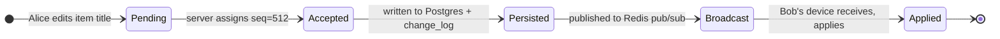

Every feature in this design either produces one of these transitions or handles what happens when one fails.

> **Take this with you.** A shared list is an append-only log of ops, not just a table of current item state. The log is what powers real-time delivery, offline catch-up, and conflict resolution. Design the log first.

---

## How big this gets

| Input | Value |
|-------|-------|
| Daily active users | 1 million |
| Ops per user per day (adds, edits, checks) | ~30 |
| Average list members | 5 |
| Concurrent WebSocket connections at peak | ~200,000 |
| Op log retention | 30 days hot, 2 years cold |

From these we can derive the hard numbers.

<details markdown="1">
<summary><b>Show: the derived numbers</b></summary>

| Metric | Value | How |
|--------|-------|-----|
| Writes per second, steady | ~350 | 1M × 30 / 86,400 |
| Writes per second, peak | ~1,000 | 3x steady |
| Fan-out deliveries per second | ~4,000 | 1k writes × 4 other members |
| Op log storage, 30 days | ~60 GB | 1M × 30 ops × 200 bytes × 30 days |
| Current state storage | ~4 GB | 1M users × 20 lists × 100 items × 200 bytes |

What the numbers tell us:

- **Write rate is not the bottleneck.** 1,000 writes/sec is a light day for Postgres. Throughput is not the hard part.
- **200k concurrent WebSockets cannot live on one machine.** At roughly 50k sockets per Go or Node.js pod, you need 4 to 8 pods, plus a way for a write on pod A to reach a subscriber on pod B.
- **Fan-out volume is moderate.** 4,000 deliveries/sec is comfortable for Redis pub/sub. The fan-out becomes interesting only for lists with thousands of subscribers (a shared "company announcements" list).
- **Op log dominates storage.** The 30-day window caps it at 60 GB per million users. A nightly job archives older ops to S3 and prunes.

</details>

> **Take this with you.** Connection count and cross-pod fan-out are the two design constraints that matter. Write rate is not.

---

## The smallest version that works

Forget the million-user case. Two colleagues share one list. One server, one database, no real-time push.

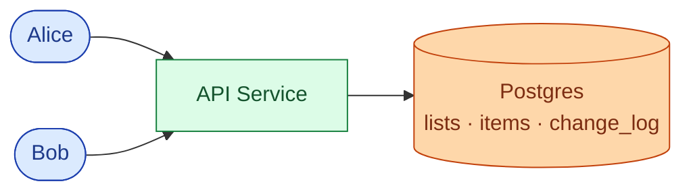

Bob polls `GET /lists/L/changes?since_seq=X` every 10 seconds. If nothing changed, he gets an empty array. If Alice added an item, he gets the op. Latency is up to 10 seconds, which is fine for a small team at first.

Two endpoints carry the core product. One for writes, one for catch-up reads.

| Endpoint | What it does |
|----------|--------------|
| `PATCH /lists/{id}/items/{item_id}` | Write an op; returns `{seq: N}` |
| `GET /lists/{id}/changes?since_seq=N` | Replay ops after N; returns ordered list |

Every write carries a `Client-Op-Id` header. It is a UUID the client generates when the user makes the edit. If the same ID arrives twice (mobile retry), the server returns the original result without applying the op again.

<details markdown="1">
<summary><b>Show: the five tables</b></summary>

```sql
CREATE TABLE users (
    user_id      UUID PRIMARY KEY,
    email        CITEXT UNIQUE NOT NULL,
    display_name TEXT NOT NULL,
    created_at   TIMESTAMPTZ NOT NULL DEFAULT NOW()
);

CREATE TABLE lists (
    list_id    UUID PRIMARY KEY,
    owner_id   UUID NOT NULL REFERENCES users(user_id),
    title      TEXT NOT NULL,
    next_seq   BIGINT NOT NULL DEFAULT 1,
    created_at TIMESTAMPTZ NOT NULL DEFAULT NOW(),
    deleted_at TIMESTAMPTZ
);

CREATE TABLE list_items (
    item_id    UUID PRIMARY KEY,
    list_id    UUID NOT NULL REFERENCES lists(list_id),
    title      TEXT NOT NULL,
    done       BOOLEAN NOT NULL DEFAULT FALSE,
    order_key  TEXT NOT NULL,
    created_by UUID NOT NULL REFERENCES users(user_id),
    last_seq   BIGINT NOT NULL,
    deleted_at TIMESTAMPTZ
);
CREATE INDEX idx_items_list ON list_items (list_id, order_key) WHERE deleted_at IS NULL;

CREATE TABLE share_grants (
    grant_id   UUID PRIMARY KEY,
    list_id    UUID NOT NULL REFERENCES lists(list_id),
    grantee_id UUID NOT NULL REFERENCES users(user_id),
    role       TEXT NOT NULL,
    granted_by UUID NOT NULL REFERENCES users(user_id),
    granted_at TIMESTAMPTZ NOT NULL DEFAULT NOW(),
    revoked_at TIMESTAMPTZ
);
CREATE UNIQUE INDEX idx_grants_active
    ON share_grants (list_id, grantee_id) WHERE revoked_at IS NULL;

CREATE TABLE change_log (
    list_id      UUID NOT NULL,
    seq          BIGINT NOT NULL,
    op           TEXT NOT NULL,
    actor_id     UUID NOT NULL,
    payload      JSONB NOT NULL,
    client_op_id UUID,
    occurred_at  TIMESTAMPTZ NOT NULL DEFAULT NOW(),
    PRIMARY KEY (list_id, seq)
);
CREATE UNIQUE INDEX idx_change_log_idem
    ON change_log (list_id, client_op_id) WHERE client_op_id IS NOT NULL;
```

</details>

This ships in a week and handles a small team without any real-time infrastructure.

---

## Decision 1: how do we push edits to other devices?

Polling at 10 seconds feels slow once users are actively collaborating. Dropping to 2 seconds makes it feel live, but 200k users polling every 2 seconds is 100k requests/sec returning "nothing new." That burns battery and server capacity.

The better model: the server tells devices when something changes, instead of devices asking repeatedly.

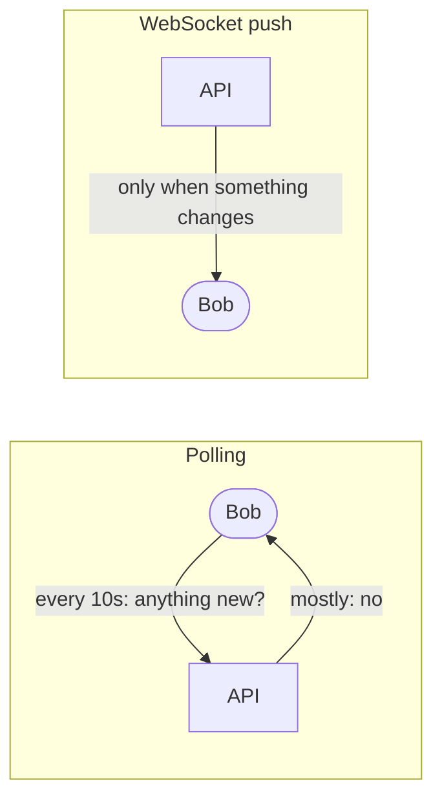

WebSocket is the right tool. One persistent TCP connection per client. The server writes to it the moment an op is committed. Bob sees the change within 200 to 300 ms of Alice pressing Enter.

The next problem: at 200k concurrent sockets you need multiple WS pods. When Alice's write lands on pod A, Bob's connection lives on pod B. Pod A has to signal pod B.

Redis pub/sub solves this. Every write publishes to a channel named `list:{list_id}`. Every WS pod that has at least one subscriber for that list receives the message and forwards it to local sockets.

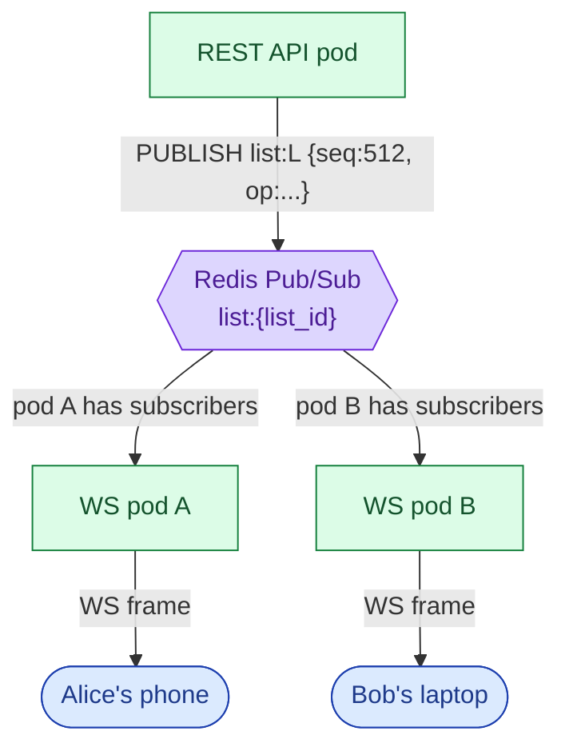

One important detail: pub/sub is fire-and-forget. Redis does not guarantee delivery. If a WS pod restarts mid-message, that message is gone. This is fine because the client tracks which `seq` it last received. On reconnect, it calls `GET /lists/L/changes?since_seq=N` to fill the gap. Postgres is the source of truth. Redis is just the delivery channel.

The sync intervals that matter:

| Delivery path | Typical latency |
|---------------|-----------------|
| Live WebSocket (same region) | 150 to 300 ms |
| Polling fallback (10 s interval) | up to 10 s |
| Reconnect catch-up from change_log | 1 to 5 s depending on gap size |
| Client offline > 30 days (full refetch) | 5 to 30 s |

> **Take this with you.** Postgres is the source of truth. Redis is the delivery channel. If a Redis message is lost, clients detect the gap via seq numbers and call the catch-up endpoint. Nothing is permanently lost.

---

## Decision 2: how do we handle offline writes?

Carol's phone drops signal on the subway. She adds three items while offline. When she surfaces 20 minutes later, her client has three pending ops sitting in a local SQLite queue.

Two problems on reconnect:

1. **Duplicates.** The network might have dropped after the server accepted an op. Carol's client does not know. If she retries, the server must not create a second copy of "oat milk."
2. **Conflicts.** Bob may have edited or deleted one of the items Carol touched while she was offline.

The `client_op_id` field handles duplicates. Each op gets a UUID when Carol creates it. On reconnect she flushes the queue. The server checks `change_log` for that UUID. If it is already there, the server returns the original result. The unique index on `(list_id, client_op_id)` makes this safe under concurrent retries.

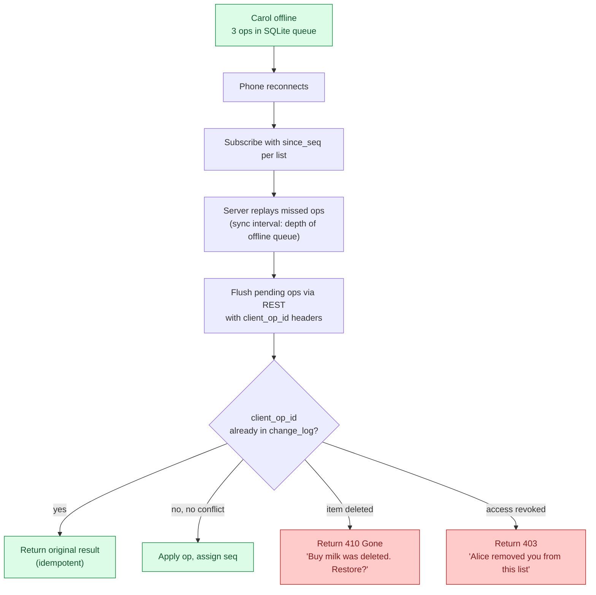

Typical offline queue depths and their handling:

| Offline duration | Queue depth (typical) | Server response |
|------------------|-----------------------|-----------------|
| < 30 min | 1 to 20 ops | Replay + flush, < 1 s |
| 1 to 8 hours | 20 to 200 ops | Replay in pages, 2 to 5 s |
| > 30 days | N/A | `too_far_behind: true`; client refetches full state |

> **Take this with you.** `client_op_id` is non-negotiable. Without it, mobile retries create duplicate items. The unique index on `(list_id, client_op_id)` in `change_log` is what makes "already applied" detection safe.

---

## Decision 3: what do share permissions look like?

Alice owns the list. She grants Bob `editor` and Carol `viewer`.

Three roles cover nearly everything:

| Role | Read items | Write items | Share list | Manage members | Delete list |
|------|------------|-------------|------------|----------------|-------------|
| viewer | yes | no | no | no | no |
| editor | yes | yes | per-list setting | no | no |
| admin | yes | yes | yes | yes | yes |

The interesting question is cascading. Alice revokes Bob. Bob had invited Dave. Does Dave lose access?

Two models:

```mermaid
flowchart LR
    subgraph NonCascade["Non-cascading (recommended)"]
        A1(["Alice"]) -->|revoke| B1(["Bob"])
        B1 -.not affected.-> D1(["Dave"])
        A1 -.prompt: 'Bob invited 1 person. Remove them too?'.-> UI1["UI"]
    end
    subgraph Cascade["Cascading"]
        A2(["Alice"]) -->|revoke| B2(["Bob"])
        B2 -->|auto-revoke| D2(["Dave"])
        D2 -->|"(Dave is surprised)".-> UI2["UI"]
    end
```

Non-cascading is the better default. It is what Notion and Slack do. Revoking Bob does not remove Dave. Alice sees a prompt offering to remove Dave separately. Fewer surprises.

The permission check runs on every request. To avoid a Postgres query on each of the 1,000 writes/sec, cache `(user_id, list_id) -> role` in Redis with a 60-second TTL. On any grant change, invalidate the cache entry. If Bob is revoked, also publish to a `perm:{bob_user_id}` Redis channel so every WS pod drops his subscriptions immediately.

Permission scope comparison:

| Scope | Description | Where enforced |
|-------|-------------|----------------|
| list-level | Can user read/write this list? | Permission cache + DB |
| op-level | Can user perform this specific op type? | API handler |
| revocation propagation | Drop WS subscription within 2 s | `perm:{user_id}` Redis channel |

> **Take this with you.** Permissions are enforced by the server, not the client. The client greys out buttons as a courtesy. The server checks on every write.

---

## Decision 4: how do we resolve concurrent edits?

Alice and Bob both have item #42 open. At the same moment:

- Alice changes "Buy milk" to "Buy oat milk."
- Bob changes "Buy milk" to "Buy almond milk."

Both writes hit the server within 50 ms of each other.

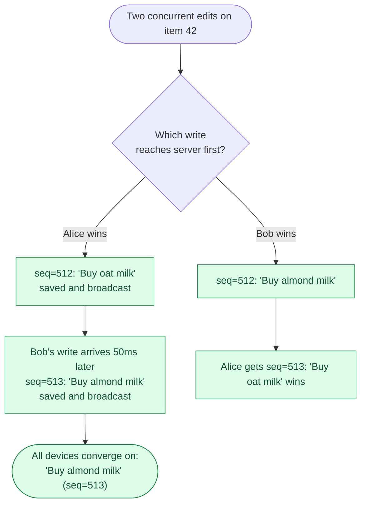

This is last-write-wins (LWW) by server-assigned seq. Higher seq wins. No clock skew possible because the server assigns the seq inside a transaction with a row-level lock on `lists.next_seq`.

Alice's screen may briefly show "Buy oat milk" (optimistic update), then snap to "Buy almond milk" when seq=513 arrives. For a todo list, that flash is fine.

<details markdown="1">
<summary><b>Show: why LWW and not OT or CRDT</b></summary>

**LWW** is correct for item-level edits on a todo list. When two people rename the same item, one edit has to lose. The behavior is "second one wins." Acceptable.

**Operational Transform (OT)** is optimal when two users type in the same text field simultaneously and you want both keystrokes merged. Google Docs uses OT. We are not building Google Docs. OT adds significant complexity for no benefit here.

**CRDT** earns its keep when offline editing is a first-class feature and users spend hours disconnected. CRDTs guarantee convergence without a server round-trip. The cost is real: merge metadata travels with every op, client code is more complex, debugging is harder. Use LWW as the default. Add CRDT for the title field only once offline-conflict complaints are frequent enough to justify the complexity.

**Why not wall-clock timestamps?** Alice's phone might be 30 seconds ahead of Bob's. Server-assigned seq numbers have no skew.

</details>

> **Take this with you.** Use LWW for a todo list. The server-assigned seq number decides the winner. Add CRDT only when offline-first becomes a primary product requirement.

---

## Decision 5: how do we keep op log storage bounded?

At 1 million users, 30 ops/day, 200 bytes each, the log grows by roughly 6 GB per day. Keeping 2 years of history is 4.4 TB. Most of it is cold.

Two-tier retention:

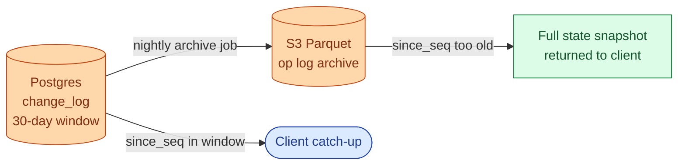

A nightly job copies rows older than 30 days from `change_log` to S3 Parquet and deletes them from Postgres. Clients reconnecting with a `since_seq` older than 30 days receive `too_far_behind: true` and refetch the full current state in one call. That keeps the hot storage at roughly 60 GB per million users.

> **Take this with you.** Keep 30 days of ops in Postgres for cheap catch-up. Archive older ops to S3. Clients older than 30 days do a full refetch. Build the snapshot endpoint early; you will need it.

---

## The full architecture

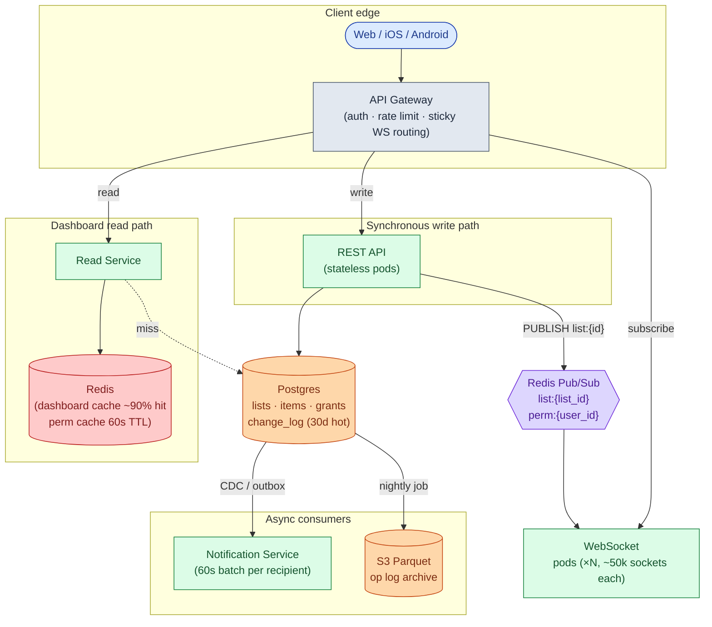

| Component | Purpose |
|-----------|---------|
| API Gateway | Authenticates callers, rate-limits bots, routes WS upgrades to the right pod |
| REST API | Handles all writes. Appends to `change_log` inside the same transaction as the item update |
| WebSocket pods | Hold open sockets. Subscribe to Redis channels. Forward messages to local sockets |
| Postgres | Source of truth. Current item state plus 30 days of `change_log` |
| Redis pub/sub | Cross-pod fan-out for live delivery. Also carries permission-revocation events |
| Read Service + Redis cache | Serves the "my lists" dashboard. ~90% cache hit rate, no DB query in the common case |
| Notification Service | Consumes `change_log` via CDC, batches per recipient over 60 seconds, sends push/email |
| S3 cold tier | Op log older than 30 days. Queried rarely, mostly for compliance or undo past the 30-day window |

---

## Walk: one edit, end to end

Alice edits item #42. Bob has the same list open on his laptop.

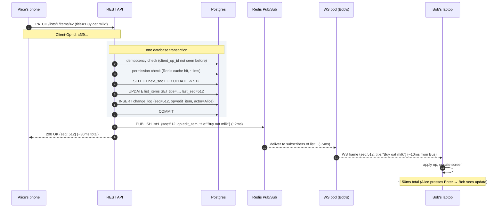

Three things to notice:

1. The seq bump, the item update, and the `change_log` row are written in one transaction. If anything fails, it all rolls back. Alice sees a 500. Bob never sees a partial update.
2. The Redis publish happens after the commit. Publishing inside the transaction and then rolling back would fan out ops that never persisted.
3. Bob's client knows it last saw `seq=511`. When `seq=512` arrives in order, apply it. If `seq=514` arrived first (gap), the client calls the catch-up endpoint to fill in 513 before applying.

---

## Walk: reconnect after a gap

Bob's laptop went to sleep for 2 hours. He opens it and the WebSocket reconnects.

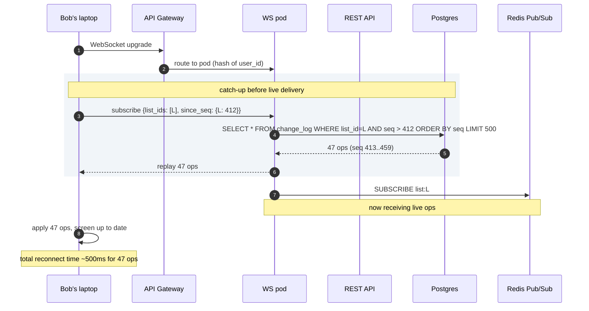

If Bob was offline more than 30 days, the server returns `too_far_behind: true, current_seq: 9001`. Bob's client refetches full list state via `GET /lists/L`, then subscribes from `since_seq: 9001`.

---

## The large-list fan-out problem

A "company all-hands action items" list has 5,000 subscribers. Every edit fans out to 5,000 sockets across ~8 WS pods. At 10 edits/minute, that is 50,000 message deliveries per minute, roughly 833/sec.

What breaks first: outbound bandwidth per pod. 500-byte op × 625 subscribers per pod × 10 edits/min = 3 MB/min per pod. At 1 edit/sec it becomes 3 MB/sec, getting tight.

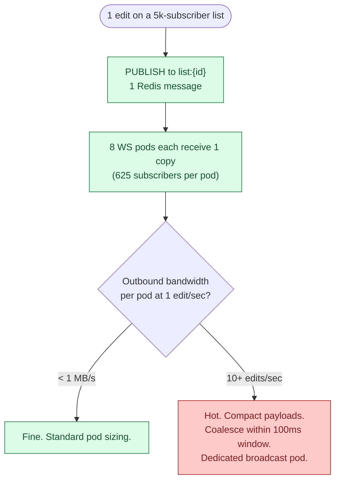

Mitigations: compact op payloads (delta only, not full item state), coalesce multiple edits within a 100 ms window before broadcasting, and route very large lists to dedicated broadcast pods with higher network allocation. For most todo-list use cases this scenario is rare. Consider capping subscribers per list at 1,000 in the standard product tier.

> **Take this with you.** Fan-out bandwidth is the constraint on large lists, not write throughput. Compact payloads and coalescing buy you an order of magnitude before you need dedicated infrastructure.

---

## Follow-up questions

Try answering each in 2 to 4 sentences before opening the solution.

1. **Reconnect after a long disconnect.** Bob's phone has been offline for 4 hours. He reconnects and his client knows it last saw `seq=412` on list L. How does the server send Bob just the deltas, and what do you do when someone has been offline for 6 weeks?

2. **Presence.** Bob wants to see a small avatar showing that Alice is currently viewing the list. How do you do this without writing to Postgres every second?

3. **Permission revoked while connected.** Alice revokes Bob while Bob has the list open and his WebSocket is still subscribed. How quickly does Bob actually lose access, and what does his client show?

4. **Item ordering.** Users can drag items to reorder. Two users drag the same item at the same moment. How do you represent the order so it does not produce a mess?

5. **Notifications.** When Alice adds an item, Bob should get a push notification. Where in your design does this happen, and how do you avoid sending Bob 50 notifications when Alice adds 50 items in 10 seconds?

6. **Search.** Bob wants to search across all his lists for "milk." How do you do this without scanning every item in every list?

7. **Undo.** Bob accidentally deletes an item and hits Cmd-Z. How does this work, and what happens if other collaborators have already seen the deletion?

8. **Sticky routing fails.** Your load balancer cannot guarantee a returning client lands on the same WS pod. The new pod knows nothing about Bob's subscriptions. What happens, and how do you recover?

9. **A list with 50,000 subscribers.** A celebrity creates a "Daily affirmations" list and 50k people follow it. Every edit fans out to 50k clients. What breaks first, and what do you do?

10. **Privacy.** Bob is on Alice's list and can see other members' names. Some users want to be listed as anonymous. How do you support that?

---

## Related problems

- **[Approval Management Service (011)](../011-approval-management/question.md).** Also uses an append-only op log as the spine. Compare the `change_log` here with the `audit_log` there. Same idea, different consumers.
- **[Comment System (015)](../015-comment-system/question.md).** Comments use the same real-time fan-out and permission checks. Thread structure and notification batching apply directly.
- **[Read-Heavy System Patterns (017)](../017-read-heavy-patterns/question.md).** The "render Bob's dashboard" path is a heavy read. The caching patterns there apply here.


<div class="pr-solution-divider"></div>


## Solution: Todo List with Sharing and Collaboration

### The short version

Strip sharing away and this is a small CRUD app. Add sharing and two things get hard:

1. Pushing changes to other people's devices in near real-time.
2. Merging writes from clients that were offline when those changes happened.

The data model fits on a napkin: `users`, `lists`, `list_items`, `share_grants`, and an append-only `change_log` keyed by `(list_id, seq)`. The log is the spine. It powers real-time delivery, reconnect catch-up, offline sync, and undo. Skip the log and every one of those features becomes its own hack.

Real-time delivery is WebSocket with a polling fallback. Writes go to the REST API. The API saves to Postgres and publishes to a Redis pub/sub channel named after the list. Every WS pod subscribed to that channel forwards the message to local sockets.

Conflict resolution is last-write-wins by server-assigned per-list sequence number, with tombstones for deletes. CRDTs earn their keep only later, when offline-first becomes a primary product complaint.

Scale is four stages: one Postgres with polling, add WebSocket, add Redis pub/sub and multiple WS pods, then shard and go regional.

---

### 1. The two questions that matter most

**How real-time is real-time?** That answer decides whether you build WebSocket on day one or just poll every 5 seconds. A 2-second delay means polling works. Sub-second means WebSocket. Sub-100ms with two people editing the same field simultaneously means CRDT.

**Is offline support a first-class feature?** If yes, the client needs a local op queue persisted to disk (SQLite on phones) and the server must accept ops with client-side IDs and out-of-order arrival. If no, every write requires a live connection and the design gets simpler.

Everything else (permissions, item ordering, notifications, undo) follows from those two answers.

---

### 2. The math, in plain numbers

| Scale | Writes/sec (peak) | Reads/sec (peak) | Concurrent WS | Storage, 2 years |
|-------|-------------------|------------------|---------------|------------------|
| 10k DAU | 10 | 15 | ~2,000 | 40 MB state + ~60 GB op log |
| 1M DAU | 1,000 | 1,500 | ~200,000 | 4 GB state + ~6.5 TB op log (compact to ~60 GB) |

Three things stand out:

- Write rate is not the bottleneck. A single Postgres handles 1k writes/sec on beefy hardware.
- 200k concurrent WebSockets cannot live on one machine. At ~50k sockets per pod you need 4 to 8 pods, plus a way for a write on pod A to reach subscribers on pod B. That is the Redis pub/sub problem.
- The op log dominates storage if you keep it forever. Keep 30 days of ops per list in Postgres, archive the rest to S3. Clients offline longer than 30 days refetch full state.

Reads outnumber writes by a wide margin on the "my lists" dashboard. Cache that aggressively.

---

### 3. The API

```
POST   /api/v1/lists
GET    /api/v1/lists
GET    /api/v1/lists/{list_id}
PATCH  /api/v1/lists/{list_id}
DELETE /api/v1/lists/{list_id}

POST   /api/v1/lists/{list_id}/items
PATCH  /api/v1/lists/{list_id}/items/{item_id}
DELETE /api/v1/lists/{list_id}/items/{item_id}
```

Every write carries a `Client-Op-Id` header: a UUID the client generates at the moment of the edit. If the same ID arrives twice within 24 hours, the server returns the original result instead of applying the op again. This is what stops mobile retries from creating duplicate items.

Sharing:

```
POST   /api/v1/lists/{list_id}/shares
DELETE /api/v1/lists/{list_id}/shares/{grant_id}
POST   /api/v1/lists/{list_id}/invite-link
POST   /api/v1/invite/{token}/accept
```

Catch-up after reconnect:

```
GET /api/v1/lists/{list_id}/changes?since_seq=412
```

Returns the ordered list of ops with `seq > 412`, up to 500 per response. If the gap is older than the compaction window, the server replies `too_far_behind: true` and the client refetches full state.

WebSocket subscription (after upgrade):

```json
{
  "type": "subscribe",
  "list_ids": ["L1", "L2"],
  "since_seq": { "L1": 412, "L2": 0 }
}
```

The server replays missed ops per list, then pushes new ones as they happen. Ping/pong every 30 seconds. Connection killed after 60 seconds of silence.

| Status code | Meaning |
|-------------|---------|
| 200 | Op accepted |
| 201 | New resource created |
| 403 | User does not have the required role |
| 404 | List or item not found (also returned when user has no read access, to avoid probing) |
| 409 | Same `Client-Op-Id` reused with different payload |
| 410 | Item was tombstoned; client must refresh |
| 429 | Rate limited |

---

### 4. The data model

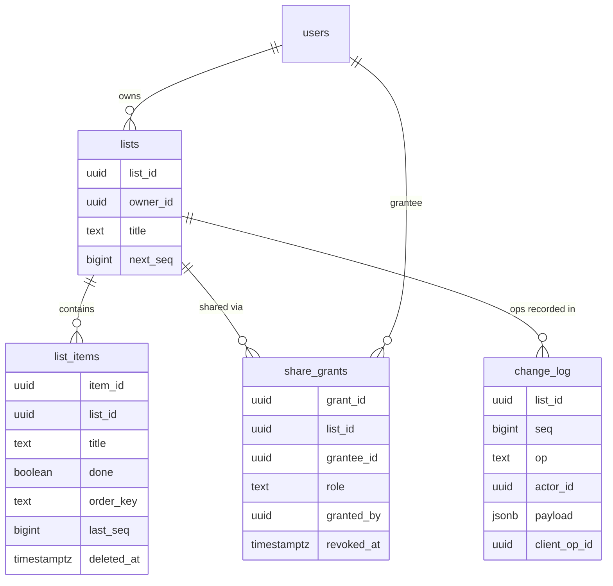

<details markdown="1">
<summary><b>Show: the full SQL</b></summary>

```sql
CREATE TABLE users (
    user_id      UUID PRIMARY KEY,
    email        CITEXT UNIQUE NOT NULL,
    display_name TEXT NOT NULL,
    created_at   TIMESTAMPTZ NOT NULL DEFAULT NOW()
);

CREATE TABLE lists (
    list_id    UUID PRIMARY KEY,
    owner_id   UUID NOT NULL REFERENCES users(user_id),
    title      TEXT NOT NULL,
    settings   JSONB NOT NULL DEFAULT '{}',
    next_seq   BIGINT NOT NULL DEFAULT 1,
    created_at TIMESTAMPTZ NOT NULL DEFAULT NOW(),
    deleted_at TIMESTAMPTZ
);

CREATE TABLE list_items (
    item_id    UUID PRIMARY KEY,
    list_id    UUID NOT NULL REFERENCES lists(list_id),
    title      TEXT NOT NULL,
    done       BOOLEAN NOT NULL DEFAULT FALSE,
    order_key  TEXT NOT NULL,
    created_by UUID NOT NULL REFERENCES users(user_id),
    last_seq   BIGINT NOT NULL,
    deleted_at TIMESTAMPTZ
);
CREATE INDEX idx_items_list ON list_items (list_id, order_key) WHERE deleted_at IS NULL;

CREATE TABLE share_grants (
    grant_id   UUID PRIMARY KEY,
    list_id    UUID NOT NULL REFERENCES lists(list_id),
    grantee_id UUID NOT NULL REFERENCES users(user_id),
    role       TEXT NOT NULL,
    granted_by UUID NOT NULL REFERENCES users(user_id),
    granted_at TIMESTAMPTZ NOT NULL DEFAULT NOW(),
    revoked_at TIMESTAMPTZ
);
CREATE UNIQUE INDEX idx_grants_active
    ON share_grants (list_id, grantee_id)
    WHERE revoked_at IS NULL;

CREATE TABLE change_log (
    list_id      UUID NOT NULL,
    seq          BIGINT NOT NULL,
    op           TEXT NOT NULL,
    actor_id     UUID NOT NULL,
    payload      JSONB NOT NULL,
    client_op_id UUID,
    occurred_at  TIMESTAMPTZ NOT NULL DEFAULT NOW(),
    PRIMARY KEY (list_id, seq)
);
CREATE UNIQUE INDEX idx_change_log_idem
    ON change_log (list_id, client_op_id)
    WHERE client_op_id IS NOT NULL;
```

</details>

Five design choices doing real work:

`next_seq` lives on the `lists` row. Every write does `SELECT next_seq FROM lists WHERE list_id = $1 FOR UPDATE`, bumps it, and inserts the op. The lock serializes concurrent writes on the same list. Ops on different lists run in parallel.

`order_key` is TEXT, not INTEGER. This is fractional indexing (LexoRank). Between items with keys `"a"` and `"c"`, insert `"b"`. Between `"a"` and `"b"`, insert `"am"`. Two people can reorder items without renumbering everything.

`deleted_at` is a tombstone, not a DELETE. The row stays so the deletion event propagates to offline clients and undo can restore the item. Hard delete means an offline client editing a deleted item gets a 404 with no context.

Unique index on `(list_id, client_op_id)` in `change_log`. Two concurrent retries with the same `client_op_id` collapse to one. The second INSERT fails with a unique violation and the API returns the original result.

No foreign key from `change_log` to `list_items`. An op exists even after an item is hard-deleted. Useful for audit replay.

Why Postgres and not Cassandra? Bumping `next_seq` and inserting to `change_log` must be atomic. Postgres gives ACID for free. Cassandra would force a separate seq generator and accept eventual consistency between the log and the item table.

---

### 5. The architecture

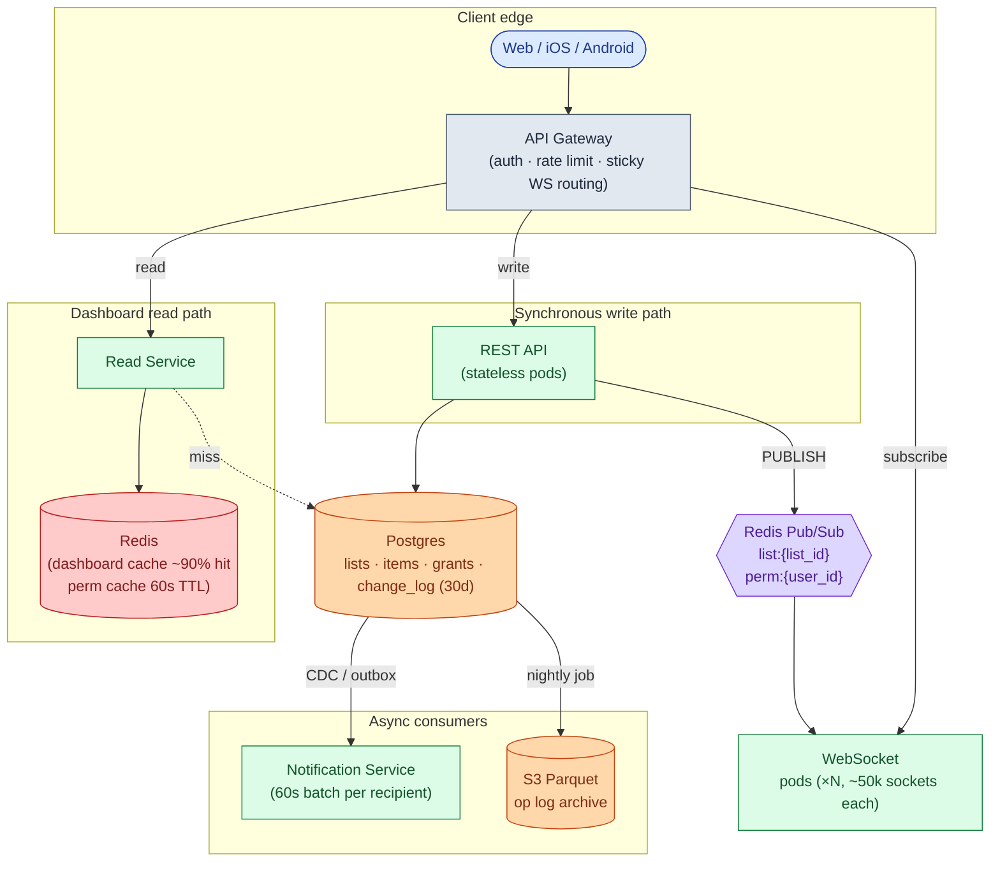

Five things to notice:

- API pods and WS pods are separate because they scale on different axes: requests/sec vs concurrent connections.
- Postgres is the source of truth. Redis is the delivery channel. If a Redis message is lost (pub/sub is fire-and-forget), clients detect the gap via seq numbers and call the catch-up endpoint. Nothing is permanently lost.
- The Read Service serves the "my lists" dashboard from Redis at ~90% hit rate. One cache read, no DB query in the common case.
- The Notification Service is downstream of `change_log` via CDC. It is not on the write path. If it goes down, writes still succeed and notifications just queue up.
- Permission revocation goes through a `perm:{user_id}` Redis channel so every WS pod drops the affected subscription within 2 seconds, not up to 60.

---

### 6. The write path

Every write that mutates list state follows the same skeleton.

<details markdown="1">
<summary><b>Show: the apply_op function</b></summary>

```python
def apply_op(list_id, actor_id, op_type, payload, client_op_id):
    with db.transaction():
        # 1. Idempotency check
        if client_op_id:
            existing = db.query_one("""
                SELECT seq FROM change_log
                WHERE list_id = %s AND client_op_id = %s
            """, list_id, client_op_id)
            if existing:
                return existing           # already applied; return original result

        # 2. Permission check (Redis-cached for 60s)
        if not can(actor_id, list_id, action_for(op_type)):
            raise Forbidden()

        # 3. Get next seq (FOR UPDATE serializes writes on this list)
        lst = db.query_one(
            "SELECT next_seq FROM lists WHERE list_id = %s FOR UPDATE",
            list_id
        )
        seq = lst.next_seq
        db.execute(
            "UPDATE lists SET next_seq = %s WHERE list_id = %s",
            seq + 1, list_id
        )

        # 4. Apply the op to list_items
        apply_op_to_state(op_type, list_id, payload, seq)

        # 5. Append to change_log
        db.insert("change_log",
                  list_id=list_id, seq=seq, op=op_type,
                  actor_id=actor_id, payload=payload,
                  client_op_id=client_op_id)

    # 6. After commit, publish to Redis
    redis.publish(f"list:{list_id}",
                  json.dumps({"seq": seq, "op": op_type, "payload": payload}))

    return {"seq": seq}
```

</details>

Three things doing real work:

- The seq is assigned inside the transaction with a row-level lock. Ops on the same list are serialized. Ops on different lists run in parallel.
- The idempotency check is inside the transaction. Two concurrent retries with the same `client_op_id` collapse to one safely.
- The Redis publish happens after the commit. Publishing inside the transaction and then rolling back would send ops to subscribers that never persisted.

---

### 7. A write, end to end

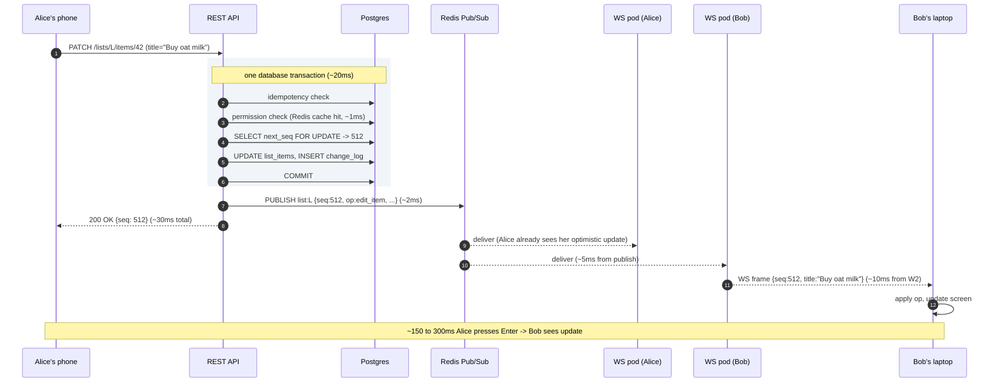

Alice gets `200 OK` before the message reaches Bob. Her optimistic update is already on screen. The response confirms the seq.

---

### 8. Conflict resolution

Last-write-wins by per-list seq. Higher seq wins. When Alice and Bob both edit item #42, the op that arrives at the server second gets the higher seq and its value is the final one.

<details markdown="1">
<summary><b>Show: the client-side merge function</b></summary>

```python
def apply_remote_op(local_state, op):
    if op.op == "edit_item":
        item = local_state.items.get(op.item_id)
        if item is None:
            return                        # deleted locally; skip
        if item.last_seq >= op.seq:
            return                        # we have a newer version; skip
        item.title = op.payload.title
        item.last_seq = op.seq

    elif op.op == "delete_item":
        item = local_state.items.get(op.item_id)
        if item is None:
            return
        if item.last_seq >= op.seq:
            return
        item.deleted = True
        item.last_seq = op.seq

    elif op.op == "add_item":
        if op.item_id in local_state.items:
            return                        # already have it
        local_state.items[op.item_id] = Item(
            title=op.payload.title,
            order_key=op.payload.order_key,
            last_seq=op.seq,
        )
```

</details>

Tombstones for deletes. When Alice deletes item #42 at seq=600, the row stays in the database with `deleted_at = now()`. The op fans out. Clients set their local copy to deleted. If Bob was offline and edited #42, his late edit gets stamped seq=900. The edit lands but the item stays hidden because `deleted_at IS NOT NULL`. If Alice later undoes the delete, Bob's edit is visible again.

Op log compaction. Keep the last 30 days per list. Older ops are summarized into a snapshot record. Clients with `since_seq` older than 30 days get `too_far_behind: true` and refetch full state.

---

### 9. The offline sync flow

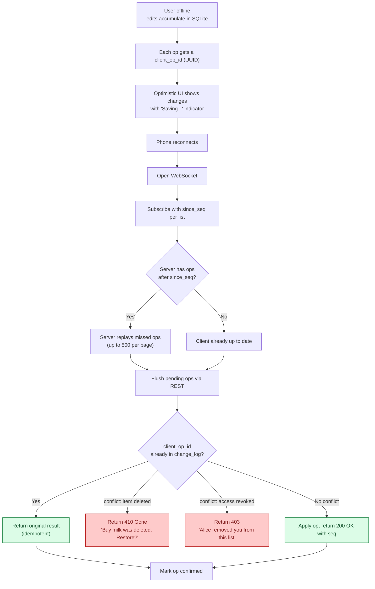

> **Take this with you.** `client_op_id` is non-negotiable. Without it, mobile retries create duplicate items. The unique index on `(list_id, client_op_id)` in `change_log` is what makes "already applied" detection safe.

---

### 10. The scaling journey: 10 users to 1 million

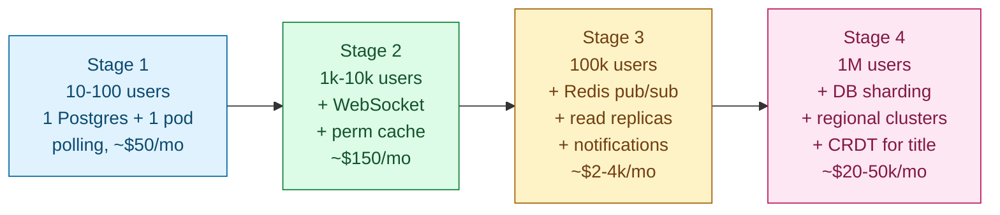

#### Stage 1: 10 to 100 users

One Postgres, one app server. Client polls `GET /lists/L/changes?since_seq=X` every 10 seconds. No Redis. Permission check is a DB query. ~$50/month. Ships in a week.

100 users at 30 ops/day is 0.04 ops/sec. Building more is over-engineering.

#### Stage 2: 1,000 to 10,000 users

What breaks: power users with actively-edited lists notice the 10-second lag. Polling cost climbs (200 active users polling every 10 sec = 20 polls/sec, most returning nothing). Mobile users burn battery.

Add a WebSocket service. Because there is still one WS pod, the REST API signals it via an in-process channel. Add a per-user permission cache in Redis (60-second TTL). Add one Postgres read replica for dashboard reads. Keep the polling fallback endpoint for strict firewalls. ~$150/month.

Do not yet add Redis pub/sub, multiple WS pods, or DB sharding.

#### Stage 3: 100,000 users

Several things break at once. 30k concurrent sockets are too many for one WS pod. A popular list with 50 active editors fans out writes across pods that cannot talk to each other. The "my lists" dashboard takes 800ms for users with 200+ lists.

Fix in order:

1. 4 to 8 WS pods at 50k sockets each. Load balancer routes by `user_id` hash for stickiness.
2. Redis pub/sub for cross-pod fan-out. REST API publishes to `list:{list_id}`. WS pods subscribe to channels for lists their local users watch.
3. Dashboard denormalization: a `user_list_summaries` Redis hash per user, updated by a worker consuming `change_log` events. Dashboard load becomes one Redis `HGETALL`.
4. `perm:{user_id}` Redis channel for instant revocation across all WS pods.
5. Nightly job archiving `change_log` rows older than 30 days to S3 Parquet.
6. Notification Service consuming via CDC or outbox, batching per recipient over 60 seconds.

~$2-4k/month.

#### Stage 4: 1 million users

New problems: 200k concurrent sockets. One Redis pub/sub node getting hot at 1k publishes/sec. Users in Europe see 200ms latency to us-east. Power users who edited offline for 12 hours find some changes overwritten.

Fixes:

- Shard Postgres by `hash(list_id)` into 16 shards.
- Regional WS clusters with per-region Redis. A cross-region replication bridge forwards ops between regions.
- Redis in cluster mode, partitioned by `hash(list_id)`.
- CRDT (Yjs) for the title field only. The rest stays LWW. This fixes the offline-conflict complaint for the one field where it hurts most.
- Dedicated broadcast pods for popular lists (> 5k subscribers).

~$20-50k/month.

The core architecture has not fundamentally changed since Stage 3. You added regions, sharding, and CRDT for one field. The data model is the same one from Stage 1.

---

### 11. Reliability

**Postgres primary fails.** Promote a replica. Writes are unavailable for 30 to 60 seconds. The API returns `503 Retry-After: 30`. WS pods keep connections open. Clients show a "Saving..." banner.

**Redis pub/sub node fails.** Subscribers reconnect to the new node. During the 5 to 10 second gap, no live messages are delivered. Clients use the catch-up flow: send `since_seq`, server replays from `change_log`. No ops are lost. Postgres is the source of truth.

**WS pod crashes.** All connections on that pod die. Clients reconnect with exponential backoff. The load balancer routes to a healthy pod. The catch-up flow fills in missed ops. Worst case for a user: a 5-second visible disconnect.

**Bad WS service release.** Send a "reconnect please" message to each socket before shutting down, then wait 10 seconds. Clients reconnect smoothly to a sibling pod. No thundering herd.

**Buggy client sends 10k ops/sec.** Per-user rate limiter (default 100/min). Sustained abuse triggers a 5-minute circuit breaker returning `429`. An alert fires.

---

### 12. Observability

| Metric | Why it matters |
|--------|----------------|
| `ops.applied.rate` | Spike means abuse or a buggy client. Drop means the write path is broken. |
| `ws.connections.current` per pod | Pods nearing 50k need a scale-out. |
| `ws.fanout.latency.p99` | From op committed to last subscriber receiving. SLO: < 500ms regionally. |
| `ws.disconnect.rate` | Spike means a bad deploy, a network event, or NAT timeouts. |
| `pubsub.subscribers` per channel | Detect hot lists with very many subscribers. |
| `lists.next_seq.lock_wait.p99` | High means one list is being hammered by many concurrent writers. |
| `dashboard.cache.hit_rate` | Should be > 90%. Drop means the cache or invalidation is broken. |
| `change_log.catchup.bytes.p99` | If clients download > 10 KB on reconnect, they were offline a long time. |
| `perm.revocation.propagation.p99` | From revoke API call to all WS pods cutting access. SLO: < 2 sec. |
| `db.replication_lag.p99` | If > 2 sec, reads serve stale state. |

Page on: WS fan-out p99 > 2 sec for 5 min. Write error rate > 2%. Any pub/sub subscriber pileup.

Ticket on: dashboard cache hit rate < 70%. Permission revocation latency > 5 sec. Any single list with > 5k subscribers.

---

### 13. Follow-up answers

**1. Reconnect after a long disconnect.**

Bob's client knows `since_seq=412` for list L. On reconnect it calls `GET /lists/L/changes?since_seq=412`. Server returns up to 500 ops at a time (`has_more: true` if there are more). If 412 is older than the compaction window, the server returns `too_far_behind: true, current_seq: 9001`. The client refetches full state via `GET /lists/L`, then subscribes from `since_seq: 9001`. The 500-op cap prevents one user with weeks of missed ops from blocking the WS server.

**2. Presence.**

Do not write to the database. Presence is ephemeral. Each WS pod maintains `presence[list_id] = set(user_ids)` in memory. When a user subscribes to a list, the pod adds them and publishes `presence_join` to a `presence:{list_id}` Redis channel. On disconnect, publish `presence_leave`. Every WS pod subscribed to that channel merges events into its local view. A 30-second heartbeat prunes stale entries: pods re-emit their local presence, and entries not heard from in 90 seconds are dropped. Postgres: not touched.

**3. Permission revoked while connected.**

Alice calls `DELETE /lists/L/shares/{bob_grant_id}`. The API sets `revoked_at = NOW()`, invalidates `(bob, L)` in the permission cache, and publishes `{revoked_lists: [L]}` to `perm:{bob_user_id}`. Every WS pod subscribed to that channel finds Bob's connections, unsubscribes them from `list:L`, and sends `{type: "access_revoked", list_id: "L"}` over the socket. Bob's client redirects to the dashboard with a banner. End-to-end latency: under 2 seconds. Worth saying out loud: once data has been delivered to a device, the server cannot truly recall it. Client-side cleanup is a defense, not a guarantee.

**4. Item ordering with concurrent reorders.**

Fractional indexing (LexoRank). Each item has an `order_key` like `"a3"`, `"aB"`, `"b1"`. To insert between `"a3"` and `"aB"`, pick `"a7"`. After many inserts in the same gap, keys grow longer. A background job re-spaces them occasionally.

Concurrent reorders: Alice moves item X to position between A and B. Bob moves X between C and D at the same time. Each generates a different `order_key`. The seq decides which sticks: the higher-seq key wins. The item ends up in one of the two intended positions. Acceptable.

**5. Notifications.**

A Notification Service consumes `change_log` via CDC (Debezium to Kafka) or an outbox table. For each event it looks up subscribers from `share_grants` and adds an entry to a per-recipient bucket keyed by `(recipient, list_id)`. Buckets flush on a 60-second timer after the first event. Digest text: "Alice added 3 items and checked off 1 in Grocery list." Per-user preferences (instant / hourly / daily) live in a `notification_prefs` table cached for 5 minutes.

**6. Search.**

For small scale: `SELECT * FROM list_items WHERE list_id IN (...accessible_list_ids...) AND title ILIKE '%milk%' AND deleted_at IS NULL LIMIT 50`. With a trigram GIN index on `title`, this is fast up to ~1M items per user.

For large scale: pipe items to Elasticsearch via CDC. Search hits ES with a `list_id IN [...]` filter for permission scoping. ES returns matches; the API rehydrates from Postgres. Permission scoping is the hard part because access changes in real time.

**7. Undo.**

Bob deletes item I (seq=600). Within 30 seconds he hits Cmd-Z. The client sends `POST /lists/L/ops/revert {target_seq: 600, client_op_id: "..."}`. The server checks: the target op exists, Bob is the original actor, the op is within the undo window. If all true, generate a compensating op (seq=601, op=`undelete_item`). Other clients receive the undelete and restore locally. Brief flash, acceptable. Outside the window: no undo. Bob recreates manually.

**8. Sticky routing fails.**

Without sticky routing, Bob's reconnect lands on a different WS pod. That pod knows nothing about his subscriptions. Fix: Bob's client re-sends `subscribe` on every reconnect with the full list of `list_ids` and per-list `since_seq`. The new pod authenticates, subscribes to the relevant Redis channels, and replays catch-up. No pod-to-pod state transfer needed. Sticky routing is a performance optimization, not a correctness requirement.

**9. A list with 50,000 subscribers.**

50k subscribers means every edit fans out to 50k sockets. Across 8 WS pods, each pod has ~6k subscribers and sends 6k messages per write. What breaks first: outbound bandwidth. A 500-byte op x 6k subscribers = 3 MB per write per pod. At 1 write/sec that is fine. At 10 writes/sec that is 30 MB/sec per pod, getting tight.

Mitigations: compact payloads (op deltas, not full item objects), coalesce writes within 100ms, dedicated broadcast pods with higher network bandwidth. For a todo list this scenario is rare. Cap subscribers per list (say 1,000) and route popular content to a separate broadcast product.

**10. Privacy: hiding identity.**

Add a per-grant `display_as` field: `"real_name" | "anonymous"`. The member list and activity feed respect it. Other collaborators see "Anonymous editor." The server's `change_log` always stores the real `actor_id`. The API filters the visible name based on the preference. A normal collaborator cannot see the real actor. A determined attacker with direct API access could; for stricter privacy, the server omits `actor_id` from API responses entirely.

---

### 14. Trade-offs worth saying out loud

**LWW vs OT vs CRDT.** LWW is simple and correct for item-level edits. Its one flaw: offline edits from a device disconnected for hours can overwrite more recent edits by another user, because the late-arriving ops get higher seq numbers on reconnect. OT is optimal for character-level co-editing but complex and overkill for todo lists. CRDT handles the offline-conflict problem cleanly but costs metadata per op and is harder to debug. Use LWW until the offline-overwrite complaint is loud enough to justify CRDT for the title field.

**WebSocket vs polling at small scale.** At 100 users, polling every 10 seconds is cheaper to build and run. The latency is worse but acceptable. Build WebSocket when polling cost (battery drain on mobile, server waste) outweighs the build cost. Most teams add WebSocket too early.

**Postgres vs DynamoDB.** Postgres wins until the data outgrows one box. The data model fits Postgres naturally: joins between lists and grants, transactional seq generation, partial indexes for soft-delete, GIN indexes for JSONB search. DynamoDB forces denormalization of all of that.

**Redis pub/sub vs Kafka for fan-out.** Redis pub/sub is fast, simple, and fire-and-forget. Best for transient delivery where Postgres is the source of truth and clients catch up on reconnect. Kafka is durable and replayable but slower and more complex. Use Redis pub/sub for live WS fan-out. Use Kafka (or outbox) for notifications and analytics. Each picked for its strength.

**Per-list seq vs global seq.** Per-list seq has no global coordinator. Ops on different lists parallelize. Seq generation is a single row-level lock. It loses cross-list ordering, which no feature in this design needs. A global seq would be a bottleneck under high write load.

---

### 15. Common mistakes

**Jumping to "use WebSocket and a database."** No clarifying questions, no math, no permission model. The interviewer is listening for the questions, not the answer.

**Treating real-time as binary.** "We need real-time so WebSocket." Define what real-time means first. 10-second polling is real-time enough for a todo list at small scale.

**No change log.** A junior design has `list_items` with `updated_at`. A senior design has an append-only log of ops. The log powers real-time delivery, reconnect, undo, audit, and conflict resolution. Without it, every one of those features is its own hack.

**Hard delete instead of tombstone.** Hard delete means an offline client editing a deleted item gets a 404 with no context. Tombstone makes the deletion an event that propagates and can be undone.

**Ignoring offline.** Most candidates assume always-connected. The interviewer almost always asks "what if Alice was offline?"

**Permission check on the client only.** "The client greys out the edit button." The server must enforce it every time. The client is untrusted.

**No idempotency on writes.** Mobile networks retry. Without `client_op_id`, retries create duplicate items. The most common mobile-app failure mode.

**Designing fan-out as "broadcast to all clients."** Without pub/sub, every WS pod has to know about every write. Pub/sub channels per `list_id` is the standard pattern. Name it explicitly.

**Presence as a database problem.** Writing "user X is online" to Postgres every 30 seconds for 200k users melts the DB. Presence is ephemeral and belongs in memory or Redis.

**Wall-clock timestamps for LWW.** Alice's phone might be 30 seconds ahead of Bob's. Use server-assigned seq numbers. They cannot skew.

If you can name 7 of these 10 without prompting, you are interviewing well. The change_log plus tombstones plus `client_op_id` trio is what separates a thoughtful design from a generic CRUD answer.

