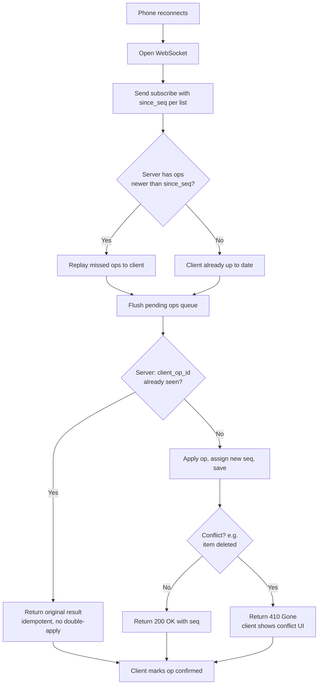
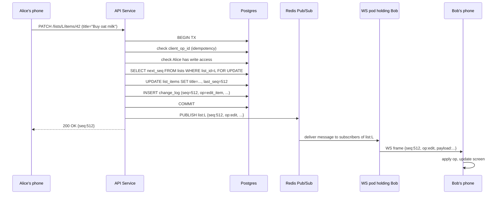
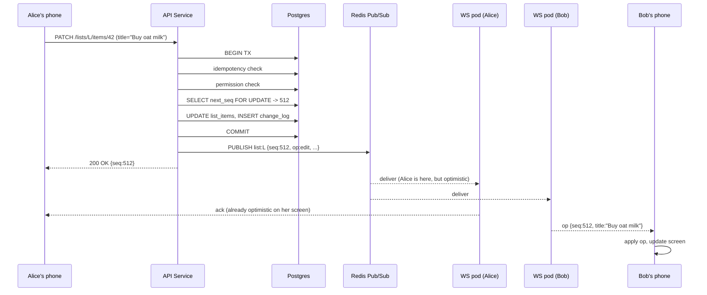
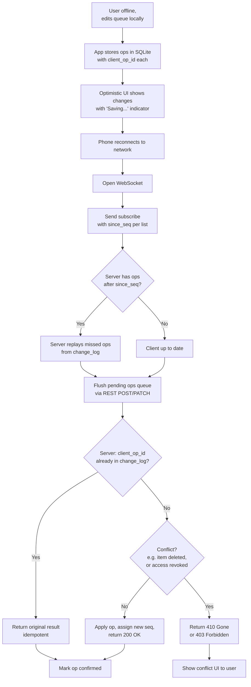


## The scene

You sit down. The interviewer leans back and says:

> *"Everyone has used Todoist or Trello. Build a todo list app. Users make lists. They add items. They check items off. Now the fun part. Any list can be shared with friends. When Alice adds an item, Bob, who is also on that list, should see it on his phone within a second or two. Build that."*

They wait.

It looks like a simple CRUD app. (CRUD = Create, Read, Update, Delete. Just basic data operations.) That answer dies fast. Three hard problems are hiding in the question:

1. How do you push a change to other phones in near real-time without melting your servers?
2. What happens when Alice and Bob edit the same item title at the same moment?
3. What does the permission model look like once a list can be re-shared?

Most people jump straight to *"I'll use WebSockets."* That is the right tool. But it is the wrong place to start. The right place is to ask what *kind* of collaboration the interviewer wants. A list that refreshes every 10 seconds is a totally different system from one where Alice's keystrokes show up on Bob's screen as she types.

We will walk this from 10 users to 1 million users. At every step we will name what breaks first, then add the smallest fix that solves it.

---

## Step 1: Ask the right questions

Before you draw anything, sit for five minutes. Write down questions you would ask the interviewer.

A good answer here is not "20 questions about every edge case." It is the small handful of questions that change the design if answered differently.

<details markdown="1">
<summary><b>Show: 10 questions that matter</b></summary>

1. **How real-time is real-time?** Is a 1 second delay okay? Or do we need sub-100ms like Google Docs, where you see each keystroke? *(This one answer drives 60% of the design. 1 to 5 seconds means polling works. Sub-second means WebSocket. Sub-100ms with two people editing the same field means CRDT.)*
2. **What can be shared, and at what size?** A whole list? Just one item? A whole workspace? *(Per-list sharing is the common answer.)*
3. **Can a person you invited re-share with someone else?** *(Changes the permission model from a flat list into a tree.)*
4. **What roles?** Viewer, editor, admin? *(Two roles cover 90% of cases.)*
5. **Scale.** 10k users? 10M users? *(Both are valid. The math is very different.)*
6. **Offline support.** Can a user add items on the subway with no signal? What happens on reconnect? *(Big design choice. Pushes you toward client-side queues and conflict rules.)*
7. **Notifications.** Push? Email? In-app only? *(Usually a separate service. Need to know if it is in scope.)*
8. **Item structure.** Just title and a checkbox? Or due dates, assignees, sub-tasks? *(Start simple. Ask before adding fields.)*
9. **Delete semantics.** When Alice deletes an item, does it vanish for Bob? Trash bin with undo? *(Soft delete with tombstones is almost always the right answer. We will explain why.)*
10. **Invite flow.** Share by link? Direct invite by username? Email invite? *(Affects the auth and onboarding flow.)*

A strong candidate also says what is **out of scope**. Rich-text editing inside items, file attachments, calendar sync, AI suggestions. Those would each double the scope.

</details>

---

## Step 2: How big is this thing?

Same problem, two scales. Do the math.

**Small scale:**

- 10,000 daily active users
- 20 lists per user (most are personal; about 3 are shared)
- Shared lists have about 4 collaborators each
- Each user adds or checks off about 30 items per day
- Each user opens the app about 15 times per day

**Large scale:**

- 1,000,000 daily active users
- Same per-person numbers

Compute these for each scale:

1. Writes per second
2. Reads per second
3. Concurrent WebSocket connections (assume each active user holds one open)
4. Total storage after 2 years
5. **Fan-out**: when Alice writes to a 5-person list, how many copies of the update get pushed out?

<details markdown="1">
<summary><b>Show: the math at both scales</b></summary>

**At 10k DAU (small):**

- Writes: 10k × 30 = 300k per day = **about 3.5 writes/sec average, 10/sec at peak**. Tiny.
- Reads: 10k × 15 opens × 3 lists per session = 450k reads/day = **about 5/sec average, 15/sec peak**. Tiny.
- WebSocket connections: if 20% are active at peak, that is **2,000 open sockets**. One small server with 4GB RAM handles that easily.
- Storage: 10k users × 20 lists × 100 items × ~200 bytes = **40 MB** total. Trivial.
- Fan-out: each write to a 5-person list pushes to 4 other people. At 10 writes/sec that is **40 deliveries/sec**. Nothing.

At this scale, you could literally use one Postgres database, one server, and poll every 5 seconds. The only reason we won't is that we want a design that grows.

**At 1M DAU (large):**

- Writes: 1M × 30 = 30M/day = **about 350/sec average, 1,000/sec peak**. Still small for any modern database.
- Reads: 1M × 15 × 3 = 45M/day = **about 520/sec average, 1,500/sec peak**.
- WebSocket connections: 20% active = **200,000 open sockets**. One box cannot hold that. A typical Node.js or Go server handles ~50k sockets per box. So you need 4 to 8 boxes.
- Storage: 1M users × 20 × 100 × 200 bytes = **4 GB** of current state. The history log (if kept forever) would be **6.5 TB over 2 years**. You will not keep it all. You compact old entries.
- Fan-out: 1k writes/sec peak × 4 collaborators = **4,000 deliveries/sec**, spread across many WebSocket servers.

**What the math is telling you:**

The write rate is small even at 1M users. Throughput is not the hard problem. The hard problems are:

- **Connection count.** 200k open sockets across many servers means you need a way to send one update to all the right servers.
- **Fan-out across servers.** If Alice's update lands on server A but Bob's connection lives on server B, server A needs a way to tell server B. This is what Redis pub/sub solves. (Pub/sub = publish / subscribe. One sender broadcasts a message. Many listeners receive it. No reply needed.)
- **Offline sync.** Users go offline for hours. When they come back, they need their queued edits to merge cleanly with edits from others.

> **Why this matters.** Polling every 2 seconds *sounds* simple. But at 1M users that is 500,000 requests/sec just to check "anything new?" Most return "nothing." WebSocket lets the server stay quiet until something actually changes, then pushes the update instantly. Much less waste.

</details>

---

## Step 3: Real-time updates, three options

Alice adds an item. Bob needs to see it. You have three serious ways to push the update to Bob's phone:

1. **Polling.** Bob's phone asks the server "anything new?" every few seconds.
2. **WebSocket.** A persistent connection between browser and server. Either side can send a message at any time without re-asking. The server pushes when it has something.
3. **Server-Sent Events (SSE).** Like WebSocket but one direction only (server to client). Runs over normal HTTP.

Before peeking, write down the pros and cons of each. Think about:

- Cost per connected user
- What happens when the app is in the background on a phone
- What happens behind a strict corporate firewall
- What happens when 100 things change at once

<details markdown="1">
<summary><b>Show: comparison and recommendation</b></summary>

| Aspect | Polling | WebSocket | SSE |
|--------|---------|-----------|-----|
| Protocol | HTTP request and response, over and over | One TCP connection, kept open | One HTTP response, kept open |
| Direction | Client asks, server replies | Both ways | Server to client only |
| Time to deliver an update | As bad as the poll interval (e.g., 5 sec) | Sub-100ms | Sub-100ms |
| Connection cost | High (a full handshake every poll) | Low (one connection) | Low (one connection) |
| Memory per user on server | Low when idle | About 10 to 50 KB per open socket | About 10 to 50 KB per open response |
| Works behind strict firewalls | Excellent (just HTTP) | Sometimes blocked; needs WSS over port 443 | Excellent (looks like a slow HTTP response) |
| Phone in background | Naturally pauses, polls on wake | Connection dies; reconnects on foreground | Same as WebSocket |
| Complexity | Lowest | Highest (frames, ping/pong, reconnect, auth on upgrade) | Medium |
| Sending client to server | Use a separate POST | Same socket | Use a separate POST |

**Recommendation: WebSocket, with polling as a fallback.**

WebSocket is the primary path. Lowest latency. Cheapest per connection at scale. Built into every browser. Polling is the fallback. Some corporate networks block WebSocket. The client tries WSS first; if the handshake fails or no message arrives within 30 seconds, fall back to polling on a different endpoint.

SSE is also fine. Some teams pick it because it is simpler. Most pick WebSocket because the connection is two-way. You can send "Alice is typing" or "Bob just opened the list" over the same channel. SSE forces a separate POST for every client-to-server message.

**WebSocket is not free.** An open socket costs memory (10 to 50 KB for buffers and app state). The client must send a ping every 30 seconds or so to detect dead connections behind a NAT. (NAT = the home router that hides your phone behind one public IP. NATs forget about idle connections after a few minutes.) Mobile clients drop the socket constantly (screen off, app backgrounded, weak signal). So you need fast reconnect with a "give me everything since X" catch-up call.

> **Why this matters at small scale.** At 100 users, polling every 5 seconds is fine. The user sees changes within 5 seconds. They do not complain. Build polling first. Build WebSocket only when polling cost (battery on mobile, traffic on server) becomes a real problem. Most teams build WebSocket too early.

</details>

---

## Step 4: Draw the system

You know what protocol to use. Now draw the boxes that run it.

Try to fill in the missing pieces below. Five boxes are missing. Think about: where do clients hit first, where do writes go, where do open WebSocket connections live, where is the source of truth, and how does one write reach all the right servers.

```
            Client (web, iOS, Android)
                       |
                       v
              +------------------+
              |   [ ? ]          |  auth, rate limit, sticky routing
              +------+-----------+
                     |
       write         |          subscribe (WS)
                     |
            +--------+--------+
            |                 |
            v                 v
      +-----------+     +--------------+
      |  [ ? ]    |     |  [ ? ]       |  holds open sockets;
      |  CRUD,    |     |              |  pushes messages to
      |  perms,   |     |              |  the right users
      |  ops      |     +-------+------+
      +-----+-----+             |
            |                   |
            v                   |
      +-------------+           |
      |   [ ? ]     | <---------+  source of truth: lists,
      |             |              items, op log, grants
      +------+------+
             |
             v
      +-------------+
      |   [ ? ]     |   one write -> all WS servers
      |             |   with a subscriber for that list
      +-------------+
```

<details markdown="1">
<summary><b>Show: the full architecture</b></summary>

```
            Client (web, iOS, Android)
                       |
                       v
              +-------------------+
              |   API Gateway     |  auth, rate limit, sticky
              |   + Load Balancer |  routing for WS upgrades
              +------+------------+
                     |
       write         |          subscribe (WS)
                     |
            +--------+--------+
            |                 |
            v                 v
      +-----------+     +------------------+
      |  API      |     |  WebSocket       |
      |  Service  |     |  Service         |
      |  (REST):  |     |  (50k sockets    |
      |  CRUD,    |     |   per pod;       |
      |  perms,   |     |   pushes to      |
      |  writes   |     |   local users)   |
      |  the op   |     +--------+---------+
      |  log      |              |
      +-----+-----+              |
            |                    | replay on reconnect
            v                    v
      +----------------------------------------+
      |  Postgres                              |
      |   users                                |
      |   lists                                |
      |   list_items   (current state)         |
      |   share_grants (who can see what)      |
      |   change_log   (append-only op log)    |
      +-------------------+--------------------+
                          |
              every write also publishes
                          v
      +----------------------------------------+
      |  Redis Pub/Sub                         |
      |   channel per list_id                  |
      |   WS pods subscribe to channels for    |
      |   lists their connected users watch    |
      +----------------------------------------+
```

What each piece does, in one line:

- **API Gateway + LB.** Auth, rate limit, picks a WS pod for upgrade. Tries to send a returning client to the same pod (sticky routing) to keep caches warm.
- **API Service.** Handles all writes: create list, add item, check off, share, revoke. Every write also appends to the op log in the same database transaction.
- **WebSocket Service.** Holds the open sockets. When a client connects and authenticates, the pod subscribes that connection to the right Redis channels. When a message arrives on a channel, the pod forwards it to local sockets.
- **Postgres.** Source of truth. Current state plus an append-only `change_log`. The change_log is the spine. It powers real-time push, reconnect catch-up, undo, and offline sync.
- **Redis Pub/Sub.** The fan-out bus. Every write publishes a message to a channel named after the list. Every WS pod that has a subscriber for that list receives it and forwards to its local sockets.

**Why two services (API and WS) and not one?**

They scale very differently. The API is request/response. Low memory. Scales with requests per second. The WebSocket service is connection-heavy. High memory per pod. Scales with concurrent users. Splitting them lets each scale on its own. You can deploy WS server updates without restarting REST traffic.

</details>

---

## Step 5: The conflict problem

Alice and Bob both have the same shared list open. At 2:31:05 PM:

- Alice edits item #42 from "Buy milk" to "Buy oat milk."
- At the same millisecond, Bob edits item #42 from "Buy milk" to "Buy almond milk."

Both writes hit your servers within 50ms of each other. What does the system do? Whose title wins? Does Bob see Alice's title flash on his screen and then change back? What if Alice was offline for an hour and queued the change locally first?

Three serious options:

1. **Last-write-wins (LWW).** The newer write wins. The older one is overwritten.
2. **Operational Transform (OT).** A technique to merge concurrent edits inside the same text. Google Docs uses this.
3. **CRDT.** A data structure where two people's offline edits merge automatically with no conflicts. Math guarantees both sides converge to the same final state. (CRDT = Conflict-free Replicated Data Type.)

<details markdown="1">
<summary><b>Show: which to pick and why</b></summary>

For a todo list with item-level edits (not character-by-character editing inside a field), **LWW with a logical sequence number is the right answer**.

**Why not OT.** OT shines when two users are typing in the same text field at the same time and you want both keystrokes preserved. That is overkill for "edit item title." If Alice and Bob both change the title, one of them has to lose. The user sees "the second one wins." That is fine for a todo list. OT adds a lot of complexity for very little benefit here.

**Why not CRDT yet.** CRDTs are great for offline-first apps where two users may be disconnected for hours and you want their edits to merge without a server. They cost real things: bigger payload per op (the merge metadata travels with the data), trickier debugging, harder for the team to learn. For a todo list at small to medium scale, LWW is simpler. The user experience is acceptable. CRDT becomes a strong choice once offline-first is a first-class feature (see scaling stage 4).

**Why a logical sequence number, not wall-clock time.** Wall-clock time is unreliable across devices. Alice's phone might be 30 seconds ahead of Bob's. A correct LWW scheme uses a server-assigned **sequence number** (`seq`) that increases by 1 with every op on a list. Higher seq wins. No clock skew possible.

**The flow for Alice vs Bob:**

1. Alice's edit reaches the server first. Server stamps it `seq=512`, saves it, publishes to Redis.
2. Bob's edit reaches 50ms later. Server stamps it `seq=513`, saves it, publishes.
3. Both ops fan out to all clients. Final title across all screens: "Buy almond milk" (the seq=513 winner).

The cost: Alice's screen may briefly show "Buy oat milk" (her own edit, applied optimistically) then snap to "Buy almond milk." For a todo list this flash is acceptable. For a document editor it would not be. That's why Google Docs uses OT, not LWW.

**Offline edits.** Alice is offline. She edits item #42. Her client queues the op with a local ID. An hour later she reconnects. Her client sends the op. The server stamps it with the *current* next seq (say 900). If Bob edited the same item while Alice was offline at seq=513, Bob's edit was earlier but Alice's late-arriving edit gets a higher seq and **wins**. This is the famous LWW gotcha: it does not respect *when* the user actually wanted to make the edit. It is acceptable for a todo list. Not acceptable for document editing.

</details>

---

## Step 6: Permissions

Alice owns a list. She shares it with Bob (editor) and Carol (viewer). Bob then wants to share the list with Dave. Does Bob have that authority? If yes, what role does Dave get? If Alice later kicks Bob out, does Dave lose access too?

Try to sketch a `share_grants` table and the rules.

<details markdown="1">
<summary><b>Show: the permissions model</b></summary>

**Three roles, kept simple:**

| Role | Read items | Write items | Share the list | Manage members | Delete the list |
|------|------------|-------------|----------------|----------------|------------------|
| viewer | yes | no | no | no | no |
| editor | yes | yes | maybe (per-list setting) | no | no |
| admin | yes | yes | yes | yes | yes |

The list creator is implicitly the admin. Simple version: one admin per list. Fancier: multiple admins.

**The grant table:**

```sql
CREATE TABLE share_grants (
    grant_id      UUID PRIMARY KEY,
    list_id       UUID NOT NULL,
    grantee_id    UUID NOT NULL,           -- who has access
    role          TEXT NOT NULL,           -- 'viewer' | 'editor' | 'admin'
    granted_by    UUID NOT NULL,           -- who gave them access
    granted_at    TIMESTAMPTZ NOT NULL DEFAULT NOW(),
    revoked_at    TIMESTAMPTZ              -- soft delete (NULL = active)
);
CREATE UNIQUE INDEX idx_active
    ON share_grants (list_id, grantee_id)
    WHERE revoked_at IS NULL;
```

A user has access if there is a non-revoked grant for them on that list. The partial unique index prevents accidentally granting two roles to the same person on the same list.

**Does Bob lose Dave when Alice kicks Bob out?**

Two models. Pick one and defend it:

- **Non-cascading (recommended).** Revoking Bob does NOT revoke Dave. Dave has his own direct grant. Alice has to revoke Dave separately. The UI should warn Alice: "Bob added 3 other people. Revoke them too?" Make it explicit, not automatic.
- **Cascading.** Revoking Bob also revokes everyone Bob invited, and everyone *they* invited, all the way down. Harder to reason about. Surprises users.

Slack and Notion both go non-cascading by default. We will too.

**Cache the permission check.** Cache `(user_id, list_id) -> role` in Redis for 60 seconds. A user touches the same lists over and over; hit rate is very high. Invalidate when a grant changes.

> **Why this matters.** Without a cache, every write goes through a permission lookup in Postgres. At 1k writes/sec, that is 1k extra DB queries/sec. With a 60-second cache and ~95% hit rate, it drops to 50/sec. Easy win.

</details>

---

## Step 7: Offline editing and the sync protocol

The dominant use case on mobile is offline. A user opens the app on the subway. Adds five items. Checks two off. Edits a title. No signal the whole time. Twenty minutes later they surface and the phone reconnects.

What does the protocol between client and server look like?

Think about:

- How does the client tell the server "I already created this item, don't create it twice"?
- What does the server send back when the user reconnects after being away?
- What if Alice edited an item while you were offline, and that item has since been deleted by Bob?

<details markdown="1">
<summary><b>Show: how offline sync works</b></summary>

**While offline:**

The client keeps two stores on disk (SQLite on phones, IndexedDB on web):

1. **Local mirror** of every list: items, titles, done flags, the last `seq` seen for each list.
2. **Pending ops queue**: ops the user did locally that have not yet been confirmed. Each op has a `client_op_id` (a UUID the client makes up at the moment of the edit).

The user sees their edits immediately on screen, with a small "Saving..." indicator. This is **optimistic UI**: show success first, confirm with the server later.

**On reconnect:**



**Three conflict cases the protocol must handle:**

1. **Edit a deleted item.** Alice deleted item #42 while Bob was offline. Bob's late edit on #42 gets `410 Gone`. Bob's client shows: *"You edited 'Buy milk' but Alice deleted it. Restore?"*
2. **Edit on a list you no longer have access to.** Alice revoked Bob. Bob's edits get `403 Forbidden`. Client shows: *"Your edits to 'Family chores' were not saved. Alice removed you from this list."*
3. **Too far behind.** Bob has been offline for 60 days. The server compacts the op log after 30 days. The server replies `too_far_behind=true`. The client refetches the full list state and starts fresh.

**Why `client_op_id` is non-negotiable.**

Without it, the server cannot tell a duplicate retry from a brand new op. Mobile networks drop mid-request all the time. The phone retries. Without a key, the retry creates a duplicate item. With the key, the server sees "I already applied this op with this key" and returns the original result. The unique index on `(list_id, client_op_id)` in the database is what makes this safe.

**Why the pending ops queue must live on disk.**

The user closes the app. The OS evicts the process. They open it the next day. The pending ops need to still be there. SQLite on iOS and Android survives process kills, app updates, and reboots.

</details>

---

## Step 8: Trace a real-time edit, end to end

Alice edits item #42 on her phone. Bob has the same list open. Trace what happens, step by step, across all the boxes.

<details markdown="1">
<summary><b>Show: the full flow</b></summary>



**A few details worth pointing out:**

- The `SELECT ... FOR UPDATE` on the `lists` row is what serializes writes on the same list. Two concurrent writes to list L are forced to take turns. This is what guarantees seq numbers are gap-free and ordered.
- Alice's phone gets `200 OK` *before* the message reaches Redis. Her optimistic update is already on screen. The response just confirms the seq.
- Every WS pod with a subscriber for `list:L` receives the Redis message. Pods with no subscriber for that list ignore it.
- Bob's client knows it last saw `seq=511`. When `seq=512` arrives, there is no gap. Apply it. If `seq=514` had arrived (skipping 513), the client knows there is a gap and asks for the missing op via the REST catch-up endpoint.
- End to end (Alice presses Enter to Bob's screen updates) is roughly **150 to 300 ms** in the same region.

</details>

---

## Follow-up questions

Try answering each in 2 to 4 sentences before opening the solution.

1. **Reconnect after a long disconnect.** Bob's phone has been offline for 4 hours. He reconnects and his client knows it last saw `seq=412` on list L. How does the server send Bob just the deltas since then, and how do you cap the cost when someone has been gone for weeks?

2. **Presence ("Alice is here").** Bob wants to see a small avatar showing Alice is currently viewing the list. How do you do this without writing to the database every second?

3. **Permission revoked while user is connected.** Alice revokes Bob while Bob has the list open. Bob's WebSocket is still subscribed. How fast does Bob actually lose access, and what does his client see?

4. **Item ordering.** Users can drag items to reorder. Two users drag the same item at the same time. How do you represent the order so it does not produce a mess?

5. **Notifications.** When Alice adds an item, Bob should get a push notification. Where does this happen in your design, and how do you avoid sending Bob 50 notifications when Alice adds 50 items in 10 seconds?

6. **Search.** Bob wants to search across all his lists for "milk." How do you do this without scanning every item in every list?

7. **Undo.** Bob accidentally deletes an item. He hits Cmd-Z. How does this work, and what happens if other collaborators have already seen the deletion?

8. **Sticky routing fails.** Your load balancer cannot guarantee a returning client lands on the same WS pod. The new pod knows nothing about Bob's subscriptions. What goes wrong, and how do you fix it?

9. **A list with 50,000 subscribers.** A celebrity creates a "Daily affirmations" list and 50k people subscribe. Every edit fans out to 50k clients. What breaks first, and what do you do?

10. **Privacy.** Bob is on Alice's list and can see other members' names and emails. Some users want to be private. How do you support "show me as anonymous"?

---

## Related problems

- **[Approval Management Service (011)](../011-approval-management/question.md).** Also uses an append-only log as the spine. Compare the `change_log` here with the `audit_log` there. Same idea, different consumers.
- **[Comment System (015)](../015-comment-system/question.md).** Comments use the same real-time fan-out and permission checks. Thread structure and notification batching apply directly.
- **[Read-Heavy System Patterns (017)](../017-read-heavy-patterns/question.md).** The "render Bob's dashboard" path is a heavy read. The caching patterns from that problem apply here.


<div class="pr-solution-divider"></div>


## Solution: Todo List with Sharing and Collaboration

### The short version

Strip the collaboration away and this is a small CRUD app. Add collaboration and two things get interesting:

1. Pushing changes to other people's devices in near real-time.
2. Merging conflicting edits when devices come back online after being disconnected.

Everything else flows from solving those two.

The data model is small. Five tables: `users`, `lists`, `list_items`, `share_grants`, and an append-only `change_log` keyed by `(list_id, seq)`. The `change_log` is the spine of the system. It powers real-time push, reconnect catch-up, undo, and offline sync. Skip it and every one of those features becomes its own hack.

Real-time delivery is **WebSocket with polling fallback**. (WebSocket = a persistent connection between browser and server; either side can send a message at any time without re-asking.) Each WebSocket pod holds many open sockets. Writes go to the REST API. The API saves to Postgres and publishes on a Redis pub/sub channel named after the list. Every WS pod with a subscriber for that list receives the message and forwards to local sockets.

Conflict resolution is **last-write-wins by server-assigned per-list sequence number**, with **tombstones** for deletes so they propagate cleanly. (Tombstone = a "this row is deleted" marker. The row stays in the database so other clients can see the deletion event.) CRDTs (CRDT = a data structure where two people's offline edits merge automatically with no conflicts) earn their keep only at a later stage, when offline-first becomes a first-class feature.

The scaling story is four stages: one Postgres with polling, add WebSocket, add Redis pub/sub and shard WS pods, then shard the DB and go regional. None of it is hard if you build in order.

---

### 1. The clarifying questions, in one paragraph

The single most important question is *"how real-time is real-time?"* That answer decides whether you build WebSocket on day one or just poll every 5 seconds. The second is *"can a shared list be re-shared?"* That changes the permission model from a flat grant table to a tree with `granted_by` chains. The third is *"is offline support a thing?"* If yes, the client needs a local op queue and the server has to accept ops with client-side IDs and out-of-order timestamps. If no, every write needs a live connection and the whole design gets simpler.

Everything else (notifications, search, ordering) follows from those three.

---

### 2. The math, in plain numbers

| Scale | Writes/sec (peak) | Reads/sec (peak) | Concurrent WS | Storage (2 yrs) |
|-------|-------------------|------------------|---------------|-----------------|
| 10k DAU | 10 | 15 | 2,000 | 40 MB + ~60 GB op log |
| 1M DAU | 1,000 | 1,500 | 200,000 | 4 GB + ~6.5 TB op log |

Three things stand out:

- **The write rate is small.** A single Postgres handles 1k writes/sec on one box. Throughput is not the bottleneck.
- **The hard problem is connection count.** 200k concurrent WebSockets cannot live on one machine. You need many pods (~50k per pod) and a way for a write that lands on pod A to reach a subscriber on pod B. That is what Redis pub/sub is for.
- **The op log dominates storage if you keep it forever.** Compact it. Keep the last 30 days plus a snapshot. Clients that have been offline longer than 30 days refetch full state.

Reads beat writes by raw count once you include the "open the dashboard" path. Cache the per-list summary aggressively.

---

### 3. The API

The list and item endpoints look like what you would expect:

```
POST   /api/v1/lists                              create a list
GET    /api/v1/lists                              all lists I have access to
GET    /api/v1/lists/{list_id}                    a list with its items
PATCH  /api/v1/lists/{list_id}                    rename, change settings
DELETE /api/v1/lists/{list_id}                    delete (admin only)

POST   /api/v1/lists/{list_id}/items              add item
PATCH  /api/v1/lists/{list_id}/items/{item_id}    edit title, toggle done
DELETE /api/v1/lists/{list_id}/items/{item_id}    soft delete (tombstone)
```

Every write carries a `Client-Op-Id` header. This is a UUID the client generates at the moment of the edit. If the same id arrives twice within 24 hours, the server returns the original result instead of applying the op again. **This is what saves you from mobile retries creating duplicate items.**

Sharing:

```
POST   /api/v1/lists/{list_id}/shares
{
  "grantee": {"type": "user_id", "value": "..."},
  "role": "viewer" | "editor" | "admin"
}

GET    /api/v1/lists/{list_id}/shares
DELETE /api/v1/lists/{list_id}/shares/{grant_id}

POST   /api/v1/lists/{list_id}/invite-link        create or rotate invite link
POST   /api/v1/invite/{token}/accept              accept an invite link
```

Catch-up after reconnect:

```
GET /api/v1/lists/{list_id}/changes?since_seq=412
```

Returns the ordered list of ops with `seq > 412` for that list, up to 500 ops at a time. If the gap is older than the compaction window, the server replies `too_far_behind=true` and the client refetches full state.

**WebSocket protocol.** After the upgrade handshake, the client sends:

```json
{
  "type": "subscribe",
  "list_ids": ["L1", "L2"],
  "since_seq": { "L1": 412, "L2": 0 }
}
```

The server replays any missed ops per list and then pushes new ops as they happen:

```json
{ "type": "op", "list_id": "L1", "seq": 413, "op": "add_item", "payload": {...} }
{ "type": "op", "list_id": "L1", "seq": 414, "op": "edit_item", "payload": {...} }
```

Ping/pong every 30 seconds. Connection killed after 60 seconds of silence (to detect dead NAT entries).

**Status codes worth knowing:**

| Code | Meaning |
|------|---------|
| 200 OK | Op accepted |
| 201 Created | New resource created |
| 401 Unauthorized | Bad or missing auth token |
| 403 Forbidden | User does not have the required role |
| 404 Not Found | List or item does not exist (or user has no read access) |
| 409 Conflict | Same `Client-Op-Id` reused with a different payload |
| 410 Gone | Item was tombstoned; client must refresh |
| 429 Too Many Requests | Rate limited |

Notice: missing lists return **404 not 403**. Otherwise an attacker could probe by guessing list ids and detect which exist.

---

### 4. The data model

Five tables. Two big, three small. The interesting one is `change_log`.

```sql
CREATE TABLE users (
    user_id       UUID PRIMARY KEY,
    email         CITEXT UNIQUE NOT NULL,
    display_name  TEXT NOT NULL,
    created_at    TIMESTAMPTZ NOT NULL DEFAULT NOW()
);

CREATE TABLE lists (
    list_id      UUID PRIMARY KEY,
    owner_id     UUID NOT NULL REFERENCES users(user_id),
    title        TEXT NOT NULL,
    settings     JSONB NOT NULL DEFAULT '{}',
    next_seq     BIGINT NOT NULL DEFAULT 1,        -- next change_log seq for this list
    created_at   TIMESTAMPTZ NOT NULL DEFAULT NOW(),
    deleted_at   TIMESTAMPTZ
);

CREATE TABLE list_items (
    item_id      UUID PRIMARY KEY,
    list_id      UUID NOT NULL REFERENCES lists(list_id),
    title        TEXT NOT NULL,
    done         BOOLEAN NOT NULL DEFAULT FALSE,
    due_date     DATE,
    order_key    TEXT NOT NULL,                    -- fractional index for ordering
    created_by   UUID NOT NULL REFERENCES users(user_id),
    last_seq     BIGINT NOT NULL,                  -- seq of last op that touched this item
    deleted_at   TIMESTAMPTZ                       -- tombstone
);
CREATE INDEX idx_items_list ON list_items (list_id, order_key) WHERE deleted_at IS NULL;

CREATE TABLE share_grants (
    grant_id     UUID PRIMARY KEY,
    list_id      UUID NOT NULL REFERENCES lists(list_id),
    grantee_id   UUID NOT NULL REFERENCES users(user_id),
    role         TEXT NOT NULL,
    granted_by   UUID NOT NULL REFERENCES users(user_id),
    granted_at   TIMESTAMPTZ NOT NULL DEFAULT NOW(),
    revoked_at   TIMESTAMPTZ
);
CREATE UNIQUE INDEX idx_grants_active
    ON share_grants (list_id, grantee_id) WHERE revoked_at IS NULL;

CREATE TABLE change_log (
    list_id      UUID NOT NULL,
    seq          BIGINT NOT NULL,                  -- per-list monotonic
    op           TEXT NOT NULL,                    -- 'add_item' | 'edit_item' | 'delete_item' | ...
    actor_id     UUID NOT NULL,
    payload      JSONB NOT NULL,
    client_op_id UUID,
    occurred_at  TIMESTAMPTZ NOT NULL DEFAULT NOW(),
    PRIMARY KEY (list_id, seq)
);
CREATE UNIQUE INDEX idx_change_log_idem
    ON change_log (list_id, client_op_id) WHERE client_op_id IS NOT NULL;
```

A few small things doing real work:

**`next_seq` lives on the `lists` row.** Every write picks the next seq, bumps the counter, and inserts to `change_log`. The bump and the insert happen in the same transaction so seqs are gap-free.

**`order_key` is TEXT, not INTEGER.** Look up "fractional indexing" or LexoRank. Between items with keys "a" and "c", insert "b". Between "a" and "b", insert "am". This lets two people reorder without renumbering everything.

**`last_seq` on `list_items`** lets a client know which op most recently touched this item without joining to `change_log`.

**`deleted_at` is the tombstone, not a DELETE.** The row stays so the deletion event can be propagated and so the row can be brought back by undo.

**The partial unique index on `(list_id, client_op_id)`** catches mobile retries. The same client_op_id can only land in the table once. The second attempt fails with a unique violation and the API returns the original result.

**Why Postgres, not Cassandra or DynamoDB?** Because the system needs transactions. Appending to `change_log` and updating `list_items` must be atomic. Per-list seq generation needs strong ordering. Postgres gives both for free. Cassandra would force you to invent your own seq generator and accept eventual consistency between the log and the item table.

---

### 5. The architecture

```
                Client (web, iOS, Android)
                        |
                        v
                +-------------------+
                |   API Gateway     |   auth, rate limit, sticky
                |   + Load Balancer |   routing for WS (best-effort)
                +------+------------+
                       |
        write          |          subscribe (WS)
                       |
            +----------+----------+
            |                     |
            v                     v
      +-------------+       +------------------+
      |  API        |       |  WebSocket       |
      |  Service    |       |  Service         |
      |  (REST):    |       |  (50k sockets    |
      |  CRUD,      |       |   per pod;       |
      |  perms,     |       |   forwards msgs  |
      |  appends    |       |   to local       |
      |  op log)    |       |   subscribers)   |
      +-----+-------+       +--------+---------+
            |                        |
            |                        | replay on reconnect
            v                        v
      +----------------------------------------+
      |  Postgres                              |
      |   users                                |
      |   lists       (next_seq lives here)    |
      |   list_items  (current state)          |
      |   share_grants                         |
      |   change_log  (append-only op log)     |
      +-------------------+--------------------+
                          |
              every write also publishes
                          v
      +----------------------------------------+
      |  Redis Pub/Sub                         |
      |   list:{list_id}    (per-list fan-out) |
      |   perm:{user_id}    (access revoke)    |
      |   presence:{list_id}                   |
      +-------------------+--------------------+
                          |
                  CDC / outbox
                          v
      +----------------------------------------+
      |  Notification Service                  |
      |   batches per recipient,               |
      |   sends push / email digest            |
      +----------------------------------------+
```

A few things to notice:

- **API and WS are separate services.** API is request/response, low memory, scales with QPS. WS is connection-heavy, high memory per pod, scales with concurrent users. Splitting them lets each scale on its own.
- **Postgres is the source of truth. Redis is just the delivery channel.** If a Redis message is lost (Redis pub/sub is fire-and-forget), no harm done. Clients detect the gap by checking seq numbers and call the catch-up endpoint to fill in.
- **The Notification Service is downstream of `change_log`.** It consumes via CDC (CDC = Change Data Capture: a system that streams every database change as an event) or via the outbox pattern. Notifications are NOT in the write path of the API. If notifications are down, writes still succeed. Push notifications just queue up.

| Component | Stateful? | How it scales |
|-----------|-----------|---------------|
| API Gateway / LB | No | Horizontal. Sticky routing for WS by user_id hash. |
| API Service | No | Horizontal pods. Scales with QPS. |
| WebSocket Service | Yes (in-memory connections) | Horizontal. Each pod holds ~50k sockets. Pub/sub fans messages across pods. |
| Postgres | Yes (source of truth) | Primary plus read replicas. Shard by list_id at very large scale. |
| Redis Pub/Sub | Yes (ephemeral) | One Redis at small scale. Cluster mode at large scale. |
| Notification Service | No | Consumes events. Separate scaling. |

---

### 6. The write path, step by step

Every write that mutates list state follows the same skeleton:

```python
def apply_op(list_id, actor_id, op_type, payload, client_op_id):
    with db.transaction():
        # 1. Idempotency check
        if client_op_id:
            existing = db.query_one("""
                SELECT seq FROM change_log
                WHERE list_id = %s AND client_op_id = %s
            """, list_id, client_op_id)
            if existing:
                return existing                       # already applied; return original

        # 2. Permission check (cached per user+list)
        if not can(actor_id, list_id, action_for(op_type)):
            raise Forbidden()

        # 3. Get next seq (FOR UPDATE serializes writes on this list)
        lst = db.query_one("""
            SELECT next_seq FROM lists WHERE list_id = %s FOR UPDATE
        """, list_id)
        seq = lst.next_seq
        db.execute("UPDATE lists SET next_seq = %s WHERE list_id = %s",
                   seq + 1, list_id)

        # 4. Apply the op to list_items
        apply_op_to_state(op_type, list_id, payload, seq)

        # 5. Append to change_log
        db.insert("change_log",
                  list_id=list_id, seq=seq, op=op_type, actor_id=actor_id,
                  payload=payload, client_op_id=client_op_id)

    # 6. After commit, publish to Redis
    redis.publish(f"list:{list_id}",
                  json.dumps({"seq": seq, "op": op_type, "payload": payload}))

    return {"seq": seq}
```

Things doing real work here:

**Seq is assigned by the server inside a transaction, with a row-level lock on the `lists` row.** This serializes ops on the same list. Ops on different lists are independent and run in parallel.

**The idempotency check is inside the transaction.** Two concurrent retries with the same `client_op_id` cleanly collapse to one.

**The Redis publish happens after commit, not inside the transaction.** If you publish before commit and the transaction rolls back, subscribers see ops that never persisted. Bad. Publishing after commit can lead to duplicate delivery on retry, but that is fine because clients dedupe by seq.

---

### 7. Real-time delivery, end to end

Here is exactly what happens when Alice edits and Bob receives the update.



**Things to notice:**

- Alice gets `200 OK` before the message hits Redis. Her optimistic UI is already showing the new title.
- Every WS pod with a subscriber for `list:L` receives the Redis message. Pods with no subscriber ignore it.
- Bob's client dedupes by seq. It tracks the highest seq applied for each list. Ops with seq <= highest are ignored. This handles both duplicate delivery (Redis retry) and out-of-order delivery (across a reconnect).
- End to end (Alice presses Enter to Bob's screen updates) is about **150 to 300 ms** in the same region.

---

### 8. Conflict resolution

Last-write-wins by per-list seq. The merge function looks like this:

```python
def apply_remote_op(local_state, op):
    if op.op == "edit_item":
        item = local_state.items.get(op.item_id)
        if item is None:
            return                                  # deleted locally; skip
        if item.last_seq >= op.seq:
            return                                  # we have newer; skip
        item.title = op.payload.title
        item.last_seq = op.seq

    elif op.op == "delete_item":
        item = local_state.items.get(op.item_id)
        if item is None:
            return
        if item.last_seq >= op.seq:
            return
        item.deleted = True
        item.last_seq = op.seq

    elif op.op == "add_item":
        if op.item_id in local_state.items:
            return                                  # already have it
        local_state.items[op.item_id] = Item(
            title=op.payload.title,
            order_key=op.payload.order_key,
            last_seq=op.seq,
        )
```

**The full story for Alice and Bob both editing item #42:**

1. Alice's client optimistically updates locally to "Buy oat milk."
2. Alice's request reaches server. Server assigns `seq=512`, saves, publishes.
3. Bob's client receives the op (`seq=512`). His local `item.last_seq` was 400. 400 < 512, so apply. Bob's screen flashes to "Buy oat milk."
4. Bob was already typing his own change. He submits "Buy almond milk."
5. Bob's client optimistically updates to "Buy almond milk."
6. Bob's request reaches server. Server assigns `seq=513`, saves, publishes.
7. Alice's client receives `seq=513`. Local `last_seq=512` < 513, apply. Alice's screen flashes to "Buy almond milk."
8. Bob's client receives `seq=513` (its own). `last_seq` is already 513. Skip.

Final state across all clients: "Buy almond milk", `last_seq=513`. Bob's screen never flashed (his optimistic update was the winner). Alice did see a brief flash. For a todo list, this is acceptable. For document editing, it would not be.

**Tombstones for deletes:**

When Alice deletes item I at seq=600, the row stays in the database with `deleted_at = now()` and `last_seq=600`. The op is added to `change_log`. The op fans out. Clients with the item locally set their copy to deleted.

If Bob (offline at the time) edited the deleted item, his late edit gets stamped seq=900 and is applied. The title updates in the database. But the item is still hidden because `deleted_at IS NOT NULL`. Bob's edit lives in `change_log` forever. If Alice undoes the delete (sets `deleted_at = NULL`), Bob's edit becomes visible.

**Compacting the `change_log`:**

Keep the last 30 days of ops per list. Older ops are summarized into a "snapshot" record. Clients catching up with `since_seq` older than 30 days are told *"too far behind, fetch full state."* This caps storage growth.

---

### 9. The offline sync flow



Three notable conflict cases the server returns:

1. **Edit on a tombstoned item.** `410 Gone`. Client: *"You edited 'Buy milk' but it was deleted by Alice. Restore?"*
2. **Op on a list you no longer have access to.** `403 Forbidden`. Client: *"Alice removed you from this list. Your edits were not saved."*
3. **Too far behind the compaction window.** WebSocket subscribe responds with `too_far_behind=true, current_seq=9001`. Client refetches full list state via `GET /lists/L`, then re-flushes pending ops from there.

> **Why `client_op_id` is non-negotiable.** Without it, the server cannot tell a retry from a brand new op. Mobile networks drop mid-request constantly. The phone retries. Without the id, you get duplicate items. With the id, the server says "already applied" and returns the original result. This single design decision prevents the most common mobile-app bug in the world.

---

### 10. The scaling journey: 10 users to 1 million

This is the part that shows judgment. At each stage, name what just broke and what fixes it. Resist the urge to build stage 3 features at stage 1 scale.

#### Stage 1: 10 to 100 users

One Postgres (2 GB RAM). One application server (~512 MB RAM). No WebSocket. Client polls `GET /api/v1/lists/{list_id}?since_seq=X` every 10 seconds when the list is open. No Redis. Permission cache lives in process memory. About **$50/month**. Ship in a week.

Enough because 100 users at 30 ops/day is 0.04 ops/sec. Postgres yawns. Building anything more is over-engineering.

#### Stage 2: 1k to 10k users

Something breaks: power users with actively-edited lists notice the 10-second polling lag. Polling cost climbs (200 active users polling every 10 sec = 20 polls/sec, most returning nothing). Mobile users burn battery from constant polls.

Add:

- A WebSocket service (one process). On connect, authenticate, then subscribe the connection to the user's lists. Because there is still only one WS pod, the API publishes to a local in-process channel (Go channel, Node EventEmitter, asyncio.Queue).
- Polling fallback endpoint for clients behind strict firewalls.
- Per-user permission cache in Redis (60-second TTL on `(user, list) -> role`).
- One Postgres read replica for dashboard reads.

Do not yet build: multi-WS-pod, Redis pub/sub, DB sharding. About **$150/month**.

#### Stage 3: 100k users

Several things break at once:

- 30k concurrent WS connections at peak. One server cannot hold this comfortably.
- A popular list with 50 active editors: writes fan out across multiple WS pods, and the in-process channel does not cross pods.
- The "list of my lists" dashboard takes 800ms for power users (200+ lists) because every list does its own row lookup.
- Permission revocation: when Alice revokes Bob, his WS still gets updates for up to 60 seconds (cache TTL).

Fixes:

- 4 to 8 WS pods at 50k sockets each. LB routes by user_id hash for stickiness.
- **Redis pub/sub for fan-out across pods.** Every API write publishes to `list:{list_id}`. Every WS pod subscribes to channels for lists its users are watching.
- Dashboard denormalization: a `user_list_summaries` Redis hash per user, updated by a worker that consumes `change_log` events. Dashboard load becomes one Redis `HGETALL`.
- Dedicated `perm:{user_id}` Redis channel. On revoke, API publishes, every WS pod drops the affected subscriptions instantly.
- Multiple read replicas with a 1-second p99 lag budget.
- Nightly compaction: archive change_log entries older than 30 days to S3 Parquet.
- Notification Service consuming via CDC or outbox, batching per recipient over a 60-second window.

About **$2 to $4k/month**.

#### Stage 4: 1 million users

New problems:

- 200k concurrent WS at peak.
- One Redis pub/sub instance is publishing 1k messages/sec to thousands of subscribers and getting hot.
- Single Postgres primary writing 1k ops/sec is fine but you are nervous about write availability.
- Users in Europe complain about 200ms latency to US-east.
- Power users with the app across 3 devices want their offline edits from a 12-hour flight to merge cleanly. LWW is showing its limits ("I made 30 changes on the plane and 5 of them got overwritten by my husband on the ground").
- A celebrity list ("Daily affirmations") has 50k viewers. Every edit fans out to 50k clients.

Fixes:

- **Shard Postgres by `hash(list_id)`** into 16 shards. Each shard has its own primary and replicas.
- A separate `user_list_membership` table sharded by user_id for fast dashboard lookup.
- **Regional WS clusters.** Each region has its own WS pods and its own Redis. Writes on a list in us-east are published to us-east's Redis and forwarded to other regions via a cross-region replication bridge.
- Partition Redis pub/sub by `hash(list_id)`. Run Redis in cluster mode.
- **CRDT (Yjs or YATA) for the title field only.** The rest stays LWW. This solves the "offline edits got overwritten" complaint for the one field where it hurts most.
- Hot-list edge tier: very popular lists routed to specialized broadcast pods.
- Outbox pattern for cross-region: every write to `change_log` also writes to an `outbox` table. A worker forwards across regions and deletes on success.

About **$20 to $50k/month** depending on region count.

The core architecture has not fundamentally changed since stage 3. You added regions, sharding, and a CRDT for the offline-heavy users. The data model is the same one you wrote at stage 1.

#### What you would do at 10M DAU

By then your todo app is in the top 50 globally. The shift is from "scale the system" to "operate the system." Adopt a managed real-time delivery product (Ably, Pusher) if cost analysis favors it. CRDT as the default for item-level state. Active-active multi-region database (Spanner, CockroachDB). Dedicated abuse and safety pipeline.

> **The big idea.** Each stage's complexity is driven by a real bottleneck, not anticipated load. Build WebSocket at stage 2 because polling burns battery. Do NOT build it at stage 1 just because "real-time is cool."

---

### 11. Reliability

**Postgres primary fails.** Promote a replica. Writes are unavailable for 30 to 60 seconds. The API returns `503` with `Retry-After: 30`. The WS service keeps connections open and serves cached read state. Clients see a "Saving..." banner.

**Redis pub/sub node fails.** Subscribers reconnect to the new node. During the 5 to 10 second gap, no live messages are delivered. On reconnect, clients use the catch-up flow: send `since_seq`, server replays from `change_log`. No ops lost. Postgres is the source of truth; Redis is just the delivery channel.

**WS pod crashes.** All connections on that pod die. Clients reconnect with exponential backoff. LB routes to a healthy pod. On reconnect, the catch-up flow delivers any missed ops. Worst case for a user: a 5-second visible disconnect.

**Network partition splits a region.** Reads continue from local replicas (slightly stale). Writes fail until the partition heals. Cross-region delivery pauses; on recovery the outbox worker drains the backlog.

**Bad release of the WS service.** Use connection draining on deploy. The pod sends a "reconnect please" message to each socket and waits 10 seconds. Clients reconnect smoothly to a sibling pod. No thundering herd.

**A buggy client sends 10k ops/sec.** Per-user rate limiter (default 100/min). Sustained abuse triggers a 5-minute circuit breaker returning `429`. An alert fires.

**Pub/sub message loss.** Redis pub/sub is fire-and-forget. Clients detect gaps in seq numbers and call the catch-up REST endpoint. The change_log is the recovery path.

---

### 12. Observability

| Metric | Why it matters |
|--------|----------------|
| `ops.applied.rate` | Steady write throughput. Spike means abuse or a buggy client. |
| `ws.connections.current` per pod | Pods nearing 50k need a scale-out. |
| `ws.message.fanout.p99` | From op committed to last subscriber receiving. SLO: <500ms regionally. |
| `ws.disconnect.rate` | Spike means a bad deploy, a network event, or NAT timeouts. |
| `pubsub.subscriber.count` per channel | Detect hot lists with very many subscribers. |
| `lock.wait.p99` on `lists.next_seq` | High means a list is being concurrently written by many users. |
| `dashboard.cache.hit_rate` | Should be >90%. Drops mean the cache or invalidation is broken. |
| `change_log.catchup.bytes` p99 | If clients are downloading >10 KB of catch-up, they were offline a long time. |
| `perm.revocation.propagation.p99` | From revoke API call to all WS pods cutting access. SLO: <2 sec. |
| `db.replication_lag.p99` | If >2 sec, reads see stale state. |

Page on: WS fan-out p99 > 2 sec for 5 min. Write error rate > 2%. Pub/sub subscriber pile-up on any channel.

Ticket on: dashboard cache hit rate < 70%. Perm revocation latency > 5 sec. One list with > 5k subscribers (unusual for a todo list).

---

### 13. Follow-up answers

**1. Reconnect after a long disconnect.**

Bob's client knows `since_seq=412` for list L. On reconnect:

```
GET /api/v1/lists/L/changes?since_seq=412
-> {"ops": [{"seq": 413, ...}, ...], "has_more": false}
```

If 412 is older than the compaction window:

```
-> {"too_far_behind": true, "current_seq": 9001}
```

The client refetches full state via `GET /api/v1/lists/L` and subscribes from `since_seq=9001`. Cap on a single response: 500 ops. If more, `has_more: true` and the client paginates. This prevents one user with 100k missed ops from blocking the WS server.

**2. Presence ("Alice is here").**

Do not write to the database for presence. Presence is ephemeral. Each WS pod keeps `presence[list_id] = set(user_ids subscribed locally)` in memory. When a user subscribes, the pod adds them to the set and publishes `presence_join` on a `presence:{list_id}` Redis channel. When the connection dies, publish `presence_leave`.

Every WS pod subscribed to that presence channel merges the events into a local view. Clients receive `presence_update` over their WS. Stale entries are pruned by a 30-second heartbeat: each pod re-emits its local presence; entries not heard from in 90 seconds are dropped. Database: not touched.

**3. Permission revoked while user is connected.**

Sequence: Alice calls `DELETE /lists/L/shares/{bob_grant_id}`. API sets `revoked_at = NOW()` and invalidates the cache for `(bob, L)`. API publishes to `perm:{bob_user_id}` Redis channel: `{"revoked_lists": [L]}`. Every WS pod subscribed to that channel checks if it has any of Bob's connections. The one that does unsubscribes Bob from `list:L` and sends `{"type": "access_revoked", "list_id": L}` over the socket. Bob's client redirects to the dashboard with a banner.

End-to-end latency: <2 seconds, dominated by Redis pub/sub. If Bob's device has the list cached locally, the client should clear it on `access_revoked`. **Worth saying out loud:** once data has been delivered to a device, the server cannot truly recall it. Client-side cleanup is a defense, not a guarantee.

**4. Item ordering with concurrent reorders.**

Fractional indexing (LexoRank). Each item has an `order_key` like "a3", "aB", "b1". To insert between "a3" and "aB", pick "a7". After many inserts in the same gap, keys grow longer. A background job re-spaces keys occasionally.

Concurrent reorders: Alice moves item X between A and B. Bob moves item X between C and D simultaneously. Each generates a different `order_key`. The seq number decides which sticks: the later seq's key wins. The item ends up in one of the two positions, not split. Acceptable.

**5. Notifications.**

A Notification Service consumes `change_log` via CDC (Debezium to Kafka) or an outbox table. For each event, it looks up subscribers (from `share_grants`) and adds an entry to a per-recipient bucket keyed by `(recipient, list_id)`. Buckets flush on a timer: 60 seconds after the first event in the bucket, send one digest.

Digest text: *"Alice added 3 items and checked off 1 in 'Grocery list.'"*

Without batching, a recipient gets 30 pushes in 5 minutes when Alice is actively editing.

Per-user preferences (instant / hourly / daily) live in a `notification_prefs` table, cached for 5 minutes.

**6. Search.**

For small scale: `SELECT * FROM list_items WHERE list_id IN (accessible_lists) AND title ILIKE '%milk%' AND deleted_at IS NULL LIMIT 50`. With a trigram index, this is fast enough up to ~1M items per user.

For large scale: pipe items into Elasticsearch. The search query hits ES with permission scoping (`list_id IN [...]`). ES returns matches; the API rehydrates from Postgres.

Permission scoping is the hard part because access changes in real-time. Option 1: pre-compute the user's accessible `list_ids` and pass as a filter. Works for users with <1000 lists. Option 2: ES stores `(item, [accessible_user_ids])` and filters by user_id. Heavier storage, simpler query.

**7. Undo.**

Bob deletes item I (op recorded at seq=600). Within 5 seconds he hits Cmd-Z. The client sends:

```
POST /api/v1/lists/L/ops/revert
{"target_seq": 600, "client_op_id": "..."}
```

Server checks: the target op exists, the requester is the original actor (cannot undo someone else's op), the target op is recent (within 30 seconds). If all true, generate a compensating op (seq=601, op=`undelete_item`). Other clients receive the undelete and restore locally. Brief flash, acceptable.

If the window passed, no undo. Bob recreates manually.

**8. Sticky routing fails.**

Without sticky routing, Bob's reconnect lands on a different WS pod. The new pod knows nothing about his subscriptions. Fix: Bob's client re-sends `subscribe` on every reconnect with the full list of `list_ids` and per-list `since_seq`. The new pod authenticates, subscribes to the relevant Redis channels, and replays catch-up.

**No pod-to-pod state transfer needed.** Sticky routing is just an optimization (warm cache, lower setup cost). The system is correct without it; performance on reconnect is slightly worse (one extra round trip).

**9. A list with 50,000 subscribers.**

50k subscribers means every edit fans out to 50k sockets. Across 8 WS pods, each pod has ~6k subscribers and sends 6k messages per write.

What breaks first: **outbound bandwidth on the WS pod.** A 500-byte message × 6k subscribers = 3 MB per write per pod. At 1 write/sec that is fine. At 10 writes/sec, 30 MB/sec per pod, getting tight.

Mitigations:

- Compact payloads (op deltas, not full item objects). 100 bytes per op instead of 500.
- Coalesce: if two writes happen within 100ms, send one combined op.
- Dedicated broadcast pods optimized for fan-out (higher network bandwidth, tuned kernel).
- For read-mostly popular lists, deliver via CDN-style push rather than per-user unicast.

For a todo list this scenario is rare. You might cap subscribers per list (e.g., 100) and route popular content to a separate broadcast product.

**10. Privacy: hiding identity.**

Add a per-grant `display_preferences` field: `{"display_as": "anonymous" | "display_name" | "email"}`. The member list and activity feed respect this. Other collaborators see "Anonymous editor."

For audit, the server's `change_log` always stores the real `actor_id`. The API filters the visible name based on display preferences. A determined attacker with API access can still see the real actor; a normal collaborator cannot. For stricter privacy, the server can omit `actor_id` entirely, but that breaks features like "Alice's most-edited list."

---

### 14. Trade-offs worth saying out loud

**LWW vs OT vs CRDT.** LWW: simple, works for item-level edits, has the offline-conflict problem. OT: optimal for character-level co-editing; complex; overkill for todo lists. CRDT: handles offline-first cleanly; metadata overhead per op; harder to debug. **For a todo list: LWW until offline editing becomes a major feature request. Then CRDT for the title field only.** The rest stays LWW.

**WebSocket vs polling at small scale.** At 100 users, polling every 10 seconds is cheaper to build and run than WebSocket. The latency is worse but acceptable. Build WebSocket when polling cost (battery, server) outweighs the build cost. Most teams build it too early.

**Postgres vs DynamoDB.** Postgres wins until you cannot fit the data on one box (~1 TB). Then shard by list_id, still on Postgres. DynamoDB is attractive at scale but the data model fits Postgres naturally: joins between lists and grants, transactional seq generation, partial indexes for soft delete. DynamoDB forces you to denormalize all of these.

**Redis pub/sub vs Kafka.** Redis pub/sub: fast, simple, fire-and-forget. Best for transient delivery where the source of truth is in Postgres and clients catch up on reconnect. Kafka: durable, replayable, slower. Best for guaranteed-delivery work (notifications, analytics). **Use Redis pub/sub for live WS fan-out, Kafka for notifications and analytics.** Each picked for its strength.

**Per-list seq vs global seq.** Per-list seq: simpler, no global coordinator, ops on different lists parallelize. Loses cross-list ordering. Global seq: bottleneck under high write load, gives total ordering. For a todo list, per-list seq is the right answer.

**What you would revisit at 10x scale.** Move WS to a managed product (Ably, Pusher) or a Yjs-based collaborative editing infrastructure. CRDT as the default. Multi-region active-active database. Dedicated abuse pipeline.

---

### 15. Common mistakes

Most weak answers fall into one of these:

**1. Jumping to "use WebSocket and a database."** No clarifying questions, no math, no permission model. Loses you immediately.

**2. Treating real-time as binary.** "We need real-time so WebSocket." No. Define what real-time means. 10-second polling is real-time for a todo list at small scale.

**3. No change log.** A junior design has `list_items` with `updated_at`. A senior design has an append-only log of ops. The log powers real-time delivery, reconnect, undo, audit, and conflict resolution. Without it, every one of those features is its own hack.

**4. Hard delete instead of tombstone.** Hard delete means an offline client editing a deleted item gets 404 with no context. Tombstone (`deleted_at`) makes the deletion an event that propagates and can be undone.

**5. Ignoring offline.** Most candidates assume always connected. The interviewer almost always asks "what if Alice was offline?"

**6. Permission check on the client only.** "The client greys out the edit button." The server must enforce. Always. The client is hostile.

**7. No idempotency on writes.** Mobile networks retry. Without `client_op_id`, retries create duplicate items. The single most common mobile-app failure mode.

**8. Designing fan-out as "broadcast to all clients."** Without pub/sub, every WS pod has to know about every write. Pub/sub channels per list_id is the standard pattern. Mention it explicitly.

**9. Putting conflict resolution in the database.** "Postgres advisory locks." That works for one list but does not handle offline edits. The right answer is op-based: the order of seqs is the truth.

**10. Treating presence as a database problem.** Writing "user X is online" to Postgres every 30 seconds for 200k users melts the DB. Presence is ephemeral and belongs in memory or Redis.

If you can name 7 of these 10 without prompting, you are interviewing well. The change_log + tombstones + idempotency trio is what separates a thoughtful design from a generic CRUD answer.

