
## The scene

You sit down. The interviewer smiles and says:

> *"Everyone has used Todoist or a notes app with a shared list. Build one. Users make lists. They add items. They check things off. And here is the fun part: any list can be shared with other people. When Alice adds an item, Bob, who is also on that list, should see it on his phone within a second or two. Build that."*

They wait.

It sounds like a simple CRUD app. It is not.

Three hard problems are hiding in that description:

- How do you push a change to other devices in near real-time without melting your servers?
- What happens when Alice and Bob edit the same item title at the same moment?
- What does "access" mean when a list gets re-shared?

Most people jump straight to *"I'll use WebSockets."* That is the right tool but the wrong place to start. The right place is to understand what kind of collaboration you are actually building. A list that refreshes every 10 seconds is a completely different system from one where Alice's keystrokes appear on Bob's screen as she types.

We will walk this from 10 users to 1 million, adding one layer at a time.

---

## Step 1: Picture one shared edit

Before any boxes, just picture the smallest thing that needs to happen. Alice makes a change. Bob sees it.

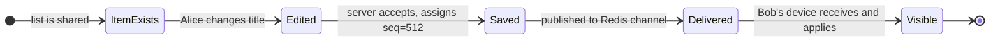

That is the whole product, in one picture. Everything we add later (conflict resolution, offline sync, permissions) is a complication on top of this.

> **Take this with you.** A shared todo list is not a chat app and not a document editor. It is closer to a shared spreadsheet where each item is a row. That framing keeps the design grounded.

---

## Step 2: Ask the right questions

In a real interview, sit quietly for two minutes. Write down what you want to ask. Not twenty questions. Five good ones.

<details markdown="1">
<summary><b>Show: 5 questions that change the design</b></summary>

1. **How real-time is real-time?** Is a 2-second delay okay, or do we need sub-100ms like Google Docs where you see each keystroke? *This one answer drives 60% of the design. Two seconds means polling works. Sub-second means WebSocket. Sub-100ms co-editing means CRDT.*

2. **Can a person you invited re-share with someone else?** *Changes the permission model from a flat list of users to a tree with `granted_by` chains. Also affects what happens when you revoke someone.*

3. **Is offline support a first-class feature?** *If yes, the client needs a local op queue on disk and the server must accept out-of-order ops with client-side IDs. If no, every write requires a live connection and the whole design gets simpler.*

4. **What roles?** Viewer, editor, admin? *Two roles cover 90% of cases. Three cover nearly everything.*

5. **How long is the history kept?** Can Bob undo a deletion from last week? Or just the last 30 seconds? *Affects how long you keep the op log and what your compaction policy looks like.*

A strong candidate also names what is out of scope: rich-text editing inside items, file attachments, calendar sync, sub-tasks. Each one would double the scope.

</details>

---

## Step 3: How big is this thing?

Same product, two very different companies.

| Scale | Writes/sec (peak) | Reads/sec (peak) | Concurrent WebSocket | Storage, 2 years |
|-------|-------------------|------------------|----------------------|------------------|
| 10k DAU | 10 | 15 | ~2,000 | 40 MB state + ~60 GB op log |
| 1M DAU | 1,000 | 1,500 | ~200,000 | 4 GB state + ~6.5 TB op log |

<details markdown="1">
<summary><b>Show: how the numbers come out</b></summary>

Assume each daily active user adds or checks off 30 items per day, opens the app 15 times, and holds one WebSocket open when active. About 20% of users are active at peak.

**At 10k DAU:**

- Writes: 10k × 30 = 300k/day = ~3.5/sec average, **10/sec peak**. Tiny.
- Reads: 10k × 15 opens × 3 lists per session = 450k/day = ~5/sec average, **15/sec peak**. Tiny.
- WS connections: 20% of 10k = **2,000**. One 4 GB server handles that easily.
- Storage: 10k users × 20 lists × 100 items × ~200 bytes = **40 MB** for current state.
- Fan-out: each write to a 5-person list pushes to 4 other devices. At 10 writes/sec that is **40 deliveries/sec**. Trivial.

**At 1M DAU:**

- Writes: 1M × 30 = 30M/day = **~350/sec average, 1,000/sec peak**. Still fine for one Postgres on beefy hardware.
- Reads: 1M × 15 × 3 = 45M/day = **~520/sec average, 1,500/sec peak**.
- WS connections: 20% of 1M = **200,000 open sockets**. A typical Node.js or Go server handles ~50k per box. You need 4 to 8 boxes.
- Storage: 1M users × 20 × 100 × 200 bytes = **4 GB** for current state. The op log at 30 ops/user/day × 200 bytes × 1M users × 730 days ≈ **4.4 TB** if you kept everything. You will compact it.
- Fan-out: 1k writes/sec × 4 collaborators = **4,000 deliveries/sec**, spread across many WS pods.

**What the math is telling you:**

Write throughput is not the problem. Even at 1M users, 1k writes/sec is a light day for Postgres.

The hard problems are:

- **Connection count.** 200k open sockets cannot live on one machine.
- **Fan-out across pods.** Alice's write lands on pod A but Bob's connection lives on pod B. Pod A needs a way to tell pod B. Redis pub/sub is what solves this.
- **Op log storage.** Keep 30 days of ops per list. Clients offline longer than 30 days refetch full state. This caps the log at roughly **60 GB** per million DAU.

</details>

> **Take this with you.** Write rate is not the bottleneck. The two hard numbers are concurrent socket count and fan-out delivery.

---

## Step 4: The smallest thing that works

Forget the million-user case. We have a 10-person team. One list. Two people sharing it. No offline, no reconnect, no Redis.

Three boxes. Nothing else.

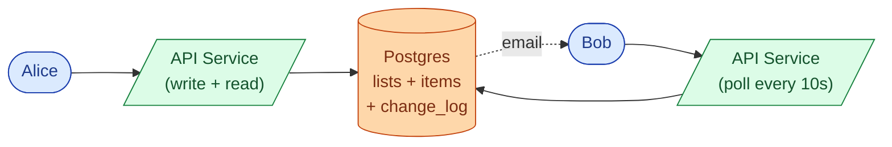

Bob just polls. Every 10 seconds he calls `GET /lists/L/changes?since_seq=X`. If nothing changed, he gets an empty array. If Alice added an item, he gets the op.

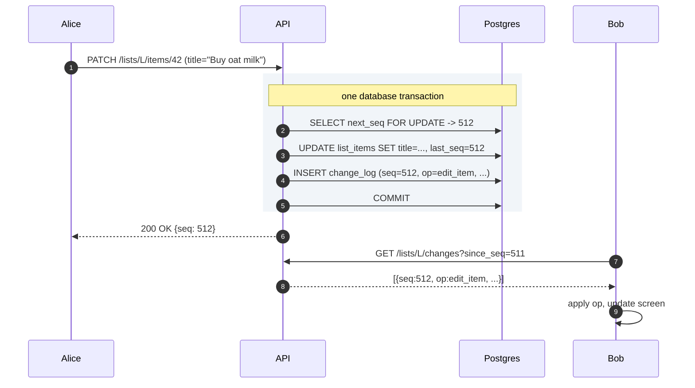

<details markdown="1">
<summary><b>Show: the five tables</b></summary>

```sql
CREATE TABLE users (
    user_id      UUID PRIMARY KEY,
    email        CITEXT UNIQUE NOT NULL,
    display_name TEXT NOT NULL,
    created_at   TIMESTAMPTZ NOT NULL DEFAULT NOW()
);

CREATE TABLE lists (
    list_id    UUID PRIMARY KEY,
    owner_id   UUID NOT NULL REFERENCES users(user_id),
    title      TEXT NOT NULL,
    next_seq   BIGINT NOT NULL DEFAULT 1,
    created_at TIMESTAMPTZ NOT NULL DEFAULT NOW(),
    deleted_at TIMESTAMPTZ
);

CREATE TABLE list_items (
    item_id    UUID PRIMARY KEY,
    list_id    UUID NOT NULL REFERENCES lists(list_id),
    title      TEXT NOT NULL,
    done       BOOLEAN NOT NULL DEFAULT FALSE,
    order_key  TEXT NOT NULL,
    created_by UUID NOT NULL REFERENCES users(user_id),
    last_seq   BIGINT NOT NULL,
    deleted_at TIMESTAMPTZ
);
CREATE INDEX idx_items_list ON list_items (list_id, order_key) WHERE deleted_at IS NULL;

CREATE TABLE share_grants (
    grant_id   UUID PRIMARY KEY,
    list_id    UUID NOT NULL REFERENCES lists(list_id),
    grantee_id UUID NOT NULL REFERENCES users(user_id),
    role       TEXT NOT NULL,
    granted_by UUID NOT NULL REFERENCES users(user_id),
    granted_at TIMESTAMPTZ NOT NULL DEFAULT NOW(),
    revoked_at TIMESTAMPTZ
);
CREATE UNIQUE INDEX idx_grants_active
    ON share_grants (list_id, grantee_id) WHERE revoked_at IS NULL;

CREATE TABLE change_log (
    list_id      UUID NOT NULL,
    seq          BIGINT NOT NULL,
    op           TEXT NOT NULL,
    actor_id     UUID NOT NULL,
    payload      JSONB NOT NULL,
    client_op_id UUID,
    occurred_at  TIMESTAMPTZ NOT NULL DEFAULT NOW(),
    PRIMARY KEY (list_id, seq)
);
CREATE UNIQUE INDEX idx_change_log_idem
    ON change_log (list_id, client_op_id) WHERE client_op_id IS NOT NULL;
```

The `change_log` is the spine. It powers real-time delivery, reconnect catch-up, undo, and offline sync. Every other feature builds on it.

</details>

> **Take this with you.** Always start from the smallest thing that works. The interesting part of the interview is what happens next.

---

## Step 5: The first crack

Ten seconds is fine for a shopping list. But the product manager has just demoed the app and says: *"Users complain that when someone checks an item off, the other person doesn't see it immediately. Can we make it instant?"*

You look at the polling code. 10-second lag is baked into the protocol. You could drop it to 2 seconds, but then Bob's phone is hammering the server 30 times a minute. At 1M users that is 500,000 requests per second, most returning "nothing new." Wasteful.

The fix is to flip the relationship. Instead of Bob asking *"anything new?"* every few seconds, the server tells Bob the moment something changes. That is what WebSocket is for.

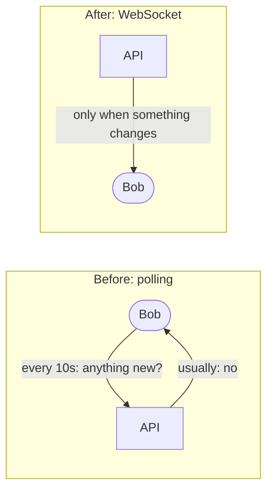

The change is conceptually small. In practice it introduces a new problem: Alice and Bob might be connected to different servers. When Alice writes, how does Bob's server find out?

> **Take this with you.** Polling is not lazy design. At small scale it is cheaper and simpler than WebSocket. Switch when the polling cost (battery on mobile, wasted server work) outweighs the engineering cost.

---

## Step 6: Build the architecture, one layer at a time

### v1: one server, polling

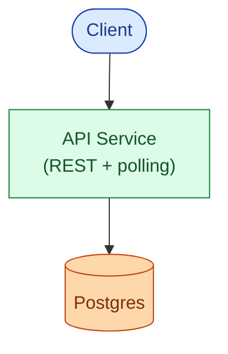

Fine for a small team. Ships in a week.

### v2: add WebSocket, still one server

Split the API service into two. The REST API handles writes. The WebSocket service holds open sockets. When Alice writes, the REST API needs a way to tell the WS service immediately. Because there is only one WS process, an in-process channel works (Go channel, Node.js EventEmitter, asyncio.Queue).

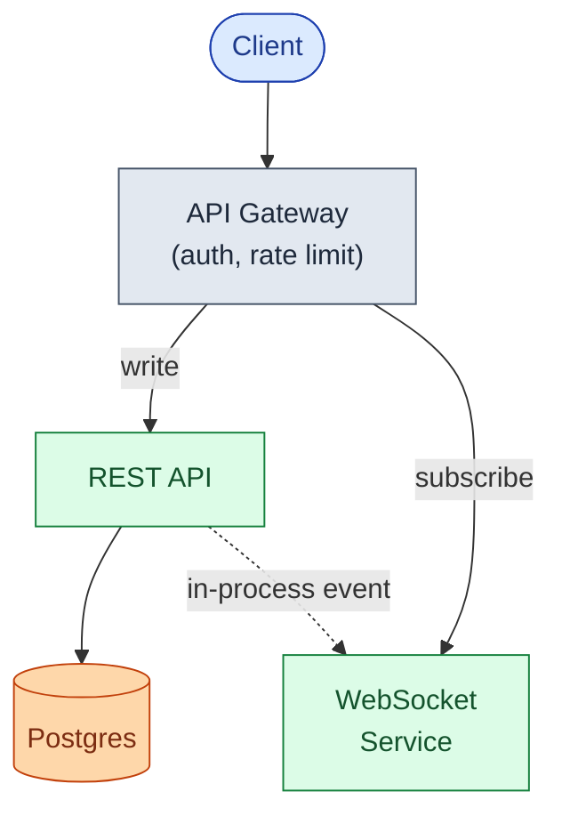

**Why two services and not one?** They scale very differently. The REST API is request/response with low memory per connection. The WS service is connection-heavy, with 10 to 50 KB memory per open socket. Splitting them lets each scale on its axis.

### v3: multiple WS pods need a fan-out bus

At ~30k concurrent sockets you need more than one WS pod. Now Alice's write can land on pod A but Bob's connection lives on pod B. Add Redis pub/sub as the fan-out bus. Every write publishes a message to a channel named `list:{list_id}`. Every WS pod that has at least one subscriber for that list receives it and forwards to local sockets.

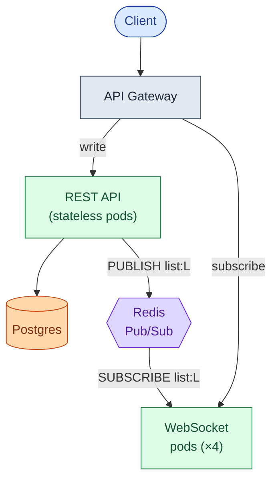

### v4: add the permission cache, notifications, and op log compaction

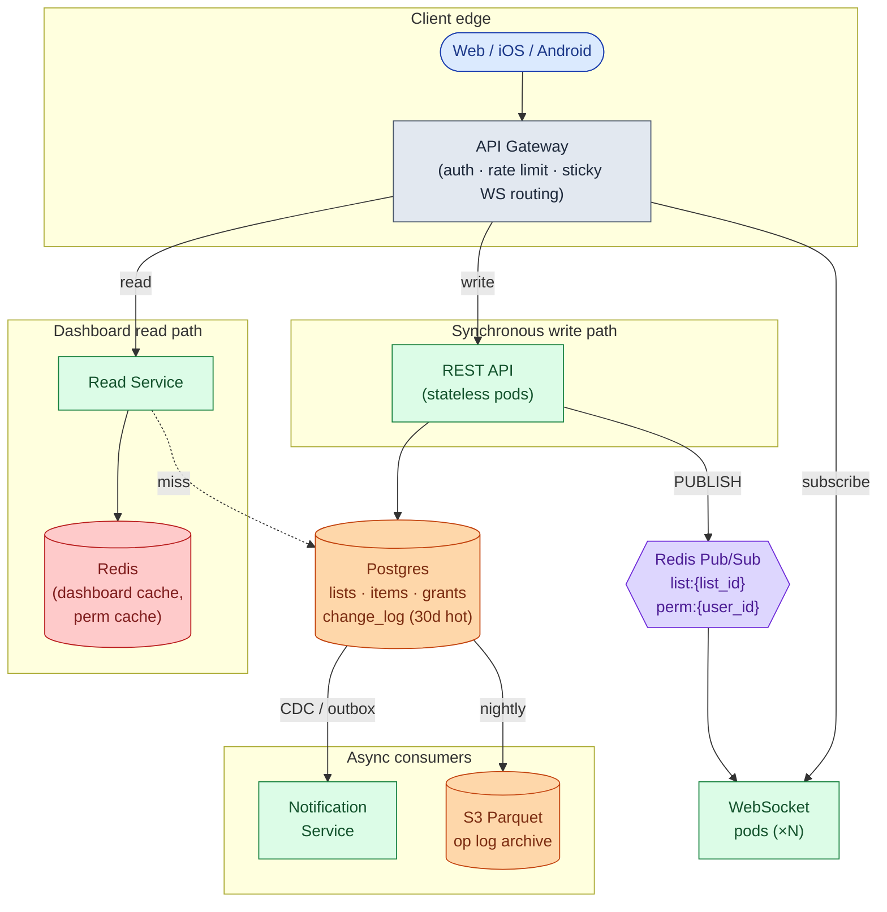

Each box in one line:

| Box | What it does |
|-----|--------------|
| **API Gateway** | Authenticates the caller, rate-limits bots, routes WS upgrades to the right pod |
| **REST API** | Handles all writes: create list, add item, check off, share. Appends to `change_log` in the same transaction |
| **WebSocket pods** | Hold open sockets. Subscribe to Redis channels. Forward messages to local sockets |
| **Postgres** | Source of truth. Current state plus the last 30 days of `change_log` |
| **Redis pub/sub** | The fan-out bus. Also carries permission-revocation events |
| **Read Service + Redis cache** | Serves the "my lists" dashboard. One cache read, no DB query in the common case |
| **Notification Service** | Consumes `change_log` via CDC, batches per recipient, sends push/email |
| **S3 cold tier** | Op log older than 30 days. Queried rarely, mostly for compliance |

> **Take this with you.** Postgres is the source of truth. Redis is just the delivery channel. If a Redis message is lost (pub/sub is fire-and-forget), clients detect the gap via seq numbers and call the catch-up endpoint. Nothing is lost.

---

## Step 7: One write, all the way through

Alice edits item #42 on her phone. Bob has the same list open on his laptop. Watch what happens.

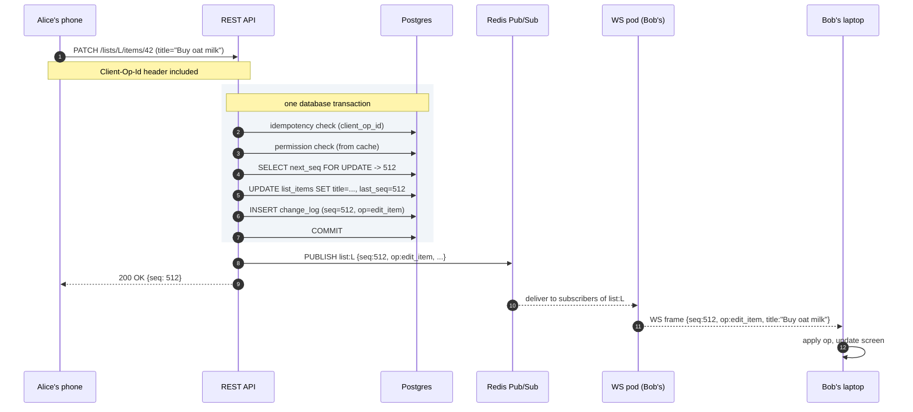

Three things worth pointing at:

1. The seq bump, the item update, and the `change_log` row are written in **one transaction**. If anything fails, it all rolls back. Alice gets a 500. Bob never sees a partial update.
2. The Redis publish happens **after** the commit. If you publish inside the transaction and it rolls back, subscribers see ops that never persisted.
3. Bob's client knows it last saw `seq=511`. When `seq=512` arrives in order, apply it. If `seq=514` arrived first (gap), the client calls the catch-up endpoint to fill in `seq=513` before applying.

---

## Step 8: The conflict problem

Alice and Bob both have the same list open. At the same moment:

- Alice changes item #42 from "Buy milk" to "Buy oat milk."
- Bob changes item #42 from "Buy milk" to "Buy almond milk."

Both writes hit the server within 50ms of each other. Whose title wins?

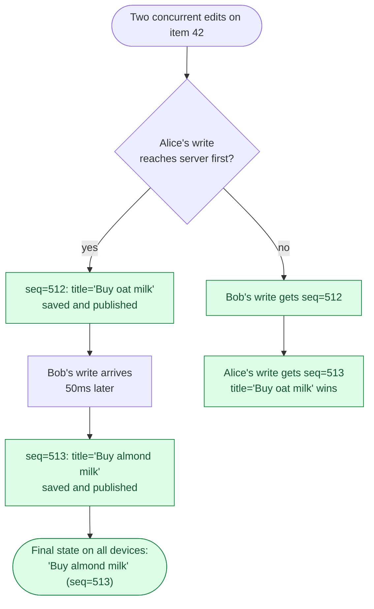

This is **last-write-wins by server-assigned sequence number (LWW)**. The server decides order. No clock skew possible.

Alice's screen may briefly show "Buy oat milk" (optimistic update), then snap to "Buy almond milk" when `seq=513` arrives. For a todo list, that flash is acceptable.

<details markdown="1">
<summary><b>Show: why LWW and not OT or CRDT</b></summary>

**Last-write-wins (LWW)** is the right choice for a todo list. When two people both rename the same item, one edit has to lose. The user experience is "second one wins." That is fine.

**Operational Transform (OT)** shines when two users are typing in the same text field at the same time and you want both keystrokes preserved. That is overkill for "edit item title." Google Docs uses OT because it is a document editor. We are not.

**CRDT** earns its keep when offline editing is a first-class feature and users spend hours disconnected. CRDTs guarantee that two clients that diverged for any length of time will converge to the same final state without a server round-trip. The cost is real: bigger payload per op (merge metadata travels with the data), harder to debug, more complex client code. LWW is the right first choice for a todo list. CRDT makes sense later, for the title field, when the offline complaint is loud enough.

**Why not wall-clock timestamps for LWW?** Alice's phone might be 30 seconds ahead of Bob's. Use server-assigned seq numbers instead. Higher seq wins. No clock skew possible.

</details>

> **Take this with you.** Use LWW for a todo list. Use CRDT for the title field only, once offline editing is a primary complaint. Never use OT unless you are building a document editor.

---

## Step 9: Permissions

Alice owns a list. She shares it with Bob as editor and Carol as viewer.

Bob wants to share the list with Dave. Does Bob have that authority?

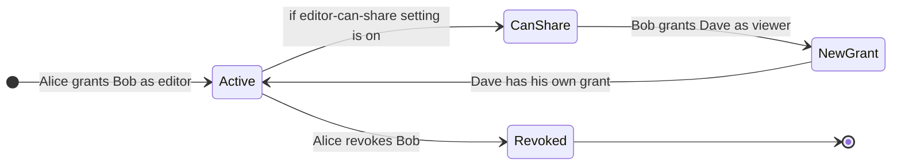

Three roles. Six permissions. Simple enough to reason about.

| Role | Read items | Write items | Share list | Manage members | Delete list |
|------|------------|-------------|------------|----------------|-------------|
| **viewer** | yes | no | no | no | no |
| **editor** | yes | yes | per-list setting | no | no |
| **admin** | yes | yes | yes | yes | yes |

<details markdown="1">
<summary><b>Show: the grants table and cascade rules</b></summary>

```sql
CREATE TABLE share_grants (
    grant_id   UUID PRIMARY KEY,
    list_id    UUID NOT NULL,
    grantee_id UUID NOT NULL,
    role       TEXT NOT NULL,
    granted_by UUID NOT NULL,
    granted_at TIMESTAMPTZ NOT NULL DEFAULT NOW(),
    revoked_at TIMESTAMPTZ
);
CREATE UNIQUE INDEX idx_grants_active
    ON share_grants (list_id, grantee_id)
    WHERE revoked_at IS NULL;
```

A user has access if there is a row with their `grantee_id` and a NULL `revoked_at`. The partial unique index prevents accidentally giving someone two roles on the same list.

**Does Dave lose access when Alice revokes Bob?**

Two models. Pick one and defend it:

- **Non-cascading (recommended).** Revoking Bob does NOT revoke Dave. Dave has his own grant. Alice can see Bob added Dave and choose to revoke Dave separately. The UI prompts: "Bob added 1 other person. Remove them too?" Make it explicit, not automatic. Notion and Slack both work this way.
- **Cascading.** Revoking Bob automatically revokes everyone Bob invited, recursively. Harder to reason about. Surprises users.

**Cache the permission check.** Store `(user_id, list_id) -> role` in Redis with a 60-second TTL. A user touches the same few lists repeatedly. Hit rate is very high. Invalidate on any grant change. If Bob is revoked, publish to a `perm:{bob_user_id}` Redis channel. Every WS pod that has Bob's connection drops his subscription to `list:L` immediately.

Without the cache: every write triggers a Postgres permission lookup. At 1k writes/sec that is 1k extra queries/sec. With a 95% cache hit rate it drops to 50/sec.

</details>

> **Take this with you.** Permissions are enforced by the server, not the client. The client greys out buttons as a courtesy. The server checks every time.

---

## Follow-up questions

Try answering each in 2 to 4 sentences before opening the solution.

1. **Reconnect after a long disconnect.** Bob's phone has been offline for 4 hours. He reconnects and his client knows it last saw `seq=412` on list L. How does the server send Bob just the deltas, and what do you do when someone has been offline for 6 weeks?

2. **Presence.** Bob wants to see a small avatar showing that Alice is currently viewing the list. How do you do this without writing to Postgres every second?

3. **Permission revoked while connected.** Alice revokes Bob while Bob has the list open and his WebSocket is still subscribed. How quickly does Bob actually lose access, and what does his client show?

4. **Item ordering.** Users can drag items to reorder. Two users drag the same item at the same moment. How do you represent the order so it does not produce a mess?

5. **Notifications.** When Alice adds an item, Bob should get a push notification. Where in your design does this happen, and how do you avoid sending Bob 50 notifications when Alice adds 50 items in 10 seconds?

6. **Search.** Bob wants to search across all his lists for "milk." How do you do this without scanning every item in every list?

7. **Undo.** Bob accidentally deletes an item and hits Cmd-Z. How does this work, and what happens if other collaborators have already seen the deletion?

8. **Sticky routing fails.** Your load balancer cannot guarantee a returning client lands on the same WS pod. The new pod knows nothing about Bob's subscriptions. What happens, and how do you recover?

9. **A list with 50,000 subscribers.** A celebrity creates a "Daily affirmations" list and 50k people follow it. Every edit fans out to 50k clients. What breaks first, and what do you do?

10. **Privacy.** Bob is on Alice's list and can see other members' names. Some users want to be listed as anonymous. How do you support that?

---

## Related problems

- **[Approval Management Service (011)](../011-approval-management/question.md).** Also uses an append-only op log as the spine. Compare the `change_log` here with the `audit_log` there. Same idea, different consumers.
- **[Comment System (015)](../015-comment-system/question.md).** Comments use the same real-time fan-out and permission checks. Thread structure and notification batching apply directly.
- **[Read-Heavy System Patterns (017)](../017-read-heavy-patterns/question.md).** The "render Bob's dashboard" path is a heavy read. The caching patterns there apply here.


<div class="pr-solution-divider"></div>


## Solution: Todo List with Sharing and Collaboration

### The short version

Strip collaboration away and this is a small CRUD app. Add it and two things get interesting:

1. Pushing changes to other people's devices in near real-time.
2. Merging edits from devices that were offline when those changes happened.

Everything else flows from solving those two.

The data model fits on a napkin: `users`, `lists`, `list_items`, `share_grants`, and an append-only `change_log` keyed by `(list_id, seq)`. The `change_log` is the spine. It powers real-time push, reconnect catch-up, undo, and offline sync. Skip it and every one of those features becomes its own hack.

Real-time delivery is **WebSocket with polling fallback**. Writes go to the REST API. The API saves to Postgres and publishes to a Redis pub/sub channel named after the list. Every WS pod subscribed to that channel forwards the message to local sockets.

Conflict resolution is **last-write-wins by server-assigned per-list sequence number**, with tombstones for deletes. CRDTs earn their keep only later, when offline-first becomes a primary complaint.

Scale is four stages: one Postgres with polling, add WebSocket, add Redis pub/sub and multiple WS pods, then shard and go regional.

---

### 1. The two questions that matter most

**How real-time is real-time?** That answer decides whether you build WebSocket on day one or just poll every 5 seconds. 2-second delay means polling works fine. Sub-second means WebSocket. Sub-100ms with two people editing the same field simultaneously means CRDT.

**Is offline support a first-class feature?** If yes, the client needs a local op queue persisted to disk (SQLite on phones) and the server must accept ops with client-side IDs and out-of-order timestamps. If no, every write requires a live connection and the design gets noticeably simpler.

Everything else (permissions, ordering, notifications, undo) follows from those two answers.

---

### 2. The math, in plain numbers

| Scale | Writes/sec (peak) | Reads/sec (peak) | Concurrent WS | Storage, 2 years |
|-------|-------------------|------------------|---------------|------------------|
| 10k DAU | 10 | 15 | ~2,000 | 40 MB state + ~60 GB op log |
| 1M DAU | 1,000 | 1,500 | ~200,000 | 4 GB state + ~6.5 TB op log (compact to ~60 GB) |

Three things stand out:

- **Write rate is not the bottleneck.** A single Postgres handles 1k writes/sec on beefy hardware. Throughput is not the hard part.
- **200k concurrent WebSockets cannot live on one machine.** At ~50k sockets per pod you need 4 to 8 pods, plus a way for a write on pod A to reach subscribers on pod B. That is the Redis pub/sub problem.
- **The op log dominates storage if you keep it forever.** Compact it. Keep 30 days of ops per list plus a snapshot. Clients offline longer than 30 days refetch full state.

Reads beat writes by raw count (the "open my lists" dashboard hits far more than writes do). Cache the per-user list summary aggressively.

---

### 3. The API

```
POST   /api/v1/lists
GET    /api/v1/lists
GET    /api/v1/lists/{list_id}
PATCH  /api/v1/lists/{list_id}
DELETE /api/v1/lists/{list_id}

POST   /api/v1/lists/{list_id}/items
PATCH  /api/v1/lists/{list_id}/items/{item_id}
DELETE /api/v1/lists/{list_id}/items/{item_id}
```

Every write carries a `Client-Op-Id` header: a UUID the client generates at the moment of the edit. If the same ID arrives twice within 24 hours, the server returns the original result instead of applying the op again. This is what saves you from mobile retries creating duplicate items.

Sharing:

```
POST   /api/v1/lists/{list_id}/shares
DELETE /api/v1/lists/{list_id}/shares/{grant_id}
POST   /api/v1/lists/{list_id}/invite-link
POST   /api/v1/invite/{token}/accept
```

Catch-up after reconnect:

```
GET /api/v1/lists/{list_id}/changes?since_seq=412
```

Returns the ordered list of ops with `seq > 412`, up to 500 per response. If the gap is older than the compaction window, the server replies `too_far_behind: true` and the client refetches full state.

WebSocket subscription (after upgrade):

```json
{
  "type": "subscribe",
  "list_ids": ["L1", "L2"],
  "since_seq": { "L1": 412, "L2": 0 }
}
```

The server replays missed ops per list, then pushes new ones as they happen. Ping/pong every 30 seconds. Connection killed after 60 seconds of silence.

| Status code | Meaning |
|-------------|---------|
| **200** | Op accepted |
| **201** | New resource created |
| **403** | User does not have the required role |
| **404** | List or item not found (also returned when user has no read access, to avoid probing) |
| **409** | Same `Client-Op-Id` reused with different payload |
| **410** | Item was tombstoned; client must refresh |
| **429** | Rate limited |

---

### 4. The data model

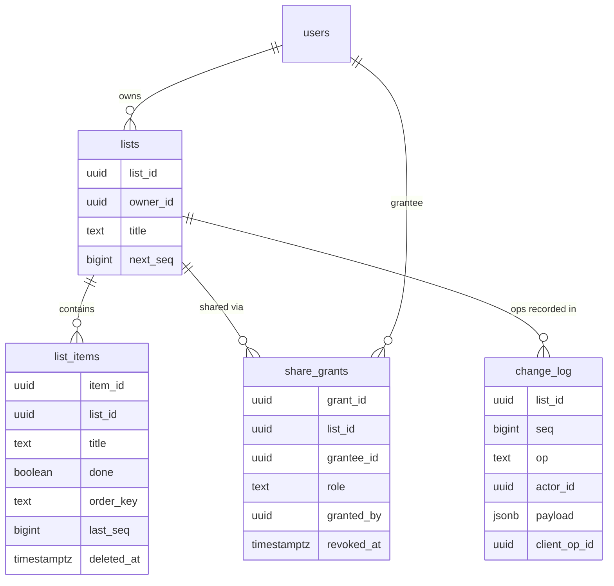

<details markdown="1">
<summary><b>Show: the full SQL</b></summary>

```sql
CREATE TABLE users (
    user_id      UUID PRIMARY KEY,
    email        CITEXT UNIQUE NOT NULL,
    display_name TEXT NOT NULL,
    created_at   TIMESTAMPTZ NOT NULL DEFAULT NOW()
);

CREATE TABLE lists (
    list_id    UUID PRIMARY KEY,
    owner_id   UUID NOT NULL REFERENCES users(user_id),
    title      TEXT NOT NULL,
    settings   JSONB NOT NULL DEFAULT '{}',
    next_seq   BIGINT NOT NULL DEFAULT 1,
    created_at TIMESTAMPTZ NOT NULL DEFAULT NOW(),
    deleted_at TIMESTAMPTZ
);

CREATE TABLE list_items (
    item_id    UUID PRIMARY KEY,
    list_id    UUID NOT NULL REFERENCES lists(list_id),
    title      TEXT NOT NULL,
    done       BOOLEAN NOT NULL DEFAULT FALSE,
    order_key  TEXT NOT NULL,
    created_by UUID NOT NULL REFERENCES users(user_id),
    last_seq   BIGINT NOT NULL,
    deleted_at TIMESTAMPTZ
);
CREATE INDEX idx_items_list ON list_items (list_id, order_key) WHERE deleted_at IS NULL;

CREATE TABLE share_grants (
    grant_id   UUID PRIMARY KEY,
    list_id    UUID NOT NULL REFERENCES lists(list_id),
    grantee_id UUID NOT NULL REFERENCES users(user_id),
    role       TEXT NOT NULL,
    granted_by UUID NOT NULL REFERENCES users(user_id),
    granted_at TIMESTAMPTZ NOT NULL DEFAULT NOW(),
    revoked_at TIMESTAMPTZ
);
CREATE UNIQUE INDEX idx_grants_active
    ON share_grants (list_id, grantee_id)
    WHERE revoked_at IS NULL;

CREATE TABLE change_log (
    list_id      UUID NOT NULL,
    seq          BIGINT NOT NULL,
    op           TEXT NOT NULL,
    actor_id     UUID NOT NULL,
    payload      JSONB NOT NULL,
    client_op_id UUID,
    occurred_at  TIMESTAMPTZ NOT NULL DEFAULT NOW(),
    PRIMARY KEY (list_id, seq)
);
CREATE UNIQUE INDEX idx_change_log_idem
    ON change_log (list_id, client_op_id)
    WHERE client_op_id IS NOT NULL;
```

</details>

Five design choices doing real work:

**`next_seq` lives on the `lists` row.** Every write does `SELECT next_seq FROM lists WHERE list_id = $1 FOR UPDATE`, bumps it, and inserts the op. The lock serializes concurrent writes on the same list. Ops on different lists run in parallel.

**`order_key` is TEXT, not INTEGER.** This is fractional indexing (also called LexoRank). Between items with keys `"a"` and `"c"`, insert `"b"`. Between `"a"` and `"b"`, insert `"am"`. Two people can reorder items without renumbering everything.

**`deleted_at` is a tombstone, not a DELETE.** The row stays so the deletion event can be propagated to offline clients and so undo can restore it. Hard delete means an offline client editing a deleted item gets a 404 with no context.

**Unique index on `(list_id, client_op_id)` in `change_log`.** Two concurrent retries with the same `client_op_id` cleanly collapse to one. The second INSERT fails with a unique violation. The API returns the original result.

**No foreign key from `change_log` to `list_items`.** An op exists even after an item is hard-deleted. Useful for audit replay.

Why Postgres and not Cassandra? This system needs transactions. Bumping `next_seq` and inserting to `change_log` must be atomic. Postgres gives ACID for free. Cassandra would force you to invent your own seq generator and accept eventual consistency between the log and the item table.

---

### 5. The architecture

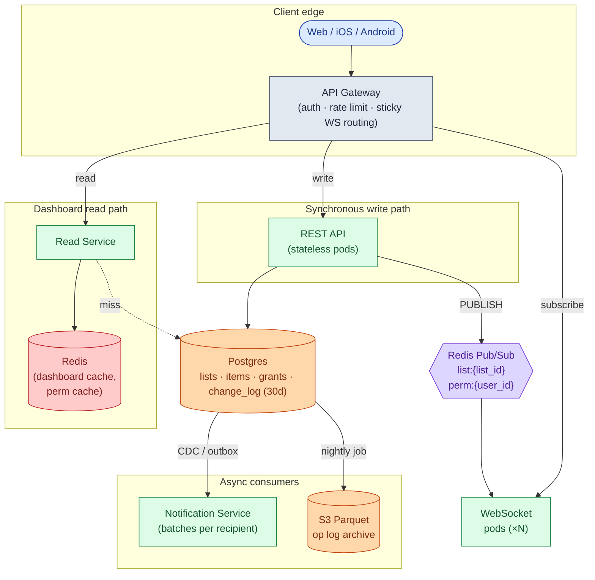

Five things to notice:

- API pods and WS pods are separate because they scale on different axes: QPS vs concurrent connections.
- Postgres is the source of truth. Redis is the delivery channel. If a Redis message is lost (pub/sub is fire-and-forget), clients detect the gap via seq numbers and call the catch-up endpoint. Nothing is permanently lost.
- The Read Service serves the "my lists" dashboard from Redis. One cache read, no DB query in the common case.
- The Notification Service is downstream of `change_log`. It is not on the write path. If it goes down, writes still succeed. Notifications just queue up.
- Permission revocation goes through a `perm:{user_id}` Redis channel so every WS pod drops the affected subscription within 2 seconds, not 60.

---

### 6. The write path

Every write that mutates list state follows the same skeleton.

<details markdown="1">
<summary><b>Show: the apply_op function</b></summary>

```python
def apply_op(list_id, actor_id, op_type, payload, client_op_id):
    with db.transaction():
        # 1. Idempotency check
        if client_op_id:
            existing = db.query_one("""
                SELECT seq FROM change_log
                WHERE list_id = %s AND client_op_id = %s
            """, list_id, client_op_id)
            if existing:
                return existing           # already applied; return original result

        # 2. Permission check (Redis-cached for 60s)
        if not can(actor_id, list_id, action_for(op_type)):
            raise Forbidden()

        # 3. Get next seq (FOR UPDATE serializes writes on this list)
        lst = db.query_one(
            "SELECT next_seq FROM lists WHERE list_id = %s FOR UPDATE",
            list_id
        )
        seq = lst.next_seq
        db.execute(
            "UPDATE lists SET next_seq = %s WHERE list_id = %s",
            seq + 1, list_id
        )

        # 4. Apply the op to list_items
        apply_op_to_state(op_type, list_id, payload, seq)

        # 5. Append to change_log
        db.insert("change_log",
                  list_id=list_id, seq=seq, op=op_type,
                  actor_id=actor_id, payload=payload,
                  client_op_id=client_op_id)

    # 6. After commit, publish to Redis
    redis.publish(f"list:{list_id}",
                  json.dumps({"seq": seq, "op": op_type, "payload": payload}))

    return {"seq": seq}
```

</details>

Three things doing real work:

- The seq is assigned inside the transaction with a row-level lock. Ops on the same list are serialized. Ops on different lists run in parallel.
- The idempotency check is inside the transaction. Two concurrent retries with the same `client_op_id` collapse to one safely.
- The Redis publish happens after the commit. Publishing inside the transaction and then rolling back would send ops to subscribers that never persisted.

---

### 7. A write, end to end

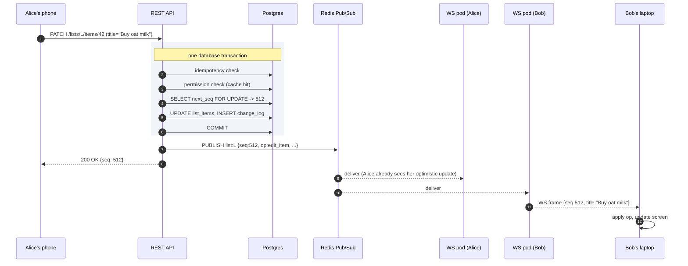

Alice gets `200 OK` before the message reaches Bob. Her optimistic update is already on screen. The response confirms the seq. End to end (Alice presses Enter to Bob's screen updating) is roughly **150 to 300 ms** in the same region.

---

### 8. Conflict resolution

Last-write-wins by per-list seq. Higher seq wins. When Alice and Bob both edit item #42, the op that arrives at the server second gets a higher seq and its value is the final one.

<details markdown="1">
<summary><b>Show: the client-side merge function</b></summary>

```python
def apply_remote_op(local_state, op):
    if op.op == "edit_item":
        item = local_state.items.get(op.item_id)
        if item is None:
            return                        # deleted locally; skip
        if item.last_seq >= op.seq:
            return                        # we have newer; skip
        item.title = op.payload.title
        item.last_seq = op.seq

    elif op.op == "delete_item":
        item = local_state.items.get(op.item_id)
        if item is None:
            return
        if item.last_seq >= op.seq:
            return
        item.deleted = True
        item.last_seq = op.seq

    elif op.op == "add_item":
        if op.item_id in local_state.items:
            return                        # already have it
        local_state.items[op.item_id] = Item(
            title=op.payload.title,
            order_key=op.payload.order_key,
            last_seq=op.seq,
        )
```

</details>

**Tombstones for deletes.** When Alice deletes item #42 at seq=600, the row stays in the database with `deleted_at = now()`. The op fans out. Clients set their local copy to deleted. If Bob was offline and edited #42, his late edit gets stamped seq=900. The edit lands but the item stays hidden because `deleted_at IS NOT NULL`. If Alice later undoes the delete, Bob's edit is visible again.

**Op log compaction.** Keep the last 30 days per list. Older ops are summarized into a snapshot record. Clients with `since_seq` older than 30 days get `too_far_behind: true` and refetch full state.

---

### 9. The offline sync flow

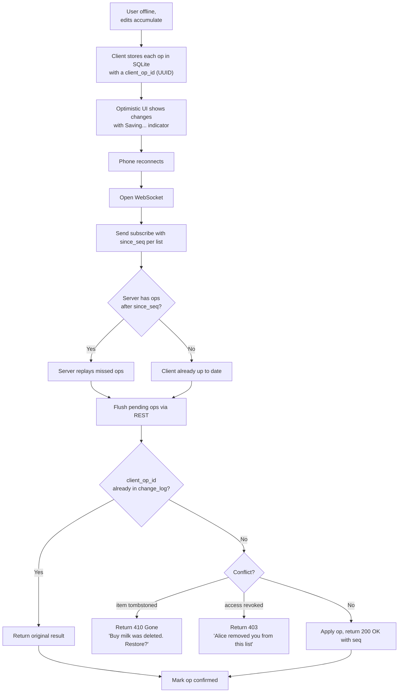

> **Take this with you.** `client_op_id` is non-negotiable. Without it, mobile retries create duplicate items. The unique index on `(list_id, client_op_id)` in `change_log` is what makes "already applied" detection safe.

---

### 10. The scaling journey: 10 users to 1 million

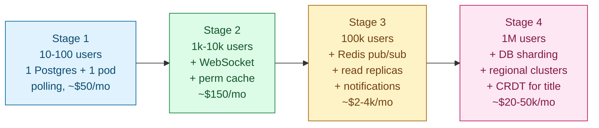

#### Stage 1: 10 to 100 users

One Postgres, one app server. Client polls `GET /lists/L/changes?since_seq=X` every 10 seconds. No Redis. Permission check is a DB query. ~$50/month. Ships in a week.

Enough because 100 users at 30 ops/day is 0.04 ops/sec. Building more is over-engineering.

#### Stage 2: 1,000 to 10,000 users

Something breaks: power users with actively-edited lists notice the 10-second lag. Polling cost climbs (200 active users polling every 10 sec = 20 polls/sec, most returning nothing). Mobile users burn battery.

Add a WebSocket service. Because there is still one WS pod, the REST API signals it via an in-process channel. Add a per-user permission cache in Redis (60-second TTL). Add one Postgres read replica for dashboard reads. Keep the polling fallback endpoint for strict firewalls. ~$150/month.

Do not yet add Redis pub/sub, multiple WS pods, or DB sharding.

#### Stage 3: 100,000 users

Several things break at once. 30k concurrent sockets are too many for one WS pod. A popular list with 50 active editors fans out writes across pods that cannot talk to each other. The "my lists" dashboard takes 800ms for users with 200+ lists. Revoked permissions linger for up to 60 seconds.

Fix in order:

- 4 to 8 WS pods at 50k sockets each. Load balancer routes by `user_id` hash for stickiness.
- **Redis pub/sub for cross-pod fan-out.** REST API publishes to `list:{list_id}`. WS pods subscribe to channels for lists their users watch.
- Dashboard denormalization: a `user_list_summaries` Redis hash per user, updated by a worker consuming `change_log` events. Dashboard load becomes one Redis `HGETALL`.
- `perm:{user_id}` Redis channel for instant revocation across all WS pods.
- Nightly job archiving `change_log` rows older than 30 days to S3 Parquet.
- Notification Service consuming via CDC or outbox, batching per recipient over 60 seconds.

~$2-4k/month.

#### Stage 4: 1 million users

New problems: 200k concurrent sockets. One Redis pub/sub node getting hot at 1k publishes/sec. Users in Europe see 200ms latency to US-east. Power users who edited offline on a 12-hour flight find 5 of their 30 changes were overwritten by another device.

Fixes:

- Shard Postgres by `hash(list_id)` into 16 shards.
- Regional WS clusters with per-region Redis. A cross-region replication bridge forwards ops between regions.
- Redis in cluster mode, partitioned by `hash(list_id)`.
- **CRDT (Yjs) for the title field only.** The rest stays LWW. This fixes the offline-conflict complaint for the one field where it hurts most.
- Dedicated broadcast pods for popular lists (> 5k subscribers).

~$20-50k/month.

The core architecture has not fundamentally changed since Stage 3. You added regions, sharding, and CRDT for one field. The data model is the same one you wrote at Stage 1.

---

### 11. Reliability

**Postgres primary fails.** Promote a replica. Writes are unavailable for 30 to 60 seconds. The API returns `503 Retry-After: 30`. WS pods keep connections open. Clients see a "Saving..." banner.

**Redis pub/sub node fails.** Subscribers reconnect to the new node. During the 5 to 10 second gap, no live messages are delivered. Clients use the catch-up flow: send `since_seq`, server replays from `change_log`. No ops are lost. Postgres is the source of truth.

**WS pod crashes.** All connections on that pod die. Clients reconnect with exponential backoff. The load balancer routes to a healthy pod. The catch-up flow fills in missed ops. Worst case for a user: a 5-second visible disconnect.

**Bad WS service release.** Send a "reconnect please" message to each socket before shutting down, then wait 10 seconds. Clients reconnect smoothly to a sibling pod. No thundering herd.

**Buggy client sends 10k ops/sec.** Per-user rate limiter (default 100/min). Sustained abuse triggers a 5-minute circuit breaker returning `429`. An alert fires.

---

### 12. Observability

| Metric | Why it matters |
|--------|----------------|
| `ops.applied.rate` | Spike means abuse or a buggy client. Drop means the write path is broken. |
| `ws.connections.current` per pod | Pods nearing 50k need a scale-out. |
| `ws.fanout.latency.p99` | From op committed to last subscriber receiving. SLO: <500ms regionally. |
| `ws.disconnect.rate` | Spike means a bad deploy, a network event, or NAT timeouts. |
| `pubsub.subscribers` per channel | Detect hot lists with very many subscribers. |
| `lists.next_seq.lock_wait.p99` | High means one list is being hammered by many concurrent writers. |
| `dashboard.cache.hit_rate` | Should be >90%. Drop means the cache or invalidation is broken. |
| `change_log.catchup.bytes.p99` | If clients download >10 KB on reconnect, they were offline a long time. |
| `perm.revocation.propagation.p99` | From revoke API call to all WS pods cutting access. SLO: <2 sec. |
| `db.replication_lag.p99` | If >2 sec, reads serve stale state. |

Page on: WS fan-out p99 > 2 sec for 5 min. Write error rate > 2%. Any pub/sub subscriber pileup.

Ticket on: dashboard cache hit rate < 70%. Permission revocation latency > 5 sec. Any single list with > 5k subscribers.

---

### 13. Follow-up answers

**1. Reconnect after a long disconnect.**

Bob's client knows `since_seq=412` for list L. On reconnect it calls `GET /lists/L/changes?since_seq=412`. Server returns up to 500 ops at a time (`has_more: true` if there are more). If 412 is older than the compaction window, the server returns `too_far_behind: true, current_seq: 9001`. The client refetches full state via `GET /lists/L`, then subscribes from `since_seq: 9001`. The 500-op cap prevents one user with weeks of missed ops from blocking the WS server.

**2. Presence.**

Do not write to the database. Presence is ephemeral. Each WS pod maintains `presence[list_id] = set(user_ids)` in memory. When a user subscribes to a list, the pod adds them and publishes `presence_join` to a `presence:{list_id}` Redis channel. On disconnect, publish `presence_leave`. Every WS pod subscribed to that channel merges events into its local view. A 30-second heartbeat prunes stale entries: pods re-emit their local presence, and entries not heard from in 90 seconds are dropped. Postgres: not touched.

**3. Permission revoked while connected.**

Alice calls `DELETE /lists/L/shares/{bob_grant_id}`. API sets `revoked_at = NOW()`, invalidates `(bob, L)` in the permission cache, and publishes `{revoked_lists: [L]}` to `perm:{bob_user_id}`. Every WS pod subscribed to that channel finds Bob's connections, unsubscribes them from `list:L`, and sends `{type: "access_revoked", list_id: "L"}` over the socket. Bob's client redirects to the dashboard with a banner. End-to-end latency: under 2 seconds. Worth saying out loud: once data has been delivered to a device, the server cannot truly recall it. Client-side cleanup is a defense, not a guarantee.

**4. Item ordering with concurrent reorders.**

Fractional indexing (LexoRank). Each item has an `order_key` like `"a3"`, `"aB"`, `"b1"`. To insert between `"a3"` and `"aB"`, pick `"a7"`. After many inserts in the same gap, keys grow longer. A background job re-spaces them occasionally.

Concurrent reorders: Alice moves item X to position between A and B. Bob moves X between C and D at the same time. Each generates a different `order_key`. The seq decides which sticks: the higher-seq key wins. The item ends up in one of the two intended positions. Acceptable.

**5. Notifications.**

A Notification Service consumes `change_log` via CDC (Debezium to Kafka) or an outbox table. For each event it looks up subscribers (from `share_grants`) and adds an entry to a per-recipient bucket keyed by `(recipient, list_id)`. Buckets flush on a 60-second timer after the first event. Digest text: *"Alice added 3 items and checked off 1 in Grocery list."* Per-user preferences (instant / hourly / daily) live in a `notification_prefs` table cached for 5 minutes.

**6. Search.**

For small scale: `SELECT * FROM list_items WHERE list_id IN (...accessible_list_ids...) AND title ILIKE '%milk%' AND deleted_at IS NULL LIMIT 50`. With a trigram GIN index on `title`, this is fast up to ~1M items per user.

For large scale: pipe items to Elasticsearch via CDC. Search hits ES with a `list_id IN [...]` filter for permission scoping. ES returns matches; the API rehydrates from Postgres. Permission scoping is the hard part because access changes in real time.

**7. Undo.**

Bob deletes item I (seq=600). Within 30 seconds he hits Cmd-Z. The client sends `POST /lists/L/ops/revert {target_seq: 600, client_op_id: "..."}`. Server checks: the target op exists, Bob is the original actor, the op is within the undo window. If all true, generate a compensating op (seq=601, op=`undelete_item`). Other clients receive the undelete and restore locally. Brief flash, acceptable. Outside the window: no undo. Bob recreates manually.

**8. Sticky routing fails.**

Without sticky routing, Bob's reconnect lands on a different WS pod. That pod knows nothing about his subscriptions. Fix: Bob's client re-sends `subscribe` on every reconnect with the full list of `list_ids` and per-list `since_seq`. The new pod authenticates, subscribes to the relevant Redis channels, and replays catch-up. No pod-to-pod state transfer needed. Sticky routing is just a performance optimization (warm cache, lower setup cost). The system is correct without it.

**9. A list with 50,000 subscribers.**

50k subscribers means every edit fans out to 50k sockets. Across 8 WS pods, each pod has ~6k subscribers and sends 6k messages per write. What breaks first: outbound bandwidth. A 500-byte op x 6k subscribers = 3 MB per write per pod. At 1 write/sec that is fine. At 10 writes/sec that is 30 MB/sec per pod, getting tight.

Mitigations: compact payloads (op deltas, not full item objects), coalesce writes within 100ms, dedicated broadcast pods with higher network bandwidth. For a todo list this scenario is rare. Cap subscribers per list (say, 1,000) and route popular content to a separate broadcast product.

**10. Privacy: hiding identity.**

Add a per-grant `display_as` field: `"real_name" | "anonymous"`. The member list and activity feed respect it. Other collaborators see "Anonymous editor." The server's `change_log` always stores the real `actor_id`. The API filters the visible name based on the preference. A normal collaborator cannot see the real actor. A determined attacker with direct API access could; for stricter privacy, the server omits `actor_id` from API responses entirely.

---

### 14. Trade-offs worth saying out loud

**LWW vs OT vs CRDT.** LWW is simple and works for item-level edits. It has one flaw: offline edits from a device that was disconnected for hours can overwrite more recent edits by another user because the late-arriving ops get higher seq numbers on reconnect. OT is optimal for character-level co-editing but complex and overkill for todo lists. CRDT handles the offline-conflict problem cleanly but costs metadata per op and is harder to debug. Use LWW until the offline-overwrite complaint is loud enough to justify CRDT for the title field.

**WebSocket vs polling at small scale.** At 100 users, polling every 10 seconds is cheaper to build and run. The latency is worse but acceptable. Build WebSocket when polling cost (battery drain on mobile, server waste) outweighs the build cost. Most teams add WebSocket too early.

**Postgres vs DynamoDB.** Postgres wins until the data outgrows one box. The data model fits Postgres naturally: joins between lists and grants, transactional seq generation, partial indexes for soft-delete, GIN indexes for JSONB search. DynamoDB forces denormalization of all of that.

**Redis pub/sub vs Kafka for fan-out.** Redis pub/sub is fast, simple, and fire-and-forget. Best for transient delivery where Postgres is the source of truth and clients catch up on reconnect. Kafka is durable and replayable but slower. Use Redis pub/sub for live WS fan-out. Use Kafka (or outbox) for notifications and analytics. Each picked for its strength.

**Per-list seq vs global seq.** Per-list seq has no global coordinator, ops on different lists parallelize, and seq generation is a single row-level lock. It loses cross-list ordering, which no feature in this design needs. Global seq would be a bottleneck under high write load.

---

### 15. Common mistakes

**Jumping to "use WebSocket and a database."** No clarifying questions, no math, no permission model. The interviewer is listening for the questions, not the answer.

**Treating real-time as binary.** "We need real-time so WebSocket." Define what real-time means first. 10-second polling is real-time enough for a todo list at small scale.

**No change log.** A junior design has `list_items` with `updated_at`. A senior design has an append-only log of ops. The log powers real-time delivery, reconnect, undo, audit, and conflict resolution. Without it, every one of those features is its own hack.

**Hard delete instead of tombstone.** Hard delete means an offline client editing a deleted item gets a 404 with no context. Tombstone makes the deletion an event that propagates and can be undone.

**Ignoring offline.** Most candidates assume always-connected. The interviewer almost always asks "what if Alice was offline?"

**Permission check on the client only.** "The client greys out the edit button." The server must enforce it every time. The client is hostile.

**No idempotency on writes.** Mobile networks retry. Without `client_op_id`, retries create duplicate items. The most common mobile-app failure mode.

**Designing fan-out as "broadcast to all clients."** Without pub/sub, every WS pod has to know about every write. Pub/sub channels per `list_id` is the standard pattern. Name it explicitly.

**Presence as a database problem.** Writing "user X is online" to Postgres every 30 seconds for 200k users melts the DB. Presence is ephemeral and belongs in memory or Redis.

**Wall-clock timestamps for LWW.** Alice's phone might be 30 seconds ahead of Bob's. Use server-assigned seq numbers. They cannot skew.

If you can name 7 of these 10 without prompting, you are interviewing well. The change_log plus tombstones plus `client_op_id` trio is what separates a thoughtful design from a generic CRUD answer.

