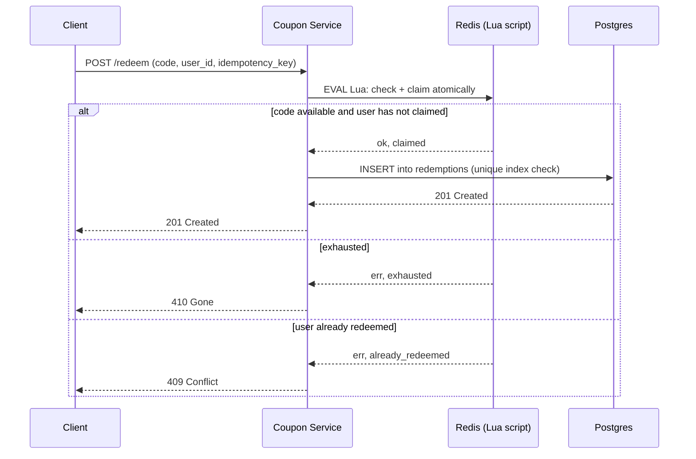
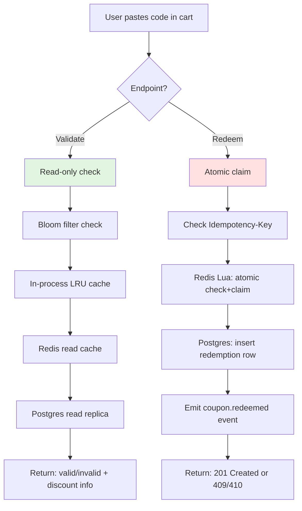
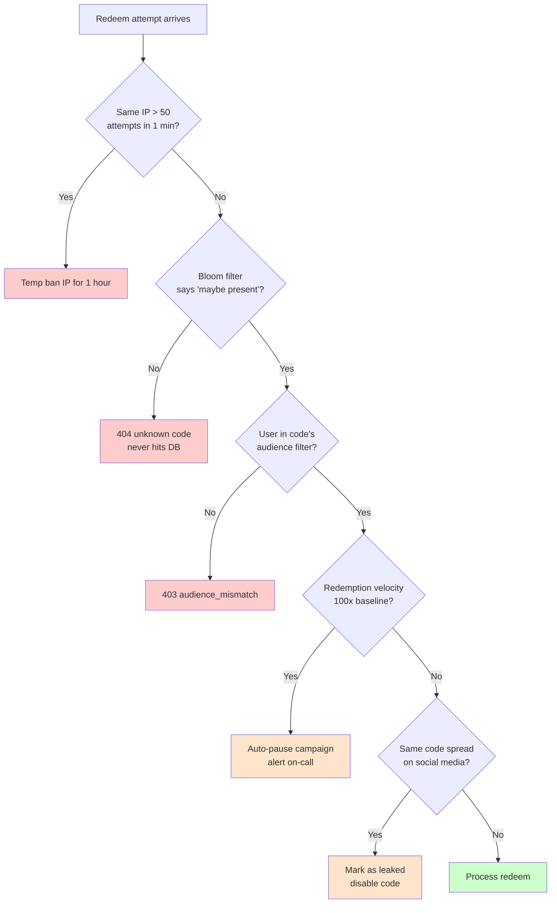


## The scene

It is the day before Black Friday. The marketing team walks in with a slide.

> *"Tomorrow at 9am we drop BLACKFRI100. It gives 100 percent off our flagship product. Only the first 1000 people can use it. We expect 10,000 users to click the redeem button in the same second. Also, we are mailing a unique code to each of our 200,000 newsletter subscribers. Each one can be used only once. Each expires in 30 days. Build it today."*

They smile. The CTO looks at you. You have one afternoon.

This looks like a basic save-data-to-a-table problem. It is not. The hard parts are:

- How do you give the code to *exactly* the first 1000 people? No more, no less.
- How do you stop the same person from using the same code 50 times in a row?
- What happens if your cache server crashes in the middle of a redemption? Do two people get the same code?
- What if someone figures out your code pattern and tries to guess them all?

Most people jump to: "Make a table. Mark each code used." That works fine when one person uses one code at a time. It breaks when 10,000 people show up in the same millisecond. A good design names the race condition first, then fixes it.

> **What is a race condition?** Two or more requests try to change the same thing at the same time. Whoever gets there first wins. The problem is, both requests can "read" the data before either one "writes" it. So both think they won. Two people get the last code. That is a race condition.

We will walk this from 10 users to 1 million users. At every step we will say what just broke, then add the smallest fix.

---

## Step 1: Ask the right questions

Sit for 5 minutes before you draw anything. Write down questions.

You do not need 20 questions. You need the small handful where a different answer would change the whole design.

<details markdown="1">
<summary><b>Show: 8 questions that matter</b></summary>

1. **Single-use or reusable?** Each code works once (like a gift card)? Or each code works many times, up to a limit (like a public promo SAVE10)? *(This is the biggest design fork. Single-use is one row, one redeem, done. Reusable means a counter and a per-user dedup check.)*

2. **Can the same user use a reusable code more than once?** SAVE10 once a day? Once ever? Unlimited? *(Without this answer, one user can drain the whole campaign. You need to know if you have to track which user used which code.)*

3. **Can codes be combined?** User has SAVE10 in the cart, also adds FREESHIP. Do they both apply? Do percentages add up (10 + 50 = 60 percent off) or multiply ((1 - 0.10) x (1 - 0.50) = 55 percent off)? *(Stacking rules change the API.)*

4. **When does a code expire?** Hard date like "Dec 31 midnight"? Or "24 hours after we mailed it to you"? Which timezone? *("Midnight" without a timezone has cost real companies money.)*

5. **What about offline stores?** Does a cash register in a shop need to accept codes when the internet is down and sync later? *(If yes, you need a different design. If no, you can refuse anything you cannot check live.)*

6. **What happens on refund?** Customer used BLACKFRI100. They cancel the order. Does the code come back to life so someone else can use it? *(Saying yes opens a brand-new race condition.)*

7. **What kind of codes?** One shared code like SAVE10 that everyone types? Or one unique code per user mailed individually? Or a pool of codes where the first 1000 to click each get one? *(Three different storage shapes. Pick one or design for all three.)*

8. **What abuse should we expect?** Same person guessing every code? Codes shared on a discount forum? Bots scraping every possible combination? *(Each one needs a different defense.)*

A senior candidate also asks: *"Does the cart page show 'this code works' before checkout? Or only at checkout?"* If yes, you need a separate validate endpoint. Good for UX. Risky because it leaks information to scrapers.

</details>

---

## Step 2: How big is this thing?

Marketing gives you the numbers. Do the math on paper before reading the answer.

- **Launch burst:** BLACKFRI100 drops at 9am. 10,000 redeem requests in the first second. 1000 win, 9000 must be told "sold out".
- **Steady traffic:** about 50,000 redemptions per day across normal promos.
- **Active campaigns:** about 50 at any time. Each has 10k to 10M codes.
- **Per-user codes total:** about 200M codes across all campaigns, kept for 5 years.
- **Validate vs redeem:** users click validate about 5 times before they click redeem (they paste, bounce, come back).

Try to compute:

1. Peak requests per second at launch
2. Steady requests per second across the day
3. Storage size for all codes
4. Hot working set during the launch

<details markdown="1">
<summary><b>Show: the math</b></summary>

**Peak QPS at launch.** 10,000 requests in 1 second = **10,000 QPS spike**. This is the pressure point. It lasts seconds, not hours. But every single request needs a correct answer. 1000 win. 9000 lose. Nobody gets a double. Nobody gets skipped.

**Steady QPS.** 50,000 / 86,400 seconds = about **0.6 redemptions per second**. At peak hours maybe 5 per second. Tiny.

**Validate QPS.** 5x redeem = 3 per second steady, 25 per second at peak. Also tiny. But the launch burst applies here too: 50,000 validate calls at 9am because users paste the code first, then click redeem.

**Storage.** 200M codes x 200 bytes each = about **40 GB**. Redemption log: 50k/day x 365 x 5 years x 100 bytes = about **9 GB**. Total around 50 GB. One machine.

**Hot working set during launch.** One campaign is hot. One counter. The pool of 1000 codes if you pre-generate them. Maybe 100 KB of actively-hot data.

**What the math tells you:**

The system is small. Throughput is not the problem. Storage is not the problem. The architecture exists for two reasons:

1. Surviving the **10,000 QPS burst on one hot key** correctly.
2. Stopping **abuse** (brute force, leaked codes).

That is it. Everything else is plumbing.

</details>

---

## Step 3: What does a "code" look like?

Before you draw boxes, decide what a code is. The format changes storage, lookup speed, guessability, and how you make them.

Three serious patterns:

| Pattern | Example | When to use |
|---------|---------|-------------|
| **Generic shared** | `SAVE10`, `WELCOME20` | Public promos. One code. Many people use it. Cap on total uses. |
| **Unique per-user** | `UID-7A2F-9B3C-1D4E` | Newsletter codes. Referral rewards. Gift cards. One code per person, mailed to them. |
| **Pre-generated pool** | `BLACKFRI-AB7K-2X9P` | "First 1000 get a code" drops. Many codes. Each one used once. People grab them in order. |

Try to fill in the comparison before reading the answer.

<details markdown="1">
<summary><b>Show: pattern comparison and when to pick which</b></summary>

| Pattern | Storage | Lookup | Hard to guess? | Race conditions |
|---------|---------|--------|---------------|----------------|
| **Generic shared** | One row per code. Counter for total uses. | O(1) by primary key. | Weak. SAVE10 is easy to guess. Rate limit per user is the only defense. | Atomic decrement on the counter. Per-user dedup via a `(code, user)` unique key. |
| **Unique per-user** | One row per (code, intended user). | O(1) by primary key. | Strong. `UID-7A2F-9B3C-1D4E` has about 10^14 possible values. Cannot guess. | Simple. One redemption ever. `UPDATE WHERE state = 'unused'`. |
| **Pre-generated pool** | One row per code. Plus an "unclaimed" index. | O(1) by primary key to check. Atomic pop from the pool to claim. | Strong if the code is long and random. | The hard race. Two users hit the same pool at the same instant. Only one can win each code. |

A few format rules apply to all three:

- Use 8 to 12 characters of **base32**. Skip 0/O, 1/I/L, U because humans confuse them. That gives about 10^15 codes. Plenty.
- Prefix with the campaign tag (`BLACKFRI-`). Helps route the request without a database join. Helps users spot typos.
- For typed-by-humans codes, add a small **checksum** at the end. Catches typos before the database lookup. For machine-mailed codes, skip it.
- Always **normalize to uppercase**. `save10` and `SAVE10` should match.

> **Pick all three patterns.** A mature system supports all three under one schema. Each campaign has a `type` field: `shared`, `unique`, or `pool`. The API looks the same. The internal data is slightly different per type.

</details>

---

## Step 4: Draw the system

You know what a code looks like. Now draw the boxes that run it.

Try to fill in the missing pieces. Five `[ ? ]` boxes. Think about: what stops abuse before it reaches your service, what holds the real truth, what makes the launch burst fast, what records what actually happened for finance, and what tells the cart "discount applies."

```
                Client (web, mobile, POS terminal)
                              |
                              v
                    +------------------+
                    |   [ ? ]          |  auth, per-user rate limit,
                    |                  |  bot detection
                    +--------+---------+
                             |
        validate path        |       redeem path
                             |
                +------------+------------+
                |                         |
                v                         v
        +-------------+            +-------------+
        | Coupon      |            | Coupon      |
        | Service     |            | Service     |
        | (read)      |            | (write)     |
        +------+------+            +--+---+------+
               |                      |   |
               v                      v   |
        +-------------+         +----------+
        |  [ ? ]      |         |  [ ? ]   |  atomic single-key ops
        |             |         |          |  for the launch burst
        +-------------+         +----+-----+
                                     |
                                     v
                              +--------------+
                              |  [ ? ]       |  source of truth:
                              |              |  campaigns + codes
                              |              |  + redemptions
                              +------+-------+
                                     |
                                     v
                              +--------------+
                              |  [ ? ]       |  tells cart / fraud /
                              |              |  finance that a code
                              |              |  was just redeemed
                              +--------------+
```

<details markdown="1">
<summary><b>Show: the full architecture</b></summary>

```
                Client (web, mobile, POS terminal)
                              |
                              v
                    +------------------+
                    |  API Gateway     |  auth, per-user + per-IP
                    |  + Rate Limiter  |  rate limit, WAF for
                    |                  |  bot patterns
                    +--------+---------+
                             |
        validate path        |       redeem path
                             |
                +------------+------------+
                |                         |
                v                         v
        +-------------+            +-------------+
        | Coupon      |            | Coupon      |
        | Service     |            | Service     |
        | (read)      |            | (write)     |
        +------+------+            +--+---+------+
               |                      |   |
               v                      v   |
        +-------------+         +--------------+
        |  Read Cache |         |  Redis +     |  Atomic claim via
        |  (Redis)    |         |  Lua scripts |  Lua. Sub-ms.
        |  + Bloom    |         |              |
        |  filter     |         +------+-------+
        +-------------+                |
                                       v
                              +--------------+
                              |  Postgres    |  Source of truth.
                              |              |  Tables:
                              |              |   campaigns
                              |              |   codes
                              |              |   redemptions
                              |              |   redemption_attempts
                              +------+-------+
                                     |
                                     v
                              +--------------+
                              |  Kafka       |  Topic: coupon.redeemed
                              |              |  Consumers: cart,
                              |              |  finance, analytics,
                              |              |  fraud
                              +--------------+
```

What each piece does, in one line:

- **API Gateway + Rate Limiter.** The first line of defense. Stops one user from sending 100 requests per second. Stops bot patterns. Without this, an attacker enumerates your whole namespace in hours.
- **Coupon Service (read).** Handles the "is this code valid?" check on the cart page. Reads from cache. Falls back to the database on a cache miss.
- **Coupon Service (write).** Handles the actual redeem. For slow campaigns it goes straight to Postgres. For hot campaigns it goes through Redis first.
- **Read Cache + Bloom filter.** Holds campaign metadata (discount, expiry, stacking rules). A Bloom filter sits in front: if the code is not in the filter, return 404 right away. Stops scrapers from hammering the database.
- **Redis + Lua scripts.** Holds the counter and the "claimed" set for hot campaigns. A Lua script makes "check, decrement, return" one atomic step. Sub-millisecond.
- **Postgres.** The source of truth. Campaigns, codes, redemptions, attempts. Has a unique index on `(campaign_id, user_id)` that catches double-redemptions at the database level, even when Redis already said yes.
- **Kafka.** Carries the `coupon.redeemed` event. The cart applies the discount. Fraud looks for patterns. Analytics counts. The coupon service does not care who consumes it.

> **What is a Bloom filter?** A tiny memory structure that answers one question: "have I ever seen this code before?" It can say "definitely not" (which is super useful: skip the database) or "maybe yes" (so you check the database to be sure). It uses very little memory. 200 million codes fit in about 300 MB. Great for stopping brute-force traffic.

</details>

---

## Step 5: The atomic single-use claim

This is the question the interviewer is actually testing.

> *Ten thousand users hit BLACKFRI100 in the same instant. Only 1000 codes exist. Give one to each of the first 1000. Do not give two to anyone. Do not skip any of the 1000 slots. Go.*

Take 10 minutes. Sketch at least two approaches. Compare them on: correctness, latency, what happens if a node dies mid-claim, and what if Redis dies.

Here is the flow you are trying to build:



<details markdown="1">
<summary><b>Show: three viable approaches</b></summary>

> **What is idempotency?** Calling the same operation twice has the same effect as calling it once. Safe to retry. If the network fails after the server processed the redeem, the client retries with the same `Idempotency-Key`, and the server returns the same answer it returned the first time. The user is not double-charged. No second code is used.

**Approach A: Postgres unique index, blocking insert.**

Pre-generate 1000 rows in a `codes` table, each marked `unused`. Redeem is an UPDATE with a special clause:

```sql
WITH claimed AS (
  UPDATE codes
  SET state = 'used', redeemed_by = $user_id, redeemed_at = NOW()
  WHERE code_id = (
    SELECT code_id FROM codes
    WHERE campaign_id = $campaign AND state = 'unused'
    ORDER BY code_id
    FOR UPDATE SKIP LOCKED
    LIMIT 1
  )
  RETURNING code_id
)
INSERT INTO redemptions (code_id, user_id, redeemed_at)
SELECT code_id, $user_id, NOW() FROM claimed
ON CONFLICT (code_id, user_id) DO NOTHING
RETURNING redemption_id;
```

> **What does `FOR UPDATE SKIP LOCKED` do?** Normally, if two transactions ask for the same row, the second one waits for the first to finish. `SKIP LOCKED` tells the second one: "if the row is locked, do not wait. Skip it and try the next one." So 10 parallel transactions each pick a different unused row. None of them wait. The 1001st request finds zero unused rows and returns nothing.

Latency: 5 to 20ms per redeem under modest load. Under 10,000 QPS on one campaign, even SKIP LOCKED queues up because row-level locks pile on. Do not run this against a single hot campaign at burst-scale without something in front.

If Postgres dies after the UPDATE commits but before the client sees the response, the user retries. The retry's `(campaign_id, user_id)` lookup finds the previous redemption and returns it. No double-claim.

**Approach B: Redis SETNX (or DECR) for the claim, Postgres for the record.**

The campaign has a counter in Redis: `campaign:blackfri:remaining = 1000`. Redeem runs a Lua script.

> **What is a Lua script in Redis?** A small program that runs *inside* Redis without anyone else touching the data. The whole thing is one atomic action. No other client can squeeze a command in between your check and your decrement. This is the only way to do "check then change" safely on Redis.

```lua
-- KEYS[1] = campaign:blackfri:remaining
-- KEYS[2] = campaign:blackfri:users (set of users who already redeemed)
-- ARGV[1] = user_id

local remaining = tonumber(redis.call("GET", KEYS[1]))
if remaining == nil or remaining <= 0 then
  return {err = "exhausted"}
end
local already = redis.call("SISMEMBER", KEYS[2], ARGV[1])
if already == 1 then
  return {err = "already_redeemed"}
end
redis.call("DECR", KEYS[1])
redis.call("SADD", KEYS[2], ARGV[1])
return {ok = redis.call("GET", KEYS[1])}
```

Latency: under 1ms. Redis is single-threaded, so a hot campaign's claims serialize on one CPU core. Fine for 10k QPS (Redis can handle hundreds of thousands of simple ops per second).

After Redis says yes, write to Postgres synchronously. The DB unique index on `(campaign_id, user_id)` is a backstop. If Redis and Postgres ever disagree (Redis lost state, replay happened), the DB rejects duplicates.

Sad path: Redis crashes after DECR but before the Postgres write. The counter went down by 1, but no redemption row exists. The fix is to write to Postgres before returning success. About 5ms extra. Worth it.

> **Why a Redis Lua script and not just two operations (check then claim)?** Because two operations have a tiny gap between them. In that gap, 1000 other users can also "check" and see the code is available. Then all 1000 try to "claim" it. With a Lua script, the check and claim happen as one indivisible step. Only one wins.

**Approach C: Token bucket pre-issued.**

Pre-generate 1000 single-use tokens at campaign creation. Push them all into a Redis list: `campaign:blackfri:tokens`. Redeem runs `LPOP`. If the list is empty, return exhausted. The popped token is the proof of claim.

Latency: sub-millisecond. List ops on Redis are O(1).

If Redis loses the list (failover with a stale replica), tokens vanish. Fix: also store the tokens in Postgres. On rebuild, mark tokens that were already popped (Postgres knows because the redemption hit it). Re-push the rest.

**Which to pick?**

- Approach A alone: fine up to a few hundred QPS on the hot key.
- Approach B (Redis Lua + Postgres backstop): the standard answer for a flash sale.
- Approach C: pick when the tokens are real artifacts the user holds (gift cards, lottery tickets).

The senior one-liner: *"Approach B for the hot path, with the unique index from Approach A as the ground truth. Approach C if marketing wants the codes to be meaningful artifacts."*

</details>

---

## Step 6: Validate vs Redeem (the split)

These look like two ways to do the same thing. They are not. Treat them as two endpoints.



**Why split them?**

- **Validate is cheap, read-only, cacheable.** Users paste codes 5 times for every 1 redeem. They bounce, come back, paste again. Caching the answer is huge.
- **Redeem is the atomic act.** It changes state. Once it succeeds, the code count goes down.

A POST that always consumes the code on click breaks the cart UX. The user wants to *see* the discount before they checkout. A GET that consumes breaks HTTP rules (GETs should not change state) and breaks browser pre-fetch.

Two endpoints. Clear separation.

---

## Step 7: Stopping abuse

Two real things that will happen on launch day.

**Scenario 1.** A user runs a script that fires 50 redeem attempts per second. They are guessing every code from `SAVE10` to `SAVE99`. Most fail. Some succeed. You see thousands of failed attempts on your dashboard.

**Scenario 2.** Marketing mails BLACKFRI100 to the newsletter at 9am. By 9:05am the code is posted on a deal forum. By 9:10am random people are redeeming it. All 1000 codes vanish in 30 seconds. The intended audience complains they never got a chance.

Sketch defenses. 5 minutes per scenario.



<details markdown="1">
<summary><b>Show: defenses for both</b></summary>

**Scenario 1: brute force.**

No single defense is enough. Layer them.

The cheapest big win is **per-user rate limiting**. Authenticated users get 10 attempts per minute, 50 per hour. Unauthenticated gets 5 per minute per IP. Token bucket in Redis. 429 with `Retry-After` after the cap.

Add **per-IP rate limiting** for unauthenticated traffic. 30 attempts per minute per IP catches sessionless requests.

The **Bloom filter prefilter** is the killer move. If the submitted code is not in the filter of issued codes, return 404 right away. No DB hit. Brute-force load never reaches your real store. The filter is in-memory at the service. Rebuilt when a new campaign is created. A 0.1% false-positive rate is fine: a tiny fraction of guesses leak through to a real lookup.

After 5 failures from the same user or IP, double the cooldown. After 10, ban for an hour. After 20, ban for a day. After 3 failed attempts in a minute, show a **CAPTCHA**. Slows automated tools to a crawl.

**Device fingerprint** as a signal: same browser fingerprint creating many accounts and each trying codes is suspicious. Combine with rate limits. Do not rely on fingerprint alone (bypassable).

**Scenario 2: leaked code.**

Once a shared code leaks, you cannot undo it. You can mitigate.

**Audience filter at validate time.** Codes carry an `audience_filter`: "must be a subscriber as of date X", "must have made a purchase in the last 90 days". Validate fails if the user does not match, even if the code is correct. The leaker posts the code, but most leakers' audiences cannot use it.

Even better: **mail unique per-user codes**, not one shared code. Even if a code leaks, only that one user's code is burnt.

If you insist on a shared code: **cap at a number that survives leakage**. 1000 codes vanish in seconds when leaked. 100,000 buys some grace.

**Velocity-based auto-pause.** If a campaign sees a 100x spike in attempts in 1 minute over the trailing baseline, auto-pause and alert. Marketing reviews and either confirms or kills the campaign before all slots burn.

**Honeypot codes.** Insert a fake code into the mailing that is not actually valid. Track who tries it. If a user uses a real code *and* the honeypot, you have a strong leak signal. With unique per-user mailings, each code is already a watermark.

The honest answer: defense is layered. The validate-side audience filter is the biggest win for leakage. Per-user rate limits and the Bloom filter are the biggest wins for brute force.

</details>

---

## Follow-up questions

Try answering each in 2 or 3 sentences before opening the solution.

1. **Network failed mid-redeem.** A user submits BLACKFRI100. The request times out *after* Redis decremented the counter but *before* Postgres recorded the redemption. They retry. What does your system do?

2. **The cap got blown.** The campaign has 1000 codes. After launch, 1003 redemptions are recorded in Postgres. How did this happen? How do you detect it and prevent it?

3. **Stackable codes.** A cart has SAVE10 (10 percent off) and FREESHIP (free shipping). The user adds BLACKFRI100 (100 percent off). What does your validate endpoint return? Where does the stacking logic live?

4. **Refund flow.** An order with BLACKFRI100 is refunded the next day. Marketing wants the code released back into the pool so someone else can use it. Engineering hates this. What is the right answer?

5. **Expiration in the wrong time zone.** A code expires at "midnight on Dec 31". The user is in Tokyo. The code was issued in PST. What does the user see, what does the API return, and how do you avoid being yelled at on Twitter?

6. **Mass code update.** A campaign has 10 million per-user codes pre-generated. Marketing realizes the discount amount is wrong. They want to update all 10M without invalidating any already-redeemed ones. Can you?

7. **Multi-region.** Your e-commerce site has US and EU regions. A US-issued code is redeemed against the EU site. How do you guarantee single-use across regions?

8. **Bloom filter false negative.** Your Bloom filter says "code not present", but the code actually exists. Wait, Bloom filters do not have false negatives. Explain why, and what error they *do* have, and how that affects this design.

9. **The last slot race.** Reusable code SAVE10 has been used 9999 times. Limit is 10000. Twenty users hit redeem at the same instant. How do you give it to exactly one of them and tell the other nineteen "limit reached"?

10. **Unused expired code.** A code was generated, mailed to a user, but they never redeemed it before expiry. After expiry, can you reuse that code string for a new campaign? Why or why not?

---

## Related problems

- **[Approval Management (011)](../011-approval-management/question.md).** The audit trail, immutable record-keeping, and state machine patterns apply directly to the redemption log here.
- **[Shopping Cart (012)](../012-shopping-cart/question.md).** The cart consumes `coupon.redeemed` events and applies discounts. Cart idempotency is the other side of redemption idempotency.
- **[Rate Limiter (004)](../004-rate-limiter/question.md).** The per-user and per-IP rate limits in Step 7 are the standard algorithms. Pick one with intent.
- **[Distributed Cache (009)](../009-distributed-cache/question.md).** The Redis layer here is the same caching layer. Understand its eviction and replication story before depending on it for hot-burst correctness.


<div class="pr-solution-divider"></div>


## Solution: Coupon Code Redemption System

### The short version

A coupon system is a small write-light service with one nasty bit: surviving a launch burst where 10,000 users hit the same code in the same second and exactly 1000 of them must win. Everything else is plumbing.

The design has two layers.

- **Postgres** is the source of truth. A unique index on `(campaign_id, user_id)` makes double-redemption impossible at the storage level.
- **Redis with a Lua script** handles the hot-burst claim so the database is not asked to serialize 10,000 transactions on one row.

Three code patterns share one schema: generic shared codes (`SAVE10`), unique per-user codes (`UID-XXXX`), and pre-generated pools (`BLACKFRI-XXXX`). All three use the same redeem API. The difference is in how codes are minted and how the claim works.

A **Bloom filter** in front of the read path stops brute-force traffic from reaching the DB. **Rate limits** stop the same user from grinding the namespace.

The interesting engineering sits at three edges:

1. Making the launch burst correct without a database stampede.
2. Defining what "release the code back to the pool on refund" means without creating a new race.
3. Laying down an audit trail finance can use years later.

---

### 1. The clarifying questions, in one paragraph

The most important question is the first one: *single-use or reusable?* They have completely different data models and contention shapes. Almost as important: which of the three code patterns (shared, unique, pool) the system supports. If you assume "just one pattern" and the interviewer wanted all three, you redesign mid-interview.

Everything else (stacking, expiration, refund, abuse) follows from those two answers.

---

### 2. The math, in plain numbers

| Scale | Redeem QPS | Validate QPS | Storage |
|-------|-----------|--------------|---------|
| Steady state | ~0.6 (peak ~5) | ~3 (peak ~25) | 50 GB total |
| Launch burst | **10,000 in 1 second** | 50,000 in 1 second | 100 KB hot |

The launch burst is the design pressure. 10,000 redeem requests in 1 second. 1000 must succeed. 9000 must be told "sold out". One hot key, one hot campaign. The 9000 losers are the design pressure, not the 1000 winners. They all need a fast response, not a timeout.

Storage barely registers. 200M codes x 200 bytes each is about 40 GB. Add 9 GB of redemption log over 5 years. Round to 50 GB. One Postgres instance.

The system is small. The architecture exists for **burst correctness** and **abuse resistance**, not throughput or storage.

---

### 3. The API

Validate and redeem are separate endpoints. Validate is read-only and cheap. Redeem is the atomic act. One endpoint that always consumes breaks the cart UX (users want a preview before checkout).

```
POST /api/v1/coupons/validate
Authorization: Bearer <token>     # optional; required for audience-restricted codes
Content-Type: application/json

{
  "code": "BLACKFRI100",
  "cart_id": "cart_abc",
  "subtotal": 12000                  # cents
}
```

| Status | Meaning | Body |
|--------|---------|------|
| 200 OK | Code valid for this user | `{"valid": true, "discount": {...}, "stackable_with": [...], "expires_at": "..."}` |
| 200 OK | Valid alone but fails stacking | `{"valid": false, "reason": "not_stackable_with_SAVE10"}` |
| 404 | Code does not exist | `{"valid": false, "reason": "unknown_code"}` |
| 410 | Code expired or fully used | `{"valid": false, "reason": "expired" / "exhausted"}` |
| 403 | User not in the code's audience | `{"valid": false, "reason": "audience_mismatch"}` |
| 429 | Too many validate attempts | `{"reason": "rate_limited", "retry_after": 60}` |

```
POST /api/v1/coupons/redeem
Authorization: Bearer <token>     # required
Idempotency-Key: <uuid>            # required
Content-Type: application/json

{
  "code": "BLACKFRI100",
  "order_id": "ord_xyz",
  "user_id": "usr_42"
}
```

| Status | Meaning | Body |
|--------|---------|------|
| 201 Created | Redemption succeeded | `{"redemption_id": "rdm_...", "discount_applied": {...}}` |
| 200 OK | Idempotent retry (same Idempotency-Key) | same shape as 201 |
| 409 Conflict | User already redeemed this code | `{"error": "already_redeemed", "redemption_id": "rdm_..."}` |
| 410 Gone | Code exhausted or expired (lost the race) | `{"error": "exhausted"}` |
| 403 Forbidden | Audience mismatch | `{"error": "audience_mismatch"}` |

A few small but load-bearing choices:

- **`Idempotency-Key` is required on redeem.** Network retries are guaranteed at the launch burst. Without the key, the same user's retry can consume two codes.
- **`order_id` ties the redemption to the order.** Needed for refund/release flow and finance reconciliation.
- **403 only goes to authenticated users in the wrong audience.** Unauthenticated callers get 404 instead, so they cannot harvest codes by checking which ones exist.

---

### 4. The data model

Four tables. Two large, two small.

```sql
-- Campaigns: one row per promotional campaign.
CREATE TABLE campaigns (
    campaign_id      UUID PRIMARY KEY,
    name             TEXT UNIQUE NOT NULL,             -- "blackfri", "newsletter-q4"
    type             TEXT NOT NULL,                    -- 'shared' | 'unique' | 'pool'
    discount         JSONB NOT NULL,                   -- {"type": "percent", "value": 100, "max_off": 50000}
    total_codes      INT,                              -- NULL for unlimited (rare)
    issued_codes     INT NOT NULL DEFAULT 0,
    redeemed_count   INT NOT NULL DEFAULT 0,           -- updated async from redemptions
    per_user_limit   INT NOT NULL DEFAULT 1,
    audience_filter  JSONB,
    stacking_rules   JSONB,
    starts_at        TIMESTAMPTZ NOT NULL,
    ends_at          TIMESTAMPTZ NOT NULL,
    status           TEXT NOT NULL DEFAULT 'active',   -- 'active' | 'paused' | 'ended'
    created_at       TIMESTAMPTZ NOT NULL DEFAULT NOW()
);
CREATE INDEX idx_campaigns_status_window ON campaigns (status, starts_at, ends_at);

-- Codes: one row per individual code string.
--   shared:  one row total; counter tracked on the campaign
--   unique:  one row per (campaign, intended_user)
--   pool:    one row per code, intended_user is NULL until claimed
CREATE TABLE codes (
    code_id          UUID PRIMARY KEY,
    campaign_id      UUID NOT NULL REFERENCES campaigns(campaign_id),
    code             TEXT NOT NULL,
    intended_user    TEXT,                             -- non-null for 'unique' type
    state            TEXT NOT NULL DEFAULT 'unused',   -- 'unused' | 'claimed' | 'used' | 'expired'
    claimed_by       TEXT,
    claimed_at       TIMESTAMPTZ,
    expires_at       TIMESTAMPTZ,
    created_at       TIMESTAMPTZ NOT NULL DEFAULT NOW()
);
CREATE UNIQUE INDEX idx_codes_code ON codes (code);
CREATE INDEX idx_codes_campaign_state ON codes (campaign_id, state) WHERE state = 'unused';
CREATE INDEX idx_codes_intended_user ON codes (intended_user) WHERE intended_user IS NOT NULL;

-- Redemptions: immutable record of every successful claim.
CREATE TABLE redemptions (
    redemption_id    UUID PRIMARY KEY,
    code_id          UUID NOT NULL REFERENCES codes(code_id),
    campaign_id      UUID NOT NULL REFERENCES campaigns(campaign_id),
    user_id          TEXT NOT NULL,
    order_id         TEXT NOT NULL,
    discount_applied JSONB NOT NULL,                   -- snapshot of the discount at redeem time
    idempotency_key  TEXT NOT NULL,
    redeemed_at      TIMESTAMPTZ NOT NULL DEFAULT NOW(),
    released_at      TIMESTAMPTZ,                      -- non-null if released back due to refund
    released_reason  TEXT
);
CREATE UNIQUE INDEX idx_redemption_user_campaign ON redemptions (campaign_id, user_id)
    WHERE released_at IS NULL;
CREATE UNIQUE INDEX idx_redemption_idempotency ON redemptions (idempotency_key);
CREATE INDEX idx_redemption_order ON redemptions (order_id);

-- Attempts: every redeem attempt (success or failure) for fraud signals.
CREATE TABLE redemption_attempts (
    attempt_id       BIGSERIAL PRIMARY KEY,
    code             TEXT NOT NULL,
    user_id          TEXT,
    ip               INET,
    user_agent_hash  BYTEA,
    result           TEXT NOT NULL,
    attempted_at     TIMESTAMPTZ NOT NULL DEFAULT NOW()
);
CREATE INDEX idx_attempts_user_time ON redemption_attempts (user_id, attempted_at DESC);
CREATE INDEX idx_attempts_ip_time ON redemption_attempts (ip, attempted_at DESC);
CREATE INDEX idx_attempts_result_time ON redemption_attempts (result, attempted_at DESC);
```

Three small things doing real work:

**`UNIQUE (campaign_id, user_id) WHERE released_at IS NULL`.** When the same user races themselves with two browser tabs, the database serializes them. The first insert wins. The second fails with a unique-violation. The API turns that into a friendly 409. This is the safety net behind whatever Redis says. If you remember one thing from this design, remember this index.

**`campaigns.redeemed_count` is denormalized and async.** It is not the source of truth for "is the campaign exhausted." The truth is `COUNT(*) FROM redemptions WHERE campaign_id = ?`. But we never run that on the hot path. We trust the Redis counter and reconcile against the table periodically.

**`redemption_attempts` logs everything, including failures.** Required for fraud signals (50 attempts per second from one IP) and abuse dashboards. Partitioned by month in production.

Why Postgres, not Cassandra? Strong consistency for the unique index. Transactional semantics for the claim. JSONB for the flexible discount and audience shapes. Cassandra would force you to invent compensating logic for the same guarantees, and 50 GB at 5-year retention is nothing for Postgres.

---

### 5. The core algorithm: the atomic claim

Two paths, picked per campaign.

For campaigns under a few hundred QPS, skip Redis entirely.

```sql
BEGIN;

-- For 'pool' type: claim one unused code atomically.
WITH next_code AS (
  SELECT code_id FROM codes
  WHERE campaign_id = $campaign_id AND state = 'unused'
  ORDER BY code_id
  FOR UPDATE SKIP LOCKED
  LIMIT 1
)
UPDATE codes c
SET state = 'used', claimed_by = $user_id, claimed_at = NOW()
FROM next_code nc
WHERE c.code_id = nc.code_id
RETURNING c.code_id, c.code;

-- If the above returned 0 rows, return 'exhausted' and ROLLBACK.

-- Insert into redemptions (per-user unique check fires here).
INSERT INTO redemptions (redemption_id, code_id, campaign_id, user_id, order_id,
                         discount_applied, idempotency_key)
VALUES (...)
ON CONFLICT (campaign_id, user_id) WHERE released_at IS NULL
DO NOTHING
RETURNING redemption_id;

COMMIT;
```

`FOR UPDATE SKIP LOCKED` is the key. Each concurrent transaction picks a different unused row. Throughput is a few hundred claims per second on a single Postgres, limited by row-level locking on the campaign's row set.

For 10k-QPS bursts (BLACKFRI100 style), the hot path goes to Redis.

```lua
-- KEYS[1] = "campaign:{cid}:remaining"
-- KEYS[2] = "campaign:{cid}:users"
-- KEYS[3] = "campaign:{cid}:pool"  (Redis list of pre-generated codes, pool type only)
-- ARGV[1] = user_id
-- ARGV[2] = campaign_type ('shared' | 'pool')

local remaining = tonumber(redis.call('GET', KEYS[1]))
if remaining == nil then
  return {'err', 'unknown_campaign'}
end
if remaining <= 0 then
  return {'err', 'exhausted'}
end

local already = redis.call('SISMEMBER', KEYS[2], ARGV[1])
if already == 1 then
  return {'err', 'already_redeemed'}
end

local claimed_code = nil
if ARGV[2] == 'pool' then
  claimed_code = redis.call('LPOP', KEYS[3])
  if claimed_code == false then
    return {'err', 'exhausted'}
  end
end

redis.call('DECR', KEYS[1])
redis.call('SADD', KEYS[2], ARGV[1])

return {'ok', claimed_code}
```

The Lua block runs atomically. Redis is single-threaded, so concurrent scripts serialize on one CPU. Latency under 1ms. Throughput well above 50k ops per second on a single Redis node, far above the 10k burst target.

After Redis returns OK, the service writes the redemption to Postgres synchronously (about 5ms). Total redeem latency: about 6ms. The Postgres write uses the same `ON CONFLICT (campaign_id, user_id)` clause. If Redis hiccupped and somehow let two requests through for the same user, the DB unique index catches the second one. The service rolls back the Redis state and returns 409.

Picking between them:

| Campaign expected QPS | Approach |
|----------------------|----------|
| < 100 | Postgres only |
| 100 to 10,000 | Redis + Postgres backstop |
| > 10,000 | Redis + Postgres with sharded Redis (counter and user-set partitioned by hash of user_id) |

In production, every campaign uses Redis. For low-traffic ones the Redis cost is negligible. For high-traffic ones the Redis layer is what keeps the DB alive. One code path is easier to reason about.

**The Bloom filter prefilter.** Before validate even queries Redis or the DB:

```python
def validate(code):
    if not bloom_filter.maybe_contains(code):
        return 404  # definitely not a real code
    # falls through to Redis/DB
```

Bloom filters never have false negatives. If the filter says "not present", the code was definitely never issued. They have a tunable false-positive rate (around 0.1% is typical). At 0.1%, a brute-force scraper sees 99.9% of attempts cut off at the filter, never touching the DB.

The filter is rebuilt when a campaign is created and reloaded on service start. Memory footprint is about 12 bits per code at 0.1% FPR. 200M codes is about 300 MB. Fits in process memory.

---

### 6. The architecture, drawn out

```
+-----------------------------------------------------+
| Clients: web, mobile, POS terminal                  |
+-----------------------+-----------------------------+
                        |
                        v
              +------------------+
              |  API Gateway     |  auth, per-user + per-IP
              |  + Rate Limiter  |  rate limit, WAF
              +---+----------+---+
       validate   |          |   redeem
                  |          |
                  v          v
      +------------------+  +------------------+
      | Coupon Service   |  | Coupon Service   |
      | (read,stateless) |  | (write,stateless)|
      |                  |  |                  |
      | - Bloom filter   |  | - Idempotency key|
      | - in-proc LRU    |  | - Redis Lua claim|
      | - cache lookup   |  | - Postgres write |
      +--------+---------+  +--+------+--------+
               |               |      |
               v               v      |
      +------------------+ +---------------+
      | Read Cache       | | Redis (hot     |
      | (Redis)          | | burst)          |
      | campaign meta,   | | remaining cnt   |
      | 60s TTL + jitter | | user-set, pool  |
      +------------------+ +-------+---------+
                                   |
                                   v
      +-----------------------------------------------+
      | Postgres (source of truth)                    |
      |   campaigns                                   |
      |   codes                                       |
      |   redemptions (unique (campaign,user))        |
      |   redemption_attempts                         |
      +---------------+-------------------------------+
                      |
         CDC / outbox |
                      v
      +-----------------------------------------------+
      | Kafka                                         |
      |   coupon.redeemed                             |
      |   coupon.released                             |
      +--+-----------+-----------+--------------------+
         |           |           |
         v           v           v
   +-----------+ +----------+ +----------------+
   | Cart Svc  | | Fraud Svc| | Analytics +    |
   | apply     | | velocity | | Finance recon  |
   | discount  | | signals  | | (ClickHouse)   |
   +-----------+ +----------+ +----------------+
```

Five things to notice:

- The write path touches Redis and Postgres in one window. Nothing else is in the synchronous hot path. Kafka, cart, fraud, analytics are downstream of a CDC stream. If the cart is down, redemptions still succeed. The discount catches up later.
- The Bloom filter and in-process LRU live in the read service, not Redis. Process memory is the cheapest, fastest tier.
- Hot-burst Redis and read-cache Redis are different roles, often on different clusters. Hot-burst runs Lua scripts and serializes on a single core. Read cache holds metadata for thousands of campaigns and scales with sharding.
- The Postgres unique index is the ground truth. Every other layer can lose data and the system recovers. If the unique index loses data, you have a correctness bug.
- Coupon Service pods are stateless and horizontally scalable. The Bloom filter is rebuilt on startup from an S3 snapshot plus a tail of `campaign_created` events from Kafka.

---

### 7. A redeem, drawn end to end

```
   Client      API GW     Coupon Svc      Redis         Postgres        Kafka
     |           |            |              |              |             |
     | POST      |            |              |              |             |
     | /redeem   |            |              |              |             |
     +---------->|            |              |              |             |
     |           | rate limit |              |              |             |
     |           | check      |              |              |             |
     |           +----------->|              |              |             |
     |           |            | idem-key     |              |             |
     |           |            | lookup       |              |             |
     |           |            +------------->|              |             |
     |           |            |<-------------+              |             |
     |           |            |              |              |             |
     |           |            | bloom + LRU  |              |             |
     |           |            | (in-proc)    |              |             |
     |           |            |              |              |             |
     |           |            | EVAL Lua     |              |             |
     |           |            | (check       |              |             |
     |           |            |  counter,    |              |             |
     |           |            |  user-set,   |              |             |
     |           |            |  decr, sadd) |              |             |
     |           |            +------------->|              |             |
     |           |            |<-------------+              |             |
     |           |            |    ok        |              |             |
     |           |            |              |              |             |
     |           |            | BEGIN TX                    |             |
     |           |            +---------------------------->|             |
     |           |            | INSERT redemptions          |             |
     |           |            |   ON CONFLICT DO NOTHING    |             |
     |           |            | UPDATE codes (pool only)    |             |
     |           |            | INSERT redemption_attempts  |             |
     |           |            | COMMIT                      |             |
     |           |            |<----------------------------+             |
     |           |            |              |              |             |
     |           |            | cache idem-key response     |             |
     |           |            +------------->|              |             |
     |           |            |              |              |             |
     |           |            | emit coupon.redeemed (CDC)  |             |
     |           |            |              |              +------------>|
     |           | 201 OK     |              |              |             |
     |           |<-----------+              |              |             |
     | 201 OK    |            |              |              |             |
     |<----------+            |              |              |             |
     |           |            |              |              |  consumer   |
     |           |            |              |              |             +--> cart applies
     |           |            |              |              |             +--> fraud signal
     |           |            |              |              |             +--> analytics
```

Validate has its own short flow. Client to gateway to read service. Bloom filter rejects most bogus codes immediately. The in-process LRU absorbs most real-code reads. Cache misses fall through to Redis and then Postgres.

Target latencies:

- Validate P99: about 50ms (most calls are cache hits at about 5ms).
- Redeem P99: about 50ms even at the launch burst.
  - Rate limit: about 1ms
  - Redis Lua: about 1ms
  - Postgres insert: about 5 to 10ms
  - Rest is network.

---

### 8. The scaling journey: 10 to 1M users

At every stage, name what just broke and what fixes it. Build nothing preemptively.

#### Stage 1: 10 to 100 users

One Postgres (db.t3.small). One app instance. The three tables with the unique index on `(campaign_id, user_id)`. Validate and redeem are both straight DB calls in a transaction. No Redis, no cache, no Kafka. The cart calls the coupon service inline. About $80/month.

Ten redemptions per day. Postgres yawns. The unique index alone is the entire correctness story. No campaign sees more than 1 QPS. No races to worry about. Building more is over-engineering.

#### Stage 2: 1,000 users

Something breaks: a user shares a code on a deal forum. 200 anonymous attempts hit in 5 minutes. DB spiked to 50% CPU.

Marketing started running per-user codes (2000 rows in `codes`). Lookups by code string got slow without an index. You added `CREATE UNIQUE INDEX idx_codes_code ON codes (code)`. The issue vanished. A cart bug caused some users to submit redeem twice quickly. The unique index caught the double-claim correctly, but the second request got a confusing 500. You added `ON CONFLICT DO NOTHING RETURNING` handling and started returning 409 instead.

You added per-user rate limiting in the gateway (token bucket in Redis, 10 validate per min and 5 redeem per min per user), per-IP rate limiting for unauthenticated traffic, and an in-process LRU for campaign and code lookups (1000 entries, 60s TTL, dropped DB load about 5x). The `redemption_attempts` table started filling, partitioned monthly, feeding a "top 10 IPs by failed-validate rate" dashboard. `Idempotency-Key` on redeem became required, stored in Redis with 5min TTL. About $250/month.

Still no Bloom filter. Still no Redis for the atomic claim. At 1k users you have a few thousand distinct code attempts per day. The cache absorbs most. Postgres handles all redeems with `FOR UPDATE SKIP LOCKED`. No Kafka. The cart calls the coupon service inline.

#### Stage 3: 10,000 to 100,000 users

Several things break at once.

- First real flash sale: 2000 codes for FLASH50 at noon. 5000 users at once. Postgres CPU pegged for 30 seconds because `FOR UPDATE SKIP LOCKED` serialized on the `(campaign_id, state = 'unused')` index. Most requests timed out at the gateway. Marketing was furious.
- A scripted brute-force across the SAVE-prefix namespace fired 5000 attempts per second from rotating IPs. The LRU helped on hits, but guaranteed-misses on bogus codes hit the DB at about 1000 QPS.
- The cart showed race conditions when a user redeemed, the cart applied the discount, then the user removed an item that made the discount no longer apply.

Fixes, in order:

- **Redis with Lua for atomic claims** on hot campaigns. Campaign marked `hot` at creation or auto-flagged at `expected_qps > 100`.
- For pool campaigns, **pre-load unclaimed codes into a Redis list**. `LPOP` is sub-millisecond.
- **Bloom filter prefilter** loaded at service start, updated on campaign create. Bogus codes return 404 in microseconds.
- **Synchronous write to Postgres** for redemptions on hot campaigns (the unique index catches any double-write).
- **Kafka topic `coupon.redeemed`**. The cart consumes the event and applies the discount idempotently (uses `redemption_id` as the dedup key).
- **Read replica for validate**. Primary stays write-only.
- **Velocity-based campaign pause.** 100x spike in 1 minute over the trailing-hour baseline auto-pauses and pages on-call.

Flash sales now serve 10k QPS on the hot campaign on one Redis core. Bloom filter cuts brute-force DB load by about 99.9%. The Postgres unique index is still the safety net. About $1 to 2k/month.

#### Stage 4: 1 million users

New problems.

- The hottest Black Friday campaign saturated one Redis core at 50k QPS. Latency went from 1ms to 50ms.
- EU operations launched. EU users redeem codes on the EU site. Codes need to be valid across both regions. Cross-region Redis replication adds ambiguity about who got the code first.
- A pre-generated code minting bug inserted 10M pool codes with the wrong discount. Bulk fixup was needed without invalidating the 50,000 already-redeemed ones.
- Marketing wanted per-segment campaigns. Same code SAVE10 meaning 20% off for VIPs and 10% off for everyone else.

Fixes:

- **Sharded Redis** for ultra-hot campaigns. Counter and user-set partitioned by `hash(user_id)` across N nodes. Each holds 1/N of the cap. A user's redeem routes to the node owning their hash. Caveat: "remaining" is per-shard. If one shard exhausts while others have slots, late users to the wrong shard see "exhausted" while slots exist elsewhere. Either route losers to a fallback shard once, or accept that the cap is approximate (1000 plus or minus 10) and document it.
- **Multi-region with per-region authority.** A code is owned by one region. Redemption on the wrong region routes through to the owning region. Cross-region call adds about 100ms. Fine because most users redeem in their home region.
- **Audit hash chain** on the redemptions table. Each row stores `prev_hash = SHA256(prev_redemption.canonical)` and `hash = SHA256(this.canonical + prev_hash)`. Finance auditors verify the chain. Required for SOX at this scale.
- **Bulk campaign update tool** that updates the campaign's `discount` metadata without touching the snapshot in each redemption (the snapshot is what the cart actually applied; it must never change).
- **Per-segment discount via campaign rules.** `discount_rules: [{audience: "vip", discount: 20%}, {audience: "default", discount: 10%}]`. The validate path evaluates the user's segment and returns the matching discount. The redemption snapshot records which rule fired.
- **CDC pipeline from Postgres to ClickHouse** for marketing dashboards. Nightly finance reconciliation: sum of redemptions per campaign vs Redis counter. Alert on drift.

Even at 1M users, the volume is small (about 10 QPS sustained, 100k QPS peak burst). The architecture has not fundamentally changed since stage 3. The core insight (Postgres unique index as safety net, Redis Lua as burst path, Bloom filter as brute-force shield) carries through unchanged. About $10 to 30k/month.

#### What you would do at 10M users

You wouldn't. By then you are a top-10 e-commerce platform. Coupon redemption becomes a real product (Shopify Discounts, the discount engine inside Amazon). The conversation shifts from "build a coupon system" to "build a discount engine that also handles bundles, tiered pricing, A/B testing of promotions, ML-personalized offers." Different problem.

---

### 9. The three code patterns, fast

Same engine. Same schema. Three patterns. Each one stresses a different feature.

- **Generic shared (`SAVE10`).** One row in `codes`. Counter on the campaign. Redeem decrements the counter atomically. Per-user dedup via the unique index. Risk: easy to guess, so rate limits matter most.
- **Unique per-user (`UID-XXXX`).** One row per (campaign, intended_user). Redeem is a simple `UPDATE WHERE state = 'unused'`. Hard to guess. If the code leaks, only that one user's allocation is burnt. Costs more storage but the leak blast radius is tiny.
- **Pre-generated pool (`BLACKFRI-XXXX`).** Many rows, each used once. The race is on `LPOP` from a Redis list (or `FOR UPDATE SKIP LOCKED` on the codes table). The tokens are meaningful artifacts the user can hold.

One engine, three patterns, no special cases per route. The campaign's `type` field switches the internal claim logic. The API is the same.

---

### 10. Reliability

**Redis dies mid-redemption.** Lua script returned OK, decremented the counter, added the user to the set. The service crashed before the Postgres write. Redis later lost state in a failover with a stale replica. A few redemptions exist in Redis but not in Postgres. The counter shows N minus a few. Reality is N.

Three things keep this safe:

1. The synchronous Postgres write before returning success (5 to 10ms cost, worth it for correctness).
2. The Postgres unique index as ground truth. If Redis is rebuilt on warm-start, the rebuild queries Postgres for the current redeemed count and reseeds the counter. The user-set is similarly seeded from Postgres.
3. A periodic reconciliation job comparing Redis counter vs Postgres count. Alert on drift greater than 10.

**Postgres primary fails.** Failover to read replica takes 30 to 60 seconds. During failover, redeem is unavailable. Validate still works against the replica (which is now primary). The `Idempotency-Key` cache in Redis means users who retry after failover get a clean response. Either their previous successful redemption or a fresh attempt against the new primary.

**Payment fails after redemption.** User redeemed BLACKFRI100. The cart applied 100% off. Payment failed at checkout. Two policies, picked at campaign creation:

- Default `release_on_failure = false`. The redemption stands. The user lost their chance. They are told "your discount has been consumed; please contact support."
- Opt-in `release_on_failure = true`. `payment.failed` triggers the release procedure. Set `released_at` on the redemption (the partial unique index `WHERE released_at IS NULL` makes the user free to redeem again). For pool codes, set the code row back to `unused`. For shared counters, increment the Redis counter. Each step is idempotent.

The senior position: default to no release. Release introduces a parallel race where someone else can claim the released code while the original user is debugging payment. For high-value campaigns where customer goodwill matters, opt in.

Refund the next day works the same way, gated by admin or automated rule. Marketing picks per-campaign whether refund releases. Most do not.

**Kafka is down.** The redemption succeeds in Postgres but the cart does not receive the event. The cart polls the coupon service for redemptions tied to active carts. Or the user re-applies the code in the cart UI (the validate endpoint returns "valid: true, already_redeemed_for_this_order: true" with the discount). The fallback path is essential. A Kafka outage should not block checkout.

---

### 11. Observability

| Metric | Why it matters |
|--------|----------------|
| `redeem.latency` p50/p95/p99 | The headline SLO. Alert if p99 > 200ms at burst. |
| `redeem.success.rate` per campaign | Drops indicate exhaustion or backend errors. |
| `redeem.attempts.rate` per campaign | Sudden 100x spike triggers velocity pause. |
| `redeem.result.distribution` | success, exhausted, already_redeemed, audience_mismatch. Drift tells you about UX bugs. |
| `validate.cache_hit_rate` | Should be > 90%. Below means the cache is too small or invalidation too aggressive. |
| `bloom_filter.hit_rate` | Tracks the brute-force shield. Spikes indicate scraper traffic. |
| `redis.counter.drift_vs_db` | Computed nightly. Non-zero is a bug or a Redis incident. |
| `rate_limit.triggered.count` per user/IP | Top offenders dashboard for security. |
| `kafka.lag.coupon_redeemed` | Cart applies discount with this lag. Alert at > 30s. |
| `audit_chain.verification.failed` | If non-zero ever, someone tampered with the log. Page everyone. |

Page on: redeem error rate > 5% for 5min. Redis-Postgres drift > 100. Audit chain failure.

Ticket on: validate cache hit rate < 80%. Bloom filter rebuild stuck. Rate limit triggers > 10x daily baseline.

---

### 12. Follow-up answers

These are the questions a senior interviewer is listening for. Each answer is short on purpose.

**1. Redis decremented but Postgres did not record. User retries.**

The `Idempotency-Key` in Redis (5min TTL) catches it. The retry's key matches the original. The cached response is returned. The user does not see the failure. The system effectively recovered.

If the `Idempotency-Key` cache also lost the entry (Redis failover), the retry hits Redis Lua again. The user is already in the user-set, so the script returns `already_redeemed` with the original `redemption_id` (looked up from Postgres). Idempotent.

The bad case is when the `Idempotency-Key` cache is lost *and* Postgres lost the row (which should never happen with a healthy DB). Then the user successfully redeems a second time. Mitigation: synchronous Postgres write before returning success. This is why we accept the 5 to 10ms cost.

**2. 1000 codes in the campaign. 1003 in Postgres after launch.**

Three possible causes:

- A bug in the release-on-refund flow. 3 codes were released and re-claimed. So 1003 rows in redemptions but only 1000 with `released_at IS NULL`. Not actually a problem if you count active redemptions correctly.
- A real bug. The unique index was misconfigured (the `WHERE released_at IS NULL` clause was missing), allowing two active rows per user.
- A real bug. Redis and Postgres drifted because synchronous Postgres writes failed silently while Redis kept going. The campaign exhausted in Redis after 1000 but those 3 extra succeeded in Postgres after a Redis stutter.

Detection: nightly reconciliation job comparing `SELECT COUNT(*) FROM redemptions WHERE campaign_id = ? AND released_at IS NULL` against the Redis counter. Alert on any drift.

Prevention: synchronous Postgres write before returning success. The unique index is the backstop. Also a Postgres-side hard cap as a periodic safety check, not in the hot path (the count query is too expensive at burst).

**3. Stacking SAVE10 + FREESHIP + BLACKFRI100.**

The cart holds the list of applied coupons. Validate is called per coupon and is told what other coupons are in the cart.

On the coupon side, each campaign has `stacking_rules`: `{"stackable_with": ["FREESHIP"], "excludes": ["BLACKFRI*"]}` (allowlist plus denylist). Validate computes: do the existing cart coupons satisfy this coupon's rules? If BLACKFRI100 is in the cart and you try to validate SAVE10, the stacking check fails with `not_stackable_with_blackfri`.

On the cart side, the cart enforces a max number of coupons per cart (e.g., 3) regardless of stacking rules. The cart computes the final discount: if both are percentages, decide compound `(1 - 0.1)(1 - 0.5)` vs sum `10% + 50% = 60%` (clamped at 100%). Business decision per campaign. Default is sum, capped at 100%.

The coupon service owns stacking *rules*. The cart applies them.

**4. Refund releases the code, or not?**

Per-campaign policy. Default: no release.

If release is on: `payment.refunded` triggers the release procedure. Set `released_at` on the redemption. For pool, set the code row's state back to `unused` and push the code back to the Redis list. For shared, `INCR` the Redis counter. For unique per-user, the user can re-redeem the same code.

The hidden cost is the parallel race: someone else can claim it within milliseconds. Customer service hates this when the refunding customer asks "can you give me that code back so I can use it tomorrow."

The cleaner answer is to not release. Refund the money. The discount is gone. If the customer is high-value, support manually issues a courtesy code from a separate budget. This avoids the race entirely.

**5. Expiration in the wrong timezone.**

Store `expires_at` as a UTC timestamp. Compare against UTC `NOW()`. Done.

For UI: render in the user's local timezone. "Expires in 3 hours" is better than "Expires at 2026-12-31 23:59:59 UTC" because it removes the timezone math from the user's brain.

For marketing: when they say "midnight Dec 31", ask which timezone. The campaign creation form requires a timezone selector. Default to the company's HQ timezone but never assume.

The Twitter-yelling is avoided. A user in Tokyo who sees "expires in 3 hours" at 11pm Tokyo time gets the same UTC-anchored expiry as a user in LA. The math is unambiguous. The wording is local.

**6. Mass-update 10M codes without invalidating already-redeemed ones.**

The redemption snapshot is immutable. That is the contract. Updating the campaign's `discount` field does not retroactively change what past redemptions applied. The cart uses the snapshot in each redemption row.

For unredeemed codes, the campaign update takes effect on next redeem. The `codes` table does not store the discount per code. It joins to the campaign. Updating the campaign updates every future redemption from any of its codes.

If the discount is wrong on already-redeemed orders (e.g., wrong percentage applied), that is an accounting and refund problem, not a coupon-system problem. The coupon-system change just stops the bleeding for new redemptions.

Code path: `UPDATE campaigns SET discount = ? WHERE campaign_id = ?`. One row. Fast. Cache invalidation event broadcast to all service pods to drop the cached campaign metadata.

**7. Multi-region single-use guarantee.**

Each code is owned by exactly one region at creation (typically the region whose campaign created it). The owning region's Postgres holds the authoritative redemption row.

If a code is redeemed in a non-owning region: the non-owning region's service detects the mismatch (campaign metadata says "owned by us-east"), forwards the redeem via authenticated cross-region API to us-east. us-east performs the atomic claim against its Postgres and Redis. The response is returned across regions to the user. Latency cost about 100ms. Acceptable for the rare cross-region case.

Per-user uniqueness across regions: the unique index on `(campaign_id, user_id)` lives only in the owning region. Cross-region calls all funnel into it. The unique index does the work.

Alternative: replicate the unique index globally using a strongly-consistent multi-region database (Spanner, DynamoDB Global Tables with conditional writes). Higher cost, simpler model. Worth it if cross-region redemptions are > 10% of traffic. Not worth it for the typical 1%.

**8. Bloom filter has no false negatives.**

Correct. A Bloom filter never says "definitely not present" for something that was actually added. If a code was inserted into the filter, it will always be reported as "maybe present."

What Bloom filters *do* have is **false positives**. Occasionally saying "maybe present" for a code that was never inserted. This is fine for our use case: a false positive sends the request through to the cache/DB, which correctly returns 404. No harm done. Just a tiny bit of leaked load.

In this design, the filter is sized for 0.1% false-positive rate at 200M items. Out of every 1000 brute-force attempts on bogus codes, about 999 are rejected at the filter and about 1 falls through. At a brute-force rate of 5000 attempts/sec, the DB sees about 5 lookups/sec from this source. Trivial.

What you must not do: rely on the filter to *prove* a code exists. You must still validate against the DB on a maybe-present hit because the filter is approximate.

**9. SAVE10 has 9999 of 10000 uses. 20 users hit simultaneously.**

The Redis Lua script handles this. Each of the 20 requests enters the script serially (Redis is single-threaded). The first sees `remaining = 1`, decrements to 0, returns OK. The other 19 see `remaining = 0` and return `exhausted`.

The 1 winner's Postgres write proceeds normally with the unique index check (they have not redeemed before). The 19 losers see 410.

If the per-user-limit is 1 and any of the 20 users had already redeemed SAVE10 previously, the Lua script also rejects them with `already_redeemed` regardless of the counter, returning 409.

**10. Unredeemed code after expiry. Reuse the string?**

No. Codes are append-only forever, even after expiry.

The codes table has a unique index on the code string. Reuse would require deleting the expired row, which loses audit history. A user might bookmark the code or have it in an email. Reusing the string for a new campaign creates confusion ("why does my SAVE10 from last year suddenly apply 25% off?"). Trying an expired code is itself a useful fraud signal. Reusing the string erases that signal.

What you can do: design the code namespace to be effectively infinite. 10 characters in base32 is about 10^15 codes. You will never run out. Mint a new string for each new campaign.

For pool campaigns where unclaimed codes pile up, the cost is the storage of those expired rows. At about 200 bytes each, 1M expired unredeemed codes is 200 MB. Negligible. Optionally archive to cold storage after 1 year.

---

### 13. Trade-offs worth saying out loud

**Why Postgres unique index *and* Redis Lua.** Either alone is a single point of failure. The unique index alone melts under 10k QPS on one row. Redis Lua alone loses correctness if Redis drops state. Together they form a fast hot path with a strong safety net.

**Why not just a sequence-backed counter in Postgres.** A `SERIAL` column gives unique IDs but does not enforce the cap (the cap is a count check, not a uniqueness check). The row-level contention is still there. The unique index on `(campaign_id, user_id)` is the right primitive.

**Why a Bloom filter, not a Redis SET membership check.** Bloom filter is in-process, sub-microsecond, fixed memory. A Redis `SISMEMBER` is a network round-trip (1ms) and grows linearly with the number of issued codes. At 200M codes, the SET would be about 4 GB in Redis. The Bloom filter is about 300 MB in each pod's process memory. Bloom wins on cost and latency.

**Why an immutable redemptions log, not just current state.** Finance auditors, fraud investigators, and refund workflows all need the history. Mutating in place destroys traceability.

**What you would revisit at 10x scale.** Move to a discount engine (rules-based, not just code-based). Pre-personalize coupons per user. Add A/B testing of discount values. The simple coupon model breaks once marketing wants to ask "what if we showed user X a 15% code and user Y a 10% code based on their cart value."

---

### 14. Common mistakes

Most weak answers fall into one of these:

**Diving straight into a `coupons` table without thinking about concurrency.** The whole question is about the 10k-QPS burst. If your first sentence is "we'll have a coupons table with a `times_used` column," you have missed the point. The interviewer will steer you to the race condition. You should arrive there yourself.

**Using Redis without a Postgres backstop.** Redis can lose state. If you describe Redis as the source of truth and shrug at the failure modes, you fail the senior bar.

**Forgetting the per-user uniqueness check.** Some candidates correctly atomic-claim the campaign counter and forget that the same user can race themselves with two browser tabs. The unique index on `(campaign_id, user_id)` is non-optional.

**No idempotency on redeem.** Without `Idempotency-Key`, every network retry burns a code. At burst with flaky networks, this is catastrophic.

**Conflating validate and redeem.** A POST that always consumes is a UX disaster (no preview of the discount). A GET that consumes violates HTTP semantics and breaks browser pre-fetch. Two endpoints, clear separation.

**Ignoring brute-force.** Coupon namespaces get scraped. If you do not mention rate limiting and the Bloom filter (or some equivalent), you have not thought about the abuse model.

**Hand-waving release-on-refund.** "Yeah, we'll just put it back" creates a parallel race the candidate has not thought through. The senior answer either says "we don't release" with reasons, or describes the release race explicitly.

**No mention of the discount snapshot.** The cart applies the discount as it existed at redeem time, not as it exists now. Without the snapshot in the redemption row, marketing can retroactively change discounts on past orders, which breaks accounting.

**Designing for write throughput.** Even at 1M users, sustained QPS is single digits. The design pressure is the launch burst and the abuse traffic, not steady state. Candidates who size for "millions of writes per second" have misread the problem.

**Skipping the audit log.** Finance and fraud need it. The redemption table is your audit log. An immutable schema with a hash chain (at scale) is the senior addition.

If you can hit 7 of these 10, you are interviewing at the senior level. The launch-burst correctness story is what separates strong candidates from generic "design a CRUD app" answers. The two most common drop-points: the per-user race issue, and the importance of the Postgres backstop behind the Redis hot path.

