
## The scene

It is the day before Black Friday. The marketing team walks in.

> *"Tomorrow at 9 a.m. we drop BLACKFRI100. It gives 100 percent off our flagship product. Only the first 1,000 people can use it. We expect 10,000 users to click the redeem button in the same second."*
>
> *"Also, we are mailing a unique code to each of our 200,000 newsletter subscribers. Each one can be used only once. Each expires in 30 days. Build it today."*

They smile. The CTO looks at you.

This looks like a simple save-data-to-a-table problem. It is not. The hard parts are:

- How do you give the code to exactly the first 1,000 people? No more, no less.
- How do you stop the same person from using the same code 50 times in a row?
- What if your cache server crashes mid-redemption? Do two people get the last slot?
- What if someone figures out your code pattern and guesses them all?

Most people jump to: "Make a table. Mark each code used." That works when one person uses one code at a time. It breaks when 10,000 people show up in the same millisecond.

A good design names the race condition first, then fixes it.

We will start with the smallest version that works. Then we add one pressure at a time.

---

## Step 1: Picture one redemption

Before any boxes, picture what one redemption **is**. Alice has a code. She submits it. The system decides.

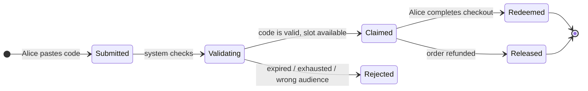

That is the whole product in one picture. Everything we add later (burst handling, fraud, multi-region) is a complication on top of this.

> **Take this with you.** A coupon system is a state machine with one nasty edge: two people hitting the last slot at the same instant. The whole architecture exists to resolve that race correctly.

---

## Step 2: Ask the right questions

Sit for two minutes before you draw anything. Write down what you need to know. Not twenty questions. Five good ones.

<details markdown="1">
<summary><b>Show: 5 questions that change the design</b></summary>

1. **Single-use or reusable?** Does each code work once (like a gift card)? Or does each code work many times up to a cap (like a public promo SAVE10)? *This is the biggest design fork. Single-use is one row, one redeem, done. Reusable means a counter and a per-user dedup check.*

2. **Which code patterns does the system need?** One shared code everyone types? One unique code per user mailed individually? Or a pre-generated pool where the first 1,000 to click each get one? *Three different storage shapes. You need to know before you draw the table.*

3. **Can codes be combined?** SAVE10 in the cart plus FREESHIP. Do percentages add up (10 + 50 = 60 percent) or multiply (1 - 0.10) × (1 - 0.50) = 55 percent)? *Stacking rules change the validate API.*

4. **What happens on refund?** Customer used BLACKFRI100. They cancel the order. Does the code go back into the pool? *Saying yes opens a new race. This is where many designs quietly break.*

5. **What abuse should we expect?** One person guessing every code? Codes shared on a deal forum? Bots scraping every possible combination? *Each one needs a different defense.*

A strong candidate also asks: *"Does the cart page show 'this code works' before checkout, or only at checkout?"* If yes, you need a separate validate endpoint. Good for UX. Risky because it leaks information to scrapers.

</details>

---

## Step 3: How big is this thing?

Two very different moments in the same day.

| Moment | Requests/sec | What is hot | The hard problem |
|--------|-------------|-------------|-----------------|
| **Steady state** | ~5 redeem, ~25 validate | Many campaigns, all warm | Cache hit rate |
| **Launch burst** | **10,000 in 1 second** | One campaign, one counter | Correct winner count |

<details markdown="1">
<summary><b>Show: how the numbers come out</b></summary>

**Launch burst.** 10,000 requests in 1 second = 10,000 QPS spike. It lasts seconds, not hours. Every single request needs a correct answer: 1,000 win, 9,000 lose, nobody gets two.

**Steady QPS.** 50,000 redemptions per day ÷ 86,400 seconds ≈ 0.6 per second. At peak hours maybe 5 per second. Validate runs about 5 times per redeem (users paste, bounce, come back), so steady validate QPS is roughly 3 per second.

**Storage.** 200 million codes × 200 bytes each ≈ 40 GB. Redemption log over 5 years ≈ 9 GB. Total around 50 GB. One Postgres instance.

**Hot working set during the launch.** One campaign. One counter. Maybe 100 KB of actively hot data.

**What the math tells you.** The system is small. Throughput is not the problem. Storage is not the problem. The architecture exists for two reasons only:

1. Surviving the 10,000 QPS burst on one hot key correctly.
2. Stopping abuse (brute force, leaked codes).

</details>

> **Take this with you.** Build for the burst, not the average. The 9,000 losers who need a fast "sold out" response are the design pressure, not the 1,000 winners.

---

## Step 4: The smallest thing that works

Forget the burst. We have 10 users. One campaign: WELCOME20, 20 percent off, unlimited. One table, one unique index.


The end-to-end happy path.

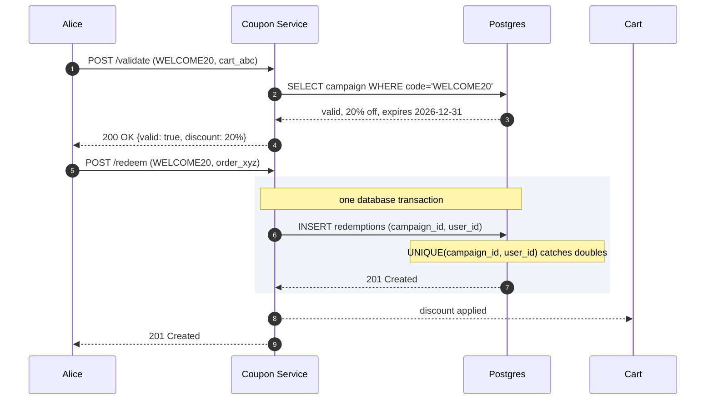

<details markdown="1">
<summary><b>Show: the three tables at this stage</b></summary>

```sql
CREATE TABLE campaigns (
    campaign_id   UUID PRIMARY KEY,
    code          TEXT UNIQUE NOT NULL,
    discount      JSONB NOT NULL,
    starts_at     TIMESTAMPTZ NOT NULL,
    ends_at       TIMESTAMPTZ NOT NULL,
    total_limit   INT,
    per_user_limit INT NOT NULL DEFAULT 1
);

CREATE TABLE redemptions (
    redemption_id UUID PRIMARY KEY,
    campaign_id   UUID NOT NULL REFERENCES campaigns,
    user_id       TEXT NOT NULL,
    order_id      TEXT NOT NULL,
    redeemed_at   TIMESTAMPTZ NOT NULL DEFAULT NOW()
);
CREATE UNIQUE INDEX idx_redemption_once
    ON redemptions (campaign_id, user_id);
```

The `UNIQUE(campaign_id, user_id)` index is load-bearing. Two browser tabs, two retries, a race: the database serializes them. First insert wins. Second fails with a unique-violation. The API returns 409. No special code required.

</details>

> **Take this with you.** The `UNIQUE(campaign_id, user_id)` index is the correctness story. Every layer we add later is performance on top of that guarantee.

---

## Step 5: The first crack

A marketing manager walks in: *"Can you run BLACKFRI100? 1,000 codes, gone when they're gone. We expect 10,000 attempts in the first second."*

You look at your code. `FOR UPDATE` on the campaign row. Every one of those 10,000 requests queues behind the same lock. The first request finishes in 5 ms. The 10,000th waits nearly a minute. Most time out.

This is the trap. **Stop serializing at the database row. Serialize in memory.**

The fix is a Redis Lua script that runs the "check and claim" atomically on a counter that lives entirely in Redis.

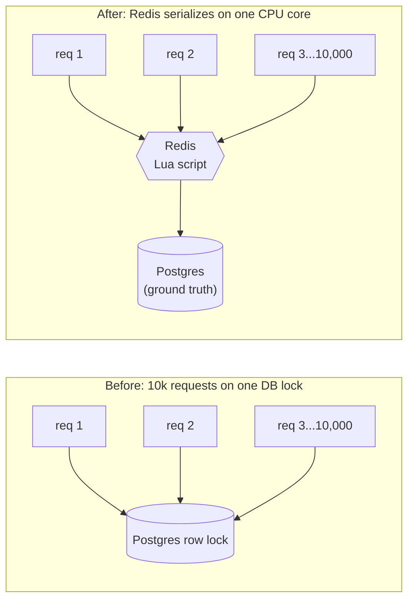

Redis is single-threaded. A Lua script inside Redis is atomic. All 10,000 requests still serialize, but they serialize on a sub-millisecond in-memory operation, not a 5 ms disk write under lock contention.

<details markdown="1">
<summary><b>Show: the Lua script</b></summary>

```lua
-- KEYS[1] = "campaign:{cid}:remaining"
-- KEYS[2] = "campaign:{cid}:users"
-- ARGV[1] = user_id

local remaining = tonumber(redis.call('GET', KEYS[1]))
if remaining == nil or remaining <= 0 then
  return {'err', 'exhausted'}
end
local already = redis.call('SISMEMBER', KEYS[2], ARGV[1])
if already == 1 then
  return {'err', 'already_redeemed'}
end
redis.call('DECR', KEYS[1])
redis.call('SADD', KEYS[2], ARGV[1])
return {'ok', 'claimed'}
```

Why a Lua script and not two separate Redis commands (GET then DECR)? Because two separate commands have a gap between them. In that gap, 1,000 other users can also GET and see the code is available. Then all 1,000 try to DECR. With a Lua script, the check and claim happen as one indivisible step. Only one wins each slot.

</details>

> **Take this with you.** Redis Lua for speed, Postgres for truth. The Lua script handles the burst in memory. The unique index in Postgres is the backstop that catches anything Redis misses.

---

## Step 6: Build the architecture, one layer at a time

We have the atomic claim. Now build the system around it.

### v1: just the service and the database

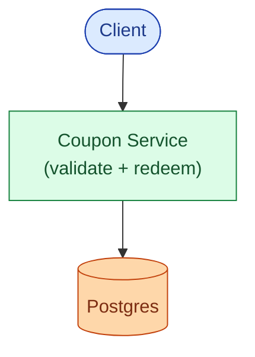

Fine for ten users and no bursts.

### v2: add the burst layer

The hot campaign counter lives in Redis. Lua handles the claim. Postgres is written to after Redis confirms.

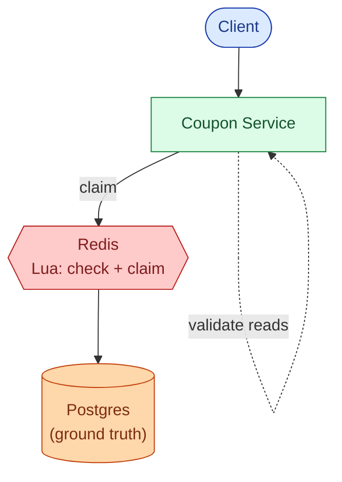

### v3: add the read path and abuse layer

Validate runs 5× more often than redeem. Cache campaign metadata. Put a Bloom filter in front to stop brute-force traffic before it touches the DB.

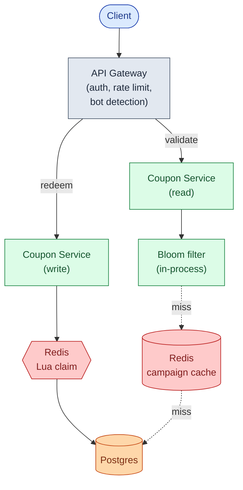

### v4: add async consumers

The cart needs to know a code was redeemed. Fraud needs a velocity signal. Finance needs a reconciliation record. None of these should slow down the redeem path. Add Kafka.


Each box, in one line:

| Box | What it does |
|-----|--------------|
| **API Gateway** | Authenticates, rate-limits per user and per IP, blocks bot patterns. |
| **Coupon Service (write)** | Runs the Lua claim, writes to Postgres, emits via outbox. Stateless. |
| **Coupon Service (read)** | Validates codes. Bloom filter first, then Redis cache, then Postgres. |
| **Bloom filter** | In-process. Rejects bogus codes in microseconds before touching the DB. |
| **Redis (claim)** | Holds the counter and the "claimed by" set for hot campaigns. |
| **Redis (cache)** | Holds campaign metadata for validate reads. 60s TTL. |
| **Postgres** | Source of truth. The unique index is the correctness guarantee. |
| **Kafka** | Carries events out. Cart, fraud, analytics consume from here, not from the write path. |

> **Take this with you.** If the cart service is down, redemptions still succeed. The discount catches up when the cart consumes from Kafka. Anything reactive lives after Kafka, not before.

---

## Step 7: One redeem, all the way through

Alice submits BLACKFRI100 during the launch burst. Watch what happens.

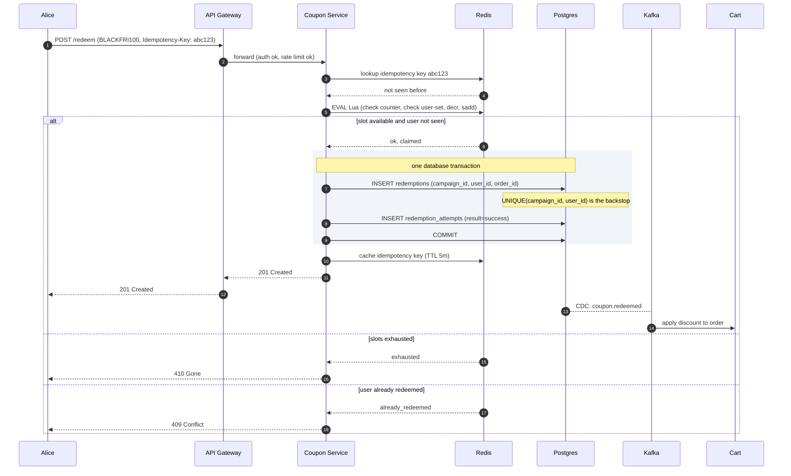

Three things worth pointing at:

1. The Redis Lua runs before Postgres. It is fast enough to handle 10,000 concurrent requests because Redis serializes them on one CPU core at sub-millisecond speed.
2. The Postgres write is synchronous, before returning success. If the service crashes after Redis claimed but before Postgres recorded, the user retries with the same `Idempotency-Key` and gets the cached response.
3. The cart is downstream of Kafka, not in the hot path. A cart outage does not block checkout.

---

## Step 8: Three code patterns, one engine

The same claim engine handles three different code shapes. The campaign's `type` field is the switch.

| Pattern | Example | Storage shape | Claim operation | Leak blast radius |
|---------|---------|--------------|----------------|-------------------|
| **Generic shared** | `SAVE10` | One row, counter on campaign | Lua DECR, unique index | High: one leaked code burns all slots |
| **Unique per-user** | `UID-7A2F-9B3C` | One row per (campaign, user) | UPDATE WHERE state='unused' | Low: one leaked code burns one slot |
| **Pre-generated pool** | `BLACKFRI-AB7K` | Many rows, each used once | LPOP from Redis list, SKIP LOCKED in Postgres | Medium: each leaked code burns one slot |

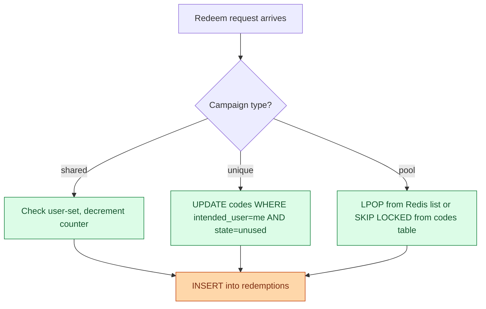

<details markdown="1">
<summary><b>Show: pool claim with SKIP LOCKED</b></summary>

For low-traffic campaigns, the pool claim can skip Redis entirely and use Postgres directly.

```sql
WITH next_code AS (
  SELECT code_id FROM codes
  WHERE campaign_id = $campaign_id AND state = 'unused'
  ORDER BY code_id
  FOR UPDATE SKIP LOCKED
  LIMIT 1
)
UPDATE codes c
SET state = 'used', claimed_by = $user_id, claimed_at = NOW()
FROM next_code nc
WHERE c.code_id = nc.code_id
RETURNING c.code_id, c.code;
```

`FOR UPDATE SKIP LOCKED` tells a concurrent transaction: "if this row is already locked, do not wait, skip it and try the next one." Ten parallel transactions each pick a different unused row. The 1,001st finds zero unused rows and returns nothing. Throughput is a few hundred claims per second, limited by row-level lock contention. For bursts above that, use the Redis list (`LPOP`) in front.

</details>

> **Take this with you.** One API, three patterns. The campaign `type` field decides the internal claim path. Callers do not need to know which one.

---

## Step 9: Stopping abuse

Two things will happen on launch day.

**Scenario 1.** A script fires 50 redeem attempts per second from one account. It is guessing codes: SAVE01, SAVE02, SAVE03. Most fail. Some hit. You see thousands of failed attempts per minute in your logs.

**Scenario 2.** Marketing mails BLACKFRI100 at 9 a.m. By 9:05 the code appears on a deal forum. By 9:10 random people are redeeming it. All 1,000 slots vanish in 30 seconds. The intended newsletter audience never got a chance.

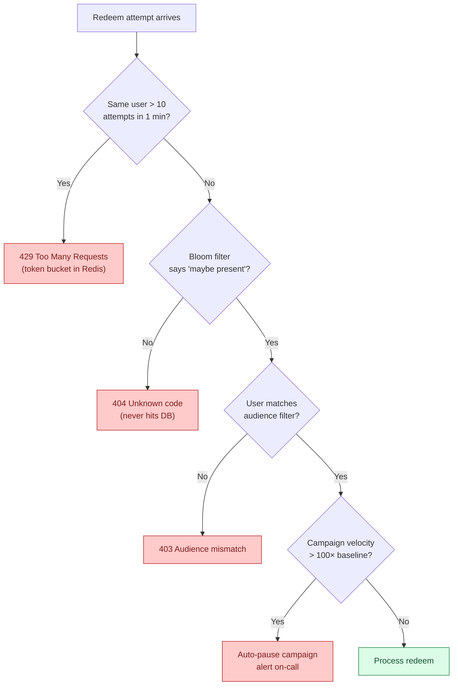

<details markdown="1">
<summary><b>Show: defenses for both scenarios</b></summary>

**Brute force (Scenario 1).**

No single defense is enough. Layer them.

Per-user rate limiting is the cheapest big win. Authenticated users get 10 validate attempts per minute and 5 redeem attempts per minute. Token bucket in Redis. Return 429 with `Retry-After` after the cap.

The Bloom filter is the killer move against namespace scraping. If the submitted code is not in the filter of all ever-issued codes, return 404 immediately. No DB hit. Brute-force load never reaches the real store. The filter lives in process memory (about 300 MB for 200 million codes at 0.1% false-positive rate). Rebuilt when a campaign is created.

After 5 failures from the same user, double the cooldown. After 10, ban for an hour.

**Leaked code (Scenario 2).**

Once a shared code leaks, you cannot undo it. You can mitigate.

Audience filter at validate time. Codes carry an `audience_filter`: "must be a newsletter subscriber as of date X." Validate fails if the user does not match, even if the code is correct. The forum poster shares the code, but most readers cannot use it.

Even better: mail unique per-user codes, not one shared code. Even if one code leaks, only that one user's slot is burnt.

Velocity-based auto-pause. If a campaign sees a 100× spike in redeem attempts in one minute over the trailing baseline, auto-pause and alert. Marketing reviews before all slots burn.

</details>

> **Take this with you.** The Bloom filter handles guessing. The audience filter handles leaking. Per-user rate limits handle both. Defense is layered.

---

## Follow-up questions

Try answering each in 2 or 3 sentences before opening the solution.

1. **Network failed mid-redeem.** A user submits BLACKFRI100. The request times out after Redis decremented the counter but before Postgres recorded the redemption. They retry. What does your system do?

2. **The cap got blown.** The campaign has 1,000 codes. After launch, 1,003 redemptions are recorded in Postgres. How did this happen? How do you detect it and prevent it?

3. **Stackable codes.** A cart has SAVE10 (10 percent off) and FREESHIP (free shipping). The user adds BLACKFRI100 (100 percent off). What does your validate endpoint return? Where does the stacking logic live?

4. **Refund flow.** An order with BLACKFRI100 is refunded the next day. Marketing wants the code released back into the pool so someone else can use it. Engineering hates this. What is the right answer?

5. **Expiration in the wrong time zone.** A code expires at "midnight on Dec 31". The user is in Tokyo. The code was issued in PST. What does the user see, what does the API return, and how do you avoid being yelled at on Twitter?

6. **Mass code update.** A campaign has 10 million per-user codes pre-generated. Marketing realizes the discount amount is wrong. They want to update all 10 million without invalidating already-redeemed ones. Can you?

7. **Multi-region.** Your e-commerce site has US and EU regions. A US-issued code is redeemed against the EU site. How do you guarantee single-use across regions?

8. **Bloom filter false negative.** Your Bloom filter says "code not present", but the code actually exists. Bloom filters do not have false negatives. Explain why, and what error they do have, and how that affects this design.

9. **The last slot race.** Reusable code SAVE10 has been used 9,999 times. The limit is 10,000. Twenty users hit redeem at the same instant. How do you give it to exactly one of them and tell the other nineteen "limit reached"?

10. **Unused expired code.** A code was generated, mailed to a user, but they never redeemed it before expiry. After expiry, can you reuse that code string for a new campaign? Why or why not?

---

## Related problems

- **[Approval Management (011)](../011-approval-management/question.md).** The audit trail, immutable record-keeping, and state machine patterns apply directly to the redemption log here.
- **[Shopping Cart (012)](../012-shopping-cart/question.md).** The cart consumes `coupon.redeemed` events and applies discounts. Cart idempotency is the other side of redemption idempotency.
- **[Rate Limiter (004)](../004-rate-limiter/question.md).** The per-user and per-IP rate limits in Step 9 are the standard algorithms. Pick one with intent.
- **[Distributed Cache (009)](../009-distributed-cache/question.md).** The Redis layer here is the same caching layer. Understand its eviction and replication story before depending on it for hot-burst correctness.


<div class="pr-solution-divider"></div>


## Solution: Coupon Code Redemption System

### The short version

A coupon system is a small write-light service with one nasty bit: surviving a launch burst where 10,000 users hit the same code in the same second and exactly 1,000 of them must win. Everything else is plumbing.

The design has two layers.

- **Postgres** is the source of truth. A unique index on `(campaign_id, user_id)` makes double-redemption impossible at the storage level.
- **Redis with a Lua script** handles the hot-burst claim so the database is not asked to serialize 10,000 transactions on one row.

Three code patterns share one schema: generic shared codes (`SAVE10`), unique per-user codes (`UID-XXXX`), and pre-generated pools (`BLACKFRI-XXXX`). All three use the same redeem API. The difference is in how codes are minted and how the claim works.

A **Bloom filter** in front of the read path stops brute-force traffic from reaching the DB. **Rate limits** stop the same user from grinding the namespace.

The interesting engineering lives at three edges:

1. Making the launch burst correct without a database stampede.
2. Defining what "release the code back on refund" means without creating a new race.
3. Keeping an audit trail finance can use years later.

---

### 1. The two questions that matter most

**Single-use or reusable?** They have completely different data models and contention shapes. Almost as important: which of the three code patterns (shared, unique, pool) the system supports. If you assume one pattern and the interviewer wanted all three, you redesign mid-interview.

Everything else (stacking, expiration, refund, abuse) follows from those two answers.

---

### 2. The math, in plain numbers

| Scale | Redeem QPS | Validate QPS | Storage |
|-------|-----------|--------------|---------|
| Steady state | ~0.6 (peak ~5) | ~3 (peak ~25) | 50 GB total |
| Launch burst | **10,000 in 1 second** | 50,000 in 1 second | ~100 KB hot |

The launch burst is the design pressure. The 9,000 losers all need a fast "sold out" response, not a timeout. Storage barely registers. 200 million codes × 200 bytes is about 40 GB. Add 9 GB of redemption log over 5 years. One Postgres instance handles it.

The system is small. The architecture exists for **burst correctness** and **abuse resistance**, not throughput or storage.

---

### 3. The API

Validate and redeem are separate endpoints. Validate is read-only and cheap. Redeem is the atomic act.

```
POST /api/v1/coupons/validate
Authorization: Bearer <token>
Content-Type: application/json

{
  "code": "BLACKFRI100",
  "cart_id": "cart_abc",
  "subtotal": 120000
}
```

| Status | Meaning |
|--------|---------|
| **200** | `{"valid": true, "discount": {...}, "expires_at": "..."}` |
| **404** | Unknown code (also returned for unauthenticated audience-mismatch, to avoid leaking info) |
| **410** | Expired or fully exhausted |
| **403** | Authenticated user not in the code's audience |
| **429** | Rate limited |

```
POST /api/v1/coupons/redeem
Authorization: Bearer <token>
Idempotency-Key: <uuid>
Content-Type: application/json

{
  "code": "BLACKFRI100",
  "order_id": "ord_xyz",
  "user_id": "usr_42"
}
```

| Status | Meaning |
|--------|---------|
| **201** | Redemption succeeded |
| **200** | Idempotent retry (same Idempotency-Key seen before) |
| **409** | User already redeemed this code |
| **410** | Code exhausted or expired |
| **403** | Audience mismatch |

Load-bearing choices:

- **`Idempotency-Key` is required on redeem.** Network retries are guaranteed at burst. Without the key, the same user's retry can consume two codes.
- **`order_id` ties the redemption to the order.** Needed for refund/release and finance reconciliation.
- **Validate returns 404 for unauthenticated audience mismatches.** Prevents scraping the code namespace for "which codes exist."

---

### 4. The data model

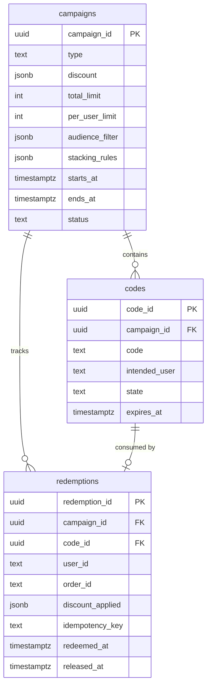

<details markdown="1">
<summary><b>Show: the full SQL</b></summary>

```sql
CREATE TABLE campaigns (
    campaign_id      UUID PRIMARY KEY,
    name             TEXT UNIQUE NOT NULL,
    type             TEXT NOT NULL,
    discount         JSONB NOT NULL,
    total_limit      INT,
    per_user_limit   INT NOT NULL DEFAULT 1,
    audience_filter  JSONB,
    stacking_rules   JSONB,
    starts_at        TIMESTAMPTZ NOT NULL,
    ends_at          TIMESTAMPTZ NOT NULL,
    status           TEXT NOT NULL DEFAULT 'active'
);

CREATE TABLE codes (
    code_id          UUID PRIMARY KEY,
    campaign_id      UUID NOT NULL REFERENCES campaigns,
    code             TEXT NOT NULL,
    intended_user    TEXT,
    state            TEXT NOT NULL DEFAULT 'unused',
    claimed_by       TEXT,
    claimed_at       TIMESTAMPTZ,
    expires_at       TIMESTAMPTZ
);
CREATE UNIQUE INDEX idx_codes_code ON codes (code);
CREATE INDEX idx_codes_pool ON codes (campaign_id, state) WHERE state = 'unused';

CREATE TABLE redemptions (
    redemption_id    UUID PRIMARY KEY,
    campaign_id      UUID NOT NULL REFERENCES campaigns,
    code_id          UUID REFERENCES codes,
    user_id          TEXT NOT NULL,
    order_id         TEXT NOT NULL,
    discount_applied JSONB NOT NULL,
    idempotency_key  TEXT NOT NULL,
    redeemed_at      TIMESTAMPTZ NOT NULL DEFAULT NOW(),
    released_at      TIMESTAMPTZ,
    released_reason  TEXT
);
CREATE UNIQUE INDEX idx_redemption_once
    ON redemptions (campaign_id, user_id) WHERE released_at IS NULL;
CREATE UNIQUE INDEX idx_redemption_idempotency ON redemptions (idempotency_key);
CREATE INDEX idx_redemption_order ON redemptions (order_id);

CREATE TABLE redemption_attempts (
    attempt_id    BIGSERIAL PRIMARY KEY,
    code          TEXT NOT NULL,
    user_id       TEXT,
    ip            INET,
    result        TEXT NOT NULL,
    attempted_at  TIMESTAMPTZ NOT NULL DEFAULT NOW()
);
CREATE INDEX idx_attempts_user ON redemption_attempts (user_id, attempted_at DESC);
CREATE INDEX idx_attempts_ip ON redemption_attempts (ip, attempted_at DESC);
```

</details>

Three things doing real work:

**`UNIQUE(campaign_id, user_id) WHERE released_at IS NULL`.** Two browser tabs racing each other. The database serializes them. First insert wins. Second fails with a unique-violation. The API returns 409. This is the safety net behind whatever Redis says.

**`discount_applied` is a snapshot.** The discount as it was at redeem time, frozen. Marketing can change the campaign's discount later. Already-redeemed orders are unaffected. Finance audit is accurate.

**`redemption_attempts` logs everything, including failures.** Required for fraud signals. At production scale, partition it monthly.

---

### 5. The core algorithm: the atomic claim

Two paths, picked per campaign's expected QPS.

**Low-traffic path: Postgres only.**

```sql
BEGIN;

WITH next_code AS (
  SELECT code_id FROM codes
  WHERE campaign_id = $campaign_id AND state = 'unused'
  ORDER BY code_id
  FOR UPDATE SKIP LOCKED
  LIMIT 1
)
UPDATE codes c
SET state = 'used', claimed_by = $user_id, claimed_at = NOW()
FROM next_code nc
WHERE c.code_id = nc.code_id
RETURNING c.code_id, c.code;

INSERT INTO redemptions (redemption_id, campaign_id, code_id, user_id, order_id,
                         discount_applied, idempotency_key)
VALUES (...)
ON CONFLICT (campaign_id, user_id) WHERE released_at IS NULL DO NOTHING
RETURNING redemption_id;

COMMIT;
```

`FOR UPDATE SKIP LOCKED` lets concurrent transactions each pick a different unused row instead of queuing on one. Throughput: a few hundred claims per second on one Postgres, which is fine for any campaign below about 100 QPS.

**High-traffic path: Redis Lua + Postgres.**

```lua
-- KEYS[1] = "campaign:{cid}:remaining"
-- KEYS[2] = "campaign:{cid}:users"
-- KEYS[3] = "campaign:{cid}:pool"  (Redis list, pool type only)
-- ARGV[1] = user_id
-- ARGV[2] = campaign_type

local remaining = tonumber(redis.call('GET', KEYS[1]))
if remaining == nil then
  return {'err', 'unknown_campaign'}
end
if remaining <= 0 then
  return {'err', 'exhausted'}
end
local already = redis.call('SISMEMBER', KEYS[2], ARGV[1])
if already == 1 then
  return {'err', 'already_redeemed'}
end
local claimed_code = nil
if ARGV[2] == 'pool' then
  claimed_code = redis.call('LPOP', KEYS[3])
  if claimed_code == false then
    return {'err', 'exhausted'}
  end
end
redis.call('DECR', KEYS[1])
redis.call('SADD', KEYS[2], ARGV[1])
return {'ok', claimed_code}
```

Latency under 1 ms. Redis is single-threaded, so 10,000 concurrent requests serialize on one CPU core. After Redis returns OK, the service writes to Postgres synchronously (about 5 ms). Total redeem latency: about 6 ms. The Postgres `ON CONFLICT` clause is the backstop if Redis hiccups.

Which to use:

| Campaign expected QPS | Approach |
|----------------------|----------|
| < 100 | Postgres only |
| 100 to 10,000 | Redis Lua + Postgres backstop |
| > 10,000 | Redis Lua + sharded Redis (counter and user-set by `hash(user_id)`) |

In practice, run all campaigns through Redis. The cost for a low-traffic campaign is negligible. The code path is uniform.

**The Bloom filter prefilter.**

```python
def validate(code):
    if not bloom_filter.maybe_contains(code):
        return 404
    # continues to Redis / DB
```

Bloom filters never have false negatives. If the filter says "not present," the code was definitely never issued. They have a tunable false-positive rate. At 0.1%, 99.9% of brute-force attempts on bogus codes are cut off before touching the DB. Memory footprint at 200 million codes: about 300 MB in process memory. Fits easily in each pod.

---

### 6. The architecture

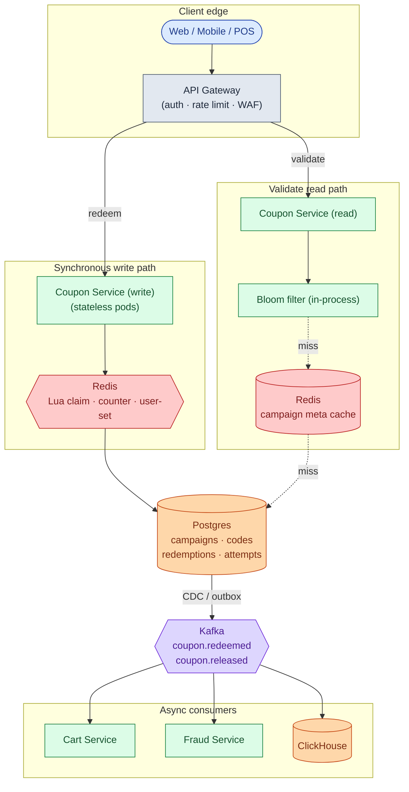

Five things to notice:

- The write path touches Redis and Postgres synchronously. Nothing else. Kafka, cart, fraud, analytics are downstream of CDC. Cart down does not block checkout.
- The Bloom filter lives in process memory, not Redis. Process memory is faster and cheaper for this use case.
- The Postgres unique index is the ground truth. Every other layer can lose data and the system recovers from the DB. If the unique index breaks, you have a correctness bug.
- Coupon Service pods are stateless. The Bloom filter is rebuilt on startup from an S3 snapshot plus a tail of `campaign_created` events.
- Reads (validate) and writes (redeem) scale independently. The read service can be replicated freely since it is read-only.

---

### 7. A redeem, end to end

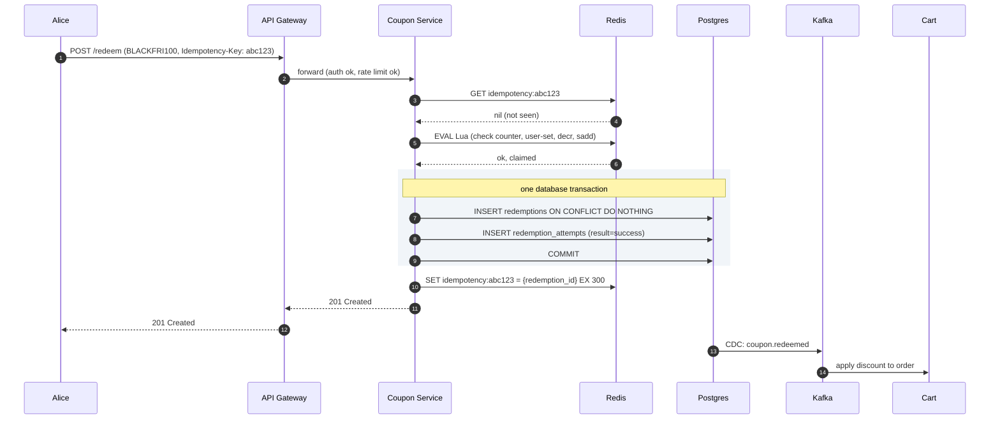

Target latencies:

| Operation | P99 |
|-----------|-----|
| Validate (cache hit) | ~5 ms |
| Validate (cache miss) | ~50 ms |
| Redeem (burst) | ~50 ms (Redis 1 ms + Postgres 5-10 ms + network) |

---

### 8. The scaling journey: 10 users to 1 million

At every stage, name what just broke and what fixes it. Build nothing preemptively.

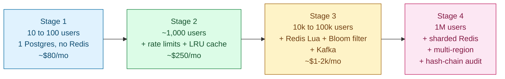

**Stage 1: 10 to 100 users.** One Postgres, one app pod. Three tables with the unique index. Validate and redeem are straight DB calls. No Redis. No Kafka. The cart calls the coupon service inline. About $80/month. Ten redemptions per day. The unique index alone is the entire correctness story. Building more is over-engineering.

**Stage 2: 1,000 users.** A user shares a code on a forum. 200 anonymous attempts hit in 5 minutes. DB CPU spikes. You add per-user rate limiting (token bucket in Redis), per-IP rate limiting for unauthenticated traffic, and an in-process LRU for campaign metadata. A cart bug caused some users to submit redeem twice. The unique index caught the double-claim but returned a confusing 500. You add `ON CONFLICT DO NOTHING` handling and return 409 instead. `Idempotency-Key` on redeem becomes required. About $250/month.

**Stage 3: 10,000 to 100,000 users.** A flash sale: 2,000 codes for FLASH50, 5,000 users at noon. Postgres CPU pegged for 30 seconds because `FOR UPDATE SKIP LOCKED` serialized under hot row contention. Most requests timed out. Marketing was furious. A brute-force script fired 5,000 bogus attempts per second from rotating IPs.

Fixes: Redis with Lua for hot campaigns. Bloom filter in process (bogus codes return 404 in microseconds). Pool codes pre-loaded into a Redis list (`LPOP` is sub-millisecond). Kafka for async consumers. Read replica for validate. Velocity-based auto-pause at 100× spike. About $1-2k/month.

**Stage 4: 1 million users.** The hottest Black Friday campaign saturated one Redis core at 50k QPS. EU operations launched. Codes need single-use guarantees across regions. A minting bug inserted 10 million pool codes with the wrong discount.

Fixes: sharded Redis for ultra-hot campaigns (counter and user-set partitioned by `hash(user_id)` across N nodes). Multi-region with per-region code ownership: the owning region holds the authoritative unique index, cross-region redeems route through an authenticated API. Bulk campaign update tool that patches campaign metadata without touching redemption snapshots. Audit hash chain on the redemptions table for SOX compliance. About $10-30k/month.

The core insight carries through all four stages unchanged: Postgres unique index as safety net, Redis Lua as burst path, Bloom filter as brute-force shield.

---

### 9. The three code patterns, fast

| Pattern | Claim operation | Leak blast radius | Best for |
|---------|----------------|-------------------|---------|
| **Generic shared** | Lua DECR + unique index | High (one code = all slots) | Public promos with loose audience |
| **Unique per-user** | UPDATE WHERE state='unused' | Low (one code = one slot) | Newsletter rewards, referrals |
| **Pre-generated pool** | LPOP from Redis list | Medium (one code = one slot) | Flash sales with meaningful code artifacts |

One engine, three patterns, no special API routes. The campaign `type` field switches the internal claim logic.

---

### 10. Reliability

**Redis dies mid-redemption.** Lua returned OK and decremented the counter. The service crashed before the Postgres write. Redis later lost state in a failover.

Three things keep this safe:

1. Synchronous Postgres write before returning success. This is why we accept the 5-10 ms cost.
2. The unique index as ground truth. If Redis is rebuilt, the rebuild queries Postgres for the current redeemed count and reseeds the counter and user-set.
3. A nightly reconciliation job: `SELECT COUNT(*) FROM redemptions WHERE campaign_id=? AND released_at IS NULL` vs Redis counter. Alert on any drift.

**Payment fails after redemption.** Two policies, picked at campaign creation:

- Default (`release_on_failure = false`): the redemption stands. The user lost their slot. Simpler and avoids the release race.
- Opt-in (`release_on_failure = true`): set `released_at` on the redemption, push the code back to the Redis list, increment the Redis counter. Each step is idempotent.

The senior position: default to no release. Release introduces a parallel race where someone else claims the released slot while the original user is debugging payment. For high-value campaigns where customer goodwill matters, opt in knowingly.

**Kafka is down.** Redemptions succeed in Postgres but the cart does not receive the event. The cart polls the coupon service for redemptions tied to active carts as a fallback. Or the user re-applies the code in the cart UI (validate returns `{"valid": true, "already_redeemed_for_this_order": true}` with the discount). A Kafka outage must not block checkout.

---

### 11. Observability

| Metric | Why it matters |
|--------|----------------|
| `redeem.latency` p50/p95/p99 | The headline SLO. Alert if p99 > 200 ms at burst. |
| `redeem.result.distribution` | success / exhausted / already_redeemed / audience_mismatch. Drift signals UX bugs. |
| `redeem.attempts.rate` per campaign | 100× spike triggers velocity pause. |
| `validate.cache_hit_rate` | Should be > 90%. Below means the cache is too small. |
| `bloom_filter.false_positive_rate` | Spikes indicate scraper traffic bypassing the filter. |
| `redis.counter.drift_vs_db` | Computed nightly. Non-zero is a Redis incident or a bug. |
| `rate_limit.triggered.count` | Top offenders dashboard for the security team. |
| `kafka.lag.coupon_redeemed` | Cart applies discounts with this lag. Alert at > 30 s. |

Page on: redeem error rate > 5% for 5 min. Redis-Postgres drift > 100. Bloom filter rebuild stuck.

Ticket on: validate cache hit rate < 80%. Rate limit triggers > 10× daily baseline.

---

### 12. Follow-up answers

**1. Redis decremented but Postgres did not record. User retries.**

The `Idempotency-Key` in Redis (5-minute TTL) catches it. The retry's key matches. The cached response is returned. The user sees success without a second DB write.

If the idempotency cache also lost the entry (Redis failover), the retry hits the Lua script again. The user is already in the user-set, so the script returns `already_redeemed`. The service looks up the original `redemption_id` in Postgres and returns it. Idempotent.

The one bad case: the idempotency cache is lost AND Postgres also lost the row (should never happen with a healthy DB). Then the user redeems a second time. Mitigation: write to Postgres synchronously before returning success. This is why we accept the latency cost.

**2. 1,000 codes in the campaign. 1,003 in Postgres after launch.**

Three possible causes. One: the release-on-refund flow released 3 codes and they were re-claimed. Not actually an overcount: `WHERE released_at IS NULL` gives exactly 1,000 active redemptions. Two: the partial unique index was missing (`WHERE released_at IS NULL` omitted), allowing two active rows per user. Three: Redis and Postgres drifted because Postgres writes failed silently while Redis kept running.

Detection: nightly reconciliation comparing the index-constrained count vs Redis counter. Alert on any drift. Prevention: synchronous Postgres write before success. The unique index as backstop.

**3. Stacking SAVE10 + FREESHIP + BLACKFRI100.**

Each campaign has `stacking_rules`: `{"excludes": ["BLACKFRI*"]}`. Validate is told what other coupons are in the cart. It evaluates the stacking rules for the incoming code against the cart's existing codes. If BLACKFRI100 excludes SAVE10, validate returns `{"valid": false, "reason": "not_stackable_with_SAVE10"}`.

The coupon service owns stacking rules. The cart owns the final discount calculation (additive vs multiplicative, capped at 100%). Business decision per campaign.

**4. Refund releases the code, or not?**

Per-campaign policy. Default: no release. Refund the money. The discount is gone. If the customer is high-value, support manually issues a courtesy code from a separate budget. This avoids the release race entirely.

If release is on: set `released_at` on the redemption (the partial unique index makes the user free to redeem again). For pool codes, set the code row back to `unused` and push it to the Redis list. For shared counters, `INCR` the Redis counter. Each step is idempotent but the parallel race is real: someone else can claim within milliseconds of the release.

**5. Expiration in the wrong timezone.**

Store `expires_at` as a UTC timestamp. Compare against UTC `NOW()`. Done.

For UI: render in the user's local timezone as a relative duration ("Expires in 3 hours") rather than an absolute timestamp. When marketing says "midnight Dec 31," require a timezone selector on the campaign creation form. Default to the company's HQ timezone, never assume.

**6. Mass-update 10M codes without invalidating already-redeemed ones.**

The `discount_applied` snapshot in each redemption row is immutable. Updating the campaign's `discount` field does not touch past redemptions. The cart uses the snapshot, not the live campaign discount.

For unredeemed codes, the campaign update takes effect on next redeem. The `codes` table does not store the discount per code. It joins to the campaign. Code path: `UPDATE campaigns SET discount=? WHERE campaign_id=?`. One row. Fast. Broadcast a cache-invalidation event to all pods to drop the cached campaign metadata.

**7. Multi-region single-use guarantee.**

Each code is owned by exactly one region at creation. The owning region's Postgres holds the authoritative unique index. A redemption on the wrong region routes to the owning region via authenticated cross-region API. The owning region runs the Lua claim and Postgres write. Response traverses back. Latency cost: about 100 ms. Acceptable for the rare cross-region case, which is typically < 1% of traffic.

Alternative: strongly-consistent multi-region DB (Spanner, DynamoDB Global Tables). Higher cost, simpler model. Worth it only if cross-region redemptions exceed about 10% of traffic.

**8. Bloom filter has no false negatives.**

Correct. A Bloom filter never says "definitely not present" for something that was inserted. If a code was added to the filter, the filter always reports "maybe present."

What Bloom filters have is **false positives**: occasionally saying "maybe present" for a code never inserted. This is fine here. A false positive sends the request through to the cache and DB, which correctly return 404. No harm done. At 0.1% false-positive rate and 5,000 brute-force attempts per second, about 5 fall through to the DB. Trivial.

What you must not do: treat "maybe present" as proof the code exists. Always validate against the DB on a positive hit because the filter is approximate.

**9. SAVE10 has 9,999 of 10,000 uses. Twenty users hit simultaneously.**

The Lua script handles this. Redis is single-threaded, so the 20 requests serialize. The first sees `remaining = 1`, decrements to 0, returns OK. The other 19 see `remaining = 0` and return `exhausted` (410). The one winner's Postgres insert proceeds normally. The 19 losers get 410 immediately, without waiting for the winner to finish.

**10. Unused expired code. Can you reuse the code string?**

No. Codes are append-only forever, even after expiry. The unique index on the code string is permanent. Reuse would require deleting the expired row, which loses audit history. A user may have the code bookmarked. Reusing the string for a new campaign creates confusion ("why does my code from last year apply a different discount?"). Trying an expired code is also a useful fraud signal. Reusing the string erases it.

The solution: design the code namespace to be effectively infinite. 10 characters of base32 is about 10^15 codes. You will never run out. Mint a new string for each campaign.

---

### 13. Trade-offs worth saying out loud

**Why Postgres unique index and Redis Lua, not just one of them.** The unique index alone melts under 10k QPS on one row. Redis Lua alone loses correctness if Redis drops state. Together: fast hot path with a strong safety net.

**Why a Bloom filter instead of a Redis SET membership check.** Bloom filter is in-process, sub-microsecond, fixed memory (about 300 MB for 200 million codes). A Redis `SISMEMBER` is a network round-trip (1 ms) and grows linearly. At 200 million codes, the SET is about 4 GB in Redis. Bloom wins on cost and latency.

**Why an immutable redemptions log instead of just current state.** Finance auditors, fraud investigators, and refund workflows all need the history. Mutating in place destroys traceability. The `discount_applied` snapshot is the only way to answer "what discount did this customer actually get on that order in Q3 2023."

**Why not default to releasing codes on refund.** The release creates a parallel race. Someone else can claim the released slot within milliseconds. Customer service hates this when the refunding customer asks "can I get my code back." The cleaner answer is to not release and issue a courtesy code manually for high-value cases.

---

### 14. Common mistakes

**Diving straight into a `coupons` table without thinking about concurrency.** If your first sentence is "we'll have a `times_used` column," you have missed the point. The interviewer will steer you to the race condition. You should arrive there first.

**Using Redis without a Postgres backstop.** Redis can lose state. If you describe Redis as the source of truth and shrug at failure modes, you fail the senior bar.

**Forgetting the per-user uniqueness check.** Some candidates atomic-claim the campaign counter and forget the same user can race themselves with two browser tabs. The `UNIQUE(campaign_id, user_id)` index is non-optional.

**No idempotency on redeem.** Without `Idempotency-Key`, every network retry burns a slot. At burst with flaky networks, this is catastrophic.

**Conflating validate and redeem.** A POST that always consumes is a UX disaster (no discount preview before checkout). A GET that consumes violates HTTP semantics and breaks browser pre-fetch. Two endpoints, clear separation.

**Ignoring brute-force.** Coupon namespaces get scraped. Without rate limiting and the Bloom filter, an attacker enumerates your namespace in hours.

**Hand-waving release-on-refund.** "Yeah, we'll just put it back" without naming the parallel race is a weak answer. Say explicitly whether you release, why, and what the race looks like if you do.

**No discount snapshot in the redemption row.** Marketing can retroactively change campaign discounts. Without the snapshot, past orders get the wrong discount amount in finance reconciliation.

**Designing for steady-state write throughput.** Even at 1 million users, sustained QPS is single digits. The design pressure is the launch burst. Candidates who size for "millions of writes per second" have misread the problem.

If you can name seven of these, you are interviewing at the senior level. The launch-burst correctness story is what separates strong candidates from generic "design a CRUD app" answers. The two most common drop-points: the per-user race issue, and the importance of the Postgres backstop behind the Redis hot path.

