
## What we are building

Marketing launches a code: `SAVE20`. It gives $20 off, limited to the first 10,000 customers, one per user. Alice enters it at checkout, gets the discount, and the counter goes down by exactly one, even when the campaign drops during a flash-sale spike with thousands of people all hitting redeem at the same instant.

That is the core product. It looks like a simple "mark a row used" operation. It is not.

Four real problems hide inside it:

1. **Atomic decrement under heavy concurrency.** When 10,000 requests arrive in one second, the wrong implementation gives out 10,200 discounts or times out 9,000 people.
2. **Per-user limit enforcement.** Alice submits from two browser tabs at the same time. Both requests reach the server before either has written to the database. Exactly one should succeed.
3. **Fraud and namespace scraping.** A bot fires `SAVE01`, `SAVE02`, `SAVE03`, ... at hundreds of attempts per second to find valid codes before real users do.
4. **Eventually consistent vs. strongly consistent counter.** If Redis holds the counter and Postgres holds the record, what happens when they drift? Which one is authoritative?

We start with the smallest version that works, then add one pressure at a time.

---

## The lifecycle of one redemption

Picture the state a code goes through before drawing any boxes.


The whole product lives in this diagram. Every piece of infrastructure added later serves one purpose: resolving the race at the `Claimed` transition correctly when two users hit the last slot at the same instant.

> **Take this with you.** A coupon system is a state machine with one nasty edge: two requests hitting the last slot simultaneously. The architecture exists to resolve that race correctly and only once.

---

## How big this gets

Two very different moments in the same day.

| Moment | Requests/sec | What is hot | The hard problem |
|--------|-------------|-------------|-----------------|
| Steady state | ~5 redeem, ~25 validate | Many campaigns, all warm | Cache hit rate |
| Launch burst | **10,000 in 1 second** | One campaign, one counter | Correct winner count |

<details markdown="1">
<summary><b>Show: how the numbers come out</b></summary>

**Launch burst.** 10,000 requests in 1 second = 10,000 QPS spike, lasting seconds not hours. Every request needs a correct answer: 1,000 win, 9,000 lose, nobody gets two.

**Steady QPS.** 50,000 redemptions per day / 86,400 seconds is about 0.6 per second. At peak hours maybe 5. Validate runs about 5 times per redeem (users paste, bounce, come back), so steady validate QPS is roughly 25 per second.

**Storage.** 200 million codes x 200 bytes is about 40 GB. Redemption log over 5 years is about 9 GB. Total around 50 GB. One Postgres instance.

**Hot working set during a launch.** One campaign. One counter. Maybe 100 KB of actively hot data.

What the math tells you: the system is small. Throughput is not the problem. Storage is not the problem. The architecture exists for two reasons: surviving the 10,000 QPS burst on one hot key correctly, and stopping abuse.

</details>

> **Take this with you.** Build for the burst, not the average. The 9,000 losers who need a fast "sold out" response are the real design pressure, not the 1,000 winners.

---

## The smallest version that works

Ten users. One campaign: `WELCOME20`, 20% off, unlimited. One service. One database.

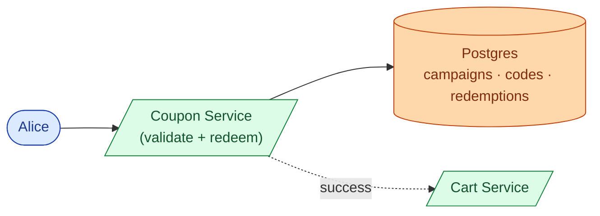

Two endpoints carry the entire product.

| Endpoint | What it does |
|----------|--------------|
| `POST /coupons/validate` | Check the code and return the discount. Read-only. |
| `POST /coupons/redeem` | Claim a slot atomically. Writes to the database. |

<details markdown="1">
<summary><b>Show: the three tables at this stage</b></summary>

```sql
CREATE TABLE campaigns (
    campaign_id    UUID PRIMARY KEY,
    code           TEXT UNIQUE NOT NULL,
    discount       JSONB NOT NULL,
    starts_at      TIMESTAMPTZ NOT NULL,
    ends_at        TIMESTAMPTZ NOT NULL,
    total_limit    INT,
    per_user_limit INT NOT NULL DEFAULT 1
);

CREATE TABLE redemptions (
    redemption_id UUID PRIMARY KEY,
    campaign_id   UUID NOT NULL REFERENCES campaigns,
    user_id       TEXT NOT NULL,
    order_id      TEXT NOT NULL,
    redeemed_at   TIMESTAMPTZ NOT NULL DEFAULT NOW()
);

CREATE UNIQUE INDEX idx_redemption_once
    ON redemptions (campaign_id, user_id);
```

The `UNIQUE(campaign_id, user_id)` index is the whole correctness story at this stage. Two browser tabs, two retries, a race: the database serializes them. First insert wins. Second fails with a unique-violation. The API returns 409.

</details>

The happy path, traced:

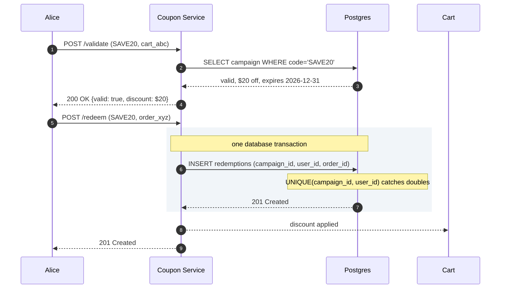

> **Take this with you.** The `UNIQUE(campaign_id, user_id)` index is the correctness foundation. Every layer added later is performance on top of that guarantee.

---

## Decision 1: how do we keep the counter correct under burst?

Marketing launches `BLACKFRI100`: 1,000 codes, 10,000 attempts in the first second.

Naive approach: `SELECT remaining FROM campaigns WHERE code='BLACKFRI100' FOR UPDATE`. Every one of those 10,000 requests queues behind the same database row lock. The first finishes in 5 ms. The 10,000th waits nearly a minute. Most time out.

The fix is to move the counter off Postgres and into Redis, where a Lua script runs the "check and decrement" atomically in memory.

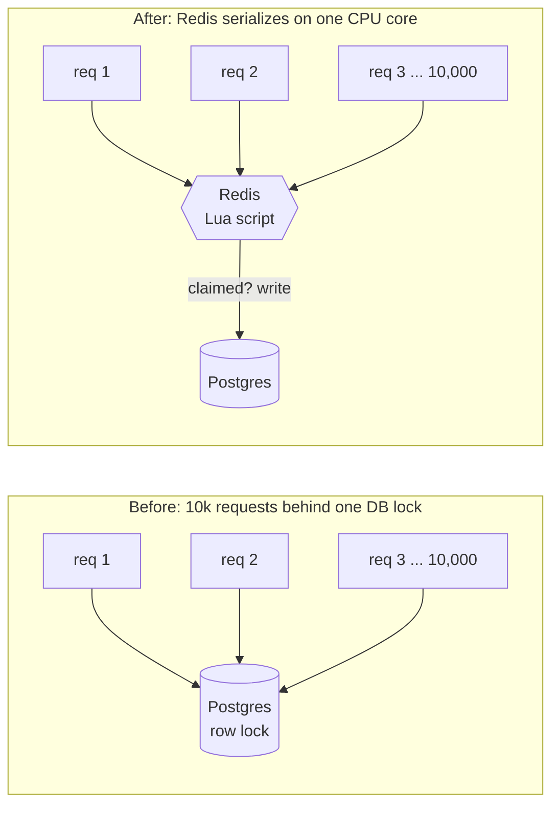

Redis is single-threaded. A Lua script inside Redis is atomic. All 10,000 requests still serialize, but on a sub-millisecond in-memory operation instead of a 5 ms disk write under lock contention.

The counter decrement rate tells the story:

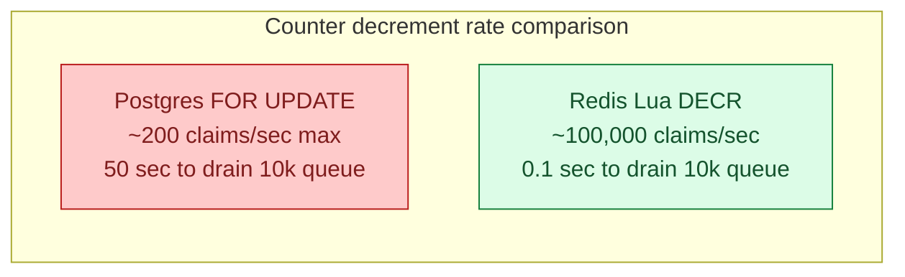

<details markdown="1">
<summary><b>Show: the Lua script</b></summary>

```lua
-- KEYS[1] = "campaign:{cid}:remaining"
-- KEYS[2] = "campaign:{cid}:users"
-- ARGV[1] = user_id

local remaining = tonumber(redis.call('GET', KEYS[1]))
if remaining == nil or remaining <= 0 then
  return {'err', 'exhausted'}
end
local already = redis.call('SISMEMBER', KEYS[2], ARGV[1])
if already == 1 then
  return {'err', 'already_redeemed'}
end
redis.call('DECR', KEYS[1])
redis.call('SADD', KEYS[2], ARGV[1])
return {'ok', 'claimed'}
```

Why Lua and not two separate commands (`GET` then `DECR`)? Two separate commands have a gap between them. In that gap, 1,000 other users can GET and see the code is available, then all 1,000 try to DECR. With Lua, the check and claim happen as one indivisible step.

</details>

Redis handles the burst. But Redis can lose state. Postgres is still the backstop: the `UNIQUE(campaign_id, user_id)` index prevents double-claims even if Redis hiccups.

> **Take this with you.** Redis Lua for speed, Postgres for truth. The Lua script handles the burst in memory. The unique index in Postgres catches anything Redis misses.

---

## Decision 2: how do we enforce per-user limits across concurrent requests?

Alice has two browser tabs open. She submits `SAVE20` in both within the same 50 ms. Both requests reach the service before either has written to the database.

Three places where this can be caught:

| Layer | How | Failure mode |
|-------|-----|--------------|
| **Redis Lua** | `SISMEMBER` checks the user-set before decrement | Lost if Redis fails over |
| **Postgres `UNIQUE` index** | Second insert fails with `23505 unique_violation` | Correct, but needs explicit handling |
| **Idempotency key** | Client sends same key on retry; server caches the response | Only covers retries, not two-tab race |

All three layers work together. The Lua script is the fast path: it catches the race in memory before any database write. The unique index is the safety net: even if the Lua check and the second request's Lua check run simultaneously (they cannot, Redis is single-threaded, but if Redis fails), the database refuses the second insert.

The Lua script flow, visualized:

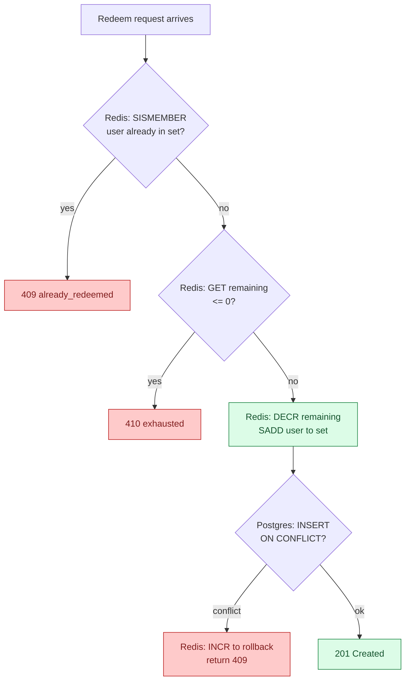

> **Take this with you.** The per-user check lives in Redis (fast path) and Postgres (backstop). Neither alone is sufficient.

---

## Decision 3: how do we stop brute-force and namespace scraping?

Two things happen on launch day.

**Scenario A.** A script fires 50 redeem attempts per second from one account, guessing codes: `SAVE01`, `SAVE02`, `SAVE03`. Most fail. Some hit. You see thousands of failed attempts per minute.

**Scenario B.** Marketing mails `BLACKFRI100` at 9 a.m. By 9:05 it appears on a deal forum. Random people redeem it. All 1,000 slots vanish in 30 seconds. The intended newsletter audience never had a chance.


The Bloom filter is the key move against namespace scraping. Every issued code is added to an in-process Bloom filter (about 300 MB for 200 million codes at 0.1% false-positive rate). If the submitted code is not in the filter, return 404 immediately. No database hit. Brute-force load never reaches the real store.

<details markdown="1">
<summary><b>Show: defenses for both scenarios</b></summary>

**Brute force (Scenario A).**

Per-user rate limiting is the cheapest big win. Authenticated users get 10 validate attempts per minute and 5 redeem attempts per minute. Token bucket in Redis. Return 429 with `Retry-After` after the cap.

After 5 failures from the same user, double the cooldown. After 10, ban for an hour.

The Bloom filter then handles the load that rate limits do not catch: low-frequency probing from many accounts. False-positive rate at 0.1% means 99.9% of bogus codes return 404 in microseconds.

**Leaked code (Scenario B).**

Once a shared code leaks, you cannot undo it. You can mitigate.

Audience filter at validate time: the code carries an `audience_filter` (must be a newsletter subscriber as of date X). Validate fails if the user does not match. Forum readers share the code, but most cannot use it.

Even better: mail unique per-user codes rather than one shared code. One leaked code burns one slot, not all 1,000.

Velocity-based auto-pause: if a campaign sees a 100x spike in redeem attempts over the trailing baseline in one minute, auto-pause and alert. Marketing reviews before all slots are gone.

</details>

> **Take this with you.** The Bloom filter handles guessing. The audience filter handles leaking. Per-user rate limits handle both. Defense is layered.

---

## Decision 4: how do we handle three different code patterns with one engine?

Marketing has three different ways to hand out discounts.

| Pattern | Example | How it works | Leak blast radius |
|---------|---------|--------------|-------------------|
| Generic shared | `SAVE10` | One code, counter on campaign | High: one leak burns all slots |
| Unique per-user | `UID-7A2F-9B3C` | One row per (campaign, user) | Low: one leak burns one slot |
| Pre-generated pool | `BLACKFRI-AB7K` | Many codes, each used once | Medium: one leak burns one slot |

The same claim engine handles all three. The campaign `type` field is the switch.

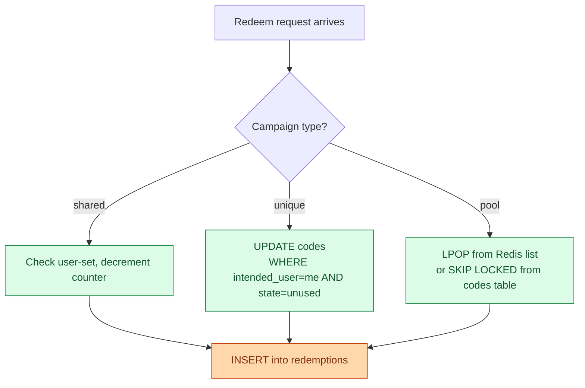

<details markdown="1">
<summary><b>Show: pool claim with SKIP LOCKED</b></summary>

For low-traffic campaigns, the pool claim can skip Redis and use Postgres directly.

```sql
WITH next_code AS (
  SELECT code_id FROM codes
  WHERE campaign_id = $campaign_id AND state = 'unused'
  ORDER BY code_id
  FOR UPDATE SKIP LOCKED
  LIMIT 1
)
UPDATE codes c
SET state = 'used', claimed_by = $user_id, claimed_at = NOW()
FROM next_code nc
WHERE c.code_id = nc.code_id
RETURNING c.code_id, c.code;
```

`FOR UPDATE SKIP LOCKED` tells a concurrent transaction: if this row is already locked, skip it and try the next one. Ten parallel transactions each pick a different unused row. The 1,001st finds zero unused rows and returns nothing. Throughput is a few hundred claims per second. For bursts above that, pre-load the code strings into a Redis list and use `LPOP`.

</details>

> **Take this with you.** One API, three patterns. The campaign `type` field decides the internal claim path. Callers do not need to know which one runs.

---

## The full architecture

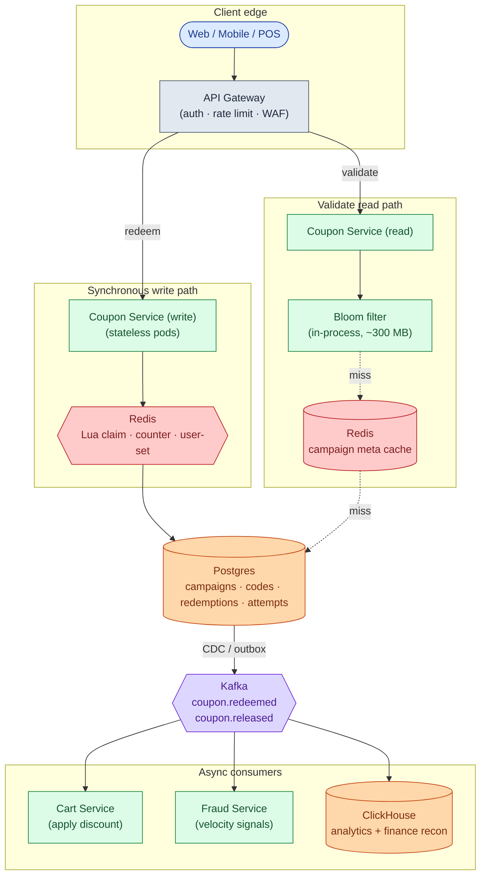

Each component in one line:

| Component | Purpose |
|-----------|---------|
| API Gateway | Auth, per-user and per-IP rate limits, WAF. |
| Coupon Service (write) | Runs the Lua claim, writes to Postgres, emits via outbox. Stateless. |
| Coupon Service (read) | Validates codes. Bloom filter first, then Redis cache, then Postgres. |
| Bloom filter | In-process. Rejects bogus codes in microseconds. |
| Redis (claim) | Counter and user-set for hot campaigns. Lua script is the burst path. |
| Redis (cache) | Campaign metadata for validate reads. 60s TTL. |
| Postgres | Source of truth. The unique index is the correctness guarantee. |
| Kafka | Carries events to cart, fraud, and analytics. None of these block checkout. |

---

## Walk: a redeem, end to end

Alice submits `BLACKFRI100` during the launch burst.

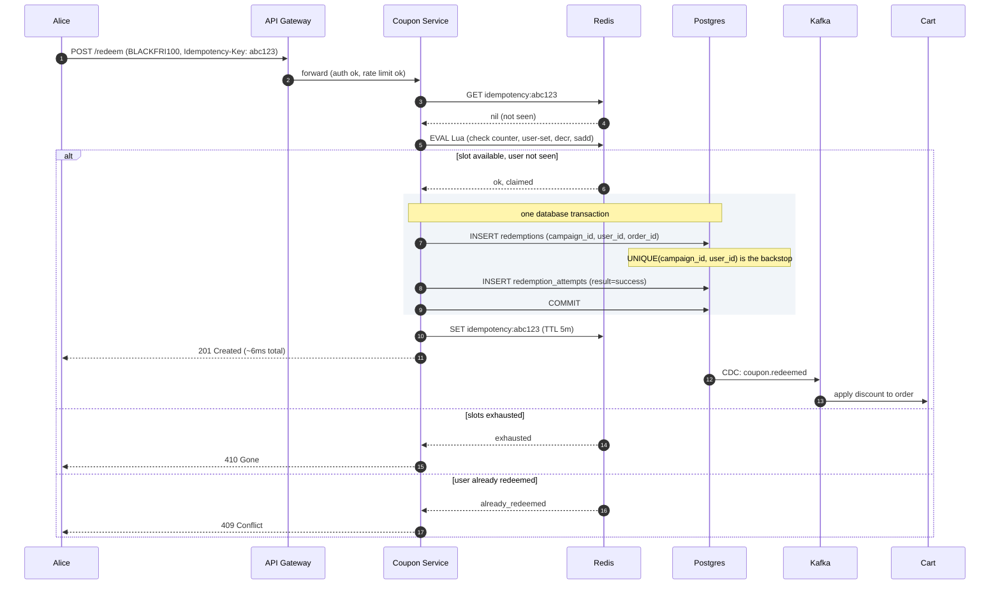

Three things to notice:

1. The Redis Lua runs before Postgres. It serializes 10,000 concurrent requests on one CPU core at sub-millisecond speed.
2. The Postgres write is synchronous, before returning success. If the service crashes after Redis claimed but before Postgres recorded, the retry hits the same `Idempotency-Key` and gets the cached response.
3. Cart, fraud, and analytics are downstream of Kafka. A cart outage does not block checkout.

---

## The hard sub-problem: what happens when Redis and Postgres drift?

Redis decremented the counter. The service crashed before writing to Postgres. On restart, Redis is at 999 remaining. Postgres has 0 redemptions for this campaign. They are out of sync.

This is not a theoretical edge case. Network blips, pod restarts, and OOM kills happen. The design must handle drift without losing correctness.

The recovery path:

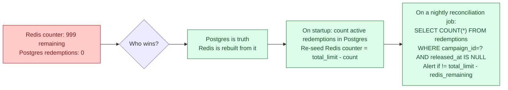

The rule: Postgres is always authoritative. Redis is a fast path that can be rebuilt. If the two ever disagree, Postgres wins and Redis is reseeded.

The design makes this safe: the Postgres `UNIQUE` index prevents double-claims even if a user races through a reseeded counter. A Redis counter drift of +5 (Redis thinks there are 5 more slots than there really are) can result in at most 5 over-claims, each of which will be caught at the database insert by the unique constraint on `(campaign_id, user_id)`.

> **Take this with you.** Redis drift is detectable and recoverable because Postgres is the ground truth. Design so that any Redis state can be rebuilt from the database.

---

## Follow-up questions

Try answering each in 2 or 3 sentences before opening the solution.

1. **Network failed mid-redeem.** Alice submits `BLACKFRI100`. The request times out after Redis decremented the counter but before Postgres recorded the redemption. She retries. What does your system do?

2. **The cap got blown.** The campaign has 1,000 slots. After launch, 1,003 redemptions appear in Postgres. How did this happen? How do you detect it and prevent it?

3. **Stackable codes.** A cart has `SAVE10` (10% off) and `FREESHIP` (free shipping). The user adds `BLACKFRI100` (100% off). What does your validate endpoint return? Where does the stacking logic live?

4. **Refund flow.** An order with `BLACKFRI100` is refunded. Marketing wants the code released back into the pool so someone else can use it. Engineering hates this. What is the right answer?

5. **Expiration in the wrong time zone.** A code expires at "midnight on Dec 31." The user is in Tokyo. The code was issued in PST. What does the user see, and how do you avoid being yelled at on social media?

6. **Mass code update.** A campaign has 10 million per-user codes pre-generated. Marketing realizes the discount amount is wrong. They want to update all 10 million without invalidating already-redeemed ones. Can you?

7. **Multi-region.** Your site has US and EU regions. A US-issued code is redeemed against the EU site. How do you guarantee single-use across regions?

8. **Bloom filter false negative.** Your Bloom filter says "code not present," but the code actually exists. Bloom filters do not have false negatives. Explain why, and what error they do have, and how that affects this design.

9. **The last slot race.** Reusable code `SAVE10` has been used 9,999 times. The limit is 10,000. Twenty users hit redeem at the same instant. How do you give it to exactly one of them and tell the other nineteen "limit reached"?

10. **Unused expired code.** A code was mailed to a user but they never redeemed it before expiry. After expiry, can you reuse that code string for a new campaign? Why or why not?

---

## Related problems

- **[Approval Management (011)](../011-approval-management/question.md).** The audit trail, immutable record-keeping, and state machine patterns apply directly to the redemption log here.
- **[Shopping Cart (012)](../012-shopping-cart/question.md).** The cart consumes `coupon.redeemed` events and applies discounts. Cart idempotency is the other side of redemption idempotency.
- **[Rate Limiter (004)](../004-rate-limiter/question.md).** The per-user and per-IP rate limits in Decision 3 use these algorithms. Pick one with intent.
- **[Distributed Cache (009)](../009-distributed-cache/question.md).** The Redis layer here is the same caching layer. Understand its eviction and replication story before depending on it for hot-burst correctness.


<div class="pr-solution-divider"></div>


## Solution: Coupon Code Redemption System

### What this system is

A coupon redemption system is a small write-light service with one hard problem: surviving a launch burst where 10,000 users hit the same code in the same second and exactly 1,000 of them must win. Everything else is plumbing.

The design has two layers. Postgres is the source of truth; a unique index on `(campaign_id, user_id)` makes double-redemption impossible at the storage level. Redis with a Lua script handles the hot-burst claim so the database is not asked to serialize 10,000 transactions on one row.

Three code patterns share one schema: generic shared codes (`SAVE20`), unique per-user codes (`UID-XXXX`), and pre-generated pools (`BLACKFRI-XXXX`). All three use the same redeem API. A Bloom filter in front of the read path stops brute-force traffic from reaching the database. Rate limits stop the same user from grinding the namespace.

The interesting engineering lives at three edges: making the launch burst correct without a database stampede, defining what "release the code on refund" means without creating a new race, and keeping an audit trail finance can use years later.

---

### 1. The two questions that matter most

**Single-use or reusable, and which code pattern?** Single-use is one row, one redeem, done. Reusable means a counter and a per-user dedup check. If you assume one pattern and the interviewer wanted all three, you redesign mid-interview.

**What is the expected burst size?** Without this, you cannot decide whether the Postgres-only path is enough or whether you need Redis Lua. The architecture changes at around 100 claims per second on one campaign.

Everything else (stacking, expiration, refund, abuse) follows from those two.

---

### 2. The math

| Scale | Redeem QPS | Validate QPS | Storage |
|-------|-----------|--------------|---------|
| Steady state | ~0.6 (peak ~5) | ~3 (peak ~25) | 50 GB total |
| Launch burst | **10,000 in 1 second** | 50,000 in 1 second | ~100 KB hot |

The launch burst is the design pressure. The 9,000 losers all need a fast "sold out" response, not a timeout. Storage barely registers: 200 million codes x 200 bytes is about 40 GB. Add 9 GB of redemption log over 5 years. One Postgres instance handles it.

The system is small. The architecture exists for burst correctness and abuse resistance, not throughput or storage.

---

### 3. The API

Validate and redeem are separate endpoints. Validate is read-only and cheap. Redeem is the atomic act.

```
POST /api/v1/coupons/validate
Authorization: Bearer <token>

{
  "code": "BLACKFRI100",
  "cart_id": "cart_abc",
  "subtotal": 120000
}
```

| Status | Meaning |
|--------|---------|
| **200** | `{"valid": true, "discount": {...}, "expires_at": "..."}` |
| **404** | Unknown code (also returned for unauthenticated audience-mismatch) |
| **410** | Expired or fully exhausted |
| **403** | Authenticated user not in the code's audience |
| **429** | Rate limited |

```
POST /api/v1/coupons/redeem
Authorization: Bearer <token>
Idempotency-Key: <uuid>

{
  "code": "BLACKFRI100",
  "order_id": "ord_xyz",
  "user_id": "usr_42"
}
```

| Status | Meaning |
|--------|---------|
| **201** | Redemption succeeded |
| **200** | Idempotent retry (same Idempotency-Key seen before) |
| **409** | User already redeemed this code |
| **410** | Code exhausted or expired |
| **403** | Audience mismatch |

Load-bearing choices:

| Choice | Reason |
|--------|--------|
| `Idempotency-Key` required on redeem | Network retries at burst are guaranteed. Without the key, the same user's retry can consume two codes. |
| `order_id` ties redemption to order | Needed for refund/release and finance reconciliation. |
| Validate returns 404 for unauthenticated audience mismatches | Prevents scraping the namespace to discover "which codes exist." |

---

### 4. The data model

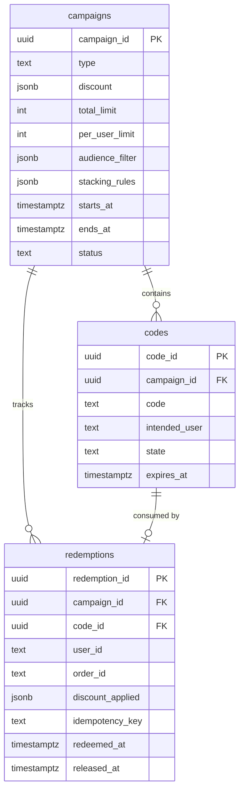

<details markdown="1">
<summary><b>Show: the full SQL</b></summary>

```sql
CREATE TABLE campaigns (
    campaign_id      UUID PRIMARY KEY,
    name             TEXT UNIQUE NOT NULL,
    type             TEXT NOT NULL,
    discount         JSONB NOT NULL,
    total_limit      INT,
    per_user_limit   INT NOT NULL DEFAULT 1,
    audience_filter  JSONB,
    stacking_rules   JSONB,
    starts_at        TIMESTAMPTZ NOT NULL,
    ends_at          TIMESTAMPTZ NOT NULL,
    status           TEXT NOT NULL DEFAULT 'active'
);

CREATE TABLE codes (
    code_id          UUID PRIMARY KEY,
    campaign_id      UUID NOT NULL REFERENCES campaigns,
    code             TEXT NOT NULL,
    intended_user    TEXT,
    state            TEXT NOT NULL DEFAULT 'unused',
    claimed_by       TEXT,
    claimed_at       TIMESTAMPTZ,
    expires_at       TIMESTAMPTZ
);
CREATE UNIQUE INDEX idx_codes_code ON codes (code);
CREATE INDEX idx_codes_pool ON codes (campaign_id, state) WHERE state = 'unused';

CREATE TABLE redemptions (
    redemption_id    UUID PRIMARY KEY,
    campaign_id      UUID NOT NULL REFERENCES campaigns,
    code_id          UUID REFERENCES codes,
    user_id          TEXT NOT NULL,
    order_id         TEXT NOT NULL,
    discount_applied JSONB NOT NULL,
    idempotency_key  TEXT NOT NULL,
    redeemed_at      TIMESTAMPTZ NOT NULL DEFAULT NOW(),
    released_at      TIMESTAMPTZ,
    released_reason  TEXT
);
CREATE UNIQUE INDEX idx_redemption_once
    ON redemptions (campaign_id, user_id) WHERE released_at IS NULL;
CREATE UNIQUE INDEX idx_redemption_idempotency ON redemptions (idempotency_key);
CREATE INDEX idx_redemption_order ON redemptions (order_id);

CREATE TABLE redemption_attempts (
    attempt_id    BIGSERIAL PRIMARY KEY,
    code          TEXT NOT NULL,
    user_id       TEXT,
    ip            INET,
    result        TEXT NOT NULL,
    attempted_at  TIMESTAMPTZ NOT NULL DEFAULT NOW()
);
CREATE INDEX idx_attempts_user ON redemption_attempts (user_id, attempted_at DESC);
CREATE INDEX idx_attempts_ip ON redemption_attempts (ip, attempted_at DESC);
```

</details>

Three things doing real work:

**`UNIQUE(campaign_id, user_id) WHERE released_at IS NULL`.** Two browser tabs racing each other. The database serializes them. First insert wins. Second fails with a unique-violation. The API returns 409. This is the safety net behind whatever Redis says.

**`discount_applied` is a snapshot.** The discount as it was at redeem time, frozen. Marketing can change the campaign's discount later. Already-redeemed orders are unaffected. Finance audit is accurate.

**`redemption_attempts` logs everything, including failures.** Required for fraud signals. At production scale, partition it monthly.

---

### 5. The core algorithm: the atomic claim

Two paths, picked by campaign expected QPS.

**Low-traffic path: Postgres only.**

```sql
BEGIN;

WITH next_code AS (
  SELECT code_id FROM codes
  WHERE campaign_id = $campaign_id AND state = 'unused'
  ORDER BY code_id
  FOR UPDATE SKIP LOCKED
  LIMIT 1
)
UPDATE codes c
SET state = 'used', claimed_by = $user_id, claimed_at = NOW()
FROM next_code nc
WHERE c.code_id = nc.code_id
RETURNING c.code_id, c.code;

INSERT INTO redemptions (redemption_id, campaign_id, code_id, user_id, order_id,
                         discount_applied, idempotency_key)
VALUES (...)
ON CONFLICT (campaign_id, user_id) WHERE released_at IS NULL DO NOTHING
RETURNING redemption_id;

COMMIT;
```

`FOR UPDATE SKIP LOCKED` lets concurrent transactions each pick a different unused row instead of queuing on one. Throughput: a few hundred claims per second on one Postgres, which is fine for any campaign below about 100 QPS.

**High-traffic path: Redis Lua + Postgres.**

```lua
-- KEYS[1] = "campaign:{cid}:remaining"
-- KEYS[2] = "campaign:{cid}:users"
-- KEYS[3] = "campaign:{cid}:pool"  (Redis list, pool type only)
-- ARGV[1] = user_id
-- ARGV[2] = campaign_type

local remaining = tonumber(redis.call('GET', KEYS[1]))
if remaining == nil then
  return {'err', 'unknown_campaign'}
end
if remaining <= 0 then
  return {'err', 'exhausted'}
end
local already = redis.call('SISMEMBER', KEYS[2], ARGV[1])
if already == 1 then
  return {'err', 'already_redeemed'}
end
local claimed_code = nil
if ARGV[2] == 'pool' then
  claimed_code = redis.call('LPOP', KEYS[3])
  if claimed_code == false then
    return {'err', 'exhausted'}
  end
end
redis.call('DECR', KEYS[1])
redis.call('SADD', KEYS[2], ARGV[1])
return {'ok', claimed_code}
```

Latency under 1 ms. Redis is single-threaded, so 10,000 concurrent requests serialize on one CPU core. After Redis returns OK, the service writes to Postgres synchronously (about 5 ms). Total redeem latency: about 6 ms. The Postgres `ON CONFLICT` clause is the backstop if Redis hiccups.

Which path to use:

| Campaign expected QPS | Approach |
|----------------------|----------|
| < 100 | Postgres only |
| 100 to 10,000 | Redis Lua + Postgres backstop |
| > 10,000 | Redis Lua + sharded Redis (counter and user-set by `hash(user_id)`) |

In practice, run all campaigns through Redis. The cost for a low-traffic campaign is negligible. The code path is uniform.

**The Bloom filter prefilter.**

```python
def validate(code):
    if not bloom_filter.maybe_contains(code):
        return 404
    # continues to Redis / DB
```

Bloom filters never have false negatives. If the filter says "not present," the code was definitely never issued. They have a tunable false-positive rate. At 0.1%, 99.9% of brute-force attempts on bogus codes are cut off before touching the database. Memory footprint at 200 million codes: about 300 MB in process memory. Fits easily in each pod.

---

### 6. The architecture


Five things to notice:

- The write path touches Redis and Postgres synchronously. Nothing else. Kafka, cart, fraud, and analytics are downstream of CDC. Cart down does not block checkout.
- The Bloom filter lives in process memory, not Redis. Process memory is faster and cheaper for this use case.
- The Postgres unique index is the ground truth. Every other layer can lose data and the system recovers from the database. If the unique index breaks, you have a correctness bug.
- Coupon Service pods are stateless. The Bloom filter is rebuilt on startup from an S3 snapshot plus a tail of `campaign_created` events.
- Reads (validate) and writes (redeem) scale independently. The read service can be replicated freely since it is read-only.

---

### 7. A redeem, traced

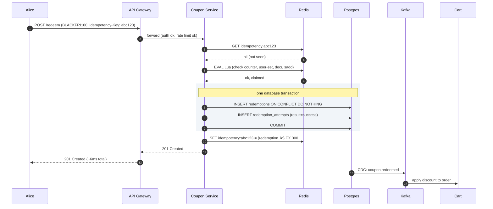

Target latencies:

| Operation | P99 |
|-----------|-----|
| Validate (cache hit) | ~5 ms |
| Validate (cache miss) | ~50 ms |
| Redeem (burst) | ~50 ms (Redis 1 ms + Postgres 5-10 ms + network) |

---

### 8. The scaling journey: 10 users to 1 million

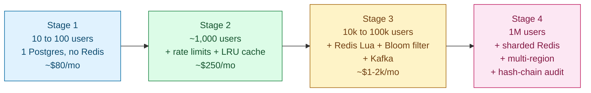

**Stage 1: 10 to 100 users.** One Postgres, one app pod. Three tables with the unique index. Validate and redeem are straight database calls. No Redis, no Kafka. About $80/month. The unique index alone is the correctness story.

**Stage 2: 1,000 users.** A user shares a code on a forum. 200 anonymous attempts hit in 5 minutes. Database CPU spikes. Add per-user rate limiting (token bucket in Redis) and per-IP rate limiting for unauthenticated traffic. A cart bug caused some users to submit redeem twice. Add `ON CONFLICT DO NOTHING` handling and return 409. Require `Idempotency-Key` on redeem. About $250/month.

**Stage 3: 10,000 to 100,000 users.** A flash sale: 2,000 codes, 5,000 users at noon. Postgres CPU pegged for 30 seconds under hot row contention. Most requests timed out. A brute-force script fired 5,000 bogus attempts per second from rotating IPs. Fix: Redis Lua for hot campaigns, Bloom filter in process (bogus codes return 404 in microseconds), pool codes pre-loaded into a Redis list, Kafka for async consumers. About $1-2k/month.

**Stage 4: 1 million users.** The hottest Black Friday campaign saturated one Redis core at 50k QPS. EU operations launched and codes need single-use guarantees across regions. Fix: sharded Redis for ultra-hot campaigns (counter and user-set partitioned by `hash(user_id)` across N nodes), per-region code ownership with cross-region routing via authenticated API, audit hash chain on the redemptions table for SOX compliance. About $10-30k/month.

The core insight carries through all four stages: Postgres unique index as safety net, Redis Lua as burst path, Bloom filter as brute-force shield.

---

### 9. The three code patterns

| Pattern | Claim operation | Leak blast radius | Best for |
|---------|----------------|-------------------|---------|
| **Generic shared** | Lua DECR + unique index | High (one code = all slots) | Public promos with loose audience |
| **Unique per-user** | UPDATE WHERE state='unused' | Low (one code = one slot) | Newsletter rewards, referrals |
| **Pre-generated pool** | LPOP from Redis list | Medium (one code = one slot) | Flash sales with meaningful code artifacts |

One engine, three patterns, no special API routes. The campaign `type` field switches the internal claim logic.

---

### 10. Reliability

**Redis dies mid-redemption.** Lua returned OK and decremented the counter. The service crashed before the Postgres write. Redis later lost state in a failover.

Three things keep this safe:

1. Synchronous Postgres write before returning success. This is why we accept the 5-10 ms cost.
2. The unique index as ground truth. If Redis is rebuilt, the rebuild queries Postgres for the current redeemed count and reseeds the counter and user-set.
3. A nightly reconciliation job: `SELECT COUNT(*) FROM redemptions WHERE campaign_id=? AND released_at IS NULL` vs Redis counter. Alert on any drift.

**Payment fails after redemption.** Two policies, picked at campaign creation:

- Default (`release_on_failure = false`): the redemption stands. The user lost their slot. Simpler and avoids the release race.
- Opt-in (`release_on_failure = true`): set `released_at` on the redemption, push the code back to the Redis list, increment the Redis counter. Each step is idempotent.

The senior position: default to no release. Release introduces a parallel race where someone else claims the slot while the original user is debugging payment. For high-value campaigns where customer goodwill matters, opt in knowingly.

**Kafka is down.** Redemptions succeed in Postgres but the cart does not receive the event. The cart polls the coupon service for redemptions tied to active carts as a fallback. Or the user re-applies the code in the cart UI (validate returns `{"valid": true, "already_redeemed_for_this_order": true}` with the discount). A Kafka outage must not block checkout.

---

### 11. Observability

| Metric | Why it matters |
|--------|----------------|
| `redeem.latency` p50/p95/p99 | The headline SLO. Alert if p99 > 200 ms at burst. |
| `redeem.result.distribution` | success / exhausted / already_redeemed / audience_mismatch. Drift signals UX bugs. |
| `redeem.attempts.rate` per campaign | 100x spike triggers velocity pause. |
| `validate.cache_hit_rate` | Should be > 90%. Below means the cache is too small. |
| `bloom_filter.false_positive_rate` | Spikes indicate scraper traffic bypassing the filter. |
| `redis.counter.drift_vs_db` | Computed nightly. Non-zero is a Redis incident or a bug. |
| `rate_limit.triggered.count` | Top offenders dashboard for the security team. |
| `kafka.lag.coupon_redeemed` | Cart applies discounts with this lag. Alert at > 30 s. |

Page on: redeem error rate > 5% for 5 min. Redis-Postgres drift > 100. Bloom filter rebuild stuck.

Ticket on: validate cache hit rate < 80%. Rate limit triggers > 10x daily baseline.

---

### 12. Follow-up answers

**1. Redis decremented but Postgres did not record. User retries.**

The `Idempotency-Key` in Redis (5-minute TTL) catches it. The retry's key matches. The cached response is returned. The user sees success without a second database write.

If the idempotency cache also lost the entry (Redis failover), the retry hits the Lua script again. The user is already in the user-set, so the script returns `already_redeemed`. The service looks up the original `redemption_id` in Postgres and returns it. Idempotent.

The one bad case: the idempotency cache is lost AND Postgres also lost the row (should not happen with a healthy database). Then the user redeems a second time. Mitigation: write to Postgres synchronously before returning success.

**2. 1,000 codes in the campaign. 1,003 in Postgres after launch.**

Three possible causes. One: the release-on-refund flow released 3 codes and they were re-claimed. Not an overcount: `WHERE released_at IS NULL` gives exactly 1,000 active redemptions. Two: the partial unique index was missing (`WHERE released_at IS NULL` omitted), allowing two active rows per user. Three: Redis and Postgres drifted because Postgres writes failed silently while Redis kept running.

Detection: nightly reconciliation comparing the index-constrained count vs Redis counter. Alert on any drift. Prevention: synchronous Postgres write before success. The unique index as backstop.

**3. Stacking `SAVE10` + `FREESHIP` + `BLACKFRI100`.**

Each campaign has `stacking_rules`: `{"excludes": ["BLACKFRI*"]}`. Validate is told what other coupons are in the cart. It evaluates the stacking rules for the incoming code against the cart's existing codes. If `BLACKFRI100` excludes `SAVE10`, validate returns `{"valid": false, "reason": "not_stackable_with_SAVE10"}`.

The coupon service owns stacking rules. The cart owns the final discount calculation (additive vs multiplicative, capped at 100%). Business decision per campaign.

**4. Refund releases the code, or not?**

Per-campaign policy. Default: no release. Refund the money. The discount is gone. If the customer is high-value, support manually issues a courtesy code from a separate budget. This avoids the release race entirely.

If release is on: set `released_at` on the redemption (the partial unique index makes the user free to redeem again). For pool codes, set the code row back to `unused` and push it to the Redis list. For shared counters, `INCR` the Redis counter. Each step is idempotent but the parallel race is real: someone else can claim within milliseconds of the release.

**5. Expiration in the wrong timezone.**

Store `expires_at` as a UTC timestamp. Compare against UTC `NOW()`.

For UI: render in the user's local timezone as a relative duration ("Expires in 3 hours") rather than an absolute timestamp. When marketing says "midnight Dec 31," require a timezone selector on the campaign creation form. Default to the company's HQ timezone, never assume.

**6. Mass-update 10M codes without invalidating already-redeemed ones.**

The `discount_applied` snapshot in each redemption row is immutable. Updating the campaign's `discount` field does not touch past redemptions. The cart uses the snapshot, not the live campaign discount.

For unredeemed codes, the campaign update takes effect on next redeem. The `codes` table does not store the discount per code. It joins to the campaign. Code path: `UPDATE campaigns SET discount=? WHERE campaign_id=?`. One row. Broadcast a cache-invalidation event to all pods to drop the cached campaign metadata.

**7. Multi-region single-use guarantee.**

Each code is owned by exactly one region at creation. The owning region's Postgres holds the authoritative unique index. A redemption on the wrong region routes to the owning region via authenticated cross-region API. The owning region runs the Lua claim and Postgres write. Latency cost: about 100 ms. Acceptable for the rare cross-region case, which is typically < 1% of traffic.

Alternative: strongly-consistent multi-region database (Spanner, DynamoDB Global Tables). Higher cost, simpler model. Worth it only if cross-region redemptions exceed about 10% of traffic.

**8. Bloom filter has no false negatives.**

Correct. A Bloom filter never says "definitely not present" for something that was inserted. If a code was added to the filter, the filter always reports "maybe present."

What Bloom filters have is false positives: occasionally saying "maybe present" for a code never inserted. This is fine here. A false positive sends the request through to the cache and database, which correctly return 404. At 0.1% false-positive rate and 5,000 brute-force attempts per second, about 5 fall through to the database. Trivial.

**9. `SAVE10` has 9,999 of 10,000 uses. Twenty users hit redeem simultaneously.**

The Lua script handles this. Redis is single-threaded, so the 20 requests serialize. The first sees `remaining = 1`, decrements to 0, returns OK. The other 19 see `remaining = 0` and return `exhausted` (410). The one winner's Postgres insert proceeds normally. The 19 losers get 410 immediately, without waiting for the winner to finish.

**10. Unused expired code. Can you reuse the code string?**

No. Codes are append-only forever, even after expiry. The unique index on the code string is permanent. Reusing the string requires deleting the expired row, which loses audit history. A user may have the code bookmarked. Reusing the string for a new campaign creates confusion ("why does my code from last year apply a different discount?"). An attempt on an expired code is also a useful fraud signal.

Design the code namespace to be effectively infinite. 10 characters of base32 is about 10^15 codes. Mint a new string for each campaign.

---

### 13. Trade-offs worth saying out loud

**Why Postgres unique index and Redis Lua, not just one.** The unique index alone melts under 10k QPS on one row. Redis Lua alone loses correctness if Redis drops state. Together: fast hot path with a strong safety net.

**Why a Bloom filter instead of a Redis SET membership check.** Bloom filter is in-process, sub-microsecond, fixed memory (about 300 MB for 200 million codes). A Redis `SISMEMBER` is a network round-trip (1 ms) and grows linearly. At 200 million codes, the SET is about 4 GB in Redis. Bloom wins on cost and latency.

**Why an immutable redemptions log instead of just current state.** Finance auditors, fraud investigators, and refund workflows all need the history. Mutating in place destroys traceability. The `discount_applied` snapshot is the only way to answer "what discount did this customer actually get on that order in Q3?"

**Why not default to releasing codes on refund.** The release creates a parallel race. Someone else can claim the released slot within milliseconds. The cleaner answer is to not release and issue a courtesy code manually for high-value cases.

---

### 14. Common mistakes

**Diving straight into a `coupons` table without thinking about concurrency.** If your first sentence is "we'll have a `times_used` column," you have missed the point. The interviewer will steer you to the race condition. Arrive there first.

**Using Redis without a Postgres backstop.** Redis can lose state. If you describe Redis as the source of truth and shrug at failure modes, you fail the senior bar.

**Forgetting the per-user uniqueness check.** Some candidates atomic-claim the campaign counter and forget the same user can race themselves with two browser tabs. The `UNIQUE(campaign_id, user_id)` index is non-optional.

**No idempotency on redeem.** Without `Idempotency-Key`, every network retry burns a slot. At burst with flaky networks, this is catastrophic.

**Conflating validate and redeem.** A POST that always consumes is a UX disaster (no discount preview before checkout). A GET that consumes violates HTTP semantics and breaks browser pre-fetch. Two endpoints, clear separation.

**Ignoring brute-force.** Coupon namespaces get scraped. Without rate limiting and the Bloom filter, an attacker enumerates the namespace in hours.

**Hand-waving release-on-refund.** "Yeah, we'll just put it back" without naming the parallel race is a weak answer. Say explicitly whether you release, why, and what the race looks like if you do.

**No discount snapshot in the redemption row.** Marketing can retroactively change campaign discounts. Without the snapshot, past orders get the wrong discount amount in finance reconciliation.

**Designing for steady-state write throughput.** Even at 1 million users, sustained QPS is single digits. The design pressure is the launch burst. Candidates who size for "millions of writes per second" have misread the problem.

The launch-burst correctness story is what separates strong candidates from generic "design a CRUD app" answers. The two most common drop-points: the per-user race issue, and the importance of the Postgres backstop behind the Redis hot path.

