
## What we are building

A comment system lets users post text replies on a piece of content, reply to each other in threads, and vote replies up or down. Think Reddit or YouTube comments. An article gets 50 top-level comments. Each comment can have replies, and those replies can have replies, up to 8 levels deep. The top comment on a viral post might receive 1,000 upvotes in 5 seconds. A moderator needs to hide a spam comment within seconds of it being flagged, not minutes.

That sounds like a CRUD app. It is not. There are five real problems hiding in this product:

1. **Threading model.** Storing a tree so you can fetch 800 nested comments in one query instead of 800 recursive database calls.
2. **Vote hot-row.** 1,000 concurrent `UPDATE score = score + 1` calls against one database row will serialize behind a lock and melt the database.
3. **Soft delete with structure.** Deleting a comment that has 200 replies must not orphan those replies. The tree must stay intact.
4. **Ranking.** Showing comments in "hot" order requires a score that decays with time. Sorting by raw vote count lets old viral comments dominate forever.
5. **Moderation at scale.** A human cannot review every comment. A confidence-routed pipeline (fast pre-check, async ML classifier, human queue) is the only way to keep spam out without blocking every post.

---

## The lifecycle of one comment

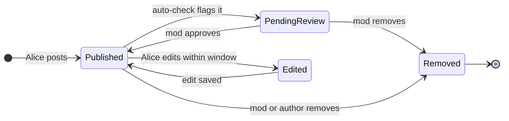

A comment spends nearly all its life in `Published`. The moderation transitions happen rarely but must be fast when they do. Everything else (threading, voting, ranking) exists to make the read path work at scale.

> **Take this with you.** A comment system is a state machine for small text objects, run millions of times, with a 1,000:1 read-to-write ratio. The architecture is built around the read path, not the write path.

---

## How big this gets

The same product lives at two very different scales.

| Input | Small blog | Viral site |
|-------|-----------|------------|
| Comments per day | 100 | 1,000,000 |
| Writes per second (steady) | ~0.001 | ~12 |
| Writes per second (peak) | ~0.01 | ~50 |
| Reads per second (peak) | ~1 | ~40,000 |
| Storage per year | ~7 MB | ~250 GB |

<details markdown="1">
<summary><b>Show: how the numbers come out</b></summary>

**Small blog:**
- 100 comments/day at ~200 bytes each = about 7 MB per year. One laptop handles this.
- 1,000:1 read-to-write ratio means roughly 1 read per second.

**Viral site:**
- 1,000,000 / 86,400 = ~12 writes per second steady. Peak is 3-5x, so 40-60 writes/sec.
- At 1,000:1 read ratio: ~12,000 reads/sec steady, ~40,000 at peak.
- 1M comments/day × 365 × 300 bytes = ~110 GB/year for text. Add votes, flags, edit history: ~250 GB/year.

The number that matters most: the top 1% of articles get 80% of the traffic. In a viral moment, one article drives 1,000 votes per second on a single comment row. That hot row is the central scaling problem, not average write throughput.

</details>

> **Take this with you.** Steady-state writes are small. The architecture exists to handle 40,000 reads per second and the burst behavior of one viral comment hammering one database row.

---

## The smallest version that works

A blog with 10 articles and 100 comments a day needs three boxes and nothing else.

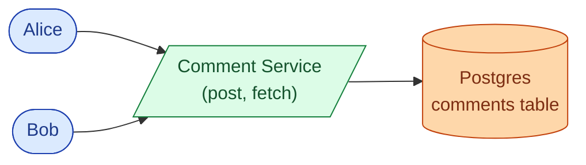

Two endpoints carry the entire product.

| Endpoint | What it does |
|----------|--------------|
| `POST /articles/{id}/comments` | Accept body and optional parent_id, insert row, return 201 |
| `GET /articles/{id}/comments` | Return the full comment tree in one response |

<details markdown="1">
<summary><b>Show: the one table</b></summary>

```sql
CREATE TABLE comments (
    comment_id  BIGINT PRIMARY KEY,
    article_id  BIGINT NOT NULL,
    parent_id   BIGINT,
    path        TEXT NOT NULL,          -- "/123/456/789"
    depth       INT NOT NULL,
    author_id   BIGINT,
    body        TEXT NOT NULL,
    score       INT NOT NULL DEFAULT 0,
    state       SMALLINT NOT NULL DEFAULT 1,
    created_at  TIMESTAMPTZ NOT NULL DEFAULT NOW()
);

CREATE INDEX idx_comments_article ON comments (article_id, created_at DESC);
CREATE INDEX idx_comments_path    ON comments (article_id, path text_pattern_ops);
```

Two columns do the heavy lifting. `parent_id` keeps inserts cheap. `path` makes a full subtree fetch a single index prefix scan instead of a recursive query. They cannot drift because `path` is computed from the parent's path at insert time.

</details>

This handles the blog. The interesting questions start as the product grows.

---

## Decision 1: how do we store the tree?

The blog grows. One article gets 800 comments. The page takes 4 seconds. The query is a `WITH RECURSIVE` that joins the table to itself at each nesting level: 8 levels = 8 self-joins.

Four approaches exist. Each trades insert cost against read cost.

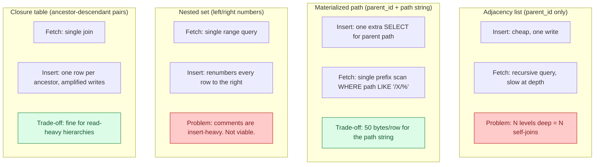

<details markdown="1">
<summary><b>Show: comparison table</b></summary>

| Approach | Insert | Fetch full thread | Fetch subtree | Extra storage |
|----------|--------|-------------------|---------------|---------------|
| Adjacency list | Cheap | Recursive query | Recursive | None |
| Materialized path | One extra read | Single prefix scan | Single prefix scan | ~50 bytes/row |
| Nested set | Very expensive | Single range | Single range | None |
| Closure table | Many writes | Single join | Single join | One row per ancestor pair |

Comments are insert-heavy. Nested sets are out. Closure tables amplify writes at scale. Adjacency list breaks at a few hundred comments per article.

The right answer: keep both `parent_id` and `path`. `parent_id` for writes. `path` for reads. 50 bytes per row is the cost; never running a recursive query on the hot read path is the payoff.

</details>

When Alice replies to a comment at `/123/456`, her path becomes `/123/456/789`. Fetching all descendants of comment 456 is:

```sql
SELECT * FROM comments
WHERE article_id = 42 AND path LIKE '/123/456/%'
ORDER BY path;
```

One index scan. No recursion. Pre-order traversal falls out of the ordering for free.

> **Take this with you.** `parent_id` for writes, `path` for reads. The 50-byte path string per row is the right trade. Never run a recursive query on the hot read path.

---

## Decision 2: how do we handle vote hot-rows?

A comment goes viral. 1,000 users upvote it in 5 seconds.

The naive path hits the same row 1,000 times:

```sql
UPDATE comments SET score = score + 1 WHERE comment_id = 42;
```

Every UPDATE takes a row-level lock. The 1,000 updates serialize. The database CPU spikes on one row. Every other comment on the same shard slows down.

The fix: Redis as a buffer between the click and the database.

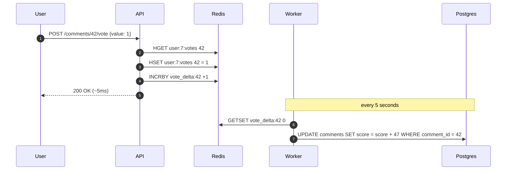

Three parts:

1. `INCRBY vote_delta:42 +1` is a memory operation. Returns in under 1ms.
2. `HSET user:7:votes 42 = 1` tracks the user's current vote. If they switch from down (-1) to up (+1), the delta is +2 not +1, without double-counting.
3. Every 5 seconds, the worker snapshots all `vote_delta:*` keys and writes one UPDATE per comment. 1,000 votes become one database write.

The hot row disappears. The trade-off: scores lag actual votes by up to 5 seconds. Most users do not notice.

> **Take this with you.** Vote counts, like counts, view counts: anything that aggregates writes to a single row uses this pattern. INCR in Redis, batch flush to the database.

---

## Decision 3: how do we moderate fast without blocking writes?

An ML toxicity classifier takes 100-500ms per comment. A link scanner takes another 200ms. If these run synchronously, Alice waits over half a second before her comment appears. That is not acceptable.

But if nothing runs on the write path, spam posts live unchecked until a human sees it.

The answer is a tiered pipeline:

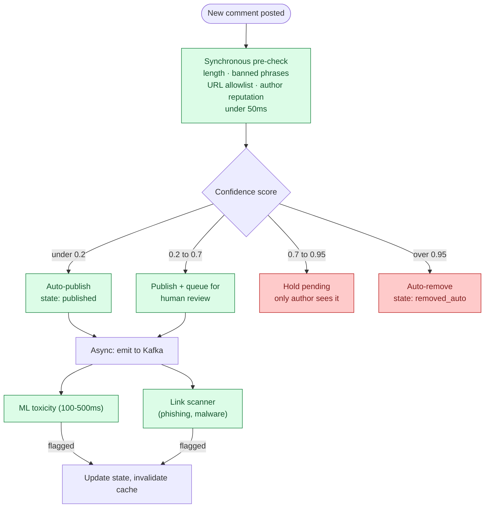

The synchronous pre-check runs cheap heuristics in under 50ms. Clear spam is rejected immediately. Obvious-good content is published immediately. The gray zone waits for the async ML classifier, which runs off Kafka after Alice has already seen "201 Created."

The confidence thresholds are tunable. Raise the 0.95 threshold to auto-remove more comments at the cost of more false positives.

**Shadow ban:** a spammer keeps creating accounts. Instead of banning and telling them, shadow-ban. Their comment looks published to them but is invisible to everyone else. The render logic checks: if the requesting user is the comment's author, show it regardless of state.

> **Take this with you.** Pre-publish review does not scale past a few hundred comments per day. Post-publish with fast async takedown is what every high-volume site uses. The synchronous pre-check catches the obvious cases in under 50ms.

---

## Decision 4: how do we paginate large threads?

A thread with 5,000 comments cannot go to the client all at once. Sending it all is ~1.5 MB of JSON plus the tree-assembly time on a cache miss.

Two separate pagination problems need solving:

1. How to page through top-level comments.
2. How to page through replies under one comment ("load more replies").

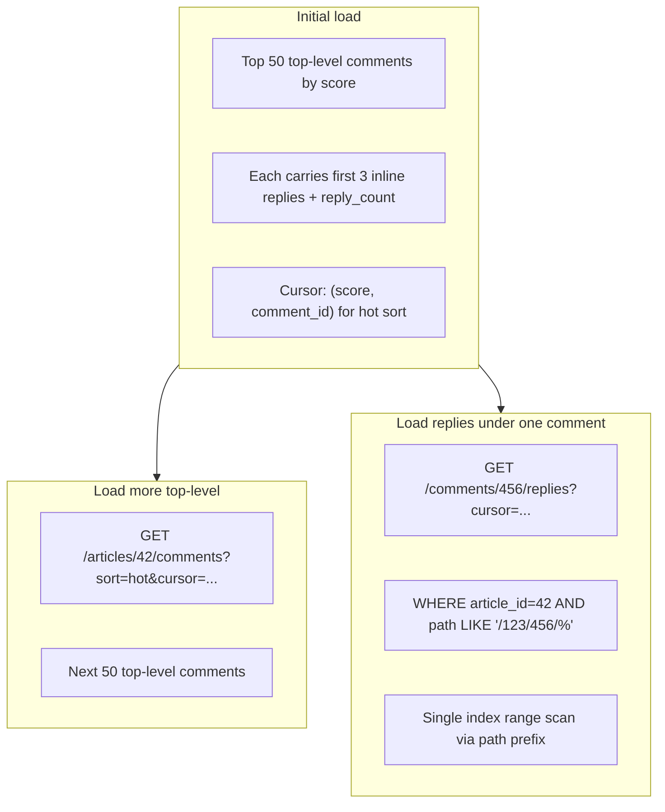

Cursor-based pagination, not offset. New comments posted while a user is scrolling would shift offset-based results. A cursor on `(score, comment_id)` is stable across inserts.

> **Take this with you.** The path prefix index that makes tree fetches fast is the same index that makes subtree pagination fast. These two features share one data structure.

---

## Decision 5: how do we rank comments?

Sorting by raw vote count lets old comments dominate forever. The first viral comment stays at the top. New comments cannot break in.

Reddit's "hot" formula applies a log scale to votes and adds a time component:

```
hot_score = sign(score) × log10(max(|score|, 1)) + seconds_since_epoch / 45000
```

Breaking it down:

| Factor | Effect |
|--------|--------|
| `log10(score)` | Diminishing returns: 10 votes = 1 unit, 100 votes = 2 units |
| `seconds / 45000` | ~12.5-hour half-life: a 12.5-hour-old comment needs 10x more votes to beat a fresh one |
| `sign` | Negative scores rank below zero |

The score is computed at read time for small threads. For large threads, pre-compute and store `hot_score` on the row. A background job re-runs the formula every few minutes as time decay changes the sort order even without new votes.

"Controversial" sort: `score = upvotes × downvotes / (upvotes + downvotes)^2`. Comments where both up and down votes are high bubble to the top.

> **Take this with you.** Any sort order that involves time decay requires periodic recomputation. A cached tree keyed by `(article_id, sort_order)` needs its own TTL tuned to how often the sort changes.

---

## The full architecture

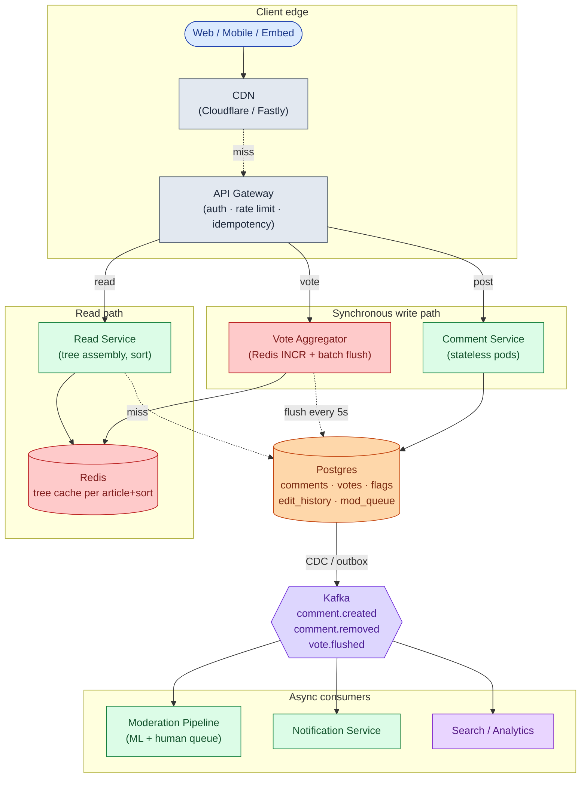

Each component in one line:

| Component | Purpose |
|-----------|---------|
| CDN | Caches rendered comment trees at the edge. Most reads stop here. |
| API Gateway | Auth, per-user rate limit, idempotency key dedup. |
| Comment Service | Validates, inserts, emits events. Stateless pods. |
| Vote Aggregator | Redis INCR per click, batch flush to Postgres every 5 seconds. |
| Read Service | Assembles tree, applies sort, fills Redis cache. Falls back to replica on miss. |
| Postgres | Source of truth. Comments, votes, flags, edit history, mod queue. |
| Kafka | Carries events to async consumers without touching the write path. |
| Moderation Pipeline | Async ML toxicity classifier, link scanner, human review queue. |

Notice what is not on the synchronous path: ML classification, notification delivery, search indexing. If the notification service is down at 3 a.m., comments still post.

---

## Walk: a comment, end to end

Alice replies to a comment on article 42.

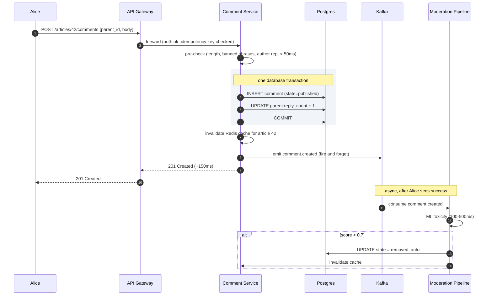

Three things to notice:

1. The INSERT and the `reply_count` increment are in one transaction. A crash rolls both back.
2. The ML classifier runs after Alice has already seen "201 Created." It does not block her.
3. If the classifier removes the comment, Alice sees the tombstone on her next page refresh. The write path never waited for moderation.

---

## The vote hot-row in depth

At 1,000 votes per second, even the 5-second batch flush produces a delta of 5,000 on one `UPDATE`. That single write still has to take a row lock.

The defense works in layers:

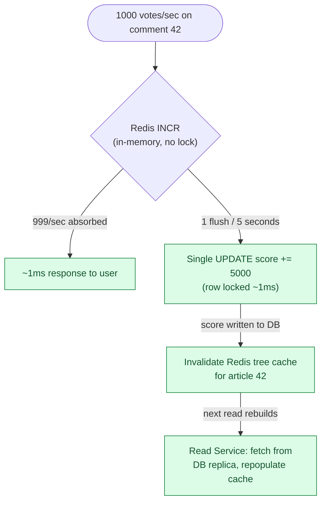

If Redis fails before a flush: score delta is lost. To prevent this, write votes to Kafka at the same time as Redis. The flush worker reads from Kafka instead of Redis. Kafka is the durable record. Redis is the fast counter.

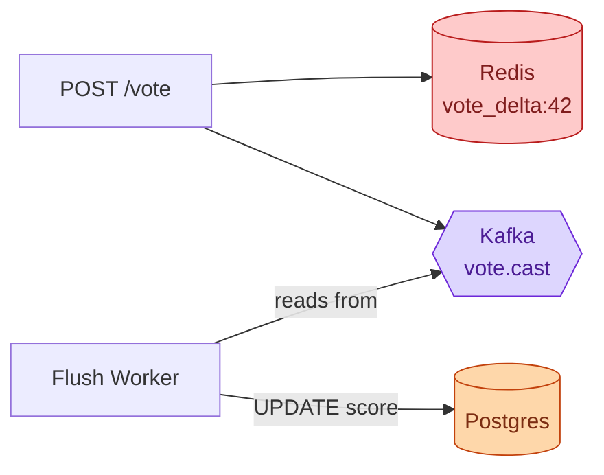

Redis gives you speed. Kafka gives you durability. Together: every vote is fast and nothing is lost if a Redis pod restarts.

> **Take this with you.** The hot-row pattern (INCR in Redis, batch flush to DB) appears everywhere: view counts, like counts, rating aggregates. Learn it once. The Kafka-backed variant adds durability at the cost of slightly more infrastructure.

---

## Follow-up questions

Try answering each in 2-4 sentences before opening the solution.

1. **Soft delete of a popular comment.** A comment with 200 replies is deleted by its author. What happens to the replies? Walk through the data and the UI.

2. **Spam burst.** A user posts 1,000 comments in 10 seconds via a script. Where does this get caught? How do you avoid blocking a legitimate user who posts 5 comments in a minute during a hot discussion?

3. **Edit history.** A user edits their comment 3 hours after posting. The original said something they want to walk back. Should other users see "(edited)"? Should they see the original? What about for moderation?

4. **The "hot" sort algorithm.** Define Reddit's "hot" ranking. Why does it decay with time? What happens if you sort by score alone?

5. **Cache invalidation.** A new comment is posted. Your cached tree is now stale. Do you invalidate the whole cache key, do partial updates, or accept staleness? What is the trade-off?

6. **Report storm.** 50 users report the same comment within 5 minutes. Do you wait for a human, or auto-hide it? Where does the threshold come from?

7. **Real-time updates.** Someone wants the comment count and replies to update live on the article page. Sketch the WebSocket fan-out without melting the server when an article has 10,000 concurrent viewers.

8. **Pagination on a huge thread.** A 5,000-comment thread cannot ship to the client all at once. What is your paging strategy? How do you handle "load more replies" when one child has 80 sub-replies?

9. **Brigading.** A comment thread suddenly attracts a flood of accounts with no prior activity all downvoting one comment. How do you detect this and what do you do?

10. **GDPR delete.** A user requests deletion of all their comments. They have 4,000 comments going back 5 years, many with replies underneath. What happens?

---

## Related problems

- **[Approval Management (011)](../011-approval-management/question.md).** The moderation queue is a workflow engine with state-machine and role-routing patterns. The per-mod queue parallels the per-approver dashboard.
- **[Todo List Sharing (013)](../013-todo-list-sharing/question.md).** The soft-delete-with-tombstone pattern shows up in any system where deletes must preserve structure.
- **[Notification System (010)](../010-notification-system/question.md).** Replies and mentions fan out through this notification pipeline. The comment system emits events; the notification system delivers them.
- **[Write-Heavy System Patterns (018)](../018-write-heavy-patterns/question.md).** The vote aggregation and Kafka-first write pattern are textbook examples from this problem area.


<div class="pr-solution-divider"></div>


## Solution: Comment System

### What this system is

A comment system is a key-value store for small text objects arranged in a tree, with votes, lifecycle states, and a moderation layer on top. The base data model fits on a napkin: one table with a `parent_id` for cheap inserts and a materialized `path` string like `/123/456/789` for one-query subtree reads. Votes never write to the comment row directly; they go to Redis as atomic increments and a background worker batches them into Postgres every 5 seconds. Tree reads come from a per-article cache keyed by `(article_id, sort_order)`. Moderation is a confidence-routed pipeline: a fast synchronous pre-check on the write path, an async ML classifier off Kafka after publish.

Scale here is not a throughput story. Steady-state writes are small (~12 per second at viral-site scale). What you actually design for is the 1,000:1 read amplification and the burst behavior of one viral comment hammering one database row at 1,000 votes per second.

---

### 1. The two questions that matter most

**Pre-publish or post-publish moderation?** Pre-publish (every comment waits for a human) is a completely different system. It does not scale past a few comments per minute. Every high-volume site picks post-publish: comments go live, mods react. This choice determines half the architecture.

**What sort orders does the UI need?** Each sort order is its own cache key. "Hot" requires periodic recomputation as time decays the score. If you only need "newest," the cache story is simple. If you need "hot," "top," "controversial," and "newest" simultaneously, each article has four cache entries that need independent invalidation.

Everything else (depth cap, edit window, voting model, real-time updates) is important but follows from these two.

---

### 2. The math, in plain numbers

| Scale | Comments/day | Writes/sec | Reads/sec | Storage/year |
|-------|--------------|------------|-----------|--------------|
| Small blog | 100 | ~0.001 | ~1 | ~7 MB |
| Viral site | 1,000,000 | ~12 steady, ~50 peak | ~12k steady, ~40k peak | ~250 GB |

The interesting numbers:

- **40,000 reads/second at peak**, concentrated on a few hot articles. The cache layer handles this. The database sees almost none of it.
- **1,000 votes per second on one row** during a viral moment. The hot-row problem. It gets its own machinery.
- **1,000:1 read-to-write ratio.** The architecture exists to serve the read path fast. Designing for write throughput is backwards.
- Storage is small enough that you do not shard for capacity. You shard so one bad article does not slow down the others.

---

### 3. The API

Two endpoints carry the core product.

```
POST /api/v1/articles/{article_id}/comments
Idempotency-Key: <uuid>

{
  "parent_id": null,          -- null = top-level comment
  "body": "What a take."
}
```

| Status | Meaning |
|--------|---------|
| 201 Created | Published (or author-visible; auto-removed async) |
| 200 OK | Idempotency-Key seen before, returning existing |
| 202 Accepted | Held for moderation review |
| 400 | Body too long or parent_id invalid |
| 403 | Shadow-banned or suspended |
| 409 | Parent comment deleted, cannot reply |
| 429 | Rate limit hit |

```
POST /api/v1/comments/{comment_id}/vote
{ "value": 1 | -1 | 0 }      -- 0 = clear vote
```

```
GET /api/v1/articles/{article_id}/comments?sort=hot&limit=50&cursor=...
```

Small choices worth defending:

- **Idempotency-Key is required on POST.** Mobile retries on timeout. Without it, users get duplicate comments. The key is stored for 24 hours; the same key returns the same response.
- **Vote accepts 0.** Clearing a vote is a common interaction. A separate DELETE endpoint pushes complexity to clients for no benefit.
- **Cursor-based pagination, not offset.** New comments posted while a user scrolls would shift offset-based results. A cursor on `(score, comment_id)` is stable across inserts.

---

### 4. The data model

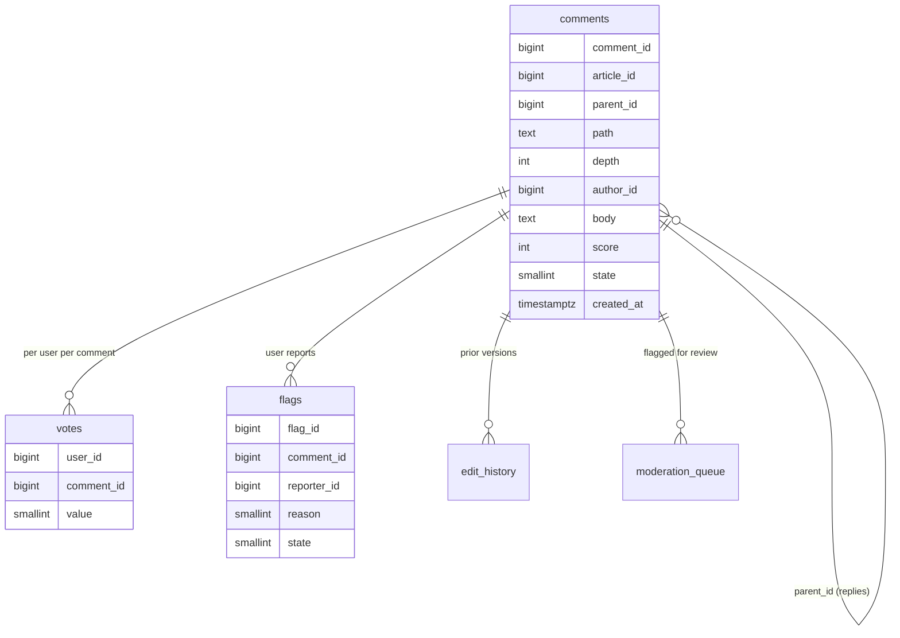

<details markdown="1">
<summary><b>Show: full SQL for all tables</b></summary>

```sql
CREATE TABLE comments (
    comment_id     BIGINT PRIMARY KEY,
    article_id     BIGINT NOT NULL,
    parent_id      BIGINT,
    path           TEXT NOT NULL,
    depth          INT NOT NULL,
    author_id      BIGINT,
    body           TEXT NOT NULL,
    score          INT NOT NULL DEFAULT 0,
    reply_count    INT NOT NULL DEFAULT 0,
    state          SMALLINT NOT NULL DEFAULT 1,
        -- 1=published, 2=pending_review, 3=removed_auto,
        -- 4=removed_manual, 5=removed_self, 6=shadow
    created_at     TIMESTAMPTZ NOT NULL DEFAULT NOW(),
    updated_at     TIMESTAMPTZ,
    edit_count     SMALLINT NOT NULL DEFAULT 0
);

CREATE INDEX idx_comments_article ON comments (article_id, created_at DESC);
CREATE INDEX idx_comments_path    ON comments (article_id, path text_pattern_ops);
CREATE INDEX idx_comments_parent  ON comments (parent_id) WHERE parent_id IS NOT NULL;
CREATE INDEX idx_comments_author  ON comments (author_id, created_at DESC);

CREATE TABLE votes (
    user_id     BIGINT NOT NULL,
    comment_id  BIGINT NOT NULL,
    value       SMALLINT NOT NULL,
    created_at  TIMESTAMPTZ NOT NULL DEFAULT NOW(),
    updated_at  TIMESTAMPTZ NOT NULL DEFAULT NOW(),
    PRIMARY KEY (user_id, comment_id)
);

CREATE TABLE flags (
    flag_id      BIGINT PRIMARY KEY,
    comment_id   BIGINT NOT NULL,
    reporter_id  BIGINT NOT NULL,
    reason       SMALLINT NOT NULL,
    details      TEXT,
    created_at   TIMESTAMPTZ NOT NULL DEFAULT NOW(),
    state        SMALLINT NOT NULL DEFAULT 1,
    UNIQUE (comment_id, reporter_id)
);

CREATE TABLE edit_history (
    edit_id      BIGINT PRIMARY KEY,
    comment_id   BIGINT NOT NULL,
    prior_body   TEXT NOT NULL,
    edited_at    TIMESTAMPTZ NOT NULL DEFAULT NOW(),
    edited_by    BIGINT
);

CREATE TABLE moderation_queue (
    queue_id      BIGINT PRIMARY KEY,
    comment_id    BIGINT NOT NULL,
    priority      SMALLINT NOT NULL,
    reason        TEXT NOT NULL,
    queued_at     TIMESTAMPTZ NOT NULL DEFAULT NOW(),
    assigned_to   BIGINT,
    resolved_at   TIMESTAMPTZ,
    resolution    SMALLINT
);

CREATE INDEX idx_modq_unclaimed ON moderation_queue (priority DESC, queued_at)
    WHERE resolved_at IS NULL AND assigned_to IS NULL;
```

</details>

Three choices worth defending out loud:

**`parent_id` and `path` together.** `parent_id` keeps inserts simple and gives you "who is the parent" for free. `path` makes `WHERE path LIKE '/123/%'` a single index range scan, no recursion. The two cannot drift because `path` is computed from the parent's path at insert time.

**`score` and `reply_count` are denormalized on the comment row.** Computing them from `votes` and `parent_id` joins on every read would be a scan per comment. The vote aggregator keeps `score` close to current. A nightly reconciliation job corrects `reply_count` drift.

**`votes` primary key is `(user_id, comment_id)`.** Enforces one vote per user. Update the row when the user changes their vote. `UNIQUE (comment_id, reporter_id)` on flags prevents one user from spamming reports.

---

### 5. The tree: insert and fetch

Insert uses `parent_id` to look up the parent's path, then computes the new path. Fetch uses the path prefix for a single index scan.

<details markdown="1">
<summary><b>Show: insert and fetch code</b></summary>

```python
def insert_reply(article_id, parent_id, author_id, body):
    parent = db.fetch_one(
        "SELECT path, depth FROM comments WHERE comment_id = %s", parent_id
    )
    if not parent:
        raise ParentGone()
    if parent.depth >= MAX_DEPTH:
        parent_id, parent = find_anchor_ancestor(parent.path, MAX_DEPTH - 1)

    comment_id = snowflake.next()
    new_path  = f"{parent.path}/{comment_id}"

    with db.transaction():
        db.execute("""
            INSERT INTO comments
                (comment_id, article_id, parent_id, path, depth, author_id, body)
            VALUES (%s, %s, %s, %s, %s, %s, %s)
        """, comment_id, article_id, parent_id, new_path,
             parent.depth + 1, author_id, body)
        db.execute(
            "UPDATE comments SET reply_count = reply_count + 1 WHERE comment_id = %s",
            parent_id
        )


def fetch_tree(article_id, sort="hot"):
    rows = db.fetch_all("""
        SELECT comment_id, parent_id, path, depth, author_id, body,
               score, reply_count, state, created_at
        FROM comments
        WHERE article_id = %s
          AND state IN (1, 3, 4, 5)     -- include tombstones for structure
        ORDER BY path                   -- pre-order traversal naturally
    """, article_id)

    by_id = {r.comment_id: {**r, "children": []} for r in rows}
    roots = []
    for r in rows:
        if r.parent_id is None:
            roots.append(by_id[r.comment_id])
        elif r.parent_id in by_id:
            by_id[r.parent_id]["children"].append(by_id[r.comment_id])

    for node in by_id.values():
        if node["state"] in (3, 4, 5):
            node["body"] = "[deleted]"
            node["author_id"] = None

    sort_tree(roots, by=sort)
    return roots
```

Fetching a subtree (load more replies):

```python
def fetch_subtree(article_id, root_comment_id, limit=50):
    root = db.fetch_one(
        "SELECT path FROM comments WHERE comment_id = %s", root_comment_id
    )
    rows = db.fetch_all("""
        SELECT comment_id, parent_id, path, depth, author_id, body, score, state
        FROM comments
        WHERE article_id = %s AND path LIKE %s
        ORDER BY path
        LIMIT %s
    """, article_id, root.path + "/%", limit)
    return assemble(rows)
```

Soft delete:

```python
def delete_comment(comment_id, by_user_id):
    db.execute("""
        UPDATE comments
        SET state = 5, body = '[deleted]', author_id = NULL, updated_at = NOW()
        WHERE comment_id = %s AND author_id = %s
    """, comment_id, by_user_id)
    invalidate_cache_for(article_id_of(comment_id))
```

</details>

The row stays. The `path` stays. Children stay. The thread renders correctly above and below the deleted comment. Hard-deleting orphans every child and breaks every path string below.

---

### 6. The vote aggregator


1,000 votes on one comment in 5 seconds become one UPDATE, not 1,000. The hot-row problem disappears.

Trade-off: scores lag actual votes by up to 5 seconds. For resilience against Redis crash, enable AOF plus a replica, or write vote events to Kafka and have the worker read from Kafka instead. Kafka is the durable record; Redis is the fast counter.

---

### 7. The architecture

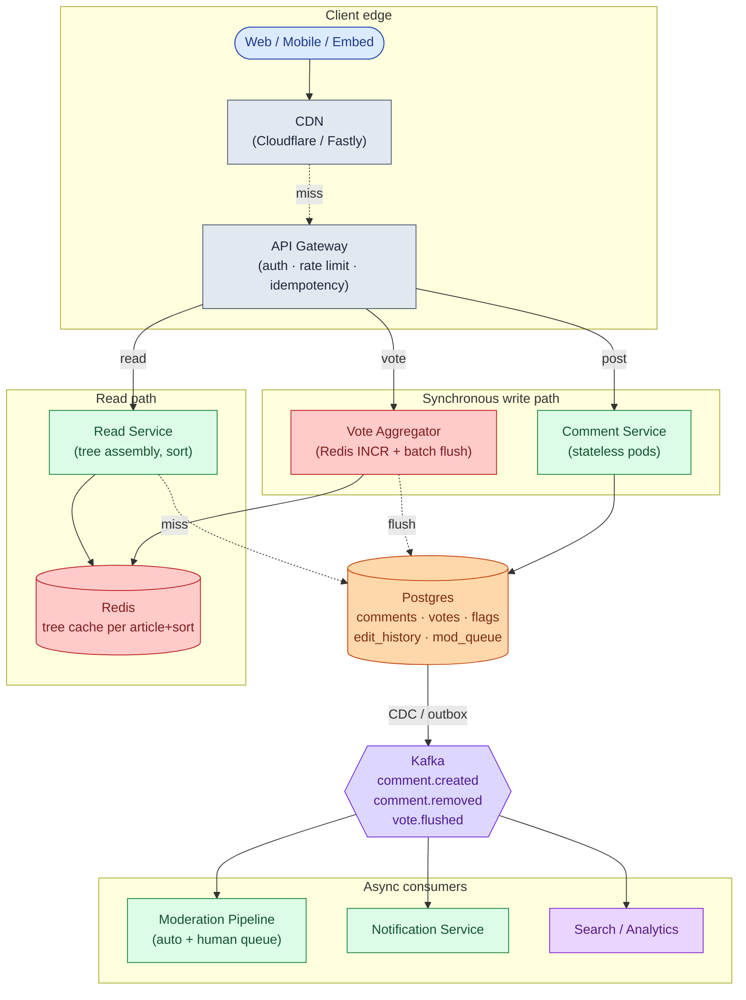

Five things to notice:

- The Comment Service does not call out to moderation on the write path. The synchronous pre-check is bounded at ~50ms. ML classification runs off Kafka after publish.
- The Vote Aggregator is the only thing between the user and "vote recorded." No database call on the hot path. One UPDATE per comment per 5 seconds regardless of vote rate.
- The Read Service is stateless. State is in the cache and the read replica. Cache invalidation comes from a Redis pub/sub channel all Read Service pods subscribe to.
- Notifications, search indexing, and analytics are downstream of Kafka. If the notification service is down, comments still post and votes still count.
- Postgres is one primary plus replicas at small scale. Shard by `article_id` only when you outgrow one box.

---

### 8. A comment write, end to end

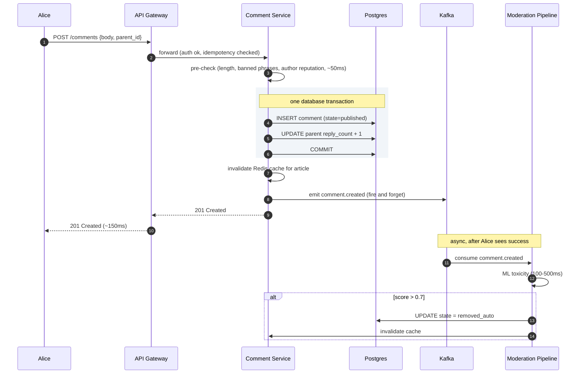

The read path:

CDN check (`comments:article:42:tree:sort=hot`) → Read Service runs `WHERE article_id=42 ORDER BY path`, builds tree in memory (O(n)), applies sort, writes Redis with 60s TTL + jitter → Postgres read replica on cache miss.

Target latencies:

| Operation | P99 |
|-----------|-----|
| Post comment | ~200ms (pre-check is the bottleneck) |
| Cast vote | ~50ms (Redis only) |
| Load tree (cache hit) | ~100ms |
| Load tree (cache miss) | ~500ms (tree build on large articles) |

---

### 9. The scaling journey: 10 users to 1 million

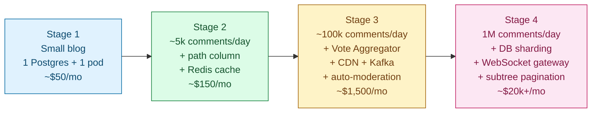

#### Stage 1: small blog, 100 comments/day

One Postgres, one app pod. Adjacency list only (`parent_id`). Recursive `WITH RECURSIVE` for tree fetch. No cache, no queue, no Redis. Moderation is an email to the admin. About $50/month.

Enough because the database handles 1 read per second without breaking a sweat.

#### Stage 2: 5,000 comments/day

Something breaks: one article got 800 comments and the recursive query takes 400ms.

Add the materialized `path` column. Backfill existing rows. Switch the fetch query to `WHERE article_id=X ORDER BY path`. Add per-user rate limiting (10 comments/minute). Add a Redis cache for rendered trees (60s TTL). Add the `edit_history` table.

Still no Vote Aggregator, no Kafka. About $150/month.

#### Stage 3: 100,000 comments/day

Several things break at once:

- A viral article: 10,000 concurrent viewers, 500 votes per minute on the top comment. Postgres CPU at 90%.
- The moderation team cannot keep up. 2,000 comments to review vs 50 the day before.
- Cache hit rate at 70% because large trees get evicted and re-fetched on every view.
- A comment reported by ten users stayed up for 6 hours.

Fixes in order: Vote Aggregator with Redis and batch flush. CDN in front of the read endpoint. ML auto-moderation pipeline on Kafka (80% reduction in human queue). User-report threshold for auto-hide. Author reputation fed into the pre-check. Two Postgres read replicas.

About $1,500/month.

#### Stage 4: 1 million comments/day

New problems:

- Viral moment: 1,000 votes per second on one comment. The flush delta is now 5,000 per UPDATE.
- One article hits 5,000 comments. Tree build on cache miss takes 800ms. Cache expiry causes a thundering herd.
- Postgres primary at 70% CPU.

Fixes: shard `comments` by `article_id` (16-64 shards). In-process LRU per Read Service pod with stale-while-revalidate. Sub-tree pagination (top 50 top-level comments, first 3 replies inline, cursor for more). WebSocket gateway for live updates via Kafka to Redis pub/sub.

About $20k/month depending on CDN volume and ML inference cost.

---

### 10. Reliability

**Vote double-counting.** Handled at the Redis hash level. Existing vote is compared, delta computed, hash updated atomically via Lua script. User clicks Upvote twice: second click sees `existing=1, new=1, delta=0`, no-op.

**Cache stampede on a hot article.** Stale-while-revalidate: serve the stale cached value while one request refreshes in the background. Per-key request coalescing: only one database fetch per article in flight at a time. Jittered TTLs so keys do not all expire at the same second.

**Database primary failover.** Promote a replica: ~30-60 seconds of write unavailability. During the window, Kafka-first writes queue comments and land after recovery. Votes hit Redis and flush when the database is back.

**Moderation backlog during news events.** Auto-action thresholds tighten dynamically. If the queue exceeds a threshold, promote comments with toxicity > 0.7 from "review" to "remove." Prevents the queue from spiraling while mods are overwhelmed.

---

### 11. Observability

| Metric | Why it matters |
|--------|----------------|
| `comment.created.rate` | Sudden spike = bot or viral moment. Drop = auth broken. |
| `comment.pre_check.latency.p99` | Must stay under 50ms. If it grows, every poster waits. |
| `comment.auto_removed.rate` | Over 5% = pre-check too aggressive. Under 0.1% = not catching enough. |
| `comment.pending_review.rate` | If growing faster than `moderation.resolve.rate`, backlog is building. |
| `cache.hit_rate` (Redis tree) | Under 90% = cache too small or churn too high. |
| `cache.miss.fetch.latency.p99` | Over 500ms = trees getting large; pagination might be needed. |
| `vote.flush.lag` | Time since last successful flush. Over 30s = votes piling up in Redis. |
| `vote.flush.batch_size` | Average deltas per flush. Spikes signal virality. |
| `flag.open.count` | Unresolved user reports. Should trend down. |
| `moderation.queue.depth` | Items awaiting human review. Page when over 500 for 30 min. |
| `tree.depth.p99` per article | Should stay under 10. Higher = abuse attempts. |
| `replica.lag.p99` | Must stay under 2 seconds for the UI to feel current. |

Page on: write error rate > 2% for 5 minutes, vote flush stalled > 60 seconds, cache hit rate < 70% for 10 minutes.

---

### 12. Follow-up answers

**1. A comment with 200 replies is deleted.**

Soft delete: `UPDATE comments SET state=5, body='[deleted]', author_id=NULL`. The 200 replies are untouched. Their `parent_id` still points at the deleted comment; their `path` strings still include its ID. On render, the deleted comment shows as `[deleted]`. The replies render normally underneath. Cache for the article is invalidated. Hard-deleting instead would orphan every reply and break every path string below.

**2. A user spams 1,000 comments in 10 seconds.**

Multiple defenses in order. API Gateway rate limit (10 per minute per user, 50 per minute per IP) stops them at request 11 with a 429. If they rotate accounts, per-IP rate limit catches them. If they rotate IPs, the synchronous pre-check catches behavioral signals: new account, high posting cadence, link density. New accounts posting links at high rate go to `pending_review`. After 3 strikes within an hour, the account auto-shadow-bans. A legitimate user posting 5 comments per minute is under the cap and sees no friction.

**3. Edit window vs immutable history.**

Free edit for the first 5 minutes, no history saved, no badge. After 5 minutes, edits are allowed for up to 24 hours. Each edit saves the prior body to `edit_history` and the "(edited)" badge appears. After 24 hours, edits are locked for normal users. For moderation: when a comment is reported, the reported version is snapshotted into the moderation queue record. The moderator sees the reported version and the current version side by side.

**4. The "hot" sort algorithm.**

Reddit's formula:

```python
def hot_score(ups, downs, created_at):
    score = ups - downs
    order = log10(max(abs(score), 1))
    sign  = 1 if score > 0 else (-1 if score < 0 else 0)
    seconds = (created_at - epoch).total_seconds() - 1134028003
    return round(sign * order + seconds / 45000, 7)
```

Logarithmic on score (10 upvotes = 1 order of magnitude, 100 = 2; diminishing returns). Linear in time: newer comments start higher. The constant 45,000 seconds (~12.5 hours) controls the half-life. After that age, a comment needs 10x more votes to outrank a fresh one. Sort purely by score and the front page never changes. The first viral comment stays at the top forever.

**5. New comment, cached tree now stale.**

Three options: full invalidation (delete the key, next read rebuilds, simplest but cold-start latency), partial update (modify the cached value in place to insert the new comment, hard to get right under concurrency), or accept staleness (60s TTL, new comments appear up to 60s late). Most systems pick full invalidation with stale-while-revalidate: on write, invalidate; on next read, refresh in the background and serve stale during the refresh.

**6. 50 users report a comment in 5 minutes.**

Track reports per comment in a Redis sorted set with timestamps as scores. If `reports_in_last_hour >= 10` and `reports_in_last_5_min >= 5`, auto-hide (state to `pending_review`) and front-of-queue for human review. If `reports_in_last_hour >= 25`, auto-remove. Account for reporter reputation: 10 reports from new accounts count less than 5 from established users.

**7. Real-time updates via WebSocket.**

A Kafka consumer subscribes to `comment.created`. On each event, it publishes to Redis pub/sub on `comments:article:{article_id}`. WebSocket Gateway pods each subscribe to that channel and fan out to locally connected clients. 10,000 viewers on one article: spread across 10 Gateway pods (1,000 each). Each pod gets one pub/sub message and fans out to its 1,000 local clients. Vote count updates: the vote aggregator publishes a delta event every 5 seconds for comments with changes. Clients update the displayed score from the event stream.

**8. Pagination on a 5,000-comment thread.**

Initial load: top 50 top-level comments, each carrying `reply_count` and the first 3 child replies inline, with a cursor for more. Cursor: `(score, comment_id)` for hot sort, `(created_at, comment_id)` for chronological. "Load more replies under this comment" uses the path prefix to fetch the next batch under that specific subtree.

```
GET /articles/42/comments?sort=hot&limit=50
GET /articles/42/comments?sort=hot&limit=50&cursor=...
GET /comments/cmt_abc/replies?limit=50&cursor=...
```

The path-prefix index makes "more replies under one comment" a single index range scan. The 5,000-comment tree is never loaded all at once.

**9. Brigading.**

Signals: vote velocity anomaly (200 votes in 60 seconds on a comment that previously saw 5 per day), voter profile (accounts under 7 days old, no prior activity, voting only on this one comment), referrer (votes arriving from off-site). Action: mark these votes "low confidence." They are still recorded for audit, but the displayed score uses only confidence-weighted votes. Throttle voting from the implicated account cohort site-wide for 24 hours.

**10. GDPR delete of 4,000 comments.**

For each comment: `UPDATE comments SET body='[deleted]', author_id=NULL, state=5`. Same as a normal soft delete. Tree structure preserved. Replies underneath remain (they are other users' content). For `votes` rows by this user: the primary key includes `user_id`, so delete the rows. Scores are already aggregated into `score` on the comment row; deleting vote rows does not change the displayed score. For `edit_history`: replace `prior_body` with `[deleted]`. Scan all shards for `author_id=X` in parallel, soft-delete, invalidate caches for every affected article. Confirm within 30 days per GDPR.

---

### 13. Trade-offs worth stating out loud

**Why Postgres over Cassandra.** Tree fetches via path prefix work natively on B-tree indexes. Strong consistency on votes (no double-count if a user clicks twice fast) is free. 250 GB/year fits comfortably on a sharded Postgres. Cassandra would need application-side consistency for vote dedup and cannot do range scans on arbitrary paths efficiently.

**Why not a graph database.** Comment trees have no cycles and no many-parent relationships. Graph databases add operational complexity without benefit at this scale.

**Why both `parent_id` and `path`.** The load-bearing choice. Insert path uses `parent_id`. Read path uses `path`. With only `parent_id`, you run a recursive query on every page load. With only `path`, "what is the parent of this comment" requires parsing a string. Both is the right amount of engineering.

**Why post-publish moderation.** Pre-publish (waiting for a human before the comment appears) does not scale past a few hundred comments per day. At 1 million comments per day, 1 second of human attention per comment would require about 10,000 mod-hours per day. Not viable. Post-publish with fast async takedown is what every high-volume site does.

---

### 14. Common mistakes

**Adjacency list with recursive fetch only.** Works at small scale, falls over at 5,000 comments per article. The materialized path is the answer.

**Naive UPDATE on the comment row for every vote.** Hot-row meltdown the moment a comment goes viral. Vote Aggregator with Redis and batch flush is the canonical answer.

**Hard-delete on comments.** Breaks the tree the moment a comment with replies is deleted. Soft delete with tombstone is non-negotiable.

**Pre-publish moderation for everything.** Does not scale past a few comments per minute. Post-publish with fast async takedown is what every high-volume site does.

**No depth cap.** Pathological nesting is a real abuse vector. Cap at about 10 visible levels. Deeper replies render as siblings at the cap level.

**Forgetting that the cache unit is the rendered tree.** Caching individual comments forces tree assembly on every read. Caching the whole rendered tree per `(article_id, sort)` is what makes reads fast.

**Ignoring edit history.** Every interview asks. Have a model: 5-minute free edit, then edits saved with "(edited)" badge.

**Vote dedup as an afterthought.** "We'll check before incrementing" misses the race condition. Dedup must be atomic at the Redis layer or via a database unique constraint.

**Treating moderation as a side concern.** It is half the system in production. A junior candidate designs the comment table. A senior designs the moderation queue, the auto-classifier, and the human workflow alongside it.

The three that separate strong from average: vote hot-row handling, soft-delete tombstone design, and a confidence-routed moderation pipeline. Those signal you have operated a comment system at scale.

