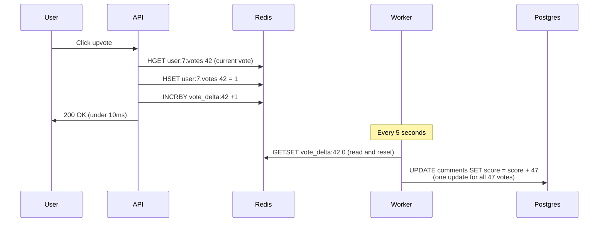
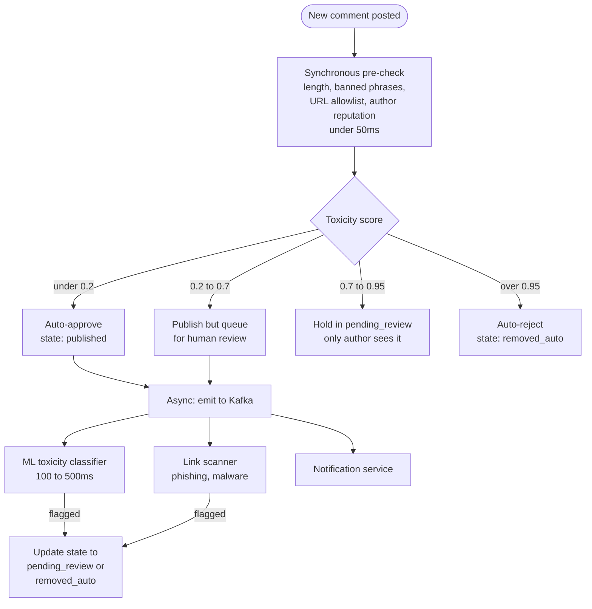
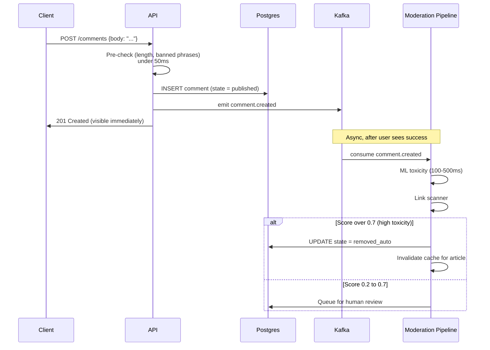
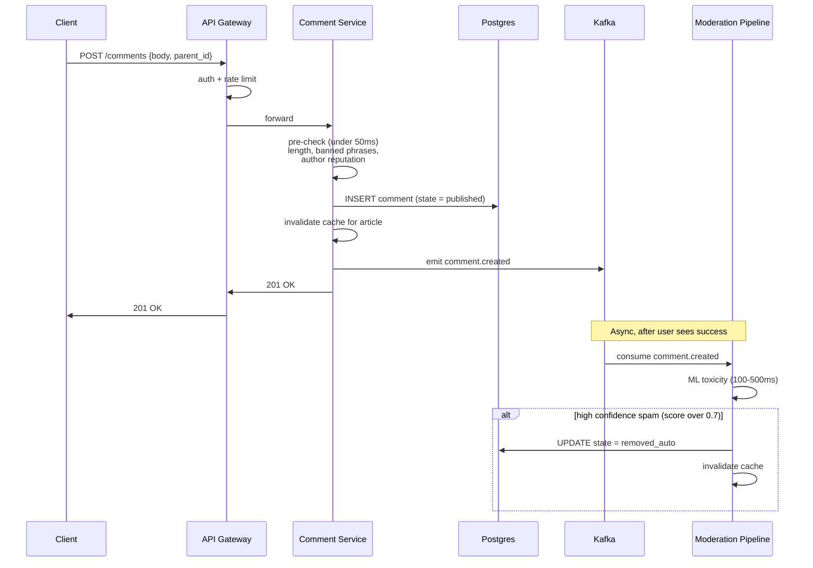
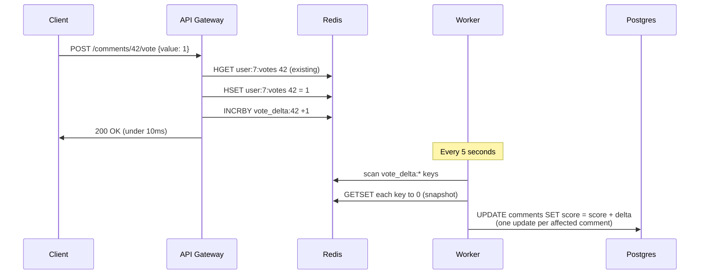


## The scene

You sit down. The interviewer puts down their coffee.

> *"We run a news site. Every article has a comment section. People reply to each other. People upvote and downvote. Sometimes a comment goes viral and gets 5,000 replies. Sometimes a comment is spam and a moderator removes it. Build the comment system. Think Disqus, HackerNews, Reddit-style."*

It looks like a simple CRUD app. It is not. Comments are the smallest piece of user content you can imagine, and they pack in every hard problem at once:

- Nested data (a reply to a reply to a reply)
- Heavy reads with bursty writes
- Voting that creates "hot rows" in the database
- Soft delete that has to keep the thread structure alive
- Ranking that is smarter than "newest first"
- A moderation pipeline that has to outrun trolls

If you start with "comments table with a parent_id, done," you skip every interesting question. The real ones are:

- How do you fetch a 5,000-node thread without making 5,000 database calls?
- How do you count 1,000 upvotes in 5 seconds without one row in the database locking everything else?
- How do you delete a comment that has 200 replies under it without breaking the thread?
- How does the moderation system decide what is spam without a human reading every single comment?

We will walk this from a tiny 10-article blog to a viral site doing 1 million comments a day. At every step we will name what breaks first, then add the smallest fix that solves it.

---

## Step 1: Ask the right questions

Before you draw anything, sit for five minutes. Write down questions you would ask the interviewer.

A good answer here is not "twenty questions about every edge case." It is the small handful of questions that change the design if answered differently.

<details markdown="1">
<summary><b>Show: 10 questions that matter</b></summary>

1. **Depth limit.** Can a reply to a reply to a reply go on forever? Or is there a cap? Reddit caps the visible nesting around 10 levels. HackerNews stops indenting after 8 levels. *Without a cap, one user can reply to themselves 200 times deep and break your fetch query.*

2. **Edit history.** Can users edit comments? Forever, or only for a short window? Do we keep the old versions? *The 5-minute edit window is the common pattern. No history means someone can change "I love this" to "I hate this" after people reply.*

3. **Voting model.** Upvote only (like Facebook reactions) or up and down? Can a user change their vote? *Downvotes change moderation incentives and need extra logic to avoid double-counting.*

4. **Sort orders.** What sorts does the UI need? Newest, oldest, top, hot, controversial? *Each sort needs its own cache and some are expensive to compute live.*

5. **Moderation model.** Auto-detect spam? Human mods? User reports? All three? Pre-publish review (every comment waits for a mod) or post-publish takedown (every comment goes live, mods react)? *Pre-publish is a completely different system from post-publish.*

6. **Delete semantics.** When a user deletes a comment that has 50 replies, what happens? Do we orphan the replies? Tombstone? Hard delete? *Almost always: soft delete with a tombstone so the thread structure survives.*

7. **Read vs write ratio.** How many reads per write? News articles get read 100 to 1000 times more than they get commented on. *Caching the rendered tree dominates the whole architecture.*

8. **Real-time updates.** When someone posts a reply, does my screen update live? Or only on refresh? *Live updates need a WebSocket fan-out, which is a different design.*

9. **Auth.** Anonymous comments allowed? Login required? *Anonymous changes the abuse story.*

10. **Notifications.** When someone replies to me, do I get pinged? *Usually a separate service that listens to events from the comment system.*

The three questions that change the architecture the most are **depth limit**, **sort order**, and **moderation model**. If you only ask "how many comments per day," you have already lost the interesting design space.

</details>

---

## Step 2: How big is this thing?

Same problem, two scales. Do the math.

**Small blog:**

- 10 articles per day
- 100 comments per day across all articles
- Each comment about 200 bytes

**Viral site:**

- 100,000 articles in the active set
- 1 million comments per day
- Top 1% of articles get 80% of the comments
- 300 bytes per comment on average
- Read-to-write ratio: 1000 to 1

For the viral site, compute these numbers: writes per second (steady and peak), reads per second (steady and peak), storage per year, and peak votes per second on the hottest comment in a viral moment.

<details markdown="1">
<summary><b>Show: the math at both scales</b></summary>

**Small blog:**

- 100 comments/day = about 1 comment every 15 minutes. Trivial.
- Reads at 1000:1 = about 1 read per second.
- Storage: 100 x 365 x 200 bytes = about 7MB per year. Tiny.

A laptop runs this. Ship it in a weekend with one Postgres database and no cache.

**Viral site:**

- 1,000,000 / 86,400 = about 12 writes per second steady.
- Peak is 3 to 5 times higher: 40 to 60 writes per second.
- Reads at 1000:1 = about 12,000 reads per second steady, 40,000 reads per second at peak.
- Storage: 1M x 365 x 300 bytes = about 110GB per year for comment text, about 250GB per year once you add votes, flags, and edit history.

**What the math is telling you:**

The total numbers are not huge. Steady-state load is small. A laptop could handle the average writes.

The real problems are:

1. **40,000 reads per second at peak**, concentrated on a few hot articles. A naive recursive query to the database on every page load would melt the database. **The cache layer is not optional.**

2. **1,000 votes per second on one hot comment** in a viral moment. That is a "hot row" problem in the database. One row gets hammered while everything else sits idle.

Storage is small enough that you do not need to shard for capacity. You shard so one bad article does not slow down the others.

> **Why this matters:** Reads beat writes 1000 to 1. The architecture is built around the read path (caching the rendered tree), not around write throughput. Most candidates design for writes and get this exactly backwards.

</details>

---

## Step 3: How do you store the tree?

This is the central decision. You have a tree of comments. How do you store a tree in a database that thinks in rows and columns?

You need four things to work well:

1. **Insert a new comment cheaply.** This is the hot write path.
2. **Fetch a whole thread for an article cheaply.** This is the hot read path.
3. **Delete a subtree cheaply.** Rare, but it happens.
4. **Move a subtree.** Very rare for comments.

There are four classic ways to store a tree in a database. Before peeking, try to guess the pros and cons of each.

<details markdown="1">
<summary><b>Show: the four approaches compared</b></summary>

**1. Adjacency list (parent pointer).**

Each row stores its parent's ID. The tree is built by pointing up.

```sql
CREATE TABLE comments (
    comment_id  BIGINT PRIMARY KEY,
    article_id  BIGINT NOT NULL,
    parent_id   BIGINT,                    -- NULL = top-level comment
    body        TEXT,
    created_at  TIMESTAMPTZ
);
```

Inserts are easy: just point to your parent. But fetching a whole thread needs a recursive query (`WITH RECURSIVE` in Postgres). A 5,000-comment thread at depth 8 means 8 joins. Workable but slow.

**2. Materialized path.**

Each row stores its full ancestor chain like `/123/456/789`, so the database can fetch an entire subtree with one prefix scan.

```sql
CREATE TABLE comments (
    comment_id  BIGINT PRIMARY KEY,
    article_id  BIGINT NOT NULL,
    path        TEXT NOT NULL,             -- "/123/456/789" = full ancestor chain
    depth       INT NOT NULL,
    body        TEXT,
    created_at  TIMESTAMPTZ
);
```

A reply's path is `parent.path + "/" + own_id`. Inserts cost one extra SELECT to read the parent's path. Fetching everything under a comment is `WHERE path LIKE '/123/%'`. One query, no recursion. Moving a subtree is expensive (you rewrite the path of every descendant), but for comments you almost never do that.

**3. Nested set (left/right numbers).**

Each row gets two numbers. Descendants sit between the parent's numbers. Fast reads, but inserts are brutal because every row to the right has to be renumbered. Almost no production comment system uses this. Comments are insert-heavy, and this is the wrong shape for inserts.

**4. Closure table.**

A separate table stores every ancestor-descendant pair. A comment at depth 5 produces 5 rows in the ancestry table. Reads are fast. Inserts amplify (one comment becomes many rows). Stack Overflow uses something like this for some hierarchies. Heavy on writes.

| Approach | Insert | Fetch subtree | Fetch full article | Move | Extra storage |
|----------|--------|---------------|--------------------|------|---------------|
| Adjacency list | Cheap | Recursive query | Single query, build tree in app | Cheap | None |
| Materialized path | Cheap (one extra read) | Single prefix scan | Single query | Expensive | One string per row |
| Nested set | Very expensive | Single range query | Single query | Very expensive | None |
| Closure table | Many writes per insert | Single join | Single join | Cheap | One row per ancestor pair |

**The recommendation:** Use **adjacency list AND materialized path together**. Keep `parent_id` because it is the natural shape for inserts and "who is my parent." Also keep `path` so subtree fetches are one query with a prefix index.

The two columns cannot drift apart because `path` is computed from the parent's path at insert time. You eat about 50 bytes per row for the path string. In exchange, you never run a recursive query on the hot read path.

> **Why this matters:** Doing both is not "over-engineering." It is exactly the right amount of engineering. Insert path uses `parent_id`. Read path uses `path`. Each is optimized for its job.

</details>

---

## Step 4: Draw the system

You know how comments are stored. Now draw the boxes around the database.

Try to fill in the missing pieces. Think about: where do comments come in, where do votes go, what serves the rendered tree, where does moderation happen.

```
            Client (web, mobile, embed iframe)
                       |
                       v
              +-----------------+
              |    [ ? ]        |   auth, rate limit, bot detection
              +-----+-------+---+
                    |       |
       post / vote  |       |   load comments
                    |       |
                    v       v
            +----------+   +----------+
            |  [ ? ]   |   |  [ ? ]   |   rendered comment trees
            | (writes) |   |          |   served from memory
            +--+----+--+   +----+-----+
               |    |           |
               |    v           v
               |  +----------+  +-------------+
               |  |  [ ? ]   |  |  Read       |
               |  | (Redis   |  |  Replica    |
               |  |  INCR +  |  |  (Postgres) |
               |  |  batch)  |  +-------------+
               |  +----+-----+
               |       |
               v       v
            +-----------------+
            |  Comments DB    |   source of truth
            |  (Postgres)     |
            +--------+--------+
                     |  async via Kafka
                     v
            +-----------------+
            |    [ ? ]        |   spam classifier,
            |                 |   human review queue
            +-----------------+
```

<details markdown="1">
<summary><b>Show: the full architecture</b></summary>

```
            Client (web, mobile, embed iframe)
                       |
                       v
              +-----------------+
              |  API Gateway    |   auth, per-user rate limit,
              |  + WAF          |   simple bot detection
              +-----+-------+---+
                    |       |
       post / vote  |       |   load comments
                    |       |
                    v       v
            +----------+   +-------------+
            | Comment  |   |  Read       |
            | Service  |   |  Service    |   serves rendered
            | (writes) |   |  (Redis +   |   trees from cache
            |          |   |   CDN)      |
            +--+----+--+   +----+--------+
               |    |           |
               |    v           v
               |  +----------+  +-------------+
               |  | Vote     |  | Read        |
               |  | Aggreg.  |  | Replica     |
               |  | (Redis   |  | (Postgres)  |
               |  |  INCR +  |  +-------------+
               |  |  batch   |
               |  |  flush)  |
               |  +----+-----+
               |       |
               v       v
            +-----------------+
            |  Comments DB    |   tables: comments, votes,
            |  (Postgres,     |   flags, edits, mod_queue
            |   primary)      |
            +--------+--------+
                     |  async via Kafka
                     v
            +-----------------+
            |  Moderation     |   auto: profanity + ML toxicity
            |  Pipeline       |   manual: human queue
            |                 |   reactive: user reports
            +-----------------+
```

What each piece does, in one line:

- **API Gateway.** Auth (who is this), rate limit (no bot floods), idempotency (prevent duplicate posts on mobile retry).
- **Comment Service.** Validates the comment, runs a fast pre-check for obvious spam, writes to Postgres, sends an event to Kafka.
- **Read Service.** Serves the rendered comment tree. Reads from Redis cache. Falls back to a Postgres read replica on miss.
- **Vote Aggregator.** Takes votes, increments a Redis counter, returns success immediately. A background job batches the votes into one database update every 5 seconds.
- **Postgres.** Source of truth. Stores all comments, votes, flags, edit history, and the moderation queue.
- **Kafka.** Carries events to downstream consumers (moderation, notifications, search, analytics) without slowing down the write path.
- **Moderation Pipeline.** Runs ML toxicity classifiers and link scanners on every comment after it is published. Flags suspicious ones for human review or auto-removes the worst.

> **Why is the read service separate from the comment service?** Because reads and writes have totally different shapes. Writes are small and fast. Reads need to assemble a tree, sort it, render it, and serve it under 100ms. Mixing them in one service means one slow read can starve writes.

</details>

---

## Step 5: The vote hot-row problem

A comment goes viral. 1,000 users upvote it in 5 seconds. Your naive design:

```sql
UPDATE comments SET score = score + 1 WHERE comment_id = 42;
INSERT INTO votes (user_id, comment_id, value) VALUES (?, 42, 1);
```

What happens? Why is this a problem? Design something that handles 1,000 votes per second on a single comment without melting the database.

<details markdown="1">
<summary><b>Show: the hot-row problem and the fix</b></summary>

**Why the naive design melts:**

Every UPDATE on the same row takes a row-level lock. The 1,000 concurrent UPDATEs serialize, one at a time, behind that lock. Every voter waits. Postgres's write-ahead log fills with 1,000 row-version entries for the same row. Other queries trying to read this comment wait too. Replication lag grows because the primary is busy. The database's CPU spikes on one row while everything else slows down.

That is the "hot row" problem.

**The fix has three parts.**



**1. Decouple vote from score update.** The user's click does not need to update the database row right now. It needs the vote recorded (for dedup) and the score eventually correct. So `POST /comments/42/vote` goes to the Vote Aggregator. The aggregator does:

- `INCRBY vote_delta:42 1` in Redis (constant time, in memory)
- `HSET user:7:votes 42 1` to remember this user's vote (for dedup)
- Returns 200 to the user in about 5ms

**2. Batch-flush to the database.** A background worker runs every 5 seconds. It reads all the `vote_delta:*` keys. For each comment, it runs one UPDATE with the accumulated delta:

```sql
UPDATE comments SET score = score + 47 WHERE comment_id = 42;
```

1,000 votes in 5 seconds become **one UPDATE**, not 1,000. The hot row sees one write per 5 seconds. The problem disappears.

**3. Dedup at the Redis layer.** A user clicks upvote twice. Or changes from up to down. The `user:7:votes` hash holds their current vote on each comment. On submit:

- Read existing vote: was 0
- New vote is 1
- Delta = +1
- Store new vote, apply delta

If they switch from down (-1) to up (+1), the delta is +2. If they click upvote when already upvoted, the delta is 0 and nothing changes.

> **Why batch every 5 seconds and not after every vote?** Because if 10,000 users upvote the same comment in the same second, you would hit the database with 10,000 UPDATE statements on the same row. They would all serialize, the database would lock up. Instead, INCR in Redis is just memory; then one database write per 5 seconds covers all 10,000 votes.

**Trade-offs:**

- The displayed score lags actual votes by up to 5 seconds. Most users do not notice.
- Up to 5 seconds of votes could be lost if Redis crashes before the flush. Fix: enable Redis AOF (append-only file) + a replica, or write the vote to Kafka first (durable) and have the worker read from Kafka.

This pattern is the standard answer for "high write rate on a single counter." Vote counts, view counts, like counts, anything that aggregates.

</details>

---

## Step 6: The moderation pipeline

Comments attract spam, hate speech, NSFW content, scam links. The interviewer asks: walk me through how a comment is moderated, from posted to either visible-to-everyone or removed.

You have three input signals:

1. **Automated detection** at post time
2. **User reports** after the fact
3. **Manual scanning** by mods

Sketch the pipeline. What states does a comment pass through?

<details markdown="1">
<summary><b>Show: the states and the pipeline</b></summary>

**States a comment can be in:**

| State | Visible to | How it got here |
|-------|-----------|-----------------|
| `published` | Everyone | Posted and passed auto-checks |
| `pending_review` | Author only | Auto-checker had medium confidence it might be bad |
| `shadow_banned` | Author only | Author is a known bad actor; comment looks live to them, invisible to everyone else |
| `removed_auto` | No one (but a tombstone keeps the thread shape) | Auto-checker was very confident it was spam |
| `removed_manual` | No one | A human mod removed it |
| `removed_self` | No one | Author deleted it |

**The pipeline:**



**The flow when a user posts a comment:**



**Why the pipeline has fast + slow stages:**

The synchronous pre-check is the only thing on the hot write path. It must finish in about 50ms because it blocks the user. So it does only cheap things:

- Length check
- Bloom filter pass against banned phrases
- Reputation lookup (is this user already shadow-banned)
- URL allowlist

Async checks are slower and more expensive. ML toxicity models take 100 to 500ms per inference. Link scanning calls an external API. These run **after** the comment is already visible. If they flag it, the comment's state updates and the cache invalidates. The user sees their comment briefly, then sees a "your comment was removed" notice if it got flagged.

**User reports** are the third input. A "report" button lets users flag content. Reports queue into the same human-review tool, sorted by report count, the reporter's reputation, the comment's auto-toxicity score, and the author's reputation.

**Why not pre-publish review for everything?** Two reasons:

1. **Latency.** Users expect comments to appear immediately. Waiting for a human to approve breaks the experience.
2. **Volume.** At 1 million comments per day, even 1 second of human attention per comment needs about 10,000 mod hours per day. Not viable.

Post-publish with fast async takedown is what every high-volume site does.

**The shadow ban trick.** A user spams. You ban them. They make a new account. Instead, shadow-ban: their comments look published *to them* but are invisible to everyone else. They waste effort posting comments nobody sees, and the system gives them no signal that something is wrong, so they are less likely to spawn alternate accounts. On render: if the requesting user is the comment's author, show the comment regardless of state. Otherwise hide it.

> **Why batch-route by confidence score?** Because moderation costs scale with how many comments a human looks at. If everything goes to a human, mods cannot keep up. If nothing goes to a human, garbage stays up. The confidence bands (auto-approve / queue / shadow / auto-reject) let you tune the false-positive vs false-negative balance.

</details>

---

## Step 7: The render flow

A user loads `/articles/news-of-the-day`. The article is hot, getting 10,000 loads per minute. Sketch the read path.

<details markdown="1">
<summary><b>Show: the read path with cache tiering</b></summary>

```
        GET /articles/news-of-the-day/comments
                   |
                   v
        +------------------+
        |   CDN edge       |   Cloudflare, Fastly.
        |                  |   99% of reads stop here.
        +--------+---------+
                 | miss
                 v
        +------------------+
        |  Read Cache      |   Key: article:42:tree:sort=hot
        |  (Redis)         |   Value: rendered JSON tree
        |                  |   TTL: 60 seconds
        +--------+---------+
                 | miss
                 v
        +------------------+
        |  Read Service    |
        |  - SELECT all    |
        |    comments      |
        |    WHERE         |
        |    article_id=42 |
        |  - Build tree    |
        |    in memory     |
        |  - Apply sort    |
        |  - Render JSON   |
        |  - Cache for 60s |
        +--------+---------+
                 |
                 v
        +------------------+
        |  Read Replica    |
        |  (Postgres)      |
        +------------------+
```

**Three layers, three TTLs:**

1. **CDN edge.** For hot articles, the CDN holds the rendered JSON. 99% of reads never touch your origin. Refresh from origin every 60 seconds.

2. **Redis cache.** Keyed by `(article_id, sort_order)` because the same article has different trees for "newest" vs "hot" vs "top." TTL 60s. Invalidated on writes.

3. **Read Service.** Runs the single query `SELECT * FROM comments WHERE article_id = X ORDER BY path`. Builds the tree in memory in O(n). Applies the sort. Renders JSON. Writes to Redis.

For cold articles, every read goes to the read replica. A cold article usually has few comments, so the response is small.

> **Why include the sort order in the cache key?** Because users sort differently. "Newest" produces a different tree order from "hot." If you only key by `article_id`, switching sort returns the wrong order or the cache becomes useless because every user invalidates the same key.

</details>

---

## Follow-up questions

Try answering each in 2 to 4 sentences before opening the solution.

1. **Soft delete of a popular comment.** A comment with 200 replies under it gets deleted by its author. What happens to the replies? Walk through the data and the UI.

2. **Spam burst.** A user posts 1,000 comments in 10 seconds via a script. Where does this get caught? How do you avoid blocking a legitimate user who posts 5 comments in a minute during a hot discussion?

3. **Edit history.** A user edits their comment 3 hours after posting. The original said something they want to walk back. Should other users see "(edited)"? Should they be able to see the original? What about for moderation?

4. **The "hot" sort algorithm.** Define Reddit's "hot" ranking. Why does it decay with time? What happens if you sort by score alone?

5. **Cache invalidation.** A new comment is posted. Your cached tree is now stale. Do you invalidate the whole cache key, do partial updates, or accept staleness? What is the trade-off?

6. **Report storm.** A user reports a comment as spam. 50 others report the same comment within 5 minutes. Do you wait for a human, or auto-hide it? Where does the threshold come from?

7. **Real-time updates.** Someone wants the comment count and replies to update live on the article page. Sketch the WebSocket fan-out without melting the server when an article hits 10,000 concurrent viewers.

8. **Pagination on a huge thread.** A 5,000-comment thread cannot ship to the client all at once. What is your paging strategy? How do you handle "load more replies" when one child has 80 sub-replies?

9. **Brigading.** A comment thread suddenly attracts brigading from another site. A sudden flood of accounts with no prior activity all downvote one comment. How do you detect this and what do you do?

10. **GDPR delete.** A user requests deletion of all their comments. They have 4,000 comments going back 5 years, many with replies underneath. What happens?

---

## Related problems

- **[Approval Management (011)](../011-approval-management/question.md).** The moderation queue is a workflow engine with state-machine plus role-routing patterns. The per-mod queue parallels the per-approver dashboard.
- **[Todo List Sharing (013)](../013-todo-list-sharing/question.md).** The soft-delete-with-tombstone pattern shows up in any system where deletes must preserve structure.
- **[Notification System (010)](../010-notification-system/question.md).** Replies and mentions fan out through this exact notification pipeline. The comment system emits events; the notification system delivers them.
- **[Write-Heavy System Patterns (018)](../018-write-heavy-patterns/question.md).** The vote aggregation and Kafka-first write pattern are textbook examples from this problem area.


<div class="pr-solution-divider"></div>


## Solution: Comment System

### The short version

A comment system looks like a CRUD app and is not. Five things make it real:

1. Storing nested data so that fetching a thread is not a recursive walk
2. Surviving 1,000 votes per second on a single hot comment
3. Soft-deleting a comment with 200 replies without orphaning them
4. Ranking by something smarter than chronological
5. A moderation pipeline that scales past human review

The base shape is a Postgres table with two pointers per row: `parent_id` (each row stores its parent ID, building a tree by pointing up) for cheap inserts, and a materialized `path` like `/123/456/789` (each comment stores its full ancestor chain for fast subtree fetch) for one-query subtree reads.

Votes never write to the comment row directly. They go to Redis as atomic increments. A background worker batches them into Postgres every 5 seconds.

Tree reads come from a per-article cache (Redis + CDN) keyed by `(article_id, sort_order)`. Short TTL. Invalidated on writes.

Moderation is a confidence-routed pipeline. A fast pre-check (length, banned phrases, author reputation) runs on the hot write path in under 50ms. Heavier checks (ML toxicity, link scanning) run async after publish. High-confidence flags update the comment state and invalidate the cache. User reports queue into the same human-review tool.

Soft delete leaves a tombstone: body becomes `[deleted]`, author becomes NULL, the row stays. The thread structure stays intact.

Scale here is not a throughput story. Steady-state is small. What you actually design for is the 1000:1 read amplification and the burst behavior of one viral comment producing 100x load on one row.

---

### 1. The clarifying questions, in one paragraph

The three questions that change the architecture most are **depth limit** (caps recursion and abusive nesting), **sort orders** (each one is another cache key, and "hot" needs periodic recomputation as time decays the score), and **moderation model** (pre-publish is a completely different system from post-publish, and almost every high-volume site picks post-publish with fast async takedown).

Asking only "how many comments per day" walks you into a CRUD answer and you lose the interesting parts.

---

### 2. The math, in plain numbers

| Scale | Comments/day | Writes/sec | Reads/sec | Storage/year |
|-------|--------------|------------|-----------|--------------|
| Small blog | 100 | ~0.001 | ~1 | ~7MB |
| Viral site | 1M | ~12 sustained, ~50 peak | ~12k sustained, ~40k peak | ~250GB |

The total numbers are not huge. The interesting numbers are:

- **40,000 reads per second at peak**, concentrated on a few hot articles. The cache layer handles this; the database never sees most of it.
- **1,000 votes per second on the hottest comment** during a viral moment. That is a hot-row problem and gets its own machinery.
- **1000:1 read-to-write ratio.** Caching the rendered tree is what the whole architecture is built for.

Storage is small enough that you do not need to shard for capacity. You shard so one bad article does not slow down the others.

---

### 3. The API

Two endpoints carry the whole product. Post a comment and cast a vote. Everything else is reading data back.

```
POST /api/v1/articles/{article_id}/comments
Content-Type: application/json
Authorization: Bearer <token>
Idempotency-Key: <uuid>

{
  "parent_id": null,                  # null = top-level; or another comment_id
  "body": "What a take."
}
```

| Status | Meaning |
|--------|---------|
| 201 Created | Published or auto-removed (author still sees it) |
| 200 OK | Idempotency-Key seen before, returning existing |
| 202 Accepted | Held for moderation review |
| 400 | Body too long, parent_id invalid |
| 403 | Shadow-banned or suspended |
| 409 | Parent comment was deleted, cannot reply |
| 429 | Rate limit hit |

```
POST /api/v1/comments/{comment_id}/vote
{ "value": 1 | -1 | 0 }              # 1 = upvote, -1 = downvote, 0 = clear
```

A few choices worth defending:

- **Idempotency-Key is required on POST.** Mobile retries on timeout. Without the key, you get duplicate comments and angry users. The key is hashed and stored for 24h; the same key returns the same response.
- **Vote endpoint accepts 0.** Clearing a vote is a common interaction. Forcing a separate DELETE just pushes complexity to clients.
- **Pagination is cursor-based, not offset.** Hot articles get new comments while users scroll. Offset pagination would shift entries underneath them.

Read endpoint:

```
GET /api/v1/articles/{article_id}/comments?sort=hot&limit=50&cursor=...
```

Response is the rendered tree, paginated. Top-level comments are paged. Each one carries `reply_count` and the first few replies inline with a cursor to fetch more.

Edit (`PATCH /comments/{id}`) is allowed only inside the edit window. Delete (`DELETE /comments/{id}`) is always soft: marks state `removed_self`, replaces body with `[deleted]`, replies underneath stay.

Moderator endpoints: `GET /moderation/queue?priority=high` and `POST /moderation/comments/{id}/action {action: approve|remove|ban_author}`.

---

### 4. The data model

Six tables. Comments dominate; the others are small.

```sql
-- Comments themselves.
CREATE TABLE comments (
    comment_id     BIGINT PRIMARY KEY,             -- snowflake; sortable by time
    article_id     BIGINT NOT NULL,
    parent_id      BIGINT,                          -- adjacency list pointer
    path           TEXT NOT NULL,                   -- materialized path: "/123/456/789"
    depth          INT NOT NULL,                    -- denormalized; helps with caps
    author_id      BIGINT,                          -- NULL after GDPR delete
    body           TEXT NOT NULL,                   -- "[deleted]" after soft delete
    score          INT NOT NULL DEFAULT 0,          -- cached vote total, eventually consistent
    reply_count    INT NOT NULL DEFAULT 0,          -- denormalized; helps with "load more"
    state          SMALLINT NOT NULL DEFAULT 1,     -- 1=published, 2=pending, 3=removed_auto,
                                                     -- 4=removed_manual, 5=removed_self, 6=shadow
    created_at     TIMESTAMPTZ NOT NULL DEFAULT NOW(),
    updated_at     TIMESTAMPTZ,                     -- last edit; NULL if never edited
    edit_count     SMALLINT NOT NULL DEFAULT 0
);

CREATE INDEX idx_comments_article ON comments (article_id, created_at DESC);
CREATE INDEX idx_comments_path    ON comments (article_id, path text_pattern_ops);
CREATE INDEX idx_comments_parent  ON comments (parent_id) WHERE parent_id IS NOT NULL;
CREATE INDEX idx_comments_author  ON comments (author_id, created_at DESC);

-- Votes (one row per user per comment, current state).
CREATE TABLE votes (
    user_id     BIGINT NOT NULL,
    comment_id  BIGINT NOT NULL,
    value       SMALLINT NOT NULL,                  -- +1 or -1; row deleted when cleared
    created_at  TIMESTAMPTZ NOT NULL DEFAULT NOW(),
    updated_at  TIMESTAMPTZ NOT NULL DEFAULT NOW(),
    PRIMARY KEY (user_id, comment_id)
);
CREATE INDEX idx_votes_comment ON votes (comment_id);

-- Flags (user reports).
CREATE TABLE flags (
    flag_id      BIGINT PRIMARY KEY,
    comment_id   BIGINT NOT NULL,
    reporter_id  BIGINT NOT NULL,
    reason       SMALLINT NOT NULL,                  -- enum: spam, abuse, off_topic, other
    details      TEXT,
    created_at   TIMESTAMPTZ NOT NULL DEFAULT NOW(),
    state        SMALLINT NOT NULL DEFAULT 1,        -- 1=open, 2=dismissed, 3=actioned
    UNIQUE (comment_id, reporter_id)
);
CREATE INDEX idx_flags_open ON flags (comment_id, state) WHERE state = 1;

-- Edit history (only when body changes).
CREATE TABLE edit_history (
    edit_id      BIGINT PRIMARY KEY,
    comment_id   BIGINT NOT NULL,
    prior_body   TEXT NOT NULL,                      -- body BEFORE this edit
    edited_at    TIMESTAMPTZ NOT NULL DEFAULT NOW(),
    edited_by    BIGINT                              -- usually author; could be admin
);
CREATE INDEX idx_edits_comment ON edit_history (comment_id, edited_at DESC);

-- Moderation queue.
CREATE TABLE moderation_queue (
    queue_id      BIGINT PRIMARY KEY,
    comment_id    BIGINT NOT NULL,
    priority      SMALLINT NOT NULL,                 -- 1=low, 2=med, 3=high
    reason        TEXT NOT NULL,                      -- "auto_toxicity_0.78", "user_reports_12"
    queued_at     TIMESTAMPTZ NOT NULL DEFAULT NOW(),
    assigned_to   BIGINT,                             -- moderator user_id, NULL = unclaimed
    resolved_at   TIMESTAMPTZ,
    resolution    SMALLINT                            -- 1=approved, 2=removed, 3=ban_author
);
CREATE INDEX idx_modq_unclaimed ON moderation_queue (priority DESC, queued_at)
    WHERE resolved_at IS NULL AND assigned_to IS NULL;
```

A few choices worth defending out loud:

**`comment_id` is a snowflake-style BIGINT, sortable by time.** Useful for cursor pagination because "comments after ID X" is also "comments after time T."

**Keeping both `parent_id` and `path` is the load-bearing decision.** The adjacency list keeps inserts simple and gives you "the parent of this comment" for free. The path lets `WHERE path LIKE '/123/%'` do subtree fetches with one index range scan, no recursive query. The redundancy costs about 50 bytes per row and saves you the recursive query on every page load.

**`score` is denormalized on the comment row** because reads need it immediately. Computing it from `votes` on every read would be a scan per comment. The vote aggregator keeps `score` close to current.

**`reply_count` is also denormalized** so "load more replies" knows how many exist without a `SELECT COUNT`.

**`state` is a SMALLINT, not an enum,** so you can add new states without a schema migration.

**`votes` primary key is `(user_id, comment_id)`.** Enforces one vote per user. Update the row when the user changes their mind. This is what makes the dedup story atomic at the database level.

**`flags` unique constraint on `(comment_id, reporter_id)`** prevents one user from spamming reports to inflate the count.

Why Postgres, not Cassandra or DynamoDB? Tree fetches via path-prefix work natively in Postgres with a B-tree index. Cassandra cannot do range scans on arbitrary paths efficiently. Strong consistency on votes (no double-count if a user clicks twice fast) is free in Postgres. Total data (250GB/year) is small. Cassandra's strengths (huge tables, multi-master writes) are not needed here.

---

### 5. Storing nested data

The two pointers do real work together. Inserts use `parent_id` and compute `path`. Reads use `path` for fast subtree queries. They cannot drift apart because `path` is derived from the parent's path at insert time.

```python
def insert_top_level(article_id, author_id, body):
    comment_id = snowflake.next()
    path = f"/{comment_id}"
    db.execute("""
        INSERT INTO comments (comment_id, article_id, parent_id, path, depth, author_id, body)
        VALUES (?, ?, NULL, ?, 0, ?, ?)
    """, comment_id, article_id, path, author_id, body)

def insert_reply(article_id, parent_id, author_id, body):
    parent = db.fetch_one("SELECT path, depth FROM comments WHERE comment_id = ?", parent_id)
    if not parent:
        raise ParentGone()
    if parent.depth >= MAX_DEPTH:
        # Re-root at the deepest allowed ancestor (Reddit's behavior).
        parent_id, parent = find_anchor_ancestor(parent.path, MAX_DEPTH - 1)

    comment_id = snowflake.next()
    new_path = f"{parent.path}/{comment_id}"
    new_depth = parent.depth + 1

    with db.transaction():
        db.execute("""
            INSERT INTO comments (comment_id, article_id, parent_id, path, depth, author_id, body)
            VALUES (?, ?, ?, ?, ?, ?, ?)
        """, comment_id, article_id, parent_id, new_path, new_depth, author_id, body)
        db.execute("UPDATE comments SET reply_count = reply_count + 1 WHERE comment_id = ?", parent_id)
```

Fetching the whole tree for an article is one query plus an O(n) tree-build in memory:

```python
def fetch_tree(article_id, sort='hot'):
    rows = db.fetch_all("""
        SELECT comment_id, parent_id, path, depth, author_id, body, score, state, created_at
        FROM comments
        WHERE article_id = ?
          AND state IN (1, 3, 4, 5)             -- include tombstones for structure
        ORDER BY path                            -- pre-order naturally
    """, article_id)

    by_id = {r.comment_id: {**r, "children": []} for r in rows}
    roots = []
    for r in rows:
        if r.parent_id is None:
            roots.append(by_id[r.comment_id])
        elif r.parent_id in by_id:
            by_id[r.parent_id]["children"].append(by_id[r.comment_id])

    for r in by_id.values():
        if r['state'] in (3, 4, 5):
            r['body'] = '[deleted]'
            r['author_id'] = None

    sort_tree(roots, by=sort)
    return roots
```

Fetching a subtree (load more replies under one comment) is also one query, just narrower:

```python
def fetch_subtree(article_id, root_comment_id, limit=50):
    root = db.fetch_one("SELECT path FROM comments WHERE comment_id = ?", root_comment_id)
    rows = db.fetch_all("""
        SELECT comment_id, parent_id, path, depth, author_id, body, score, state, created_at
        FROM comments
        WHERE article_id = ?
          AND path LIKE ?                        -- prefix scan via text_pattern_ops index
        ORDER BY path
        LIMIT ?
    """, article_id, root.path + '/%', limit)
    return assemble(rows)
```

The prefix scan is the win. `path LIKE '/123/%'` uses the B-tree index on `(article_id, path text_pattern_ops)`. One index seek plus a forward scan. No recursion. No per-level join.

Soft delete leaves a tombstone:

```python
def delete_comment(comment_id, by_user_id):
    db.execute("""
        UPDATE comments
        SET state = 5,                          -- removed_self
            body = '[deleted]',
            author_id = NULL,
            updated_at = NOW()
        WHERE comment_id = ? AND author_id = ?
    """, comment_id, by_user_id)
    invalidate_cache_for(article_id_of(comment_id))
```

The row stays. The path stays. Children stay. Body becomes `[deleted]` and author goes to NULL (so soft delete plus GDPR is one step). The thread renders correctly above and below the deleted comment.

If you hard-deleted instead, every reply with `parent_id = <deleted>` would orphan. The path strings of descendants would reference a non-existent ID. The tombstone keeps everything simple.

---

### 6. Vote dedup and delta computation

```python
def cast_vote(user_id, comment_id, new_value):
    if new_value not in (-1, 0, 1):
        raise InvalidValue()

    key_user = f"user:{user_id}:votes"
    key_delta = f"vote_delta:{comment_id}"

    # Lua script for atomicity (MULTI/EXEC also works).
    with redis.pipeline() as p:
        existing = int(redis.hget(key_user, comment_id) or 0)
        delta = new_value - existing

        if delta != 0:
            p.incrby(key_delta, delta)
            if new_value == 0:
                p.hdel(key_user, comment_id)
            else:
                p.hset(key_user, comment_id, new_value)
            p.execute()

    return {"score_delta_applied": delta}
```

The background flusher every 5 seconds:

```python
def flush_vote_deltas():
    keys = redis.keys("vote_delta:*")
    pipeline = redis.pipeline()
    for k in keys:
        pipeline.getset(k, 0)               # snapshot value, reset to 0
    deltas = pipeline.execute()

    with db.transaction():
        for k, d in zip(keys, deltas):
            d = int(d or 0)
            if d == 0:
                continue
            cid = int(k.split(":")[1])
            db.execute("UPDATE comments SET score = score + ? WHERE comment_id = ?", d, cid)

    drain_votes_hash_to_db()
```

1,000 votes on one comment in 5 seconds become one UPDATE on that row, not 1,000. The hot-row problem disappears.

> **Why this works:** INCR in Redis is just a memory increment. It is fast and atomic. The database only sees aggregated deltas, never raw vote velocity. The cost is a 5-second lag in the displayed score, which most users do not notice.

---

### 7. The architecture, drawn out

The whole picture on one screen.

```
                  +----------------------------------------------------+
                  | Clients: web, mobile, embed iframe                 |
                  +-------------------+--------------------------------+
                                      |
                                      v
                          +----------------------+
                          |   API Gateway + WAF  |   auth, idempotency,
                          |                      |   per-user rate limit
                          +------+-------+-------+
                       write     |       |     read
                                 |       |
                                 v       v
              +----------------------+   +-------------------------+
              |   Comment Service    |   |     Read Service        |
              |   (stateless pods)   |   |   (stateless pods)      |
              |                      |   |                         |
              |  - pre-check         |   |  - assembles tree       |
              |  - insert comment    |   |  - applies sort         |
              |  - emit Kafka event  |   |  - fills Redis cache    |
              +--+----------+--------+   +----------+--------------+
                 |          |                       |
                 |          v                       v
                 |    +------------------+   +------------------+
                 |    |  Vote Aggregator |   |  Redis read cache|
                 |    |  (Redis INCR +   |   |  + in-process    |
                 |    |   batch flush)   |   |  LRU per pod     |
                 |    +--------+---------+   +--------+---------+
                 |             |                      | miss
                 v             v                      v
              +--------------------------------------------------+
              |  Postgres                                         |
              |   primary (writes)  -->  read replicas (per      |
              |   sharded by article_id once you outgrow one box  |
              |   tables: comments, votes, flags, edits, mod_queue|
              +--------------------------+-----------------------+
                                         |
                            CDC / outbox |
                                         v
              +--------------------------------------------------+
              |  Kafka                                            |
              |    comment.created                                |
              |    comment.edited                                 |
              |    comment.removed                                |
              |    vote.delta.flushed                             |
              +--+---------------+---------------+---------------+
                 |               |               |
                 v               v               v
        +--------------+  +--------------+  +-------------------+
        | Moderation   |  | Notification |  | Search index +    |
        | Pipeline     |  | Service      |  | Analytics +       |
        | (auto + human|  | ("X replied  |  | WebSocket fan-out |
        |  + reports)  |  |  to you")    |  |                   |
        +--------------+  +--------------+  +-------------------+

                              CDN edge (Cloudflare/Fastly)
                              sits in front of GET /comments
                              cache key: (article_id, sort_order)
                              TTL 60s
```

A few things worth noticing while you read this:

- **The Comment Service never blocks on heavy moderation.** The synchronous pre-check is bounded at about 50ms. Real classification (ML toxicity, link scanning) happens off Kafka, after the comment is already in the database.
- **The Vote Aggregator is the only piece between the user and "vote recorded."** It writes Redis and returns. No database call on the hot path. The database sees one UPDATE per comment per 5 seconds regardless of vote rate.
- **The Read Service is stateless.** State is in the cache and the read replica. Cache invalidation comes from a Redis pub/sub channel that all Read Service pods subscribe to.
- **Notifications, search indexing, and WebSocket fan-out are downstream of Kafka.** If the notification service is down, comments still post and votes still count. Emails just queue up.
- **Postgres is one primary plus replicas at small scale,** sharded by `article_id` only when you outgrow one box. Hot articles distribute across shards. One bad article does not slow down the others.

---

### 8. A comment write, end to end



And a vote:



The user gets 201 before the ML toxicity check has even started. If the classifier later marks the comment as spam, the state update is what hides it from everyone else. The cache invalidation is what makes the change visible on the next page load. The author still sees their own comment (shadow-ban-style render: if the requesting user owns the comment, show it regardless of state).

The vote path never touches Postgres in real time. The database never sees vote velocity. The 5-second flusher batches everything into one UPDATE per affected comment.

---

### 9. The read path

CDN first. For hot articles, 99% of reads never touch your origin.

CDN miss goes to the Read Service. Read Service checks Redis (`comments:article:42:tree:sort=hot`). Hit returns in about 5ms. Redis miss falls through to a Postgres read replica.

The Read Service runs the single `WHERE article_id = X ORDER BY path` query, builds the tree in memory (O(n)), applies the sort, renders JSON, and writes Redis with a 60s TTL plus a small random jitter so all the keys do not expire at the same second.

On writes that affect an article, a pub/sub message goes out on `cache_invalidate:article:42`. All Read Service pods subscribe and DEL the relevant keys. For the CDN, a shorter TTL keeps the lag bounded. For instant invalidation, the CDN purge API is also available.

The trade-off: a comment posted now might not appear for any user for up to 60 seconds. For most comment UIs, fine. If not, use a tiered cache where the in-memory layer has a shorter TTL and invalidates synchronously.

Target latencies:

- Write P99: about 200ms (bottleneck is the synchronous pre-check)
- Vote P99: about 50ms (almost all in Redis)
- Read P99: about 100ms, with cache hit rate over 95% for popular articles

---

### 10. The scaling journey: 10 to 1 million users

The architecture is built up in response to actual pain, not anticipated load. At every stage, name what just broke and what fixes it.

#### Stage 1: 10 articles, 100 comments/day

One Postgres (small instance, 2GB RAM). One app pod. A single `comments` table with `parent_id`. No `path` column yet because you do not need it. Recursive query for fetching threads handles trees up to a few hundred comments at 5ms. No cache, no queue, no Redis. Moderation: a single email to the admin when a comment posts; they eyeball it. About $50/month, build it in a weekend.

This is enough because the database is bored. The hottest article has maybe 30 comments.

#### Stage 2: 1,000 articles, 5,000 comments/day

Something breaks: one article got 800 comments and the recursive query for that article takes 400ms. Page loads stall. A few users figured out the comment box has no rate limit and started spamming. Comment edits have no history. Somebody screenshotted a comment, the author edited it, the discussion got confused.

Fixes:

- Add the materialized `path` column. Backfill for existing rows. Switch the fetch query to a single `WHERE article_id = X ORDER BY path`. Recursive query retires.
- Add per-user rate limit at the API gateway, 10 per minute.
- Add the `edit_history` table. The UI shows "(edited)" on any comment where `edit_count > 0` and offers click-to-see-history.
- Add a simple per-article Redis cache with 60s TTL, invalidated on writes.

Still no vote aggregator (vote rate per comment is under 10/min on the hottest one; direct UPDATE is fine). Still no Kafka. No sharding. About $150/month.

#### Stage 3: 100,000 articles, 100,000 comments/day

Several things break at once:

- An article hit the front page of a partner site: 10,000 concurrent viewers, 50 comments per minute on that article, 500 votes per minute on the top comment. The single comment row's UPDATE statement is the bottleneck. Postgres CPU at 90%.
- The moderation team cannot keep up. They reviewed 50 comments yesterday and need to review 2,000 today.
- Cache hit rate dropped to 70% because trees got large and the cache evicts cold articles, then re-fetches them on the next view.
- Users reported a comment as spam, then 10 more reported the same one, and it stayed up because no human got to the queue.

Fixes, in order:

- **Add the Vote Aggregator** with Redis plus batch flush. Votes hit Redis. Background worker flushes to the database every 5 seconds. Vote on a hot comment becomes one UPDATE per 5 seconds, not per click.
- **Put a CDN in front of the read endpoint** (Cloudflare or Fastly). Key by `(article_id, sort_order)`, TTL 60s. 99% of reads stop hitting your origin.
- **Stand up the auto-moderation pipeline on Kafka.** ML toxicity classification consumed off `comment.created`. High-confidence auto-removes. Medium queues for human review. About 80% reduction in human queue.
- **Add a user-report threshold.** If a comment hits 10+ reports within an hour, auto-hide pending review.
- **Track author reputation** (comments published, removed by mods, votes received) and feed it into the pre-check.
- **Add two read replicas.** Reads go to replicas, writes go to primary. About 1s replication lag is fine.

Still no database sharding because 100GB fits comfortably on one machine. No WebSocket updates yet because nobody is asking for sub-30s latency. No multi-region. About $1,500/month.

#### Stage 4: 1 million comments/day

New problems:

- The hottest article in a viral moment sees 1,000 votes per second on a single comment. Even the 5s batch flush is a 5,000-delta UPDATE on one row.
- One article hits 5,000 comments. Building the tree in memory takes 800ms per cache miss. When the cache expires, a thundering herd hits the database and OOMs the Read Service pods.
- Mobile users complain the site feels "dead" without live updates.
- Moderation queue still has 500-comment-per-day backlogs during news events.
- Postgres primary at 70% CPU, no vertical headroom left.

Fixes:

- **Shard the comments table by `article_id`** (16 to 64 shards via hash). Each shard is its own Postgres. One bad article cannot slow down the others.
- **Move to Kafka-first writes.** New comments write to Kafka synchronously and return 201. A worker consumes Kafka and writes Postgres. Lets the database lag without blocking users.
- **Add a WebSocket Gateway** with per-article subscriptions. Kafka `comment.created` triggers a Redis pub/sub publish on `comments:article:42`. Gateway pods subscribed to that channel fan out to local clients. 10,000 viewers spread across 10 Gateway pods (1,000 each). Each pod gets one pub/sub message and fans out locally. Cheap.
- **Add an in-process LRU cache on each Read Service pod** with stale-while-revalidate so the herd cannot pile up on expiry.
- **Sub-tree pagination.** A 5,000-comment article does not return all 5,000. Top-level paged by cursor. Each carrying the first 3 replies inline with a "show more replies" cursor.
- **Tighten auto-action thresholds** so high-toxicity comments auto-remove without queue. Mods only see the medium band.
- **Add brigading detection.** When a comment receives unusual vote velocity from low-activity accounts, dampen the votes and flag the comment.

About $20k to $50k per month depending on region count, CDN volume, and ML inference bill.

#### What you would do at 10M comments/day

Dedicated counter store for scores and reply_counts, separated from the primary database. Per-shard moderation workers. Tiered storage: hot comments (last 30 days) in Postgres, cold in a read-optimized store (ClickHouse, S3 + Parquet). Dedicated search service (Elasticsearch) for comment text. Possibly Cassandra for the votes table specifically because it is write-heavy, simple keying, no joins.

The lesson: at each stage the architecture is the minimum needed to handle the current pain. Building Stage-4 features at Stage-1 scale is the most common over-engineering mistake on this problem.

---

### 11. Reliability

**Vote double-counting** is handled at the Redis hash level. Existing value is compared, delta computed, hash updated atomically (Lua script for atomicity). User clicks Upvote twice fast and the second click sees existing = 1, new = 1, delta = 0, no-op.

**Vote loss if Redis dies:** up to 5 seconds in the unflushed delta keys. Mitigations are Redis AOF plus a replica for crash recovery, or for belt-and-suspenders write vote events to Kafka before Redis (the flusher reads from Kafka). For most comment systems the 5s window is fine.

**Comment write loss with Kafka-first:** if the worker consuming Kafka fails for an extended period, comments accumulate in Kafka without landing in Postgres. Reads from the database see a partial truth. Mitigations: serve reads from cache + Kafka merged, alert when worker lag exceeds 30s, or use the outbox pattern (synchronously write database and outbox in one transaction).

**Moderation backlog during news events:** auto-action thresholds tighten dynamically. If queue exceeds N items, automatically promote comments with toxicity > 0.7 from "review" to "remove." Prevents the queue from spiraling.

**Cache stampede on a hot article:** stale-while-revalidate serves the stale cached value while one request refreshes. Per-key request coalescing in the Read Service: only one database fetch per article in flight at a time. The rest wait on a future. Jittered TTLs so all cache keys do not expire at the same second.

**Database primary failover:** promote a replica. About 30 to 60 seconds of write unavailability. During the window, comment posts queue in Kafka (Stage-4 design). They land after recovery. Votes hit Redis and flush when the database is back.

**One bad comment cascading:** a user posts a comment that triggers a renderer bug (some character sequence that crashes the JSON builder). One article's cache fails to build and users see no comments. Mitigation: render comments individually so failures isolate per comment. Replace with a "this comment could not be rendered" placeholder. A single bad row never blocks the tree.

---

### 12. Observability

| Metric | Why it matters |
|--------|----------------|
| `comment.created.rate` | Sudden spike = bot or viral moment. Drop = auth broken. |
| `comment.pre_check.latency.p99` | Must stay under 50ms; if it grows, the write path slows for everyone. |
| `comment.auto_removed.rate` | Should stay under 5% of total. Higher = pre-check too aggressive. |
| `comment.pending_review.rate` | Queue growth rate. Higher than `moderation.resolve.rate` means backlog growing. |
| `cache.hit_rate` (Redis tree cache) | Under 90% = cache too small or churn too high. |
| `cache.miss.fetch.latency.p99` | Database fetch + tree build time. Over 500ms = trees getting large. |
| `vote.delta.flush.lag` | Time since last successful flush. Over 30s = votes piling up in Redis. |
| `vote.flush.batch_size` | Average deltas per flush. Spikes during virality. |
| `flag.open.count` | Number of unresolved user reports. Should trend down. |
| `moderation.queue.depth` | Items awaiting human review. Page when >500 for 30 min. |
| `moderation.queue.age.p99` | How long items wait. Target: under 2 hours. |
| `tree.depth.p99` per article | Helps catch abusive nesting attempts. |
| `tree.size.p99` per article | Helps catch pathologically large threads. |
| `replica.lag.p99` | Must stay under 2s for the UI to feel current. |

Page on: write error rate > 2% for 5 min, vote flush stalled > 60s, cache hit rate < 70% for 10 min.

Ticket on: moderation queue depth growing > 1 hour, edit history growing faster than comment table (someone iterating edits maliciously).

---

### 13. Gotchas a senior interviewer is listening for

Some of these only come out when the interviewer asks "what happens if..." A senior candidate brings them up unprompted.

**Deep threads.** Without a depth cap, the path string grows unbounded. One user replying to themselves 500 times deep produces a 5KB path. Cap depth at about 10 visible levels. Deeper replies render as siblings at the cap level. Reddit's behavior.

**Deleting a comment with replies.** Hard delete orphans children. Always soft-delete with a tombstone. Body becomes `[deleted]`, author goes to NULL, state changes, row and path stay. Non-negotiable.

**Rate limit too tight.** Cap comments at 1/min and you hurt power users in active discussions. 10/min per user is the typical balance. Per-IP rate limit catches bots; per-user catches griefers.

**Edit window vs immutable history.** Free edit for 5 minutes (no history saved). After 5 min, edits saved to history with "(edited)" badge. After 24 hours, edits no longer allowed for non-admins. Strikes a balance between typo-fixing freedom and accountability.

**Vote on own comment.** Forbid by default. Some systems auto-upvote the author's comment. Either way, be explicit.

**Score going negative.** A comment downvoted to -100 should be auto-hidden ("This comment is hidden due to community score"). Show on click. Reddit calls this "below threshold."

**Pagination cursors stable under writes.** A new comment posted while a user scrolls should not shift their pagination. Cursor by `(score, comment_id)` is stable; offset is not.

**Edit during moderation review.** Author edits a comment while it sits in the moderation queue. Now the moderator is reviewing different content from what was reported. Either lock edits while in review, or display the version reported alongside the current version.

**Reply-count drift.** Denormalized `reply_count` can drift if updates are missed. Nightly reconciliation job recomputes from `parent_id` joins.

**Cache invalidation on comment-level changes.** Editing one comment in a 5,000-comment tree should not invalidate the whole tree. Use sub-tree cache keys (per-thread caching) or include the comment_id as part of the cache version for partial refresh.

---

### 14. Follow-up answers

**1. A comment with 200 replies is deleted.**

Soft delete: `UPDATE comments SET state = 'removed_self', body = '[deleted]', author_id = NULL WHERE comment_id = ?`. The 200 replies are untouched. Their `parent_id` still points at the deleted comment. Their `path` strings still include the deleted comment's ID. On render, the deleted comment shows as `[deleted]` (italicized or grayed). The 200 replies render normally underneath. Votes on the deleted comment remain (the votes table is untouched; only the comment body/author changed). Cache for the article is invalidated.

**2. A user spams 1,000 comments in 10 seconds.**

Multiple defenses in order. API Gateway rate limit (10 comments/min per user, 50/min per IP) stops them at request 11 with a 429. If they rotate accounts, per-IP rate limit catches them. If they rotate IPs (botnet), the synchronous pre-check catches them via behavioral signals (account age, comment cadence, link density). New accounts posting links at high rate go to pending_review. After 3 strikes within an hour, account is auto-shadow-banned. A legitimate user posting 5 comments in a minute is under the 10-cap; no friction.

**3. Edit window vs immutable history.**

Free edit window for the first 5 minutes (no history saved, no badge), for typo fixes. After 5 minutes, edits allowed for up to 24 hours. Each one saves the prior body to `edit_history` and the "(edited)" badge appears. Clicking the badge shows the edit timeline. After 24 hours, edits no longer allowed for normal users. Admins still can (heavily audited).

For moderation: when a comment is reported, the reported version is snapshotted into the moderation queue record. The moderator sees both the reported version and the current version side by side. If the author edits while it is in review, the moderator decides on what was reported.

Why this trade-off: the trivial edit window lets users fix typos without polluting history. Mid-term editability with history preserves accountability. Long-term immutability is required for context-stable discussion. If you cannot see what they originally said, the thread loses meaning.

**4. The "hot" sort algorithm.**

Reddit's classic:

```python
def hot_score(ups, downs, created_at):
    score = ups - downs
    order = log10(max(abs(score), 1))
    sign = 1 if score > 0 else (-1 if score < 0 else 0)
    seconds = (created_at - epoch).total_seconds() - 1134028003   # Reddit's epoch
    return round(sign * order + seconds / 45000, 7)
```

Logarithmic on score: 10 upvotes is one order of magnitude, 100 is two. Diminishing returns. Linear in time: newer comments have a higher base score. A comment posted now starts above one posted yesterday, even with fewer votes. The constant 45,000 (seconds, about 12.5 hours) controls the half-life. After that age, a comment needs about 10x more votes to outrank a fresh one.

Sort purely by score (no time decay) and the front page never changes. The first viral comment from yesterday stays at the top forever. New comments cannot break in. Time decay keeps the page fresh. For comments specifically the same formula works, usually tuned with a shorter half-life because comments turn over faster than top-level posts.

**5. New comment, cached tree now stale.**

Three options:

- **Full invalidation:** DEL the cache key. Next read rebuilds. Simplest. Cost is rebuild time on next read.
- **Partial update:** modify the cached value in place to add the new comment to the right subtree. Hard to get right (concurrent updates, ordering, sort recomputation). Usually not worth it.
- **Accept staleness:** TTL of 60s. New comments appear up to 60s late. Cheapest, but only viable if your UX tolerates the lag.

Most systems pick full invalidation with stale-while-revalidate. On write: invalidate. On next read: refresh in the background, serve the stale value during the refresh. Combines fresh updates with no cache-stampede risk.

**6. 50 users report a comment in 5 minutes.**

Threshold-based auto-action. Track reports per comment with a sliding window (Redis sorted set keyed by `comment_id`, members are flag_ids with timestamps as scores). If `reports_in_last_hour >= 10` and `reports_in_last_5_min >= 5`, auto-hide the comment (state to `pending_review`, no longer visible to other users) and front-of-queue it for human review. If `reports_in_last_hour >= 25`, auto-remove. Skip the human (still queue for audit, but the comment is hidden immediately).

Where the thresholds come from: tuning over time, balancing false-positive (community brigading a legitimate comment) vs false-negative (real spam stays up). Account for the reporting users' reputation: 10 reports from new accounts count less than 5 from established users.

**7. Real-time updates via WebSocket.**

```
        Client (WebSocket connection per browser tab)
                          |
                          v
        +------------------------------+
        |  WebSocket Gateway Pods      |   Holds open connections.
        |                              |   Subscribes pod -> set of articles.
        +--------------+---------------+
                       | subscribe(article_id)
                       v
        +------------------------------+
        |  Redis Pub/Sub               |   Channel per article:
        |                              |   comments:article:42
        +------------------------------+
                       ^
                       | publish on comment.created
        +------------------------------+
        |  Kafka consumer              |   Reads comment.created topic,
        |                              |   re-publishes to Redis pub/sub.
        +------------------------------+
```

When a comment is posted: Kafka event to consumer to Redis publish on `comments:article:42`. All Gateway pods subscribed to that channel receive the message. Each pod fans out to its locally connected clients viewing article 42.

10,000 viewers on one article: spread across 10 Gateway pods (1,000 each). Each pod gets one Redis pub/sub message and fans out to 1,000 local clients. Cheap. The database and Comment Service never see the read traffic.

WebSockets are cheap when idle, but each consumes a file descriptor. Cap per-pod at about 10,000 connections, scale horizontally. Heartbeat every 30s to clean up dead connections. Vote count updates: vote aggregator publishes a delta event every 5s per comment with changes. Clients update the displayed score from the event stream and never poll.

**8. Pagination on a 5,000-comment thread.**

Top-level paged. Initial load: top 50 top-level comments. Each carries `reply_count` and the first 3 child replies inline. Cursor: `(score, comment_id)` for "hot" sort, `(created_at, comment_id)` for chronological. "Load more top-level" fetches the next 50. "Load more replies under this comment" fetches the next batch under that specific subtree using the path prefix.

```
GET /articles/42/comments?sort=hot&limit=50
  -> top 50, each with first 3 replies and a cursor for more replies
GET /articles/42/comments?sort=hot&limit=50&cursor=...
  -> next page of top-level
GET /comments/cmt_abc/replies?limit=50&cursor=...
  -> more replies under one specific comment
```

The path-prefix index makes "more replies under one" a single index range scan. The 5,000-comment tree is never loaded all at once.

**9. Brigading detection.**

Signals: vote velocity (200 votes in 60s on a comment that previously had 5 votes per day, huge anomaly), voter profile (new accounts under 7 days old, no prior activity, voting only on this comment), referrer (votes coming from off-site instead of organic article view).

Action: mark these votes "low confidence." They are still recorded for audit, but the displayed score uses only confidence-weighted votes. Hide the comment if confidence-weighted score is positive but raw score is hugely negative (or vice versa); surface to mods. Throttle voting from the implicated account cohort site-wide for 24h.

This is similar to how Reddit handles brigading: vote fuzzing where the displayed score deviates from the raw count under suspicious conditions.

**10. GDPR delete of 4,000 comments over 5 years.**

User submits delete request. For each comment: `UPDATE comments SET body = '[deleted]', author_id = NULL, state = 'removed_self' WHERE author_id = ?`. Same as a normal soft delete. Tree structure preserved. Replies underneath remain.

The `votes` rows by this user: anonymize is awkward because `user_id` is part of the primary key, so delete the vote rows. Comment scores remain unchanged (votes already aggregated into the score; deleting the vote row does not change the score). The `edit_history` rows: replace `prior_body` with `[deleted]`, NULL the `edited_by`. The `flags` rows reported by the user: delete (their reports are part of their data).

Process: scan all shards for `author_id = X` in parallel, soft-delete each comment, invalidate caches for every affected article (could be thousands), confirm completion within 30 days.

Edge case: a comment by the user that has 500 replies. The replies are not the user's data; they are other users' content. The user's comment becomes `[deleted]`, but the conversation underneath stays. If the user wants the replies removed too, that is a different request and usually not part of GDPR.

---

### 15. Trade-offs worth saying out loud

**Sort order: votes, chronological, hot, or "best"?**

Different sites pick different defaults:

- **HackerNews** uses "best" (a modified Wilson confidence interval that adjusts for the uncertainty of small sample sizes). A comment with 10 ups and 0 downs ranks higher than one with 50 ups and 30 downs. Mathematically sound but feels weird to new users.
- **Reddit** uses "hot" by default with log-time-decay. Top-level comments use "best."
- **Discord/Slack:** chronological, no voting, loose threading.
- **Disqus:** "newest" by default with "best" as an option.

The choice signals what discussion you want: chronological feels like chat, "best" feels like quality-curated discussion, "hot" feels like a feed.

**Controversial.** Some sites also surface a "controversial" sort: comments with many votes on both sides. The formula is `min(ups, downs) * (ups + downs) ^ 0.5`. A comment with 100 ups and 100 downs scores very high. One with 200 ups and 0 downs scores zero. Useful for finding heated debates.

**Why Postgres over Cassandra.** Tree fetches with path prefix work well on B-tree indexes. Strong consistency for votes is free. 250GB/year fits comfortably in a sharded Postgres. Cassandra would need application-side consistency for vote dedup and cannot do range scans on arbitrary paths efficiently.

**Why not a graph database.** Trees are not really graphs. No cycles, no many-parents. Graph databases (Neo4j) add operational complexity without benefit at this scale.

**Why not event-source the comments.** Tempting (every change is an event, current state is a fold). The complexity of building tree views from event logs at read time outweighs the audit benefit. The `edit_history` table gives the change record without rebuilding the whole comment from events.

**What you would revisit at 10M+ comments/day.** Dedicated counter store for scores (separate from primary database). Per-shard moderation pipelines. Tiered storage: hot in Postgres, cold in ClickHouse + S3. Dedicated search service (Elasticsearch) for comment text. Consider Cassandra for the votes table specifically: write-heavy, simple keying, no joins.

---

### 16. Common interview mistakes

Most weak answers fall into one of these.

**Hardcoding adjacency list with recursive query for fetch.** Works at small scale, falls over at 5,000 comments per article. Mention the materialized path early.

**Naive UPDATE on the comment row for every vote.** Hot-row meltdown the moment a comment goes viral. Vote aggregator with Redis plus batch flush is the canonical answer.

**Hard-delete on comments.** Breaks the tree the moment a comment with replies is deleted. Soft delete with tombstone is non-negotiable.

**Pre-publish moderation for everything.** Does not scale past a few comments per minute. Post-publish with fast async takedown is what every high-volume site does.

**No depth cap.** Pathological nesting is a real abuse vector. Cap at about 10 levels.

**Forgetting that "rendered tree" is the cache unit.** Caching individual comments forces tree assembly on every read. Caching the whole rendered tree per `(article_id, sort)` is what makes reads fast.

**Ignoring edit history.** Every interview asks. Have a model: 5-minute free edit, then edits saved with "(edited)" badge.

**Vote dedup as an afterthought.** "We'll just check before incrementing" misses the race condition. Dedup must be atomic, either via DB unique constraint or Lua-scripted Redis path.

**No mention of soft-delete plus tombstone.** The interviewer will ask what happens to replies under a deleted comment. If you have no answer, you have not thought about the data model.

**Treating moderation as a side concern.** It is half the system in production. A junior designs the comment table. A senior designs the moderation queue, the auto-classifier, and the human workflow alongside it.

If you can hit 7 of these 10 without prompting, you are interviewing at staff level. The three that separate strong from average: vote hot-row handling, soft-delete tombstone design, and a confidence-routed moderation pipeline (not a single human queue). Those signal that you have built or operated a comment system at scale rather than designed one in the abstract.

