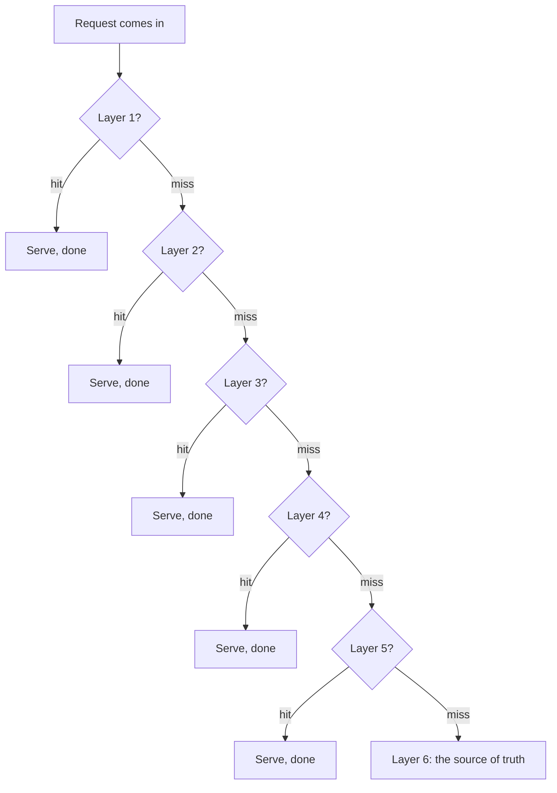
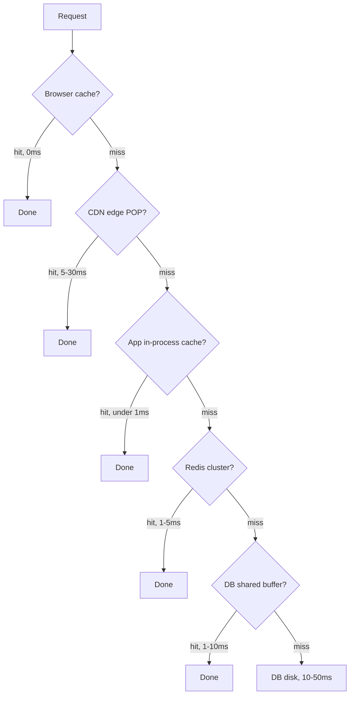
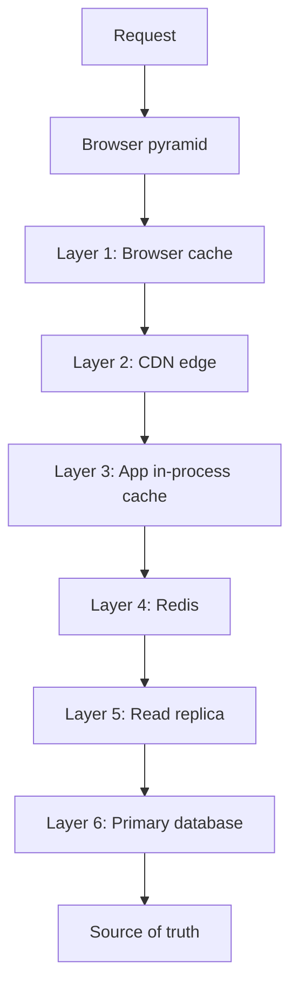
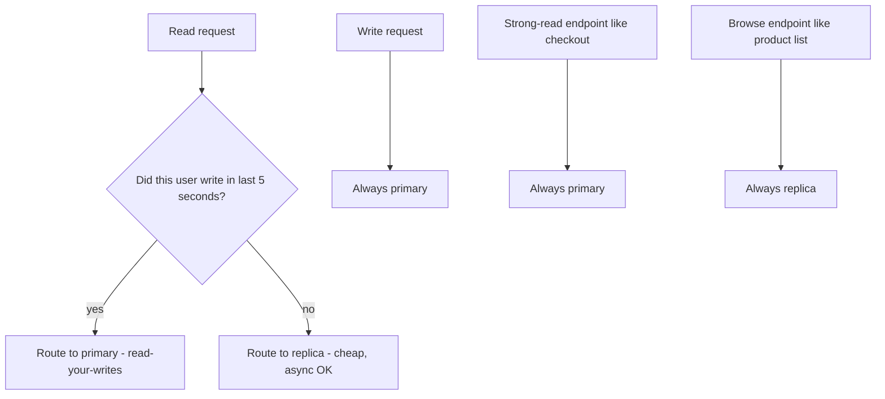
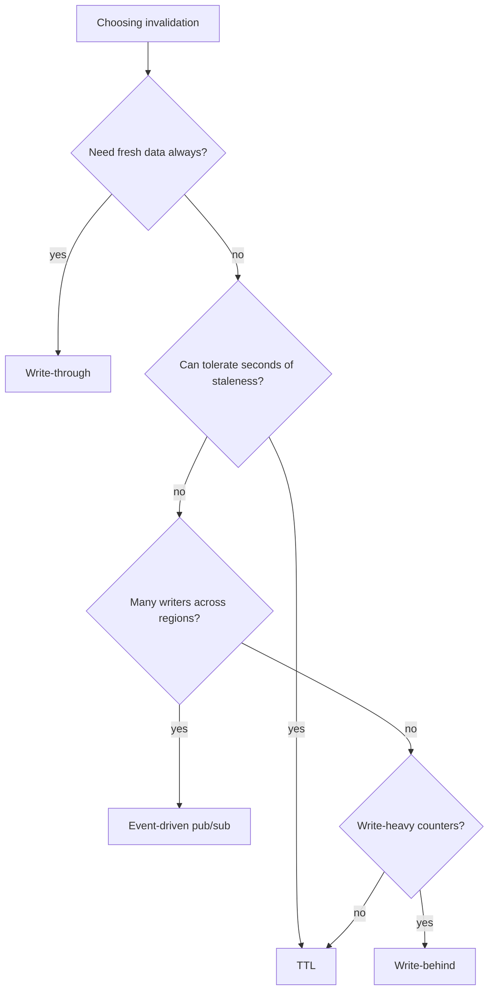
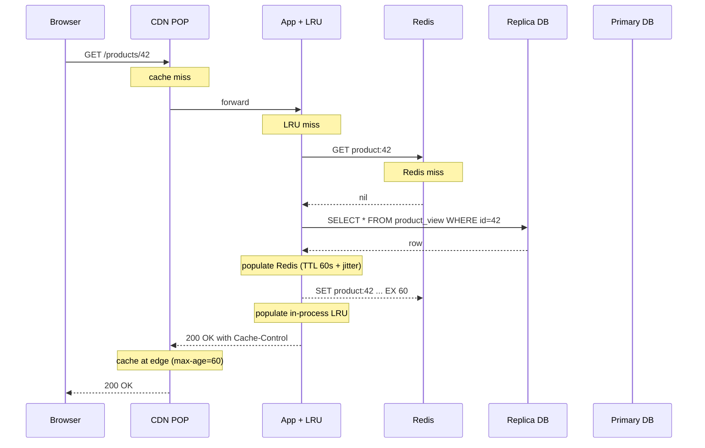
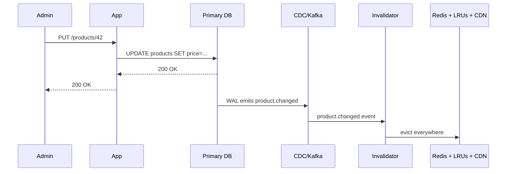


## The scene

You sit down. The interviewer slides a sketch across the desk.

> *"I have a small service. It shows a product catalog. Today: 100 users, one Postgres database, everything works. A product page loads in 30ms. My PM just told me a partner deal will bring in 100,000 users next month. Reads are 100 times more common than writes. What do you do, in order?"*

She pauses. *"Walk me through the read path as it grows. Name what breaks first. Name the fix. And tell me when NOT to use each fix."*

This is the most common shape of a "scale this" interview. The interviewer is not looking for a perfect final architecture. She is looking for whether you reach for a cache before you understand the read pattern. Whether you add Redis (a fast in-memory key-value store) before checking if a CDN (a network of servers that stores copies of pages near users) would do the same job for less money. And whether you know the difference between a read replica that helps and a read replica that just moves the problem.

The point of the problem is the toolkit. Browser cache. CDN. In-process cache. Distributed cache. Read replicas. Materialized views. Denormalization. And the **order** in which you apply them.

We will walk this from a 100-user toy to a 1M-user product. At every step we will name what breaks first, then add the smallest fix that solves it.

A few definitions before we begin, so the rest of the problem reads cleanly:

- **Cache.** Fast storage in memory, much faster than disk. The price of speed is that the data might be a few seconds out of date.
- **CDN (Content Delivery Network).** A network of servers spread around the world. Each one stores a copy of your page. Users get served from the nearest one, so the page arrives fast.
- **Read replica.** A copy of the database that handles reads but not writes. The original database (called the "primary") still handles all writes.
- **TTL (Time To Live).** How long a cached value lives before it expires. After the TTL, the cache forgets it.
- **Hit rate.** The fraction of requests that the cache could answer without going to the database. 90% hit rate means 9 out of 10 requests are served fast.

---

## Step 1: Ask the right questions

Before you draw anything, sit for five minutes. Write down questions you would ask the interviewer.

A good answer here is not "20 questions about every edge case." It is the small handful of questions that change the design if answered differently.

<details markdown="1">
<summary><b>Show: 8 questions that matter</b></summary>

1. **What is the target page load time?** Today it is 30ms. What should it be at 100k users? 50ms? 100ms? *(If the target is 200ms you can solve a lot with one Redis. If it is 20ms worldwide, you need a CDN.)*

2. **How fresh does the data need to be?** When the price changes, how stale can the shown price be? One second? Sixty seconds? Five minutes? *(This single answer decides your TTL and your invalidation strategy. Without this number, every other choice is a guess.)*

3. **What does a read look like?** Is every request a lookup by product ID? Or are there filter queries and text search too? *(Lookup by ID caches well. Text search wants its own search index.)*

4. **Is traffic uniform or hot-skewed?** Does every product get the same number of views? Or do the top 1% of products get 90% of the views? *(Hot-skewed traffic makes caching very effective. Uniform traffic makes caching almost useless.)*

5. **Where are the users?** Same country as your servers? Or spread across continents? *(Same region: skip the CDN, use Redis. Spread across the world: a CDN is the cheapest speed win money can buy.)*

6. **Same page for everyone, or personalized?** Does every user see the same product page? Or do you show user-specific prices and recommendations? *(Shared pages cache at the CDN. Personalized pages cannot.)*

7. **Are writes steady or bursty?** Is the 100x ratio always true? Or do you have a nightly batch that loads 1 million products at once? *(Bursty writes break cache invalidation strategies that assume a slow trickle.)*

8. **Does every endpoint have the same freshness need?** The product page might tolerate staleness. But the checkout price has to be exact. *(Different endpoints get different cache rules. Some get none at all.)*

The junior trap here is starting with "add Redis." You do not know yet whether Redis is even the right tool. The CDN might do 90% of the work. The in-process cache might do the other 9%. Redis might never be needed at all.

</details>

---

## Step 2: How big is this thing?

The interviewer tells you:

- 100,000 users per day, each making about 50 reads per visit.
- Reads are 100x more common than writes.
- Catalog: 1 million products. Each product is about 5KB of JSON.
- Target read time: under 50ms.
- Freshness: 60 seconds is fine for price. 5 minutes is fine for stock. The description never changes.
- Traffic is hot-skewed. The top 10,000 products serve about 80% of reads.

Compute these on paper before opening the answer:

- Reads per second (sustained and peak).
- Writes per second.
- Size of the "hot set" (the small group of products that get most of the views).
- What hit rate do you need to keep the database under 200 queries per second?

<details markdown="1">
<summary><b>Show: the math</b></summary>

**Reads.** 100,000 users x 50 reads = 5,000,000 reads per day. Divide by 86,400 seconds in a day = about **58 reads per second** sustained. For consumer traffic, peak is usually 5x sustained, so about **300 reads per second** at peak.

**Writes.** 58 / 100 = about **0.6 writes per second** sustained. About 3 per second at peak. Tiny. The catalog is updated by a few admins, not by users.

**Hot set.** Top 10,000 products x 5KB = **50MB**. This fits in a single Redis node easily. It fits in an in-process cache. It even fits in the browser cache for repeat visitors.

**Hit rate needed.** Goal: keep database under 200 QPS at the 300 reads/sec peak. The database can serve at most 200/300 = 67% of traffic. So the cache must catch at least 33%. In real life you aim for 80 to 95% so the database has room to breathe. With hot-skewed traffic and a cache holding the top 10,000 products, an 80%+ hit rate is easy to reach.

**Bandwidth.** 300 reads/sec x 5KB = 1.5 MB/sec = 12 Mbps. Tiny. No bandwidth pressure anywhere.

**What the math is telling you:**

This is a textbook read-heavy system. Small hot set. Low QPS. Almost any caching scheme works. The interview is not about *whether* to cache. It is about *which layer* to cache at, in what order, and why.

The real number to remember: reads beat writes 100 to 1. You will design for the read path. The write path is almost an afterthought.

</details>

---

## Step 3: The caching pyramid

Before drawing any architecture, draw the layers. A read request, on its way from the browser to the database, passes through up to **six tiers of cache**. Each one is roughly 10x faster than the one below it. Each one also needs its own invalidation rules and its own size budget.

Try to fill in the six layers, from fastest to slowest. For each one, name where it lives, how long the round-trip takes, and what it stores.



<details markdown="1">
<summary><b>Show: the six tiers</b></summary>



| Layer | Where it lives | Round-trip | What it stores |
|-------|----------------|------------|----------------|
| 1. Browser cache | User's own browser | 0ms (no network) | HTTP responses with cache headers |
| 2. CDN edge | Hundreds of POPs around the world | 5-30ms | Cacheable shared responses |
| 3. App in-process cache | RAM on the app server | Under 1ms | Top-N hottest items, no network hop |
| 4. Distributed cache (Redis) | Redis cluster in your datacenter | 1-5ms | Shared key-value across all pods |
| 5. DB shared buffer | RAM on the database host | 1-10ms | Hot disk pages held in memory |
| 6. Database disk | SSD on the database host | 10-50ms | The source of truth |

> **Why does each layer matter?** Because they catch different kinds of traffic. The browser cache is instant but only helps the same user on the same device. The CDN helps users in distant places. The in-process cache helps the same pod serve hot items fast. Redis shares the hot set across all your pods. The replica handles cold reads. The primary handles writes. Each layer takes a slice off the layer below it.

The pattern is simple. Try the fastest layer first. On miss, fall through to the next. On the way back, populate each layer above so the next request hits faster.



Each layer has the same three concerns:

1. **What goes in it.** Not everything is cacheable. Personalized pages cannot sit in the CDN. Live counters do not belong in long-TTL caches.
2. **How long it lives.** TTL is the simplest rule. Pub/sub events are the most accurate. Write-through is the most consistent.
3. **How big it is.** Browser is limited by the user's disk. CDN is paid by GB-month. Redis is paid by RAM. In-process is limited by your pod's RAM.

Which layers do you skip? Depends on the workload:

- **Browser cache:** always on for images and CSS. Skipped for dynamic API responses unless you set headers.
- **CDN:** skip if every response is personalized. Otherwise it is the cheapest win.
- **In-process:** great with 10 to 50 pods. Bad with 1000 pods because invalidation gets messy.
- **Redis:** almost always on at scale. Skip only at toy scale.
- **DB shared buffer:** you do not control it directly. You tune `shared_buffers` to fit your hot set.
- **Database:** never skipped. It is the source of truth.

</details>

---

## Step 4: Draw the system

You know the layers. Now draw the boxes that connect them.

Try to fill in the missing pieces below. Five boxes are missing. Think about: where does the user's request first touch a server, what sits between the app and the database, and what is the actual source of truth.

```
                     User browser
                          |
                          v
                  +---------------+
                  |  [ ? 1 ]      |  spread around the world; caches
                  |               |  shared GET responses
                  +-------+-------+
                          |  cache miss
                          v
                  +---------------+
                  |  Load Balancer|
                  +-------+-------+
                          |
                          v
                  +---------------+
                  |  App Server   |
                  |  +---------+  |
                  |  | [ ? 2 ] |  |  RAM on the server,
                  |  |         |  |  sub-millisecond
                  |  +---------+  |
                  +---+-------+---+
                      |       |
            on miss   |       |  on miss
                      v       |
              +-------------+ |
              |  [ ? 3 ]    | |  cluster, shared across pods
              +------+------+ |
                     | on miss|
                     v        |
                      +---------------+
                      |  [ ? 4 ]      |  read traffic only;
                      |               |  async replicated
                      +-------+-------+
                              |  writes only
                              v
                      +---------------+
                      |  [ ? 5 ]      |  single source of truth;
                      |               |  accepts writes
                      +---------------+
```

<details markdown="1">
<summary><b>Show: the full read-path architecture</b></summary>

```
                     User browser
                          |
                          | (browser HTTP cache checked first;
                          |  always present, not shown)
                          v
                  +---------------+
                  |      CDN      |  CloudFront / Fastly / Cloudflare.
                  |  (edge POPs)  |  Caches GET responses tagged
                  |               |  Cache-Control: public, max-age=N
                  +-------+-------+  About 80% of reads end here.
                          |  cache miss
                          v
                  +---------------+
                  |  Load Balancer|  ALB / Envoy / nginx. Stateless.
                  +-------+-------+
                          |
                          v
                  +---------------+
                  |  App Server   |  Stateless. Horizontal.
                  |  +---------+  |
                  |  | LRU in- |  |  Per-pod RAM map. 10-50 MB.
                  |  | process |  |  Hit: under 1ms. No network.
                  |  | cache   |  |
                  |  +---------+  |
                  +---+-------+---+
                      |       |
            on miss   |       |
                      v       |
              +-------------+ |
              |   Redis     | |  Cluster, 1-5ms. Shared across
              |  (cluster)  | |  all pods. ~10 GB hot set.
              +------+------+ |
                     | on miss|
                     v        |
                      +---------------+
                      | Read Replicas |  Postgres async replicas.
                      |  (Postgres)   |  Replication lag ~1s P99.
                      |               |  Routed by region.
                      +-------+-------+
                              |  writes only
                              v
                      +---------------+
                      |   Primary DB  |  Postgres single primary.
                      |  (Postgres)   |  Accepts all writes.
                      +-------+-------+
                              |
                              | change events (CDC)
                              v
                      +---------------+
                      |  Invalidator  |  Reads writes, publishes
                      |   service     |  cache-purge events.
                      +---------------+
                              |
                              v
                      Redis pub/sub channel; app pods subscribe
                      and evict their in-process entries. CDN
                      gets purge calls for hot keys.
```

What each piece does, in one line:

- **CDN.** Cheapest latency win. Stores shared responses near the user. Catches ~80% of reads.
- **Load Balancer.** Stateless. Routes to a healthy pod.
- **App Server with in-process LRU.** Holds the top 1000 hottest keys in RAM. Zero network. Sub-ms.
- **Redis.** Shared across all pods in the region. Holds the next 10k to 100k warm keys.
- **Read Replicas.** Serve cache misses. Replication lag is about 1 second.
- **Primary DB.** Source of truth. Handles all writes.
- **CDC + Invalidator.** Listens to writes. Publishes "evict this key" events to all caches.

> **Why a CDN before Redis?** Because for shared responses the CDN is cheaper and faster. A CDN POP is closer to the user than your Redis is. And the CDN often comes free up to a tier. Add it first. Then add Redis to catch what the CDN cannot (cache misses, personalized parts, fast-changing data).

</details>

---

## Step 5: Read replicas

A **read replica** is a copy of the database that accepts only reads. The primary takes writes. The replica streams the write-ahead log (WAL) and applies the same writes. Reads route to the replica, freeing the primary.

Three things to know:

1. **Replication is async.** A write committed on the primary is not yet visible on the replica. Typical lag: 10-500ms. Can spike to seconds under load.
2. **Read-your-writes problem.** A user submits a form (write to primary), then refreshes the page (read from replica), and sees the old data because the write has not propagated yet.
3. **Routing matters.** You have to decide which reads go to the replica and which must go to the primary anyway.

When do you add a replica? How many? How do you handle the read-your-writes case?

<details markdown="1">
<summary><b>Show: replica strategy</b></summary>

**Add the first replica when:**

- Read QPS on the primary is over 50% of capacity, OR
- Read latency on the primary is bad because writes are competing for IOPS, OR
- You need a failover target.

**Add more replicas when:**

- Reads on existing replicas exceed 50% of capacity, OR
- You need a replica per region for latency.

Typical numbers: 1 primary + 2 replicas for redundancy. 1 primary + N replicas (N per region) for global apps.

**Do NOT add replicas when:**

- Your database is bottlenecked on **writes**. Replicas do not help writes. They amplify them.
- Your cache hit rate is already 95%+. The database barely sees traffic. Fix the cache instead.
- Your queries are slow due to bad indexes. Replicating bad queries just spreads the pain.

**Routing rule of thumb:**



The **5-second pin** is a common pattern. After a user writes, their next reads go to the primary for a short window. You set a session cookie like `pin_to_primary_until=<timestamp>`. After 5 seconds, replica routing resumes.

> **Why 5 seconds?** Because typical replication lag is well under 1 second, but you want a safety margin. 5 seconds is long enough to cover even a slow replica, short enough that the primary does not get overloaded by all the pinned users.

**Monitor `replication_lag_seconds`** per replica. P99 should stay under 1s. Alert at >5s. Page at >30s. If lag is bigger than your pin window, you have a correctness bug. Either fix the lag (more IOPS, faster replication) or increase the pin window.

When a replica falls behind, route around it. Most connection pools (pgbouncer, RDS Proxy) support this. When all replicas are gone, fall back to primary. Accept the load increase. Alert loudly.

</details>

---

## Step 6: Denormalization and materialized views

Sometimes caching is not enough. The query itself is slow. A 4-table JOIN that recomputes for every request. An aggregate that scans millions of rows. A search that needs full-text matching.

Two patterns precompute the answer so the read is a flat lookup:

- **Denormalization.** Fold the result of a JOIN into one wider table. Update it on writes via trigger or CDC.
- **Materialized view.** Store the result of a query like a cached query result. Refresh on a schedule.

When do you reach for these? How do they interact with the caching pyramid?

<details markdown="1">
<summary><b>Show: when to denormalize vs materialize</b></summary>

**The normalized version**, the kind that runs on every product page view:

```sql
SELECT
  p.product_id, p.name, p.description,
  c.category_name,
  AVG(r.rating) AS avg_rating,
  COUNT(r.review_id) AS review_count
FROM products p
JOIN categories c ON c.category_id = p.category_id
LEFT JOIN reviews r ON r.product_id = p.product_id
WHERE p.product_id = ?
GROUP BY p.product_id, c.category_name;
```

Even cached, the cache-miss path is slow (200-500ms for popular products with many reviews).

**The denormalized version** is a single-row lookup:

```sql
CREATE TABLE product_view (
    product_id     BIGINT PRIMARY KEY,
    name           TEXT NOT NULL,
    description    TEXT NOT NULL,
    category_name  TEXT NOT NULL,      -- denormalized from categories
    avg_rating     NUMERIC(2,1),       -- precomputed
    review_count   INTEGER,            -- precomputed
    last_updated   TIMESTAMPTZ
);
```

Sub-millisecond, even uncached.

**Three ways to keep it fresh:**

1. **Triggers** on `products`, `categories`, or `reviews` recompute `product_view` for the affected `product_id`. Simple. But couples writes, so writes get slower.
2. **CDC stream** (Debezium or similar) reads the WAL and publishes change events. A consumer recomputes the row asynchronously. Writes stay fast.
3. **Scheduled refresh** recomputes nightly. Coarse. Up to 24h staleness. Fine for cold data, not for a live catalog.

**Postgres materialized views** are a separate tool:

```sql
CREATE MATERIALIZED VIEW top_products_by_category AS
SELECT category_id, product_id, view_count
FROM product_views
WHERE view_count > 1000
ORDER BY view_count DESC;

REFRESH MATERIALIZED VIEW CONCURRENTLY top_products_by_category;
```

Stored physically like a table. Indexes work. REFRESH re-runs the underlying query. CONCURRENTLY lets reads continue during refresh. Best for analytics queries that are read often and updated rarely.

**Quick decision guide:**

| Scenario | Pick |
|----------|------|
| Single-row lookup that joins 3 tables, often updated | Denormalize with CDC |
| Aggregate across millions of rows, updated nightly | Materialized view, scheduled REFRESH |
| Search across all products | Separate search index (Elasticsearch, Postgres FTS) |
| Per-user feed | Neither. Different problem. |
| Top-N leaderboard | Materialized view refreshed every minute |

**The trade-off is write amplification.** Denormalization makes reads faster and writes slower. Every write to `products` triggers a recompute of `product_view`. At a 100x read-to-write ratio this is a clear win. At 10x or less, reconsider.

**Where this fits in the pyramid.** Denormalized tables sit *below* the cache. The cache still caches the result. The denormalization makes the cache-miss path fast. Without it, a cache miss costs 200ms. With it, 5ms. Both layers compound.

</details>

---

## Step 7: Cache invalidation, the hardest problem

Phil Karlton's famous quote: *"There are only two hard things in computer science: cache invalidation and naming things."*

Four patterns to know:

1. **TTL.** Each cached entry expires after N seconds. Simple. Tolerates up to N seconds of staleness.
2. **Write-through.** Update the cache on every write. Always consistent with the DB. But writes get slower.
3. **Write-behind.** Update the cache, queue the DB write asynchronously. Fast writes, but queue loss equals data loss.
4. **Event-driven invalidation.** Publish events on writes. Caches subscribe and evict affected keys.

When do you use each?



<details markdown="1">
<summary><b>Show: invalidation patterns, when each fits</b></summary>

### TTL

```
SET product:42 "{json}" EX 60     # Redis: expires in 60 seconds
```

Use when staleness is acceptable up to the TTL. Simplest pattern. Most predictable to run. The TTL becomes the staleness contract with the user.

> **Add jitter.** If 1000 entries all have a 60s TTL set at the same moment, they all expire at the same second. 1000 misses hit the database at once. Solution: TTL = 60s ± 10%. Spreads the expiry.

Good fit: product catalog with 60s TTL. Price changes visible within a minute. Fine for browse. Not for checkout.

### Write-through

```python
def update_product(p):
    db.update(p)        # write to DB
    cache.set(p)        # then update cache
```

Use when read consistency matters and writes are infrequent. Cache stays consistent. But writes are slower because two operations happen.

**The race condition:** two writers. Writer A writes 5 to DB. Writer B writes 7 to DB. Then A writes 5 to cache. Then B writes 7 to cache. Cache ends with 7, matches DB. But reorder: A writes DB(5), B writes DB(7), B writes cache(7), A writes cache(5). Now cache has 5; DB has 7. Inconsistent.

Fix: cache-aside (invalidate instead of writing the cache). Let the next read populate the cache fresh.

Good fit: a config service where writes are rare and reads must see the latest config right away.

### Write-behind

```python
def update_product(p):
    cache.set(p)              # update cache first
    queue.publish(p)          # async DB write
```

Use when writes are very frequent and some data loss is acceptable. Risk: queue loss = data lost from the source of truth. Often used for counters (view counts, like counts) where exact accuracy matters less than throughput.

Good fit: page view counter. Buffer in Redis. Flush to DB every minute.

### Event-driven invalidation

```python
def update_product(p):
    db.update(p)
    kafka.publish("product.updated", {"product_id": p.id})

# Subscribers (every app pod):
def on_product_updated(event):
    in_process_cache.evict(event.product_id)
    redis.delete(f"product:{event.product_id}")
    cdn.purge(f"/products/{event.product_id}")
```

Use when multiple cache layers all need invalidating. More accurate than TTL. Staleness is bounded by event propagation lag (usually under 1 second). Operationally heavier. Needs a pub/sub system like Kafka or Redis pub/sub.

Good fit: a price change has to propagate to in-process caches on 50 app pods, Redis, and the CDN within seconds. TTL alone could take a minute. Event-driven gets it down to seconds.

> **The right answer is usually a mix.** TTL as the safety net (caps staleness even if the event system fails). Event-driven as the primary path (fast and accurate). Write-through only for endpoints where consistency is non-negotiable. Write-behind only for fire-and-forget counters.

**The CDN twist.** CDN invalidation is slow (seconds to minutes) and not free. Two approaches:

- **Versioned URLs.** Instead of `/products/42`, serve `/products/42?v=17`. On update, bump the version. Old URL stays cached but never requested again. New URL is uncached, fetched fresh. Effectively instant invalidation.
- **Purge API.** Call CloudFront/Fastly purge with the affected URL. Takes 5-30 seconds to propagate. Free at low volume, paid at high.

For a catalog: versioned URLs for product pages. Purge API for hot pages you need to drop immediately (legal takedown, mispriced item).

</details>

---

## Follow-up questions

Try answering each in 2 to 4 sentences before reading the solution.

1. **Cache stampede.** A popular product's cache entry expires at exactly the moment 1000 users hit refresh. They all miss, they all hit the DB, the DB CPU spikes, some requests time out. What patterns prevent this?

2. **Cache fallback when Redis is down.** Your Redis cluster is unreachable for 10 minutes. Every read is now a cache miss. What does the app do? Does it just slam the DB? How do you survive this gracefully?

3. **Personalized pages and the CDN.** Your product page now shows "recommended for you" based on browsing history. You cannot cache the page at the CDN anymore. What changes? Can you still cache *parts* of the page?

4. **Read-your-writes.** A user updates their profile and refreshes immediately. The replica has not applied the write. They see their old name. How do you fix this without sending all reads to the primary?

5. **Hot key in Redis.** One specific product key gets 10,000 req/s. Redis is single-threaded. That key's shard pegs at 100% CPU while others sit idle. What do you do?

6. **CDN cache miss thundering herd.** A new product launches. 100,000 users hit the launch page at the same second. None of them hit the CDN cache. They all hit the origin. How do you survive this?

7. **Cache key design.** You cache `product:42`. Then you add a feature where staff users see internal pricing. Should you cache `product:42:staff` separately? `product:42:role:<role>`? What is the trade-off?

8. **Replication lag spike during a backfill.** You import 10M products overnight. Replication lag balloons to 5 minutes. Reads from the replica start serving very stale data. What do you do during the backfill?

9. **Cache size estimation.** You have 1M products at 5KB each = 5GB. Your Redis node has 8GB of RAM. Is that enough? What do you forget when sizing?

10. **The endpoint that should never be cached.** Inventory count at checkout must be exact (you cannot oversell). Everything else (browse, search, recommendation) can be cached. How do you enforce "this endpoint must always hit the source of truth" across a team of 30 engineers?

---

## Related problems

- **[URL Shortener (001)](../001-url-shortener/question.md).** The canonical read-heavy system. A single shortcode mapped to a key-value lookup, cached. The hot-key problem and the CDN strategy both show up there.
- **[Distributed Cache (009)](../009-distributed-cache/question.md).** The Redis layer of this design, in depth. Eviction policies, replication, hot-key handling.
- **[News Feed (002)](../002-news-feed/question.md).** The personalized read-heavy case. The CDN-friendly catalog approach in this problem does not work for feeds. That one needs precomputed timelines per user.
- **[Approval Management (011)](../011-approval-management/question.md).** The "my pending approvals" dashboard is a read-heavy view that benefits from exactly the patterns in this problem.


<div class="pr-solution-divider"></div>


## Solution: Read-Heavy System Patterns

### The short version

A read-heavy system (100x reads to writes, small hot set, hot-skewed traffic) is solved by stacking caches in front of the source of truth. Each layer is about 10x faster than the one below. Each one handles a different slice of traffic.

The CDN catches shared cacheable responses. The in-process cache catches the top-N hottest keys per pod. Redis catches the warm tail across all pods. Read replicas catch the cold misses. The primary serves writes and a tiny slice of reads.

The hard work lives in three places. First, knowing when *not* to add a layer. An in-process cache hurts when you have 1000 pods. A CDN is useless if every response is personalized. Second, invalidation. TTL is the safety net. Event-driven pub/sub is the primary path. Write-through is only for endpoints where reads cannot be stale. Third, the failure modes. Cache stampede on cold-miss-of-hot-key. Hot-key shard saturation in Redis. Read-your-writes when reads are routed to replicas. Graceful fallback when the cache itself dies.

The scaling journey is short. Most read-heavy systems never need more than a CDN, a Redis cluster, two read replicas, and a denormalized view table for the most expensive queries. Past that, the answers become regional (per-region Redis, per-region replicas).

---

### 1. The clarifying questions, in one paragraph

The single most important question is *how fresh does the data need to be?* Without that number every other choice is a guess. The second most important question is *what does a read look like?* Lookup by ID caches well. Filter and search do not. The third is *is traffic hot-skewed or uniform?* Hot-skewed makes caching trivial. Uniform makes caching almost useless. The fourth is *personalized or shared?* Shared caches at the CDN. Personalized cannot.

Everything else (CDN choice, replica count, denormalization, multi-region) follows from these four answers.

The biggest junior mistake here is jumping to "Redis" without first asking whether the requests are even cacheable. A catalog page is cacheable. A user-specific cart is not. The same Redis handles both, but the strategy is completely different.

---

### 2. The math, in plain numbers

| What | Number |
|------|--------|
| Reads per day | 5 million |
| Reads per second sustained | ~58 |
| Reads per second peak | ~300 |
| Writes per second sustained | ~0.6 |
| Writes per second peak | ~3 |
| Catalog size | 1M products x 5KB = 5GB |
| Hot set | Top 10k products x 5KB = 50MB |
| Required cache hit rate | 33% minimum, 80-95% in practice |

The throughput is small. A single Postgres handles it. The real numbers to remember:

- **80%+ hit rate is easy** because traffic is hot-skewed.
- **Hot set fits in 50MB.** Cheap to cache anywhere.
- **Reads beat writes 100 to 1.** Design for the read path. The write path is almost an afterthought.

This is not a throughput problem. It is a latency + geography + graceful-degradation problem.

---

### 3. The API

A read-heavy service usually has three shapes of endpoint. Each one has a different caching strategy. Mixing them up is how teams ship correctness bugs.

**Shape A: cacheable shared response.** The kind you want sitting in the CDN.

```
GET /api/v1/products/42
Cache-Control: public, max-age=60, stale-while-revalidate=300

{
  "product_id": 42,
  "name": "Headphones",
  "price_cents": 4999,
  "currency": "USD",
  "description": "...",
  "image_url": "https://cdn.example.com/p/42.jpg",
  "avg_rating": 4.6,
  "review_count": 1284,
  "category": "Electronics > Audio"
}
```

`Cache-Control: public, max-age=60` lets the CDN and the browser cache it for a minute. `stale-while-revalidate=300` lets the CDN keep serving the stale value for 5 minutes while a background refresh runs. The user never waits.

> **Why stale-while-revalidate?** Because when the cache expires at second 0, you do not want 1000 concurrent requests all hitting the database trying to refresh it. With stale-while-revalidate, you serve the stale value for 1 more second while ONE worker refreshes in the background. The rest of the traffic stays fast.

**Shape B: personalized read.** The response depends on who is asking.

```
GET /api/v1/products/42/personalized
Cache-Control: private, max-age=30
Vary: Authorization

{
  "product_id": 42,
  "your_last_viewed": "2026-05-22T10:11:00Z",
  "personalized_price_cents": 4499,
  "in_your_wishlist": true
}
```

`private` keeps it out of the CDN. Only the user's browser caches it. `Vary: Authorization` is the explicit signal that the response depends on who is asking. Short TTL because users expect this to feel live.

**Shape C: strong-read endpoint.** Caching is just wrong here.

```
GET /api/v1/cart/total
Cache-Control: no-store
X-Read-Consistency: strong

{
  "subtotal_cents": 9998,
  "tax_cents": 800,
  "total_cents": 10798,
  "computed_at": "2026-05-22T10:15:34Z"
}
```

`no-store` means never cache, anywhere. The custom header tells the routing layer to skip the replica and hit the primary. The caller can trust the price is exact.

These three endpoints share a code base but route through different cache tiers. The junior mistake is slapping a uniform cache on everything. You end up caching the cart total and either overcharging or undercharging customers.

---

### 4. The data model

A read-heavy system has two halves. The **normalized source-of-truth tables** on the write side (small, strict schema). And the **denormalized read-side views** on the read side (wider, optimized for what the API actually returns).

```sql
-- Source of truth: normalized.
CREATE TABLE products (
    product_id      BIGINT PRIMARY KEY,
    name            TEXT NOT NULL,
    description     TEXT,
    category_id     BIGINT REFERENCES categories(category_id),
    price_cents     INT NOT NULL,
    currency        CHAR(3) NOT NULL,
    created_at      TIMESTAMPTZ NOT NULL DEFAULT NOW(),
    updated_at      TIMESTAMPTZ NOT NULL DEFAULT NOW(),
    version         INT NOT NULL DEFAULT 1            -- bumped on every write
);
CREATE INDEX idx_products_category ON products (category_id);
CREATE INDEX idx_products_updated ON products (updated_at);

CREATE TABLE categories (
    category_id     BIGINT PRIMARY KEY,
    category_name   TEXT NOT NULL,
    parent_id       BIGINT REFERENCES categories(category_id)
);

CREATE TABLE reviews (
    review_id       BIGINT PRIMARY KEY,
    product_id      BIGINT REFERENCES products(product_id),
    rating          SMALLINT NOT NULL CHECK (rating BETWEEN 1 AND 5),
    review_text     TEXT,
    created_at      TIMESTAMPTZ NOT NULL DEFAULT NOW()
);
CREATE INDEX idx_reviews_product ON reviews (product_id);

-- Read-side: denormalized for the product page.
CREATE TABLE product_view (
    product_id      BIGINT PRIMARY KEY,
    name            TEXT NOT NULL,
    description     TEXT,
    category_name   TEXT NOT NULL,           -- denormalized
    category_path   TEXT NOT NULL,           -- "Electronics > Audio > Headphones"
    price_cents     INT NOT NULL,
    currency        CHAR(3) NOT NULL,
    avg_rating      NUMERIC(2,1),            -- precomputed
    review_count    INT NOT NULL DEFAULT 0,  -- precomputed
    version         INT NOT NULL,            -- from products.version
    refreshed_at    TIMESTAMPTZ NOT NULL DEFAULT NOW()
);

-- Materialized view: top products per category.
CREATE MATERIALIZED VIEW top_products_per_category AS
SELECT
    p.category_id,
    p.product_id,
    p.name,
    COUNT(DISTINCT v.user_id) AS distinct_viewers_30d
FROM products p
JOIN product_views v ON v.product_id = p.product_id
WHERE v.viewed_at > NOW() - INTERVAL '30 days'
GROUP BY p.category_id, p.product_id, p.name
ORDER BY p.category_id, distinct_viewers_30d DESC;

CREATE UNIQUE INDEX idx_top_products ON top_products_per_category (category_id, product_id);
```

The cache keys mirror the same split:

| Key | Value | TTL | Invalidated by |
|-----|-------|-----|----------------|
| `product:{id}:v{ver}` | full product JSON | 1h | URL is versioned; new version replaces |
| `product:{id}` | full product JSON | 60s | TTL + pub/sub event |
| `category:{id}:top:v{ver}` | top product IDs list | 5min | TTL + nightly refresh |
| `search:{normalized_query}:p{page}` | result page | 5min | TTL only |
| `user:{uid}:cart` | cart contents | 5min | write-through on cart update |
| `user:{uid}:pinned_until` | timestamp | 5s | TTL only |

Two choices worth defending:

**Versioning the key.** `product:{id}:v{ver}` means when a price changes you bump `products.version`. Cached reads use the old key. New reads use the new key. The old key expires naturally with no explicit purge. The CDN URL gets `?v={ver}` for the same reason.

**Version inside the value too.** Lets the app detect stale cache writes. *"I have v3 in cache. The DB says v5. Evict and refresh."*

---

### 5. Order of operations as the system grows

This is the lesson of the problem. The order in which you reach for each tool, and the conditions under which each one is wrong.

**The order:**

1. **HTTP cache headers + CDN.** Cheapest. Often free up to a tier. Catches the largest slice of cacheable traffic.
2. **Distributed cache (Redis).** Next-cheapest. Catches per-key lookups the CDN cannot (URL-level caching does not work for personalized URLs).
3. **Read replicas.** When the primary's read load is causing write latency to suffer. Not before.
4. **In-process LRU.** When the top-N hot keys are saturating Redis, or when you want sub-millisecond reads for the hottest items.
5. **Denormalization / materialized views.** When the cache-miss path is too slow because the underlying query is expensive.
6. **Per-region everything.** When latency targets cannot be met from a single region.

**The anti-order**, what NOT to do:

- Adding Redis before knowing if responses are cacheable.
- Adding read replicas before checking cache hit rate. (If hit rate is 5%, fixing it is better than adding replicas.)
- Denormalizing aggressively before measuring query time. (Premature write amplification.)
- Building per-region from day one. (Most apps never need it.)
- Building a custom cache when Redis or memcached would do.

**The decision tree at each stage:**

```
Which layer do I add next?

Is read latency too high?
  - Users far from origin?               -> CDN
  - Every request hits the DB?           -> Redis
  - Cache misses are slow?               -> Denormalize
  - Redis overloaded on one key?         -> In-process LRU
    (or Redis itself the bottleneck?)    -> Read replica + Redis shard

Is the DB CPU too high?
  - Primary handling reads it shouldn't? -> Read replica
  - Queries slow due to bad indexes?     -> Fix indexes (not a caching problem)
  - Writes too frequent for cache?       -> Write-behind for non-critical

Is the cache hit rate low?
  - TTLs too short?                      -> Increase TTL within freshness budget
  - Hot set bigger than cache?           -> Bigger cache, different key shape
  - Workload uniform (no hot keys)?      -> Caching won't help; rethink
```

---

### 6. The architecture, drawn out

Multi-region. All six cache tiers. Invalidation path running off the primary via CDC.

```
                              User browser
                                   |
                                   | (1) browser HTTP cache check
                                   v
                          +-----------------+
                          |  Browser cache  |  hit? -> done
                          +--------+--------+
                                   | miss
                                   v
                          +-----------------+
                          |     CDN POP     |  CloudFront / Fastly / Cloudflare.
                          |   (regional)    |  Cache-Control: public, max-age=60
                          |                 |  hit? -> done (~10ms)
                          +--------+--------+
                                   | miss
                                   v
                          +-----------------+
                          | Origin LB       |  Routes to nearest healthy region.
                          +--------+--------+
                                   |
              +--------------------+--------------------+
              |                    |                    |
              v                    v                    v
        +----------+         +----------+         +----------+
        |  Region  |         |  Region  |         |  Region  |
        |  us-east |         |  eu-west |         |  ap-south|
        |          |         |          |         |          |
        | +------+ |         | +------+ |         | +------+ |
        | |  LB  | |         | |  LB  | |         | |  LB  | |
        | +--+---+ |         | +--+---+ |         | +--+---+ |
        | +--v---+ |         | +--v---+ |         | +--v---+ |
        | | App  | |         | | App  | |         | | App  | |
        | | +LRU | |         | | +LRU | |         | | +LRU | |
        | +--+---+ |         | +--+---+ |         | +--+---+ |
        | +--v---+ |         | +--v---+ |         | +--v---+ |
        | |Redis | |         | |Redis | |         | |Redis | |
        | |clstr | |         | |clstr | |         | |clstr | |
        | +--+---+ |         | +--+---+ |         | +--+---+ |
        | +--v---+ |         | +--v---+ |         | +--v---+ |
        | | Read | |         | | Read | |         | | Read | |
        | |replic| |         | |replic| |         | |replic| |
        | +--+---+ |         | +--+---+ |         | +--+---+ |
        +----+-----+         +----+-----+         +----+-----+
             |                    |                    |
             +--------------------+--------------------+
                                  | writes only
                                  v
                          +-----------------+
                          |   Primary DB    |  Postgres single primary.
                          |   (Postgres)    |  Source of truth.
                          +--------+--------+
                                   |
                                   | CDC (Debezium / logical replication)
                                   v
                          +-----------------+
                          |   Kafka topic   |  product.changed
                          +--------+--------+
                                   |
                +------------------+------------------+
                v                  v                  v
         +-------------+    +-------------+   +-------------+
         | View-table  |    | Cache       |   | CDN purge   |
         | updater     |    | invalidator |   | worker      |
         | (recomputes |    | (Redis pub/ |   | (calls CDN  |
         | denormalized|    | sub; pods   |   | purge API   |
         | rows)       |    | evict)      |   | for hot     |
         |             |    |             |   | URLs)       |
         +-------------+    +-------------+   +-------------+
```

Five things to notice:

- **Browser cache is free.** Just `Cache-Control` headers. No infrastructure cost.
- **CDN serves ~80% of cacheable traffic** with sub-30ms latency.
- **In-process LRU per pod (10-50MB)** catches the hottest keys with zero network.
- **Per-region Redis (5-10GB)** catches the warm tail, shared across all pods in the region.
- **Per-region read replicas** serve cache misses. Lag under 1s P99.
- **CDC pipeline** decouples writes from downstream consumers. The view-table updater recomputes denormalized rows. The invalidator drops Redis keys. The CDN purge worker calls the CDN API.

---

### 7. A cache-miss read, drawn end to end

Here is a single read working its way down through all the cache tiers, missing each one, hitting the replica, and re-warming everything on the way back up.



Later: an admin updates the price. The invalidation flow runs:



Each layer populates the one above it on the way back up. The system self-warms. The invalidation path is decoupled from the write path. The write commits. The response returns. The cache eviction happens asynchronously.

**Bounded staleness** in the worst case is the longer of (TTL, propagation lag through Kafka and pub/sub). Typically under 2 seconds.

**P95 budget:** cache hit at any layer is 30-50ms including network. A full miss to the DB is 80-150ms.

---

### 8. Read path and write path in words

**The read path for `GET /products/42`:**

1. Browser checks its HTTP cache. Hit? Serve from disk. Zero network. Done.
2. Browser hits the nearest CDN POP. Cached and not expired? Serve. ~10ms.
3. CDN miss. POP forwards to the origin LB. LB routes to the nearest healthy region.
4. Regional LB forwards to an app pod.
5. Pod checks its in-process LRU by `product:42`. Hit? Sub-ms.
6. LRU miss. Pod queries Redis. Hit? Copy into LRU. Serve. 1-5ms.
7. Redis miss. Pod queries the regional read replica. Populate Redis (TTL 60s + jitter). Serve. ~30ms.
8. Replica miss (down, or row not yet replicated). Fall back to primary.
9. Primary miss. Row genuinely does not exist. Return 404.

**The write path for `PUT /products/42`:**

1. Client to CDN to LB to regional LB to app pod. (CDN never caches writes.)
2. Pod validates the request and checks auth.
3. Pod writes to the **primary** DB. (Writes always go to primary.)
4. DB write succeeds. Pod publishes `product.changed` event to Kafka: `{product_id: 42, version: 5}`.
5. Pod responds 200 to the client.
6. Asynchronously, downstream consumers act:
   - **View-table updater** recomputes `product_view` for product 42.
   - **Cache invalidator** publishes `evict: product:42` on Redis pub/sub. All app pods drop the key from their LRU and from Redis.
   - **CDN purge worker** calls the CDN purge API for `/products/42`. Takes 5-30s to fully propagate.
7. Replicas pick up the write within ~1s via standard streaming replication.

The write path is slower than the read path because it has more side effects. But writes are 1/100th of reads. Total system load is dominated by reads.

**Read-your-writes** works through a session cookie. When the app pod processes a write, it sets `pin_to_primary_until=<now + 5s>` on the response. On subsequent reads from the same client, the pod inspects the cookie. If the timestamp is in the future, the read routes to the primary instead of the replica. After 5 seconds (longer than worst-case replication lag) the cookie expires and reads resume from the replica.

Costs almost nothing. At 3 writes/sec, at most 15 pinned users concurrently. Eliminates the most common consistency bug users notice.

---

### 9. The scaling journey: 100 to 1 million users

Each stage has one big architectural change driven by a concrete pain point. Build nothing preemptively.

#### Stage 1: 10 to 100 users

Single Postgres. Single app server. No cache. About 10 reads/min. 0.1 writes/min. P95 = 30ms. Cost: ~$50/month.

Nothing to optimize. Postgres handles hundreds of QPS for indexed lookups. The app server sits at 5% CPU. The interviewer should stop you if you try to add Redis here.

What you do not have: no CDN, no cache, no read replicas. What breaks next is geographic latency once you take on users in distant regions. That is solved by a CDN alone.

#### Stage 2: 10,000 users

Add Redis in front of the hottest read endpoints. ~6 reads/sec sustained, ~20 peak. Writes still ~0.2/sec.

**What broke:** P95 is now 80ms. The catalog page does a 3-table JOIN. Takes 60ms even on warm data. Every read hits Postgres.

**The fix:** Redis in front of `GET /products/{id}`. TTL 60s. Key `product:{id}`. Value: the full denormalized JSON. Cache-aside: pod checks Redis first. On miss, queries Postgres. Populates Redis. Returns. TTL gets ±10% jitter.

**Numbers:** Cache hit rate ~80% (hot-skewed traffic). DB QPS drops from ~6/sec to ~1.2/sec. P95 on hit: 5ms. On miss: 30ms. Weighted: ~8ms. Cost: ~$150/month.

What you do NOT add yet:
- No CDN (most users in one region).
- No read replicas (DB barely loaded).
- No in-process LRU (only 2-3 app pods, marginal benefit).
- No denormalization (JOIN is fast enough on cache miss).

**Common mistake at this stage:** caching the wrong endpoints. Caching the cart total is a correctness bug. Caching the search-results page works but does not help much (too many distinct queries).

#### Stage 3: 100,000 users

Add CDN, replicas, event-driven invalidation, in-process LRU. ~58 reads/sec sustained, ~300 peak. Writes ~3 peak.

**What broke:**
- Users on three continents complain about 250ms+ load from APAC.
- The 60s TTL is too slow. A flash sale changes prices. 60 seconds of stale prices generates complaints.
- Primary DB CPU climbs because reads compete with the nightly catalog import.

**The fixes:**

1. **CDN in front of all GET endpoints.** `Cache-Control: public, max-age=60`. Catches ~70% of reads at the edge. Global P95 drops to 30ms.
2. **Two read replicas.** Reads route to replicas. Writes to primary. Primary load cut in half.
3. **Event-driven cache invalidation via Kafka.** Write to primary, publish `product.changed`. An invalidator consumer evicts Redis keys and calls the CDN purge API. App pods subscribe to a Redis pub/sub channel for fast in-process eviction.
4. **In-process LRU on app pods** (10MB, top 1000 keys). Sub-millisecond reads on the hottest products.

**Numbers:** CDN hit rate ~70% globally. Redis hit rate on CDN misses ~85%. DB QPS on replicas ~5/sec. Writes-only ~3/sec on primary. User-perceived P95: 30ms (CDN hit), 50ms (CDN miss but Redis hit), 80ms (full miss). Price update propagation: under 2s end to end. Cost: ~$2k/month.

What you do NOT add yet:
- No per-region Redis (one central Redis is fine).
- No denormalized view table (cache-miss path is fast enough).
- No regional databases (primary stays single-region).

**Common mistake at this stage:** trusting TTL alone. The flash-sale scenario is exactly why event-driven invalidation matters. TTL is the safety net. Event-driven is the SLA.

#### Stage 4: 1 million users

Per-region full stack. Per-region CDN POPs, Redis, read replicas, app servers. Single primary in one region for writes. Denormalized `product_view` table updated by CDC. ML-driven cache warming for predicted-hot products.

~600 reads/sec sustained, ~3000 peak. Writes ~30 peak. Nightly bulk imports push this to ~500/sec for short windows.

**What broke:**
- Cross-region Redis writes for invalidation have 100ms+ latency. Invalidation takes 500ms+ end to end. Flash sales start before the cache is purged.
- The 3-table JOIN on cache miss takes 200ms. At 5% miss rate on 3000/sec, that is 150 slow queries per second on the replicas.
- A few products go viral. One product gets 5000 req/s for an hour. The Redis shard owning that key saturates at 100% CPU.

**The fixes:**

1. **Per-region Redis cluster.** Cross-region invalidation routed through a global Kafka topic. Each region's invalidator consumer evicts locally. No more cross-region Redis writes.
2. **Per-region read replicas.** Inter-region async replication at ~2s P99 lag.
3. **Denormalized `product_view` table updated by CDC.** Cache-miss latency drops from 200ms to 5ms.
4. **Hot-key mitigation in Redis.** App pods sample keys for hotness. Anything above 100 req/s on a single pod gets promoted to a long-TTL in-process cache. Redis read replicas (multiple read-only nodes per master) round-robin reads for hot keys.
5. **CDN cache warming for predicted-hot products before launch.** A script geo-distributes GETs across all POPs.
6. **Stale-while-revalidate everywhere.** CDN serves stale up to 5min while refreshing in the background.

**Numbers:** CDN hit rate ~85% globally. Redis hit rate on CDN misses ~95%. DB QPS on replicas per region ~10/sec. User-perceived P95: 25ms globally. Price-update propagation: under 3s globally. Cost: ~$30k/month.

What you do NOT add:
- No multi-master DB (one primary; if it fails, promote a replica).
- No custom cache implementation (Redis + LRU is enough).
- No ML-based cache eviction (LRU is fine).

#### What you would do at 10M+ users

Honestly, you would re-evaluate whether you are a catalog provider or a marketplace. At 10M users on a catalog, the read path is solved. The interesting problems become inventory consistency, payments, fraud, and search relevance. All different system designs.

You might also move to a multi-master DB (DynamoDB Global Tables, Spanner) if you have global write traffic, adopt edge compute (CloudFlare Workers, Fastly Compute@Edge) to run logic at the POP and skip the origin for personalized-but-cacheable responses, or use a search-specific store (Elasticsearch) for the search path while the catalog read path stays as designed.

---

### 10. Reliability

**Cache stampede.** A popular key (`product:42`) is in cache. Its TTL of 60s expires at the moment 1000 users hit refresh. All 1000 miss. All 1000 hit the DB. DB CPU spikes.

Fixes, in order:

- **TTL jitter.** Each entry has TTL ± 10%. Synchronized expiry becomes unlikely.
- **Single-flight.** Per-key in-process lock. The first miss queries the DB and populates the cache. Subsequent concurrent misses wait on the lock and read the populated value. 1000 misses become 1 DB query.
- **Stale-while-revalidate.** Serve the just-expired value while one request asynchronously refreshes. Users never wait.
- **Probabilistic early refresh.** Each cache read has a small probability (proportional to age/TTL) of triggering a background refresh. The cache is refreshed before it expires.

**Cache fallback to DB.** Redis goes down for 10 minutes. Every read becomes a full miss. The DB cannot handle 3000 req/sec.

- In-process LRU is the first line of defense. Even with Redis dead, the top 1000 keys are served from app pod RAM.
- Read replicas absorb the rest (5 replicas at 100 QPS each = 500 QPS sustained).
- Circuit breaker on the DB: if DB latency exceeds 200ms P99, the app starts shedding cache-miss reads (return stale data or 503 with `Retry-After: 30`).
- Throttle the cache-miss path with a per-pod concurrency cap.
- When Redis comes back, do NOT let traffic flow to it immediately. The first 60 seconds would be 100% miss and the DB would melt. Pre-warm Redis with a one-shot scan or use Redis AOF persistence to recover the hot set.

**Replica fail.** A read replica is unreachable. The connection pool detects it and routes around it. If all replicas are down, fall back to primary. Alert immediately.

**Multi-region failure.** Global LB routes traffic to surviving regions. Those regions' caches were warm for *their* traffic. They are cold for the failed region's traffic. Expect a 5-15 minute degraded latency window as caches warm up. ML-driven warming can preload predicted-popular keys.

**Cold start dogpile.** Whole region's app fleet restarts at once. All in-process caches are cold. All requests fall through to Redis. Redis is fine. LRUs warm up within a minute. Fix: rolling restarts, not all-at-once. Pre-warm in-process cache on pod start with a small set of hottest keys fetched from Redis.

---

### 11. Observability

What must be instrumented from day one:

| Metric | Why it matters |
|--------|----------------|
| `cache.hit_rate.{layer}` (cdn, lru, redis) | The headline. Drops here precede latency regressions. |
| `cache.miss_path.latency.p99` | If this regresses, your DB or denormalized view path is slow. |
| `replica.lag.seconds.p99` | Should be under 1s. Spikes during bulk imports. |
| `read.latency.p50/p95/p99 by route` | Per-endpoint SLO tracking. |
| `db.qps.{primary, replica}` | Primary should be ~writes-only. Replicas match expected miss rate. |
| `redis.hot_key.requests_per_sec` | Detects hot-key shards before they melt. |
| `invalidation.lag.p99` | Time from DB write to cache eviction. Under 2s. |
| `cdn.purge.latency.p99` | Time from purge API call to full propagation. |
| `stampede.coalesced.requests_per_sec` | Single-flight is firing. Concurrent misses on the same key. |
| `circuit_breaker.{db, redis}.tripped` | Counts of times protection fired. |

Page on: cache hit rate < 70% for 5 min. Replica lag > 30s. DB QPS spike > 10x baseline.

Ticket on: any new hot-key signal. CDN miss rate trending up. Invalidation lag P99 > 5s.

Two dashboards earn their keep:

- **Read path waterfall** per endpoint. Shows how many requests are served by which layer. This is how you find endpoints whose cache strategy is misconfigured.
- **Hot key heat map.** Ranks Redis keys by QPS. Watch for one key dominating.

---

### 12. Follow-up answers

These are the questions a senior interviewer is listening for. Each answer is short on purpose. The depth is in the *why*.

**1. Cache stampede.**

Combine four patterns. TTL jitter so top keys do not expire in lockstep. Single-flight (per-key lock) so 1000 concurrent misses become 1 DB query. Stale-while-revalidate so a just-expired value is served while one worker refreshes in the background. Probabilistic early refresh so the cache is refreshed before expiry. Single-flight alone fixes the immediate spike. SWR makes it invisible to users.

**2. Cache fallback when Redis is down.**

Every cache layer needs a defined fallback. In-process LRU as first line (top 1000 keys still served from pod RAM). Read replicas absorb the rest. Circuit breaker on the DB: if P99 latency exceeds a threshold, shed load (503 with `Retry-After`, or serve a degraded response). Per-pod query throttle. Critically: do NOT cold-start Redis under load. Warm it via a scan from DB or use AOF persistence. Otherwise the first minute of post-recovery traffic is 100% miss again.

**3. Personalized pages and the CDN.**

Personalization does not kill caching. It shifts what you cache. Find the seams between shared and personal content. Cache the shared parts. Four options:

- **Split into two requests.** `GET /products/42` cacheable plus `GET /products/42/recommendations` personalized. Browser assembles.
- **Edge personalization.** CloudFlare Workers or Fastly Compute@Edge stitch in user-specific data at the POP.
- **ESI** (Edge Side Includes). Older pattern. The CDN inlines per-user fragments into a cached page.
- **Vary by user-segment** rather than user. If recommendations are bucket-based (10 buckets), you have 10M cache entries instead of one per user. Still cacheable.

**4. Read-your-writes.**

5-second pin to primary after a write. On write, set a cookie `pin_to_primary_until=<now + 5s>` on the response. Subsequent reads from the same client inspect the cookie. If in the future, route to primary. After 5s the cookie expires and reads resume from replica. Cost: at write rate 3/sec, at most 15 concurrent pinned users. Negligible.

For cross-device read-your-writes (user writes on phone, reads on laptop) the cookie does not work. Either accept the inconsistency (typical) or use a server-side per-user version vector that the LB reads.

**5. Hot key in Redis.**

One product gets 10k req/s. The Redis shard pegs at 100% CPU. Mitigations in order of cost:

- **In-process LRU on app pods.** 1000-entry LRU with 60s TTL catches the hot key locally. 10k req/s on the shard becomes maybe 100 req/s.
- **Redis read replicas.** Each master has 1-3 read-only slaves. App reads round-robin. Throughput per key scales linearly.
- **Key splitting.** Replace `product:42` with `product:42:{shard}` where shard is 0-9. Reads pick a random shard. Writes update all. Spreads the load across 10 Redis shards.
- **CDN.** If the key matches a cacheable URL, the CDN absorbs most of the traffic before it reaches Redis.

For viral content: all four together.

**6. CDN cache miss thundering herd.**

100k users hit a new product launch URL at the same instant. CDN is cold. All requests fall through to origin.

- **Pre-warm the CDN before launch.** Hit the URL at every POP via a script that geo-distributes requests. The CDN now has the response at every POP.
- **Origin shield** (CloudFlare, Fastly feature). Designate one POP as the shield that other POPs ask first on miss. Origin sees one request per shield, not one per POP. 100x reduction.
- **Stale-while-revalidate** if the page existed in any prior version.
- **Single-flight at origin.** Even if the CDN does not coalesce, origin can.

The operational lesson: any large launch should be preceded by a cache warming run.

**7. Cache key design.**

Cache `product:42`. Then add staff-internal pricing. Three options:

- **Separate cache by role.** `product:42:role:staff` vs `product:42:role:public`. Two entries per product. Cleanest. But doubles cache memory if both roles are common.
- **Wrap response with personalization.** Cache the shared `product:42` without prices. At read time overlay the role-specific price from a separate small cache. One entry per product but more compute per read.
- **Do not cache for staff.** Staff traffic is 0.1% of total. Skip the cache for them. One entry per product. Staff reads always hit DB.

The right answer depends on the read ratio. If staff is <1% of traffic, "do not cache for staff" is correct. If staff is 50%, "separate cache by role" is correct. Cache key cardinality is your budget. Spend it on dimensions that matter.

**8. Replication lag during backfill.**

Import 10M products overnight. Replication lag balloons to 5 minutes.

During the import:
- Pause reads from the most-lagged replica (connection pool detects lag and stops routing).
- Throttle the import to a rate replicas can keep up with.
- Use a separate "backfill" replica that accepts the lag and never serves reads.
- Pin reads to primary for the duration as a last resort.

Post-import:
- Verify cache state. Some Redis entries may be from before the import. Bulk-invalidate the affected key range or wait for TTL.
- Re-warm denormalized tables. If `product_view` is updated via CDC, the CDC pipeline may be lagging too.

The lesson: bulk writes are different from steady-state writes. They need their own write path and their own monitoring.

**9. Cache size estimation.**

1M products x 5KB = 5GB. Redis node has 8GB RAM. Enough?

What you forget:
- **Redis overhead.** Each key has metadata, TTL, type, encoding. ~100 bytes per key. 1M x 100 = 100MB.
- **Memory fragmentation.** jemalloc overhead. Real usage often 30-50% higher than naive math.
- **Replication buffer.** Master keeps a backlog. Default 1MB, often 256MB.
- **Client buffers.** With 1000 connections, easily hundreds of MB.
- **OS overhead.** Redis cannot have all 8GB.
- **Eviction headroom.** With `maxmemory-policy: allkeys-lru` you need ~10% headroom for clean eviction.

Realistic budget: an 8GB node holds at most 4-5GB of actual user data. If the hot set is 5GB, you need a bigger node or a cluster. Always size for hot set + 50% headroom. Plan for cluster mode from the start so you can add shards without re-architecting.

**10. Endpoint that should never be cached.**

Inventory count at checkout must be exact. Enforced across 30 engineers.

- **Code-level guard.** A function `get_strong(key)` that explicitly bypasses cache. Reviewer checks that strong-read endpoints use it.
- **Framework-set `Cache-Control: no-store`** for the endpoint. Cannot be overridden by handlers.
- **Linter rule** that flags any function in `checkout/` calling the generic `get_cached` helper. Fails CI.
- **HTTP response audit.** A nightly job samples production responses and flags any `/checkout/*` response with non-`no-store` cache headers.
- **Naming convention.** Endpoints that must hit primary are `/api/v1/strong/*` or annotated `@StrongRead`. Stands out in code review.

Correctness requirements need systematic enforcement, not "everyone knows not to cache that." A team of 30 has at least one engineer who does not know.

---

### 13. Trade-offs worth saying out loud

**Consistency vs latency.** Stronger consistency means more reads to the primary, longer pins, or shorter TTLs. All slow the read path. Weaker consistency (longer TTLs, more replica routing) means faster reads but more user-visible staleness. Pick per endpoint, not per system.

**Memory vs replicas.** Adding RAM to Redis is cheaper than adding read replicas. But Redis has a hard ceiling (one node's RAM). Past that, you shard. Replicas have no per-node ceiling. At enterprise scale you have both. At startup scale you have neither.

**CDN cost vs origin offload.** CDN is paid by GB-out. At low traffic it is nearly free. At very high traffic it costs more than origin compute. Negotiate volume pricing or use multiple CDNs.

**In-process cache vs distributed cache.** In-process is faster and free. But invalidation is harder (every pod needs to evict) and capacity is per-pod. Use in-process for top-N hottest keys only. Use distributed for everything else.

**Denormalization vs query optimization.** Denormalized tables make reads faster and writes more complex. Sometimes a better index on the normalized schema solves the same problem. Measure before denormalizing.

**TTL vs event-driven invalidation.** TTL is simple and self-healing (if pub/sub fails, TTL eventually expires the entry). Event-driven is fast and accurate but operationally heavier. Use both: event-driven as primary, TTL as floor.

---

### 14. Common mistakes

Most weak answers fall into one of these:

**Reaching for Redis without checking if a CDN would do the job.** The CDN is cheaper and absorbs more traffic for cacheable responses. Always check what fraction of reads are cacheable shared responses before adding Redis.

**Adding read replicas before fixing the cache.** Replicas amplify wasted work if the hit rate is bad. Fix the cache first. The replicas may not be needed.

**Uniform TTL across all endpoints.** Different endpoints have different freshness needs. A single TTL is either too long for some (correctness bugs) or too short for others (wasted DB load).

**Trusting TTL alone for invalidation.** TTL means a write can take up to N seconds to be visible. For a flash sale or a takedown, that is unacceptable. Add event-driven invalidation.

**No fallback when the cache is down.** When Redis dies the DB gets every request. If you have not prepared, the DB also dies. Always have a circuit breaker and a degraded mode.

**Caching personalized responses without `Vary`.** User A's response served to user B. Silent until a customer notices.

**In-process cache as the only cache.** Works at 1 pod. Fails at 100 pods (one write invalidates 1, the other 99 keep serving stale). Always combine with a distributed cache and pub/sub eviction.

**Sizing Redis for the cold data set, not the hot one.** You do not need to cache 1M products. You need to cache the top 10k. Size for hot set + headroom.

**No observability per layer.** "Cache hit rate is good" hides the case where one layer has 99% and another has 30%. Track each layer separately.

**Designing for read-your-writes when it does not matter.** Most user-facing reads tolerate 1-second staleness. Pinning every user to the primary wastes capacity. Pin only for the few endpoints that need it (profile edits, settings).

**Building per-region from day one.** Regional infrastructure is 3-10x the operational cost. Most products never need it. Build single-region. Add regions when latency complaints come from a specific geography.

**Hand-rolling a cache when Redis exists.** Custom in-memory caches are tempting and almost always wrong. Redis is battle-tested. Your custom cache is not.

If you can name 9 of these 12 without prompting, you are interviewing at staff level. The pattern that separates senior from mid-level answers: senior candidates name the order in which to apply the patterns AND the conditions under which each one is the *wrong* answer. Mid-level candidates name the patterns but apply them all uniformly.

