
## The scene

You sit down. The interviewer skips the small talk.

> *"I have an audit logging service. Today it does 100 events per second. One Postgres. It works fine."*
>
> *"My PM just told me we are going to log every user click across the company. About 1 million events per second."*
>
> *"Walk me through what you do, in order."*

This is not a question about a finished system. It is a question about how you *grow* one. The interviewer wants to see you reach for one tool at a time. Buffering. Batching. Queues. Partitioning. Append-only logs. The moment you give up strong consistency.

The word **write-heavy** sounds like a throughput problem. It is not, exactly. The cost comes from taking in data, not from serving it. Each event is small. Queries are simple. The storage engine has one job: absorb writes faster than a normal database can.

If you say "use Kafka and Cassandra" in the first minute, you fail. The interviewer wants each tool reached for *at the moment the previous one breaks*. Not all at once.

We will walk six patterns, each with a diagram, a "when to use" note, and a "what breaks" note. Then we will stack them into a real pipeline growing from 100 events per second to 1 million.

---

## Step 1: Picture the fundamental problem

Before any patterns, picture what write-heavy actually means. Every write is unique. Every write must hit disk. Caching does not help.

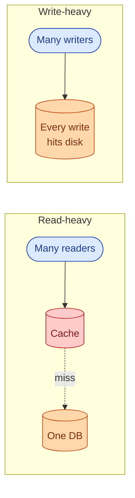

A read-heavy system can serve a million reads from one cached copy. A write-heavy system cannot: every write is unique, every write must persist. The only two levers are **batch** (amortize per-write cost over many writes) and **spread** (route writes to many machines so no one machine melts).

> **Take this with you.** Every pattern in this doc is either batching, spreading, or both.

---

## Step 2: Ask the right questions

Before drawing any boxes, take five minutes with these questions. The answers decide everything.

<details markdown="1">
<summary><b>Show: 8 questions that change the design</b></summary>

1. **How much loss is OK?** "If we drop 0.1% of events when a node crashes, is that fine?" SOX audit needs zero loss. Click tracking accepts 1%. That one answer decides whether you need `acks=all` on Kafka, a transactional outbox, or fire-and-forget UDP.

2. **How fresh must reads be?** "When we save an event, when must a query see it? 100ms? 10 seconds? 5 minutes?" Real-time forces you to index right away. 5-minute lag lets you batch into Parquet files and pay 1% of the cost.

3. **Does order matter?** Global ordering means one writer (slow). Per-key ordering means partition by key (medium). Unordered is cheapest.

4. **How do consumers read this data?** Point lookups want an LSM tree with a primary key. Scans and counts want a columnar layout like Parquet or ClickHouse.

5. **How long do we keep it?** "30 days hot, 7 years cold? Forever?" Time-based partitions are easy to drop. That fact alone often picks the partition scheme.

6. **How big is one event?** A 200-byte event is a different system from a 50KB event. Fixed schemas can use columnar formats. Random JSON forces you to store raw bytes.

7. **How bursty is the traffic?** A 5x burst is normal. Some systems see 50x bursts when a logging loop goes wild. Your queue size depends on this.

8. **What delivery promise do we need?** At-most-once (lose on failure), at-least-once (may duplicate), or exactly-once. Exactly-once is expensive and almost never worth it. At-least-once with idempotent consumers is the usual answer.

A strong candidate also asks: *"What does the consumer actually do with these events?"* If it is a dashboard, optimize for aggregation. If it is fraud detection, optimize for low latency. If it is compliance storage, optimize for cheap durable disk. The downstream decides the upstream.

</details>

---

## Step 3: How big is this thing?

The interviewer hands you numbers: 1M events per second, steady. 3x that at peak. 500 bytes per event. Keep 90 days hot, 7 years cold.

| Number | Value | Why it matters |
|--------|-------|----------------|
| Steady bandwidth | 500 MB/sec (4 Gbps) | Multiple ingest nodes needed just for NIC, not CPU |
| Peak bandwidth | 1.5 GB/sec (12 Gbps) | Several machines per region just to accept bytes |
| Daily volume | 86 billion events, 43 TB raw | Hot tier is petabytes |
| Hot storage (90 days) | ~3.9 PB | 10-30 node Cassandra cluster |
| Cold storage (7 years, 5x compression) | ~22 PB on S3 | Standard tier costs ~$500k/month |
| Queue size on 5-min stall | 300M events, 150 GB | Kafka handles easily, in-memory does not |

<details markdown="1">
<summary><b>Show: how the numbers come out</b></summary>

**Steady bandwidth.** 1M events/sec x 500 bytes = 500 MB/sec = 4 Gbps. A 10G NIC maxes out around 80%. You need more than one ingest machine just for network throughput, not for CPU.

**Daily volume.** 1M x 86,400 seconds = 86 billion events per day. At 500 bytes each, that is 43 TB per day raw.

**Hot storage.** 43 TB x 90 = 3.9 PB. Not one machine. This is a 10-30 node Cassandra cluster with RF=3.

**Cold storage.** 43 TB x 365 x 7 / 5 = 22 PB in S3 as Parquet files.

**Queue size on 5-minute stall.** 1M events/sec x 300 seconds = 300 million events = 150 GB. Kafka with 7-day disk retention handles this easily. An in-memory queue cannot.

**The headline.** Bandwidth and storage dominate. CPU is not the bottleneck. One Postgres maxes out around 10k-50k writes/sec. At 1M/sec we are 20x-100x past that on a single shard.

</details>

---

## Step 4: The six patterns

Here are the six patterns to know. Each one answers a specific failure of the thing before it.

### Pattern 1: Batching

The simplest win. Instead of writing one event per database call, accumulate events in memory and flush them together.

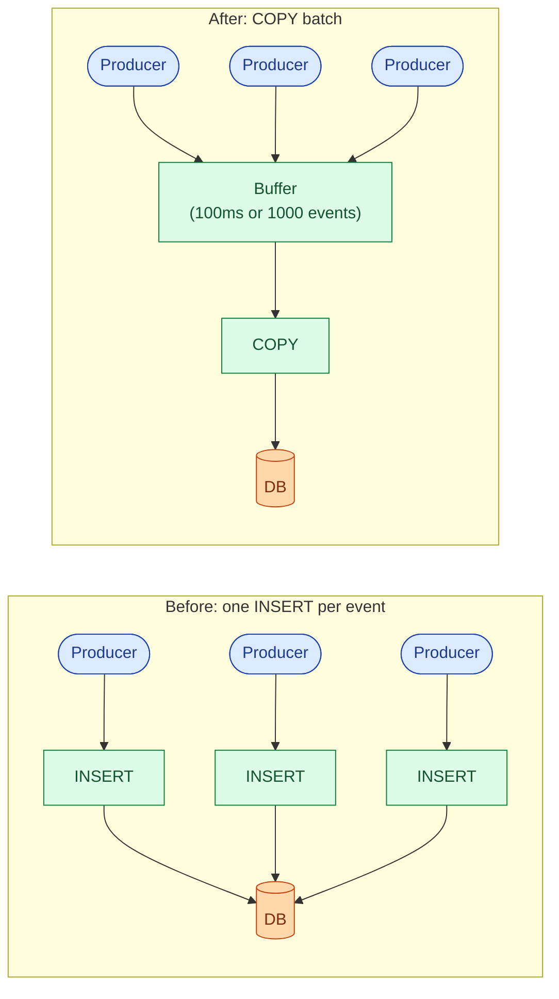

**When to use.** Any time per-write overhead (network round-trip, TLS, fsync) dominates. Typical threshold: when you are above ~1k events/sec and latency starts rising.

**What breaks.** If the app crashes, events in the in-memory buffer are lost. At 100ms flush intervals and 10k events/sec, that is up to 1,000 events. For click tracking, fine. For audit, not fine. Fix: move the buffer to a durable queue (Pattern 3).

> **Take this with you.** Batching is the first 10x. It costs nothing but a timer and an array. Use it before reaching for Kafka.

---

### Pattern 2: Append-only log

Stop updating rows in place. Only ever append. This is how Kafka, Cassandra's LSM tree, and every audit log work.

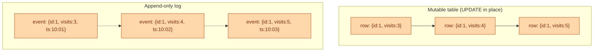

**When to use.** Audit trails (you need history). Time-series data (events are immutable facts). Any data where you care about what happened, not just the current state.

**What breaks.** You cannot "undo" a row. GDPR deletions need a logical tombstone approach, not a DELETE. Storage grows unboundedly until you add retention and compaction. Reads that want current state must aggregate across all events (expensive without materialized views).

> **Take this with you.** An append-only log is the cheapest write path. Disk is sequential. Sequential writes are 10x-100x faster than random writes on any hardware.

---

### Pattern 3: Queue-based ingestion

Separate the producer's write speed from the storage layer's write speed. Producers fill a durable queue. Storage drains it at its own pace.

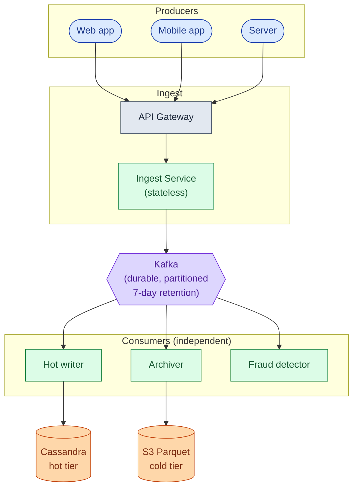

**When to use.** When storage cannot absorb the ingest rate in real time. When you have multiple consumers (audit archive, fraud detection, analytics) that all need the same events. When a downstream service restart should not cause event loss.

**What breaks.** End-to-end lag jumps from milliseconds to seconds. Events are not queryable until the consumer has flushed them. A stuck consumer builds lag. If lag grows past Kafka's retention window (typically 7 days), events are lost.

> **Take this with you.** The queue is the shock absorber. Producers cannot crush storage. They fill the queue. Storage drains at its own pace.

---

### Pattern 4: LSM trees vs B-trees

Postgres uses a B-tree. Cassandra uses an LSM tree. For write-heavy work, LSM wins. Here is why.

```mermaid
flowchart TB
    subgraph BTree["B-tree insert (Postgres)"]
        BW1["1. Find leaf page<br/>(random disk read)"]:::app
        BW2["2. Insert + maybe split page<br/>(random disk write)"]:::app
        BW3["3. Write WAL<br/>(sequential)"]:::app
        BW4["4. fsync on commit<br/>(slow)"]:::bad
        BW1 --> BW2 --> BW3 --> BW4
    end

    subgraph LSM["LSM insert (Cassandra, RocksDB)"]
        LW1["1. Append to commit log<br/>(sequential)"]:::app
        LW2["2. Insert into memtable<br/>(in RAM)"]:::app
        LW3["3. Flush to SSTable<br/>(big sequential write)"]:::app
        LW4["4. Compact SSTables<br/>(background, off peak)"]:::ok
        LW1 --> LW2 --> LW3 --> LW4
    end

    classDef app fill:#dcfce7,stroke:#15803d,color:#14532d
    classDef ok  fill:#dcfce7,stroke:#15803d,color:#14532d
    classDef bad fill:#fecaca,stroke:#b91c1c,color:#7f1d1d
```

**When to use LSM.** Write-heavy work, time-series, logs, telemetry. Cassandra, ScyllaDB, RocksDB, LevelDB, HBase, InfluxDB all use LSM variants. The append-only extreme is Kafka: pure sequential writes to a segment file. No compaction unless you turn it on. This is why Kafka can ingest millions of messages per second per partition on cheap hardware.

**What breaks.** Reads are slower (must check memtable plus several SSTables). Compaction causes write amplification: the same byte may be written 5-10 times over its life. Space amplification: until compaction runs, you have several copies of the same data.

**When B-tree wins.** OLTP with frequent updates to the same rows. Read-heavy workloads. Many secondary indexes. Postgres, MySQL.

> **Take this with you.** LSM turns many random writes into sequential appends. Sequential disk I/O is 10x-100x faster than random I/O. That is the whole trick.

---

### Pattern 5: Sharding and partition keys

One node cannot absorb 1M writes/sec. You spread writes across many nodes by picking a partition key. The choice decides whether load spreads evenly or whether one node gets 10x the traffic of the rest.

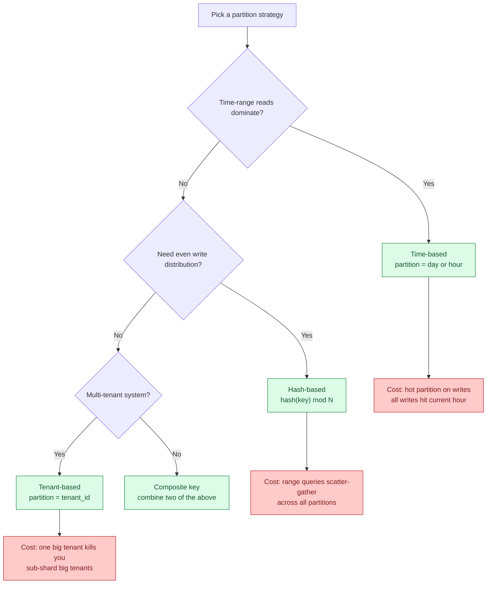

**When to use.** Any time one node cannot absorb the write rate, or you need to drop old data cheaply (time-based partitions).

**What breaks.** Every partition strategy has a failure mode. Time-based: all writes hit the current partition (hot write node). Hash-based: range queries scatter across all shards. Tenant-based: one big tenant kills the cluster. The fix is usually a composite key that combines two strategies.

For 1M events/sec: Kafka partition key `hash(event_type, tenant_id)`, Cassandra primary key `((tenant_id, day), event_id)`, S3 path `date=YYYY-MM-DD/event_type=X/tenant_id=Y/`.

> **Take this with you.** The partition key is the most important design decision in write-heavy storage. A wrong key gives you a hot node. A hot node negates all the scaling work.

---

### Pattern 6: Event sourcing and tiered storage

Events are facts. Facts do not change. Model the system as an append-only stream of events. Derive current state by replaying them.

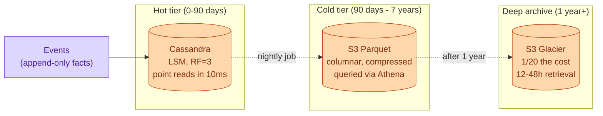

**When to use.** Audit trails (rebuild history at any point in time). Long retention requirements (SOX 7 years, HIPAA). Any system where "what happened" matters as much as "what is current state."

**What breaks.** Replaying millions of events to rebuild state is slow without snapshotting. GDPR deletions are hard ("right to be forgotten" conflicts with append-only). Storage grows without tiering. Hot queries on 3-year-old data are expensive if everything stays in one tier.

Tiered storage is the standard fix: keep recent events in a fast, queryable store (Cassandra) with a TTL. Nightly archiver moves old partitions to S3 Parquet. Deep archive for anything over a year.

> **Take this with you.** Tiered storage matches the cost of storage to the frequency of access. Hot queries pay hot prices. Cold queries pay cold prices.

---

## Step 5: The write pipeline grows in 4 stages

Every write path starts simple and grows in stages. Each stage handles roughly 10x the throughput of the one before.

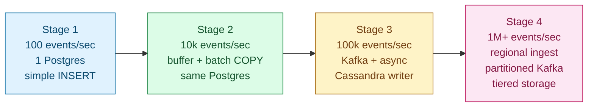

<details markdown="1">
<summary><b>Show: what breaks at each stage and why</b></summary>

**Stage 1 to 2 (buffer + batch).** Postgres CPU climbs to 80%. WAL fsync is the bottleneck: every INSERT must flush to disk before returning. Adding a 100ms in-memory buffer and switching to `COPY` gives 10x throughput on the same hardware. The cost: up to 1000 events lost if the app crashes.

**Stage 2 to 3 (durable queue).** Single Postgres hits I/O ceiling. Vertical scaling is exhausted. The buffer-on-crash problem also grows (100k/sec x 100ms = 10k events lost on crash, which is now unacceptable). Adding Kafka decouples producers from storage. Cassandra's LSM tree handles the write rate that Postgres cannot. Multiple independent consumers read the same topic.

**Stage 3 to 4 (partitioning + stream processing).** Single-region Kafka hits NIC and disk limits. One big tenant saturates one Kafka partition and one Cassandra node, hurting others. Cold-tier costs explode if you keep everything in Cassandra. Solution: regional ingest tiers, partitioned topics, sub-sharding for hot tenants, Flink for derived data, S3 Parquet for cold storage.

**The discipline.** Name the limit of stage N before reaching for stage N+1. Junior engineers jump to stage 4. They build the cathedral before they have any worshippers.

</details>

---

## Step 6: The full architecture at 1M events/sec

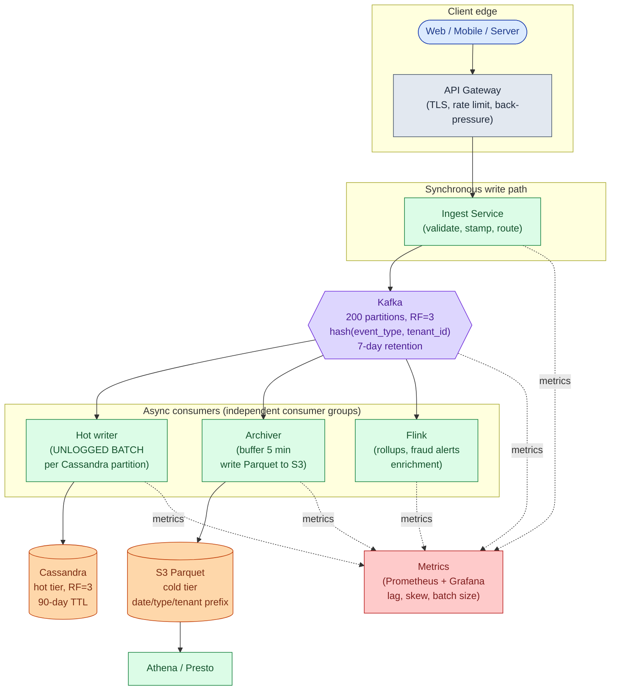

Each box, in one line:

| Box | What it does |
|-----|--------------|
| **API Gateway** | Terminates TLS, applies per-tenant rate limits, returns 429 when Kafka is unhealthy (back-pressure). |
| **Ingest Service** | Stateless. Validates schema, stamps event_id and server timestamp, routes to Kafka partition. Returns 202. |
| **Kafka** | The shock absorber. Producers fill it. Consumers drain it independently. Buffers 5-minute stalls without affecting producers. |
| **Hot writer** | Reads Kafka, writes UNLOGGED BATCHes per Cassandra partition. Commits offset after storage ack. |
| **Archiver** | Reads Kafka (separate consumer group). Buffers 5 minutes or 100k events. Writes one Parquet file to S3. |
| **Flink** | Derived data: per-minute rollups, anomaly scores, fraud alerts. Reads same Kafka topic as others. |
| **Cassandra hot tier** | Recent events. Query by `(tenant_id, day)` range. 90-day TTL, auto-deleted by compaction. |
| **S3 Parquet cold tier** | 7-year archive. Partitioned by date/event_type/tenant_id. Queried by Athena. |
| **Metrics** | Throughput, consumer lag, batch size, partition skew. Without this, you learn about failures from customer complaints. |

> **Take this with you.** Three consumer groups read the same Kafka topic independently. The archiver can fall behind without affecting Cassandra. Flink can crash without affecting the archiver. Kafka is what makes this possible.

---

## Step 7: One event, all the way through

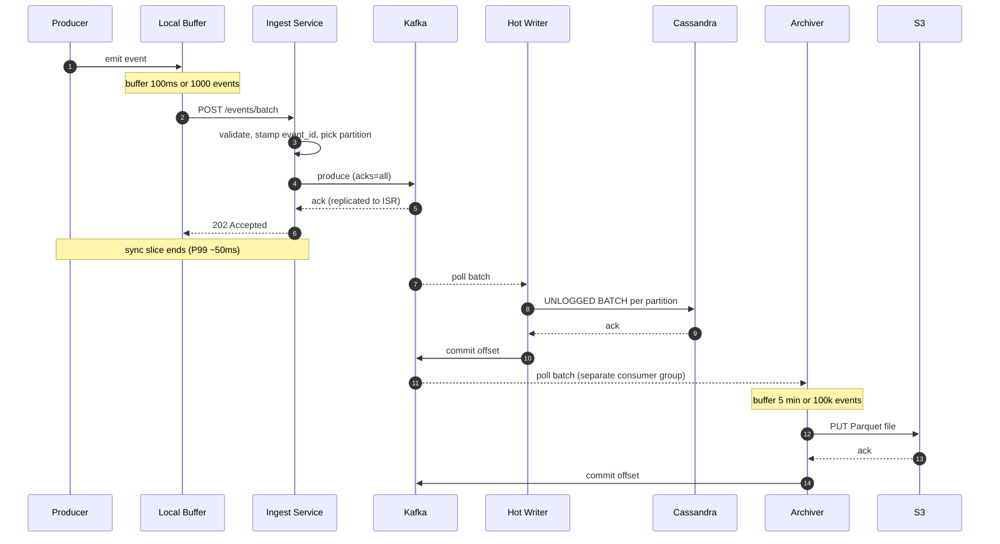

Three details worth pointing at:

1. The 202 goes back to the producer after Kafka ack, not after Cassandra ack. If Kafka has it, the event is safe. Cassandra is just the queryable view.
2. Hot writer commits the Kafka offset *after* Cassandra ack. At-least-once: crash between write and commit means a replay on restart. Cassandra primary-key dedup makes the replay a no-op.
3. End-to-end lag to Cassandra is 1-3 seconds, P99 ~10 seconds. Lag to S3 is up to 5-6 minutes (archiver's flush window dominates).

---

## Step 8: Delivery guarantees

At small scale, every event is in one Postgres. One ACID transaction. Either on disk or not. Easy.

At 1M events/sec, that promise is gone. Pick one of three delivery models.

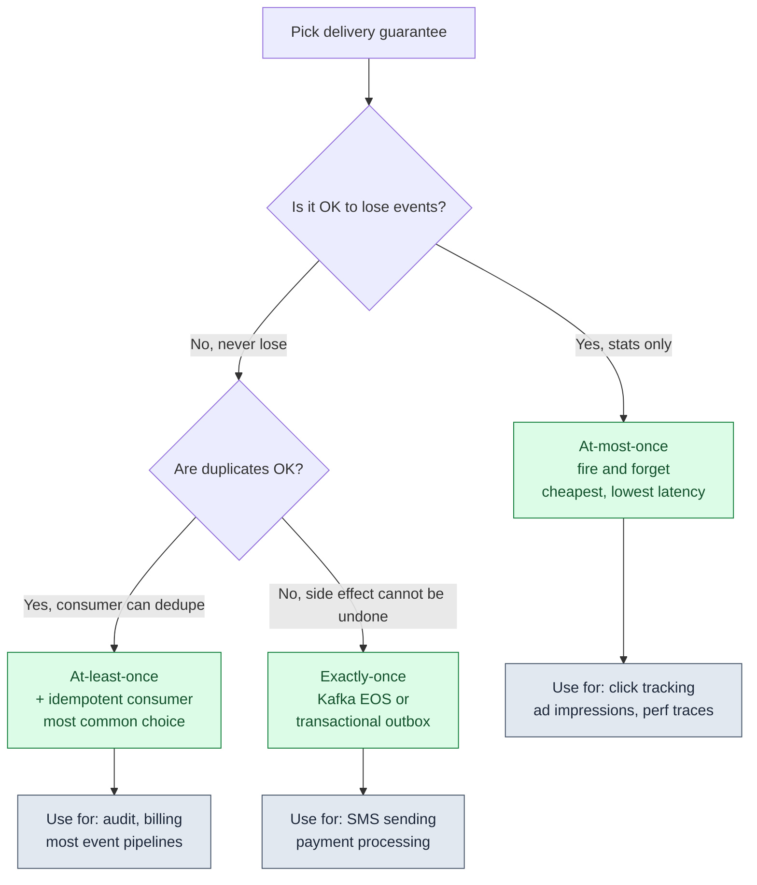

<details markdown="1">
<summary><b>Show: when each guarantee is right</b></summary>

**At-most-once.** Producer sends, returns immediately, does not retry. If the broker is down or a packet drops, the event is gone forever. Zero retry cost. No idempotency machinery. Use when the data is statistical: page views, click tracking, performance traces, ad impressions. Losing 0.1% does not change the answer.

**At-least-once.** Producer retries on any failure to ack. Network blip? Producer did not see the ack but the broker may have written it. Producer retries. Broker writes a second copy. Event appears twice. Consumer commits offsets after processing.

How to handle duplicates: use `event_id` as the primary key in storage. Second write is a no-op via Cassandra UPSERT or `INSERT ON CONFLICT DO NOTHING` in Postgres. This is what 80% of production pipelines do.

**Exactly-once.** Kafka EOS (Exactly-Once Semantics) via transactional producers and read-committed consumers. Throughput drops 20-40% vs at-least-once. Latency goes up. Use when the downstream effect cannot be deduped (SMS, payment processing).

The honest take: most "we need exactly-once" requirements are actually "we need at-least-once with idempotent processing." At-least-once is 10x cheaper. Exactly-once is only for side effects you literally cannot deduplicate.

**What we pick for 1M events/sec audit.** At-least-once. Audit needs durability, so at-most-once is out. Storage is Cassandra keyed by `event_id`, so idempotency is free. Exactly-once via Kafka EOS would cost ~30% throughput and give no additional benefit.

</details>

> **Take this with you.** At-least-once with idempotent storage gives you the same correctness as exactly-once at a tenth of the cost. Most systems should pick this.

---

## Follow-up questions

Try answering each in 2 to 4 sentences before reading the solution.

1. **Back-pressure.** Producers are sending 2x the rate Kafka can absorb. Brokers are healthy but disk is at 80%. What does the ingest service do? What does the producer SDK do?

2. **Hot tenant.** One tenant's mobile app has a bug and is sending 200k events/sec when the average is 100. They are saturating one Kafka partition. How do you find them? What do you do in the next 5 minutes vs the next 5 days?

3. **Clock skew.** Two producers disagree about "now" by 3 minutes. Your downstream reports show events arriving "in the future." How do you fix it without requiring nanosecond-precision NTP everywhere?

4. **Duplicate events.** A producer retried after a broker timeout that actually succeeded. Cassandra now has two copies of every event in that batch. Walk through detection and dedup.

5. **Consumer fell behind.** A Cassandra writer consumer has been stuck for 30 minutes. Kafka has buffered 1.8 billion events for that consumer group. What happens when you fix the bug and restart? How do you keep it from melting storage?

6. **Schema evolution.** A team added a new field. Old producers send 5 fields, new producers send 6. Cassandra has a fixed table schema. How do you handle migration without dropping events or breaking old consumers?

7. **Recent-event reads.** A consumer wants "all events for user U in the last 30 seconds." Your storage path is Kafka, then batched 5 min into Cassandra. The event might still be in Kafka. How do you make the read see both?

8. **A region goes down.** US-East Kafka cluster is offline. Producers there cannot publish. What is your DR plan? How much data could be lost?

9. **Cold-tier query cost.** A user wants "every event for tenant X for the past 3 years." Naive Athena query scans 3 PB of Parquet. How do you make this both fast and cheap?

10. **Exactly-once for a side effect.** One downstream consumer sends an SMS for every fraud alert. SMS is not idempotent (user gets two texts if you send twice). How do you guarantee exactly one SMS without paying Kafka EOS cost on the whole pipeline?

---

## Related problems

- **[Approval Management (011)](../011-approval-management/question.md).** The audit log in that design is exactly a write-heavy append-only system. The tiered storage and batching patterns here apply directly.
- **[News Feed (002)](../002-news-feed/question.md).** Timeline write fan-out is the classic write-heavy problem at consumer scale: each post produces N writes (one per follower's timeline).
- **[Todo List Sharing (013)](../013-todo-list-sharing/question.md).** The change-log sync pipeline for collaborative edits is the same shape at smaller scale: every edit is a small append-only event partitioned by list_id.
- **[Read-Heavy System Patterns (017)](../017-read-heavy-patterns/question.md).** The mirror image of this problem. Read-heavy is cached. Write-heavy is batched and partitioned.


<div class="pr-solution-divider"></div>


## Solution: Write-Heavy System Patterns

### The short version

A write-heavy system is one where the cost comes from taking in data, not from serving it. Each event is small. Queries are simple. The storage engine has one job: absorb writes faster than a normal database can.

The interesting work is at the seams. When do you add a buffer? When do you add a queue? When do you give up linearizability? When do you stop adding pieces because what you have is already enough?

The toolkit, in the order you reach for it as scale grows:

1. **One Postgres** at ~1k writes/sec.
2. **In-memory buffer + batched commits** at ~10k writes/sec.
3. **Durable queue + async LSM writer** at ~100k writes/sec.
4. **Partitioned queue + stream processing + tiered storage** at 1M+ writes/sec.

Each step trades latency, consistency, or operational complexity for throughput. The senior move is to name the limit of stage N *before* reaching for stage N+1. Not to preemptively build stage 4.

Three big decisions shape the final design:

- **Partition key.** Time, hash, or tenant. Usually a composite like `(event_type, tenant_id, day)`.
- **Storage engine.** LSM at the hot tier. Parquet on object storage at the cold tier.
- **Delivery guarantee.** At-least-once with idempotent storage is right for 95% of cases.

---

### 1. The two questions that matter most

**How much loss is OK?** This decides your whole durability story. Zero loss means `acks=all` on Kafka, transactional ingest, and idempotent consumers. 0.1% loss acceptable means fire-and-forget, no retries, no dedup. Those are 10x apart in cost and complexity.

**How fresh must reads be?** 100ms freshness forces synchronous indexing. 5-minute lag lets you batch into Parquet files and pay 1% of the cost. Most audit systems accept 5-10 seconds. Most fraud detectors want under 1 second. The lag SLA decides where you put the queue and how big your batches can be.

Everything else (partition strategy, storage engine, delivery guarantee) follows from those two answers.

---

### 2. The math, in plain numbers

| Number | Value | Why it matters |
|--------|-------|----------------|
| Steady bandwidth | 500 MB/sec (4 Gbps) | Multiple ingest nodes needed just for NIC, not CPU |
| Peak bandwidth | 1.5 GB/sec (12 Gbps) | Several machines per region just to accept bytes |
| Daily volume | 86 billion events, 43 TB raw | Hot tier is petabytes |
| Hot storage (90 days) | ~3.9 PB | 10-30 node Cassandra cluster, RF=3 |
| Cold storage (7 years, 5x compression) | ~22 PB on S3 | ~$500k/month standard, ~$25k/month Glacier Deep |
| Queue size on 5-min stall | 300M events, 150 GB | Kafka handles easily; in-memory cannot |

The headline: bottleneck is bandwidth and storage layout, not CPU. A single Postgres maxes out at 10k-50k writes/sec. At 1M/sec we are 100x past that on a single shard. We need to spread writes across nodes and batch them so per-write overhead amortizes.

Always do bytes alongside event counts. A pipeline doing 86 billion events of 50 bytes each is a completely different system from one doing 86 billion events of 5 KB each.

---

### 3. The API

Reads are out of scope. Focus on ingest.

**Single-event ingest** for low-volume producers:

```
POST /api/v1/events
Content-Type: application/json
X-Tenant-Id: tenant_42
Authorization: Bearer <token>
Idempotency-Key: <uuid>         # optional; server dedupes on this key if present

{
  "event_type": "user.login",
  "user_id": "u_8201",
  "timestamp": "2026-05-24T10:14:02.331Z",
  "attributes": { ... }
}
```

| Status | Meaning |
|--------|---------|
| **202 Accepted** | Event in durable queue, queryable within ~10s |
| **400 Bad Request** | Schema invalid |
| **413 Payload Too Large** | Single event > 1 MB |
| **429 Too Many Requests** | Rate limited or back-pressure |
| **503 Service Unavailable** | Ingest degraded, producer should retry |

**Batched ingest** for everyone else:

```
POST /api/v1/events/batch
Content-Encoding: gzip
Content-Type: application/json

{
  "events": [
    { ...event 1... },
    { ...event 2... }
  ]
}
```

Four load-bearing choices:

- **202, not 200.** The event is in durable queue, not yet in storage. 202 communicates "we accepted responsibility; you can stop retrying."
- **Batch endpoint is recommended.** Per-event HTTP at 1M/sec means 1M TLS handshakes/sec, which is impossible. Batches of 1000 cut that to 1k req/sec.
- **Server stamps server_ts** alongside producer_ts. Both are kept. Producer time is "when did the event happen." Server time is "when did we accept it." Clock-skew analysis uses the gap.
- **Rate limits are visible.** 429 includes `Retry-After` and `X-RateLimit-Remaining` so well-behaved producers throttle themselves.

---

### 4. The data model

**The canonical event:**

```json
{
  "event_id":      "01H8K2X...",
  "tenant_id":     "tenant_42",
  "event_type":    "user.login",
  "user_id":       "u_8201",
  "producer_ts":   "2026-05-24T10:14:02.331Z",
  "server_ts":     "2026-05-24T10:14:02.412Z",
  "attributes":    { ... },
  "schema_version": 3
}
```

**Hot tier in Cassandra:**

```cql
CREATE TABLE events_by_tenant_day (
    tenant_id      text,
    day            date,
    event_id       timeuuid,
    event_type     text,
    user_id        text,
    producer_ts    timestamp,
    server_ts      timestamp,
    attributes     text,
    schema_version int,
    PRIMARY KEY ((tenant_id, day), event_id)
) WITH CLUSTERING ORDER BY (event_id DESC)
  AND default_time_to_live = 7776000;
```

Three things doing real work:

**`PRIMARY KEY ((tenant_id, day), event_id)`.** The partition key `(tenant_id, day)` bounds partition size. Even the biggest tenant only writes one day at a time into one partition. The clustering column `event_id` keeps rows sorted inside the partition, so "latest events" is a prefix scan.

**`default_time_to_live = 7776000`.** 90 days. Cassandra auto-deletes old rows during compaction. No nightly delete job needed.

**No foreign keys.** Audit-shaped data is reference-free. The event captures who/what/when. If a user account is later deleted, the audit must survive.

**Cold tier on S3** sits at path `s3://events-cold/date=YYYY-MM-DD/event_type=X/tenant_id=Y/fileN.parquet`. Columnar layout inside each file. Column-pruned reads are free. Partition pruning at the prefix level means Athena/Presto skip whole directories that do not match the query.

---

### 5. The six patterns, fast

#### Pattern 1: Batching

Accumulate events in memory. Flush together. One `COPY` statement covers what used to be 1,000 individual `INSERT` calls. Amortizes fsync, network round-trips, and TLS overhead.

**Limit.** ~10k writes/sec on one Postgres, and events in the buffer are lost on crash.

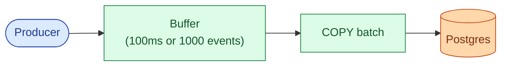

> **Take this with you.** Batching is the first 10x. It costs nothing but a timer and an array. Use it before reaching for Kafka.

---

#### Pattern 2: Append-only log

Only ever append. Never update in place. All writes are sequential. Sequential disk I/O is 10x-100x faster than random I/O.

The audit trail becomes a stream of immutable facts. Current state is derived by replaying events. This is how Kafka, Cassandra's commit log, and every good audit system work.

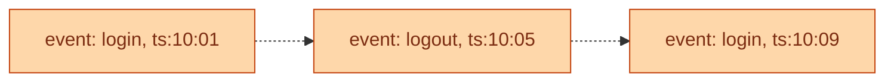

**Limit.** Storage grows unboundedly. Reads that want current state must aggregate across all events. Fix with tiered storage and materialized views.

---

#### Pattern 3: Queue-based ingestion

Decouple producer speed from storage speed. Producers write to a durable queue. Storage drains at its own pace. Multiple consumers read the same events independently.

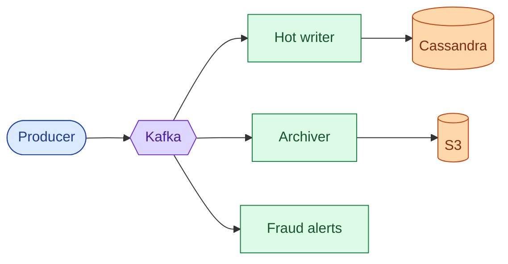

**Limit.** End-to-end lag jumps from ms to seconds. If consumer lag grows past Kafka's retention window, events are lost. Fix with Kafka disk retention sized for your worst-case stall (7 days is standard).

> **Take this with you.** The queue is the shock absorber. If the notification service dies at 3am, ingest still works. Events just queue up.

---

#### Pattern 4: LSM trees

Postgres uses a B-tree: every insert finds a page, writes in-place, pays a random I/O cost. Cassandra uses an LSM tree: every insert appends to a commit log (sequential), then flushes to an SSTable (sequential). Compaction happens in the background, off-peak.

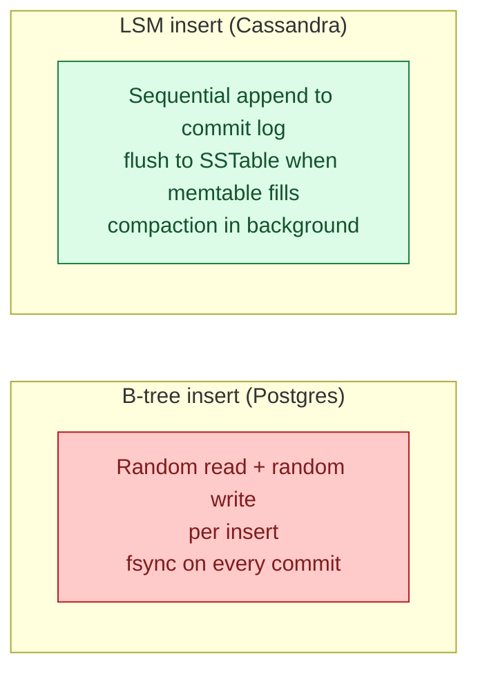

**When LSM wins.** Write-heavy work, time-series, logs, telemetry. Above ~50k writes/sec on a single node, Cassandra/ScyllaDB/RocksDB are the right choice.

**When B-tree wins.** OLTP with frequent updates to the same rows. Read-heavy. Many secondary indexes. Postgres, MySQL.

---

#### Pattern 5: Sharding and partition keys

Spread writes across many nodes. The partition key decides which node gets which writes. A bad key creates a hot node that gets 100x the traffic of others.

| Strategy | Good for | Fails when |
|----------|----------|------------|
| **Time-based** (`day`) | Time-range reads, cheap data expiry | Hot write partition (current hour/day) |
| **Hash-based** (`hash(key) % N`) | Even write distribution, no hotspots | Range queries scatter-gather |
| **Tenant-based** (`tenant_id`) | Multi-tenant isolation, per-tenant deletion | One big tenant melts one node |
| **Composite** (`(tenant_id, day)`) | Bounds partition size, cheap expiry, good reads | Slightly more complex routing |

For 1M events/sec: Kafka key = `hash(event_type, tenant_id)`. Cassandra primary key = `((tenant_id, day), event_id)`. S3 path = `date=Y/event_type=X/tenant_id=Z/`.

> **Take this with you.** The partition key is the most important design decision in write-heavy storage. A wrong key gives you a hot node. A hot node negates all the scaling work.

---

#### Pattern 6: Tiered storage

Not all data is accessed equally. Last hour's events: read often, must be fast. Three-year-old events: read rarely, must be cheap. Match storage cost to access frequency.

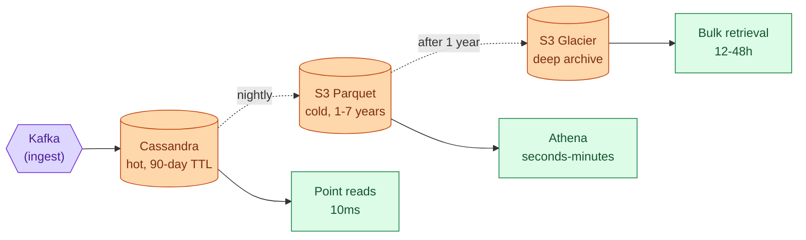

**Cost comparison (1M events/sec at 500 bytes):**
- Cassandra hot tier (90 days): ~3.9 PB, ~$50k/month on managed clusters.
- S3 Parquet standard (7 years, 5x compression): ~22 PB, ~$500k/month.
- S3 Glacier Deep Archive: ~$25k/month for same 22 PB.

Keeping 7 years in Cassandra is not just expensive. It is structurally wrong: Cassandra is optimized for fast point reads, not for Athena-style columnar scans across years of data.

---

### 6. The architecture

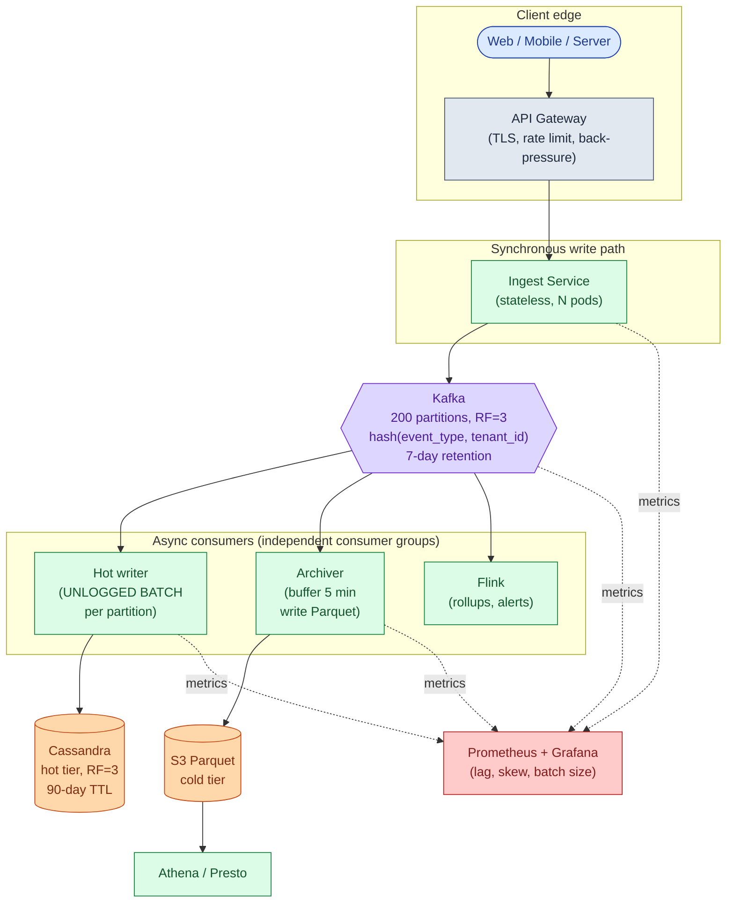

Five things to notice:

- Ingest pods are stateless. Their only durability hop is Kafka. A pod crash causes the producer's connection to drop. The producer retries. Idempotency key (if present) deduplicates.
- Three consumer groups read the same Kafka topic independently. Archiver falls behind without affecting Cassandra. Flink crashes without affecting the archiver.
- Cassandra and S3 are not redundant. They serve different access patterns. Cassandra answers "give me events for tenant X on day D" in 30ms. S3 answers "give me everything for tenant X over 2 years" in minutes.
- Observability is on every box. Without consumer lag and partition-skew metrics, you learn about failures from customer complaints.
- Concrete choices: Edge LB via AWS ALB or Cloudflare. Ingest pods in Go or Rust (low GC overhead). Kafka via Confluent, MSK, or Aiven. Hot store: Cassandra or ScyllaDB. Flink for stateful stream processing.

---

### 7. An event, end to end

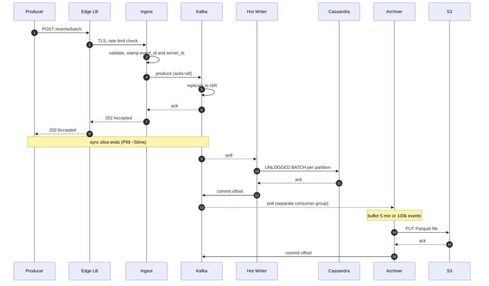

**End-to-end lag:**
- Producer to Cassandra-queryable: 1-3 seconds, P99 ~10 seconds.
- Producer to S3 Parquet: up to 5-6 minutes (archiver flush window dominates).

**Read latencies:**
- Point read by event_id: P99 ~10ms.
- Per-tenant range scan: P99 ~30ms.
- Analytics over 1 year via Athena: seconds to minutes.

---

### 8. The scaling journey: 100 events/sec to 1M

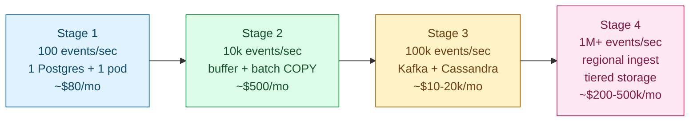

#### Stage 1: 100 events/sec

One Postgres (db.t3.medium, 4 GB RAM). One app instance. One table, indexed by `event_id` and `(user_id, created_at)`. No queue. No cache. No replicas. ~$80/month.

Enough because 100 events/sec is 8.6M events/day. Postgres handles this with room to spare. At 5ms per insert, using maybe 50% of one core. Anything more is over-engineering.

#### Stage 2: 10k events/sec

**What breaks.** Postgres CPU at 80%. WAL fsync is the bottleneck: every commit flushes to disk. Inserts land in random pages, so the buffer pool churns.

**Fixes:**

- In-app buffer: accumulate events, flush every 100ms or 1000 events via Postgres `COPY` instead of `INSERT`. 10-20x faster.
- Partition the table by day (`PARTITION OF ... FOR VALUES FROM ...`). Old partitions drop cheaply.
- Second app instance behind a load balancer.
- Read replica for analytics.

**What you accept.** Buffered events lost on app crash, worst case 100ms x 10k/sec = ~1,000 events. Tolerable for most use cases. End-to-end lag goes from immediate to ~100ms.

**What you do NOT build.** No Kafka, no Cassandra, no multi-region. Buffer + batch buys 10x runway with minimal complexity.

#### Stage 3: 100k events/sec

**What breaks:**

- Postgres cannot keep up even with batching. Single instance at I/O ceiling.
- App process holding the buffer is a single point of failure. At 100k/sec, a crash loses 10k events.
- Read replica lags 30 seconds because primary is saturated.

**Fixes:**

- Kafka in front of storage. Producers get 202 immediately. Kafka buffers if storage falls behind.
- Switch to Cassandra for the hot tier. LSM tree absorbs sequential writes far better than a B-tree.
- Separate Kafka consumer process writes to Cassandra in UNLOGGED BATCHes per partition. Stateless. Run N of them. Crashes do not lose data (Kafka holds the events).
- 50 Kafka partitions, hash by `(event_type, tenant_id)`. Cassandra primary key `((tenant_id, day), event_id)`.

**What you accept.** End-to-end lag jumped from 100ms to ~5 seconds. Strong consistency is gone. One Kafka consumer crash = a few seconds of replay, handled by idempotent storage.

#### Stage 4: 1M events/sec

**What breaks:**

- Single-region Kafka hits NIC and disk limits.
- Hot tenant (one team's mobile app misbehaving) saturates one Kafka partition and one Cassandra node, hurting others.
- Cold-tier costs explode if everything stays in Cassandra.
- Compliance asks for 7-year retention.

**Fixes:**

- Regional ingest + regional Kafka clusters. Each region (us-east, eu-west, ap-south) has its own stack. Events written to producer's home region.
- Sub-shard hot partitions with a random suffix: ingest tier appends `random(0..15)` to the partition key for a hot tenant. Trades per-key ordering for load distribution.
- Flink for stream processing: enrichment, routing to multiple sinks, rollups, fraud alerts.
- Tiered storage: hot in Cassandra (90-day TTL), cold in S3 Parquet (7-year retention). Archiver consumer writes 5-min Parquet batches.
- Per-tenant rate limits at ingest. Hard cap. 429 above the limit.

---

### 9. Reliability

**Queue overflow.** Kafka at 90% disk. Back-pressure at ingest: when Kafka send latency P99 exceeds 1 second, ingest returns 429. Producers back off. Premium tenants get reserved Kafka capacity. Free-tier tenants get throttled first.

**Consumer fell behind.** Scale consumer group up temporarily. Configure throttled catch-up (2x normal rate). Catch-up is a separate workload. Do not pretend it is normal traffic; it will melt storage.

**Partial batch loss.** A Kafka consumer crashes after writing 800 of 1000 events to Cassandra, before committing the offset. On restart, it reprocesses the full batch. Cassandra primary-key UPSERT semantics make the 800 already-written events a no-op. The 200 missing events get written. No data loss.

**Ingest pod crash.** Pod crashes between accepting a request and sending to Kafka. Producer's HTTP connection drops with no response. Producer retries. With idempotency key, second submission is deduped. Mitigation: ingest pod sends to Kafka before returning 202.

**Region failure.** Producers in failed region cannot publish. SDK should fail over to next-nearest region. Data loss window: events buffered in the producer's local SDK that were never sent. Typically under 1 second. DR play: cross-region Kafka replication via MirrorMaker.

---

### 10. Observability

| Metric | Why it matters | Alert threshold |
|--------|----------------|-----------------|
| `ingest.requests.rate` | Top-line throughput | Drop >50% in 5 min |
| `ingest.latency.p99` | Producer-facing SLO | >100ms for 5 min |
| `ingest.5xx.rate` | Our problem | >0.1% sustained |
| `kafka.producer.ack.latency.p99` | Kafka health | >1s for 5 min |
| `kafka.partition.rate.max / median` | Hot partition skew | >10x ratio |
| `kafka.consumer.lag` per group | Are consumers keeping up? | >30s lag for any group |
| `kafka.broker.disk.used.pct` | Storage capacity | >80% |
| `cassandra.write.latency.p99` | Storage health | >50ms |
| `cassandra.batch.size.p99` | Batching effectively? | <10 events = too small |
| `archiver.lag` | Cold tier behind real-time | >10 min |
| `archiver.parquet_file.size.p50` | Small file problem? | <10 MB = too many files |
| `dedup.collision.rate` | Duplicate event_ids? | Any non-zero is interesting |

**Four golden signals:**

1. Ingest throughput (events/sec at the API).
2. End-to-end lag (ingest timestamp to Cassandra-readable timestamp).
3. Consumer lag per Kafka consumer group.
4. Error rates at each stage.

Page on: ingest 5xx > 0.5%, ingest P99 > 200ms for 10 min, consumer lag > 5 min for any group, Kafka broker disk > 90%.

---

### 11. Follow-up answers

**1. Back-pressure.**

When Kafka send latency P99 exceeds 1 second or any broker is unhealthy, ingest returns 429 with `Retry-After`. The producer SDK backs off with exponential backoff and caches events locally (in-memory or disk-backed) until health returns. Without producer-side backoff, the 429 storm becomes a retry storm. If Kafka is so unhealthy that even 429s are slow, the ingest tier can close connections (TCP RST), forcing producers to back off at a lower level.

**2. Hot tenant.**

Find them: the per-partition rate metric points at one Kafka partition. Cross-reference with the partition key. The next 5 minutes: hard rate limit at the ingest tier, capping the tenant at 50k events/sec. Excess gets 429. Sub-shard them by appending `random(0..15)` to the partition key, spreading across 16 partitions. They lose per-key ordering during the spike, but the cluster survives. The next 5 days: contact the tenant, diagnose the bug (often a retry loop, log misconfiguration, or a runaway script). Establish per-tenant quota policy and dedicated capacity for premium tenants.

**3. Clock skew.**

The fix is structural. Always stamp server_ts at ingest; that is the timestamp used for partitioning, bucketing, and ordering downstream. Producer_ts is kept for user display only. NTP-sync producers to the second (reduces skew enough that producer_ts is a useful sanity check). Detect outliers: any event with `producer_ts` more than 5 minutes off from `server_ts` is flagged. Stream processor tolerates late events via Flink watermarks. Never use producer_ts for anything that requires precise ordering.

**4. Duplicate events.**

Detection: Cassandra primary-key conflict on insert is the direct signal. Consumer counts `cassandra.dedup.collisions` per minute. A nightly audit: `SELECT event_id, count(*) FROM events GROUP BY event_id HAVING count(*) > 1` should always be zero. Dedup: `event_id` is the dedup key. Prefer producer-generated event_ids (ULID is good: time-ordered, unique, no coordination). If the producer cannot generate one, the server generates at ingest, but then producer retries get different event_ids and dedup is impossible. Cassandra UPSERT semantics make duplicate inserts a no-op for the same primary key.

**5. Consumer fell behind.**

Two failure modes to avoid on restart: resource exhaustion at storage (consumer wakes up, polls Kafka at full speed, sends 1.8B events to Cassandra as fast as Cassandra accepts, melts the cluster); and out-of-order derived data (rolling metrics get skewed by 1.8B events arriving in one hour). Strategies: throttled catch-up at 2x normal throughput (1.8B events at 200k/sec takes ~2.5 hours to drain). Scale the consumer group up temporarily, but watch storage. If derived consumers care about "now-time" processing, flag them to skip events older than X and replay historical events as a separate batch job.

**6. Schema evolution.**

Old producers send 5 fields, new producers send 6. Options: keep raw event as JSON (flexible but no columnar benefits). Use Avro/Protobuf with backward/forward compatibility rules (old consumers ignore unknown fields; Schema Registry enforces compatibility at registration). Versioned event types (`user.login.v1`, `user.login.v2`) let old consumers stick to v1. Never make a backward-incompatible schema change without versioning. Adding fields is fine. Removing or renaming is not without a migration plan.

**7. Recent-event reads.**

Three approaches: (1) Document the lag ("data has ~5s lag"). Most use cases accept this. Cheapest. (2) Dual-write to a real-time store. Second consumer reads Kafka and writes to Redis (per-user list, capped at 1000 recent events). Queries that need <1s freshness hit Redis; older data falls through to Cassandra. Costs 2x writes at the consumer tier. (3) Query Kafka directly via kSQL. Operationally awkward; Kafka is not a key-value store. For most audit pipelines, option 1 is correct. For fraud or live-dashboard use cases, option 2 is worth the cost.

**8. Region goes down.**

If the producer SDK has failover: it detects local Kafka unreachable, buffers events locally, fails over to the next-nearest region. When local cluster recovers, it drains the buffer. Data loss window: events buffered in the producer process at the moment of failure, typically under 1 second. If the SDK is naive: producer gets timeouts. All events generated during the outage are lost. DR play: cross-region Kafka replication via MirrorMaker so events that landed in the failed region's Kafka eventually replicate elsewhere. For zero-data-loss DR: write events to two Kafka clusters synchronously. Doubles producer cost.

**9. Cold-tier query cost.**

"Every event for tenant X for 3 years" scans naively across 3 years x 365 date partitions x all event_type subdirectories. Optimizations: partition pruning requires `tenant_id` in the S3 prefix path, not buried inside Parquet (critical). Parquet's per-row-group statistics let Athena skip row groups that cannot match the filter. For hot queries, pre-aggregate nightly into a small summary table (events per tenant per day). Events older than 1 year move to S3 Glacier Deep Archive (1/20 the cost; 12-48h retrieval for compliance queries). For interactive sub-second analytics: build an OLAP layer (ClickHouse, BigQuery, or Snowflake) and pre-load data there. S3 Parquet via Athena is for ad-hoc, not interactive dashboards.

**10. Exactly-once for a side effect.**

SMS is non-idempotent. Use a transactional outbox at the fraud-alert consumer specifically: consumer reads Kafka events and writes "send SMS" records to a local DB table `pending_sms(event_id, status)` with `status = 'pending'`. A separate sender process picks pending rows, calls the SMS API with `idempotency_key = event_id` (Twilio supports this), then marks the row `status = 'sent'`. If the sender crashes between API call and status update, on restart it retries. The SMS provider's idempotency key prevents a second SMS from sending. This pays one extra DB write per event. Apply the expensive guarantee only at the consumer that needs it, not on the whole pipeline.

---

### 12. Trade-offs worth saying out loud

**Sync vs async.** Sync writes give immediate consistency and simpler reasoning. They cap throughput at the storage layer's speed. Async (via queue) decouples producer rate from storage rate. Higher throughput at the cost of end-to-end lag and weaker consistency. The right call depends on the lag SLA. Under 100ms means sync. Over 1 second acceptable means async.

**Batch vs stream.** Batching amortizes per-write overhead. Larger batches mean higher throughput but higher latency per event. The sweet spot is "batch enough to amortize, small enough to land within the lag SLA." Typical: 100ms or 1000 events, whichever comes first.

**Exactly-once cost.** Kafka EOS drops throughput 20-40% and adds operational complexity. The right move is usually "at-least-once with idempotent storage." Reserve true exactly-once for non-idempotent side effects.

**Why Cassandra over Postgres at the hot tier.** Postgres B-tree is bad at write-heavy random-key inserts. Cassandra LSM is built for it. Under 50k writes/sec, Postgres is fine and operationally simpler. Above that, Cassandra wins on throughput per node and horizontal scaling (add a node, rebalance automatically).

**Why S3 Parquet for cold tier.** Cheap, durable, columnar, queryable with serverless tools. Keeping 7 years of events in Cassandra costs 100x more for events accessed once a year. The access pattern decides the storage tier.

**What I would revisit at 10M events/sec.** Specialized vendor (Datadog, Splunk, Honeycomb) or specialized infrastructure. Or split into purpose-specific pipelines: one for security events (strict durability, long retention), one for product analytics (loose durability, short retention, aggregated only), one for traces (sampled, very short retention). The "one pipeline for everything" pattern stops scaling cleanly past ~1M events/sec.

---

### 13. Common mistakes

**Reaching for Kafka and Cassandra immediately.** The interviewer started you at 100 events/sec. If you propose a Kafka cluster in minute one, you have not earned the architecture. Walk the stages. Justify each addition with a specific failure of the previous one.

**Confusing buffering with batching.** Buffering means holding events in memory before writing. Batching means writing many events in one storage call. You usually do both. Articulate the difference.

**Not addressing partitioning.** "Use Cassandra" without specifying the partition key is a hand-wave. The partition key determines whether your cluster has hot nodes. It is the most important decision in the storage layer.

**Claiming exactly-once without paying the cost.** If you say "exactly-once," you must explain how (Kafka EOS, transactional outbox) and what it costs. If you say "at-least-once with idempotent storage," you score the same correctness with a tenth the operational pain.

**Forgetting back-pressure.** A write-heavy system without back-pressure cascades on the first downstream slowness. The 429 and retry-with-backoff loop is mandatory.

**Not designing for the hot partition.** "It will distribute evenly" is a hope, not a design. Real systems have one tenant 1000x bigger than the median. Have an answer: sub-sharding, rate limiting, dedicated capacity.

**No tiered storage.** Keeping 7 years of events in Cassandra is wasted money. Cold tier (S3 Parquet) is the standard play.

**Treating lag as a bug.** End-to-end lag is the price you pay for async ingestion. Some consumers want lag (cheap batch processing). Some do not (fraud alerts). Acknowledge the spectrum.

**Ignoring observability.** Queue depth, consumer lag, batch size, and partition skew are the metrics that diagnose every common failure. They are part of the design, not an afterthought.

**Building the 1M/sec architecture at 100/sec scale.** The system collapses under its own operational weight before it ever sees the traffic it was built for. The discipline: design for one stage past current, not three.

If you hit 7 of these 10 cleanly, you are interviewing well. The two that separate staff-level candidates: addressing the hot partition problem unprompted, and explaining the exact moment you would *not* yet introduce Kafka (the stage 1 to 2 transition). Both show that you understand cost as well as throughput.

