
## What we are building

A customer emails support@acme.com: "My order is wrong, I got the wrong size." The email arrives, the system creates a ticket, routes it to the Orders queue, and an agent picks it up. The agent replies, the customer writes back, and the conversation continues on the same thread until the issue is resolved. A timer runs the whole time, tracking whether the team responded within the one-hour window they promised.

That is Zendesk. It sounds like a to-do list with a status column. The interesting problems are hiding inside:

1. **Conversation threading.** Is this incoming email a new problem, or a reply to a ticket from last week?
2. **Routing rules.** Which team gets this ticket? Which agent within that team?
3. **SLA timers.** The timer started Friday at 5 PM. Does it count Saturday and Sunday?
4. **Agent assignment races.** Two agents click "Next Ticket" at the same instant. Who gets it?
5. **Multi-channel ingest.** Email, web form, chat, Slack. Different wire formats, same internal model.

We will start with a 3-agent startup on one database, then scale to 2,000 agents across four regions. At each step, we name what just broke and add the smallest fix.

---

## The lifecycle of one ticket

Every ticket travels through a small set of states. Picture it before drawing any boxes.

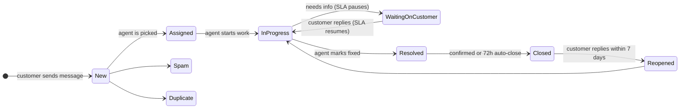

A ticket spends most of its life cycling between `InProgress` and `WaitingOnCustomer`. Everything else (SLA, routing, caching, audit) exists to support that loop correctly.

> **Take this with you.** A help desk is a state machine running on many conversations at once. The interesting problems are not about throughput. They are about correctness at every transition.

---

## How big this gets

Same product, two very different companies.

| Company | Agents | Tickets/day | Writes/sec (peak) | Open at once |
|---------|--------|-------------|-------------------|--------------|
| Startup | 3 | 50 | negligible | ~100 |
| Enterprise | 2,000 | 50,000 | ~15 | ~150,000 |

<details markdown="1">
<summary><b>Show: how the numbers come out</b></summary>

Assume each ticket takes an average of 3 days to resolve, and 8 messages total (customer ask, agent reply, follow-ups, close).

**Startup (50 tickets/day)**
- 50 / 86,400 = ~0.0006 tickets/sec. Nearly nothing.
- 8 messages each = 400 messages/day.
- 50 tickets/day x 3-day average = ~100 open at any moment.
- 5 years of data: about 1 GB total. Fits anywhere.

**Enterprise (50,000 tickets/day)**
- 50,000 / 86,400 = ~0.6 tickets/sec average, ~3 at peak.
- 8 messages each = 400,000 messages/day, ~5/sec average, ~15 at peak.
- 50,000/day x 3-day average = ~150,000 open at any moment.
- 2,000 agents refreshing dashboards every 30 seconds = ~65 reads/sec.
- 5 years: ~5 TB of text, ~50 TB of attachments in S3.

**What the math tells you.** This is not a high-throughput system. Even at enterprise scale, you write about 15 things per second. A single Postgres handles that. The design pressure is on read latency (65 agent dashboard reads/sec) and correctness (no lost tickets, no double-assigns).

Reads beat writes about 10 to 1. The read path matters more than the write path.

</details>

---

## The smallest version that works

Forget enterprise. Three agents, one channel: email. Tickets go to whoever is next in the rotation. No SLA timer yet.

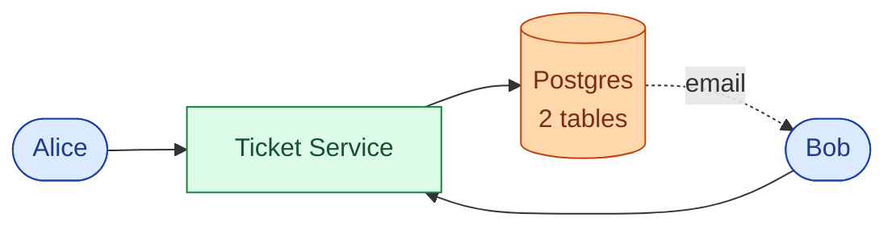

Three endpoints carry the whole product.

| Endpoint | What it does |
|----------|--------------|
| `POST /tickets` | Create a new ticket from an intake event |
| `POST /tickets/{id}/messages` | Add a reply (public) or internal note |
| `POST /tickets/{id}/status` | Transition state (assign, resolve, close, reopen) |

<details markdown="1">
<summary><b>Show: the two core tables</b></summary>

```sql
CREATE TABLE tickets (
    ticket_id       UUID PRIMARY KEY,
    public_ref      TEXT NOT NULL UNIQUE,   -- "TKT-1234" shown to customer
    subject         TEXT NOT NULL,
    customer_email  TEXT NOT NULL,
    assignee_id     TEXT,
    team_id         TEXT,
    status          TEXT NOT NULL DEFAULT 'new',
    priority        TEXT NOT NULL DEFAULT 'medium',
    created_at      TIMESTAMPTZ NOT NULL DEFAULT NOW(),
    first_response_at TIMESTAMPTZ,
    resolved_at     TIMESTAMPTZ
);

CREATE TABLE ticket_messages (
    message_id          UUID PRIMARY KEY,
    ticket_id           UUID NOT NULL REFERENCES tickets(ticket_id),
    author_type         TEXT NOT NULL,   -- 'customer' | 'agent' | 'system'
    author_id           TEXT,
    visibility          TEXT NOT NULL DEFAULT 'public',
    body                TEXT NOT NULL,
    inbound_message_id  TEXT,           -- email Message-ID header
    created_at          TIMESTAMPTZ NOT NULL DEFAULT NOW()
);
CREATE UNIQUE INDEX ON ticket_messages (inbound_message_id)
    WHERE inbound_message_id IS NOT NULL;
```

The unique index on `inbound_message_id` is load-bearing: when the email adapter crashes and reprocesses the same message, the duplicate insert fails silently. No duplicate messages on the ticket.

</details>

> **Take this with you.** Start with the smallest thing that works. The interview is really about what you add next, and why.

---

## Decision 1: how do we thread email replies?

The first crack shows up fast. A customer replies to a closed ticket from two weeks ago. The adapter has no idea this is a reply. It creates a new ticket. The customer is furious because the new agent has no context.

Threading an inbound email into the correct ticket requires checking multiple signals in order of trust.

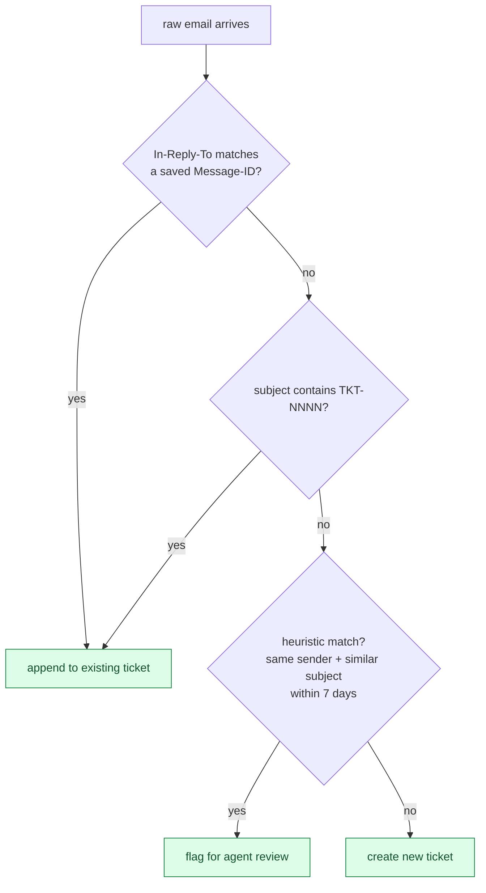

The three layers and what they catch:

| Layer | Signal | Catch rate | Risk |
|-------|--------|------------|------|
| RFC 5322 headers | `In-Reply-To` / `References` | ~85% | Low, headers are reliable |
| Subject tag | `[TKT-1234]` in subject | ~10% | Low, tag is injected by us |
| Heuristic | Same sender, similar subject | ~3% | Medium, can merge unrelated tickets |

The heuristic layer is off by default. Turn it on only after the first two cover the easy cases.

When the adapter sends an outbound message, it saves the outgoing `Message-ID`. Inbound replies carry `In-Reply-To: <that-message-id>`. A single index lookup on `ticket_messages.inbound_message_id` finds the match.

> **Take this with you.** Email threading by header is the single hardest part of a help desk. Build it in three layers: header match first, subject tag second, heuristics never on by default.

---

## Decision 2: how do we pick an agent?

A ticket arrives. 200 agents are logged in. Who gets it?

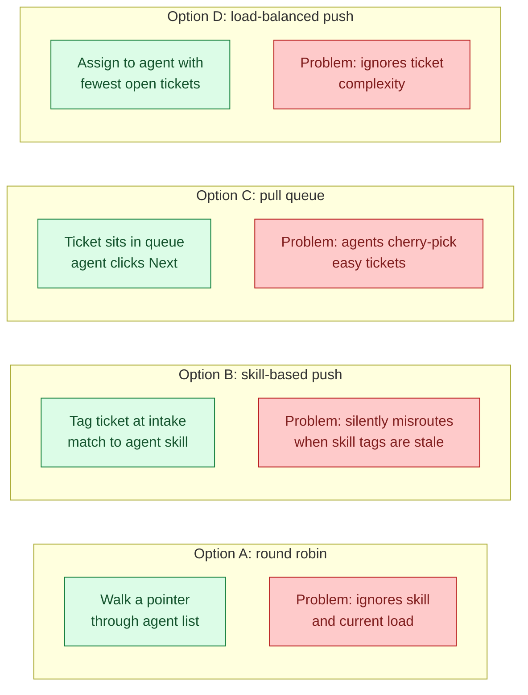

In practice, most systems combine B and D: skill-based to narrow the candidate pool, load-balanced to pick within that pool, pull queue as fallback when push fails.

The race to solve: two agents click "Next Ticket" at the same instant. Both queries return TKT-100. Both think it is theirs.

Fix: `SELECT ... FOR UPDATE SKIP LOCKED` in Postgres. Agent A locks TKT-100. Agent B's query sees the lock, skips it, and gets TKT-101. Both succeed. No application-level coordination needed.

<details markdown="1">
<summary><b>Show: pull-queue assignment with SKIP LOCKED</b></summary>

```python
def claim_next_ticket(agent):
    with db.transaction():
        ticket = db.query("""
            SELECT ticket_id FROM tickets
            WHERE team_id = ? AND assignee_id IS NULL
              AND status IN ('new', 'assigned')
            ORDER BY priority DESC, created_at ASC
            FOR UPDATE SKIP LOCKED
            LIMIT 1
        """, agent.team_id)
        if not ticket:
            return None
        db.update("tickets", ticket.id,
                  assignee_id=agent.id, status='assigned')
        db.insert("assignments",
                  ticket_id=ticket.id, agent_id=agent.id, reason='pulled')
        return ticket
```

</details>

> **Take this with you.** `FOR UPDATE SKIP LOCKED` is the standard Postgres pattern for work queues. One query, no locks at the application layer, no double-assigns.

---

## Decision 3: how do SLA timers work?

The CEO asks: "We promised enterprise customers a 1-hour first reply. How do we track that?"

Two things make this much harder than they look.

**Problem 1: business hours.** A ticket arrives Friday at 5 PM. The 1-hour SLA must pause at close of business and resume Monday at 9 AM. Deadlines are not `created_at + 1 hour`. They are `created_at + 1 business hour`, which requires walking forward through the team's schedule.

**Problem 2: clock pauses.** When an agent moves a ticket to `WaitingOnCustomer`, the clock must pause. If it keeps running, every ticket that needs customer input eventually breaches through no fault of the agent.

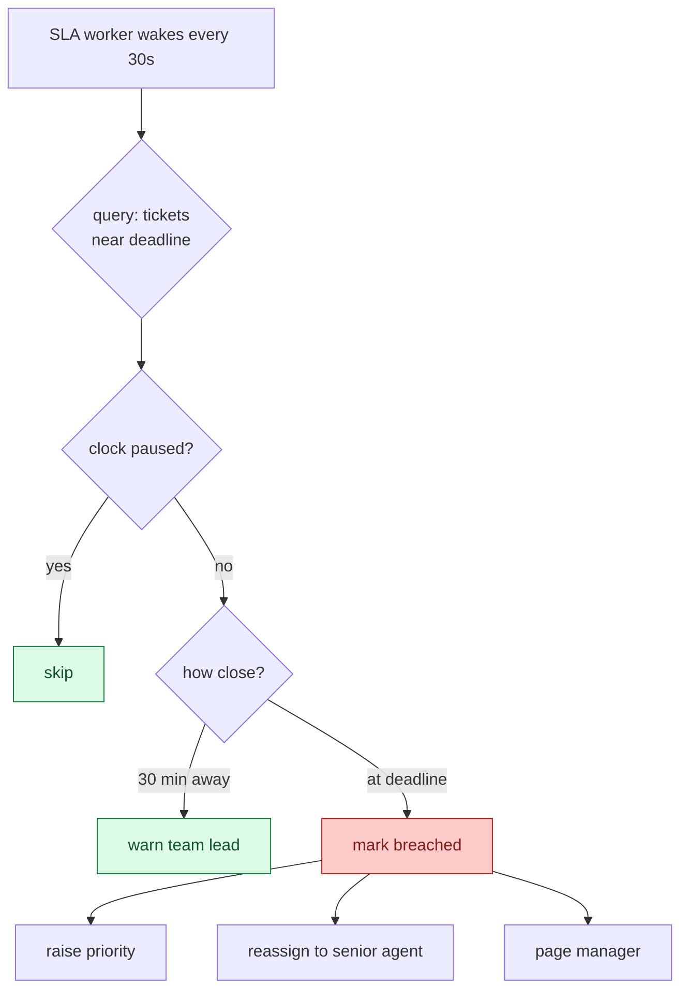

The SLA table is narrow by design. The worker scans it every 30 seconds with a tight index. Keeping SLA columns out of the wide tickets row makes the sweep fast.

<details markdown="1">
<summary><b>Show: SLA table, business-hour math, and the sweep worker</b></summary>

```sql
CREATE TABLE sla_targets (
    ticket_id           UUID PRIMARY KEY REFERENCES tickets(ticket_id),
    priority            TEXT NOT NULL,
    first_response_due  TIMESTAMPTZ,
    resolution_due      TIMESTAMPTZ,
    paused_at           TIMESTAMPTZ,
    pause_reason        TEXT,          -- 'waiting_on_customer' | 'out_of_hours'
    business_hours_id   TEXT NOT NULL,
    first_response_at   TIMESTAMPTZ,
    resolved_at         TIMESTAMPTZ,
    breach_state        TEXT NOT NULL DEFAULT 'on_track'
);
CREATE INDEX idx_sla_first ON sla_targets (first_response_due)
    WHERE first_response_at IS NULL AND paused_at IS NULL;
```

Business-hour-aware deadline computation:

```python
def add_business_time(start, duration, schedule):
    cursor = start
    remaining = duration
    while remaining > 0:
        if not schedule.is_business_time(cursor):
            cursor = schedule.next_window_start(cursor)
            continue
        window_end = schedule.current_window_end(cursor)
        chunk = min(remaining, window_end - cursor)
        cursor += chunk
        remaining -= chunk
    return cursor
```

The sweep worker runs every 30 seconds:

```python
def sla_sweep():
    rows = db.query("""
        SELECT ticket_id, first_response_due
        FROM sla_targets
        WHERE first_response_at IS NULL
          AND paused_at IS NULL
          AND first_response_due < NOW() + interval '30 minutes'
          AND breach_state != 'breached'
    """)
    for row in rows:
        if row.first_response_due < now():
            emit("sla.breached", row.ticket_id)
        else:
            emit("sla.warning", row.ticket_id)
```

Pause when ticket moves to `WaitingOnCustomer`:

```python
def pause_sla(ticket_id, reason):
    db.update("sla_targets", ticket_id, paused_at=now(), pause_reason=reason)

def resume_sla(ticket_id):
    target = db.get("sla_targets", ticket_id)
    if target.paused_at is None:
        return
    paused_for = now() - target.paused_at
    db.update("sla_targets", ticket_id,
              paused_at=None,
              first_response_due=target.first_response_due + paused_for,
              resolution_due=target.resolution_due + paused_for)
```

</details>

> **Take this with you.** SLA timers are not `created_at + N hours`. They require business-hour-aware math, a pause/resume mechanism, and a worker that sweeps regularly. Get any one wrong and the metric becomes untrustworthy.

---

## Decision 4: how do we keep notifications off the write path?

When a ticket is assigned, Bob gets a Slack DM and an email. If Slack is down, should the ticket creation fail? No.

The answer is to separate event emission from event delivery. The Ticket Service writes to Postgres and emits events to Kafka. A Notification Service consumes those events asynchronously and fans out to Slack, email, and push.

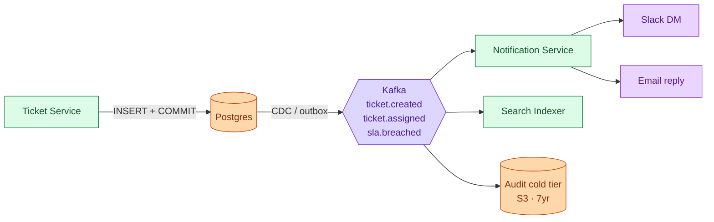

If Slack goes down at 3 AM, new tickets still get created and assigned. Agents just do not get Slack DMs until the queue drains.

> **Take this with you.** Anything reactive lives after Kafka, not before. Tie notifications to the write path and every Slack outage becomes a support outage.

---

## The full architecture

Putting the four decisions together:

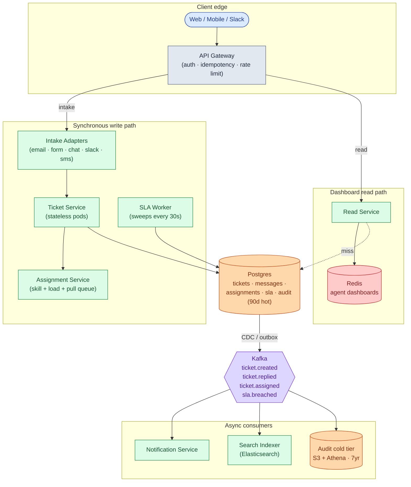

Each component in one line:

| Component | Purpose |
|-----------|---------|
| **API Gateway** | Authenticates callers, rate-limits bots, deduplicates mobile retries. |
| **Intake Adapters** | Parse channel-native format, thread replies into existing tickets, emit a common event. |
| **Ticket Service** | The state machine. Enforces valid transitions. Writes to Postgres transactionally. Stateless. |
| **Assignment Service** | "Which team? Which agent? Who is on shift right now?" |
| **SLA Worker** | Scans the SLA table every 30 seconds. Fires warnings and breach events. Pauses outside business hours. |
| **Postgres** | Source of truth. Live state plus 90 days of audit. |
| **Read Service + Redis** | Optimized for agent dashboards. Keeps the primary DB from being read constantly. |
| **Kafka** | Carries events to the async world. The boundary between synchronous writes and reactive consumers. |
| **Notification, Search Indexer, Audit cold tier** | Consumers. Not on the write path. If the notifier dies, tickets still flow. |

---

## Walk: one ticket, all the way through

Alice emails support@acme.com about a wrong order.

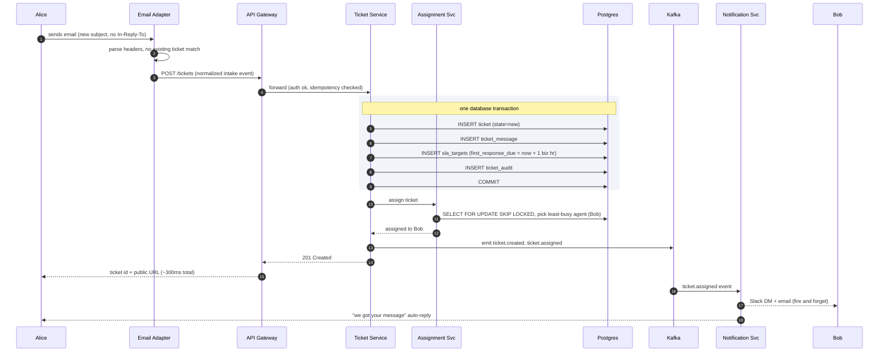

Three things to notice:

1. The ticket, the message, the SLA row, and the audit entry are written in one transaction. A crash mid-write rolls back cleanly.
2. Kafka is written after the commit. Slack notifications fan out from there. The write path does not wait for Slack.
3. Alice gets her confirmation in ~300ms. Bob gets notified a few seconds later via Kafka.

---

## Walk: SLA warning, then breach

48 minutes pass. Bob has not replied. The SLA worker wakes up.

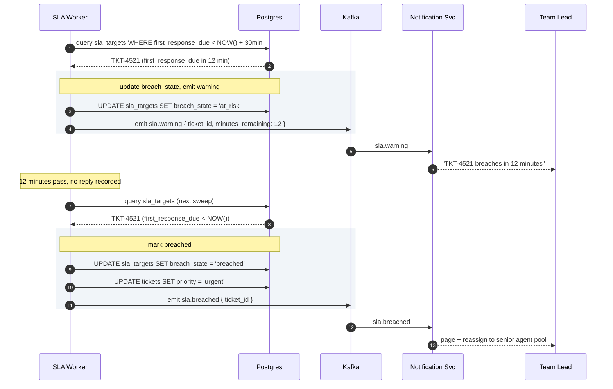

---

## The hard sub-problem: SLA windows with business hours across timezones

A customer in Tokyo submits a high-priority ticket at 11 PM Japan Standard Time. The support team is in San Francisco. It is 6 AM Pacific. Business hours have not started yet.

The SLA clock must not run during off-hours for the team. But it also must not confuse the customer's timezone with the team's timezone.

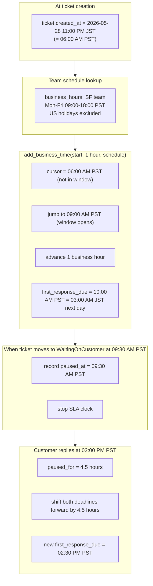

Two things the naive implementation gets wrong:

| Mistake | Consequence |
|---------|-------------|
| Use wall-clock time instead of business hours | SLA breaches happen over the weekend when nobody is on shift |
| Forget to pause when waiting on customer | Agents game the system by closing and reopening tickets to reset the clock |

> **Take this with you.** SLA correctness depends on three things working together: business-hour-aware deadline math, clock pauses on `WaitingOnCustomer`, and a reliable sweep worker. Break any one and the metric becomes meaningless.

---

## Follow-up questions

Try answering each in 2-3 sentences before opening the solution.

1. **Email threading when the subject is stripped.** A customer replies from a mobile app that removes the `[TKT-4521]` prefix. The email also has no `In-Reply-To` header. How do you still thread it into the right ticket?

2. **Intake adapter crashes mid-batch.** The email adapter pulled 50 messages from IMAP and crashed after processing 30. On restart, how do you avoid reprocessing the first 30 and losing the last 20?

3. **Two agents claim the same queued ticket.** Both click "Next Ticket" within the same second. The query returns the same ticket to both. How do you make sure only one gets it?

4. **SLA business hours across timezones.** Customer in Tokyo, team in San Francisco. Whose hours apply? What if the contract says "follow the sun"?

5. **Reopen after long silence.** A customer replies to a ticket closed 6 months ago. What does the system do?

6. **New issue from an existing customer.** A customer with an open billing ticket emails again about a completely different problem (login broken). Do you append to the old ticket or open a new one?

7. **Agent vacation handover.** Bob has 47 open tickets and starts a 2-week vacation. How do you hand them off?

8. **Spam at the front door.** Your support email gets 10,000 spam messages a day. How do you stop them from becoming tickets?

9. **Knowledge base suggestions at intake.** When a customer fills out the web form, you want to show 3 relevant KB articles before they hit submit. How do you do this without slowing the form?

10. **"Average time to resolve" is wrong.** Management says the dashboard shows 2 hours, but tickets actually take days. What is wrong, and how do you fix it?

---

## Related problems

- **[Approval Management (011)](../011-approval-management/question.md).** Same state-machine + role-routing + SLA-timer patterns. A ticket's lifecycle is structurally identical to an approval's lifecycle.
- **[Notification System (010)](../010-notification-system/question.md).** Every ticket state change (assigned, replied, breached, resolved) fans out to email, Slack, and push. The retry and quiet-hours machinery there is what consumes ticket events.
- **[Comment System (015)](../015-comment-system/question.md).** Ticket messages are shaped like comments: threaded, paginated, with attachments. The same storage and indexing patterns apply.
- **[Read-Heavy System Patterns (017)](../017-read-heavy-patterns/question.md).** Agent dashboards and customer portals load tickets thousands of times per day. Cache tiering and read replicas from that problem apply directly here.


<div class="pr-solution-divider"></div>


## Solution: Help Desk Ticketing System

### The short version

A help desk is a small state machine with a messy front door.

The front door is the hard part. Emails arrive over IMAP with broken subject lines. Chats arrive over WebSockets. Web forms post JSON. Each channel needs an adapter that parses raw input, threads replies into existing tickets, and emits a common intake event.

Once a ticket exists, it follows a defined lifecycle: `new -> assigned -> in_progress -> (waiting_on_customer loops) -> resolved -> closed`. The Ticket Service enforces valid transitions and writes to Postgres. An Assignment Service picks the team and agent. An SLA Worker sweeps every 30 seconds, pauses outside business hours, and fires escalation events on breach.

Scale is not the hard part. Even at 50,000 tickets per day with 2,000 agents, you write about 15 things per second. The interesting work is correctness: email threading, SLA pause and resume across business hours, assignment races, and reopen logic after customer silence.

---

### 1. The two questions that matter most

**Which channels?** Email is the messiest because reply threading requires parsing RFC 5322 headers and falling back to subject tags. Every channel after email is just a new adapter. Adding Slack later means writing a Slack adapter, not changing the core system.

**What does the SLA look like?** Wall-clock SLA ("respond in 1 hour") is three lines of code. Business-hour SLA across timezones is a real engineering project and the source of most reporting bugs in production.

Everything else (assignment strategy, escalation rules, audit retention) follows from those two answers.

---

### 2. The math, in plain numbers

| Scale | Tickets/day | Writes/sec (peak) | Open at once | Agent reads/sec |
|-------|-------------|-------------------|--------------|-----------------|
| Startup (3 agents) | 50 | negligible | ~100 | ~3 |
| Enterprise (2,000 agents) | 50,000 | ~15 | ~150,000 | ~65 |

Three observations:

- **150,000 open tickets at any moment** at enterprise scale. "Show me my pending tickets" must return in under 50ms.
- **Reads beat writes 10 to 1.** Every agent refreshes their dashboard a few times per minute. Caching the read path matters more than write throughput.
- **15 writes per second at peak.** A single Postgres handles this. The architecture exists for correctness and read latency, not for QPS.

---

### 3. The API

Three endpoints carry the whole product. Create a ticket. Add a message. Change status.

```
POST /api/v1/tickets
Idempotency-Key: <uuid>

{
  "subject": "Wrong order received",
  "body": "I ordered size L but received size S...",
  "channel": "email",
  "customer_email": "alice@example.com"
}
```

```
POST /api/v1/tickets/{ticket_id}/messages

{
  "body": "Can you share the order number?",
  "visibility": "public" | "internal"
}
```

A `public` message also pushes out via the outbound adapter (email reply, Slack DM). An `internal` message is an agent-only note. The customer never sees it.

```
POST /api/v1/tickets/{ticket_id}/status

{
  "status": "waiting_on_customer" | "resolved" | "closed",
  "reason": "Asked for order number"
}
```

An invalid transition (like `closed -> in_progress` without going through `reopened`) returns `422 Unprocessable Entity`.

Small but load-bearing choices:

| Choice | Reason |
|--------|--------|
| `Idempotency-Key` required on create | SES retries on timeout. Mobile clients retry. Without the key, you create duplicate tickets. |
| `visibility: internal` | The outbound adapter checks this flag before sending. Keeps agent war-room notes from reaching the customer. |
| Messages are the unit of conversation | Tickets group messages. Messages carry content. This separation lets you page through a long conversation without touching the ticket row. |

Status codes: **409** means idempotency key collision, return the existing ticket. **410** means the ticket was merged and this ID no longer exists.

---

### 4. The data model

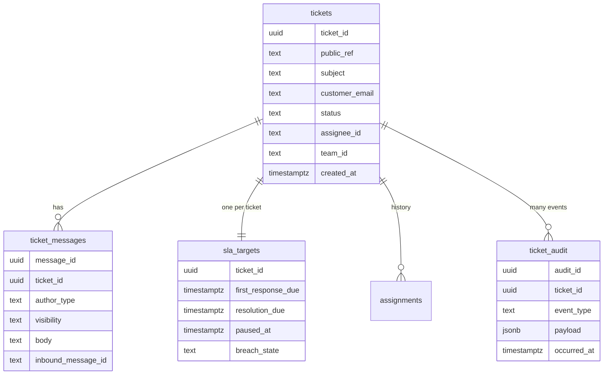

<details markdown="1">
<summary><b>Show: the full SQL</b></summary>

```sql
CREATE TABLE tickets (
    ticket_id           UUID PRIMARY KEY,
    public_ref          TEXT NOT NULL UNIQUE,
    subject             TEXT NOT NULL,
    customer_id         TEXT,
    customer_email      TEXT,
    channel             TEXT NOT NULL,
    channel_thread_id   TEXT,
    status              TEXT NOT NULL DEFAULT 'new',
    priority            TEXT NOT NULL DEFAULT 'medium',
    team_id             TEXT,
    assignee_id         TEXT,
    tags                TEXT[] DEFAULT '{}',
    created_at          TIMESTAMPTZ NOT NULL DEFAULT NOW(),
    updated_at          TIMESTAMPTZ NOT NULL DEFAULT NOW(),
    first_response_at   TIMESTAMPTZ,
    resolved_at         TIMESTAMPTZ,
    closed_at           TIMESTAMPTZ,
    reopen_count        INT NOT NULL DEFAULT 0,
    parent_ticket_id    UUID,
    metadata            JSONB
);
CREATE INDEX idx_tk_assignee_status ON tickets (assignee_id, status)
    WHERE status NOT IN ('closed','spam','duplicate');
CREATE INDEX idx_tk_team_status ON tickets (team_id, status, priority);
CREATE INDEX idx_tk_customer ON tickets (customer_id, created_at DESC);
CREATE INDEX idx_tk_channel_thread ON tickets (channel, channel_thread_id);

CREATE TABLE ticket_messages (
    message_id          UUID PRIMARY KEY,
    ticket_id           UUID NOT NULL REFERENCES tickets(ticket_id),
    author_type         TEXT NOT NULL,
    author_id           TEXT,
    visibility          TEXT NOT NULL DEFAULT 'public',
    body                TEXT NOT NULL,
    body_format         TEXT NOT NULL DEFAULT 'plain',
    inbound_channel     TEXT,
    inbound_message_id  TEXT,
    in_reply_to         TEXT,
    attachments         JSONB DEFAULT '[]',
    created_at          TIMESTAMPTZ NOT NULL DEFAULT NOW()
);
CREATE INDEX idx_msg_ticket ON ticket_messages (ticket_id, created_at);
CREATE UNIQUE INDEX idx_msg_inbound ON ticket_messages (inbound_message_id)
    WHERE inbound_message_id IS NOT NULL;

CREATE TABLE assignments (
    assignment_id   UUID PRIMARY KEY,
    ticket_id       UUID NOT NULL REFERENCES tickets(ticket_id),
    team_id         TEXT NOT NULL,
    agent_id        TEXT,
    assigned_at     TIMESTAMPTZ NOT NULL DEFAULT NOW(),
    unassigned_at   TIMESTAMPTZ,
    assigned_by     TEXT,
    reason          TEXT
);
CREATE INDEX idx_assignments_agent ON assignments (agent_id) WHERE unassigned_at IS NULL;

CREATE TABLE sla_targets (
    ticket_id           UUID PRIMARY KEY REFERENCES tickets(ticket_id),
    priority            TEXT NOT NULL,
    first_response_due  TIMESTAMPTZ,
    resolution_due      TIMESTAMPTZ,
    paused_at           TIMESTAMPTZ,
    pause_reason        TEXT,
    business_hours_id   TEXT NOT NULL,
    first_response_at   TIMESTAMPTZ,
    resolved_at         TIMESTAMPTZ,
    breach_state        TEXT NOT NULL DEFAULT 'on_track'
);
CREATE INDEX idx_sla_first ON sla_targets (first_response_due)
    WHERE first_response_at IS NULL AND paused_at IS NULL;
CREATE INDEX idx_sla_res ON sla_targets (resolution_due)
    WHERE resolved_at IS NULL AND paused_at IS NULL;

CREATE TABLE ticket_audit (
    audit_id        UUID PRIMARY KEY,
    ticket_id       UUID NOT NULL,
    occurred_at     TIMESTAMPTZ NOT NULL DEFAULT NOW(),
    event_type      TEXT NOT NULL,
    actor_type      TEXT NOT NULL,
    actor_id        TEXT,
    payload         JSONB NOT NULL
);
CREATE INDEX idx_audit_ticket ON ticket_audit (ticket_id, occurred_at);
```

</details>

Four small things doing real work:

**Composite index `(assignee_id, status)`.** Serves the single most common query: "show me my open tickets." Without it, every agent dashboard scans the full tickets table.

**`UNIQUE` on `ticket_messages.inbound_message_id`.** When the email adapter crashes and reprocesses the same message, the duplicate insert fails silently. No duplicate messages on the ticket.

**`assignments` is history, not current state.** The current assignee lives on the ticket row for fast reads. The full reassignment history lives in `assignments` for audit and analytics.

**`sla_targets` is a separate narrow table.** The SLA worker scans it every 30 seconds. Keeping SLA columns out of the wide tickets row makes the index small and the sweep fast.

Why Postgres and not Cassandra? State-machine transitions need ACID. When an agent replies, three things must happen together: insert the message, set `first_response_at`, and update `sla_targets`. Postgres gives you that in one transaction.

---

### 5. The intake engine

Email is the hardest channel. For each inbound message, the adapter checks three layers in order.

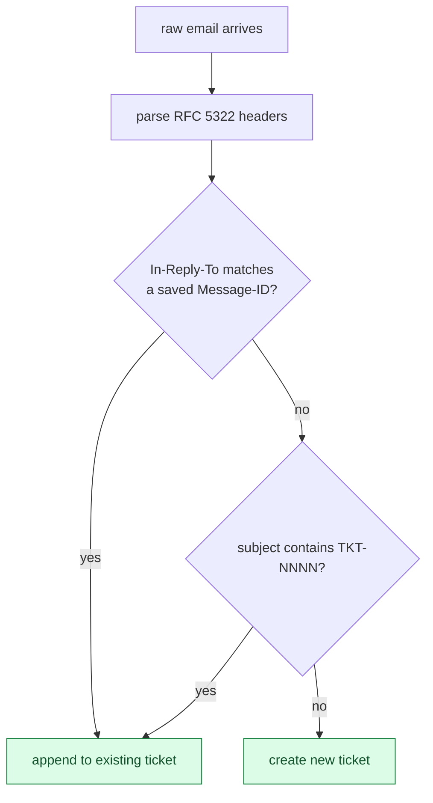

<details markdown="1">
<summary><b>Show: the threading algorithm</b></summary>

```python
def handle_inbound_email(raw_email):
    msg = parse_email(raw_email)

    if is_spam(msg):
        record_dropped(msg, reason='spam')
        return

    # Layer 1: RFC 5322 headers
    parent_id = msg.headers.get('In-Reply-To')
    refs = msg.headers.get('References', '').split()
    candidates = [parent_id] + refs if parent_id else refs

    existing_ticket = None
    for mid in candidates:
        row = db.query(
            "SELECT ticket_id FROM ticket_messages WHERE inbound_message_id = ?", mid)
        if row:
            existing_ticket = row.ticket_id
            break

    # Layer 2: subject tag
    if not existing_ticket:
        ref = extract_ticket_ref(msg.subject)   # looks for [TKT-NNNN]
        if ref:
            existing_ticket = db.query(
                "SELECT ticket_id FROM tickets WHERE public_ref = ?", ref)

    # Layer 3: heuristic (off by default)

    if existing_ticket:
        emit("ticket.reply_received", existing_ticket, msg)
    else:
        emit("ticket.intake", channel='email', payload=normalize(msg))
```

</details>

The three layers in order of trust: header match (~85%), subject tag (~10%), heuristic (off by default). The remaining ~5% open new tickets. Agents merge duplicates via a "merge into" button.

> **Take this with you.** If 5% of all replies open new tickets instead of threading, agents spend their day merging instead of answering.

---

### 6. The state machine

The Ticket Service enforces valid transitions. Any attempt to jump to an invalid state returns `422`. The machine:

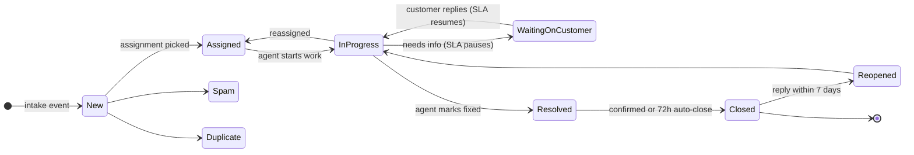

<details markdown="1">
<summary><b>Show: the transition table in code</b></summary>

```python
VALID_TRANSITIONS = {
    'new':                  {'assigned', 'spam', 'duplicate'},
    'assigned':             {'in_progress', 'new'},
    'in_progress':          {'waiting_on_customer', 'resolved', 'assigned'},
    'waiting_on_customer':  {'in_progress', 'resolved'},
    'resolved':             {'closed', 'in_progress'},
    'closed':               {'reopened'},
    'reopened':             {'in_progress'},
}

def transition(ticket, new_status):
    if new_status not in VALID_TRANSITIONS.get(ticket.status, set()):
        raise InvalidTransition(ticket.status, new_status)
    with db.transaction():
        db.update("tickets", ticket.id, status=new_status)
        db.insert("ticket_audit", event_type="status_changed",
                  payload={"from": ticket.status, "to": new_status})
        if new_status == 'waiting_on_customer':
            pause_sla(ticket.id, reason='waiting_on_customer')
        elif ticket.status == 'waiting_on_customer' and new_status == 'in_progress':
            resume_sla(ticket.id)
```

</details>

---

### 7. The architecture

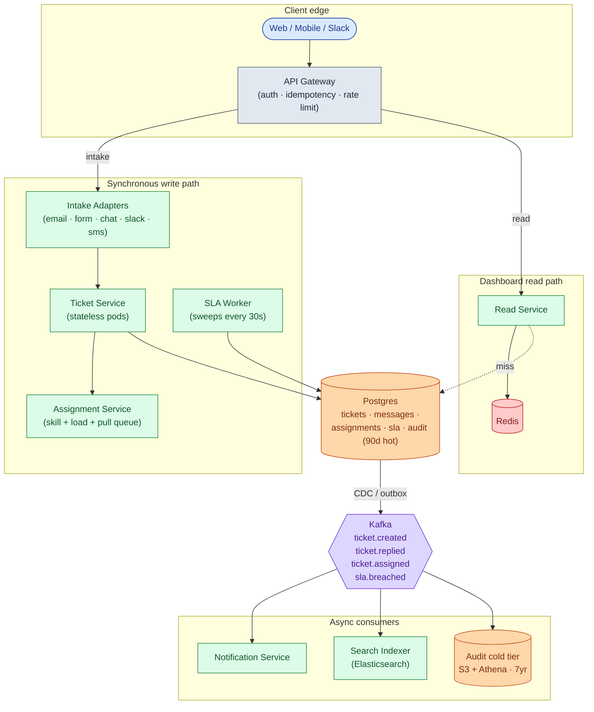

Five things to notice:

- The Ticket Service is the only writer to Postgres. Everything else is downstream of Kafka. Notifier down? Tickets still get created and assigned. Emails just queue up.
- Intake adapters track their own progress (`last_processed_uid` per IMAP mailbox). Crash and resume without losing or duplicating messages.
- The Ticket Service is stateless. State lives in Postgres. Roll pods during the day with zero impact.
- The SLA Worker is a separate process. A slow sweep cannot stall the API. At large scale, shard by `ticket_id` hash across N pods.
- Audit lives in two tiers. Last 90 days in Postgres for fast queries. Older rows in S3 Parquet for compliance queries via Athena.

---

### 8. A ticket, end to end

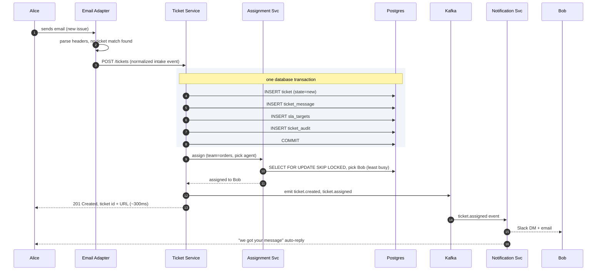

Target latencies:

| Operation | P99 |
|-----------|-----|
| Web form intake | ~300ms |
| Agent reply | ~200ms |
| Dashboard read (cache hit) | ~5ms |
| Dashboard read (cache miss) | ~50ms |
| Full-text search | ~150ms |

Recording an agent reply follows the same shape. The Ticket Service validates the transition, opens a transaction, inserts the message, updates `first_response_at`, updates `sla_targets`, writes an audit event, and commits. The Kafka event triggers the outbound adapter to send the reply email. Agent dashboard reads hit the Read Service, check Redis `agent:{id}:open_tickets`, fall through to Postgres read replica on miss.

---

### 9. The scaling journey: 10 users to 1 million

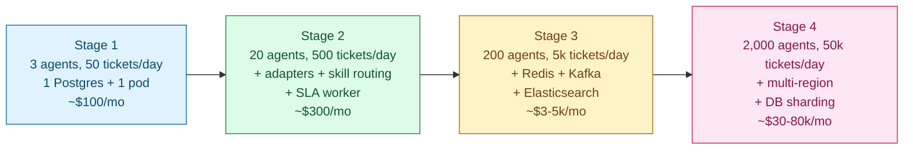

#### Stage 1: 3 agents, 50 tickets per day

One Postgres on a t3.medium. One Ticket Service process. One IMAP poller. Assignment is round-robin. SLA is a cron job every minute. Notifications are inline HTTP calls to SendGrid. About $100/month. Postgres is bored. Build nothing before it hurts.

#### Stage 2: 20 agents, 500 tickets per day

Something breaks: marketing adds a web form (need a second adapter). Billing and technical agents diverge (need skill-based routing). A customer on a $50k contract asked why their SLA was breached on a Sunday.

Add web form and chat adapters. Add skill-based routing via ticket tags matched to agent skill arrays. Add a dedicated SLA worker that understands business hours. Add `ticket_audit`. Still no Kafka, no Redis, no Elasticsearch. About $300/month.

#### Stage 3: 200 agents, 5,000 tickets per day

Several things break at once. Agent dashboards take 3 seconds. Full-text search takes 4 seconds. The SLA worker takes 45 seconds per sweep over 30k open tickets.

Add two Postgres read replicas. Add Redis for agent dashboard cache. Bring in Kafka properly. Pipe Postgres changes to Elasticsearch via Debezium. Shard the SLA worker by `ticket_id` hash. Add WebSockets so dashboards get live updates instead of polling. Cost: $3-5k/month.

#### Stage 4: 2,000 agents, 50,000 tickets per day, 4 regions

New problems: a long analytics query stalls the Ticket Service. EU mailbox intake from US-East adds 150ms latency. Enterprise customers require data residency.

Shard the tickets DB by `team_id`. Deploy per-region stacks (US, EU, APAC, AU). Each region has its own intake adapters, Ticket Service, DB shards, Redis, and Kafka. The core architecture has not changed since Stage 3. The data model is identical to Stage 1. Cost: $30-80k/month.

---

### 10. Reliability

**Intake adapters use at-least-once delivery.** Track `last_processed_uid` per IMAP mailbox. Commit only after the message is safely staged in Postgres. On crash and restart, resume from the last UID. Reprocessed messages are deduped by the unique index on `ticket_messages.inbound_message_id`.

**The SLA Worker is stateless and idempotent.** State lives in `sla_targets`. On restart, the next sweep picks up where the last left off. Worst case: 30 seconds of breach-detection lag. Run two workers active-active behind per-shard advisory locks.

**Assignment races.** Two `assign_ticket` calls for the same team: serialized by a team-level `SELECT FOR UPDATE`. Two pull-queue calls for the same ticket: serialized by `SKIP LOCKED`. No application-level coordination needed.

**Notification failures.** Kafka consumers run at-least-once with exponential backoff. Dead-letter topic after max retries, watched by an on-call dashboard.

**Postgres failover.** Primary dies, replica promotes. In-flight transactions roll back. Clients retry with idempotency keys. Workers reconnect within seconds.

---

### 11. Observability

| Metric | Why it matters |
|--------|----------------|
| `tickets.created.rate` by channel | Sudden drop means an adapter is broken. Spike means an outage or marketing blast. |
| `tickets.in_flight.count` by team | Slow rise means a team is falling behind. |
| `time_to_first_response` p50/p95 | The headline customer-facing SLO. |
| `time_to_resolution` p50/p95 by priority | The other headline SLO. |
| `sla.breach.rate` by priority and team | Per-team operational health. |
| `agent.utilization` | Identifies overloaded agents and underused agents. |
| `assignment.latency` p99 | High means the Assignment Service is contended on team-level locks. |
| `intake.threading.success_rate` | Fraction of emails that thread into an existing ticket. Drop means headers are being stripped. |
| `kb.suggestion.deflection.rate` | Customers who saw KB suggestions and closed the form without submitting. The self-service ROI metric. |
| `audit.write.lag` | Audit must not lag. Alert at more than 5 seconds. |

Page on: any adapter offline for more than 2 minutes. SLA worker not running. Postgres primary unreachable.

Ticket on: `time_to_first_response` p95 regression more than 30%. `sla.breach.rate` doubles. Reopen rate above 10%.

---

### 12. Follow-up answers

**1. Email threading when subject is stripped.**

`In-Reply-To` and `References` headers are the primary signal. About 85% of replies hit this path. A single index lookup on `ticket_messages.inbound_message_id` finds the match. Subject tag `[TKT-1234]` is the fallback for corporate mail proxies that strip headers. If all three fail, a new ticket opens and the agent merges via "merge into."

**2. Intake adapter crashes mid-batch.**

The adapter never advances `last_processed_uid` until the message is safely staged. On restart, it resumes from the last saved UID. Reprocessed messages fail silently on the unique constraint in `ticket_messages`. No message loss. No duplicate tickets.

**3. Two agents claim the same queued ticket.**

The pull query uses `SELECT ... FOR UPDATE SKIP LOCKED LIMIT 1` inside a transaction. Agent A locks TKT-100 and writes `assignee_id`. Agent B's identical query at the same instant skips TKT-100 (already locked) and gets TKT-101. Both commit. No conflict. This is the canonical Postgres use case for `SKIP LOCKED`.

**4. SLA business hours across timezones.**

Default: the team's business hours schedule (for example, "US-West 9-6 weekdays, US holidays excluded"). Enterprise contracts that specify 24/7 coverage get `business_hours_id = always`. The contract policy lives on the customer record and overrides the team default at ticket creation time. For "follow the sun," set the customer's policy to `always` and let the assignment service route to whichever region is on shift.

**5. Reopen after long silence.**

Within 7 days of `closed_at`, a customer reply reactivates the original ticket: status goes to `reopened`, immediately to `in_progress`, and `reopen_count` increments. The SLA clock resets, optionally to a tighter reopen SLA (4 hours instead of 24).

Outside the 7-day window, a new ticket opens with `parent_ticket_id` pointing to the closed one. The agent UI surfaces the parent: "This customer had a related issue previously."

**6. New issue from a customer with an open ticket.**

Open a new ticket by default. The unrelated-issue case is more common than the follow-up case. Threading logic decides: `In-Reply-To` pointing to a message in the existing ticket means append. Subject tag match means append. Anything else means a new ticket.

**7. Agent vacation handover.**

The agent sets `out_of_office: {start, end, delegate_id}` in their profile. On the start date, a job reassigns all open tickets to the delegate (or to the team queue if no delegate), records `reason: vacation_handover` in `assignments`, and notifies the delegate. For new tickets where the OOO agent would have been the round-robin pick, skip them in the rotation until the end date.

**8. Spam at the front door.**

Layered defense: SPF/DKIM/DMARC at SMTP rejects spoofed mail. SpamAssassin or AWS SES spam scoring sends high-score mail to a quarantine mailbox, not the ticket database. Per-sender rate limits drop bulk senders. A known-customer allowlist bypasses aggressive filtering. The 1% that gets through is closed as `spam` with a single click.

**9. KB suggestions at intake.**

As the customer types, debounce 500ms then call `POST /api/v1/kb/suggest` with the current subject and body. The endpoint queries Elasticsearch (top 3 articles by relevance) and returns within 50ms. Display inline above the submit button. Track whether the customer submits anyway (`kb.suggestion.deflection`). Mature systems deflect 20-40% of would-be tickets.

**10. "Average time to resolve" is wrong.**

Three common bugs. First: it includes `waiting_on_customer` time, but the agent was not working then. Subtract time in that state. Second: it uses wall-clock time and ignores business hours. A ticket created Friday 5 PM and resolved Monday 10 AM is not 65 hours; it is about 3 business hours. Third: it counts spam and duplicate tickets, which close instantly and drag the average down. Exclude them. Show p50 and p95 alongside the average. The average alone hides long-tail outliers.

---

### 13. Trade-offs worth saying out loud

**Push vs pull assignment.** Push gives every ticket an owner instantly, which is better for SLA accountability. Pull avoids assigning to agents who just logged off and preserves agent autonomy. Most production setups push by default with pull as fallback when the pushed agent is unavailable.

**Postgres full-text search vs Elasticsearch.** Postgres FTS with a `tsvector` GIN index handles up to about 1 million tickets cheaply. Elasticsearch is a separate cluster to operate but gives faceted search, fuzzy matching, and sub-100ms relevance ranking. Switch when FTS latency exceeds 500ms or when the product asks for facets.

**Per-ticket scheduled timers vs sweep worker.** Per-ticket timers sound clean but cancellation on resolve or pause becomes brittle at 150k open tickets. Sweep is boring, reliable, and easy to debug. The cost is up to 30 seconds of breach-detection lag. Nobody notices.

**Custom build vs Zendesk.** If support volume is small, buy. Build when you have unusual integrations, a workflow that does not fit the SaaS model (regulated industries, embedded support, deep cross-system automation), or volume large enough that the per-agent bill exceeds the engineering cost.

---

### 14. Common mistakes

**Tickets as CRUD with a status column.** If any agent can flip `status` to any value, you have a Trello clone. The state machine is the system.

**No intake adapter layer.** Jumping straight to "the API takes JSON" misses the entire email-parsing and threading problem. That is the single hardest part of the system.

**Round-robin assignment at any scale.** Works for teams under 10 people. Breaks at 20+ when skill matters and at 100+ when load matters.

**Wall-clock SLA with no business hours.** Most candidates skip this. Real enterprise customers will not tolerate a 24-hour SLA that expires Sunday at 3 AM.

**No SLA pause for `waiting_on_customer`.** Without pause, every ticket that needs customer input eventually breaches. Agents learn to game it. The metric loses all meaning.

**No reopen handling.** Customer replies to a closed ticket, a new ticket opens, conversation history is lost. Build the 7-day reopen window from day one.

**Email threading by subject only.** Subjects get rewritten, prefixed with "FW:" or "RE:", and translated. Use `In-Reply-To` as the primary signal.

**No assignment race control.** Two agents claim the same ticket without `SKIP LOCKED` and you get split-brain assignments. One agent works the ticket. The other also works it. The customer gets two conflicting replies.

**Notifications glued to the Ticket Service.** Tickets emit events. The notification service consumes them. Coupling them means you cannot swap Slack for Teams without touching the core service.

If you can name seven of these nine unprompted, you are interviewing at senior or staff level. The three that separate strong from average: state machine over CRUD, email threading by headers not subject, and business-hour SLA pausing.

