
## The scene

You sit down. The interviewer leans forward.

> *"Our support team gets 500 emails a day. Some come from the web form, some from Slack, some from direct email. An agent reads each one, answers it, and closes it. Sometimes the customer writes back. Sometimes nobody responds and the ticket just sits there."*
>
> *"We need a system to manage all of this. We promised our enterprise customers: first reply within one hour, full fix within 24. If we miss that window, we want to know before it happens."*
>
> *"Build me a basic Zendesk."*

That sounds like a to-do list with a status column. It is not.

The word **ticket** sounds like a row in a table. The real questions are harder:

- An email arrives. Is it a brand-new problem, or a reply to a ticket from last week?
- 200 agents are online. Who gets this ticket? The one with the right skill? The least busy one?
- A ticket comes in Friday at 5 PM. Does the SLA clock count Saturday and Sunday?
- A customer goes silent for six months, then replies. Do you reopen the old ticket or start a new one?

Real products (Zendesk, Freshdesk, ServiceNow, Intercom) all solve the same five sub-problems: **intake, lifecycle, assignment, SLA timers, and reporting**. We will walk through each one.

We start with a 3-agent startup. We end with 2,000 agents across four regions. At every step we name what just broke and add the smallest fix.

---

## Step 1: Picture one ticket

Before any boxes, just picture what one ticket **is**. A customer reports a problem. An agent fixes it. That is the whole product.

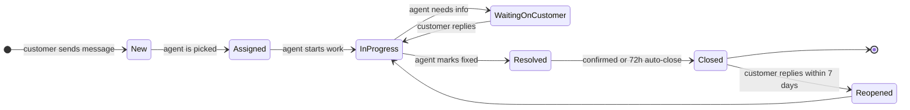

That is the whole product in one picture. Everything we add later (SLA, assignment, multi-channel intake, audit) is a complication on top of this core loop.

> **Take this with you.** A help desk is a small state machine running on a lot of conversations. The interesting problems are not about throughput. They are about correctness at every transition.

---

## Step 2: Ask the right questions

In a real interview, pause for two minutes and write down what you want to ask. Not twenty questions. Five sharp ones.

<details markdown="1">
<summary><b>Show: 5 questions that change the design</b></summary>

1. **Which channels?** Email only, or also chat, web form, Slack, SMS? *Each channel needs its own adapter. Email is the messiest because of reply threading. Chat is the easiest because the session already groups messages.*

2. **How many tickets per day, and how many agents?** 50 tickets with 3 agents is a weekend project. 50,000 tickets with 2,000 agents is a real distributed system.

3. **What does the SLA look like?** "Respond in 1 hour, resolve in 24 hours" is common. The big question: is the clock 24/7, or does it pause outside business hours? *Business-hour SLAs are the single most error-prone part of the entire system.*

4. **How does the system pick an agent?** Round robin? By skill? Pull queue? Least busy? *The wrong choice burns out a few agents while others sit idle.*

5. **How long do we keep closed tickets?** Standard compliance is 5-7 years. HIPAA needs longer. GDPR may require deletion.

A strong candidate also asks the meta question: *"Is sending notifications part of this service, or a separate one?"* The right answer is separate. The ticket system emits events. A notification service consumes them.

</details>

---

## Step 3: How big is this thing?

Same product, two very different companies.

| Company | Agents | Tickets/day | Writes/sec | Open at once |
|---------|--------|-------------|------------|--------------|
| Startup | 3 | 50 | tiny | ~100 |
| Enterprise | 2,000 | 50,000 | ~5 avg, ~15 peak | ~150,000 |

<details markdown="1">
<summary><b>Show: how the numbers come out</b></summary>

Assume each ticket takes an average of 3 days to resolve, and 8 messages total (customer ask, agent reply, follow-ups, close).

**Startup (50 tickets/day)**
- 50 / 86,400 = ~0.0006 tickets/sec. Nearly nothing.
- 8 messages each = 400 messages/day.
- 50 tickets/day × 3-day average = ~100 open at any moment.
- 5 years of data: about 1 GB total. Fits anywhere.

**Enterprise (50,000 tickets/day)**
- 50,000 / 86,400 = ~0.6 tickets/sec average, ~3 at peak.
- 8 messages each = 400,000 messages/day, ~5/sec average, ~15 at peak.
- 50,000/day × 3-day average = ~150,000 open at any moment.
- 2,000 agents refreshing dashboards every 30 seconds = ~65 reads/sec.
- 5 years: ~5 TB of text, ~50 TB of attachments in S3.

**What the math tells you.** This is not a high-throughput system. Even at enterprise scale, you write about 15 things per second. A single Postgres handles that comfortably. The hard numbers are about read latency (65 agent dashboard reads/sec) and correctness (do not lose tickets, do not double-assign).

Reads beat writes about **10 to 1**. The read path matters more than the write path.

</details>

---

## Step 4: The smallest thing that works

Forget enterprise. We are a 3-agent startup. One channel: email. Tickets go to whoever is next in the rotation. No SLA timer yet.

Three boxes. Nothing else.

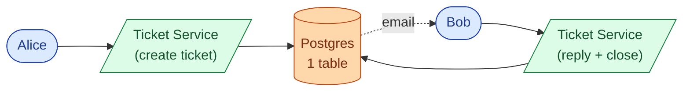

The happy path from email to close:

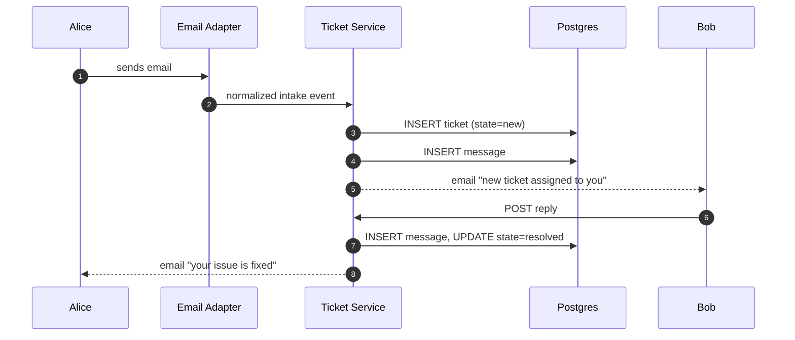

<details markdown="1">
<summary><b>Show: the two core tables</b></summary>

```sql
CREATE TABLE tickets (
    ticket_id       UUID PRIMARY KEY,
    subject         TEXT NOT NULL,
    customer_email  TEXT NOT NULL,
    assignee_id     TEXT,
    status          TEXT NOT NULL DEFAULT 'new',
    created_at      TIMESTAMPTZ NOT NULL DEFAULT NOW(),
    resolved_at     TIMESTAMPTZ
);

CREATE TABLE ticket_messages (
    message_id  UUID PRIMARY KEY,
    ticket_id   UUID NOT NULL REFERENCES tickets(ticket_id),
    author_id   TEXT,
    body        TEXT NOT NULL,
    created_at  TIMESTAMPTZ NOT NULL DEFAULT NOW()
);
```

Two tables. This is the right place to start. Everything we add from here is a response to a real problem that showed up in production.

</details>

> **Take this with you.** Always start from the smallest thing that works. The interview is really about what you add next, and why.

---

## Step 5: The first crack

The startup grows. Two things happen in the same week.

First, a customer replies to a closed ticket from two weeks ago. The adapter has no idea this is a reply. It creates a new ticket. The new ticket gets assigned to a different agent, who has no context. The customer is furious.

Second, the CEO asks: *"We promised enterprise customers a 1-hour first reply. How do we track that?"*

Two separate problems. Both reveal that the skeleton we built is missing something real.

For the reply problem, you need **email threading**: the ability to look at an inbound email and decide whether it is a new ticket or a reply to an existing one.

For the SLA problem, you need a **timer per ticket** that knows when the clock started and when it must stop.

Neither of these is complicated in isolation. Together they introduce a pattern that runs through the entire system: **the system must track state over time, not just state at a single moment**.

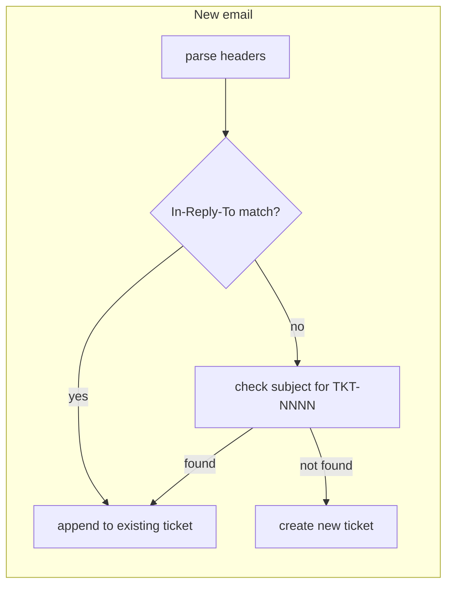

<details markdown="1">
<summary><b>Show: how email threading works, layer by layer</b></summary>

Every email has a `Message-ID` header (a globally unique string). When you reply in Gmail, the reply includes `In-Reply-To: <original-message-id>`. That is the primary threading signal.

**Layer 1: `In-Reply-To` and `References` headers (RFC 5322)**

When the help desk sends an agent reply, it saves the outgoing `Message-ID`. When a customer replies, the adapter checks whether the incoming `In-Reply-To` matches any saved `Message-ID`. If it does, the email goes onto the existing ticket. This catches about 85% of replies.

**Layer 2: Subject tag**

Some corporate mail proxies strip email headers. So every outbound message also injects a tag into the subject:

```
Subject: Re: [TKT-4521] Cannot log in
```

If the header lookup fails, the adapter checks the subject for `[TKT-NNNN]`. This catches another ~10%.

**Layer 3: Heuristics (off by default)**

Same sender + similar subject + within last 7 days. Risky because two unrelated emails with similar subjects get merged. Most help desks leave this off and let agents merge manually.

The remaining ~5% open new tickets. Agents merge duplicates via a "merge into" button.

</details>

> **Take this with you.** Email threading by header is the single hardest part of a help desk. Build it in three layers: header match first, subject tag second, heuristics never by default.

---

## Step 6: Build the architecture, one layer at a time

We have a ticket service, a threading problem, and an SLA promise to keep. Now build the system around these. One layer at a time.

### v1: ticket service + one database

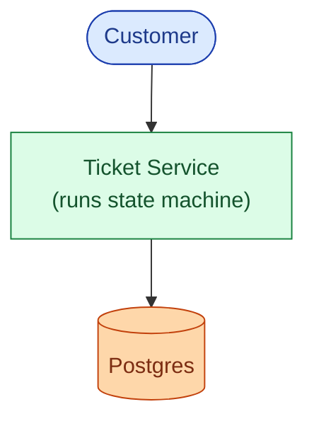

Fine for ten users.

### v2: add the intake adapters and assignment

Different channels need different parsing logic. Pull that out into a thin **Intake Adapter** per channel. Each adapter normalizes to a common event. Add an **Assignment Service** that picks the right team and agent.

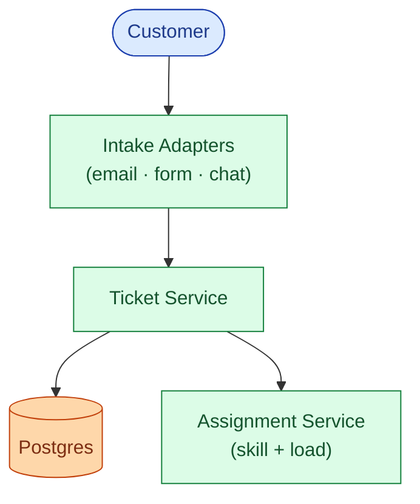

### v3: add the SLA worker and agent dashboards

Two things break as the team grows. Agents ask how many tickets are close to breaching SLA. The tickets table is now too big to scan on every dashboard load. Add a dedicated **SLA Worker** that sweeps every 30 seconds. Add a **Read Service** backed by Redis for agent dashboards.

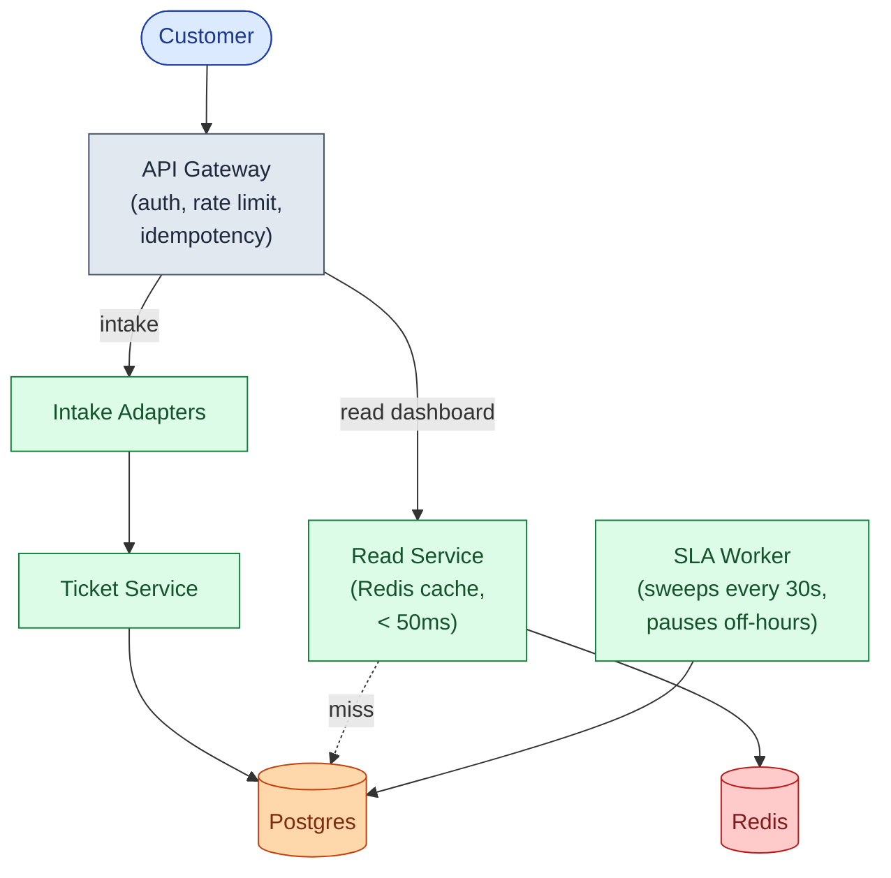

### v4: notifications, search, and audit archival

These should not slow down the write path. If Slack is down, tickets must still flow. Add **Kafka**. Notifications, Elasticsearch indexing, cache invalidation, and audit archival all become consumers.

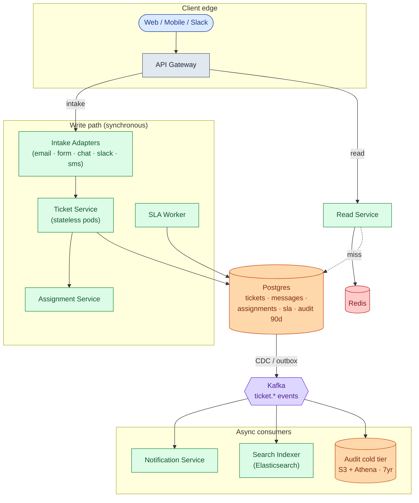

Each box, in one line:

| Box | What it does |
|-----|--------------|
| **API Gateway** | Authenticates callers, rate-limits bots, dedupes mobile retries. |
| **Intake Adapters** | Parse channel-native format, thread replies into existing tickets, emit a common event. |
| **Ticket Service** | The brain. Enforces valid state transitions. Writes to Postgres transactionally. Stateless. |
| **Assignment Service** | "Which team? Which agent? Who is on shift right now?" |
| **SLA Worker** | Scans the SLA table every 30 seconds. Fires warnings and breach events. Pauses outside business hours. |
| **Postgres** | Source of truth. Live state + 90 days of audit. |
| **Read Service + Redis** | Optimized for agent dashboards. Keeps the primary DB from being read to death. |
| **Kafka** | Carries events to the async world. |
| **Notification, Search Indexer, Audit cold tier** | Consumers. Not on the write path. If the notifier dies, tickets still flow. |

> **Take this with you.** If Slack is down at 3 a.m., new tickets still get created and assigned. Agents just do not get Slack DMs. Anything reactive lives **after** Kafka, not before.

---

## Step 7: One ticket, all the way through

Alice sends an email. Watch what happens.

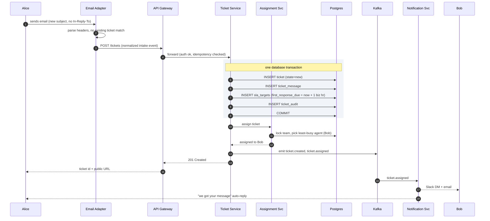

Three things worth pointing at:

1. The ticket, the first message, the SLA row, and the audit entry are written in **one transaction**. A crash mid-write rolls back cleanly. Either all four exist, or none.
2. Kafka is written **after** the commit. Notifications fan out from there. The write path does not wait for Slack or email.
3. The Ticket Service is stateless. Restart any pod at any time. State lives in Postgres.

---

## Step 8: SLA timers and business hours

A common SLA: respond to high-priority tickets within 1 hour, resolve within 24. On breach, escalate.

Two things make this much harder than they look.

**Problem 1: business hours.** A ticket arrives Friday at 5 PM. Does the 1-hour clock run through the weekend? No. It must pause at 5 PM Friday and resume 9 AM Monday. That means deadlines are not `created_at + 1 hour`. They are `created_at + 1 business hour`, which requires walking forward through the team's schedule.

**Problem 2: clock pauses.** When an agent moves a ticket to `waiting_on_customer`, the clock pauses. The agent asked for information. The customer has not replied yet. Blaming the agent for that wait makes the SLA metric meaningless.

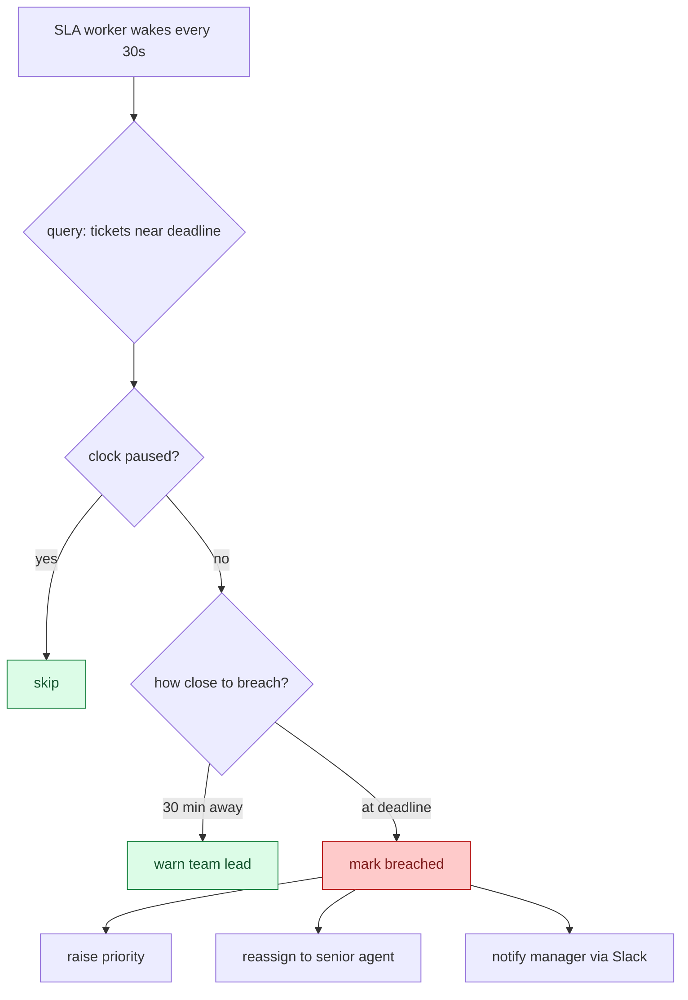

<details markdown="1">
<summary><b>Show: SLA table, business-hour math, and the sweep worker</b></summary>

```sql
CREATE TABLE sla_targets (
    ticket_id           UUID PRIMARY KEY,
    priority            TEXT NOT NULL,
    first_response_due  TIMESTAMPTZ,
    resolution_due      TIMESTAMPTZ,
    paused_at           TIMESTAMPTZ,
    pause_reason        TEXT,          -- 'waiting_on_customer' | 'out_of_hours'
    business_hours_id   TEXT NOT NULL,
    first_response_at   TIMESTAMPTZ,
    resolved_at         TIMESTAMPTZ,
    breach_state        TEXT NOT NULL DEFAULT 'on_track'
);

CREATE INDEX idx_sla_first ON sla_targets (first_response_due)
    WHERE first_response_at IS NULL AND paused_at IS NULL;
```

The deadline is not `created_at + 1 hour`. It is `created_at + 1 hour of business time`. You compute it by walking forward through the schedule:

```python
def add_business_time(start, duration, schedule):
    cursor = start
    remaining = duration
    while remaining > 0:
        if not schedule.is_business_time(cursor):
            cursor = schedule.next_window_start(cursor)
            continue
        window_end = schedule.current_window_end(cursor)
        chunk = min(remaining, window_end - cursor)
        cursor += chunk
        remaining -= chunk
    return cursor
```

The sweep worker runs every 30 seconds:

```python
def sla_sweep():
    rows = db.query("""
        SELECT ticket_id, first_response_due
        FROM sla_targets
        WHERE first_response_at IS NULL
          AND paused_at IS NULL
          AND first_response_due < NOW() + interval '30 minutes'
          AND breach_state != 'breached'
    """)
    for row in rows:
        if row.first_response_due < now():
            emit("sla.breached", row.ticket_id)
        else:
            emit("sla.warning", row.ticket_id)
```

When the clock pauses (agent sends to `waiting_on_customer`):

```python
def pause_sla(ticket_id, reason):
    db.update("sla_targets", ticket_id, paused_at=now(), pause_reason=reason)

def resume_sla(ticket_id):
    target = db.get("sla_targets", ticket_id)
    if target.paused_at is None:
        return
    paused_for = now() - target.paused_at
    db.update("sla_targets", ticket_id,
              paused_at=None,
              first_response_due=target.first_response_due + paused_for,
              resolution_due=target.resolution_due + paused_for)
```

Escalation rules live in config, not in code:

```yaml
escalation_policy: high_priority_default
rules:
  - on: sla.warning
    action: notify
    recipient: team_lead

  - on: sla.breached
    action: reassign
    target: senior_agent_pool

  - on: sla.breached + 30min
    action: notify
    recipient: support_manager
    via: [email, slack, pagerduty]
```

</details>

> **Take this with you.** SLA timers are not `created_at + N hours`. They require business-hour-aware math, a pause/resume mechanism, and a separate worker that sweeps regularly. Get any one wrong and the whole metric becomes untrustworthy.

---

## Step 9: How to pick an agent

A ticket arrives. 2,000 agents are logged in. Who gets it?

Four strategies. Each has a sweet spot and a failure mode.

| Strategy | How it works | When it breaks |
|----------|-------------|----------------|
| **Round robin** | Walk a pointer through the agent list. | Ignores who is busy. Ignores skill. |
| **Skill-based** | Tag tickets at intake. Match to agents with the right skill. | Misroutes silently when skill tags are stale. |
| **Pull queue** | Tickets sit in a queue. Agents click "give me the next one." | Agents cherry-pick easy tickets. Hard ones sit. |
| **Load-balanced push** | Assign to the agent with the fewest open tickets. | Ignores ticket complexity. One hard ticket counts the same as one easy one. |

In practice, most systems combine these: skill-based to narrow the candidate pool, load-balanced to pick within that pool, pull queue as fallback when push fails.

The race to handle: two agents click "Next Ticket" at the same instant. Both queries return TKT-100. Both think it is theirs.

Fix: use `SELECT ... FOR UPDATE SKIP LOCKED` in Postgres. Agent A locks TKT-100. Agent B's query sees the lock, skips TKT-100, and gets TKT-101. Both succeed.

<details markdown="1">
<summary><b>Show: pull-queue assignment with SKIP LOCKED</b></summary>

```python
def claim_next_ticket(agent):
    with db.transaction():
        ticket = db.query("""
            SELECT ticket_id FROM tickets
            WHERE team_id = ? AND assignee_id IS NULL
              AND status IN ('new', 'assigned')
            ORDER BY priority DESC, created_at ASC
            FOR UPDATE SKIP LOCKED
            LIMIT 1
        """, agent.team_id)
        if not ticket:
            return None
        db.update("tickets", ticket.id,
                  assignee_id=agent.id, status='assigned')
        db.insert("assignments",
                  ticket_id=ticket.id, agent_id=agent.id, reason='pulled')
        return ticket
```

`FOR UPDATE SKIP LOCKED` is the key. Two agents run the query at the same instant. Each gets a different ticket, because a locked row is invisible to the second query.

</details>

> **Take this with you.** `FOR UPDATE SKIP LOCKED` is the standard Postgres pattern for work queues. One query, no application-level coordination, no duplicate claims.

---

## Follow-up questions

Try answering each in 2-3 sentences before opening the solution.

1. **Email threading when the subject is stripped.** A customer replies from their phone, which removes the `[TKT-4521]` subject prefix. The email also has no `In-Reply-To` header. How do you still thread it into the right ticket?

2. **Intake adapter crashes mid-batch.** The email adapter pulled 50 messages from IMAP. It crashed after processing 30. On restart, how do you avoid reprocessing the first 30 and avoid losing the last 20?

3. **Two agents claim the same queued ticket.** Both click "Next Ticket" within the same second. The query returns the same ticket to both. How do you make sure only one gets it?

4. **SLA business hours across timezones.** Customer in Tokyo. Team in San Francisco. Whose hours apply? What if the contract says "follow the sun"?

5. **Reopen after long silence.** A customer replies to a ticket closed 6 months ago. What does the system do?

6. **New issue from an existing customer.** A customer with an open billing ticket emails again about a completely different problem (login broken). Do you append to the old ticket or open a new one?

7. **Agent vacation handover.** Bob has 47 open tickets and starts a 2-week vacation. How do you hand them off?

8. **Spam at the front door.** Your support email gets 10,000 spam messages a day. How do you stop them from becoming tickets?

9. **Knowledge base suggestions at intake.** When a customer fills out the web form, you want to show 3 relevant KB articles before they hit submit. How do you do this without slowing the form?

10. **"Average time to resolve" is wrong.** Management says the dashboard shows 2 hours, but tickets actually take days. What is wrong, and how do you fix it?

---

## Related problems

- **[Approval Management (011)](../011-approval-management/question.md).** Same state-machine + role-routing + SLA-timer patterns. A ticket's lifecycle is structurally identical to an approval's lifecycle.
- **[Notification System (010)](../010-notification-system/question.md).** Every ticket state change (assigned, replied, breached, resolved) fans out to email, Slack, and push. The retry and quiet-hours machinery there is what consumes ticket events.
- **[Comment System (015)](../015-comment-system/question.md).** Ticket messages are shaped like comments: threaded, paginated, with attachments. The same storage and indexing patterns apply.
- **[Read-Heavy System Patterns (017)](../017-read-heavy-patterns/question.md).** Agent dashboards and customer portals load tickets thousands of times per day. Cache tiering and read replicas from that problem apply directly here.


<div class="pr-solution-divider"></div>


## Solution: Help Desk Ticketing System

### The short version

A help desk is a small state machine with a messy front door.

The front door is the hard part. Emails arrive over IMAP with broken subject lines. Chats arrive over WebSockets and end when the tab closes. Web forms post JSON. Slack messages come through a bot. Each channel needs an adapter that parses the raw input, threads replies into existing tickets, and emits a common intake event.

Once a ticket exists, it follows a small state machine: `new -> assigned -> in_progress -> (waiting_on_customer loops) -> resolved -> closed`. The Ticket Service enforces valid transitions and writes to Postgres. An Assignment Service picks the team and agent. An SLA Worker sweeps every 30 seconds, pauses outside business hours, and fires escalation events on breach.

Scale is not the hard part. Even at 50,000 tickets per day with 2,000 agents, you only write about 15 things per second. The interesting work is correctness: email threading, SLA pause and resume across business hours and timezones, assignment races, and reopen logic after customer silence.

---

### 1. The two questions that matter most

**Which channels?** Email is the messiest because reply threading requires parsing RFC 5322 headers and falling back to subject tags. Every channel after email is just a new adapter. Adding Slack later means writing a Slack adapter, not changing the core system.

**What does the SLA look like?** Wall-clock SLA ("respond in 1 hour") is three lines of code. Business-hour SLA across timezones is a real engineering project and the source of most reporting bugs in production.

Everything else (assignment strategy, escalation rules, knowledge base, audit retention) follows from those two answers.

---

### 2. The math, in plain numbers

| Scale | Tickets/day | Writes/sec | Open at once | Agent reads/sec |
|-------|-------------|------------|--------------|-----------------|
| Startup (3 agents) | 50 | ~0.003 | ~100 | ~3 |
| Enterprise (2,000 agents) | 50,000 | ~5 avg, ~15 peak | ~150,000 | ~65 |

The numbers that matter:

- **150,000 open tickets at any moment** at enterprise scale. "Show me my pending tickets" must return in under 50ms.
- **Reads beat writes 10 to 1.** Every agent refreshes their dashboard 2-3 times per minute. Caching the read path matters more than write throughput ever will.
- **15 writes per second at peak.** A single Postgres handles this easily. The architecture exists for correctness and read latency, not for QPS.

---

### 3. The API

Three endpoints carry the whole product. Create a ticket. Add a message. Change status. Everything else is reading data back.

```
POST /api/v1/tickets
Idempotency-Key: <uuid>

{
  "subject": "Cannot log in to mobile app",
  "body": "I have been trying since this morning...",
  "channel": "web_form",
  "customer_email": "alice@example.com",
  "metadata": { "browser": "Safari 17", "app_version": "4.2.1" }
}
```

```
POST /api/v1/tickets/{ticket_id}/messages

{
  "body": "Can you share the error message you see?",
  "visibility": "public" | "internal"
}
```

A `public` message also pushes out via the outbound adapter (email reply, Slack DM). An `internal` message is an agent-only note. The customer never sees it.

```
POST /api/v1/tickets/{ticket_id}/status

{
  "status": "waiting_on_customer" | "resolved" | "closed" | "spam",
  "reason": "Asked for more info"
}
```

An invalid transition (like `closed -> in_progress` without going through `reopened`) returns `422 Unprocessable Entity`.

Small but load-bearing choices:

- **`Idempotency-Key` is required on create.** SES retries on timeout. Mobile clients retry. Web forms get double-clicked. Without the key, you create duplicate tickets.
- **`visibility: internal` is critical.** The outbound adapter checks this flag before sending. This is what keeps agent war-room notes from reaching the customer.
- **Messages are the unit of conversation.** Tickets group messages. Messages carry content. This separation is what lets you page through a long conversation without touching the ticket row.

Status codes: **409** means idempotency key collision, return the existing ticket. **410** means the ticket was merged into another and this one no longer exists.

---

### 4. The data model

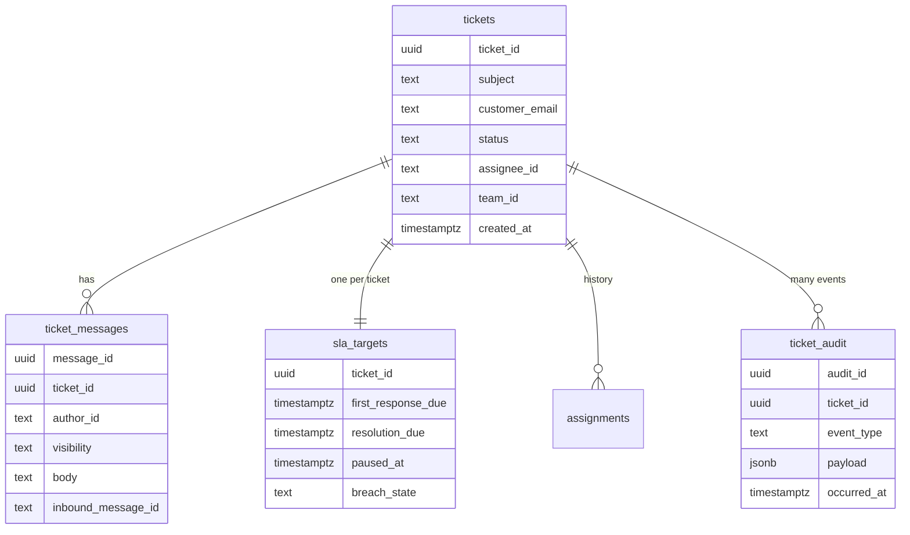

<details markdown="1">
<summary><b>Show: the full SQL</b></summary>

```sql
CREATE TABLE tickets (
    ticket_id           UUID PRIMARY KEY,
    public_ref          TEXT NOT NULL UNIQUE,        -- "TKT-1234" shown to customer
    subject             TEXT NOT NULL,
    customer_id         TEXT,
    customer_email      TEXT,
    channel             TEXT NOT NULL,               -- 'email'|'web_form'|'chat'|'slack'|'sms'
    channel_thread_id   TEXT,                        -- channel-native ID for threading
    status              TEXT NOT NULL DEFAULT 'new',
    priority            TEXT NOT NULL DEFAULT 'medium',
    team_id             TEXT,
    assignee_id         TEXT,
    tags                TEXT[] DEFAULT '{}',
    created_at          TIMESTAMPTZ NOT NULL DEFAULT NOW(),
    updated_at          TIMESTAMPTZ NOT NULL DEFAULT NOW(),
    first_response_at   TIMESTAMPTZ,
    resolved_at         TIMESTAMPTZ,
    closed_at           TIMESTAMPTZ,
    reopen_count        INT NOT NULL DEFAULT 0,
    parent_ticket_id    UUID,                        -- follow-up to a closed ticket
    metadata            JSONB
);
CREATE INDEX idx_tk_assignee_status ON tickets (assignee_id, status)
    WHERE status NOT IN ('closed','spam','duplicate');
CREATE INDEX idx_tk_team_status ON tickets (team_id, status, priority);
CREATE INDEX idx_tk_customer ON tickets (customer_id, created_at DESC);
CREATE INDEX idx_tk_channel_thread ON tickets (channel, channel_thread_id);

CREATE TABLE ticket_messages (
    message_id          UUID PRIMARY KEY,
    ticket_id           UUID NOT NULL REFERENCES tickets(ticket_id),
    author_type         TEXT NOT NULL,               -- 'customer'|'agent'|'system'
    author_id           TEXT,
    visibility          TEXT NOT NULL DEFAULT 'public',
    body                TEXT NOT NULL,
    body_format         TEXT NOT NULL DEFAULT 'plain',
    inbound_channel     TEXT,
    inbound_message_id  TEXT,                        -- email Message-ID header
    in_reply_to         TEXT,                        -- email In-Reply-To header
    attachments         JSONB DEFAULT '[]',
    created_at          TIMESTAMPTZ NOT NULL DEFAULT NOW()
);
CREATE INDEX idx_msg_ticket ON ticket_messages (ticket_id, created_at);
CREATE UNIQUE INDEX idx_msg_inbound ON ticket_messages (inbound_message_id)
    WHERE inbound_message_id IS NOT NULL;

CREATE TABLE assignments (
    assignment_id   UUID PRIMARY KEY,
    ticket_id       UUID NOT NULL REFERENCES tickets(ticket_id),
    team_id         TEXT NOT NULL,
    agent_id        TEXT,                            -- null = sitting in team queue
    assigned_at     TIMESTAMPTZ NOT NULL DEFAULT NOW(),
    unassigned_at   TIMESTAMPTZ,
    assigned_by     TEXT,
    reason          TEXT                             -- 'initial'|'reassigned'|'escalation'|'vacation_handover'
);
CREATE INDEX idx_assignments_agent ON assignments (agent_id) WHERE unassigned_at IS NULL;

CREATE TABLE sla_targets (
    ticket_id           UUID PRIMARY KEY REFERENCES tickets(ticket_id),
    priority            TEXT NOT NULL,
    first_response_due  TIMESTAMPTZ,
    resolution_due      TIMESTAMPTZ,
    paused_at           TIMESTAMPTZ,
    pause_reason        TEXT,
    business_hours_id   TEXT NOT NULL,
    first_response_at   TIMESTAMPTZ,
    resolved_at         TIMESTAMPTZ,
    breach_state        TEXT NOT NULL DEFAULT 'on_track'
);
CREATE INDEX idx_sla_first ON sla_targets (first_response_due)
    WHERE first_response_at IS NULL AND paused_at IS NULL;
CREATE INDEX idx_sla_res ON sla_targets (resolution_due)
    WHERE resolved_at IS NULL AND paused_at IS NULL;

CREATE TABLE ticket_audit (
    audit_id        UUID PRIMARY KEY,
    ticket_id       UUID NOT NULL,
    occurred_at     TIMESTAMPTZ NOT NULL DEFAULT NOW(),
    event_type      TEXT NOT NULL,
    actor_type      TEXT NOT NULL,
    actor_id        TEXT,
    payload         JSONB NOT NULL
);
CREATE INDEX idx_audit_ticket ON ticket_audit (ticket_id, occurred_at);
```

</details>

Four small things doing real work:

**The composite index `(assignee_id, status)`.** This serves the single most common query: "show me my open tickets." Without it, every agent dashboard scans the full tickets table.

**`UNIQUE` on `ticket_messages.inbound_message_id`.** When the email adapter crashes and reprocesses the same message, the duplicate insert fails on the unique constraint. The second copy is silently dropped. No duplicate messages on the ticket.

**`assignments` is history, not current state.** The current assignee lives on the ticket row for fast reads. The full reassignment history lives here for audit and analytics.

**`sla_targets` is a separate narrow table.** The SLA worker scans it every 30 seconds. Keeping SLA columns out of the wide `tickets` row makes the index small and the sweep fast.

Why Postgres and not Cassandra? State-machine transitions need ACID. When an agent replies, three things must happen together: insert the message, set `first_response_at`, and update `sla_targets`. Postgres gives you that in one transaction.

---

### 5. The intake engine

Email is the hardest channel. Here is what the adapter does for each inbound message.

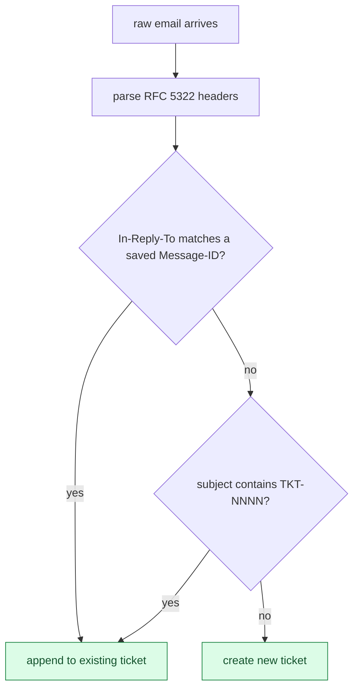

<details markdown="1">
<summary><b>Show: the threading algorithm in code</b></summary>

```python
def handle_inbound_email(raw_email):
    msg = parse_email(raw_email)

    if is_spam(msg):
        record_dropped(msg, reason='spam')
        return

    # Layer 1: RFC 5322 headers
    parent_id = msg.headers.get('In-Reply-To')
    refs = msg.headers.get('References', '').split()
    candidates = [parent_id] + refs if parent_id else refs

    existing_ticket = None
    for mid in candidates:
        row = db.query(
            "SELECT ticket_id FROM ticket_messages WHERE inbound_message_id = ?", mid)
        if row:
            existing_ticket = row.ticket_id
            break

    # Layer 2: subject tag
    if not existing_ticket:
        ref = extract_ticket_ref(msg.subject)   # looks for [TKT-NNNN]
        if ref:
            existing_ticket = db.query(
                "SELECT ticket_id FROM tickets WHERE public_ref = ?", ref)

    # Layer 3: heuristic match (off by default)

    if existing_ticket:
        emit("ticket.reply_received", existing_ticket, msg)
    else:
        emit("ticket.intake", channel='email', payload=normalize(msg))
```

</details>

The three layers in order of trust: header match (~85%), subject tag (~10%), heuristic (~off by default). The remaining ~5% open new tickets. Agents merge duplicates via a "merge into" button.

> **Take this with you.** Threading at the front door is worth the complexity. If 5% of all replies open new tickets instead, agents spend their day merging instead of answering.

---

### 6. The state machine

The Ticket Service enforces valid transitions. Any attempt to make an invalid jump returns `422`. The machine itself:

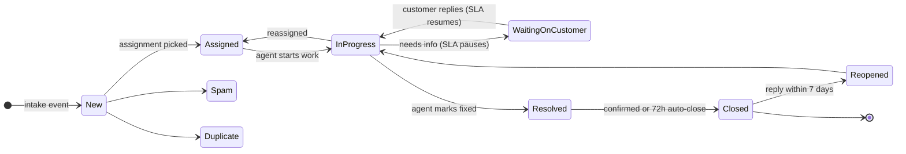

<details markdown="1">
<summary><b>Show: the transition table enforced in code</b></summary>

```python
VALID_TRANSITIONS = {
    'new':                  {'assigned', 'spam', 'duplicate'},
    'assigned':             {'in_progress', 'new'},
    'in_progress':          {'waiting_on_customer', 'resolved', 'assigned'},
    'waiting_on_customer':  {'in_progress', 'resolved'},
    'resolved':             {'closed', 'in_progress'},
    'closed':               {'reopened'},
    'reopened':             {'in_progress'},
}

def transition(ticket, new_status):
    if new_status not in VALID_TRANSITIONS.get(ticket.status, set()):
        raise InvalidTransition(ticket.status, new_status)
    with db.transaction():
        db.update("tickets", ticket.id, status=new_status)
        db.insert("ticket_audit", event_type="status_changed",
                  payload={"from": ticket.status, "to": new_status})
        if new_status == 'waiting_on_customer':
            pause_sla(ticket.id, reason='waiting_on_customer')
        elif ticket.status == 'waiting_on_customer' and new_status == 'in_progress':
            resume_sla(ticket.id)
```

</details>

---

### 7. The architecture


Five things to notice:

- The Ticket Service is the only writer to Postgres. Everything else is downstream of Kafka. If the notifier is down, tickets still get created and assigned. Emails just queue up.
- Intake adapters track their own progress (`last_processed_uid` per IMAP mailbox). Crash and resume without losing or duplicating messages.
- The Ticket Service is stateless. State lives in Postgres. Roll pods during the day with zero impact.
- The SLA Worker is a separate process. A slow sweep cannot stall the API. At large scale, shard by `ticket_id` hash across N pods.
- Audit lives in two tiers. Last 90 days in Postgres for fast queries. Older rows in S3 Parquet for compliance queries via Athena.

---

### 8. A ticket, end to end


Recording an agent reply follows the same shape. The Ticket Service validates the transition, opens a transaction, inserts the message, updates `first_response_at`, updates `sla_targets`, writes an audit event, and commits. The Kafka event triggers the outbound adapter to send the reply email.

Reads: agent UI hits Read Service, checks Redis `agent:{id}:open_tickets`, returns in ~5ms on cache hit, falls through to Postgres read replica on miss.

Target latencies:

| Operation | P99 |
|-----------|-----|
| Web form intake | ~300ms |
| Agent reply | ~200ms |
| Dashboard read | ~50ms |
| Full-text search | ~150ms |

---

### 9. The scaling journey: 10 users to 1 million

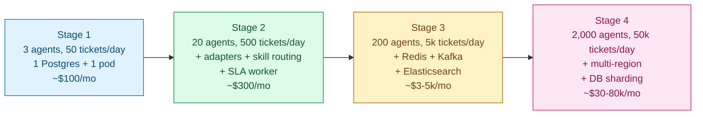

#### Stage 1: 3 agents, 50 tickets per day

One Postgres on a t3.medium. One Ticket Service process. One IMAP poller. Assignment is round-robin: one integer in Postgres. No cache, no queue, no replicas. SLA is a cron job that runs every minute. Notifications are inline HTTP calls to SendGrid. About $100/month.

Postgres is bored at 50 writes per day. Build nothing before it hurts.

#### Stage 2: 20 agents, 500 tickets per day

Something breaks: marketing adds a web form (need a second adapter). Billing and technical agents diverge (need skill-based routing). A customer on a $50k contract asked why their SLA was breached on a Sunday.

Fixes: add web form and chat adapters, each normalizing to a common intake event. Add skill-based routing (ticket tags matched to agent skill arrays). Add a dedicated SLA worker that sweeps every 30 seconds and understands business hours. Add the `ticket_audit` table. Still no Kafka, no Redis, no Elasticsearch. About $300/month.

#### Stage 3: 200 agents, 5,000 tickets per day

Several things break at once. Agent dashboards take 3 seconds (the combined query for open + queued + urgent is slow). Full-text search returns in 4 seconds. The SLA worker takes 45 seconds per sweep over 30k open tickets.

Fixes: add two Postgres read replicas (dashboards read from replicas, writes go to primary). Add Redis for agent dashboard cache, invalidated by Kafka events. Bring in Kafka properly (topics: `ticket.created`, `ticket.replied`, `ticket.assigned`, `ticket.status_changed`, `sla.breached`). Pipe Postgres changes to Elasticsearch via Debezium. Shard the SLA worker by ticket\_id hash. Add WebSockets so dashboards get live updates instead of polling. Cost: $3-5k/month.

#### Stage 4: 2,000 agents, 50,000 tickets per day, 4 regions

New problems: one Postgres holds all teams, and a long analytics query stalls the Ticket Service. EU mailbox intake from US-East adds 150ms latency. Enterprise customers require data residency.

Fixes: shard the tickets DB by team\_id. Deploy per-region stacks (US, EU, APAC, AU). Each region has its own intake adapters, Ticket Service, DB shards, Redis, and Kafka. Enterprise customers with residency requirements pin to a specific region. Add a cross-region read-only API with explicit residency checks. The core architecture has not changed since Stage 3. You added regions and sharding. The data model is identical to Stage 1. Cost: $30-80k/month depending on region count and attachment storage.

---

### 10. Reliability

**Intake adapters use at-least-once delivery.** Track `last_processed_uid` per IMAP mailbox. Commit only after the message is safely staged in Postgres. On crash and restart, resume from the last UID. Reprocessed messages are deduped by the unique index on `ticket_messages.inbound_message_id`.

**The SLA Worker is stateless and idempotent.** State lives in `sla_targets`. On restart, the next sweep picks up where the last left off. Worst case: 30 seconds of breach-detection lag. Run two workers active-active behind per-shard advisory locks.

**Assignment races.** Two `assign_ticket` calls for the same team: serialized by a team-level `SELECT FOR UPDATE`. Two pull-queue calls for the same ticket: serialized by `SKIP LOCKED`. No application-level coordination needed.

**Notification failures.** Kafka consumers run at-least-once with exponential backoff. Dead-letter topic after max retries, watched by an on-call dashboard.

**Postgres failover.** Primary dies, replica promotes. In-flight transactions roll back. Clients retry with idempotency keys. Workers reconnect within seconds.

---

### 11. Observability

| Metric | Why it matters |
|--------|----------------|
| `tickets.created.rate` by channel | Sudden drop means an adapter is broken. Spike means an outage or marketing blast. |
| `tickets.in_flight.count` by team | Slow rise means a team is drowning. |
| `time_to_first_response` p50/p95 | The headline customer-facing SLO. |
| `time_to_resolution` p50/p95 by priority | The other headline SLO. |
| `sla.breach.rate` by priority and team | Per-team operational health. |
| `agent.utilization` | Identifies overloaded agents and underused agents. |
| `assignment.latency` p99 | High means the Assignment Service is contended on team-level locks. |
| `intake.threading.success_rate` | Fraction of emails that thread into an existing ticket. Drop means headers are being stripped. |
| `kb.suggestion.deflection.rate` | Customers who saw KB suggestions and closed the form without submitting. The self-service ROI metric. |
| `audit.write.lag` | Audit must not lag. Alert at more than 5 seconds. |

Page on: any adapter offline for more than 2 minutes. SLA worker not running. Postgres primary unreachable.

Ticket on: `time_to_first_response` p95 regression more than 30%. `sla.breach.rate` doubles. Reopen rate above 10%.

---

### 12. Follow-up answers

**1. Email threading when subject is stripped.**

`In-Reply-To` and `References` headers are the primary signal. About 85% of replies hit this path. A single index lookup on `ticket_messages.inbound_message_id` finds the match. Subject tag `[TKT-1234]` is the fallback for corporate mail proxies that strip headers. As a last resort (off by default): same sender + similar subject + within N days. If all three fail, a new ticket opens and the agent merges via "merge into."

**2. Intake adapter crashes mid-batch.**

The adapter never advances `last_processed_uid` until the message is safely staged. On restart, it resumes from the last saved UID. Reprocessed messages fail silently on the unique constraint in `ticket_messages`. No message loss. No duplicate tickets. Worst case: a few seconds of duplicate parsing work.

**3. Two agents claim the same queued ticket.**

The pull query uses `SELECT ... FOR UPDATE SKIP LOCKED LIMIT 1` inside a transaction. Agent A's transaction locks TKT-100 and writes `assignee_id`. Agent B's identical query at the same instant skips TKT-100 (already locked) and gets TKT-101. Both commit. No conflict. This is the canonical Postgres use case for `SKIP LOCKED`.

**4. SLA business hours across timezones.**

Default: the team's business hours schedule (for example, "US-West 9-6 weekdays, US holidays excluded"). Enterprise contracts that specify 24/7 coverage get `business_hours_id = always`. The contract policy lives on the customer record and overrides the team default at ticket creation time. For "follow the sun," set the customer's policy to `always` and let the assignment service route to whichever region is on shift.

**5. Reopen after long silence.**

Within 7 days of `closed_at`, a customer reply reactivates the original ticket: status goes to `reopened`, immediately to `in_progress`, and `reopen_count` increments. The SLA clock resets, optionally to a tighter reopen SLA (4 hours instead of 24).

Outside the 7-day window, a new ticket opens with `parent_ticket_id` pointing to the closed one. The agent UI surfaces the parent: "This customer had a related issue previously; view prior ticket."

**6. New issue from a customer with an open ticket.**

Default is open a new ticket. The unrelated-issue case is more common than the follow-up case. Threading logic decides: `In-Reply-To` pointing to a message in the existing ticket means append. Subject tag match means append. Anything else means a new ticket. If the agent later realizes two tickets share context, they merge them.

**7. Agent vacation handover.**

The agent sets `out_of_office: {start, end, delegate_id}` in their profile. On the start date, a job reassigns all open tickets to the delegate (or to the team queue if no delegate), records `reason: vacation_handover` in `assignments`, and notifies the delegate. For new tickets where the OOO agent would have been the round-robin pick, skip them in the rotation until the end date.

**8. Spam at the front door.**

Layered defense: SPF/DKIM/DMARC at SMTP rejects spoofed mail. SpamAssassin or AWS SES spam scoring sends high-score mail to a quarantine mailbox, not the ticket database. Per-sender rate limits drop bulk senders to quarantine. A known-customer allowlist (paying customer domains) bypasses aggressive filtering. Periodic human review of quarantine catches false positives. The 1% that gets through is closed as `spam` with a single click.

**9. KB suggestions at intake.**

As the customer types, debounce 500ms then call `POST /api/v1/kb/suggest` with the current subject and body. The endpoint queries Elasticsearch (top 3 articles by relevance) and returns within 50ms. Display inline above the submit button. Track whether the customer clicks an article (`kb.suggestion.click`), abandons the form (`kb.suggestion.deflection`), or submits anyway. Deflection is the win metric. Mature systems deflect 20-40% of would-be tickets.

**10. "Average time to resolve" is wrong.**

Three common bugs. First: it includes `waiting_on_customer` time, but the agent was not working then. Subtract time spent in that state. Second: it uses wall-clock time and ignores business hours. A ticket created Friday 5 PM and resolved Monday 10 AM is not 65 hours; it is about 3 business hours. Third: it counts spam and duplicate tickets, which close instantly and drag the average down. Exclude them. The correct computation: sum of business-hours-active time per ticket, divided by count of resolved non-spam non-duplicate tickets. Show p50 and p95 alongside the average. The average alone hides long-tail outliers.

---

### 13. Trade-offs worth saying out loud

**Push vs pull assignment.** Push gives every ticket an owner instantly, which is better for SLA accountability and immediate notification. Pull avoids assigning to agents who just logged off and preserves agent autonomy. Most production setups push by default with pull as the fallback when the pushed agent is unavailable.

**Postgres full-text search vs Elasticsearch.** Postgres FTS with a `tsvector` GIN index handles up to about 1 million tickets cheaply. Elasticsearch is a separate cluster to operate but gives faceted search, fuzzy matching, and sub-100ms relevance ranking. Switch when FTS latency exceeds 500ms or when the product asks for facets.

**Per-ticket scheduled timers vs sweep worker.** Per-ticket timers sound clean ("real-time!") but cancellation on resolve or pause becomes brittle at 150k open tickets. Sweep is boring, reliable, and easy to debug. The cost is up to 30 seconds of breach-detection lag. Nobody notices.

**Custom build vs Zendesk.** If support volume is small, buy. Build when you have unusual integrations, a workflow that does not fit the SaaS model (regulated industries, embedded support, deep cross-system automation), or volume large enough that the SaaS per-agent bill exceeds the engineering cost.

---

### 14. Common mistakes

**Tickets as CRUD with a `status` column and hardcoded transitions.** If any agent can flip `status` to any value, you have a Trello clone. The state machine is the system.

**No intake adapter layer.** Jumping straight to "the API takes JSON" misses the entire email-parsing and threading problem. That is the single hardest part of the system and the one a senior interviewer listens for.

**Round-robin assignment at any scale.** Works for teams under 10 people. Breaks at 20+ when skill matters and at 100+ when load matters. Name the trade-off and offer skill-based as the next step.

**Wall-clock SLA with no business hours.** Most candidates skip this. Real enterprise customers will not tolerate a 24-hour SLA that expires Sunday at 3 AM.

**No SLA pause for `waiting_on_customer`.** Without pause, every ticket that needs customer input eventually breaches through no fault of the agent. Agents learn to game it ("close and reopen later"). The metric loses all meaning.

**No reopen handling.** Customer replies to a closed ticket, a new ticket opens, conversation history is lost. Build the 7-day reopen window from day one.

**Email threading by subject only.** Subjects get rewritten, prefixed with "FW:" or "RE:", and translated. Use `In-Reply-To` as the primary signal, subject as fallback.

**No assignment race control.** Two agents claim the same ticket without `SKIP LOCKED` and you get split-brain assignments. One agent works the ticket. The other also works it. The customer gets two conflicting replies.

**Notifications glued to the Ticket Service.** Tickets emit events. The notification service consumes them. Coupling them means you cannot swap Slack for Teams without touching the core service.

If you can name seven of these nine unprompted, you are interviewing at senior or staff level. The three that separate strong from average: state machine over CRUD, email threading by headers not subject, and business-hour SLA pausing. Those are the answers a senior architect listens for.

