
## What we are building

A file upload and share service lets users store large files in the cloud and hand out links to other people. Think of it as Dropbox or Google Drive in miniature.

Concrete example: Alice opens the web app and uploads a 4 GB video she shot on her phone. The connection drops twice over hotel WiFi, but the upload picks up from where it left off. When it finishes, the service runs a background virus scan and marks the file ready. Alice clicks Share and gets a link. She sends it to Bob. Bob opens the link in his browser and downloads the file. Meanwhile, a hundred other users have already uploaded the exact same video file (the same software installer, perhaps). The service stores only one copy of the bytes and lets all hundred users point at it.

The problems hiding in that story:

1. **Resumable upload.** A 4 GB upload over a flaky connection cannot be one big HTTP request. If it dies at 80%, the user cannot restart from scratch.
2. **Chunking and parallelism.** Large files need to split into chunks that upload independently and in parallel.
3. **Content deduplication.** Fifty users uploading the same installer should not store it fifty times. Hash the bytes. Share one copy.
4. **Share-link permissions.** Alice can revoke one link without breaking 999 others. Bob gets view access, not download access.
5. **Virus and abuse scanning.** An infected file uploaded to a public product is a security incident. The scan should not block the upload response.

---

## The lifecycle of one file

Before drawing boxes, picture the states a file moves through.

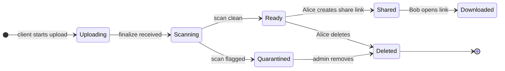

Everything we add later (chunked upload, dedup, cold tier, revocation) is a complication on top of this state machine.

> **Take this with you.** A file service is a state machine around bytes. The state lives in your database. The bytes live in object storage. They are two separate things.

---

## How big this gets

Two scales shape very different designs. Do the math before drawing anything.

| Input | 10k users | 100M users |
|-------|-----------|------------|
| Uploads per second (sustained) | ~0.08 | ~3,300 |
| Downloads per second (sustained) | ~0.8 | ~33,000 |
| Storage per year (raw) | ~13 TB | ~840 PB |
| Egress at peak | ~100 Mbps | ~6.4 Tbps |

<details markdown="1">
<summary><b>Show: how the numbers come out</b></summary>

**10k users:**
- 10,000 users, 5 uploads per week, 5 MB average.
- 50,000/week = ~7,000/day = **~0.08/sec sustained, ~0.25/sec peak.** Tiny.
- Downloads at 10x: ~0.8/sec.
- Storage: 7,000/day x 5 MB = ~13 TB/year.

One server. One Postgres. One S3 bucket. The throughput is not the challenge. The interesting part is the upload protocol for a 5 GB file and the share-link permission model.

**100M users:**
- 100M users, 20 uploads per week, 8 MB average.
- 2B/week = **~3,300/sec sustained, ~10,000/sec peak.**
- Downloads at 10x: ~33k/sec sustained, ~100k/sec peak.
- Storage: 286M/day x 8 MB = ~2.3 PB/day = ~840 PB/year raw. With ~30% dedup savings: ~**580 PB/year.**
- Egress at peak: 100k x 8 MB = 800 GB/s = **~6.4 Tbps.** CDN is not optional.

**The two numbers that dominate decisions:**

Storage cost is the headline expense. At 580 PB, $0.023/GB/month for S3 Standard is ~$160M/year. Lifecycle tiers and dedup are survival, not optimization.

Bandwidth through your servers is the scaling killer. One 10 Gbps NIC handles ~1.25 GB/s, which is only ~150 concurrent 8 MB uploads. At 10,000 concurrent uploads you need 70 servers just to forward bytes. Presigned upload URLs let the client go direct to S3. Your servers never touch the bytes.

</details>

> **Take this with you.** Reads beat writes by request count, but writes beat reads by bytes. CDN absorbs downloads. Presigned URLs remove your servers from the upload byte path. Storage lifecycle tiers are the cost model, not a nice-to-have.

---

## The smallest version that works

For 10 users, three boxes are enough.

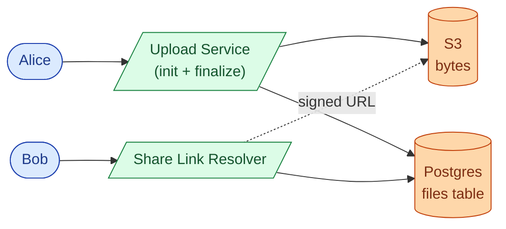

Two phases: upload, then share-link redeem.

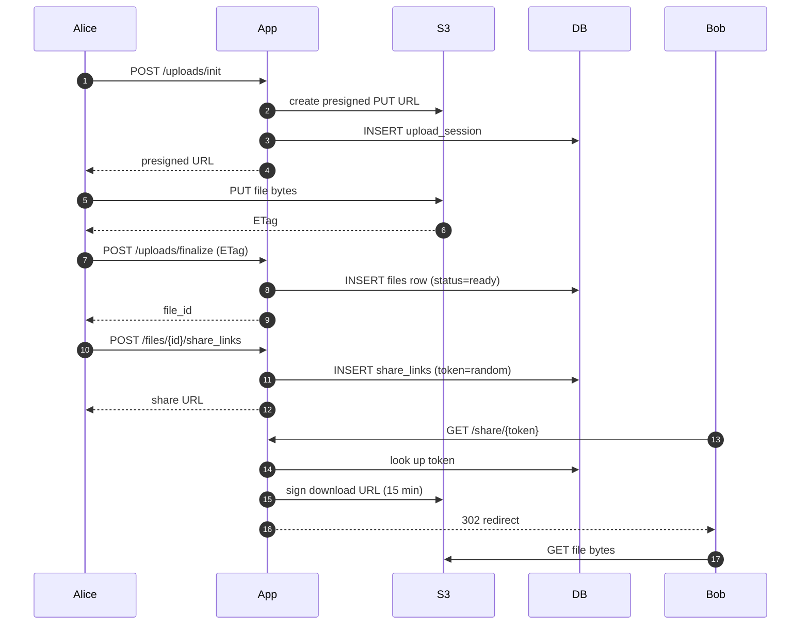

<details markdown="1">
<summary><b>Show: the two core tables</b></summary>

```sql
CREATE TABLE files (
    file_id      UUID PRIMARY KEY,
    owner_id     BIGINT NOT NULL,
    name         TEXT NOT NULL,
    size_bytes   BIGINT NOT NULL,
    content_hash BYTEA NOT NULL,
    status       SMALLINT NOT NULL DEFAULT 1,  -- 1=uploading, 2=ready, 3=quarantined, 4=deleted
    created_at   TIMESTAMPTZ NOT NULL DEFAULT NOW()
);

CREATE TABLE share_links (
    token           VARCHAR(32) PRIMARY KEY,  -- 192-bit random
    file_id         UUID NOT NULL,
    created_by      BIGINT NOT NULL,
    permission      SMALLINT NOT NULL,        -- 1=view, 2=download, 3=edit
    expires_at      TIMESTAMPTZ,
    revoked_at      TIMESTAMPTZ
);
```

</details>

---

## Decision 1: how do we make a large upload survive a bad connection?

A 4 GB upload over hotel WiFi is not a single HTTP request. Any dropped packet restarts the whole thing. The protocol has to be chunked.

Three options:

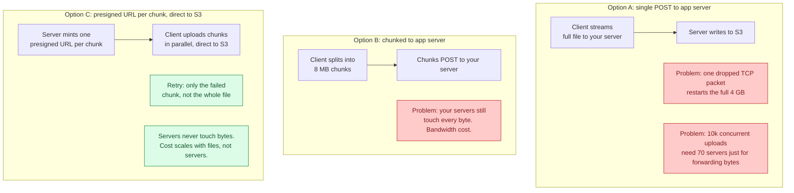

The answer is C, combined with S3 multipart upload. Each chunk gets its own presigned URL, uploading directly and in parallel. A failed chunk retries on its own. When all chunks land, the client sends a finalize call with the list of ETags and S3 stitches them together.

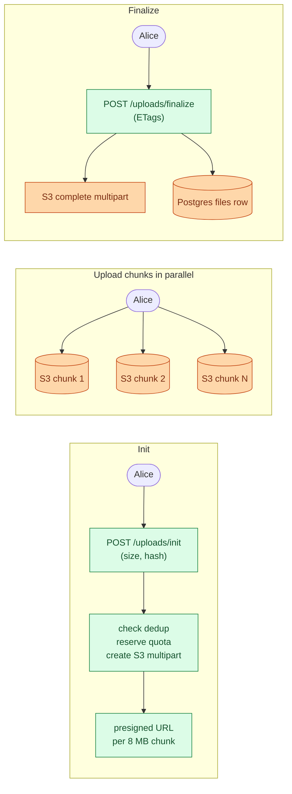

A 4 GB upload at 8 MB per chunk uses ~500 chunks. If chunk 312 fails, only chunk 312 retries.

<details markdown="1">
<summary><b>Show: the chunked upload sequence in full</b></summary>

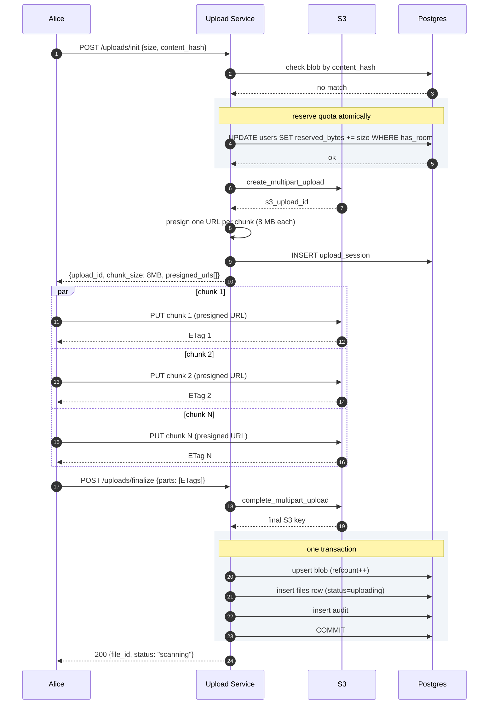

</details>

> **Take this with you.** Chunked upload with presigned URLs solves two problems at once: the client retries individual chunks (resilience), and the bytes never pass through your servers (cost).

---

## Decision 2: how do we avoid storing the same file 50 times?

Fifty users upload the same 200 MB software installer. Storing 10 GB for what is effectively one file wastes storage and money.

The fix: content-addressed dedup. Hash the bytes (SHA-256). Two files with the same bytes produce the same hash. Store the bytes once. Let many user-owned file records point at the same blob.

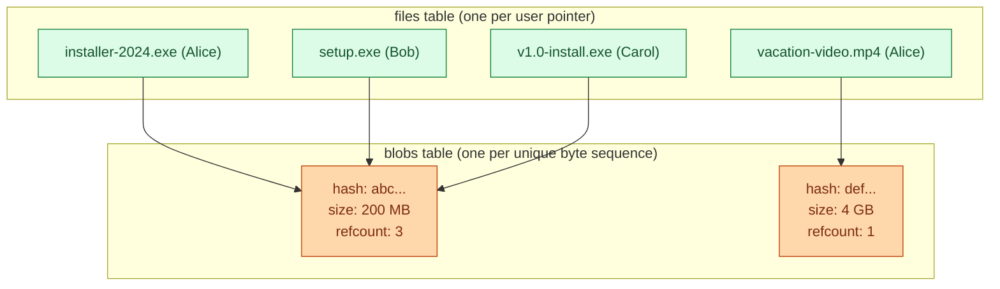

The dedup check happens at upload init. The client sends the SHA-256 hash before uploading. If a blob with that hash already exists, the server skips the upload entirely and returns the existing file ID. The client never sends a byte.

When Alice deletes her copy: decrement refcount from 3 to 2. Bob and Carol still point at the blob. Blob stays. When refcount hits zero, schedule the bytes for deletion after a 24-hour grace period.

Consumer file-sharing services see ~30% storage savings from dedup. On 580 PB that is 170 PB saved, which at $0.023/GB/month works out to roughly $50M/year.

| Operation | What happens |
|-----------|--------------|
| User uploads new file | Check hash at init. No match: proceed with S3 multipart. |
| User uploads duplicate | Match found at init: return existing file_id. No S3 call. Dedup hit rate ~30%. |
| User deletes their copy | Decrement refcount. If 0: schedule S3 delete after 24h grace. |
| Two users delete at once | `UPDATE blobs SET refcount = refcount - 1 ... RETURNING refcount`. Atomic. |

> **Take this with you.** Blob is the bytes. File is the user-named pointer. Keep them in separate tables. The rest follows from refcount.

---

## Decision 3: how do share-link permissions work?

Alice has 1,000 share links on the same file. She wants to revoke one of them. The other 999 should keep working. And she wants one link to be view-only while another is download-only.

The wrong design: make the file ID the share credential. If the URL is `/files/abc123`, every link gives the same access and you cannot revoke one without revoking all.

The right design: one row per share link, with an opaque high-entropy token.

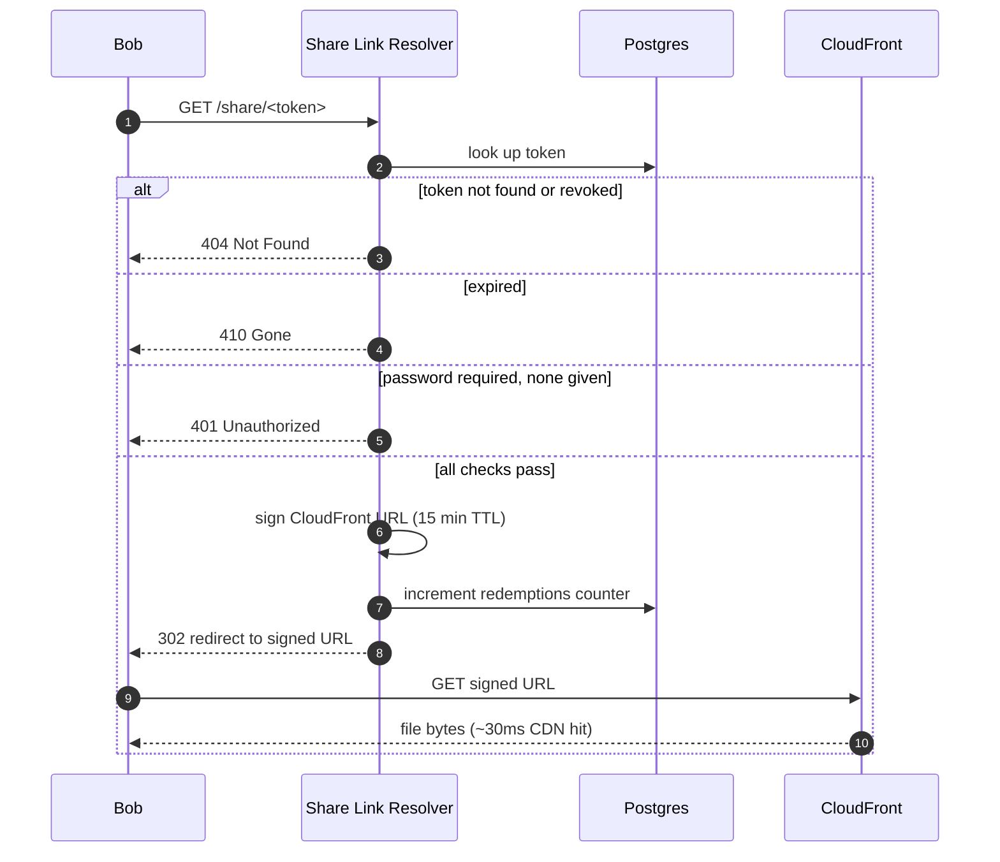

The signed CloudFront URL expires in 15 minutes. A view-only link gets a URL scoped to that permission. A download link gets a wider URL. The permission is enforced at link creation, not at download time.

Revoke one link: `UPDATE share_links SET revoked_at = NOW() WHERE token = ?`. One row update. The other 999 rows are untouched.

Token generation: 192 bits of randomness. No relationship to the file ID, owner, or creation time. Brute force is out.

> **Take this with you.** One row per share link. Revoke by setting `revoked_at` on that row. Never make the file ID the download credential.

---

## Decision 4: how does the virus scan work without blocking the upload?

Scanning a 4 GB file takes minutes. Blocking the upload response until the scan finishes is a bad user experience.

Two options:

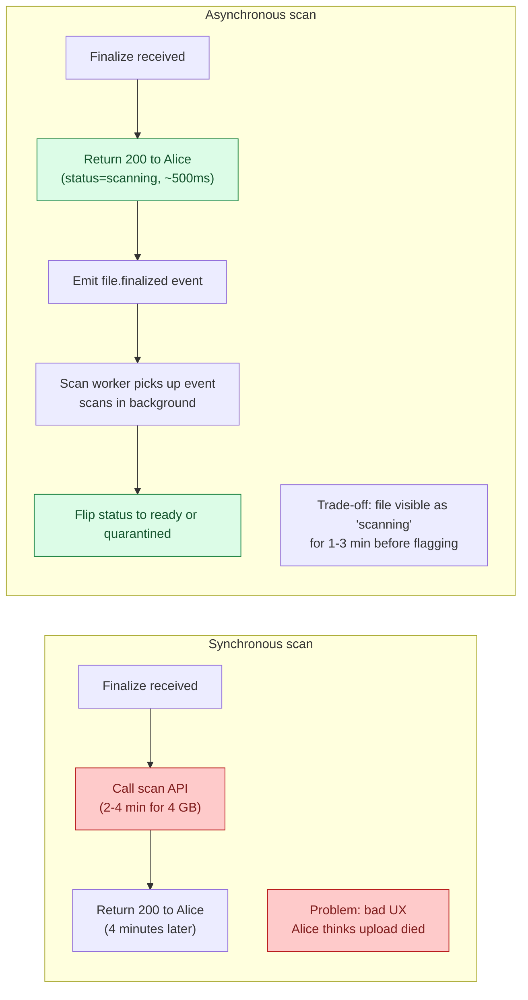

The async approach wins on UX. The trade-off: a malicious file is live for 1 to 3 minutes before the scan completes. Downloads of unscanned files return `425 Too Early` so Bob cannot download while scanning is in progress.

The scan pipeline:

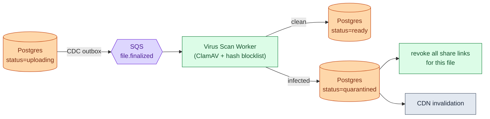

If the scan worker dies and the message goes back to the queue, another worker picks it up. The scan is idempotent. If the scan queue falls behind, uploads still succeed. Scans just lag.

> **Take this with you.** Anything reactive to an upload goes after the queue, not before the 200 response. If the worker dies at 3 a.m., uploads still work.

---

## Decision 5: how do we control storage cost as the system grows?

A file uploaded today might get downloaded 50 times this week. A file from two years ago is probably never touched again. Paying the same rate for both wastes money.

S3 has three tiers:

| Tier | Cost/GB/month | Retrieval time | Retrieval cost |
|------|---------------|----------------|----------------|
| S3 Standard (hot) | $0.023 | < 100 ms | free |
| S3 Infrequent Access (warm) | $0.0125 | < 100 ms | $0.01/GB |
| Glacier (cold) | $0.0036 | 1-5 min fast, 3-5 hr standard | $0.03/GB |


On 580 PB: Glacier is ~$25M/year. Standard is ~$160M/year. The lifecycle policy is the difference between a profitable product and a burning one.

Three gotchas to mention:

- **Glacier retrieval surprises users.** Show a "Restoring, we will email you when ready" state. Never silently make a user wait 5 hours.
- **Do not tier small files.** S3 IA charges a 128 KB minimum object size. Tiering a 10 KB file costs more than leaving it hot.
- **Cold-tier deletes carry penalties.** A file deleted from Glacier still incurs the 90-day minimum storage charge. Soft-delete first, hard-delete later.

> **Take this with you.** S3 lifecycle rules are three lines of config. At PB scale they save tens of millions of dollars per year.

---

## The full architecture

Putting all five decisions together:


Each component, in one sentence:

| Component | Purpose |
|-----------|---------|
| API Gateway | Auth, rate limiting, WAF. Entry point for all traffic. |
| Upload Service | Mints presigned URLs, checks dedup and quota. Never touches bytes. |
| File + Share API | Generates signed CloudFront URLs. Resolves share tokens. |
| Permission Resolver | "Can user X do Y on file Z?" Combines owner, invite, and folder checks. Cached 30s. |
| CloudFront | Edge cache. Makes the first 1% of downloads pay for the other 99%. |
| Postgres | Source of truth for metadata. Sharded by owner_id at scale. |
| S3 | Source of truth for bytes. Keyed by content hash. Lifecycle rules tier cold objects. |
| Redis | Permission cache. Most access checks never reach the DB. |
| SQS / Kafka | Decouples virus scan and GC from the write path. |
| Virus Scan Worker | Runs ClamAV async. Flips status on the file row. |
| Lifecycle Manager | Decrements refcounts on delete. Aborts abandoned uploads. |

Notice what is not on the synchronous path: virus scanning, analytics, and lifecycle GC. If any of those workers die at 3 a.m., uploads and downloads keep working.

---

## Walk: one upload, end to end

Alice uploads a 1.5 GB video (~190 chunks at 8 MB each).

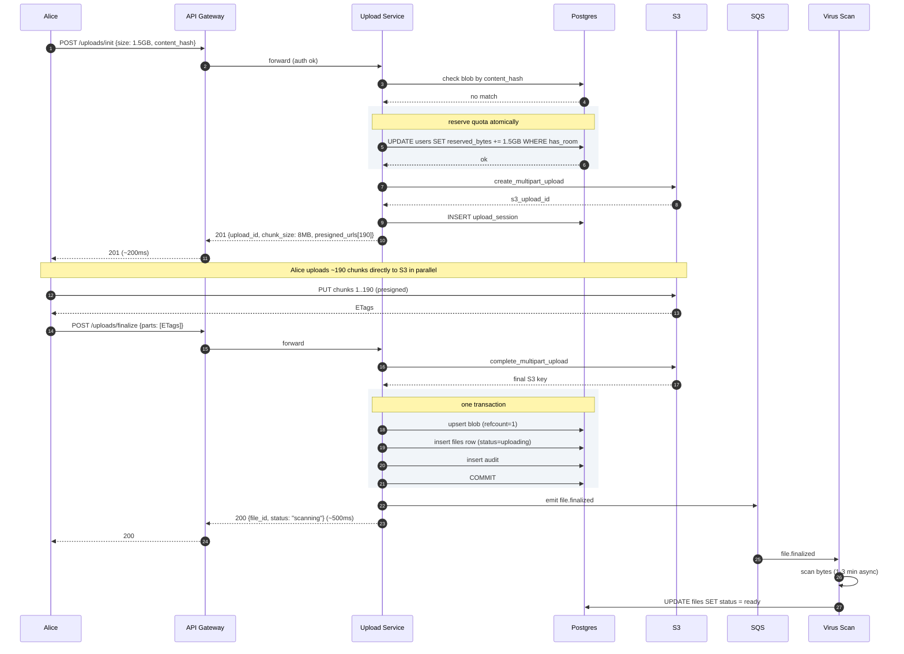

Three things to notice:

1. Quota is reserved at init, not finalize. If Alice's phone and laptop both start uploading an 80 MB file when she has only 100 MB left, the `UPDATE WHERE has_room` serializes them. Only one wins.
2. The blob upsert, file row, and audit write happen in one transaction. A crash mid-write rolls back cleanly. State is never partial.
3. Virus scan runs after Alice gets her 200. Scan results arrive asynchronously, 1-3 minutes later.

---

## The dedup race

Two users upload the same file within milliseconds. Who wins? Both should.

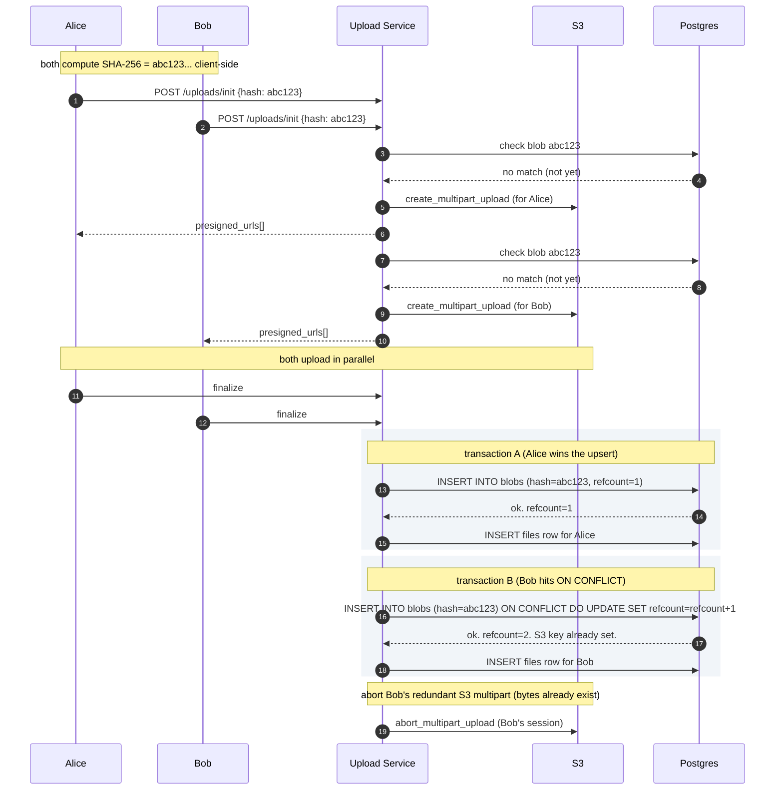

The `ON CONFLICT DO UPDATE` is the atomic guard. No matter how many concurrent finalizes race in, the blob is created once and the refcount increments correctly. The second uploader's S3 object gets aborted because the blob already has a valid storage key.

> **Take this with you.** The database unique constraint on the blob hash is what makes concurrent dedup correct. The application does not need a lock.

---

## Follow-up questions

Try answering each in 2-4 sentences before reading the solution.

1. **Resume the next day.** Alice uploads 3 GB of a 5 GB file, then closes her laptop. The next morning she reopens the app. What happens? How does the client know which chunks already landed? How long do you keep half-finished uploads around?

2. **Quota race.** Alice has 100 MB of quota left. Her phone and laptop both start uploading 80 MB files at the same instant. Both pass the quota check at init. Both upload. Now she is 60 MB over quota. How do you prevent this?

3. **Dedup details.** Three users upload the same 200 MB installer. How do you store it once? What does "delete" mean when one user deletes their copy? What about privacy across tenants?

4. **Token guessing.** Your tokens are 192 bits, so brute force is out. But a researcher finds your `created_at` timestamps in the response. Is this a real attack? What other side channels leak?

5. **Big delete.** A user with a 50 TB account deletes 10 TB in one click. Your metadata DB does 200,000 row updates and S3 issues 200,000 delete requests. What goes wrong? How do you smooth it out?

6. **Late-positive virus scan.** A scan flags a file as malware after 500 people have already downloaded it. What is your response? Can you tell who downloaded it? What about the share links?

7. **Edit conflict.** Two users with Edit permission upload a new version of the same file within 10 seconds. Whose version wins? How does the loser find out?

8. **Viral file.** A YouTuber's public share link gets 1 million downloads in 24 hours for a 200 MB tutorial video. CDN cache hits 99%, but the 1% miss rate still hammers one S3 prefix. What do you do?

9. **GDPR delete.** A user wants their data fully erased. They have 12,000 files, some deduped with other users. They also created share links and were granted shares on other users' files. How do you erase them?

10. **Per-tenant billing.** You sell this to enterprises. One customer wants a monthly bill: storage GB by tier, egress GB, virus-scan calls, API requests. How do you attribute every byte and every call to the right tenant?

---

## Related problems

- **[Video Streaming (006)](../006-video-streaming/question.md).** Same shape: bytes in S3, metadata in Postgres, CDN in front. Video adds adaptive bitrate transcoding. The storage and CDN layers overlap heavily.
- **[Distributed Cache (009)](../009-distributed-cache/question.md).** The permission resolver cache and the CDN edge cache both follow the same eviction and warming patterns.
- **[Read-Heavy System Patterns (017)](../017-read-heavy-patterns/question.md).** The "show me my files" dashboard and share-link resolution are textbook read-heavy paths.
- **[Write-Heavy System Patterns (018)](../018-write-heavy-patterns/question.md).** The audit log here is exactly a write-heavy append-only system.


<div class="pr-solution-divider"></div>


## Solution: File Upload & Share Service

### What this system is

A file upload and share service looks like a thin HTTP wrapper around S3. It is not. The interesting design is everything around the bytes.

- **How does a 5 GB upload survive a bad network?** Chunked upload with presigned URLs. Client splits the file into 8 MB pieces. Each piece uploads directly to S3 on its own. A failed chunk retries without restarting the whole file.
- **How do you store the same file once when 50 people upload it?** Content-addressed dedup. SHA-256 hash the content client-side. Two files with the same bytes share one set of bytes in S3. Dedup hit rate in consumer services runs around 30%.
- **How do you revoke one share link without breaking 999 others?** One row per link in `share_links` with a `revoked_at` column. Revoke is one UPDATE.
- **How does a file nobody has touched in two years stop costing money?** S3 lifecycle policy. Standard to IA after 90 days, IA to Glacier after 365 days. On 580 PB cold, the difference is $25M/year vs $160M/year.

The data model fits on a napkin. Seven tables: `files`, `file_versions`, `blobs`, `shares`, `share_links`, `upload_sessions`, `audit`. Bytes live in S3, keyed by their content hash. Metadata is sharded by `owner_id` because almost every query is "show me my stuff."

Uploads go client-to-S3 directly via presigned URLs. App servers never touch the bytes. That one decision removes an order of magnitude from bandwidth cost.

---

### 1. The two questions that matter most

**What is the biggest file size?** Anything above ~100 MB forces chunked or presigned uploads. 5 GB forces S3 multipart.

**Sync or share-only?** Sync (Dropbox desktop) is a different problem: delta sync, conflict resolution, file watchers. Share-only (Google Drive web) is what this design covers.

Everything else (versioning, virus scan, GDPR, quotas) follows from those two answers.

---

### 2. The math

| Scale | Uploads/sec | Downloads/sec | Storage/year | Egress peak |
|-------|-------------|---------------|--------------|-------------|
| 10k users | ~0.08 sustained, ~0.25 peak | ~0.8 | ~13 TB | ~100 Mbps |
| 100M users | ~3,300 sustained, ~10k peak | ~33k sustained, ~100k peak | ~580 PB (after 30% dedup) | ~6.4 Tbps |

Three numbers that dominate decisions:

- **Storage cost is the headline expense.** At PB scale, $0.023/GB/month for S3 Standard runs hundreds of millions per year. Lifecycle tiers and dedup are survival, not optimization.
- **Read-heavy by request count, write-heavy by bytes.** CDN absorbs most downloads. S3 ingests all upload bytes.
- **Metadata DB is small.** 100B file rows at ~500 bytes each is ~50 TB. Sharded Postgres handles it. The bottleneck is bytes, not rows.

---

### 3. The API

Five endpoints carry the whole product.

```
POST /api/v1/uploads/init
Authorization: Bearer <token>

{
  "file_name": "vacation.mp4",
  "size": 1572864000,
  "mime_type": "video/mp4",
  "content_hash": "sha256:abc123...",
  "parent_folder_id": "fld_xyz",
  "client_idempotency_key": "uuid"
}
```

| Status | Meaning | Body |
|--------|---------|------|
| 201 Created | New upload session | `{upload_id, chunk_size: 8MB, presigned_urls[]}` |
| 200 OK | Dedup hit. File already exists. No upload needed. | `{file_id, deduped: true}` |
| 400 | File too big | `{error: "file_too_large"}` |
| 402 | Out of quota | `{error: "quota_exceeded", available_bytes: ...}` |

Client then `PUT`s directly to the presigned S3 URLs. Your server is not in the byte path.

```
POST /api/v1/uploads/{upload_id}/finalize
{ "parts": [{"part": 1, "etag": "abc"}, ...] }

POST /api/v1/files/{file_id}/share_links
{
  "permission": "download",
  "expires_at": "2026-08-01T00:00:00Z",
  "password": "optional",
  "max_redemptions": null
}

GET /api/v1/share/{token}            -- redeem a share link
GET /api/v1/files/{file_id}/download -- direct download (307 to signed URL)
```

Three small but load-bearing choices:

- **Idempotency on upload init is required.** Mobile clients retry on timeout. Without it, retries create new sessions and orphaned half-uploads accumulate.
- **The content hash at init is what makes re-uploading a photo library instant.** Client computes SHA-256. Server checks for a matching blob. If found, return the existing file_id and skip the upload.
- **Finalize takes ETags because S3 multipart finalize needs them.** S3 stitches chunks based on the part list with ETags.

---

### 4. The data model

Seven tables. Two big, five supporting.

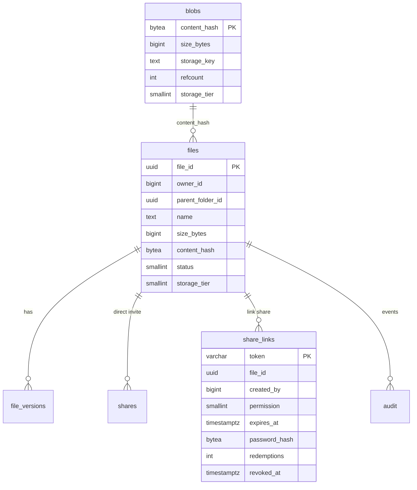

<details markdown="1">
<summary><b>Show: full SQL for the two core tables</b></summary>

```sql
CREATE TABLE blobs (
    content_hash     BYTEA PRIMARY KEY,
    size_bytes       BIGINT NOT NULL,
    storage_key      TEXT NOT NULL,          -- S3 key: /raw/<hash>
    refcount         INT NOT NULL DEFAULT 1,
    first_uploaded   TIMESTAMPTZ NOT NULL DEFAULT NOW(),
    storage_tier     SMALLINT NOT NULL DEFAULT 1  -- 1=hot, 2=warm, 3=cold
);

CREATE TABLE files (
    file_id          UUID PRIMARY KEY,
    owner_id         BIGINT NOT NULL,
    parent_folder_id UUID,
    name             TEXT NOT NULL,
    size_bytes       BIGINT NOT NULL,
    content_hash     BYTEA NOT NULL REFERENCES blobs(content_hash),
    current_version  INT NOT NULL DEFAULT 1,
    status           SMALLINT NOT NULL DEFAULT 1, -- 1=uploading, 2=ready, 3=quarantined, 4=deleted
    storage_tier     SMALLINT NOT NULL DEFAULT 1,
    created_at       TIMESTAMPTZ NOT NULL DEFAULT NOW(),
    deleted_at       TIMESTAMPTZ
);
CREATE INDEX idx_files_owner  ON files (owner_id, parent_folder_id);
CREATE INDEX idx_files_hash   ON files (content_hash);  -- dedup lookups

CREATE TABLE upload_sessions (
    upload_id         UUID PRIMARY KEY,
    user_id           BIGINT NOT NULL,
    expected_size     BIGINT NOT NULL,
    expected_hash     BYTEA,
    total_chunks      INT NOT NULL,
    s3_upload_id      TEXT NOT NULL,
    status            SMALLINT NOT NULL DEFAULT 1, -- 1=active, 2=finalized, 3=abandoned
    idempotency_key   TEXT,
    created_at        TIMESTAMPTZ NOT NULL DEFAULT NOW(),
    expires_at        TIMESTAMPTZ NOT NULL
);
CREATE UNIQUE INDEX idx_session_idem ON upload_sessions (user_id, idempotency_key);

CREATE TABLE share_links (
    token              VARCHAR(32) PRIMARY KEY,
    file_id            UUID NOT NULL REFERENCES files(file_id),
    created_by         BIGINT NOT NULL,
    permission         SMALLINT NOT NULL,
    expires_at         TIMESTAMPTZ,
    password_hash      BYTEA,
    require_account    BOOLEAN DEFAULT FALSE,
    max_redemptions    INT,
    redemptions        INT NOT NULL DEFAULT 0,
    created_at         TIMESTAMPTZ NOT NULL DEFAULT NOW(),
    revoked_at         TIMESTAMPTZ
);
CREATE INDEX idx_links_file ON share_links (file_id);
```

</details>

Four choices worth defending out loud:

**`blobs` is separate from `files`.** A blob is bytes, addressed by hash. A file is a user-named pointer to a blob. Many files can point at one blob. `refcount` tracks references. When it hits zero the blob is eligible for deletion after a 24-hour grace period.

**Sharded by `owner_id`.** Almost every query is "list my files in folder X." Co-locating one user's files on one shard makes those queries single-shard. Cross-shard share lookups use a separate global index on `shares.granted_to`.

**`upload_sessions` lives in Postgres, not Redis.** Sessions live for hours and must survive cache eviction. Volume is low (one row per in-flight upload).

**`share_links.token` is opaque.** No relationship to the file, the owner, or the creation time. Leaking the generation algorithm leaks nothing about existing tokens.

---

### 5. Core algorithms

**Upload init and finalize:**

<details markdown="1">
<summary><b>Show: init_upload and finalize_upload</b></summary>

```python
def init_upload(user_id, file_name, size, content_hash, idempotency_key):
    existing = db.find_session_by_idempotency(user_id, idempotency_key)
    if existing:
        return existing

    if content_hash:
        blob = db.find_blob(content_hash)
        if blob and blob.size_bytes == size:
            file_id = create_file_pointing_at_blob(user_id, file_name, blob)
            return {"deduped": True, "file_id": file_id}

    if not reserve_quota(user_id, size):
        raise QuotaExceeded

    s3_upload_id = s3.create_multipart_upload(bucket="user-data", key=f"raw/pending/{uuid4()}")
    chunk_size = 8 * 1024 * 1024
    total_chunks = ceil(size / chunk_size)

    presigned_urls = [
        s3.presign_upload_part(s3_upload_id, part_number=i+1, expires_in=3600)
        for i in range(total_chunks)
    ]

    session = db.insert_session(
        user_id=user_id, expected_size=size, expected_hash=content_hash,
        total_chunks=total_chunks, s3_upload_id=s3_upload_id,
        expires_at=now() + timedelta(hours=24)
    )
    return {"upload_id": session.id, "chunk_size": chunk_size, "presigned_urls": presigned_urls}


def finalize_upload(upload_id, parts):
    session = db.lock_session(upload_id)
    if session.status != ACTIVE:
        raise AlreadyFinalized
    if len(parts) != session.total_chunks:
        raise MissingChunks

    result = s3.complete_multipart_upload(session.s3_upload_id, parts)

    with db.transaction():
        blob = db.upsert_blob(session.expected_hash, session.expected_size, result.key)
        file_id = db.insert_file(session.user_id, session.file_name, blob)
        db.insert_audit(file_id, "file.created")
        db.mark_session_finalized(upload_id)

    publish_event("file.finalized", file_id)
    return file_id
```

</details>

**Share link resolution** (the hot read path):

```python
def resolve_share_link(token, password=None):
    link = db.find_share_link(token)
    if not link or link.revoked_at:
        return 404
    if link.expires_at and link.expires_at < now():
        return 410
    if link.max_redemptions and link.redemptions >= link.max_redemptions:
        return 410
    if link.password_hash and not bcrypt.verify(password, link.password_hash):
        return 401

    signed_url = cloudfront.sign(
        key=link.file.blob.storage_key,
        expires_in=900  # 15 minutes
    )
    db.increment_redemptions(token)
    return 302, signed_url
```

**Dedup upsert at finalize:**

```sql
INSERT INTO blobs (content_hash, size_bytes, storage_key, refcount)
VALUES (?, ?, ?, 1)
ON CONFLICT (content_hash) DO UPDATE SET refcount = blobs.refcount + 1;
```

If the blob already exists, no new S3 object is written. The `files` row points at the existing blob. The ON CONFLICT makes concurrent dedup safe without application-level locks.

---

### 6. The architecture

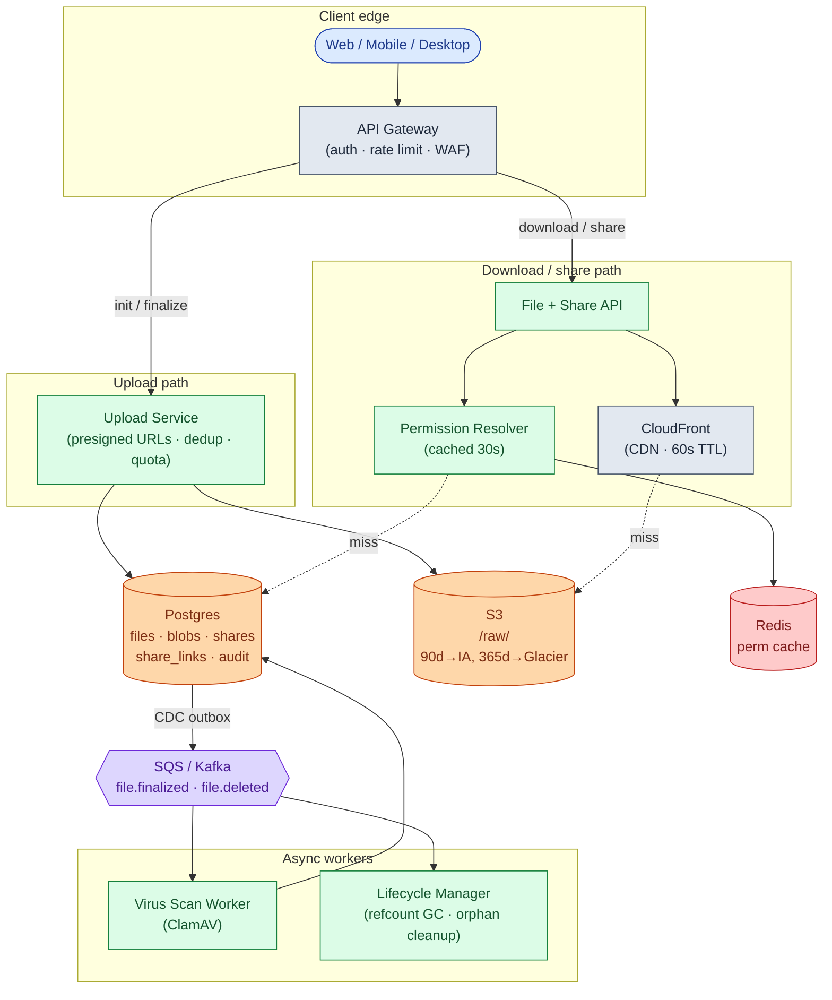

Five things to notice:

- The Upload Service mints presigned URLs and never touches the bytes. That single decision is what lets one small pod handle thousands of uploads per second.
- CloudFront sits in front of S3 for downloads. 60-second TTL so revocations propagate fast. Without it, a viral file destroys your S3 egress bill.
- The Permission Resolver is a separate concern because it is the hottest read path. "Can user X do Y on file Z?" combines owner check, direct share, and folder share inheritance. Cache 30 seconds per `(user, file)` pair.
- Virus scan and lifecycle GC are downstream of SQS/Kafka, not on the write path. If the scan worker falls behind, uploads still succeed.
- Metadata DB is sharded by `owner_id`. Cross-shard share lookups go through a global index.

---

### 7. A request, end to end


Target latencies:

| Operation | P99 |
|-----------|-----|
| Upload init | ~200 ms (dedup lookup when cache cold) |
| Finalize | ~500 ms (S3 multipart completion) |
| Permission resolution | ~50 ms (cached) |
| Download, CDN hit | ~30 ms (edge latency) |
| Share link redeem | ~80 ms (DB lookup + sign) |

---

### 8. Storage tiers

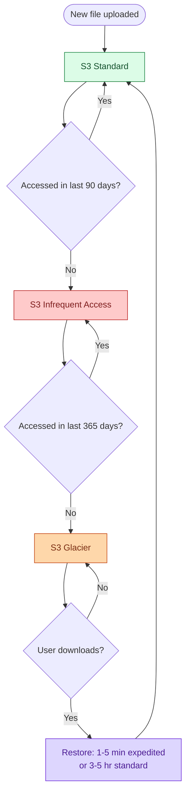

| Tier | Cost/GB/month | Retrieval | Retrieval cost |
|------|---------------|-----------|----------------|
| S3 Standard | $0.023 | < 100 ms | free |
| S3 IA | $0.0125 | < 100 ms | $0.01/GB |
| Glacier | $0.0036 | 1-5 min fast, 3-5 hr standard | $0.03/GB |

On 580 PB cold: Glacier is ~$25M/year. Standard is ~$160M/year. The lifecycle policy is the business model.

Three gotchas: Glacier retrieval surprises users (show a progress UI, never silently stall), small files under 128 KB cost more in IA than hot, and cold-tier deletes carry a 90-day minimum storage penalty (soft-delete first, hard-delete later).

---

### 9. Scaling journey: 10 to 1M users

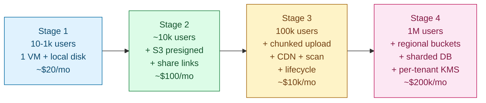

#### Stage 1: 10 to 1,000 users

One VM. Files on local disk at `/var/data/<user_id>/<file_id>`. Postgres on the same machine. Direct POST upload, files capped at 100 MB. Direct invite sharing only. No virus scan, no versioning, no quota. ~$20/month. Ships in a weekend.

The throughput is well under one upload per minute. Nothing is big enough to fail mid-upload. No presigned URLs needed yet.

#### Stage 2: 10,000 users

Something breaks: local disk fills up. A user's 2 GB upload drops at 1.8 GB and they restart from zero.

Fixes:
- Move bytes to S3 via presigned PUT URLs. App server leaves the byte path.
- Add share links. `share_links` table with 192-bit tokens.
- Add view/download/edit permission scopes.
- Add per-user quota with soft-delete and 30-day trash.

Still no chunked upload. Still no CDN. One DB. ~$100-300/month.

#### Stage 3: 100,000 users

Several things break at once:
- A 4 GB video upload over hotel WiFi fails at 80%. The whole thing restarts. 1-star review.
- A malware PDF is shared and downloaded 500 times before anyone notices.
- Storage cost at $3-5k/month growing 30% per quarter. 70% of bytes untouched after 30 days.
- S3 egress at $2k/month because every download streams full-price from S3.

Fixes, in order:
- Chunked upload via S3 multipart. A flaky 4 GB upload now survives.
- Virus scan pipeline via SQS. Async, does not block the upload response.
- CloudFront in front of S3 with 60-second TTL on signed URLs. Egress drops ~90%.
- S3 lifecycle policy: 90 days to IA, 365 to Glacier. Saves ~70% on cold bytes.
- Two Postgres read replicas. Dashboards read from replicas.
- Atomic quota reservation with `UPDATE WHERE has_room`.

Still single-region. DB does not need sharding yet (100M rows at 500 bytes is 50 GB). ~$10-20k/month.

#### Stage 4: 1 million users

New pains:
- EU users complain about upload latency to us-east-1.
- A healthcare customer demands data residency.
- A viral share link gets 1M downloads in 24 hours. CloudFront absorbs 99% but the 1% concentrates on one S3 prefix and triggers S3 throttling.
- Metadata DB primary at 60% CPU at peak.

Fixes:
- Regional S3 buckets per region. Files land in the user's home region.
- Shard metadata DB by `owner_id`. Each region is primary for its own users.
- Share link tokens encode the file's home region in the first few characters so any region routes correctly.
- CloudFront with multiple origins and hash-prefix-sharded S3 keys so viral files spread across prefixes.
- Per-user quota in Redis with `INCRBY` reservations for the race-free fast path.
- Per-tenant KMS keys for enterprise (customer-controlled kill switch).

The architecture is the same shape as Stage 3, multiplied across regions. ~$200-500k/month, dominated by S3 storage and egress.

---

### 10. Reliability

**Interrupted upload resume.** Upload sessions live 24 hours in `upload_sessions`. Client calls `GET /uploads/{upload_id}` to ask which chunks have landed. Server queries S3 `ListParts` and returns uploaded part numbers. Client re-uploads only the missing parts. After 24 hours, the Lifecycle Manager calls `s3.abort_multipart_upload` and marks the session abandoned.

**Orphan chunks.** Lifecycle Manager runs every 6 hours. For each session with `status=active AND expires_at < now()`, abort the S3 multipart. Safety net: a global S3 lifecycle rule aborts any multipart older than 7 days.

**Virus scan failures.** Three flavors:
- Worker dies mid-scan. SQS visibility timeout expires. Another worker picks up the message. Idempotent.
- Scan API is down. Worker retries with backoff. If down over an hour, files stay at `status=uploading` and downloads return 425 Too Early.
- Scan finds a virus after downloads have already happened. Flip `status=quarantined`. Set `revoked_at` on all share links for the file. Notify authenticated downloaders by email.

**Metadata DB primary failure.** Promote a replica. Reads continue from other replicas during the 30-60 second promotion. In-flight upload sessions see a few errors and retry via the idempotency key.

**S3 outage.** Presigned PUTs return 5xx. Signed GETs return 5xx. CloudFront serves whatever it has cached for downloads. Metadata operations still work. Honest answer: wait for S3 to recover. Multi-region replication helps for reads but is expensive and only justified for enterprise HA tiers.

---

### 11. Observability

| Metric | Why it matters |
|--------|----------------|
| `upload.init.rate` | Drop signals auth or API issues. |
| `upload.success_rate` (finalize/init) | Headline UX SLO. If 60% of inits never finalize, something is broken. |
| `upload.duration` by file size bucket | Tells you "all uploads slow" from "1 GB+ uploads slow." |
| `upload.dedup_hit_rate` | Should run ~30%. If 0%, clients are not sending hashes. If 80%, something is off. |
| `download.cache_hit_rate` (CDN) | Should stay above 95% in steady state. |
| `share_link.resolution.p99` | Hot path latency. |
| `share_link.brute_force_alerts` | Tokens with more than 50 failed redemptions in an hour. |
| `quota.exceeded.rate` | Spikes signal a rogue user or integration. |
| `virus_scan.queue_depth` | If growing, scanner cannot keep up. Recent uploads are in a scan gap. |
| `virus_scan.positive_rate` | Sudden spike means a malware campaign. |
| `blob.refcount.zero.count` | Eligible-for-GC blobs. Should drain over time. |
| `storage.by_tier.bytes` | Hot/warm/cold breakdown. Input for cost forecasting. |
| `egress.bytes_per_region` | Where the money goes. |

Page on: upload success rate under 90% for 5 min. Virus scan queue depth over 10k. CDN origin error rate over 1%.

Ticket on: per-user bandwidth anomaly. Quota race detected. Storage growth more than 2 sigma above forecast.

---

### 12. Follow-up answers

**1. Resumable upload across days.**

Client persists `upload_id` locally. On reopen, calls `GET /uploads/{upload_id}`. Server queries S3 `ListParts`, returns uploaded part numbers and original chunk size. Client uploads only missing parts and finalizes. If the session is past its 24-hour TTL, client gets 410 Gone and must start fresh. Abandoned sessions get GC'd every 6 hours by the Lifecycle Manager calling `AbortMultipartUpload`.

**2. Quota race.**

Fix with an explicit reservation:

```sql
UPDATE users
   SET reserved_bytes = reserved_bytes + ?
 WHERE user_id = ?
   AND used_bytes + reserved_bytes + ? <= quota_bytes
RETURNING reserved_bytes;
```

If this returns 0 rows, the upload is rejected with 402. Reservation is held until finalize (moves to `used_bytes`) or session expiry (released). At higher scale, run the same logic in Redis with `INCRBY` and compare-and-swap, with periodic reconciliation back to the DB.

**3. Content-addressed dedup.**

A `blobs` table keyed by SHA-256. On finalize:

```sql
INSERT INTO blobs (content_hash, size_bytes, storage_key, refcount)
VALUES (?, ?, ?, 1)
ON CONFLICT (content_hash) DO UPDATE SET refcount = blobs.refcount + 1;
```

If the blob exists, no new S3 object is written. The `files` row points at the existing blob. Delete decrements `refcount` atomically. When it hits zero, schedule the S3 object for deletion after a 24-hour grace period. For sensitive use cases (legal, medical), disable cross-tenant dedup and dedup only within one account.

**4. Share link enumeration.**

192 bits of entropy makes direct brute force impossible. Side channels are the real concern:
- Timing: "token not found" and "token found but expired" should take the same time. Use a unified error path.
- Error leakage: return the same 404 for "no such token" and "expired." Do not include `expired_at` in unauthenticated responses.
- Web logs: tokens appear in access logs. Treat them as secrets. Hash before logging.
- Rate limiting: per-IP limits on `/share/*` stop high-volume probing.

**5. Large delete tombstone backlog.**

200k file row updates and 200k S3 DELETEs done synchronously cause DB lock contention, S3 throttling, and HTTP timeouts. The user clicks Delete again and doubles the load.

Fix: write a single `deletion_jobs` row `(user_id, target_folder_id, requested_at)` and return 202 Accepted with a `job_id`. A background worker processes in batches of 1,000: soft-delete in DB, decrement blob refcounts, enqueue S3 deletion (S3 bulk-delete handles 1,000 objects per call). After 30 days of trash retention, a sweeper hard-deletes blobs whose refcount reached zero.

**6. Late-positive virus scan.**

In order:
1. Flip `status` to quarantined.
2. `UPDATE share_links SET revoked_at = NOW() WHERE file_id = ?`.
3. Invalidate CloudFront for the file's URL prefix.
4. Query audit for `event_type = 'file.downloaded' AND file_id = ?` to identify authenticated downloaders.
5. Notify them in-app and by email: "A file you downloaded was later found to contain malware."
6. Notify the uploader.

Pre-mitigation: keep the post-finalize, pre-scan window short. Faster scanning narrows the exposure gap.

**7. Edit conflict.**

Two users with Edit permission upload new versions within 10 seconds. Default behavior: both succeed, both create version rows. `files.current_version` points to the last one to land. The losing user's version exists in `file_versions`.

Surface a conflict notification: "User B also uploaded a new version at the same time. Theirs is now current. Yours is in history at version N."

For stronger guarantees, accept `If-Match: <current_version>` on upload. A mismatch returns 412 Precondition Failed and the client shows a conflict picker.

**8. Viral file.**

1M downloads of a 200 MB file in 24 hours. 99% CDN hit. The 1% miss is ~10k requests to S3 over the day, but if they cluster they can hit S3's 5,500 GET/s per-prefix limit.

Mitigations:
- Pre-warm CDN edges when a high-traffic link is created (push to all CloudFront edges immediately).
- Hash-prefix-shard S3 keys: store blobs at `/raw/<hash[0:2]>/<hash[2:4]>/<hash>` so popular files land on different prefixes.
- CloudFront Origin Shield: a regional cache between edges and S3, collapsing many edge misses into one S3 fetch.

**9. GDPR delete.**

1. Mark account `status = deleting`, log the user out, freeze to read-only.
2. Enqueue a `deletion_jobs` row for background processing.
3. Walk owned files: decrement each blob's refcount, revoke all share links the user created.
4. Walk received shares: set `revoked_at` where the user is `granted_to`. The file stays for the owner.
5. Walk audit log: replace `actor_id` with a hash, drop PII from payloads.
6. Delete the user row after the grace period (typically 30 days).
7. Email a deletion certificate.

Files deduped with other users: decrementing refcount may leave the blob alive. That is correct. The user's pointer is gone even if the bytes persist for someone else. If the user demands the actual bytes be deleted, copy the blob to a user-private path for remaining references, then delete. Do this only on explicit request.

**10. Per-tenant cost attribution.**

Every billable action is tagged with `tenant_id`:
- **Storage:** S3 inventory runs daily, listing all objects with size and tier. Keys encode `tenant_id` (`/raw/<tenant>/<hash>`). Daily job aggregates by tenant.
- **Egress:** CloudFront real-time logs include the URL. URLs encode `tenant_id`. Daily job aggregates bytes-out per tenant.
- **API requests:** API Gateway access logs include the JWT's `tenant_id` claim.
- **Virus scan calls:** Scan worker writes each scan to a `scan_invocations` table with `tenant_id`.

A nightly job rolls these into a `billing_lines` table with columns for `storage_hot_gb`, `storage_warm_gb`, `storage_cold_gb`, `egress_gb`, `api_requests`, `scan_calls`. The sum of per-tenant attributions should match your AWS bill within ~1%. Gaps are platform overhead.

---

### 13. Trade-offs worth stating out loud

**Single big PUT vs chunked.** Single PUT is simpler for files under 100 MB. Chunked is mandatory above 5 GB (S3's single-PUT limit) and strongly recommended above 100 MB for network resilience. Right answer: hybrid. Single PUT below a threshold, chunked above.

**Client-side encryption.** Optional, important for high-security customers. Encrypt with a key the server never sees. Trade-off: no dedup possible (ciphertext differs for identical plaintext), no server-side preview, key management is the customer's burden. Implement as opt-in for enterprise tier.

**Dedup by content hash.** Saves ~30% storage at consumer scale. Adds complexity: refcount management, GC, blob lifecycle, privacy. Worth it at scale. Skip for the first 1,000 users.

**Lifecycle to cold tier.** Saves 50-70% of storage cost on the cold tail. Costs: retrieval latency surprises users, retrieval fees on access, minimum-storage-duration penalties on early delete. Tune the transition age to your actual access pattern. 90 days is sometimes too aggressive for bursty files.

**Postgres vs DynamoDB for metadata.** Postgres gives joins, transactions, and a familiar query model. DynamoDB gives horizontal scale and predictable latency. Under 100M files, Postgres is simpler. Above that, sharding Postgres becomes painful and DynamoDB is worth considering. Do not switch preemptively.

**Sync vs async virus scan.** Sync blocks the upload UX for minutes on big files. Async accepts a 1-3 minute exposure window. Almost everyone picks async. The exposure is small; the UX win is large.

---

### 14. Common mistakes

**Tunneling uploads through your app server.** The biggest scaling mistake. Bandwidth cost is per-byte. Doubling traffic doubles your NIC bill. Presigned-direct-to-S3 is non-negotiable above ~100 concurrent uploads.

**Single POST for all uploads.** Works until the first 4 GB upload fails on hotel WiFi. Chunked is mandatory above ~100 MB.

**No quota enforcement.** "We will add it later" turns into "one user uploaded their Steam library and ate our budget." Quota at signup is easier to retrofit than quota after the fact.

**Forgetting to GC abandoned uploads.** S3 multipart uploads that never finalize keep costing money. A nightly sweeper plus an S3 lifecycle rule that aborts multiparts older than 7 days is the safety net.

**Share links that are just file IDs in the URL.** `https://app.com/file/abc123` is not a share link. It is a permanent backdoor. Use an opaque high-entropy token with explicit expiry and revocation.

**No virus scan.** Fine for an internal tool. Indefensible for a public product. Basic ClamAV catches most known malware.

**Hot path doing folder traversal for permissions.** "Is this file in any folder shared with me?" walked on every download is slow at scale. Cache or materialize the access set per user.

**Skipping the `status` field on files.** Without an explicit state machine (uploading, ready, quarantined, deleted), you get edge cases: downloads of half-finalized files, deletes of in-flight uploads. The `status` smallint pays for itself in week 1.

**Mixing user files and system files in one bucket without prefixing.** Lifecycle rules apply per bucket or prefix. If you mix, you cannot tier user files independently of thumbnails or temp data. Pick a prefix scheme on day one.

**No audit log.** When a security report comes in ("user X claims their file was leaked"), the absence of "who accessed this and when" turns a 1-hour investigation into a week-long one. Audit is cheap to build, painful to retrofit.

If you can hit 7 of these 10 and walk through the upload protocol trade-off and the scaling journey in the same conversation, you are interviewing above the bar for this problem.

