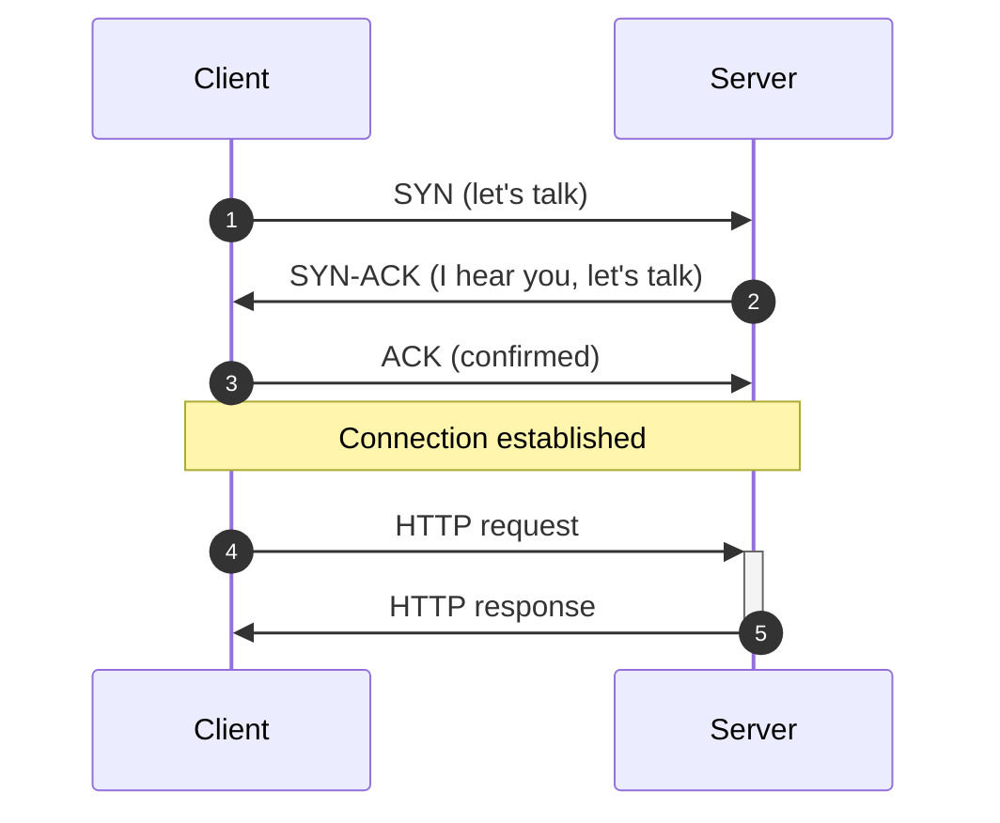
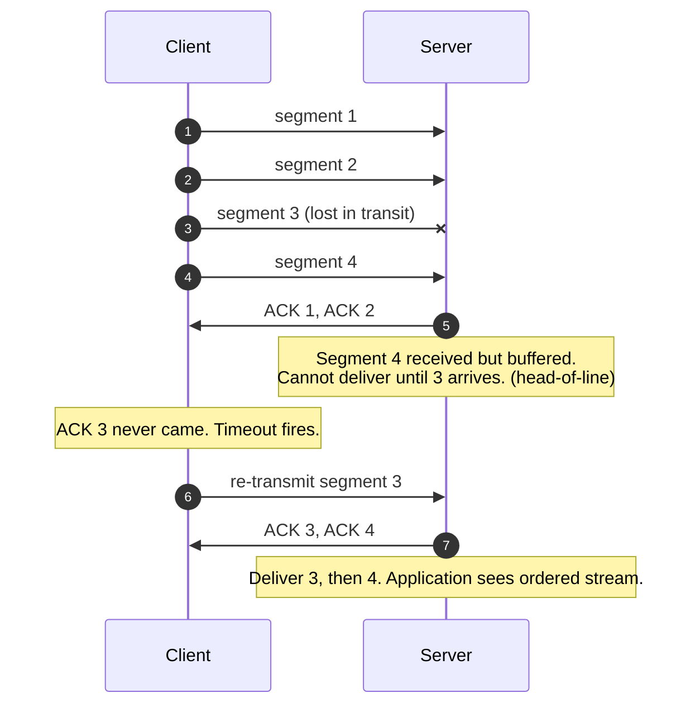
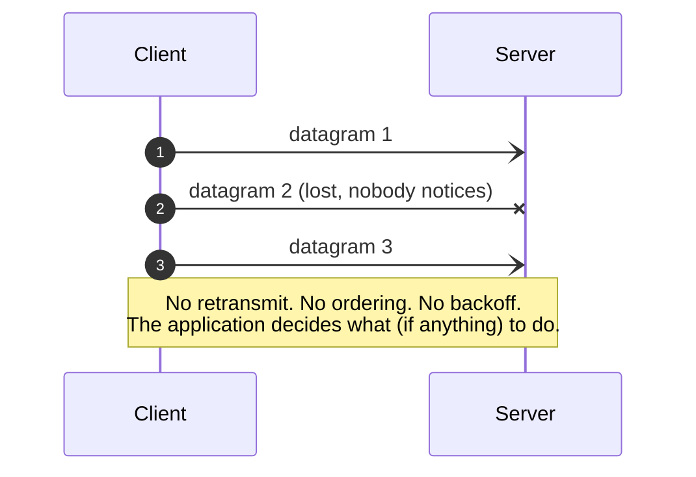

TCP makes the network feel like a phone call: a connection opens, bytes arrive in order, nothing gets lost. UDP makes the network feel like a postcard: you drop a message in the mail and hope. Both run on the same wires. They give you different promises.

## The problem they solve

The internet is unreliable. Packets get lost. They arrive out of order. They get duplicated. Routers drop traffic when they are busy. None of this is rare; it happens millions of times per second on a normal day.

Most applications cannot deal with this directly. You want to write `send("hello")` on one side and read `"hello"` on the other side, in order, exactly once. That is a lot of plumbing.

TCP gives you that plumbing for free. UDP says "no thanks, I will handle it myself."

## TCP: a connection with a handshake

Before any data flows, the two sides agree to talk. This is the **three-way handshake**: one round trip of pure setup before the first byte of payload.

That handshake costs one round trip. On a 100 ms link, that is 100 ms of latency before you have sent anything useful. TCP charges this cost once per connection, which is why HTTP/2 reuses one TCP connection for many requests.

## TCP: what happens when a packet is lost

This is where TCP earns its keep. The protocol notices loss, retransmits, and delivers everything in order. The application sees a clean ordered stream, no matter what the network did underneath.

This is also where TCP's cost hides. Segment 4 was available the whole time but had to wait. That is **head-of-line blocking**, and it shows up again in [HTTP/2 over TCP](/practice/system-design/concepts/002-http2-and-http3/).

## UDP: throw it and hope

No handshake. No retransmits. No ordering. The protocol gives you one job: get a datagram from A to B. If it arrives, great. If not, your problem.

The dashed arrow tip means "no acknowledgement expected." The application either does not care (live video, telemetry), or it builds its own reliability on top of UDP (QUIC, custom protocols, game netcode).

## What TCP gives you, and what it costs

**You get:**

- Ordered delivery (byte 1 arrives before byte 2).
- Reliable delivery (the protocol retries lost packets).
- Flow control (the sender slows down if the receiver cannot keep up).
- Congestion control (the sender slows down if the network is busy).

**You pay for it:**

- A handshake before any data can flow (one round trip of latency).
- Head-of-line blocking: if packet 5 is lost, packets 6, 7, 8 sit in a buffer waiting, even if you do not care about packet 5 anymore.
- Slower recovery on lossy networks (mobile, satellite) because TCP assumes loss means congestion and backs off.

## What UDP gives you, and what it costs

**You get:**

- Send and forget. No handshake. No retries. No backoff.
- One round trip less of latency on the first message.
- Independent messages: losing packet 5 does not block packet 6.

**You pay for it:**

- Lost data stays lost unless you handle it yourself.
- Out-of-order arrival is your problem.
- No flow control. You can blow up a slow receiver.
- Firewalls are more suspicious of UDP.

## When to pick each

Pick TCP when **losing data is worse than waiting for it**:

- HTTP, gRPC, WebSocket.
- SSH, database connections.
- Anything where one missing byte makes the rest of the message useless.

Pick UDP when **waiting for data is worse than losing it**, or when **you have your own reliability layer**:

- Live audio and video calls (Zoom, WebRTC). A dropped frame from 80ms ago is just noise; better to skip it than to stall.
- Online games. The player's position 200ms ago is worthless.
- DNS lookups. Tiny message, fast retry, no point opening a connection.
- QUIC (which HTTP/3 sits on top of) uses UDP and builds its own ordering and retries, smarter than TCP.

## Two scenarios

**Scenario one: a chat app.**

User sends "are you free at 7?". This must arrive. It must arrive in one piece. If it arrives 200ms later than the next message, the conversation is confusing. TCP, no debate.

**Scenario two: a live video call.**

A frame from 50ms ago is irrelevant. You want frame 51 to arrive now, not frame 50 to be retransmitted and arrive late. The codec is built to handle small amounts of loss gracefully. UDP, every time. The application layer might add its own selective retransmit, but it would never pay TCP's strict-ordering tax.

## What this connects to

- **HTTP/3 chose UDP.** It runs on QUIC, which is "UDP plus our own faster, smarter version of TCP." See [HTTP/2 and HTTP/3](/practice/system-design/concepts/002-http2-and-http3/).
- **Latency vs throughput.** TCP's handshake costs you one round trip; on a 100ms cross-region link that is a lot. See [Latency, throughput, bandwidth](/practice/system-design/concepts/004-latency-throughput-bandwidth/).

## Common mistakes

- **Using TCP for tiny, frequent, stateless lookups.** DNS is over UDP for a reason: the message is small, retrying is cheap, and a handshake per lookup would melt the internet.
- **Reaching for UDP for "speed" without owning the reliability problem.** You will reinvent TCP, badly. If you are not actively dropping data on purpose, you probably want TCP.
- **Assuming TCP is "always reliable."** TCP guarantees in-order, no-loss delivery between two endpoints while the connection is alive. If the connection drops, your application still has to handle that (and idempotency, see [Idempotency](/practice/system-design/concepts/021-idempotency/)).
- **Forgetting the firewall.** Many corporate and CGNAT networks block or rate-limit UDP. If your client is behind one of those, your fancy UDP-based protocol will not work and you will not know why.

## Quick recap

- TCP: ordered, reliable, slower to start, head-of-line blocked.
- UDP: fast, independent, lossy, application's problem.
- TCP for almost everything you write at work.
- UDP for real-time media, gaming, DNS, and as the substrate for things like QUIC.

This concept sits in **Stage 1 (Foundations)** of the [System Design Roadmap](/practice/system-design/roadmap/).
