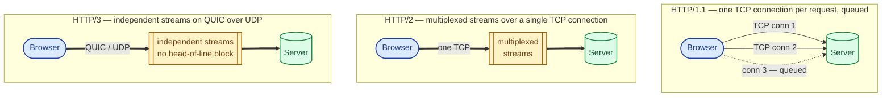

HTTP/1 was one phone line per request. HTTP/2 lets many requests share one phone line. HTTP/3 throws away the phone line itself and uses something built for the modern internet. Each step fixed a real problem that came before it.

## The problem each version solves

**The HTTP/1 problem.** A web page loads 80 things: HTML, CSS, JavaScript, fonts, images. Under HTTP/1, the browser opens a TCP connection per request (with a handshake), or reuses a connection but pipelines poorly. Browsers ended up opening 6 connections per origin in parallel just to keep things moving. It was slow, and the slowest resource blocked the rest.

**The HTTP/2 problem.** HTTP/2 fixed the connection-per-request problem with multiplexing: many requests share one TCP connection. But TCP itself has head-of-line blocking. If one packet on that shared connection is lost, every stream sharing it waits.

**The HTTP/3 fix.** HTTP/3 throws out TCP and runs on QUIC over UDP. QUIC does its own ordering and retries, but per-stream. A lost packet only stalls its own stream, not the other 50 things downloading in parallel.

## The picture in your head

## What HTTP/2 actually does

- **Binary framing.** Requests and responses are split into binary frames instead of text. Faster to parse and easier to interleave.
- **Multiplexed streams.** Many concurrent requests on one TCP connection, in any order.
- **Header compression (HPACK).** Headers repeat a lot. HPACK keeps a dictionary on both sides and sends references instead of the full text.
- **Stream priorities.** The client can hint that the HTML is more important than a background image.
- **Server push.** Servers could send things the client did not ask for yet. In practice this was rarely useful and has been mostly retired.

## What HTTP/3 actually does

- **Runs on QUIC, not TCP.** QUIC lives on UDP. Yes, that UDP. See [TCP vs UDP](/practice/system-design/concepts/001-tcp-vs-udp/).
- **No head-of-line blocking.** Streams are independent. Loss on one stream only stalls that stream.
- **Built-in TLS.** TLS is part of the protocol, not a layer on top. One round trip less to set up a connection.
- **0-RTT resumption.** If you have talked to this server recently, the first request can ship with the connection setup. Repeat visits feel instant.
- **Connection migration.** Your phone switches from Wi-Fi to cellular. With TCP, every connection breaks (different IP). With QUIC, the connection survives because connection identity is not tied to IP.

## When each matters

You almost never write code that picks a version directly. You configure your server, CDN, or load balancer, and the browser negotiates the highest version both sides support. So the real question is: do you turn on HTTP/2 and HTTP/3 at the edge?

**Turn on HTTP/2** if you serve anything beyond the simplest static page. The wins are real and the cost is near zero.

**Turn on HTTP/3** if your users are on mobile, on flaky networks, or geographically far from your edge. The 0-RTT and connection-migration wins are biggest exactly there.

## Two scenarios

**Scenario one: a single-page app loading 60 assets.**

On HTTP/1, the browser opens 6 connections and serialises the rest, stalling on the slowest resource each round. On HTTP/2, the same 60 requests share one connection, all in flight together. Page-load time often drops by 30 to 50% just by flipping HTTP/2 on at the edge. No application code changes.

**Scenario two: a user on a subway, jumping between cell towers.**

Their TCP connections die every time they re-handshake on a new tower. Under HTTP/2, every page load restarts. Under HTTP/3 on QUIC, the connection migrates: same connection identity, new IP, no interruption. The user notices nothing.

## What this connects to

- **TCP vs UDP.** HTTP/3 picked UDP for a real reason: TCP could not be fixed in time. See [TCP vs UDP](/practice/system-design/concepts/001-tcp-vs-udp/).
- **Load balancers.** HTTP/2 is end-to-end binary; HTTP/3 is on UDP. Your load balancer needs to speak the same protocol or you will not see the benefit. See [Load balancer: why, how, when](/practice/system-design/concepts/028-load-balancer-basics/).
- **Latency.** Both versions are mostly latency wins, not throughput wins. See [Latency, throughput, bandwidth](/practice/system-design/concepts/004-latency-throughput-bandwidth/).

## Common mistakes

- **Assuming HTTP/2 fixes a latency problem.** It fixes connection setup and multiplexing. If your slow endpoint is slow because of a 2-second database query, HTTP/2 will not help.
- **Forgetting HTTP/2 effectively requires HTTPS.** All major browsers only speak HTTP/2 over TLS. No cleartext upgrade path in practice.
- **Running an old L4 load balancer in front of HTTP/2.** If your LB only speaks HTTP/1.1, your shiny HTTP/2 stops at the LB and re-fragments behind it.
- **Configuring HTTP/3 without measuring.** Some networks block or rate-limit UDP. Always keep HTTP/2 as the fallback and watch your error rates after rollout.
- **Turning on server push.** It almost always made things worse than not pushing. The major browsers have deprecated it. Just send a `Link: rel=preload` header instead.

## Quick recap

- HTTP/1: one connection per request, slow, head-of-line on the connection.
- HTTP/2: many streams per TCP connection, binary framing, header compression.
- HTTP/3: same multiplexing, on QUIC over UDP, no TCP head-of-line, connection survives network changes.
- Turn on HTTP/2 by default. Turn on HTTP/3 if your users move between networks or sit far from your edge.

This concept sits in **Stage 1 (Foundations)** of the [System Design Roadmap](/practice/system-design/roadmap/).
