Four ways to ask a server to do something. They look like alternatives, but they were each invented to solve a different real problem. Once you know what each one was reacting to, picking between them gets a lot less religious.

## The problem they each solve

- **REST** was a reaction to RPC-style web services that were verbose and brittle. It said: stop inventing endpoints, just model resources and use HTTP verbs.
- **RPC** is the oldest idea: "calling a function over the network should feel like calling a local function." Modern incarnations dress it up.
- **gRPC** is RPC with a typed schema (Protobuf), running over HTTP/2, designed for fast, polyglot, internal service communication.
- **GraphQL** was a reaction to mobile apps making 12 REST calls per screen. It said: let the client describe exactly the shape of data it needs, in one request.

Each one is the right answer in some situation. None is the right answer everywhere.

## The picture in your head

```mermaid
flowchart TB
    subgraph REST["REST — resources at stable URLs, HTTP verbs"]
        direction LR
        RC(["Client"]):::client
        RS[("Server")]:::server
        RC -->|"GET /users/123"| RS
        RS -->|"full user JSON"| RC
    end

    subgraph RPC["RPC — call a function by name"]
        direction LR
        PC(["Client"]):::client
        PS[("Server")]:::server
        PC -->|"POST /api<br/>{method: getUser, id: 123}"| PS
        PS -->|"user JSON"| PC
    end

    subgraph GRPC["gRPC — typed Protobuf over HTTP/2"]
        direction LR
        GC(["Client"]):::client
        GS[("Server")]:::server
        GC -->|"UserService.GetUser(id=123)"| GS
        GS -->|"UserReply  (binary, schema-checked)"| GC
    end

    subgraph GQL["GraphQL — client names the fields it needs"]
        direction LR
        QC(["Client"]):::client
        QS[("Server")]:::server
        QC -->|"{ user(id:123) { name, email } }"| QS
        QS -->|"just name + email"| QC
    end

    classDef client fill:#dbeafe,stroke:#1e40af,color:#1e3a8a,stroke-width:1.5px
    classDef server fill:#dcfce7,stroke:#15803d,color:#14532d,stroke-width:1.5px
```

Same goal, four different request shapes. The differences in shape come from different opinions about how clients and servers should agree on a contract.

## What each one really is

**REST.** Resources at stable URLs (`/users/123`). Verbs are HTTP verbs (`GET`, `POST`, `PATCH`, `DELETE`). The shape of a user is whatever JSON the server returns. The contract is loose; teams write OpenAPI specs to nail it down.

**RPC (the plain kind).** Pick a transport (often HTTP), pick a serialisation (often JSON), and send `{method: "doThing", args: ...}`. The endpoint is one URL; the verb is in the body. Easy to write, hard to keep tidy at scale.

**gRPC.** Define your services in a `.proto` file. Generated client and server code in any language. Runs on HTTP/2, uses Protobuf (binary, fast, schema-enforced). Streaming is first-class. Built for internal microservices that need to be fast and consistent.

**GraphQL.** One endpoint (`/graphql`). The client sends a query that names exactly the fields it wants. The server has a schema (typed) and resolvers (functions that fetch each field). Powerful for clients that need different shapes of the same data.

## When to pick each

**REST** when:

- You have a public API and many third-party clients.
- Cacheability matters (CDNs and browsers know how to cache `GET`).
- Tooling and education matter more than raw throughput.

**RPC** when:

- It is internal and the team is small.
- You want to ship something today and worry about the schema tomorrow.
- The operation is fundamentally an action, not a resource ("rerun the report", "send the email").

**gRPC** when:

- It is internal, polyglot, and you care about latency or schema strictness.
- You need streaming (server pushes a feed of events, or both sides chat).
- You can afford the cost of generated code in your build pipeline.

**GraphQL** when:

- You have multiple clients (web, iOS, Android) that need different fields of the same data.
- The frontend changes faster than the backend can keep up.
- Your data is graph-shaped (a user has posts, posts have comments, comments have authors).

## Four scenarios

**Scenario one: a public API for partners.** REST. Everyone knows it. Curl works. Browsers, postman, and every language have first-class support. Versioning is straightforward (`/v1`, `/v2`).

**Scenario two: internal microservice mesh, dozens of services in five languages.** gRPC. The Protobuf schema is the source of truth. Adding a field is safe. Latency is low. Streaming is supported when you need it.

**Scenario three: a mobile app that needs name + avatar on one screen and name + email + posts + followers on another.** GraphQL. The mobile team adds fields without backend support, and they fetch just what they need on each screen, saving bandwidth on poor connections.

**Scenario four: an internal admin panel that triggers a job.** RPC (or REST treated like RPC). `POST /jobs/run` with a body. You will not pretend this is a resource just for the sake of REST purity.

## What this connects to

- **HTTP/2.** gRPC requires it (multiplexed streams, binary framing). See [HTTP/2 and HTTP/3](/practice/system-design/concepts/002-http2-and-http3/).
- **Sync vs async.** REST and gRPC unary calls are sync. gRPC streams and webhooks are async patterns. See [Synchronous vs asynchronous](/practice/system-design/concepts/005-sync-vs-async/).
- **Load balancers.** L4 LBs are fine for REST; gRPC ideally wants an L7 LB that understands HTTP/2 stream balancing. See [L4 vs L7](/practice/system-design/concepts/029-l4-vs-l7/).

## Common mistakes

- **REST cargo-cult: forcing every operation into a resource.** "Cancel an order" does not need to be `PATCH /orders/123 {status: cancelled}`. `POST /orders/123/cancel` is fine and clearer. Resources are useful, not sacred.
- **GraphQL fixes the wrong problem.** It does not fix backend complexity; it just moves it into the resolver layer. The N+1 query problem famously gets worse with naive GraphQL than with REST. Plan for DataLoader-style batching from day one.
- **Building a homegrown RPC framework when gRPC exists.** You will reinvent codegen, schema evolution, retries, and deadlines. Badly. Just use gRPC.
- **Exposing gRPC directly to the browser.** Browsers cannot speak it. You need grpc-web through a proxy, or expose a REST or GraphQL layer at the edge.
- **No schema or contract.** Whichever style you pick, write the contract down (OpenAPI for REST, `.proto` for gRPC, the SDL for GraphQL). Implicit contracts age badly.

## Quick recap

- REST: resources, verbs, public-friendly, broadly understood.
- RPC: function-call style, fast to ship, fine for internal use.
- gRPC: typed, fast, polyglot, streaming, internal.
- GraphQL: client picks the shape, great for multi-client mobile-and-web frontends.
- Most real systems use two or three of these together: REST or GraphQL at the edge, gRPC between services.

This concept sits in **Stage 1 (Foundations)** of the [System Design Roadmap](/practice/system-design/roadmap/).
