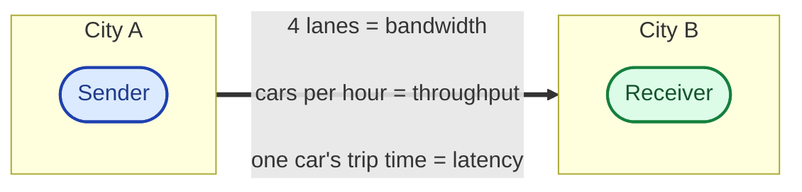
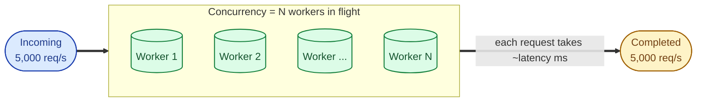

These three words get mixed up in every meeting about performance. "We need more bandwidth" usually means "we have a latency problem." Wrong word, wrong fix, expensive lesson. They are three different things, and if you cannot tell them apart, you will optimise the wrong one.

## The plain-English definitions

- **Latency** is how long one request takes from start to finish.
- **Throughput** is how many requests finish per second.
- **Bandwidth** is how much data can fit through the pipe at once.

A useful analogy: a highway between two cities.

- **Latency** is how long the drive takes from city A to city B.
- **Throughput** is how many cars arrive at city B per hour.
- **Bandwidth** is how many lanes the highway has.

You can widen the highway (more bandwidth) and not change the trip time at all. You can build a tunnel and cut the trip in half (lower latency). Both make the highway better, but in different ways, for different reasons.

## The highway analogy in one picture

Latency is one car's trip time. Throughput is cars per hour arriving at the destination. Bandwidth is how many lanes the highway has. All three live on the same road; widening or shortening or speeding up changes a different number.

You can widen the highway and not change the trip time at all. You can build a tunnel and cut the trip time in half. Both make the road better, in different ways, for different reasons.

## How throughput, concurrency, and latency tie together

There is a small piece of math that explains most "we need more capacity" conversations:

> **throughput  =  concurrency  /  latency**

If each request takes 100 ms and you have 100 things in flight at once, you finish 1,000 per second. To finish more, either each one takes less time, or you allow more in flight.

Adding workers raises throughput **only if latency stays flat**. The trap is that more workers usually contend for the same downstream (database, downstream service), so latency creeps up as concurrency grows. You hit a wall not at the worker count, but at the next bottleneck.

## Numbers worth knowing

To estimate any of these in your head, memorise a few rough numbers. Real engineers do this. They will not all be exactly right; that is fine.

- L1 cache: 1 nanosecond
- Main memory read: 100 nanoseconds
- SSD random read: 100 microseconds
- Disk seek: 10 milliseconds
- Same-data-centre network round trip: under 1 millisecond
- Cross-region (US east to Europe): around 80 to 100 milliseconds
- Geostationary satellite round trip: around 500 milliseconds

A request that hits memory and a request that hits a disk in another region differ in latency by **about a million**. This is why "make it faster" is rarely the right framing. The question is what kind of slow it is.

## How they relate

There is a small piece of math that ties two of them together:

> **throughput = concurrency / latency**

Or rearranged: if you want 1,000 requests per second and each request takes 100ms, you need 100 things in flight at the same time. You can get there by reducing the 100ms (lower latency), or by allowing more concurrency (more workers, more threads, more connections), or both.

This is why "we need more bandwidth" is usually the wrong diagnosis. Bandwidth caps your maximum throughput in bytes per second, but most slow applications are not bottlenecked on bandwidth. They are bottlenecked on per-request latency or on concurrency limits.

## When each matters

- **Users feel latency.** "The button takes 3 seconds." Adding more servers does not help one user click one button.
- **Cost and capacity are about throughput.** "Black Friday is 30 times normal load." You scale to handle the rate, not the per-user feel.
- **Bandwidth matters for streams, large files, and dense pipes.** Streaming 4K video, copying 100 TB between regions, training a model that pulls a terabyte per epoch.

## Three scenarios

**Scenario one: "the app feels sluggish."**

Users report 4-second page loads. You add three more servers. Nothing changes. Of course it does not: their single request was still slow. You profile and find a database query that takes 3.8 seconds because someone forgot an index. Adding the index drops latency to 40 ms. Same hardware. Same bandwidth. The fix was a latency fix.

**Scenario two: "we cannot handle the traffic."**

The site is fine when one person uses it, but at peak hours it falls over. p50 latency is good, p99 spikes, error rate climbs. This is a throughput problem. You scale horizontally, add a queue in front of the slow downstream, raise the connection pool size, or all three. None of these reduce latency for any single user; they let you serve more users at the same time.

**Scenario three: "video buffers."**

Users on home internet say playback is choppy. Your server has plenty of CPU left. The problem is the last-mile bandwidth between your CDN edge and the user. The fix is more edge locations (less distance, less congestion) or a lower bitrate (less data per second of video).

## What this connects to

- **Caching.** Cache hits convert a many-round-trip latency into a single in-memory read. See [Why cache and what to cache](/practice/system-design/concepts/023-why-cache-what-cache/).
- **Load balancers and horizontal scaling.** They are throughput tools, not latency tools. See [Horizontal vs vertical scaling](/practice/system-design/concepts/039-horizontal-vs-vertical/).
- **CDNs.** They cut latency by bringing data closer to the user, and they save bandwidth by serving from the edge. See [CDN](/practice/system-design/concepts/027-cdn-when-you-need-it/).

## Common mistakes

- **Asking for "more bandwidth" when one slow query is the problem.** Always check whether a single request is slow before assuming you need more capacity.
- **Optimising p50 and ignoring p99.** Average latency hides the tail. The tail is where the angry tweets come from.
- **Treating throughput and concurrency as the same thing.** They are linked by latency. Doubling concurrency does not double throughput if it doubles latency too (because of contention).
- **Confusing bandwidth with throughput in requests-per-second discussions.** A 1 Gbps link can carry plenty of small JSON responses. If you are throughput-limited at 5,000 req/s on that link, the bottleneck is almost certainly not the bandwidth.
- **Forgetting the speed of light.** Sydney to London is around 17,000 km. Light in a fibre travels around 200,000 km/s. That alone gives you 85 ms one way, no software involved. Some "slow APIs" are just physics.

## Quick recap

- Latency = time for one request.
- Throughput = requests finished per second.
- Bandwidth = bytes per second the pipe can carry.
- Throughput is roughly concurrency divided by latency.
- "Slow" is a vague word; always ask "slow how?" before you reach for a fix.

This concept sits in **Stage 1 (Foundations)** of the [System Design Roadmap](/practice/system-design/roadmap/).
