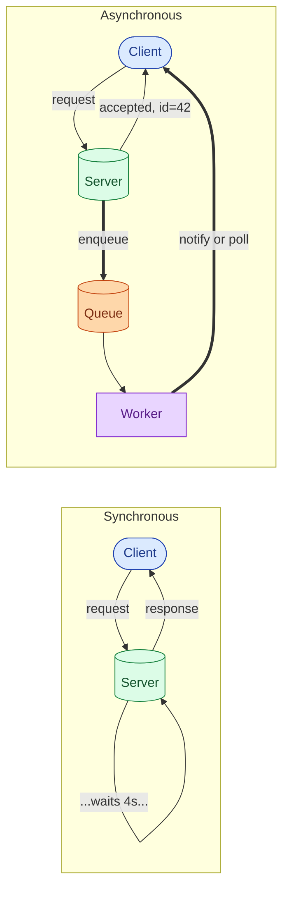

Synchronous means the caller waits for the answer before doing anything else. Asynchronous means the caller hands off the work, gets back a "got it," and goes on with its life. The answer arrives later, by whatever path you arranged: a callback, a webhook, a polled status check, a message on a queue. It is not a question of speed. It is a question of who is doing the waiting.

## The problem each one solves

**Sync solves the simple case.** The caller needs an answer to keep going. Login. Read a row. Authorize a payment. Show the next screen. Sync is the default because most things are like this.

**Async solves the awkward case.** The work takes longer than you want any caller to wait. Or the work can fail in ways that need retries. Or the downstream is sometimes down and you want the upstream to keep working anyway. Or the work is "fire and forget": send a welcome email, update a search index, recompute a recommendation.

If you make everything sync, slow downstreams take you down with them. If you make everything async, you spend the rest of your career debugging "I clicked the button but nothing happened."

## The picture in your head

In the sync case, the client's thread sits idle for the full duration of the request. In the async case, the server returns immediately with a handle, processes the work in the background, and the client either polls for the result, gets a webhook, or watches a subscription.

## The four common ways to do async

- **Background worker with a queue.** The web layer pushes a job onto a queue (SQS, RabbitMQ, Redis, Postgres-as-a-queue). A pool of workers picks them up and runs them. The caller gets a job ID and checks status later.
- **Webhook.** The caller registers a URL. When the work is done, the server makes an HTTP call to that URL with the result. Common for B2B integrations.
- **Polling.** The caller asks "are we there yet?" every few seconds. Crude, but it works through every proxy and firewall, and you only need HTTP.
- **Streaming connection.** WebSocket or gRPC server-streaming. The server pushes updates over an open connection. Best feel for the user, more state for you to manage.

## When to pick each

**Pick sync when:**

- The caller cannot do anything useful without the answer.
- The operation is fast (well under one second, or fast enough that "wait for it" is fine).
- The result is small and final ("logged in", "payment authorized", "row written").
- You can afford to fail the whole user-facing request if the downstream is down.

**Pick async when:**

- The operation takes more than a second or two.
- The work can be retried safely.
- The downstream can be down and you do not want the upstream to be down with it.
- The result is a side effect rather than something the user is staring at the screen waiting for.

## Three scenarios

**Scenario one: "Pay now" button.**

The user is staring at the screen. They want a clear yes or no. They will keep clicking if you respond in 8 seconds. This is sync, even though the payment processor itself might internally fan out async work. From the user's perspective: tap, wait briefly, get the answer.

**Scenario two: "Upload video" button.**

The user uploads a 200 MB file. You cannot make them wait while you encode it into 6 bitrates and 3 codecs. Return immediately: "your upload is being processed; we will email you when it is ready." Push the encode job onto a queue. A worker handles it. The user gets a notification, or refreshes the page and sees their video is now ready.

**Scenario three: "Sign up" button.**

Mostly sync (create the account, set a session, redirect). One side effect (sending the welcome email) is async; the queue takes it. If the email service is down for an hour, sign-ups still work. The emails go out when it comes back. This kind of hybrid is the most common shape in real systems.

## What this connects to

- **Message queues.** Most async patterns are some form of "put a job on a queue, pick it up later." See [Why use a message queue](/practice/system-design/concepts/032-why-message-queue/).
- **Idempotency.** Async work gets retried. Retried work must be safe to run twice. This is the rule that breaks first when teams skip it. See [Idempotency](/practice/system-design/concepts/021-idempotency/).
- **Latency vs throughput.** Async does not reduce the latency of one operation. It reduces the latency the user perceives, and it raises throughput because slow downstreams no longer occupy upstream workers. See [Latency, throughput, bandwidth](/practice/system-design/concepts/004-latency-throughput-bandwidth/).

## Common mistakes

- **Making everything async because "async is fast."** It is not faster. The work still takes the same amount of time. It is non-blocking, which is different.
- **Sync chains pretending to be async.** Service A awaits service B, which awaits service C, which awaits the database. You are just a tower of sync calls dressed up in `async/await`. The downstream still has to be up.
- **No idempotency on async retries.** The queue will redeliver. The worker will retry. If your job is "charge the credit card", retrying it twice is a problem. Always use an idempotency key.
- **No way to see the result.** You return `{job_id: 42}` and never tell the client how to find out if job 42 finished. Pick one: polling endpoint, webhook, or stream, and document it.
- **Forgetting the failure case.** What if the worker crashes? What if the job has been pending for an hour? The user should see "still processing" or "failed", not a permanent spinner.
- **Async without back-pressure.** Producers keep enqueuing while consumers fall behind. The queue grows. Memory or storage gets exhausted. Always cap the queue or apply back-pressure upstream.

## Quick recap

- Sync: caller waits, simpler, fine for fast deterministic work.
- Async: caller hands off, harder to think about, necessary for slow or flaky work.
- Async is not magic speed; it is non-blocking, with retry safety and isolation as the real wins.
- Most real systems are a mix: sync for the user-facing path, async for side effects and slow tasks.

This concept sits in **Stage 1 (Foundations)** and reappears in **Stage 3 (Caching, queues, and async work)** of the [System Design Roadmap](/practice/system-design/roadmap/).
