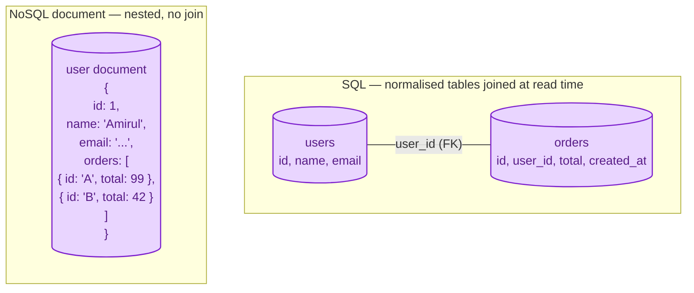

SQL databases store data in tables with strict schemas and join data together at query time. NoSQL is an umbrella for everything that broke one of those rules: schema-less, denormalised, or non-tabular. "SQL or NoSQL" is the wrong framing. The real question is which data shape matches your workload.

## The problem each one solves

**SQL** was built when storage was expensive and consistency mattered more than throughput. Normalise the data, never repeat yourself, join when you need to read.

**NoSQL** showed up when web companies hit the limits of "one big Postgres" at scale. Storage got cheap. They needed to spread data across hundreds of machines, scale writes, and store messy data without a migration every Tuesday. The trade was: give up some joins, some consistency, and some schema rigor, in return for horizontal scale and flexibility.

Neither is universally better. Most modern systems use both.

## The same data, two shapes

A user has many orders. Same domain, two ways to lay it out.

In SQL, asking "give me this user with their last 5 orders" is a join. In the document model, it is a single key lookup that returns the whole nested structure. The shape that wins depends on how you read the data, not how you draw it on a whiteboard.

## The NoSQL family

"NoSQL" is not one thing. There are four main flavours, each solving a different problem:

```mermaid
flowchart TB
    subgraph KV["Key-value — fastest possible lookup by key"]
        direction LR
        KV1["GET user:42"]:::client --> KV2[("Redis, DynamoDB,<br/>Memcached")]:::store
    end

    subgraph DOC["Document — nested JSON-like objects"]
        direction LR
        D1["find one where id=42"]:::client --> D2[("MongoDB, Couchbase,<br/>Firestore")]:::store
    end

    subgraph WC["Wide-column — sparse rows, billions of columns"]
        direction LR
        W1["query by row + column<br/>family"]:::client --> W2[("Cassandra, HBase,<br/>BigTable, ScyllaDB")]:::store
    end

    subgraph GR["Graph — relationships are first class"]
        direction LR
        G1["MATCH (a)-[FRIEND]-&gt;(b)"]:::client --> G2[("Neo4j, JanusGraph,<br/>Amazon Neptune")]:::store
    end

    classDef client fill:#dbeafe,stroke:#1e40af,color:#1e3a8a,stroke-width:1.5px
    classDef store fill:#e9d5ff,stroke:#7e22ce,color:#581c87,stroke-width:1.5px
```

When someone says "we should use NoSQL", make them pick one of these four. The conversation gets useful fast.

## When to pick SQL

- Your data has clear relationships (customers, orders, products, line items).
- You need real transactions across rows or tables. See [ACID vs BASE](/practice/system-design/concepts/007-acid-vs-base/).
- Your query patterns will keep changing as the product evolves; SQL lets you join across anything later without remodelling.
- Reporting and analytics are first-class. SQL is the language analysts already speak.
- You are below the "one big Postgres" line, which today is much higher than people assume. A modern Postgres on decent hardware handles tens of thousands of writes per second.

## When to pick NoSQL

- The access pattern is fixed and known: "given user X, get their last 20 events." Pick a key-value or document store and shape the data exactly for that read.
- Write volume is very high or bursty (clickstream, telemetry, IoT). Cassandra and DynamoDB are built for this.
- The data is naturally a graph (social, recommendations, fraud rings). A graph database handles three-hop queries that would be horror in SQL.
- You want predictable horizontal scale without manual sharding effort. Managed NoSQL ships that as a feature.
- The data is genuinely schemaless: arbitrary JSON blobs from third parties, fields no one fully owns.

## Three scenarios

**Scenario one: a SaaS billing system.**

Customers, invoices, line items, tax rates. Strong relational structure. Money. Audit. You need joins, transactions, and the ability to compute "all unpaid invoices over 60 days" on demand. Postgres. Done.

**Scenario two: a clickstream pipeline.**

Hundreds of thousands of events per second. You will read them later by user or by session, mostly time-windowed. Cassandra or DynamoDB by user_id, or a wide-column store by (user_id, timestamp). A relational database would crumble here, and joining clickstream rarely makes sense anyway.

**Scenario three: a friend-of-friend recommendation.**

Three to five hops through a social graph. In SQL this is recursive CTEs, which work but are painful past two hops on large data. A graph database makes the query short and the engine fast.

Most real companies use both: Postgres for the transactional core, Cassandra or DynamoDB for high-volume time-series, Redis for caching, and sometimes a graph database for one specific feature.

## What this connects to

- **ACID vs BASE.** The biggest semantic difference between most SQL and most NoSQL. See [ACID vs BASE](/practice/system-design/concepts/007-acid-vs-base/).
- **Indexes.** Both worlds have them; the rules differ. See [Indexes that help, indexes that hurt](/practice/system-design/concepts/010-indexes-help-and-hurt/).
- **Sharding.** NoSQL ships with it; in SQL you usually bolt it on. See [Sharding strategies](/practice/system-design/concepts/012-sharding-strategies/).
- **OLTP vs OLAP.** Both SQL and NoSQL come in OLTP and OLAP flavours; do not pick by family. See [OLTP vs OLAP](/practice/system-design/concepts/014-oltp-vs-olap/).

## Common mistakes

- **"NoSQL scales, SQL does not."** Modern Postgres on serious hardware handles workloads that would have been called "web-scale" ten years ago. Most companies hit their NoSQL operational complexity long before they would have hit the SQL ceiling.
- **Picking NoSQL because the data is "messy".** Messy data still needs a model. NoSQL just lets you postpone the modelling, which usually means doing it in five places in the application code.
- **Using a document store and then joining across documents in application code.** You re-invented joins, but slower and with no consistency guarantees. If you need joins, you wanted SQL.
- **Choosing by what FAANG uses.** The right database for a company with a thousand engineers and a billion users is rarely the right database for a team of six and ten thousand users.
- **Forgetting backups, point-in-time recovery, and observability.** These are mature in SQL and uneven across NoSQL. Check before you commit.

## Quick recap

- SQL: relational, joined at read time, strict schema, deep tooling, mature operations.
- NoSQL: four families (KV, document, wide-column, graph), each shaped for one read pattern.
- The real question is what your read pattern looks like, not which acronym is trendier.
- Most production systems use both. Pick the right tool per workload.

This concept sits in **Stage 2 (Storage and data)** of the [System Design Roadmap](/practice/system-design/roadmap/).
