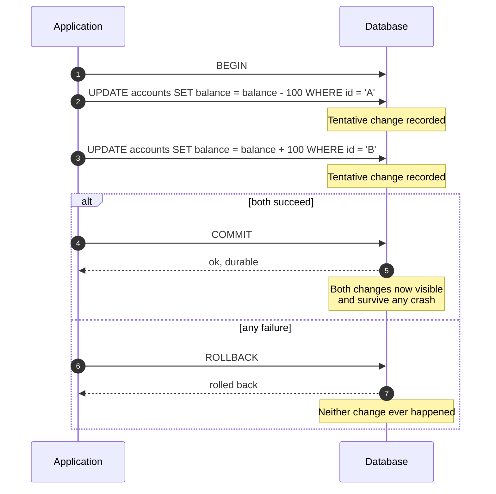
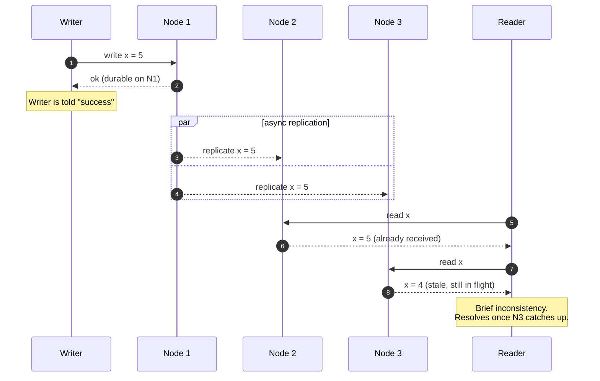
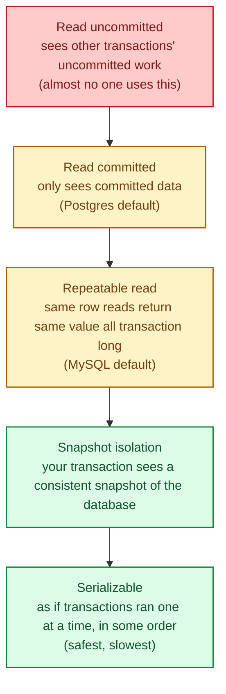

ACID is a contract a database offers: your changes will either all happen or none of them will, and once committed they stay committed. BASE is a relaxed contract: writes may not be visible everywhere immediately, but the system will catch up. ACID buys you safety; BASE buys you scale and availability. Real systems use both, sometimes in the same architecture.

## What ACID actually guarantees

A transaction is a unit of work that the database treats as one thing:

- **Atomicity.** All changes succeed, or none do. No half-applied transactions, even if the process crashes mid-way.
- **Consistency.** The database moves from one valid state to another. Constraints (foreign keys, NOT NULL, CHECK) are enforced.
- **Isolation.** Concurrent transactions do not see each other's half-finished work. The exact rules vary by isolation level.
- **Durability.** Once the database says "committed," that commit survives a crash, a power cut, and a kicked cable.

The canonical example: bank transfer. Debit one account, credit another. If either step fails or the machine crashes between them, both reverse.

The whole transaction either lands or vanishes. From the outside, that block of work looks instantaneous.

## What BASE relaxes

BASE stands for **Basically Available, Soft state, Eventual consistency.** In practice it means:

- A write to one node returns success before all replicas have the new value.
- For a short window, different readers may see different versions of the same thing.
- Eventually (often within milliseconds, sometimes longer) every replica converges.

You traded a tiny window of staleness for the ability to keep serving reads if N1 goes down and for the ability to spread across regions without paying cross-region latency on every write.

## Isolation levels: ACID has dials

"ACID" is not one thing either. The **I** has knobs. The standard ladder:

Most apps run on **read committed**. Financial systems often want **serializable** for the critical money-moving paths and **read committed** for everything else. Knowing which level you are actually running is a senior-level thing to check.

## When ACID is what you want

- Money, inventory, anything where a wrong number is a real loss.
- Multi-row operations that must succeed or fail together (create order + reserve stock + charge card).
- Foreign keys and constraints you want the database to enforce, not the application.
- Audit trails that have to be consistent across joined tables.

## When BASE is what you want

- Geo-distributed systems where cross-region writes would add hundreds of milliseconds of latency.
- Workloads where availability beats correctness for a brief window (a shopping cart can be eventually consistent; the checkout cannot).
- Massive write throughput where the cost of strong consistency is throughput you cannot afford.
- Analytics, search indexes, recommendations, feeds: stale by seconds is fine.

## Two scenarios

**Scenario one: an order checkout.**

The user presses pay. You need: charge the card, reserve stock, write the order, update the cart. If any one of these fails, none should happen. The customer never wants to see "your card was charged but no order exists." This is what ACID was invented for. Run it in a transaction (or in a saga that simulates one across services, see [Two-phase commit vs sagas](/practice/system-design/concepts/020-2pc-vs-sagas/)).

**Scenario two: a like count on a video.**

A user likes a video. You want the count to go up. You do not need it to be exact across all data centres in the same millisecond. If it shows as 12,401 in Europe and 12,402 in Asia for two seconds, no one notices. BASE wins: write locally, replicate asynchronously, eventually converge.

## What this connects to

- **CAP theorem.** ACID systems often pick consistency over availability under partition; BASE systems often pick the other way. See [CAP theorem](/practice/system-design/concepts/016-cap-theorem/).
- **Consistency models.** "Eventual" is the loosest setting; there is a useful middle ground (causal, read-your-writes). See [Consistency models](/practice/system-design/concepts/017-consistency-models/).
- **Idempotency.** BASE systems retry. Retries make idempotency mandatory, not optional. See [Idempotency](/practice/system-design/concepts/021-idempotency/).

## Common mistakes

- **Assuming "ACID" means "fully serializable."** Most databases default to a weaker isolation level. Check yours. Postgres is read committed; MySQL InnoDB is repeatable read.
- **Treating "eventually consistent" as "consistent in a few milliseconds."** Eventually can be minutes during a network partition or replica catch-up.
- **Mixing ACID and BASE in the wrong direction.** If you write to a BASE store and then read it back to make a decision before the replication has caught up, the decision is wrong. Read your own writes from the source of truth.
- **Wrapping everything in serialisable transactions.** You will get deadlocks and throughput cliffs you do not expect. Use the lowest isolation level that is actually safe for the path.
- **Forgetting durability is a setting.** Some systems can be configured to acknowledge writes before fsync. Faster, but a crash loses the last second. Know what you signed up for.

## Quick recap

- ACID: atomicity, consistency, isolation, durability. The database keeps you safe.
- BASE: tolerate small windows of inconsistency in exchange for availability and scale.
- Isolation levels are a dial inside ACID; pick the lowest that is safe for your workload.
- Real systems use both. Match the contract to the value of the data being protected.

This concept sits in **Stage 2 (Storage and data)** of the [System Design Roadmap](/practice/system-design/roadmap/).
