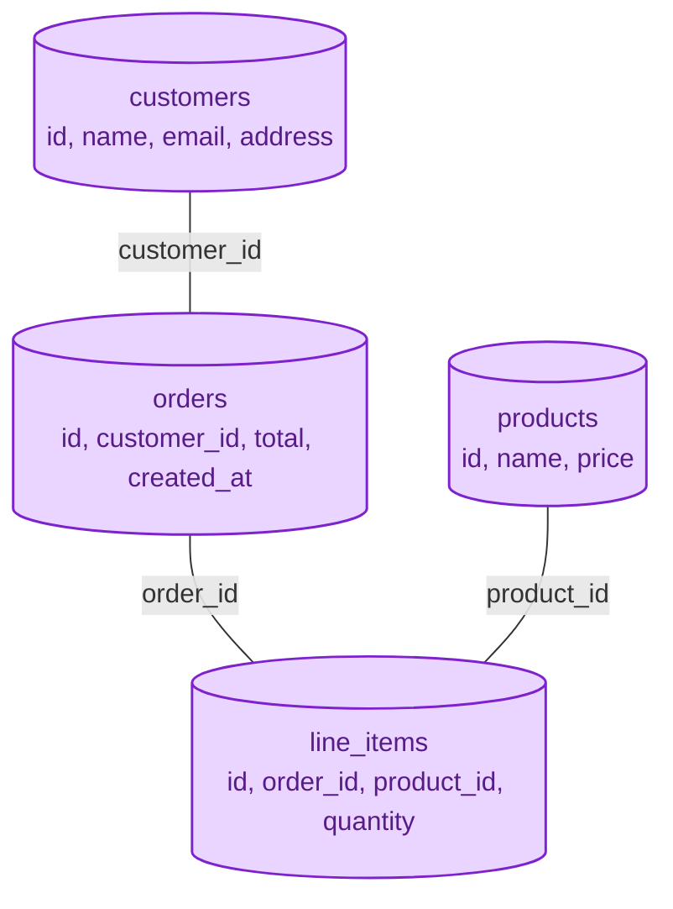
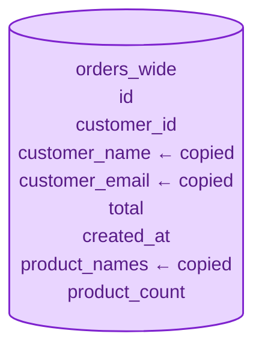
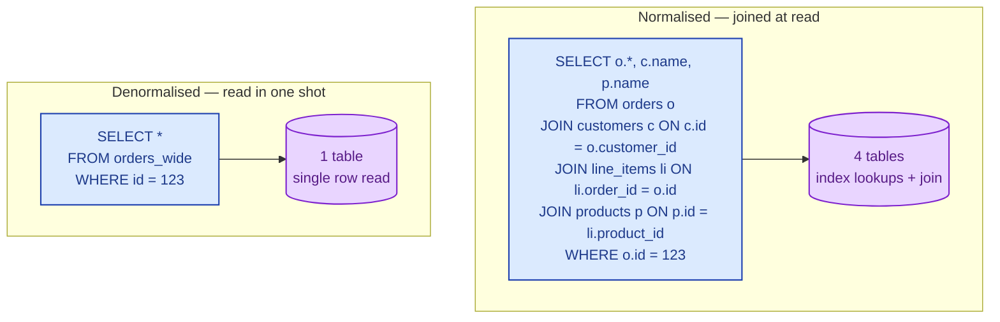

Normalisation says: store every fact in exactly one place. Denormalisation says: copy facts on purpose, where copying makes reads faster than joining. Both are correct in different situations. The mistake is doing one of them unconsciously.

## What normalisation buys you

A fact lives in one row in one table. Other tables refer to it by foreign key. Update the original row, and every place that joins to it sees the new value, automatically.

A customer changes their email. You update one row. Every report, query, and join that uses customer email is now correct. No backfill. No drift.

The price is paid at read time. "Show this order with customer name and product names" is a four-table join.

## What denormalisation buys you

Copy the fields you read together into the same row, so you do not have to join at read time. The price is paid at write time: when the original changes, every copy has to change too.

"Show this order with customer name" is now a single-row read. Fast, simple, cacheable. But change the customer's name, and you need a backfill across every order. Forget to backfill and the data drifts.

## The same query, two paths

For one row, the difference is small. For a million rows on a dashboard refresh, the join cost compounds. That is when denormalisation earns its keep.

## When to normalise

- The data has clear relationships and lots of writes (most OLTP applications).
- Source-of-truth values change frequently and need to be correct everywhere.
- Storage is expensive relative to compute (less true today than it once was).
- The schema will evolve; you do not know which joins you will want yet.
- You care about referential integrity and want the database to enforce it.

## When to denormalise

- The read pattern is fixed and is one of the hot paths.
- Joins are expensive at the scale you operate (lots of rows, lots of joins).
- The source data changes rarely, or the staleness is acceptable.
- The workload is analytics or reporting, not transactional updates. See [OLTP vs OLAP](/practice/system-design/concepts/014-oltp-vs-olap/).
- You are using a NoSQL store that does not do joins at all. Denormalisation is the default there, not the exception.

## Three scenarios

**Scenario one: a transactional product catalog.**

Products, categories, suppliers, prices. Categories get renamed. Suppliers get reassigned. Normalised. The cost of a few joins per page load is nothing compared to the cost of keeping copies in sync.

**Scenario two: a search index.**

You build an Elasticsearch document per product that contains the product, its category name, its supplier name, and the latest review summary. Pure denormalisation. The index is rebuilt nightly (or updated by a stream of change events), and it does not have to be perfectly fresh. Reads are one document, fast.

**Scenario three: an analytics dashboard.**

A wide "orders_with_everything" table is built off the OLTP system every hour by an ETL job. Analysts query it without joins. The cost of the ETL pipeline buys queryable latency on every dashboard.

## What this connects to

- **OLTP vs OLAP.** Normalised tends to be OLTP-shaped; denormalised tends to be OLAP-shaped. See [OLTP vs OLAP](/practice/system-design/concepts/014-oltp-vs-olap/).
- **Caches.** A cache is a special-case denormalisation: a copy of a join result with a TTL. See [Why cache and what to cache](/practice/system-design/concepts/023-why-cache-what-cache/).
- **Read replicas.** A replica can hold a denormalised view that the primary does not, used only for reads. See [Read replicas](/practice/system-design/concepts/011-read-replicas/).
- **SQL vs NoSQL.** Document stores essentially mandate denormalisation. See [SQL vs NoSQL](/practice/system-design/concepts/006-sql-vs-nosql/).

## Common mistakes

- **Normalising past the point of usefulness.** 3NF, then 4NF, then 5NF. You can keep going. At some point you have 15 tables and every query joins them all. Stop earlier.
- **Denormalising "for performance" without measuring.** A four-table join on indexed columns is often a few milliseconds. Denormalising adds write-amplification you may not need.
- **Forgetting to keep copies in sync.** Denormalised data drifts. You need a backfill plan, a refresh job, or a stream-based update from the source. Without it, the data slowly lies.
- **Mixing the two within the same table for no reason.** A table that is half-normalised and half-denormalised confuses everyone who reads it later. Pick a shape per table and be consistent.
- **Denormalising for joins that are actually missing indexes.** Add the index first. Measure again. Then decide.

## Quick recap

- Normalise: one fact, one place. Pay the cost at read time.
- Denormalise: copy facts on purpose. Pay the cost at write time and at sync time.
- Most production systems do both, in different layers: normalised OLTP, denormalised analytics, denormalised caches.
- The mistake is choosing by reflex. Always know which shape this table is and why.

This concept sits in **Stage 2 (Storage and data)** of the [System Design Roadmap](/practice/system-design/roadmap/).
