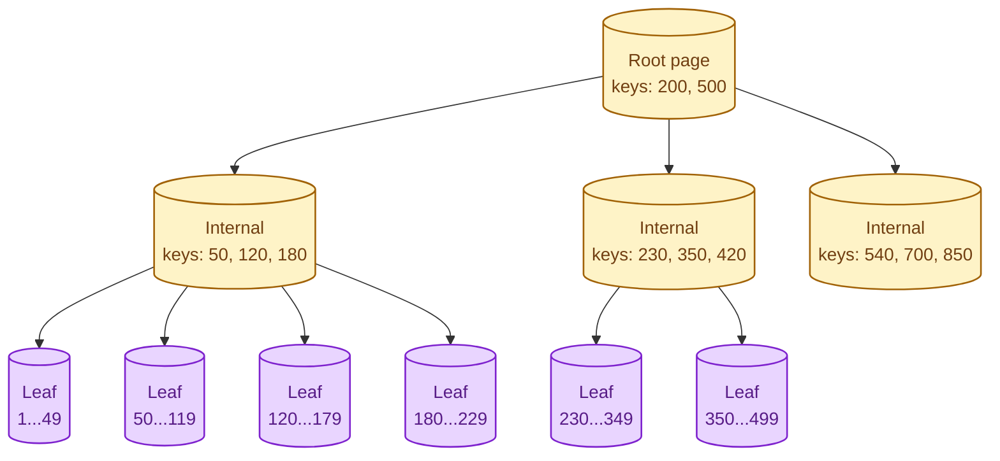
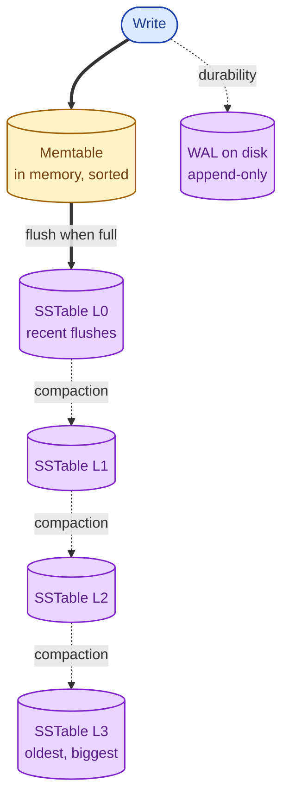
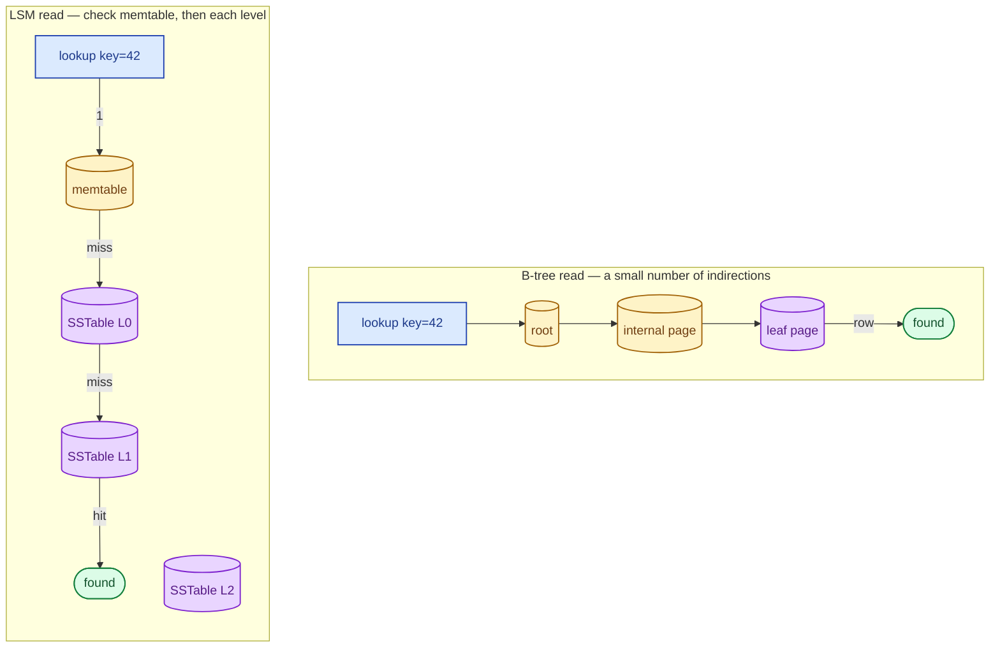

Two ways for a database to store data on disk so it can find it again fast. B-trees are read-optimised: every key sits in a known place, and finding it is a small number of jumps. LSM trees are write-optimised: writes go into memory first and are merged to disk in the background. Your database picked one; the choice shapes its performance profile more than anything else.

## What a B-tree looks like

A balanced tree of pages on disk. The root and a few intermediate levels live in memory (cached). Looking up a key is "follow pointers from root to leaf": typically 3 to 4 disk reads worst case, often zero because the upper levels are cached.

Reads are predictable and cheap. Writes are the trade: every insert has to find the right leaf, modify it in place, and possibly split it. Random writes scatter across the disk.

Used by: PostgreSQL, MySQL/InnoDB, Oracle, SQL Server, SQLite, and almost every relational database.

## What an LSM tree looks like

Writes go into an in-memory buffer (the **memtable**). When it fills, it gets flushed to disk as an immutable sorted file called an **SSTable**. Background workers then **compact** smaller SSTables into larger ones to keep read performance reasonable.

Writes are very fast: append to a log, insert into a memory map, done. Reads have to check the memtable first, then the SSTables in order from newest to oldest, until they find the key.

Used by: Cassandra, HBase, RocksDB, LevelDB, ScyllaDB. Most modern wide-column and key-value stores.

## The read path: how each one finds a key

B-trees: one path, predictable cost.

LSM trees: multiple checks. Bloom filters in front of each SSTable make negative lookups (key absent) nearly free. Positive lookups still scan more than B-trees do.

## What each one is good and bad at

**B-tree strengths:**
- Predictable read latency.
- Range scans are fast (leaves are linked).
- Point reads do not amplify.

**B-tree weaknesses:**
- Random writes are slower: in-place modification, page splits, write amplification through the buffer cache and WAL.
- Update-in-place pattern is harder to do safely with very high write volume.

**LSM tree strengths:**
- Very fast writes: sequential append, no random disk I/O on the hot path.
- Easy to scale write throughput nearly linearly.
- Compression-friendly: SSTables are large sorted blocks.

**LSM tree weaknesses:**
- Reads may touch many files. Slower for cold data.
- Compaction uses disk I/O continuously; you have to budget for it.
- Range scans across many SSTables need merging.

## When to pick a B-tree database

- Mostly transactional workload, moderate writes, lots of reads.
- Range queries matter ("orders between these dates").
- Application is already SQL-shaped.
- You want predictable latency under load.

## When to pick an LSM-tree database

- Write-heavy workload: ingestion, telemetry, time-series, event logs.
- Throughput growth is the main constraint.
- You can tolerate occasional read latency spikes during compaction.
- The access pattern is point reads or short scans, not big random joins.

## A real scenario: chat history

A messaging app writes a row per message: hundreds of thousands per second at peak. Reads are "give me this user's messages around this time." That is huge write volume with localised reads.

A B-tree primary would struggle with the write rate without aggressive sharding. Cassandra (LSM) was built for this: partition by chat_id, write sequentially, read by recent range. The LSM model maps directly to the workload.

Same app's billing table: thousands of writes per hour, lots of reads, transactional. A B-tree (Postgres) is right. Two databases, one application, picked by workload, not by team preference.

## What this connects to

- **Indexes.** A primary index is the B-tree or LSM that defines storage order; secondary indexes are extra structures with their own write cost. See [Indexes that help, indexes that hurt](/practice/system-design/concepts/010-indexes-help-and-hurt/).
- **SQL vs NoSQL.** Most SQL databases are B-tree; most wide-column NoSQL is LSM. See [SQL vs NoSQL](/practice/system-design/concepts/006-sql-vs-nosql/).
- **Time-series databases.** Almost always LSM-shaped, often with extra time-partitioning. See [Time-series databases](/practice/system-design/concepts/015-time-series-databases/).

## Common mistakes

- **Picking LSM for read-heavy workloads.** Cassandra is famously bad at "give me one specific row I have never read before." If reads dominate, a B-tree is usually better.
- **Forgetting compaction is not free.** LSM compaction does continuous disk I/O. Your write throughput is bounded by what compaction can keep up with.
- **Treating "fast writes" as the only metric.** LSM writes are fast at the millisecond level. But sustained write rate is capped by compaction, not by the memtable.
- **Tuning compaction defaults without measuring.** Tiered, levelled, time-windowed compaction all exist for reasons. Pick the wrong one for your read pattern and you eat double the disk.
- **Believing the choice doesn't matter at small scale.** At small scale, both work fine. The choice matters once you hit either the read-latency cliff (LSM) or the write-throughput cliff (B-tree). Knowing which one you would hit first is the senior part.

## Quick recap

- B-tree: in-place updates, predictable reads, written by Postgres / MySQL / Oracle.
- LSM tree: append-only writes, background compaction, written by Cassandra / HBase / RocksDB.
- The shape of your workload (write-heavy vs read-heavy, point lookup vs range scan) drives the right choice.
- The "default" database for your team is fine until it is not. Then know which side of this trade-off matters.

This concept sits in **Stage 2 (Storage and data)** of the [System Design Roadmap](/practice/system-design/roadmap/).
