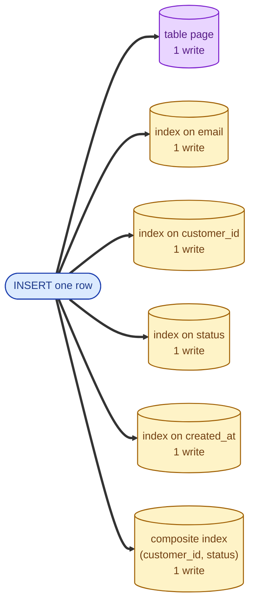
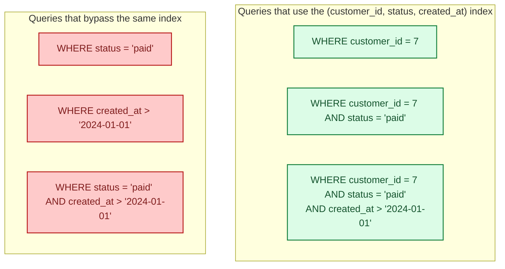

An index is a separate data structure that helps the database find rows without scanning the whole table. Adding an index is usually the cheapest possible performance fix. It is also often the wrong fix, and every index you add slows every write to the table. The senior skill is knowing exactly which index to add, and which to leave off.

## The problem an index solves

Without an index, finding a row by anything other than its position on disk is a **full table scan**: read every row, check the predicate, discard the ones that do not match. On a million-row table that is fine; on a billion-row table it is a coffee break.

```mermaid
flowchart TB
    subgraph SCAN["Without an index: full table scan"]
        direction LR
        Q1["WHERE email = 'a@b.com'"]:::query
        T1[("orders table<br/>1,000,000 rows")]:::store
        Q1 --> T1
        T1 -->|"read all,<br/>compare each one"| H1(["3 matching rows"]):::done
    end

    subgraph INDEX["With an index on email"]
        direction LR
        Q2["WHERE email = 'a@b.com'"]:::query
        IDX[("index on email<br/>B-tree, sorted by email")]:::infra
        T2[("orders table")]:::store
        Q2 --> IDX
        IDX -->|"3 row pointers"| T2
        T2 -->|"fetch 3 rows"| H2(["3 matching rows"]):::done
    end

    classDef query fill:#dbeafe,stroke:#1e40af,color:#1e3a8a,stroke-width:1.5px
    classDef store fill:#e9d5ff,stroke:#7e22ce,color:#581c87,stroke-width:1.5px
    classDef infra fill:#fef3c7,stroke:#a16207,color:#713f12,stroke-width:1.5px
    classDef done fill:#dcfce7,stroke:#15803d,color:#14532d,stroke-width:1.5px
```

A B-tree index turns "find rows matching X" from a million reads into a small handful: walk the tree, jump straight to the rows. Latency drops by orders of magnitude. This is why "did you add an index?" is the first question a senior engineer asks when a query is slow.

## The cost: every write pays for every index

An index is a copy of part of the data, kept sorted. When you insert a row, the database has to update **every index** that covers any of the inserted columns.

Five indexes on a table means one logical insert is six physical writes. Updates and deletes have the same multiplier. On a write-heavy table, you feel this immediately: throughput drops, replication lag grows, the database CPU climbs.

The rule of thumb: an index pays for itself only if the queries it accelerates run often enough to be worth that extra write cost on every insert.

## Composite indexes: column order matters

A composite index on `(customer_id, status, created_at)` is one B-tree sorted by all three columns in that order. It can speed up:

- `WHERE customer_id = ?`
- `WHERE customer_id = ? AND status = ?`
- `WHERE customer_id = ? AND status = ? AND created_at > ?`

It will **not** speed up:

- `WHERE status = ?` (skips the leftmost column)
- `WHERE created_at > ?` (skips both leading columns)

This is one of the most common interview gotchas and one of the most common production bugs. Order the columns by selectivity and access pattern, not by which one looks important.

## Reading EXPLAIN: the senior move

The query planner tells you what it actually did. In Postgres, `EXPLAIN ANALYZE` gives you both the plan and the real timing. Three patterns to recognise:

- **Seq Scan**: full table scan. Fine for small tables; concerning on big ones.
- **Index Scan**: walks an index to find rows.
- **Index Only Scan**: the index alone has all the columns the query asked for; the table is not touched at all (the fastest case).

A senior engineer can read a plan, see "Seq Scan on orders (cost=0..2,341,890 rows=1,234)" and immediately know what to add. This is a skill worth practicing on real queries.

## When to add an index

- The query runs often and is in a hot path.
- The column has high cardinality (many distinct values). Indexes on boolean or status enums help less than people think.
- The query is selective (returns a small fraction of the table).
- You have measured that the query is slow because of a scan, not for some other reason.

## When to skip an index

- The table is small. The planner will often pick a sequential scan anyway because it is cheaper than walking an index for a small dataset.
- The column is low-cardinality and the query is not selective. Indexing a `gender` column on a users table almost never helps.
- The write rate would make the index cost more than it saves.
- The query is run once a week by a human; a slow ad-hoc query is fine.

## Three scenarios

**Scenario one: a slow login.**

`SELECT * FROM users WHERE email = ?` takes 2 seconds. EXPLAIN says Seq Scan. Add an index on `email`. The query drops to under 1 ms. This is the canonical "first index" you add to almost every table.

**Scenario two: a partner dashboard.**

`SELECT * FROM events WHERE partner_id = ? AND created_at > ? ORDER BY created_at DESC LIMIT 100`. The right index is `(partner_id, created_at DESC)`. With it, the database walks straight to the partner's recent events and reads 100. Without it, it scans a big table per partner.

**Scenario three: a clickstream ingest.**

A table receiving 100,000 inserts per second. Someone wants to add an index on user agent string for ad-hoc lookups. That index would add 100,000 writes per second to the system. Better: do not index it on the live table; ETL the data to an analytics warehouse and index it there.

## What this connects to

- **B-tree vs LSM tree.** The primary storage structure is itself an index. Secondary indexes are extra. See [B-tree vs LSM tree](/practice/system-design/concepts/009-b-tree-vs-lsm-tree/).
- **Normalisation.** A denormalised table often needs fewer indexes because joins are gone. See [Normalization vs denormalization](/practice/system-design/concepts/008-normalization-vs-denormalization/).
- **Latency.** A missing index turns a 1 ms request into a 2 second one. Often the cheapest latency fix in the world. See [Latency, throughput, bandwidth](/practice/system-design/concepts/004-latency-throughput-bandwidth/).

## Common mistakes

- **Adding an index per column "just in case."** Every one of those indexes taxes every write. Add indexes deliberately; remove ones that nothing uses.
- **Indexing low-cardinality columns.** An index on a boolean is almost never useful.
- **Putting the wrong column first in a composite index.** A composite index does not help queries that skip the leading column. Order by the column you filter by most.
- **Believing the planner over your eyes.** Sometimes the planner picks a bad plan because statistics are stale or the cost model is wrong. Update statistics; use index hints only when you know better than the planner.
- **Ignoring index bloat.** In Postgres, indexes get bloated over time and need REINDEX or pg_repack. In LSM systems, secondary indexes have their own compaction story.
- **Optimising before measuring.** Profile first. Look at EXPLAIN. Add the index that the data actually wants, not the one that feels right.

## Quick recap

- An index is a sorted copy of part of your data, paid for at write time.
- Composite indexes work only if your query uses a left-anchored prefix of the indexed columns.
- EXPLAIN ANALYZE tells you what the database actually did. Read it.
- Add indexes for hot, selective queries. Remove ones nothing uses. Re-measure after every change.

This concept sits in **Stage 2 (Storage and data)** of the [System Design Roadmap](/practice/system-design/roadmap/).
