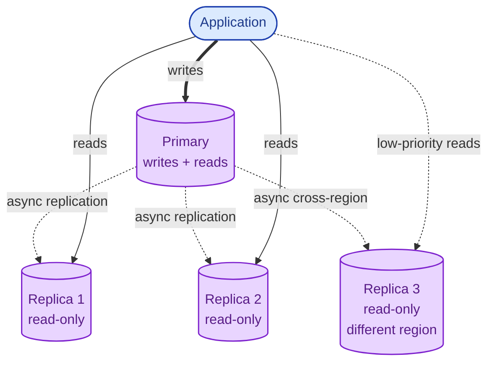
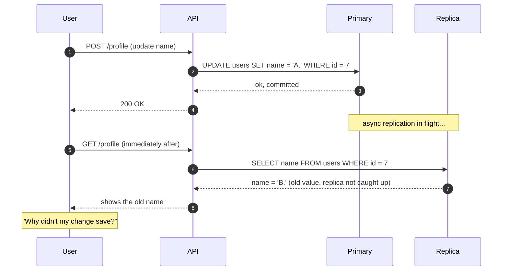
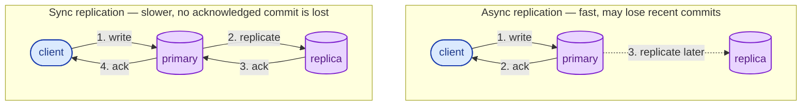

A read replica is a copy of your primary database that you can read from but not write to. Adding replicas is the most common way to scale reads. It is also the most common way to discover the words "replication lag" the hard way. Replicas fix a specific problem; they do not fix every problem people throw at them.

## The setup

One primary database handles all writes. Changes flow to one or more replicas, asynchronously. Reads can hit the primary or any replica.

A modern Postgres or MySQL replicates by shipping the **write-ahead log** to replicas, which replay it. Same logical changes, applied in the same order. The delay between a commit on the primary and the same row being readable on the replica is **replication lag**.

## What read replicas fix

- **Read throughput.** Reads spread across N replicas. Five replicas means roughly 5x the read capacity.
- **Geographic latency.** A replica close to your users serves their reads in 5 ms instead of 80 ms.
- **Analytics isolation.** Heavy reporting queries run on a replica without crushing the primary.
- **Disaster recovery.** A replica in another region is also a backup you can promote if the primary dies.

## What read replicas do not fix

- **Write throughput.** All writes still go to the primary. Replicas do not help here at all.
- **Strong consistency.** A replica may be milliseconds (or seconds) behind. Read your own writes from the primary or you will see your own past.
- **Schema problems.** If the primary is slow because of bad queries, replicas will be too. The same queries get the same plans.
- **The cost.** Five replicas means five times the database hosting bill.

## Replication lag: the gotcha that gets everyone

This is the **read-your-writes** problem. The fix is to route the next-read-after-write back to the primary, often by a session-scoped flag set after writes, or by waiting until the replica confirms it has caught up.

## When sync vs async replication matters

Most replicas are **asynchronous**: the primary commits and tells the client "done" without waiting for replicas to catch up. Fast, but a primary crash before the replica caught up loses those last few transactions.

**Synchronous replication** waits for at least one replica to confirm before the primary acknowledges the commit. Safer for durability, slower for every write.

Most production systems use async with a careful crash-recovery story. Banking and payment systems often use sync for the critical paths.

## When to add a read replica

- Reads are dominating the primary's CPU or I/O.
- You have a heavy analytics or reporting query that does not need to be fresh to the millisecond.
- You have geographically distant users who deserve nearby reads.
- You want a hot standby for failover, not just a cold backup.

## When read replicas are not enough

- Your writes are saturating the primary. Replicas do not help. You need sharding (see [Sharding strategies](/practice/system-design/concepts/012-sharding-strategies/)).
- You need strong read-after-write consistency everywhere. Route those reads to the primary or accept the lag.
- Your queries are slow because of bad indexes or bad joins. Fix those first; replicas only multiply the same problem.

## Two scenarios

**Scenario one: an admin dashboard.**

Marketing wants to run heavy reports against the prod database. Today the prod database slows down when they do. Solution: a dedicated read replica for the analytics workload. The dashboard queries it. Lag of a few minutes is fine for what marketing is asking.

**Scenario two: a user editing their profile.**

User saves their name. The next request to load their profile reads from a replica and gets the old name. Bad UX. Solution: after a write, route that user's reads to the primary for a short window (a few seconds), or until the replica confirms it has applied the write.

## What this connects to

- **CAP theorem.** Async replication is the standard "AP" trade. See [CAP theorem](/practice/system-design/concepts/016-cap-theorem/).
- **Consistency models.** Read-your-writes is the missing guarantee here. See [Consistency models](/practice/system-design/concepts/017-consistency-models/).
- **Sharding strategies.** Replicas scale reads; sharding scales writes. See [Sharding strategies](/practice/system-design/concepts/012-sharding-strategies/).
- **Load balancing.** Reads across replicas are a load-balancing problem too. See [Load balancing algorithms](/practice/system-design/concepts/030-lb-algorithms/).

## Common mistakes

- **Sending freshly written data to a replica to be read.** Read-your-writes will fail and users will doubt your product.
- **Adding replicas to fix a write bottleneck.** They do nothing for writes. Stop reaching for the wrong tool.
- **Ignoring replication lag in monitoring.** A growing lag is a leading indicator of trouble. Page on it.
- **Promoting a replica blindly during a failover.** If the primary crashed and the replica was behind, you lose the unreplicated transactions on promotion. Know your RPO. See [Disaster recovery](/practice/system-design/concepts/050-disaster-recovery/).
- **Forgetting cost.** Replicas double or triple the database bill quickly. Used well, that is fine. Used as a hammer for every problem, it is wasteful.

## Quick recap

- Read replicas scale reads, not writes.
- All writes go to the primary; replicas follow asynchronously.
- Replication lag means a recent write may not be visible on the replica yet. Route read-your-writes to the primary.
- A replica is also a failover candidate and a backup with a continuous heartbeat.

This concept sits in **Stage 2 (Storage and data)** of the [System Design Roadmap](/practice/system-design/roadmap/).
