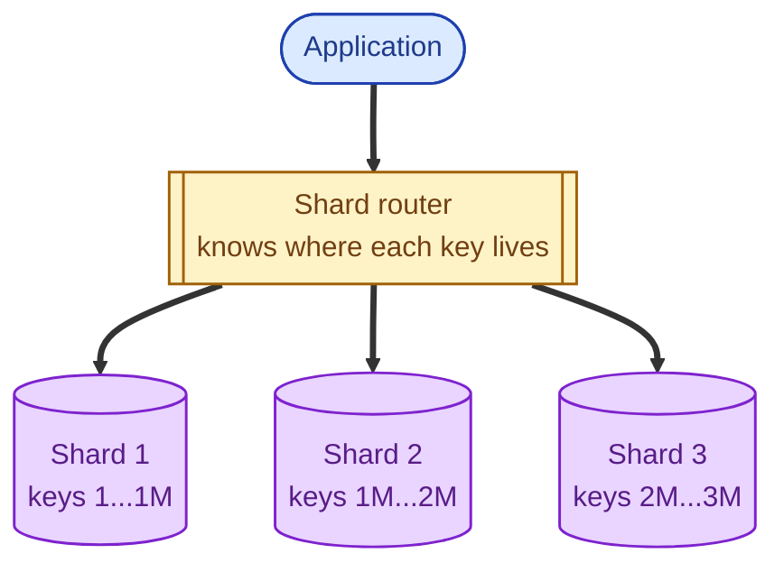
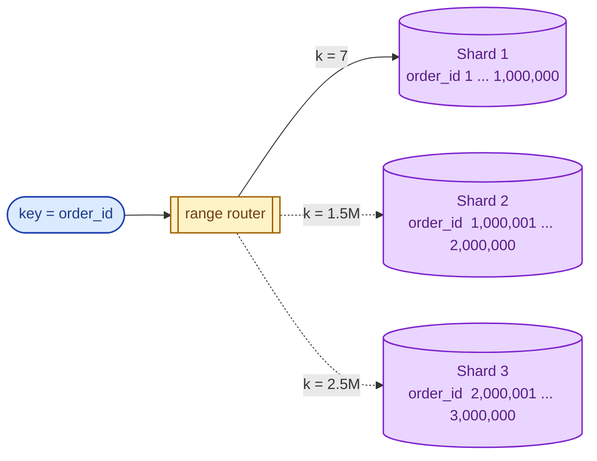
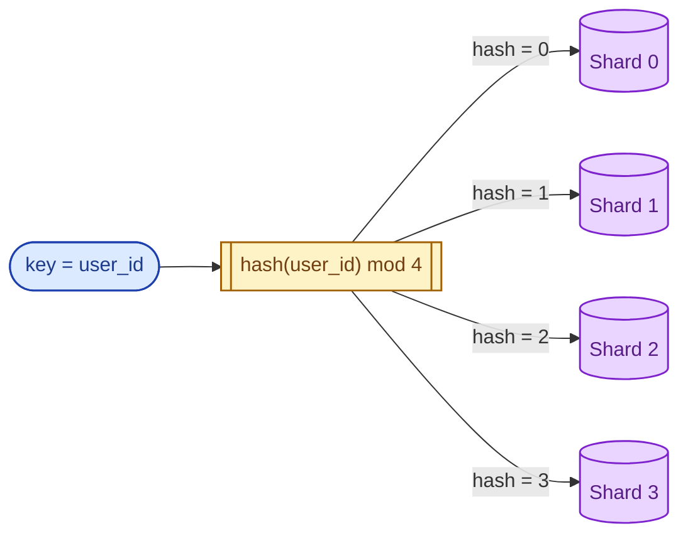
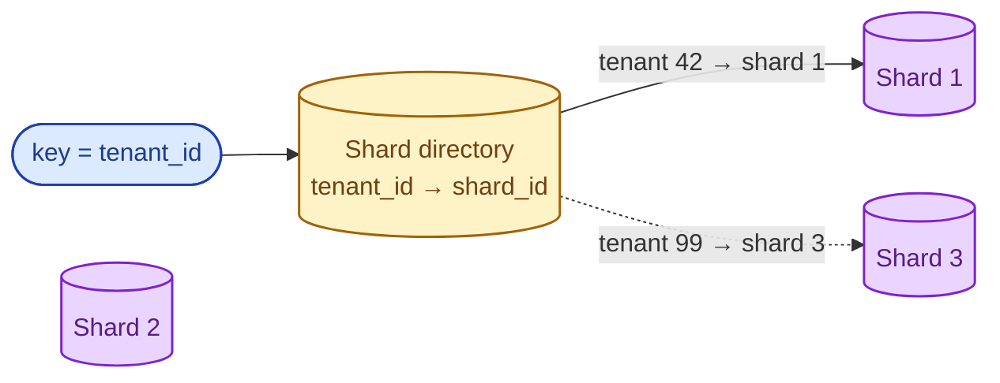
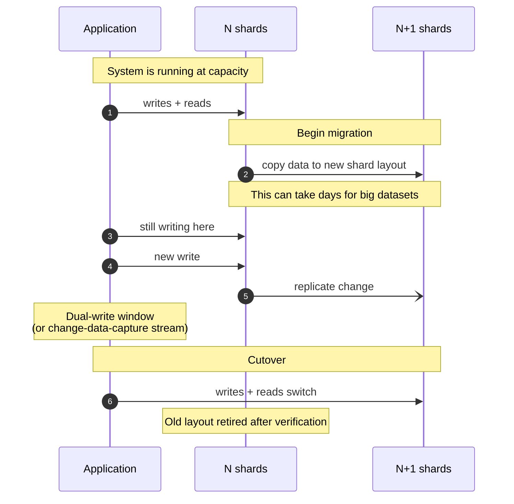

Sharding splits one logical database across many physical machines. Each machine (shard) holds a slice of the data. Sharding scales writes; read replicas alone do not. The choice of how to split (range, hash, or directory) shapes everything: write hot-spots, the cost of resharding, the kinds of queries you can answer cheaply.

## The problem sharding solves

One database server has a ceiling. Memory, CPU, disk I/O, network. You can vertical-scale only so far. Replicas help reads but not writes. Eventually you need to send different rows to different machines and let each handle its own slice.

The router (a library, a proxy, or the database itself) takes a key, decides which shard owns it, and forwards the operation. The three big questions: how does the router decide, what happens when shards fill, and what queries become impossible.

## Range sharding

Pick a partition column (often a timestamp or sequential ID). Each shard owns a contiguous range.

**Strength.** Range scans are trivial: keys 1 to 100,000 are all on one shard.

**Weakness.** Hot shards. If your partition key is a timestamp and you keep getting fresh writes, the newest shard takes all the load while older shards sit idle.

Used by: HBase, some NoSQL stores, and most time-series databases.

## Hash sharding

Compute a hash of the key and use it (or `hash mod N`) to pick a shard. Keys get spread evenly.

**Strength.** Even distribution. No hot shards from sequential keys.

**Weakness.** Range scans are impossible without contacting every shard. And **resharding hurts**: going from 4 shards to 5 with naïve `hash mod N` moves roughly 80% of all data. Consistent hashing fixes most of this, but it is a thing you have to think about.

Used by: Cassandra, DynamoDB, most Redis cluster setups.

## Directory sharding

Keep a lookup table that maps every key (or every range of keys) to a shard. The router asks the directory for each key.

**Strength.** Maximum flexibility. Move a single tenant to its own shard. Rebalance hotspots manually. Common in multi-tenant SaaS where one big customer needs isolation.

**Weakness.** The directory is a critical service. If it goes down, every read fails. It usually needs heavy caching and high availability of its own.

Used by: many homegrown sharding layers, especially for multi-tenant systems.

## The pain that follows: resharding

Going from N to N+1 shards is the part nobody likes to talk about.

This is days or weeks of work, with backups, validation, dual-writes, and rollback plans. The senior question on the day you pick a sharding key is "what does resharding look like when this stops working?" If the answer is "we never thought about it", that is your first technical-debt item.

**Consistent hashing** makes hash-shard rebalancing much less painful: only `1/N` of the data moves when adding a new shard, not `(N-1)/N`. This is why every modern hash-sharded system uses it.

## When to pick which

- **Range** if you need fast range scans and your write rate is not naturally concentrated at one end of the range. Time-series often picks range with a salt to avoid hot-spotting.
- **Hash** if writes are uniformly distributed and you do not need range scans. Most user-keyed systems.
- **Directory** if you have multi-tenant isolation needs, or if you want manual control over which key lives where.

## Three scenarios

**Scenario one: a SaaS with thousands of tenants, one of them huge.**

That one tenant uses 60% of all activity. Hash or range sharding will give them a noisy-neighbour problem. Directory sharding lets you put the big customer alone on their own shards and keep everyone else on the shared pool.

**Scenario two: a clickstream events table.**

A trillion rows. Reads are mostly "give me this user's events in the last 30 days." Hash on user_id. Cassandra handles this with one configuration line, and writes spread evenly.

**Scenario three: time-series sensor data.**

Range partition by time (one shard per week or month), with a hash prefix to avoid the "newest shard is always hot" problem. This is what almost every time-series database does internally.

## What this connects to

- **Read replicas.** Shards solve write scaling, replicas solve read scaling. You usually want both. See [Read replicas](/practice/system-design/concepts/011-read-replicas/).
- **Consistent hashing.** The reason hash-sharded systems are tolerable to resharding. See [Load balancing algorithms](/practice/system-design/concepts/030-lb-algorithms/).
- **CAP theorem.** Sharding gives you partition tolerance by construction. Consistency across shards is the hard part. See [CAP theorem](/practice/system-design/concepts/016-cap-theorem/).
- **Distributed transactions.** Multi-shard updates are no longer one-database transactions. See [Two-phase commit vs sagas](/practice/system-design/concepts/020-2pc-vs-sagas/).

## Common mistakes

- **Sharding by something that does not match the read pattern.** If you shard by user but most queries are by product, every query has to fan out to every shard.
- **Sharding too early.** Sharding is operationally painful. Most teams can postpone it for years with replicas, caching, and vertical scaling. Postpone it as long as the math allows.
- **Sharding without thinking about cross-shard queries.** Aggregates, joins, distinct counts. Each one becomes a scatter-gather. Some of these become so slow that you need an analytics store on the side.
- **Forgetting about hot shards.** Even a hash shard can be hot if one key gets 90% of the traffic (a viral video, a celebrity account). Watch per-shard load, not just totals.
- **Picking a sharding key that you cannot change.** Once chosen, changing it is essentially "migrate to a new database." Choose like it is forever.

## Quick recap

- Sharding splits writes; replicas spread reads.
- Range: range scans easy, hot shards possible.
- Hash: even distribution, no range scans, resharding hurts (consistent hashing helps a lot).
- Directory: flexible, multi-tenant friendly, directory becomes critical infra.
- Plan the resharding story on day one, before you ship the first shard.

This concept sits in **Stage 2 (Storage and data)** and resurfaces in **Stage 4 (Scaling and reliability)** of the [System Design Roadmap](/practice/system-design/roadmap/).
