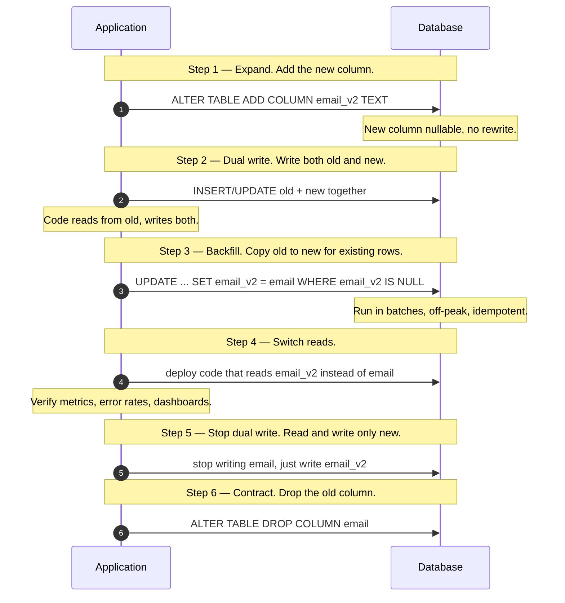
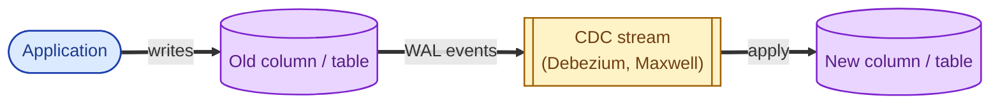

You want to rename a column on a 200 GB table. The naive approach is to take the system down, run `ALTER TABLE`, and bring it back up. On a small system that is a 5-minute outage. On a big system it is hours of downtime no one will let you schedule. The way to ship schema changes safely is to never lock the table at all: deploy the change as a series of small, reversible steps where the application stays up the entire time.

## The pattern: expand and contract

Every safe schema change follows the same shape. Add the new thing, write to both for a while, switch the readers over, then remove the old thing.

Each step is one deploy. Between steps, both versions of the code (old and new) can run side by side. That is the whole point: you can roll back any single step without a hot fix.

## Why the naive approach hurts

```mermaid
flowchart TB
    subgraph BAD["The dangerous one-step migration"]
        direction LR
        A1["deploy new code"]:::client
        A2["ALTER TABLE<br/>RENAME email<br/>TO email_v2"]:::infra
        A3[("Table locked<br/>for minutes or hours")]:::dead
        A1 --> A2 --> A3
    end

    subgraph GOOD["Expand and contract"]
        direction LR
        B1["ADD COLUMN"]:::ok
        B2["dual write"]:::ok
        B3["backfill"]:::ok
        B4["switch reads"]:::ok
        B5["stop dual write"]:::ok
        B6["DROP COLUMN"]:::ok
        B1 --> B2 --> B3 --> B4 --> B5 --> B6
    end

    classDef client fill:#dbeafe,stroke:#1e40af,color:#1e3a8a,stroke-width:1.5px
    classDef infra fill:#fef3c7,stroke:#a16207,color:#713f12,stroke-width:1.5px
    classDef dead fill:#fecaca,stroke:#b91c1c,color:#7f1d1d,stroke-width:1.5px
    classDef ok fill:#dcfce7,stroke:#15803d,color:#14532d,stroke-width:1.5px
```

`RENAME` is the most-cited example but the same applies to: changing a column type, splitting a table in two, merging two columns, dropping NOT NULL, adding NOT NULL, adding a foreign key. Anything that locks a big table for the duration of the change is something users will notice.

## The change-data-capture variant

For very large tables or zero-tolerance windows, replace the application-level dual write with a **change-data-capture (CDC)** stream. The application keeps writing to the old column; a CDC pipeline mirrors every change into the new column in near real time. Cleaner separation, but more infrastructure.

This is how big migrations of partitioned tables, sharded clusters, or whole-database moves are usually done.

## When you really cannot avoid downtime

- Changing a primary key on a huge table.
- Cross-database moves where transactions matter.
- Adding NOT NULL on a column with billions of nulls (you can backfill first, but the final lock is short).

Even here, you minimise: announce the window, plan rollbacks, and rehearse the cutover in a staging environment.

## Two scenarios

**Scenario one: renaming a column on a hot table.**

Users table. 100 million rows. You want to rename `email` to `email_address`. Six deploys (add column, dual write, backfill, switch reads, stop old write, drop column). Each deploy is small, reversible, and ships behind a feature flag. Total elapsed time across one or two weeks. Zero downtime.

**Scenario two: changing a column type.**

`amount` is INT (cents); you need DECIMAL (for fractional cents and bigger numbers). Same pattern: add `amount_v2 DECIMAL`. Dual write with conversion. Backfill in batches with idempotent UPDATE. Switch readers. Drop the old column.

## What this connects to

- **Read replicas.** During a migration you want the replica to be caught up before you cut over. Watch replication lag. See [Read replicas](/practice/system-design/concepts/011-read-replicas/).
- **Idempotency.** Backfills get retried, replayed, and resumed. They must be safe to run twice. See [Idempotency](/practice/system-design/concepts/021-idempotency/).
- **Indexes.** Creating a new index also blocks writes unless you use `CREATE INDEX CONCURRENTLY` (Postgres) or equivalent. See [Indexes that help, indexes that hurt](/practice/system-design/concepts/010-indexes-help-and-hurt/).
- **Graceful degradation.** Feature-flag the new reader path so a problem during migration can be turned off without rolling back code. See [Graceful degradation](/practice/system-design/concepts/048-graceful-degradation/).

## Common mistakes

- **Running `ALTER TABLE` directly on a busy table.** In Postgres, even adding a column with a default can rewrite the whole table on older versions. Check the docs for your engine and version.
- **Skipping the dual-write phase.** "It is just a rename, we will do it in one deploy" lasts until the deploy is half rolled out and old pods are writing to a column that no longer exists.
- **Backfilling in one huge transaction.** Long transactions hold locks and block other work. Backfills must be batched and idempotent: 1,000 rows per batch, a small sleep between batches.
- **Forgetting the read path.** Switching writes is half the work. Readers need to be updated too, and there is often a delay between the two changes.
- **No rollback plan.** Each step should be independently reversible. If step 4 introduces a regression, you must be able to roll back to step 3 without a new migration.
- **Migrating data without a verification step.** After backfill, run a count and a checksum comparison. Without that, drift goes undetected for months.

## Quick recap

- Never lock a big table in production. Decompose every change into "expand, dual write, backfill, switch, contract."
- Each step is its own deploy, behind a feature flag, independently reversible.
- For very large or sensitive tables, use a CDC stream instead of application-level dual writes.
- Backfills must be batched, idempotent, and verified.
- The senior question on any migration: "what is the rollback plan for each step?"

This concept sits in **Stage 2 (Storage and data)** of the [System Design Roadmap](/practice/system-design/roadmap/).
