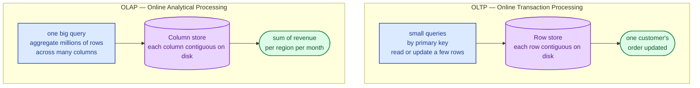
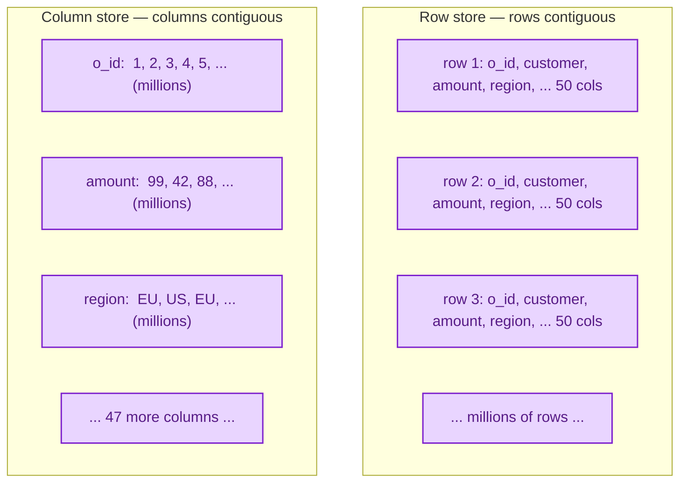
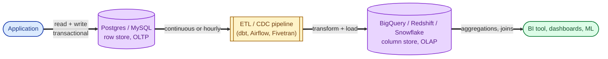

OLTP is the database your application talks to: lots of small transactions, look up a row by id, update a few fields, commit. OLAP is the database analysts talk to: few queries, but each one reads millions of rows and aggregates them. The two workloads want the data laid out differently on disk. Trying to do both on one database is the most common avoidable performance problem in production.

## The two workloads

OLTP: many fast queries that each touch a tiny slice. OLAP: fewer queries that each touch a huge slice but only a few columns.

## Why the disk layout matters

Imagine a `sales` table with 50 columns. An OLTP query says "get this one order, all 50 columns." An OLAP query says "sum revenue across 100 million orders." Same data; very different access patterns.

Reading **one whole row**: row store wins (one disk read).

Reading **one column across millions of rows**: column store wins by orders of magnitude. You only read the column you need, not the other 49. Compression is also dramatically better because adjacent values in a column are similar.

That single layout choice is why a Redshift or BigQuery query can scan billions of rows in seconds, and why running the same query against Postgres would never finish.

## The standard architecture

In a mature system, OLTP and OLAP are two databases, and a pipeline copies data from one to the other.

The OLTP database stays clean. Heavy analytics queries do not slow the application down. The data warehouse is shaped (denormalised, partitioned, columnar) for the kind of queries analysts actually run.

## OLTP characteristics

- Small queries, often by primary key.
- High concurrency: thousands of short-lived transactions per second.
- ACID guarantees matter. See [ACID vs BASE](/practice/system-design/concepts/007-acid-vs-base/).
- Highly normalised. See [Normalization vs denormalization](/practice/system-design/concepts/008-normalization-vs-denormalization/).
- Examples: Postgres, MySQL, Oracle, SQL Server, DynamoDB.

## OLAP characteristics

- Few queries, but each scans millions or billions of rows.
- Lower concurrency, queries from minutes to hours allowed.
- Eventual consistency is fine (the data is yesterday's anyway).
- Denormalised. Star schemas, wide tables, columnar storage.
- Examples: BigQuery, Snowflake, Redshift, ClickHouse, DuckDB, Apache Druid.

## When to keep them on one database

- The product is young and the data is small (under a few million rows).
- Analytics is occasional and not on the critical path.
- The team has one database engineer, not two.

A single Postgres handles a surprising amount of analytics today, especially with extensions like `pg_stat_statements`, materialised views, and dedicated read replicas for reporting. Splitting too early adds operational overhead.

## When to split

- Analytics queries are slowing the production database.
- The data warehouse needs data from multiple sources, not just one app database.
- Reporting is mission-critical and needs its own SLAs.
- The data has grown to where columnar storage and parallel query become essential, not optional.

## Two scenarios

**Scenario one: a startup at 100k users.**

One Postgres handles everything. A nightly job creates aggregated views into a `metrics` schema. The marketing dashboard reads those views. No separate warehouse needed yet. The team focuses on product, not data infrastructure.

**Scenario two: a fintech at 10M users.**

Postgres is the source of truth for transactions. Every change flows through a CDC stream into BigQuery. Dashboards, ML features, and regulatory reports all run from BigQuery, which has access to historical data Postgres no longer keeps online. Same source data, two stores, each shaped for its job.

## What this connects to

- **Normalisation vs denormalisation.** OLTP is normalised; OLAP is denormalised. See [Normalization vs denormalization](/practice/system-design/concepts/008-normalization-vs-denormalization/).
- **B-tree vs LSM.** B-tree dominates OLTP; column stores and LSM-derived formats dominate OLAP. See [B-tree vs LSM tree](/practice/system-design/concepts/009-b-tree-vs-lsm-tree/).
- **Time-series databases.** A specialised OLAP shape for time-keyed data. See [Time-series databases](/practice/system-design/concepts/015-time-series-databases/).
- **Sharding strategies.** OLAP warehouses are usually sharded internally; the user does not see it. See [Sharding strategies](/practice/system-design/concepts/012-sharding-strategies/).

## Common mistakes

- **Running heavy analytics directly on the OLTP database.** Long-running queries hold locks and CPU. Users feel it as latency spikes. Move the analytics to a replica at minimum, ideally to a separate warehouse.
- **Picking the wrong store for the workload.** Loading a billion rows into Postgres and expecting fast aggregations is wishful thinking. Same data in BigQuery is seconds.
- **Splitting too early.** Adding a warehouse before you need one is overhead. Wait until pain is real.
- **Forgetting freshness expectations.** Warehouse data is usually hours behind. If a dashboard claims to be real-time and is not, users will not trust it. Be explicit about staleness.
- **Treating the warehouse as a backup.** It is not. It is shaped for analytics and may discard or transform data. Keep proper backups separately. See [Replication vs backup](/practice/system-design/concepts/049-replication-vs-backup/).

## Quick recap

- OLTP: many small transactional queries, row store, normalised, ACID.
- OLAP: few huge aggregation queries, column store, denormalised, eventual consistency fine.
- Real systems use both, with a pipeline that copies data from OLTP to OLAP.
- Split when analytics queries hurt the app, not before.

This concept sits in **Stage 2 (Storage and data)** of the [System Design Roadmap](/practice/system-design/roadmap/).
