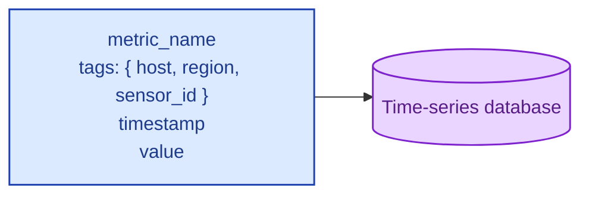
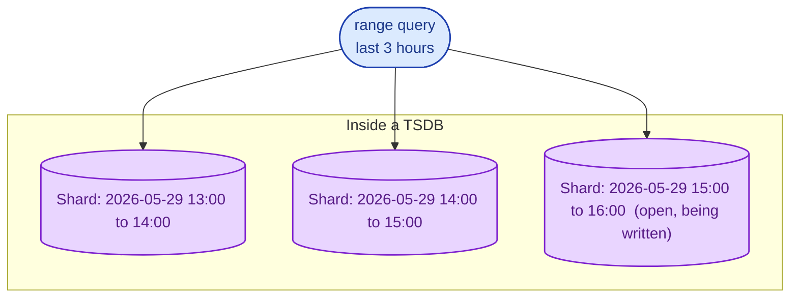
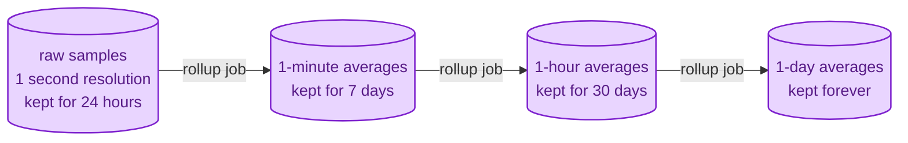

A time-series database (TSDB) is a database that specialises in one access pattern: data keyed by time, written in order, queried by time range, often downsampled. Metrics, IoT sensor data, financial ticks, logs. You can store time-series in Postgres, and many teams do successfully. A real TSDB starts to pay off at the volumes where Postgres would force you to manually do everything a TSDB ships with.

## The shape of the data

Time-series data has properties that general databases do not optimise for:

- **Append-only.** New writes always have a later timestamp than older ones. No random updates of historical rows.
- **Time-ordered.** Queries are almost always "give me this metric for this time range."
- **High write volume.** Hundreds of thousands to millions of points per second is normal.
- **Compression-friendly.** Adjacent samples are similar; the same sensor reads similar values most of the time.
- **Downsampling.** Raw data at 1-second granularity gets aggregated to 1-minute, 1-hour, and 1-day rollups for older periods.

One sample is a tiny record. A real workload sends billions per day.

## How a TSDB stores it

Most TSDBs partition by time. Each shard owns a window (an hour, a day). Inside the shard, samples are stored sorted by series and timestamp, in columnar blocks that compress well.

This is why range queries are fast: the engine touches a small number of contiguous shards. Writes are fast because they always go to one shard (the current one). Deletes of old data are also fast: drop the whole shard.

## Downsampling and retention

Storage and query cost grow with how much fine-grained data you keep. TSDBs ship with the answer: roll older data up to coarser buckets and throw the raw away.

A dashboard zoomed in on "the last hour" reads raw 1-second data. A dashboard zoomed out to "the last six months" reads pre-aggregated 1-hour data. Same dashboard code, very different cost.

## When you actually need a TSDB

- You are ingesting hundreds of thousands of samples per second, or more.
- Your queries are time-range, group-by-tag, aggregate-over-window.
- You care about retention windows and data older than a few months becomes a cost question.
- You want downsampling and rollups as a feature, not as a homegrown system.

## When Postgres is fine

- You have under a million samples per day.
- Queries are mostly "give me the current value" or "the last 24 hours."
- You already have Postgres for everything else, and the operational simplicity of one database wins.
- The TimescaleDB extension turns Postgres into a competent TSDB without giving up SQL or transactions.

## Three scenarios

**Scenario one: an IoT platform with 100,000 devices, each sending 10 samples per second.**

That is 1 million samples per second. Postgres alone is not the right tool. InfluxDB, TimescaleDB, or QuestDB will handle this comfortably with downsampling for older windows.

**Scenario two: a stock ticker.**

Microsecond timestamps, billions of points per day, complex aggregations across symbols and intervals. ClickHouse or kdb+ territory. Specialised TSDBs are the only path to acceptable query latency.

**Scenario three: a SaaS product tracking user activity.**

Tens of thousands of events per second. Postgres with TimescaleDB or Citus, partitioned by day, is more than enough. You get SQL, transactions, joins to the rest of your data, and easy operations. Save the dedicated TSDB for when this stops being enough.

## What this connects to

- **OLTP vs OLAP.** TSDBs are a specialised OLAP shape: column-store-like, optimised for aggregations. See [OLTP vs OLAP](/practice/system-design/concepts/014-oltp-vs-olap/).
- **LSM trees.** Most TSDBs use LSM-derived storage; writes are append-only by definition. See [B-tree vs LSM tree](/practice/system-design/concepts/009-b-tree-vs-lsm-tree/).
- **Sharding.** TSDBs shard by time by default. See [Sharding strategies](/practice/system-design/concepts/012-sharding-strategies/).
- **Storage tiers.** Older time-series data is a natural fit for cold storage. See [Hot, warm, cold storage tiers](/practice/system-design/concepts/044-storage-tiers/).

## Common mistakes

- **Putting time-series in a row store with no plan.** Postgres handles millions, not billions. The day you outgrow it is the day you find out the hard way if you have not planned.
- **No downsampling.** Storing every 1-second sample forever scales linearly with time and bankrupts you eventually. Decide retention windows up front.
- **Treating a TSDB as a general database.** TSDBs are bad at joins, transactional updates, and arbitrary queries. They are great at exactly one shape of workload.
- **Forgetting the cardinality explosion.** "Tags" sound free but each unique combination of tags is its own series. Putting user_id as a tag on a metric can produce millions of series and overwhelm the database.
- **No tag schema discipline.** Different teams add tags freely until the database falls over. Define the tags up front, like a schema.

## Quick recap

- A TSDB is a database tuned for one access pattern: time-keyed, append-only, range-queried, often aggregated.
- It earns its keep at high ingest rates with retention and downsampling as first-class features.
- For smaller volumes or mixed workloads, Postgres (often with TimescaleDB) is usually the right call.
- Watch cardinality. The number of unique series often matters more than the number of samples.

This concept sits in **Stage 2 (Storage and data)** of the [System Design Roadmap](/practice/system-design/roadmap/).
