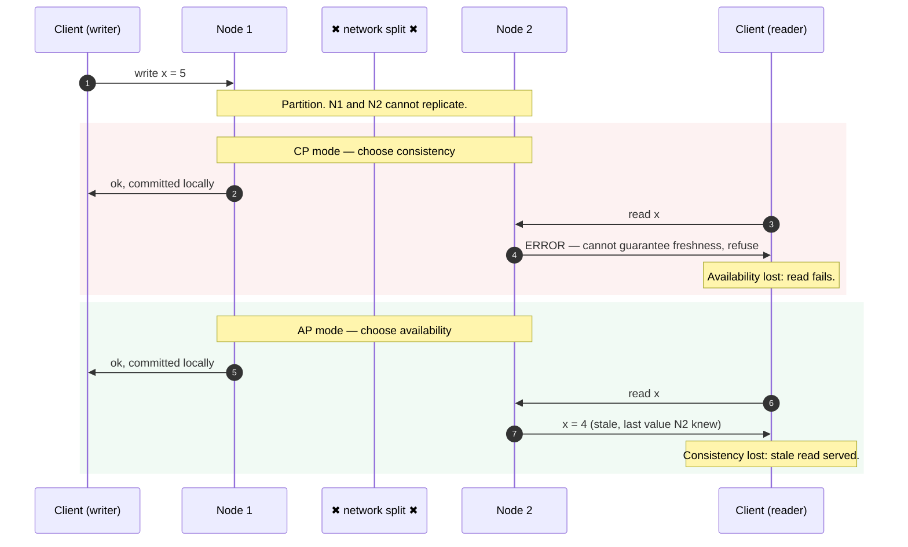
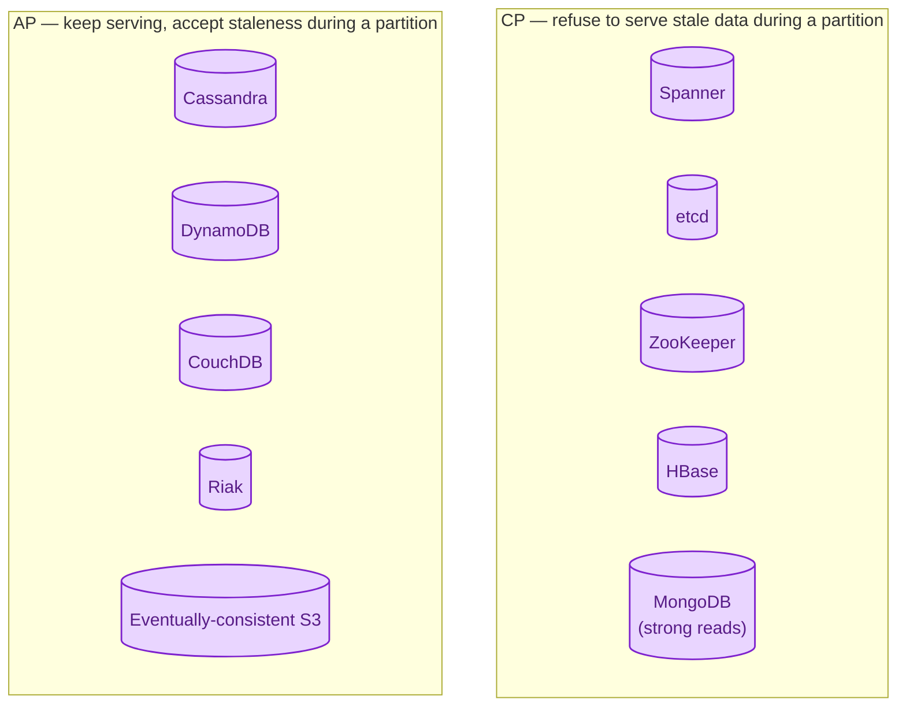
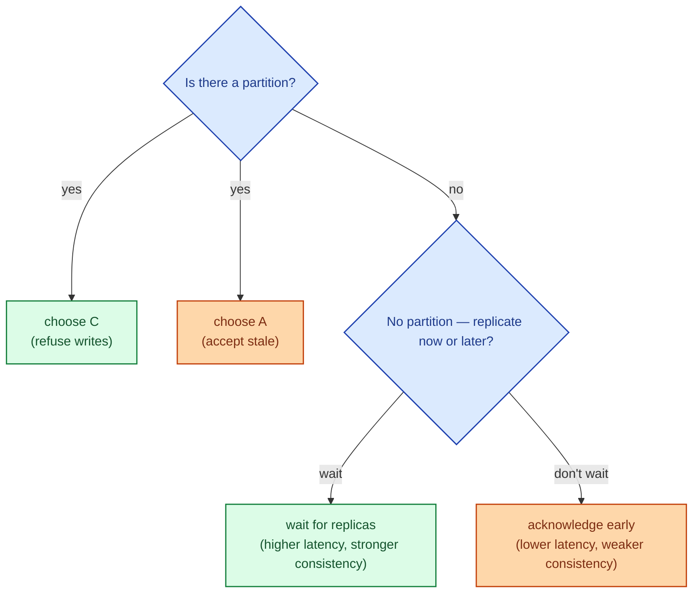

CAP says that in a distributed system, when the network between nodes is broken (a partition), you have to pick one: keep serving consistent reads (and refuse some requests), or stay available (and serve possibly stale data). It does **not** say "pick two of three" all the time. The interesting choice only shows up during a partition. The rest of the time, you get all three.

## What the three letters mean

- **C — Consistency.** Every read sees the most recent write, or fails. This is "linearisability", not the C in ACID.
- **A — Availability.** Every request gets a response. Maybe not the freshest data, but a response.
- **P — Partition tolerance.** The system keeps running when messages between nodes are dropped or delayed.

In a real distributed system, partitions happen. Therefore P is not optional. The real choice is **C or A, when P happens.**

## The picture during a partition

Imagine two nodes that can no longer talk. A client wants to write to one and read from the other.

Same partition, same write, two products, two different behaviours. Both are legitimate engineering decisions. The mistake is not knowing which one your database chose.

## Picking C or A: examples

These choices are not absolute. Many databases let you tune per-request: Cassandra has consistency levels per query; DynamoDB has eventual or strongly consistent reads. But the **default** behaviour reveals the underlying model.

## PACELC: the more useful version

CAP only describes behaviour during a partition. The PACELC extension also describes the rest of the time:

> **If P** then **C or A**, **else** trade **L** (latency) or **C** (consistency).

Even without a partition, replicating a write across nodes takes time. You either wait (paying latency) or return early (paying consistency).

PACELC is the version worth carrying around. It maps to real product trade-offs in the 99.9% of the time when nothing is broken.

## When CP wins

- Money. Inventory. Voting. Anything where a wrong answer is worse than no answer.
- Coordination systems (etcd, ZooKeeper). They are the brain of larger systems; they need to be right or admit they cannot.
- Configuration stores that other services depend on for correctness.

## When AP wins

- User-facing reads where staleness is fine for a second (feeds, dashboards, like counts).
- Globally distributed systems where blocking on cross-region replication would add hundreds of milliseconds per write.
- Edge or mobile sync where availability matters more than freshness.

## Two scenarios

**Scenario one: a global product catalog.**

Users in five regions browse the catalog. A price changes. Do you refuse reads in regions where the new price hasn't replicated, or serve the old price for a few seconds? AP, every time. A slightly stale price for 200 ms costs nothing; a "service unavailable" costs sales.

**Scenario two: an inventory system at the same company.**

When a user clicks "buy the last one", the system has to know if it really is the last one. AP would allow two users in different regions to both succeed and oversell. CP refuses one of them. This is the right call even if it costs availability for a few seconds during a regional partition.

These two systems live at the same company, in the same engineering team, and pick differently. CAP is per workload, not per company.

## What this connects to

- **ACID vs BASE.** BASE systems usually pick AP. ACID systems usually pick CP. See [ACID vs BASE](/practice/system-design/concepts/007-acid-vs-base/).
- **Consistency models.** "Consistency" in CAP is the strictest model; weaker ones are useful. See [Strong, eventual, causal consistency](/practice/system-design/concepts/017-consistency-models/).
- **Consensus.** CP systems usually run a consensus protocol underneath. See [Consensus: Raft and Paxos](/practice/system-design/concepts/018-consensus-raft-paxos/).
- **Read replicas.** Async replication is the everyday-PACELC choice you already make. See [Read replicas](/practice/system-design/concepts/011-read-replicas/).

## Common mistakes

- **"Pick two of three."** Not how it works. P is not optional in a distributed system, so the real choice is C or A under partition.
- **Treating CAP as a static property of a database.** Many databases let you choose per request. Use the dial; do not pretend it does not exist.
- **Assuming "eventually consistent" means "consistent in a few milliseconds."** It can be minutes during a real partition.
- **Picking AP because "it scales."** AP systems scale because they relax consistency, not because they are magic. If your workload needs C, you pay the cost of C.
- **Forgetting the EL part of PACELC.** Even in a healthy network, the latency-vs-consistency trade is happening all day. Knowing your default is a senior-level concern.

## Quick recap

- CAP is about behaviour during a network partition: keep C or keep A, never both.
- P is not a choice in a distributed system; partitions happen.
- PACELC adds the everyday case: latency vs consistency when there is no partition.
- The right choice is per workload, not per company. Most large systems have both CP and AP components.

This concept sits in **Stage 5 (Distributed systems hard parts)** of the [System Design Roadmap](/practice/system-design/roadmap/).
