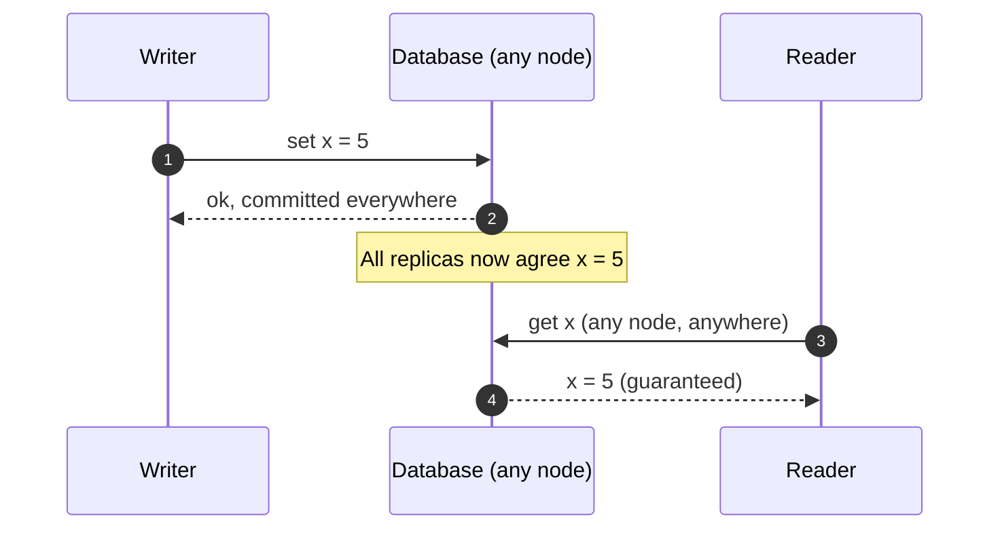
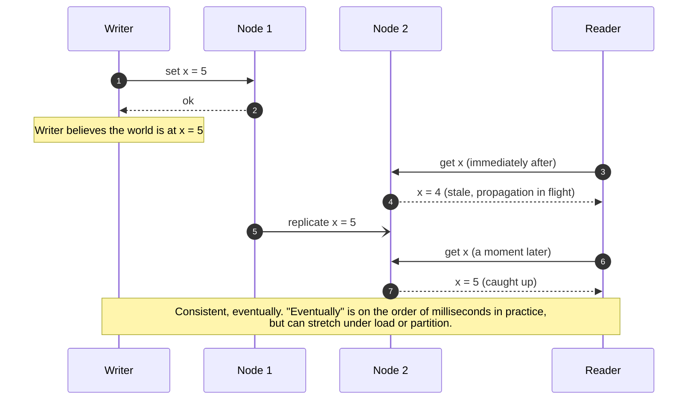
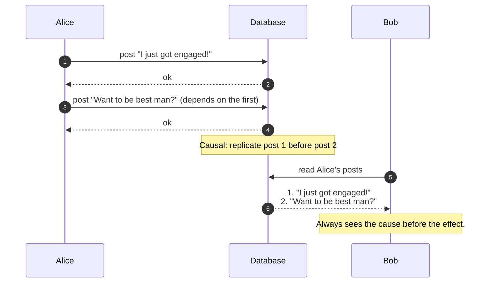
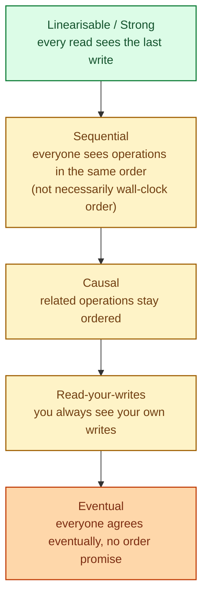

"Consistent" is not one thing. It is a sliding scale of guarantees about what a reader is allowed to see after a writer made a change. Strong consistency is the strictest: every read returns the most recent committed write. Eventual is the loosest: reads will catch up eventually. Causal sits in the middle and turns out to be the one most apps actually want.

## Strong consistency: reads always reflect the latest write

Every read returns the value of the most recent successful write, no matter which node serves it. From the outside, the database looks like a single node, even when it is many.

This is what a single-node Postgres feels like. Once you commit, every later read sees it. The cost in a distributed system: the database has to coordinate across nodes before acknowledging the write. That coordination eats latency and, under partition, eats availability. See [CAP theorem](/practice/system-design/concepts/016-cap-theorem/).

Where you find it: Spanner, etcd, ZooKeeper, single-leader databases with synchronous replication.

## Eventual consistency: reads catch up, eventually

A write returns success after one node has it. Other nodes catch up in the background. For a brief window, different readers may see different values.

This is the model behind Cassandra, DynamoDB, and most CDNs. The win: high write throughput, regional independence, partition tolerance. The cost: the reader's view of reality can lag behind the writer's.

## Causal consistency: order is preserved for related operations

Often the bug is not "stale data" but "out of order data." Causal consistency promises: if operation B causally depends on operation A, no reader will ever see B without A.

Eventual consistency would let Bob see the second post before the first, which would be very confusing. Causal consistency tracks the dependencies and never delivers the effect without the cause.

This is the model people **actually want** in most user-facing apps and rarely get explicitly: chat, comments, social posts, threaded discussions.

## The hierarchy

The stricter the model, the more coordination it costs. Most production systems pick **causal + read-your-writes** for user-facing reads and **eventual** for background data. Strong is reserved for the operations where a wrong answer is unacceptable.

## When to pick which

**Strong** when the cost of a wrong read is high: money, inventory, locks, configuration, leader election.

**Eventual** when the cost of a wrong read is low and the cost of waiting is high: feeds, dashboards, like counts, recommendations, search indexes.

**Causal** when the data has internal cause-and-effect: chat, comments, social, notifications, anything where ordering matters even though absolute freshness does not.

**Read-your-writes** for any session in which a user just made a change: profile edits, settings changes, cart updates.

## Three scenarios

**Scenario one: a chat app.**

You send "see you at 7." Then you send "actually 8." Your friend should never see "actually 8" without first seeing "see you at 7." Eventual is too weak. Causal is exactly right and is what most chat databases implement under the hood.

**Scenario two: a feature flag service.**

Roll out a flag to 1% of users. The flag value must be the same for the entire decision path of one request. Strong (or near-strong with versioned reads) inside the request; eventual across regions is fine because flags do not change every second.

**Scenario three: a video like counter.**

Two users in different regions like the same video at the same time. Both see "5,000 likes" before, "5,001 likes" after. They might briefly disagree by 1. Nobody cares. Pure eventual.

## What this connects to

- **CAP theorem.** Stronger consistency = harder under partition. See [CAP theorem](/practice/system-design/concepts/016-cap-theorem/).
- **Read replicas.** Eventual is what async replication delivers by default. See [Read replicas](/practice/system-design/concepts/011-read-replicas/).
- **Consensus.** Strong consistency in a distributed system is built on a consensus protocol underneath. See [Consensus: Raft and Paxos](/practice/system-design/concepts/018-consensus-raft-paxos/).
- **Time and ordering.** Causal consistency is built on tracking "happened-before". See [Time, clocks, and ordering](/practice/system-design/concepts/022-time-clocks-ordering/).

## Common mistakes

- **Defaulting to strong without measuring the cost.** Strong consistency means coordination on every write. On a global cluster this is a heavy tax.
- **Using eventual where causal is needed.** Out-of-order user-facing reads ("the reply showed up before the original post") are far worse UX than a small delay.
- **Treating "eventual" as "fast."** Eventual just means "we promise it will converge." It does not promise when.
- **Mixing models in one path without thinking.** Writing with strong consistency and reading from an eventual replica gets you the worst of both worlds.
- **Forgetting read-your-writes is its own model.** A user who edits their name and reloads should see their new name, no exceptions. Implement it explicitly.

## Quick recap

- Strong: every read sees the latest write, expensive in a distributed system.
- Eventual: replicas catch up later, cheap and scalable, brief inconsistency window.
- Causal: respects cause-and-effect ordering; what most user-facing apps actually want.
- Read-your-writes: a session always sees its own changes.
- Real systems pick per workload, not per database.

This concept sits in **Stage 5 (Distributed systems hard parts)** of the [System Design Roadmap](/practice/system-design/roadmap/).
