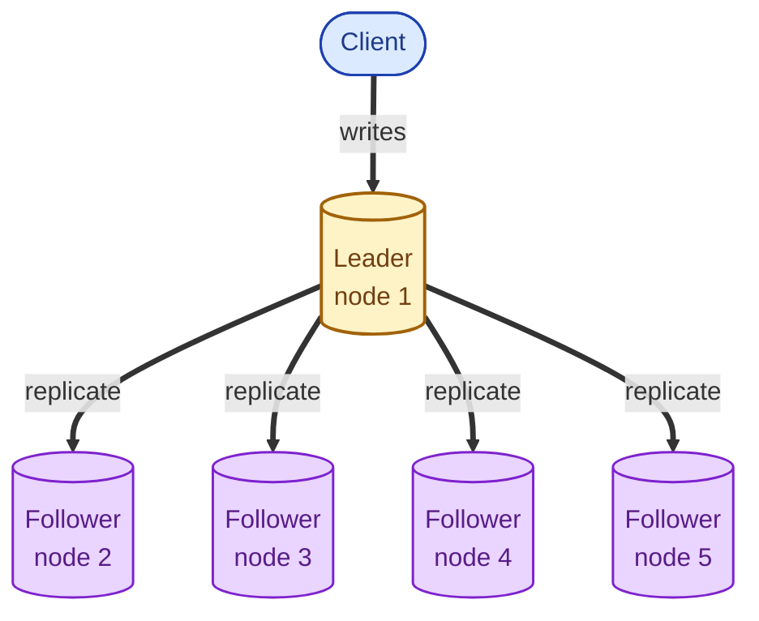
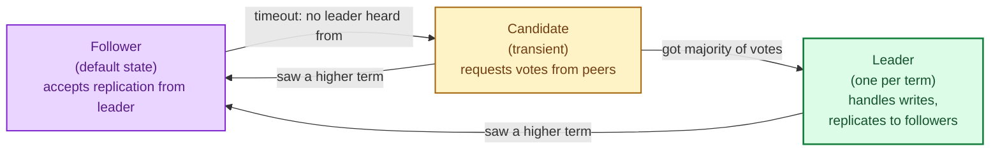
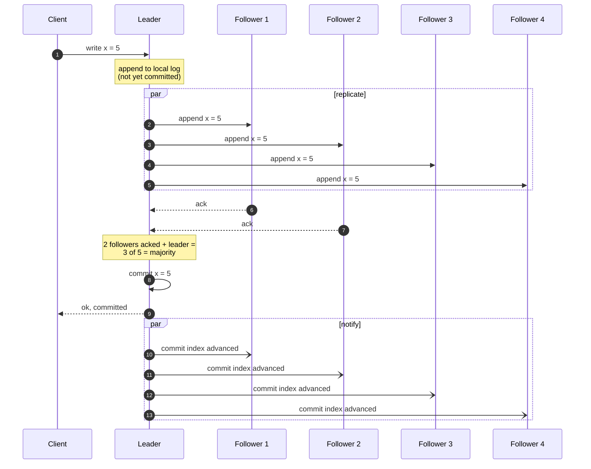
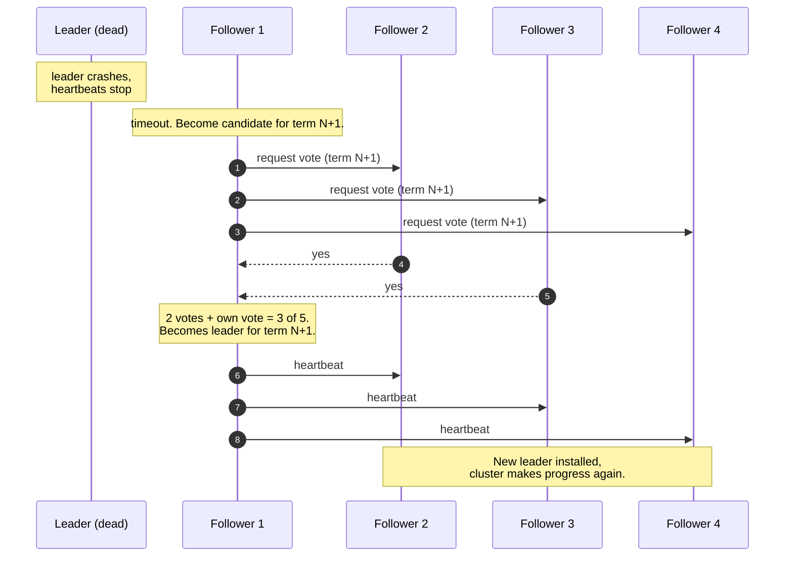
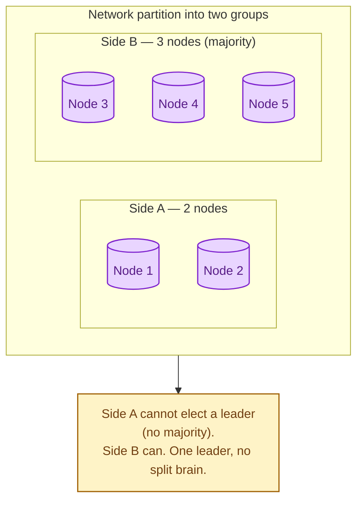

Consensus is how a group of computers agree on a single value when none of them can be fully trusted to be alive and reachable. Paxos was the first famous algorithm; Raft was designed later to be easier to understand. They solve the same problem and ship in almost everything modern: etcd, ZooKeeper, Spanner, Kafka, CockroachDB. You almost never implement consensus yourself. You do need to understand what it gives you and what it costs.

## The problem consensus solves

Five servers. They want to agree on a sequence of operations: "add user 1", "delete user 2", "update user 3", in this order. Any one of them can crash. The network can drop messages. Two of them might be temporarily unreachable.

The naive answer "just have a leader" raises immediate questions. Who is the leader? What if the leader dies? What if two nodes both think they are the leader? Consensus is the answer to all of these.

One leader. All writes go through it. Replication to followers. If the leader dies, the followers elect a new one. If a majority is alive, the cluster keeps making progress. If only a minority can talk to each other, they refuse to act, to prevent split brain.

## Raft: the three states

A Raft node is always in one of three states.

Time is divided into **terms**. Each term has at most one leader. Followers listen for heartbeats from the leader. If a follower goes long enough without hearing a heartbeat, it bumps its term and starts a vote.

## The write path: replicate, then commit

The leader only acknowledges the client **after** a majority of nodes have stored the write. This is what gives Raft its safety: even if the leader crashes the moment after acknowledging, a majority of nodes still have the entry. The next leader will find it and finish committing.

## Leader election: when the current leader dies

Election typically takes hundreds of milliseconds to a few seconds. During that time the cluster cannot accept writes. The trade is well worth it: when a node dies in production, the cluster recovers on its own without paging anyone.

## Why a majority? Why not just two?

A majority guarantees that any two majorities overlap by at least one node. That overlap is what prevents split brain.

This is why consensus systems run with an odd number of nodes (3, 5, 7) and why "we have two data centres" is a famous gotcha. Two equal sides can never form a majority during a partition; you need a tie-breaker (a third witness node) somewhere.

## Paxos vs Raft

Both solve the same problem. The differences:

- **Paxos** (1989) is older and famously hard to understand. It is described in pieces (basic Paxos, multi-Paxos, Fast Paxos) and most implementations are partial.
- **Raft** (2014) was designed explicitly to be teachable. Same guarantees, clearer structure: term-based leader election, append-only log, majority commit.

Most modern systems pick Raft for readability and tooling. Paxos lives on inside older systems (Chubby, Spanner) and in research.

## What you actually use this for

You will almost certainly not write a consensus algorithm. You will use a system that has one inside it:

- **etcd, Consul, ZooKeeper.** Coordination services. Sit underneath Kubernetes, service discovery, distributed locks.
- **CockroachDB, TiDB, YugabyteDB.** Distributed SQL. Raft per shard.
- **Kafka (KRaft mode), Pulsar.** Cluster metadata.
- **Spanner.** Strongly consistent across data centres using TrueTime + Paxos.

When you reach for "I need distributed locks" or "I need a strongly consistent counter" or "I need leader election", you reach for a consensus-backed system. You do not roll your own.

## What this connects to

- **Leader election.** The election machinery from Raft, isolated as a concept. See [Leader election](/practice/system-design/concepts/019-leader-election/).
- **CAP theorem.** Consensus systems are CP under partition. See [CAP theorem](/practice/system-design/concepts/016-cap-theorem/).
- **Strong consistency.** Built on consensus. See [Strong, eventual, causal consistency](/practice/system-design/concepts/017-consistency-models/).
- **Idempotency.** Replicated state machines depend on operations being safe to re-apply. See [Idempotency](/practice/system-design/concepts/021-idempotency/).

## Common mistakes

- **Rolling your own consensus.** Almost certainly wrong. Use etcd, ZooKeeper, or a database that has it inside.
- **Running two-node clusters.** Cannot form a majority during a partition. Always three, five, or seven.
- **Putting the whole cluster in one data centre.** Defeats the point. Spread across availability zones or regions with a tie-breaker.
- **Ignoring election storms.** Misconfigured timeouts can cause repeated elections that freeze the cluster. Defaults are usually right; do not tune blindly.
- **Treating consensus as free.** Every write pays for a round trip to a majority. Across regions, that is 100 ms minimum. Plan for it.

## Quick recap

- Consensus = a group of nodes agreeing on a sequence of operations despite crashes and partitions.
- Raft = the easier-to-explain modern algorithm. Paxos = the older one with the same guarantees.
- One leader per term. Writes need a majority to commit.
- If only a minority can talk, no one acts. This is the price of safety, not a bug.
- You use it via etcd, ZooKeeper, distributed databases, and Kafka. You do not implement it.

This concept sits in **Stage 5 (Distributed systems hard parts)** of the [System Design Roadmap](/practice/system-design/roadmap/).
