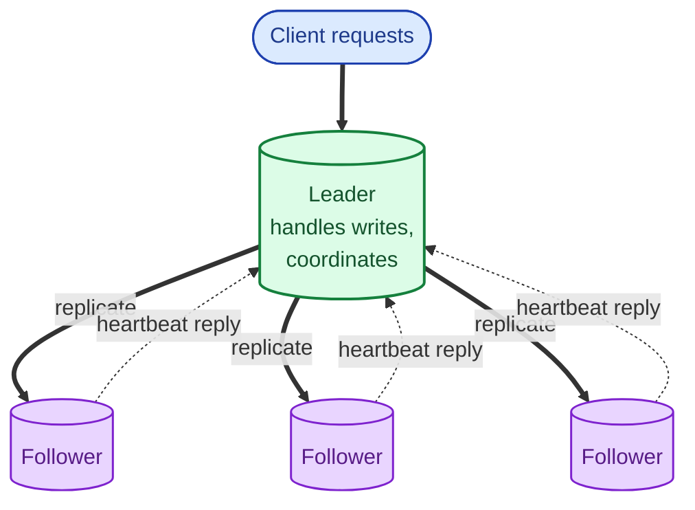
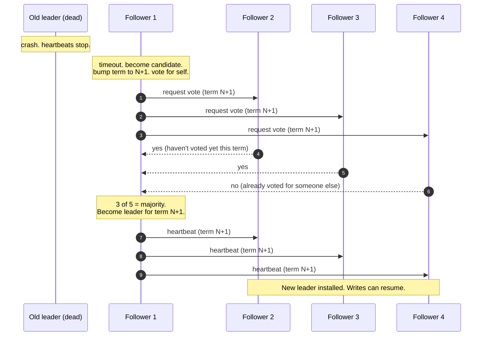
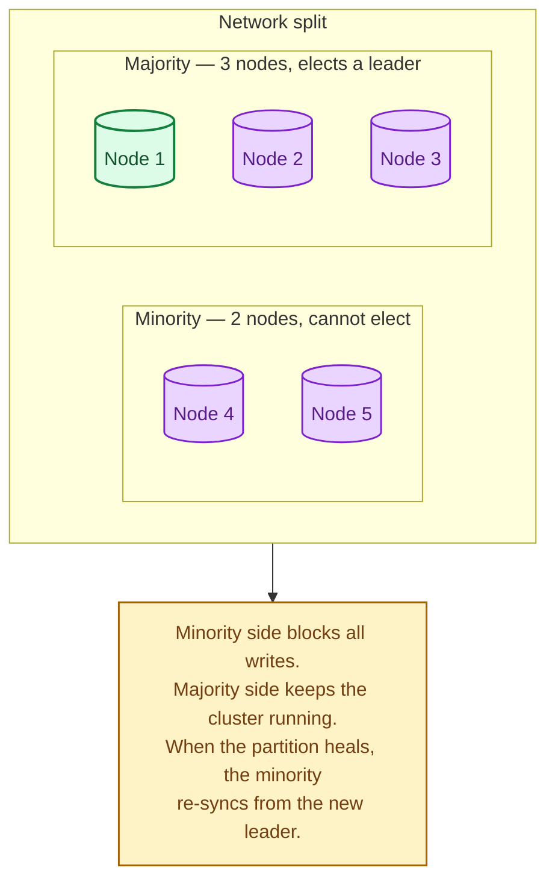

Leader election is how a cluster picks exactly one node to be the boss for some period of time. The leader handles writes, coordinates work, owns a resource, or runs a scheduled job that should only run once. It sounds simple. It is not, because nodes crash, networks split, and two nodes can briefly both believe they are the leader. Every interesting consensus system has a leader election protocol underneath, and most production bugs in this space are about the corner cases.

## Why we need a leader at all

Most distributed problems get much easier when one node owns the decision:

- **Writes go through one place** so the order is unambiguous.
- **A scheduled job runs exactly once** because exactly one node thinks it is the leader.
- **Locks and counters have a single source of truth.**
- **Replication is one-to-many** instead of many-to-many.

The cost is that the leader is a critical node. If it dies, the cluster halts until a new one is chosen. Election speed is therefore a real performance number.

The leader sends heartbeats. Followers respond. If a follower stops hearing heartbeats, it suspects the leader is dead and starts an election.

## The election: how it works in practice

This is the Raft version. Paxos is similar in spirit; ZooKeeper uses its own algorithm called Zab. The mechanics differ; the shape is the same.

Two key rules keep elections safe:

1. **One vote per node per term.** A follower votes "yes" at most once each term. This is what prevents two candidates from both winning.
2. **Majority required to win.** A candidate needs more than half the cluster to vote for it. This rules out the split-brain case where two halves of a partition both elect a leader.

## What happens during a partition

A partition splits the cluster. The minority side cannot form a majority, so it cannot elect a leader. The majority side can.

If the old leader was on the minority side, it sees no heartbeat acks and eventually steps down. If a client kept talking to it during the partition, those writes will fail (they cannot reach a majority). This is the price of safety, and it is the right price.

## Split brain: the failure mode everyone is afraid of

A split brain happens when two nodes simultaneously believe they are the leader, both accept writes, and the cluster diverges into two histories.

Consensus protocols **prevent** split brain by requiring majority votes. The trap is when teams write a "lightweight" leader election (e.g., "ping each other, lowest IP wins") that does not require a majority. During a partition, both sides can pick a leader and accept writes. The cluster will need a painful, manual conflict resolution when it heals.

The lesson: never roll your own leader election. Use Raft, ZooKeeper, etcd, or a system that already has it.

## What leader election is good for

- **Distributed locks.** "I am the leader of this lock" means exactly one client holds it at a time.
- **Singleton background jobs.** "Run this cleanup task once a minute" needs exactly one runner.
- **Shard ownership.** Each shard has one owner that handles writes. The mapping is itself maintained by a consensus group.
- **Cluster coordinators.** Kafka controllers, Mesos masters, Kubernetes API server.

## Two scenarios

**Scenario one: a scheduled cleanup job.**

Twenty pods run your application. Each one would happily run the cleanup task. You need exactly one to do it, otherwise the job runs twenty times. Solution: every pod tries to acquire an etcd lease. Whoever gets it is the leader; they run the job. The lease auto-expires; whoever renews it stays leader; if the leader pod dies, the lease expires and a new pod takes over.

**Scenario two: a database with one writeable primary.**

Three Postgres nodes managed by Patroni. One is the leader (writes); two follow. If the leader VM is replaced or crashes, Patroni (which uses etcd or Consul) detects it via a missed heartbeat, promotes a healthy follower, points the load balancer at the new leader, and the application reconnects. Typical failover time: 10 to 30 seconds. Without leader election, this would be a manual page in the middle of the night.

## What this connects to

- **Consensus.** Leader election is the first stage of every consensus protocol. See [Consensus: Raft and Paxos](/practice/system-design/concepts/018-consensus-raft-paxos/).
- **CAP theorem.** A cluster without a leader cannot accept writes; this is the C side of CAP under partition. See [CAP theorem](/practice/system-design/concepts/016-cap-theorem/).
- **Read replicas.** A primary-replica setup is leader-election in microcosm; failover promotes a replica to leader. See [Read replicas](/practice/system-design/concepts/011-read-replicas/).
- **Health checks.** Leader heartbeats and follower replies are health checks at the cluster level. See [Health checks](/practice/system-design/concepts/057-health-checks/).

## Common mistakes

- **Rolling your own.** A "leader election" written over an evening is almost always wrong during a real partition.
- **Two-node clusters.** Two nodes cannot form a majority during a partition. Pick odd numbers; 3 or 5 is normal.
- **Treating elections as instant.** A failover takes seconds. Your application needs to handle the unavailable window gracefully, often with a small retry budget.
- **Forgetting about fencing.** When a new leader takes over, the old leader may not know it has been deposed yet. Without fencing tokens, the old leader can corrupt state while the new one tries to make progress.
- **Tuning timeouts without measurement.** Heartbeat timeouts too low cause election storms; too high cause slow failover. Defaults are usually right.
- **Putting the whole cluster in one rack or one AZ.** A single power event takes the whole quorum down. Spread across failure domains.

## Quick recap

- Leader election picks exactly one node to coordinate, for some period (a term).
- Followers detect a missing leader via heartbeat timeout and trigger a new election.
- Majority votes prevent split brain.
- Use a battle-tested system (etcd, ZooKeeper, Raft library). Do not roll your own.
- Expect a few seconds of unavailability during a real failover; plan the application around it.

This concept sits in **Stage 5 (Distributed systems hard parts)** of the [System Design Roadmap](/practice/system-design/roadmap/).
