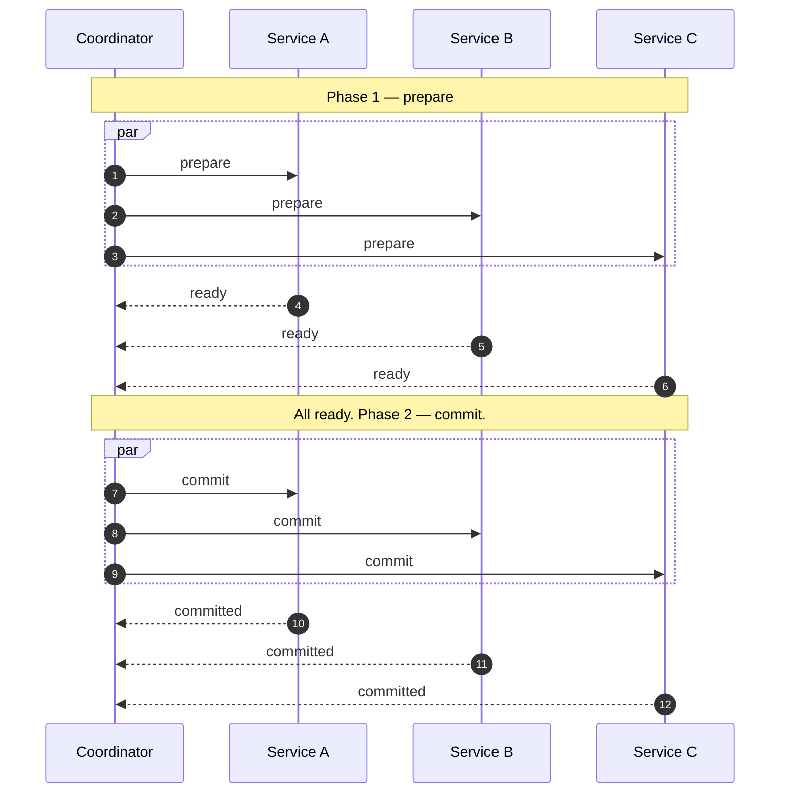
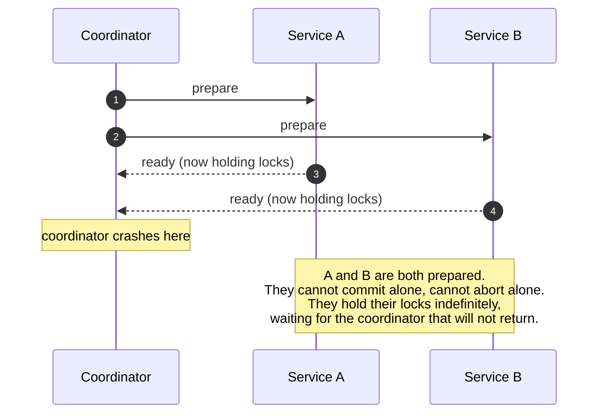
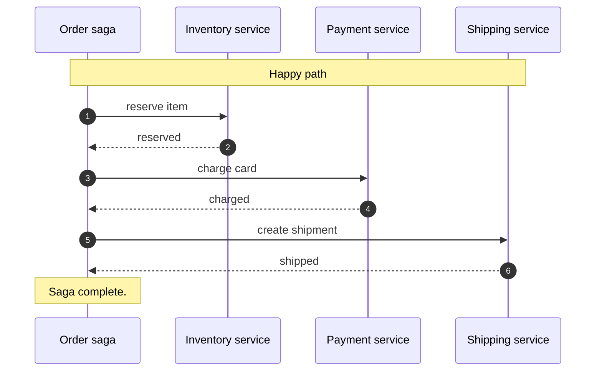
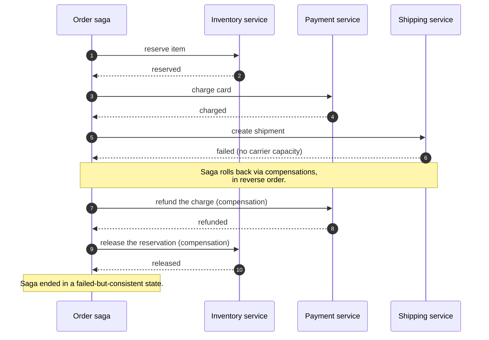
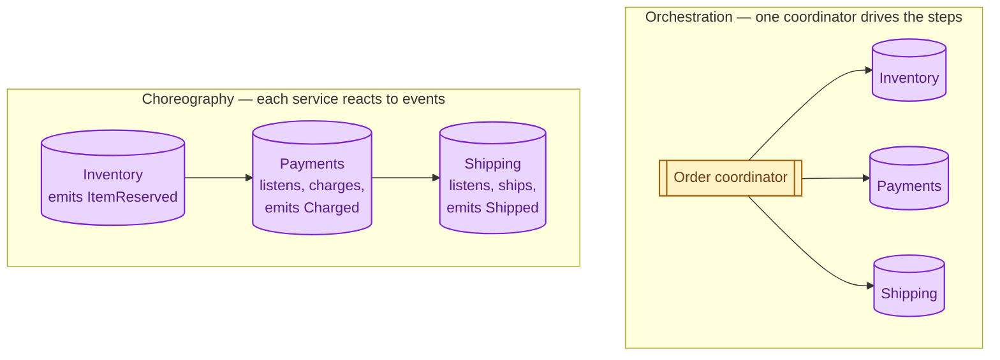

A single database can do ACID transactions trivially: commit or rollback, atomically. The moment your data lives in two systems (two databases, two microservices, a database and a payment provider), atomic commit becomes hard. The two classic answers are **two-phase commit (2PC)**, which tries to preserve atomicity at the cost of liveness, and **sagas**, which give up atomicity and use compensating actions to recover from failures. In practice, almost everyone picks sagas.

## The problem

You need to do three things, and either all of them succeed or none of them do:

1. Reserve inventory.
2. Charge the customer's card.
3. Create the order.

These are three different services. If step 2 succeeds and step 3 fails, you have charged a customer who has no order. If step 1 succeeds and step 2 fails, you have reserved stock for no one. The data is now inconsistent. Some pattern has to clean it up.

## Two-phase commit: try to be atomic

A **coordinator** asks each participant to prepare. Each one says "ready" or "abort". If all say ready, the coordinator tells them to commit. If any says abort, the coordinator tells everyone to roll back.

This is the happy path. Atomic, distributed, looks great.

## Why 2PC almost always loses in practice

The failure path is the problem. If the coordinator dies after some participants have prepared, those participants are **locked** in the prepared state, waiting for a decision that will never come.

This is called **the blocking problem**. Participants can be stuck for the duration of any coordinator outage. In a system that has to be highly available, this is unacceptable.

Other problems:

- **Latency.** Every operation pays two round trips.
- **Throughput cliff.** Locks held across networks mean less concurrency.
- **Hard to recover.** Manual intervention often needed when a coordinator vanishes mid-flight.

2PC works fine inside a single tightly coupled database engine. As a cross-service pattern, it is an antipattern.

## Sagas: give up atomicity, lean on compensation

A saga is a sequence of local transactions, each of which commits before the next one starts. If a later step fails, you run **compensating actions** that undo the earlier ones.

That is the easy direction. The interesting one is what happens when something fails halfway:

You traded atomicity for a guarantee about consistency over time: at the end, the system is either fully done or fully cleaned up. The trade is well worth it because no participant ever holds a lock waiting for someone else's outcome.

## Choreography vs orchestration

Sagas come in two flavours, depending on who runs them.

**Orchestration** is easier to reason about. One service knows the whole flow, and the saga lives in code. Easier to test and observe. The orchestrator becomes a critical component.

**Choreography** has no central coordinator; services react to each other's events. Loosely coupled. Hard to know "where is the saga now?" without a tracing system. Common in event-driven architectures.

For most teams, **orchestration is the right default**. Reach for choreography when the steps are genuinely independent or when you need very loose coupling between teams.

## Compensations are not always perfect

The classic example is "refund the charge". A real-world refund is not the perfect inverse of a charge: there are fees, the customer may have already filed a chargeback, the card may have expired. Compensations are best-effort and sometimes leave a small audit trail of "we tried to undo this but a human will need to look."

This is a strength, not a weakness. Real-world business is messy; sagas embrace that mess explicitly, while 2PC pretends it does not exist.

## When to use 2PC

- Inside a single distributed database (Spanner, CockroachDB, FoundationDB) where the system itself handles the failure cases.
- Between two services that are tightly coupled, low-latency, on the same hardware, where coordinator failures are extremely rare.
- Almost never as a cross-service pattern across microservices or external providers.

## When to use sagas

- Any cross-service business workflow.
- Any flow that touches an external system (payment provider, shipping carrier, email).
- Anywhere availability matters more than perfect atomicity.

## What this connects to

- **Idempotency.** Each step and each compensation must be safe to run twice. The retry will happen. See [Idempotency](/practice/system-design/concepts/021-idempotency/).
- **Message queues.** Sagas often run on top of queues so each step is durable and retriable. See [Why use a message queue](/practice/system-design/concepts/032-why-message-queue/).
- **Async patterns.** A saga is the canonical long-running async workflow. See [Synchronous vs asynchronous](/practice/system-design/concepts/005-sync-vs-async/).
- **ACID vs BASE.** Sagas are how you simulate "ACID across services" with BASE primitives. See [ACID vs BASE](/practice/system-design/concepts/007-acid-vs-base/).

## Common mistakes

- **Trying 2PC across microservices.** You will discover the blocking problem the hard way during the first coordinator failure.
- **Writing compensations as an afterthought.** Every saga step needs its compensation designed at the same time, or you ship one-way flows that hang on the first failure.
- **No idempotency keys.** Sagas retry. Without idempotency, retries double-charge, double-ship, double-everything.
- **Letting the saga state live only in memory.** When the orchestrator restarts, in-flight sagas need to resume. Persist the saga state explicitly.
- **Forgetting timeouts.** A step that hangs forever stalls the whole saga. Each step needs a timeout and a defined behaviour on timeout (retry, fail forward, compensate).

## Quick recap

- 2PC: looks atomic, blocks on coordinator failure, fine inside one engine, broken across services.
- Sagas: a chain of local transactions with compensating actions for rollback.
- Orchestration is easier than choreography for most teams.
- Idempotency and persistent saga state are non-negotiable.
- Real-world business workflows are sagas in disguise. Make it explicit.

This concept sits in **Stage 5 (Distributed systems hard parts)** of the [System Design Roadmap](/practice/system-design/roadmap/).
