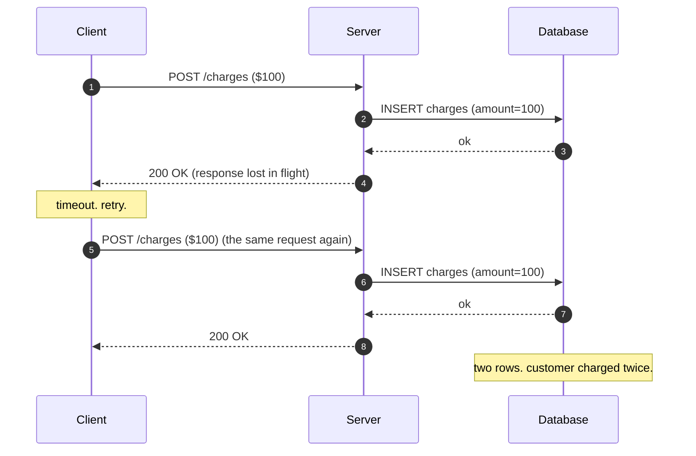
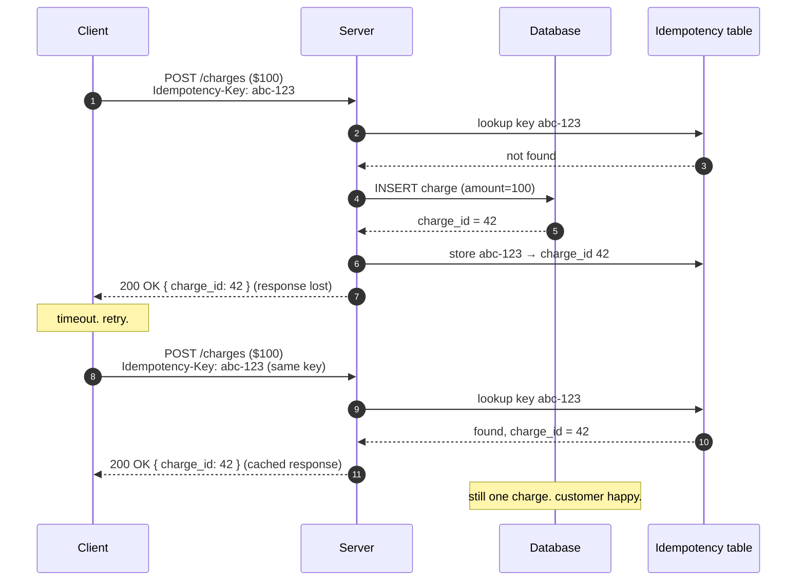
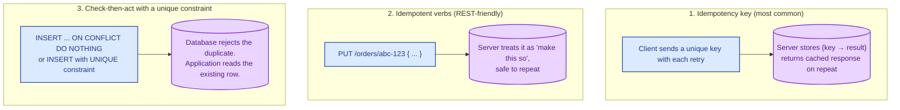

An operation is **idempotent** if running it twice has the same effect as running it once. In distributed systems, things get retried. Networks drop responses. Clients timeout and re-send. Queues redeliver. Workers crash and restart. Idempotency is the property that makes all of that safe instead of catastrophic. It is not a nice-to-have. It is the basic contract that distributed systems are built on.

## Why this matters

The same request will arrive at your server more than once. Not "might". Will. Sources of double-delivery include:

- Client timeout and retry. The server got the first one, but the response was lost in flight.
- Load balancer retry on connection failure.
- Message queue with at-least-once delivery.
- A user mashing the "submit" button.
- A worker crashing after committing the work but before acknowledging the queue.

If your operation is "charge $100", running it twice charges $200. If your operation is "set balance to $100", running it twice still leaves $100. The shape of the operation makes all the difference.

## The bug: non-idempotent retry doubles the charge

The client did the right thing. The server did the right thing. The infrastructure did the right thing. And the customer is angry. The system was wrong, not anyone in it.

## The fix: idempotency keys

The client picks a unique key per logical operation and sends it with every retry. The server records "I already handled this key" and returns the original response if it sees the same key again.

Stripe, AWS, and almost every modern payments API expose this pattern as `Idempotency-Key` headers. It is the canonical answer to "how do I make my API safe to retry?"

## What makes an operation naturally idempotent

Some operations are idempotent without any work:

- **PUT /resource/123 with full state.** "Make resource 123 look exactly like this." Re-applying it is a no-op.
- **DELETE /resource/123.** Already deleted = still deleted. Same result.
- **SET balance = 100.** Setting a value to itself is fine.

Some are not, by design:

- **POST /charges.** Creates a new charge. Running it twice creates two.
- **POST /messages.** Sends a message. Running it twice sends two.
- **balance = balance - 100.** Subtracts, applied twice subtracts twice.

The trick is to make the latter category idempotent on purpose by either reshaping the operation (use PUT with a deterministic ID) or by using idempotency keys.

## Three patterns for idempotent writes

All three are common. The right one depends on the API style and the storage layer.

## Where idempotency matters most

- **Payment APIs.** Money cannot be created or destroyed by a retry.
- **Async workers.** Queues redeliver. Workers re-process. Every job handler must be safe to run twice.
- **Webhooks.** Most webhook providers retry on non-2xx responses. Your handler will see the same event again. Dedupe it.
- **Cross-service workflows (sagas).** Every step gets retried. See [Two-phase commit vs sagas](/practice/system-design/concepts/020-2pc-vs-sagas/).
- **Email and SMS.** Sending the welcome email twice is annoying. Sending the password reset email twice is a support ticket.

## Two scenarios

**Scenario one: an order checkout.**

User clicks pay. The browser times out. The user clicks again. Without idempotency, two orders get created. With an `Idempotency-Key` generated on the page load and sent with both clicks, the second click returns the same order ID as the first. The user thanks you for not double-charging them.

**Scenario two: a background email worker.**

A queue worker pulls "send welcome email to user 42" off the queue, sends it, then crashes before acknowledging the queue. The queue redelivers the job to another worker. Without idempotency, the user gets two welcome emails. With an idempotency key (e.g., `welcome-email-user-42` stored in a sent-emails table), the second worker sees the row, skips the send, and acknowledges.

## What this connects to

- **Sagas.** Every saga step needs to be idempotent because every step might be retried. See [Two-phase commit vs sagas](/practice/system-design/concepts/020-2pc-vs-sagas/).
- **Retry with backoff.** Retries are what make idempotency necessary. See [Retry with exponential backoff and jitter](/practice/system-design/concepts/046-retry-backoff-jitter/).
- **Delivery semantics.** At-least-once delivery is the norm; exactly-once is built on top of idempotency. See [At-most-once vs at-least-once vs exactly-once](/practice/system-design/concepts/034-delivery-semantics/).
- **Async patterns.** Async work is always retried. Idempotency is the rule that keeps it safe. See [Synchronous vs asynchronous](/practice/system-design/concepts/005-sync-vs-async/).

## Common mistakes

- **Assuming the client will not retry.** Clients always retry. Always.
- **Idempotency keys that expire too quickly.** If a key is gone before the retry arrives, you get a duplicate. Keep keys for at least 24 hours, ideally 7 days.
- **Cached the wrong response.** The first call returned an error you should not have cached. Now every retry sees the same error. Decide carefully: cache success responses, not transient errors.
- **No idempotency on the worker side.** "The API has idempotency keys" does not help when a queue worker re-processes a job. Each worker needs its own idempotency mechanism.
- **Using mutable inputs as the key.** If the key is derived from a timestamp the client makes up, it can change between retries. Keys must be stable across retries of the same logical operation.
- **Implementing it lazily.** "We will add idempotency later." Later is two days after you discover the duplicate charge bug. Build it in from the start of any payments-adjacent or job-queue work.

## Quick recap

- Idempotency = running the operation twice has the same effect as running it once.
- Networks retry. Queues redeliver. Clients re-submit. This is the default, not the exception.
- Use idempotency keys for non-idempotent operations like POST.
- Make sure idempotency lives on both the API edge and the worker side.
- Without it, you eventually charge a customer twice. With it, you sleep through outages.

This concept sits in **Stage 5 (Distributed systems hard parts)** of the [System Design Roadmap](/practice/system-design/roadmap/).
