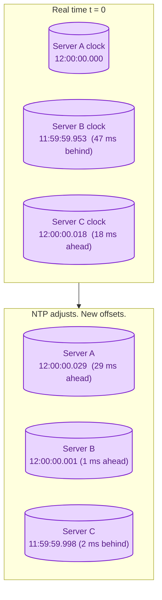
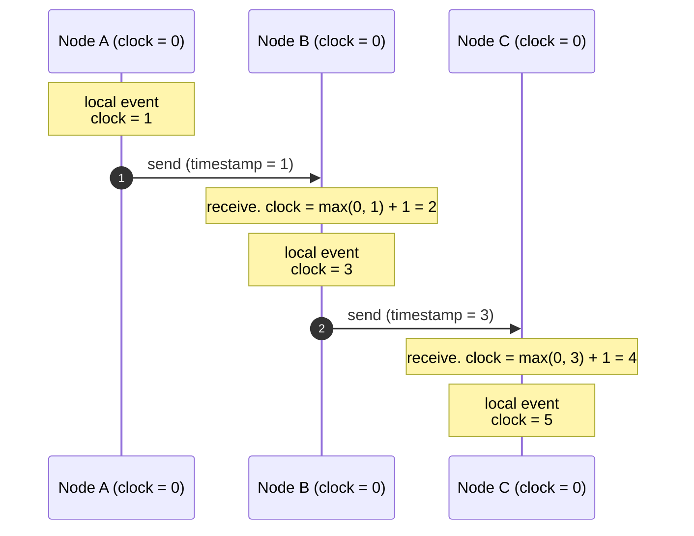
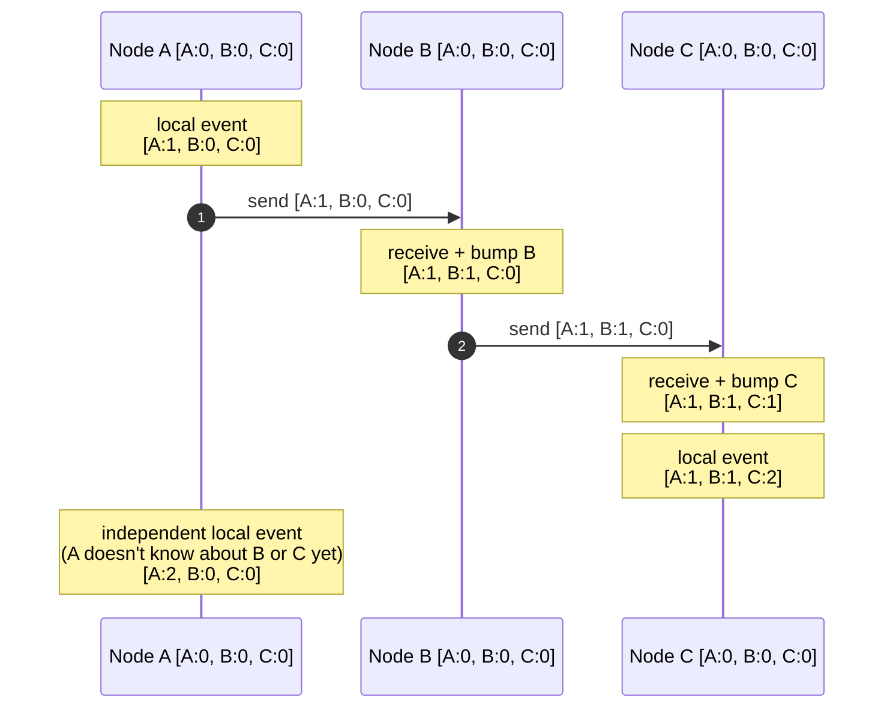
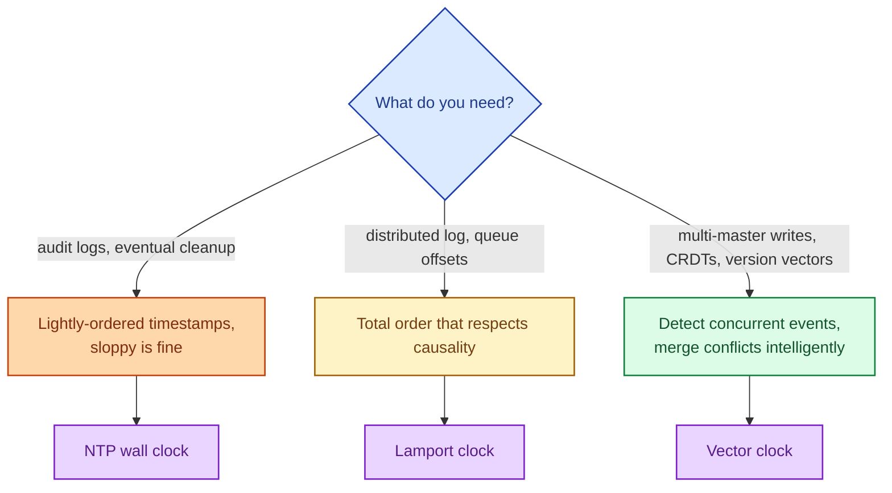

In a distributed system, "what happened first?" is a harder question than it looks. Wall clocks on different machines disagree by tens or hundreds of milliseconds. Network delays scramble the order events arrive in. The famous bugs in distributed systems often come down to assuming you can order events by timestamps, when in fact you cannot. This page covers the three tools you actually use: NTP-synchronised wall clocks, logical clocks, and vector clocks. Each one answers a different version of "did A happen before B?"

## Why wall clocks lie

Every server has a clock. None of them agree exactly. The clock drifts, the operating system corrects it, NTP nudges it, virtualisation pauses it, and occasionally an admin moves it. Two events that look "1 millisecond apart" by timestamp might actually be 30 ms apart in real time, or the other way around.

NTP keeps clocks within a few tens of milliseconds of each other on a normal day. PTP can get to microseconds inside a data centre. Google's TrueTime uses GPS plus atomic clocks to bound uncertainty to single-digit milliseconds globally. None of them give you nanosecond-perfect agreement, and none of them give you "this happened before that" with certainty when events are close in time.

## The "happened-before" relation

In 1978, Lamport defined the only thing you can actually know:

> An event A "happened before" event B if A could have caused B.

That is true if:

1. A and B happened on the same node, and A came first.
2. A was a "send" and B was the matching "receive" on another node.
3. A happened-before X, and X happened-before B.

If neither A happened-before B nor B happened-before A, the events are **concurrent**. No timestamp can tell you which came first because the question has no answer.

## Lamport timestamps: a single counter per node

A Lamport clock is one number per node. The rules:

1. On any local event, the counter goes up by 1.
2. When sending a message, include the current counter.
3. When receiving a message, set the local counter to `max(local, received) + 1`.

If event X has Lamport timestamp 3 and event Y has timestamp 5, you can be sure: if X happened-before Y, then 3 < 5. The reverse is **not** guaranteed: 3 < 5 does **not** prove X happened-before Y. They might be concurrent.

Lamport clocks give you a total order that respects causality, which is enough for many systems (Kafka offsets, Raft log indexes, dictionary order of operations). They cannot distinguish "truly before" from "looks before but actually concurrent."

## Vector clocks: full causality

A vector clock is one counter **per node**, kept by every node. When a node sends a message, it sends its whole vector. When receiving, the receiver takes the element-wise maximum and bumps its own entry.

Given any two vector clocks V1 and V2, you can decide:

- **V1 happened-before V2** if every element of V1 is `<=` the corresponding element of V2, and at least one is strictly less.
- **V1 and V2 are concurrent** otherwise.

That last bullet is the win. Vector clocks **detect** concurrent events. You can now hand the conflict to application code, a human, or a CRDT to resolve. This is how Riak and Cassandra know that two writes were concurrent and need merging.

The cost is size: a vector grows with the number of writers. For a small cluster (tens of nodes), this is fine. For millions of clients, it is not.

## Which clock for which job

NTP-synced wall clocks for most application code (logs, traces, anything humans read). Lamport clocks for internal ordering (Kafka offsets, Raft logs). Vector clocks for multi-master replication and conflict detection. Spanner's TrueTime is wall-clock-with-bounded-uncertainty and is one of the few production systems that can give you "true" external ordering.

## What this enables

- **Total ordering of events in a queue.** Lamport timestamps or sequential offsets.
- **Detecting conflicts in multi-leader replication.** Vector clocks (Riak, Dynamo).
- **Strongly consistent reads across data centres.** TrueTime + Paxos (Spanner).
- **Correctly ordering log lines after the fact.** NTP plus sanity (sometimes manually correcting for clock drift in post-processing).

## What this connects to

- **Causal consistency.** Built directly on the happened-before relation. See [Consistency models](/practice/system-design/concepts/017-consistency-models/).
- **Consensus.** Raft logs use sequence numbers (a form of Lamport clock). See [Consensus: Raft and Paxos](/practice/system-design/concepts/018-consensus-raft-paxos/).
- **Delivery semantics.** Exactly-once delivery often requires the producer to attach a deterministic sequence number. See [Delivery semantics](/practice/system-design/concepts/034-delivery-semantics/).

## Common mistakes

- **Ordering events by wall-clock timestamps.** Clocks drift. Two events that look 1 ms apart might be in the wrong order. Never use wall clocks for causality decisions in code.
- **Trusting the client's clock.** A mobile device's clock can be wrong by hours, set by the user, or even moved backward.
- **Assuming NTP is perfect.** NTP keeps clocks roughly in sync, not exactly. If your code branches on "is event A before B by less than 100 ms?", you are in trouble.
- **Ignoring clock skew in a distributed test.** Integration tests that pass on one machine may fail on another because the clock difference matters.
- **Designing for vector clocks where Lamport is enough.** Vector clocks are powerful but expensive. Use the simpler tool until you actually need conflict detection.

## Quick recap

- Wall clocks drift; NTP keeps them close, never identical.
- Lamport timestamps give a total order that respects causality.
- Vector clocks detect concurrent events; needed for multi-master conflict resolution.
- "Happened before" is the only thing you can know for certain in a distributed system without atomic clocks.
- For application code, prefer sequence numbers from a single ordering authority (a queue, a log) over wall-clock timestamps whenever possible.

This concept sits in **Stage 5 (Distributed systems hard parts)** of the [System Design Roadmap](/practice/system-design/roadmap/).
