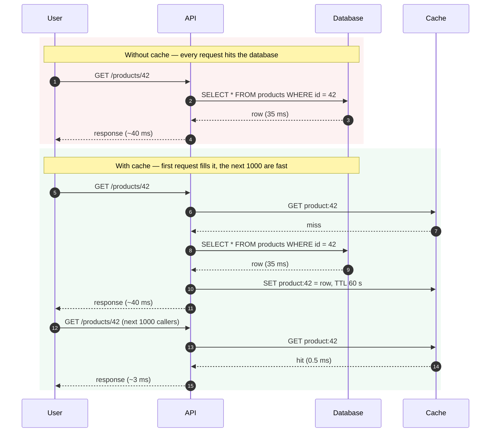
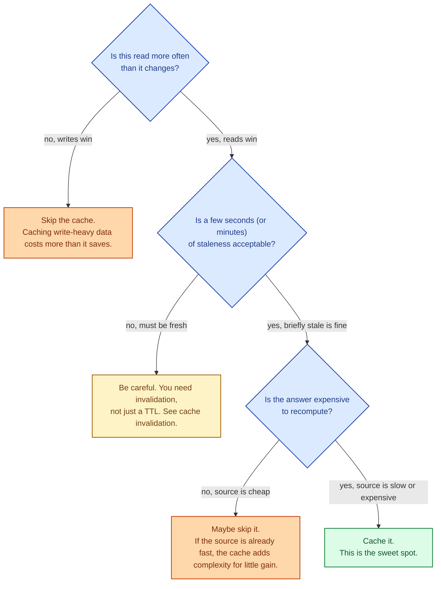

A cache is a copy of an answer, kept somewhere closer or cheaper than the original source, so the next person asking gets the answer faster. It does not change correctness; it changes the path. Caching is the most common performance fix in the industry, and the most overused. Every cache is a promise that the copy is good enough, and that promise eventually breaks. Knowing what to cache, where, and for how long is the senior part.

## What changes when you add a cache

The first request still costs the same. Every cache hit after that converts a 35 ms database round trip into a 0.5 ms memory read. At thousands of requests per second, this is the difference between a healthy database and a database that needs three more replicas.

## What caching does, and what it does not

It **does** reduce latency for repeated reads, reduce load on the upstream, and let one expensive computation serve many cheap reads.

It **does not** make a slow query faster on its first run. It does not fix a slow write. It does not make stale data fresh. It does not relieve a write-heavy workload. It does not replace correctness.

A cache is the right tool when reads dominate writes and the cost of a small staleness window is acceptable.

## What is worth caching

The sweet spot: hot reads, cold writes, brief staleness tolerated, expensive to recompute. That is the entry in a product catalog, the popular comment thread, the rendered home page, the result of an expensive aggregation. It is not the user's current cart, the latest balance after a transfer, or the row you just wrote.

## Where caches live

A cache is not one thing in one place. They stack:

- **Browser cache.** Holds assets and API responses with HTTP cache headers. Free, fast, controlled by the client.
- **CDN.** Edge cache for static and semi-static content. See [CDN](/practice/system-design/concepts/027-cdn-when-you-need-it/).
- **Application memory.** In-process LRU map. Microseconds. Lost on restart.
- **Distributed cache (Redis, Memcached).** Microseconds to a millisecond. Survives application restart. Shared across instances.
- **Database query cache or materialised view.** Last resort cache living near the source data.

Each layer catches more requests before the next layer has to work.

## Two scenarios

**Scenario one: a product page on an e-commerce site.**

Reads dominate by a factor of 1000 to 1. The product description changes weekly. A 60-second cache TTL is plenty. Throw the rendered product card into Redis. The catalog database serves the first request per minute per product; the cache serves the rest. Database load drops by ~99% with three lines of code.

**Scenario two: a balance check after a transfer.**

The user transferred money. They reload to see the new balance. They see the old balance for 30 seconds because of an aggressive cache TTL. They file a support ticket. The right answer here is **not** "cache longer". The right answer is "do not cache user balance, or invalidate it on every write." Different data, different caching policy.

## What this connects to

- **Cache strategies.** Aside, through, back, around — how the application and the cache coordinate on reads and writes. See [Cache strategies](/practice/system-design/concepts/024-cache-strategies/).
- **Cache eviction.** When the cache fills up, which entries get thrown out. See [Cache eviction](/practice/system-design/concepts/025-cache-eviction/).
- **Cache invalidation.** The famously hard part: keeping the cache in sync with the source. See [Cache invalidation](/practice/system-design/concepts/026-cache-invalidation/).
- **CDN.** The cache pattern applied at the network edge. See [CDN](/practice/system-design/concepts/027-cdn-when-you-need-it/).
- **Latency.** Caches are latency tools, not throughput tools per se. See [Latency, throughput, bandwidth](/practice/system-design/concepts/004-latency-throughput-bandwidth/).

## Common mistakes

- **Caching everything.** A cache for data that changes more often than it is read costs more in invalidation than it ever saves in reads.
- **Caching user-specific data globally.** Cache keys must include enough scope (user, tenant, locale) or you serve one user's data to another.
- **No TTL.** A cache without an expiration is forever stale eventually. Always give it a finite lifetime, even if invalidation is also wired up.
- **Treating the cache as the source of truth.** A cache is a copy. If the source is unreachable, treat the cache as best-effort, not authoritative.
- **Caching to hide a real problem.** A 4-second SQL query that you wrap in a 5-minute cache is still a 4-second query. Fix the query, then decide whether to cache.
- **Forgetting cold starts.** Right after a deploy or a Redis flush, the cache is empty and the database takes the full load. Plan for it; pre-warm critical caches if cold-start traffic would hurt.

## Quick recap

- A cache is a copy of an answer, kept closer or cheaper than the original.
- Caching helps read-heavy, expensive, tolerable-to-staleness data. It does not help writes or fix correctness.
- Caches stack: browser, CDN, application memory, distributed cache, database.
- Cache keys must include scope. TTLs are mandatory. Invalidation is harder than picking a strategy.
- Do not use a cache to paper over a slow source. Fix the source first; cache second.

This concept sits in **Stage 3 (Caching, queues, and async work)** of the [System Design Roadmap](/practice/system-design/roadmap/).
