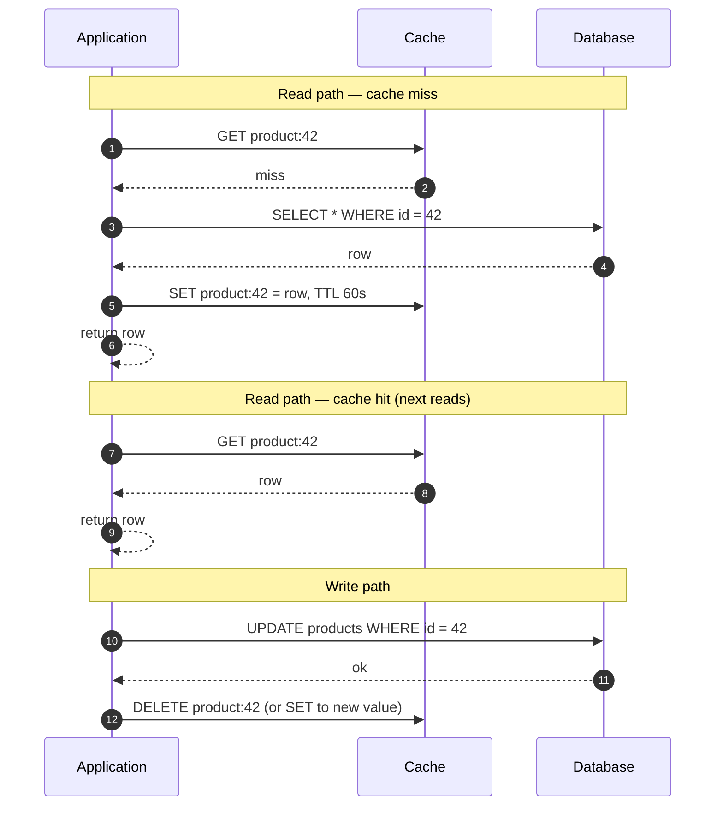
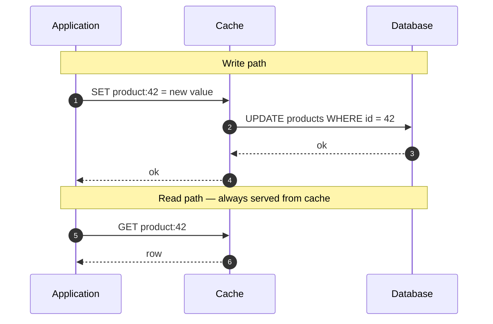
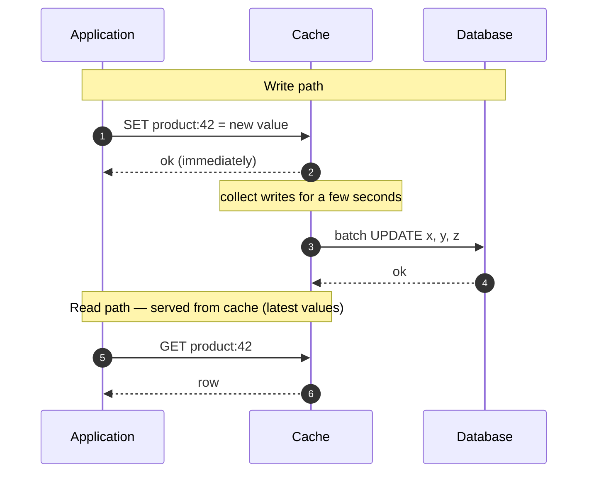
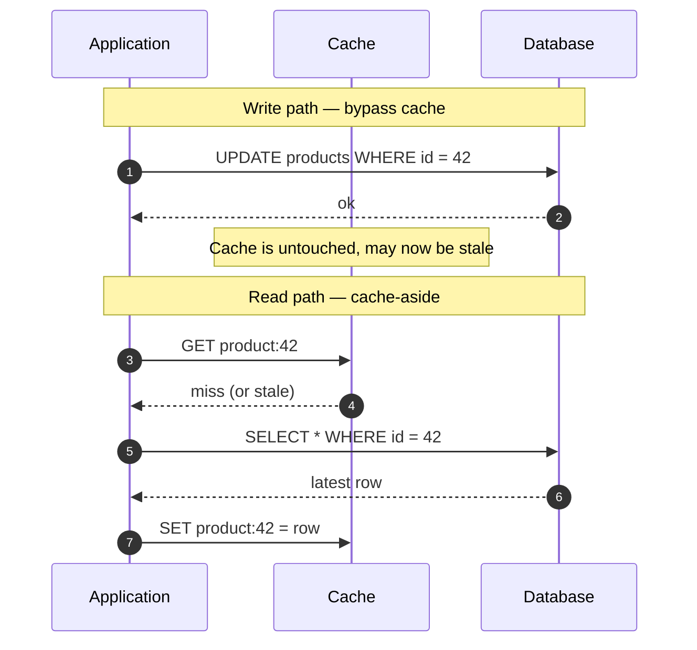
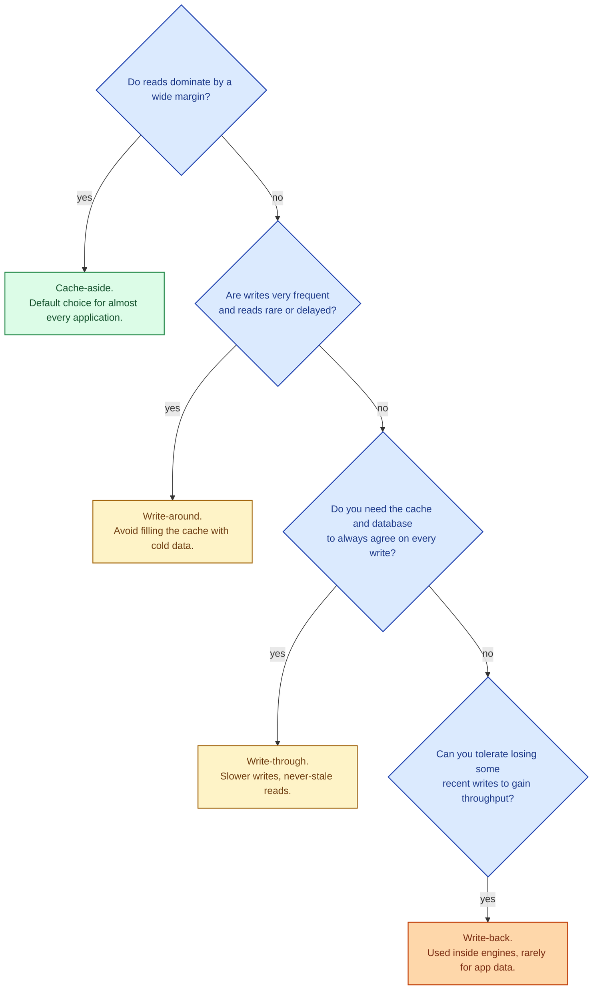

There are four classic ways to wire an application, a cache, and the underlying data store together. They differ in who writes to the cache, when, and what happens on a cache miss. Cache-aside is the most common; the other three exist for specific reasons. Picking the wrong one is how teams end up with a cache that almost never hits, or a database that gets corrupted by stale writes.

## Cache-aside (also called lazy loading)

The application talks to the cache and the database separately. On a read, it checks the cache first. On a miss, it queries the database, fills the cache, and returns the value.

This is by far the most common pattern. Redis, Memcached, and most in-process caches are used this way. The application is in charge: the cache is just a fast key-value store on the side.

**Strength.** Simple, robust. The cache and the database are decoupled; if the cache dies, the application still works (just slower).

**Weakness.** First read is always slow (cold miss). Every cached value is what the application chose to put there; consistency rules are entirely the application's job.

## Write-through

Every write goes to the cache first, and the cache writes through to the database synchronously. Reads always hit the cache.

**Strength.** Cache and database are always in sync (no stale reads, no missing entries after a write).

**Weakness.** Every write is slower; the cache becomes a critical write path. If the cache is down, writes stop. Few real systems use this; it is more common as an internal pattern inside database engines or storage layers.

## Write-back (also called write-behind)

Writes go to the cache and are acknowledged immediately. The cache flushes them to the database asynchronously, in batches.

**Strength.** Very fast writes (returns before the database has acknowledged). Batches absorb write spikes.

**Weakness.** If the cache crashes before the flush, those writes are lost. Used inside CPU caches, some storage engines, and analytics pipelines where some data loss is tolerable. Rarely the right pattern for primary application data.

## Write-around

Writes go straight to the database and skip the cache entirely. Reads use cache-aside.

**Strength.** Writes are unaffected by the cache. Good for write-heavy data that is rarely read soon after writing (audit logs, telemetry, batch ingest).

**Weakness.** The cache is stale until the next read repopulates it. Writes do not benefit from any cache layer.

## Picking the right one

Cache-aside covers something like 90% of real applications. Reach for the others when you have a specific reason: write-around for telemetry, write-through for "must always be consistent" scenarios with the cache in the critical path, write-back inside an engine you control.

## Two scenarios

**Scenario one: a product catalog page.**

Hot reads, cold writes. The product description changes a few times a week; the page is loaded thousands of times per minute. Cache-aside with a 60-second TTL. First request per product fills the cache; the next thousand are sub-millisecond.

**Scenario two: an audit log ingest.**

Millions of writes per minute. Almost no reads, and the reads happen days later for compliance. Write-around. Writes go straight to the database; no point filling the cache with rows nobody will read soon.

## What this connects to

- **Why cache.** The motivation for picking any pattern at all. See [Why cache and what to cache](/practice/system-design/concepts/023-why-cache-what-cache/).
- **Cache invalidation.** Every pattern has its own invalidation rules. See [Cache invalidation](/practice/system-design/concepts/026-cache-invalidation/).
- **Cache eviction.** Even the right strategy still needs to deal with a full cache. See [Cache eviction](/practice/system-design/concepts/025-cache-eviction/).
- **Idempotency.** Especially relevant in write-through and write-back where a retry could land in either the cache or the database. See [Idempotency](/practice/system-design/concepts/021-idempotency/).

## Common mistakes

- **Cache-aside without invalidation on write.** The classic stale-read bug. Always invalidate (or update) the cached entry when its underlying data changes.
- **Caching a value that is too large.** A 5 MB cached object means N copies for N instances. Cache the bare minimum.
- **Using write-back for primary data.** If the cache dies between the ack and the flush, those writes are gone. Acceptable for metrics, not for orders.
- **Treating the cache as durable storage.** Caches are best-effort. Plan for a flushed Redis.
- **Pretending the cache cannot fail.** A request path that crashes when the cache is down is too tightly coupled. Catch and fall back to the source on cache errors.

## Quick recap

- Cache-aside: application is in charge, default for almost everything.
- Write-through: cache writes synchronously to the database, always consistent, slower writes.
- Write-back: cache acks instantly, flushes async, fast but risky for primary data.
- Write-around: writes skip the cache, fine for write-heavy, rarely-read data.
- The right strategy depends on the read/write ratio and how much staleness you can tolerate.

This concept sits in **Stage 3 (Caching, queues, and async work)** of the [System Design Roadmap](/practice/system-design/roadmap/).
