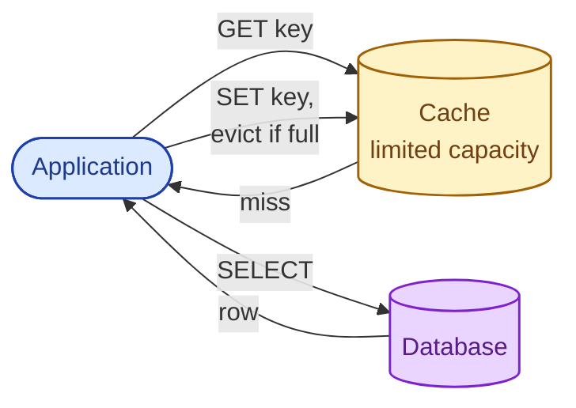
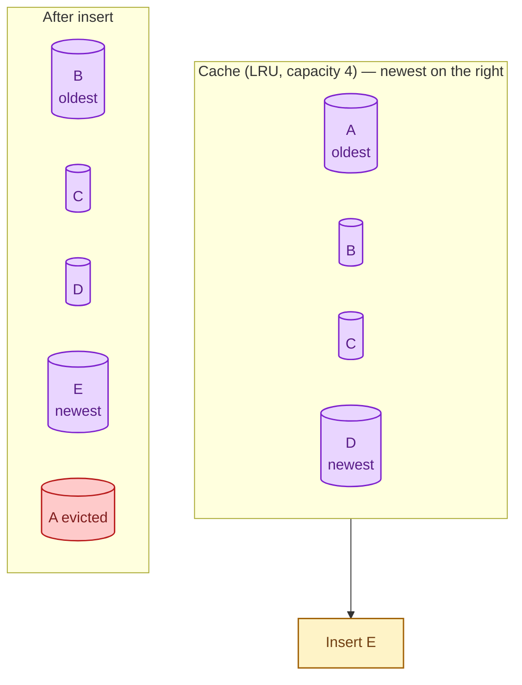
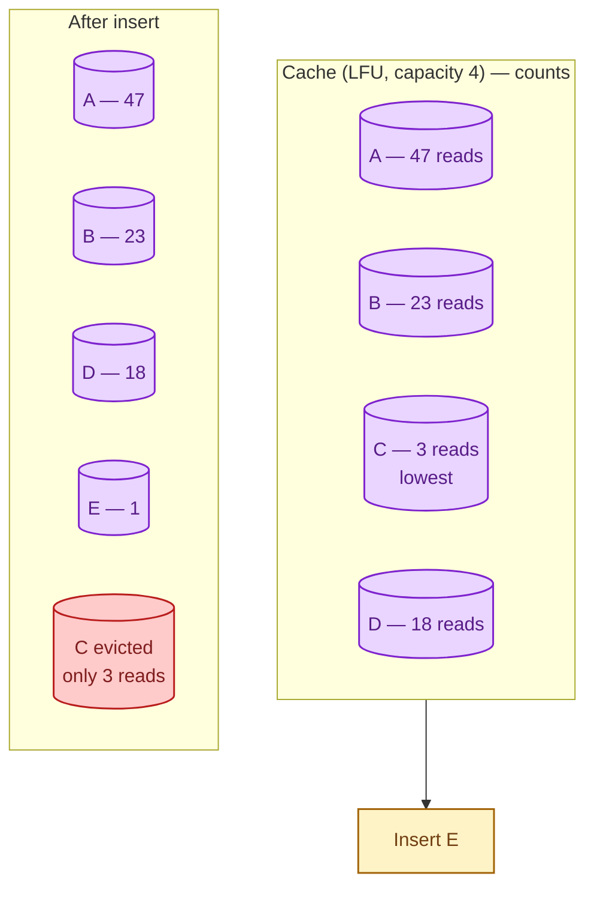
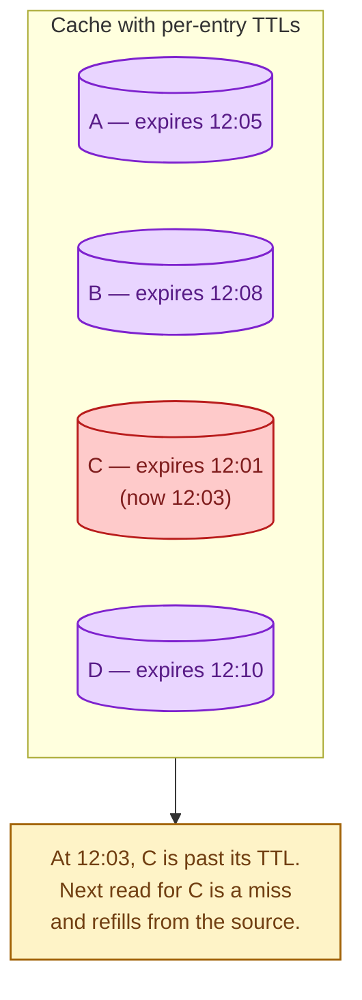
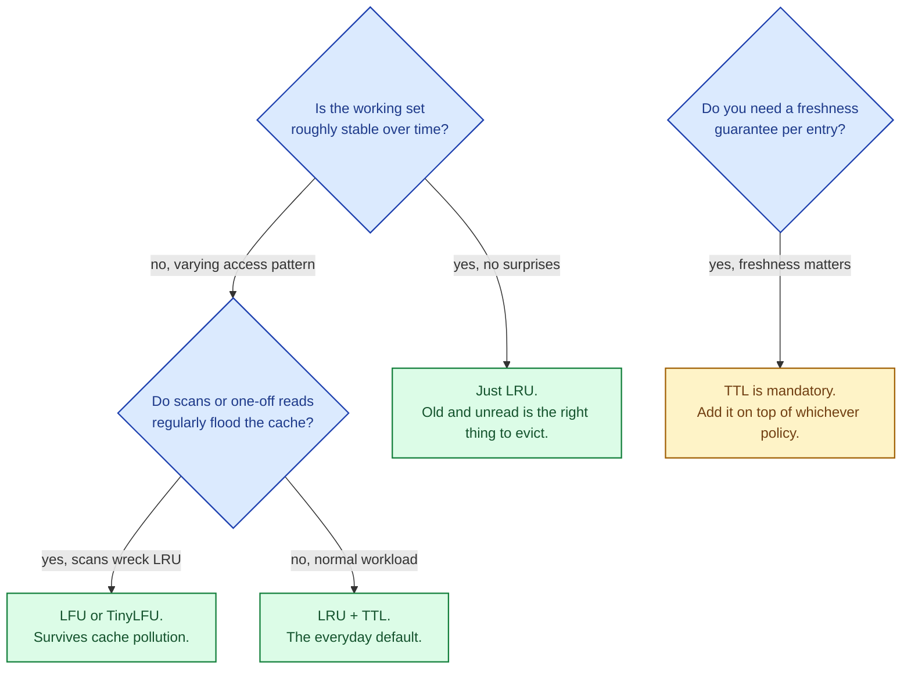

A cache has finite memory. Eventually it fills up, and the next write has to throw something out. The eviction policy decides who gets evicted. Pick the wrong policy for your access pattern and your hit rate falls off a cliff, even though the cache is the same size and the workload is the same. The good news: most production caches use one of three policies, and picking between them is about the shape of your reads, not about which one is "best."

## The setup

Every SET on a full cache forces a choice: which existing key has to leave so the new one can fit? Different policies pick differently.

## LRU — Least Recently Used

Evict the entry that has gone the longest without being read. The intuition: if it has not been used recently, it probably will not be used soon.

If you then read B, it moves to the newest position. Reads "promote" entries; only the truly idle ones drift to the front of the eviction queue.

**Strength.** Works well when the recently-read set predicts the soon-to-be-read set. Most workloads with temporal locality.

**Weakness.** A one-time scan of millions of cold rows evicts everything useful. This is called **cache pollution**, and it ruins LRU caches in front of analytics queries.

## LFU — Least Frequently Used

Evict the entry with the lowest read count. The intuition: keep the things many people ask about, even if any one of them was read a while ago.

**Strength.** Holds onto truly popular items even during a flood of one-off reads. Resistant to scan pollution.

**Weakness.** Old popular items can stay forever even after they stop being popular ("yesterday's news"). Pure LFU is rare; most implementations decay counts over time or combine LFU with LRU.

## TTL — Time To Live

Every entry has an expiration timestamp. When a read sees it past expiry, it is treated as a miss. Eviction happens automatically as the clock advances.

**Strength.** Predictable freshness ceiling. The cache is never more than TTL seconds stale. Simple to reason about.

**Weakness.** TTL alone is dumb about hit rate. A frequently-read key still gets refetched the moment its TTL fires. Always combine TTL with one of LRU or LFU so capacity also drives evictions.

## The hybrids that actually ship

Real caches mix policies. The two that show up in production:

- **TTL + LRU.** Default for most distributed caches (Redis, Memcached). Each entry has an expiration; eviction under memory pressure picks the least recently used non-expired entry.
- **TinyLFU (or W-TinyLFU).** A modern algorithm that combines a small "window" LRU with an LFU long-term filter. Used by Caffeine (Java) and many embedded caches. Highly resistant to scan pollution while still picking up trending items.

ARC (Adaptive Replacement Cache) is another good choice; it dynamically rebalances between recency and frequency.

## Picking a policy

For 90% of applications: LRU + TTL is what you want. For workloads with scan pollution (analytics, ML feature lookups, broad ranges of cold reads), reach for LFU or TinyLFU.

## Two scenarios

**Scenario one: a product page cache.**

A few thousand hot products account for 95% of traffic. The long tail of cold products gets browsed occasionally. LRU + TTL holds the hot set; cold reads miss and refetch as needed. This is the canonical web-cache shape.

**Scenario two: a feature store for a recommendation model.**

Most requests hit a small set of features for a power-user cohort, but periodic batch jobs scan billions of cold features. Pure LRU would get wiped out by the batch scans. TinyLFU keeps the frequently-used features warm even while the scan walks past.

## What this connects to

- **Why cache and what to cache.** Eviction is the consequence of a finite cache. See [Why cache and what to cache](/practice/system-design/concepts/023-why-cache-what-cache/).
- **Cache invalidation.** Eviction is "I am out of room"; invalidation is "this entry is wrong." Different mechanisms. See [Cache invalidation](/practice/system-design/concepts/026-cache-invalidation/).
- **B-tree vs LSM tree.** Database storage uses some of the same ideas (buffer-pool eviction is essentially LRU). See [B-tree vs LSM tree](/practice/system-design/concepts/009-b-tree-vs-lsm-tree/).

## Common mistakes

- **LRU in front of an analytics workload.** A nightly scan pollutes the cache and your hit rate collapses for the next hour. Use LFU or TinyLFU, or carve a separate cache for analytics.
- **TTL only, no capacity policy.** When memory pressure hits, the cache has no rule for what to evict. Always pair TTL with LRU (or LFU).
- **Picking eviction by reputation.** "LFU sounds smarter." Not for many workloads. Measure hit rate, not abstract cleverness.
- **Setting one TTL across the whole cache.** Different data has different freshness needs. A product description can be 5 minutes; a user balance is much shorter or invalidated explicitly.
- **No metric for hit rate.** If you do not know your cache hit rate, you do not know if your policy is working. Track it per key prefix; chase the misses.
- **Treating eviction as the only correctness mechanism.** Eviction is about capacity. Invalidation, when a value becomes wrong, is a separate problem.

## Quick recap

- LRU: evict what has not been touched recently. Default, fast, vulnerable to scan pollution.
- LFU / TinyLFU: evict the least-counted entry. Resistant to scans, more bookkeeping.
- TTL: every entry expires after a finite time. Always combine with a capacity policy.
- Most real caches use LRU + TTL; reach for TinyLFU when scans regularly flood the cache.

This concept sits in **Stage 3 (Caching, queues, and async work)** of the [System Design Roadmap](/practice/system-design/roadmap/).
