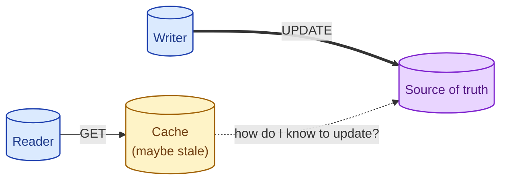
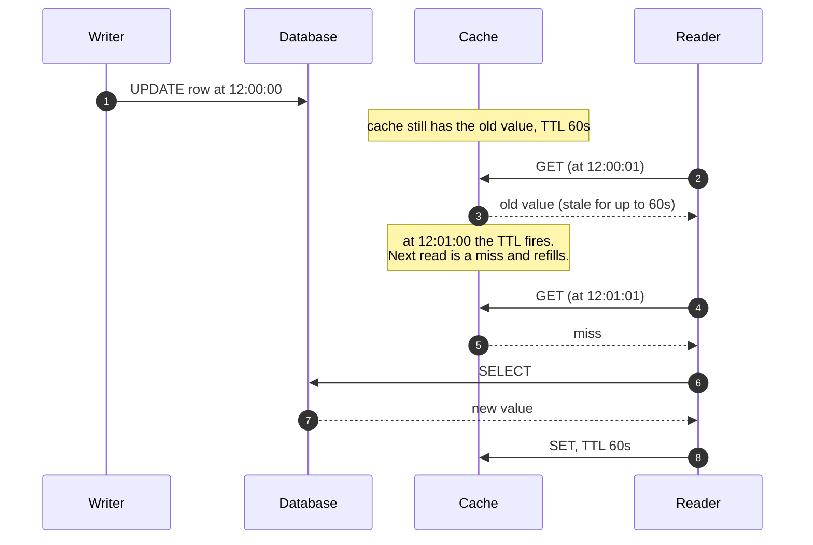
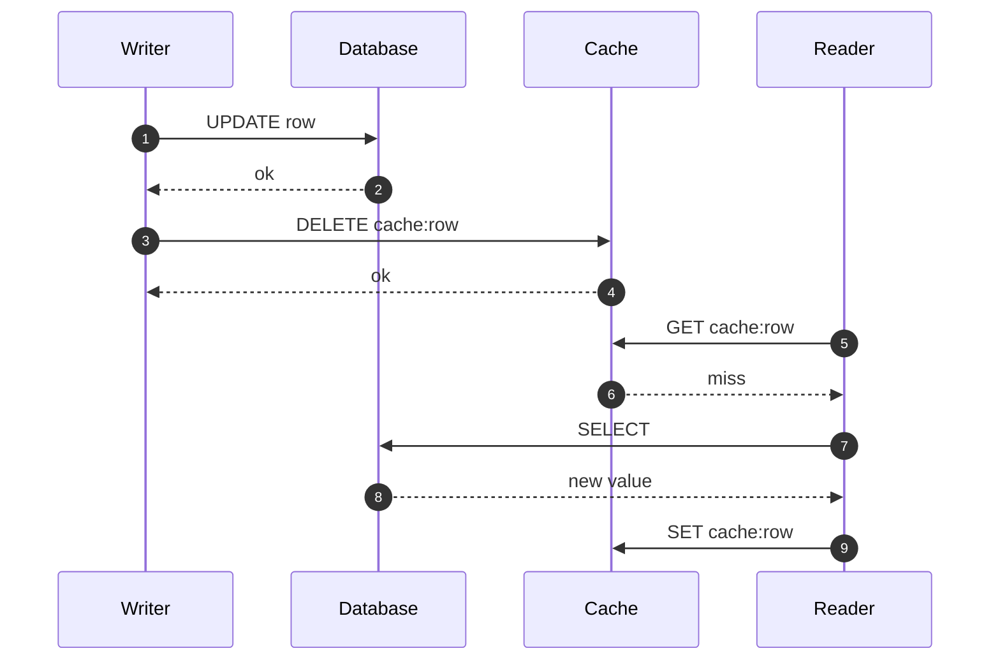
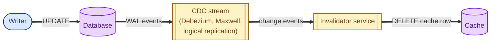
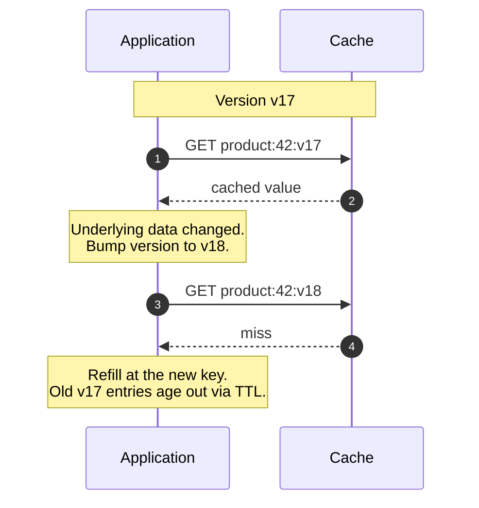
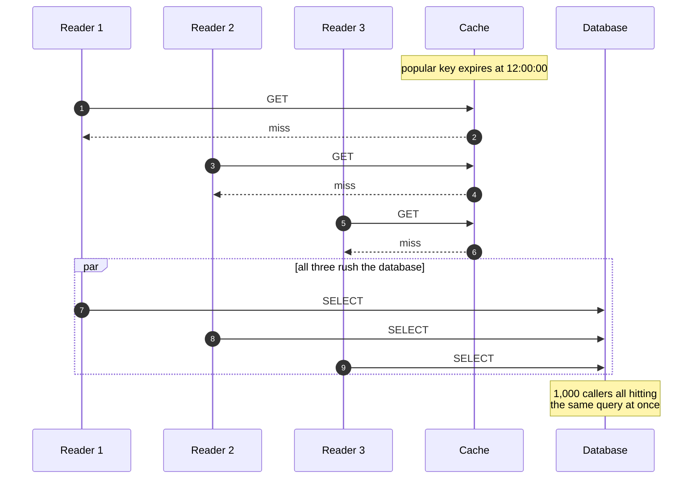
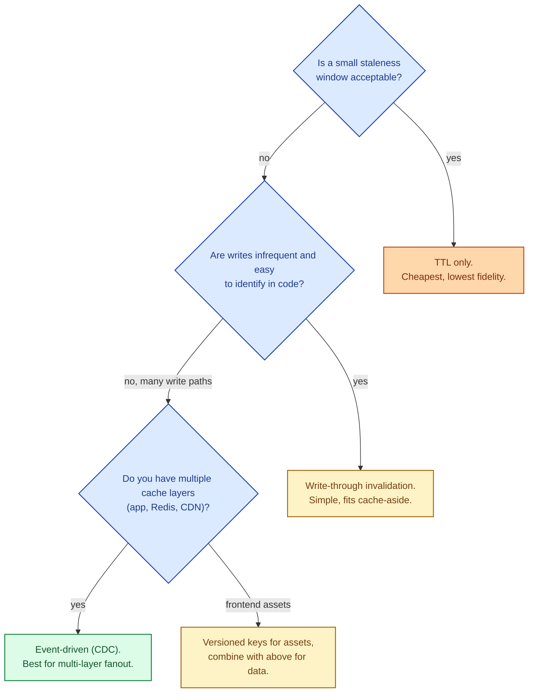

Phil Karlton's old line, "there are only two hard things in computer science: cache invalidation and naming things," is famous because it is true. Cache invalidation is hard not because the patterns are complicated, but because the consequences of getting it wrong (showing stale data) are subtle and discovered last. This page covers the patterns that actually work and the failure modes that bite the hardest.

## Why this is harder than it looks

A cache stores a copy. The original can change at any moment. The copy does not know. Invalidation is how you tell the copy "you are no longer the truth." Every approach has trade-offs across freshness, complexity, and traffic to the source.

The dotted line is the missing piece. Filling it in is what every pattern below does, in its own way.

## Pattern 1: TTL only (the dumbest but simplest)

Every cached entry has an expiration time. After it expires, the next reader misses and refetches from the source.

**Strength.** Trivial. No coordination between writer and cache. Works on any cache, any source.

**Weakness.** Stale window equals TTL. For a balance check after a transfer, that window is unacceptable. For a product description, a 5-minute TTL is fine.

## Pattern 2: Write-through invalidation

The same code that writes to the database also writes to (or deletes from) the cache.

The classic "delete on write" cache-aside pattern. The cache always reflects either the latest committed write or a miss that refetches the latest.

**Strength.** Almost-immediate freshness. Simple to implement.

**Weakness.** Tight coupling between the write path and the cache. Every place that writes to the database has to also bust the cache. Miss one and the data drifts.

## Pattern 3: Event-driven invalidation (CDC)

A change-data-capture stream from the database pushes events to a small service that busts the corresponding cache keys.

**Strength.** Writers do not need to know about the cache. Invalidation is centralised, observable, and fan-outs to every cache layer (Redis, app memory, CDN).

**Weakness.** Extra infrastructure. The invalidator must handle bursts, retries, and ordering. Latency between the write and the cache update can be a few hundred milliseconds.

This pattern is how most large-scale systems do invalidation. The cost of the infrastructure is paid back by the freedom it gives writers.

## Pattern 4: Versioned keys (deploy-style)

Instead of mutating the cached value, change the key. Versioned keys are common in CDN and frontend asset caching but show up in API caches too.

The "invalidation" is just a key change. Old entries become unreachable and the cache cleans them up via normal TTL eviction.

**Strength.** Race-free; the old value cannot be returned because the key is gone from the lookup path. Wonderful for frontend assets (`/static/app.js?v=18`).

**Weakness.** Wastes cache space (old entries linger). Requires the application to maintain a version per entity, which is itself a small distributed state.

## The thundering herd / stampede problem

When a popular cache entry expires, every concurrent reader misses at the same time and they all hit the source together. The source gets a sudden spike, sometimes enough to crash it.

Two production fixes:

- **Singleflight / request coalescing.** When the first reader sees a miss, it takes a short-lived in-memory lock and refetches; others wait for it. One database call serves N callers.
- **Probabilistic early refresh.** As the TTL approaches, refresh the entry in the background with a small probability per request. The hot key never actually expires from the user's point of view.

Most production caches (and HTTP cache middleware) ship with one of these patterns built in. Use it.

## Picking a pattern

For most teams: TTL plus write-through invalidation gets you most of the way. CDC-based invalidation is the pattern of choice at scale.

## What this connects to

- **Cache strategies.** The pattern (aside, through, around) sets the shape of the invalidation. See [Cache strategies](/practice/system-design/concepts/024-cache-strategies/).
- **Cache eviction.** Eviction handles capacity; invalidation handles correctness. Different problems. See [Cache eviction](/practice/system-design/concepts/025-cache-eviction/).
- **Idempotency.** Cache delete-on-write must be safe to retry. See [Idempotency](/practice/system-design/concepts/021-idempotency/).
- **Schema migrations.** During an expand-and-contract migration, cached entries can outlive their schema. Bump cache versions on deploys. See [Schema migrations with zero downtime](/practice/system-design/concepts/013-zero-downtime-migrations/).

## Common mistakes

- **TTL infinity.** Forever-cached entries are forever-stale eventually. Always set an upper bound.
- **Forgetting one write path.** A batch job writes directly to the database and bypasses the cache-busting code in the API. Hours later, users see stale data. Centralise the invalidation via CDC if writers cannot be coordinated.
- **No stampede protection.** A popular key expires; the source falls over. Singleflight or early refresh is the fix.
- **Invalidation that races writes.** Delete the cache **after** the database commit, not before, or a concurrent read will refill the cache with the old value.
- **Invalidating across regions without ordering.** A cache flush in region A and a write in region B can produce surprising results. Causal ordering matters; see [Time, clocks, and ordering](/practice/system-design/concepts/022-time-clocks-ordering/).
- **No metric for staleness.** If you cannot measure how often a stale value is served, you cannot tell if invalidation works. Add staleness probes in critical paths.

## Quick recap

- TTL is the cheapest invalidation. Pair it with one of the patterns below for real freshness.
- Write-through invalidation works when writers are easy to find.
- CDC-driven invalidation scales across services and cache layers.
- Versioned keys are the cleanest pattern for assets and immutable content.
- Guard against thundering herd with singleflight or early refresh.
- The bug to fear is not "the cache is wrong"; it is "the cache is wrong and no one knows yet."

This concept sits in **Stage 3 (Caching, queues, and async work)** of the [System Design Roadmap](/practice/system-design/roadmap/).
