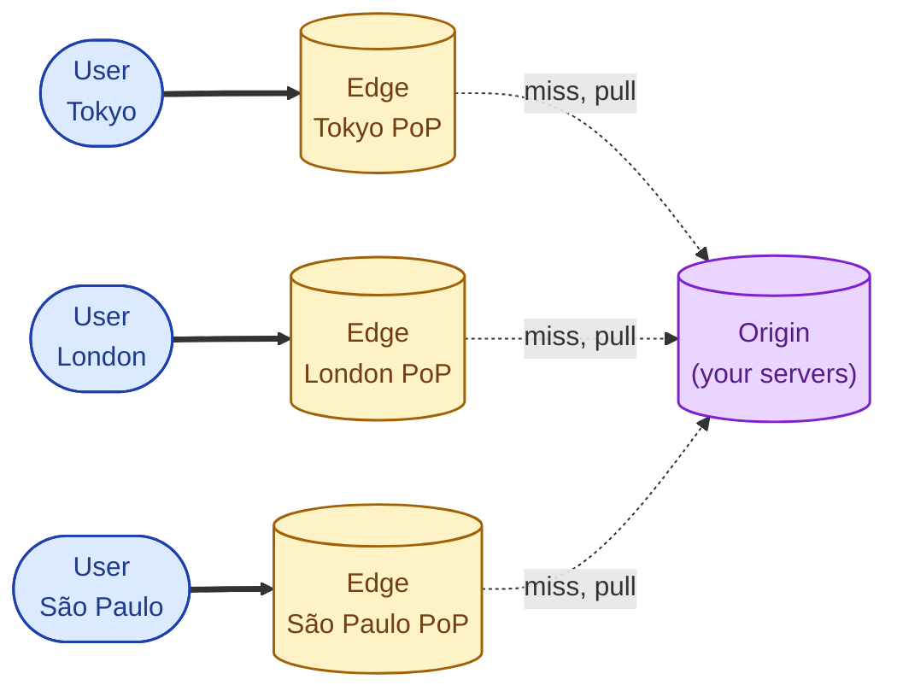
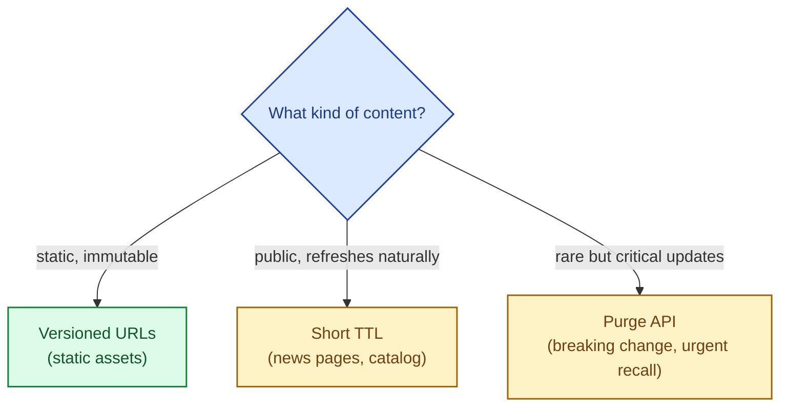

A Content Delivery Network is a cache that lives at the network edge, close to your users, instead of next to your application. The user's request lands on a CDN point of presence (PoP) a few milliseconds away. If the CDN has the answer, the user gets it without ever touching your origin server. If not, the CDN fetches from the origin, caches the answer, and serves the next request itself. The model is the same as any other cache. The placement is what makes it powerful.

## What changes when you add a CDN

```mermaid
sequenceDiagram
    autonumber
    participant U as User in Tokyo
    participant E as CDN edge in Tokyo
    participant O as Origin in Frankfurt

    rect rgba(220, 38, 38, 0.06)
    Note over U,O: Without a CDN — every request crosses oceans
    U->>O: GET /assets/app.js
    Note over U,O: ~250 ms round trip
    O-->>U: 200 OK
    end

    rect rgba(22, 163, 74, 0.06)
    Note over U,O: With a CDN — first user warms the edge; everyone else is local
    U->>E: GET /assets/app.js
    E-->>U: miss
    E->>O: pull from origin
    O-->>E: 200 OK
    E-->>U: 200 OK

    U->>E: GET /assets/app.js  (next user nearby)
    E-->>U: 200 OK (~10 ms)
    end
```

The first user pays the origin round trip. Every subsequent user in that region gets the answer from an edge node a few milliseconds away. Latency drops, origin load drops, bandwidth cost often drops too because CDNs negotiate cheaper bandwidth than your origin would.

## The PoP map

A CDN runs hundreds (sometimes thousands) of PoPs around the world. DNS or anycast routes each user to the nearest healthy one.



Each PoP keeps its own cache. The origin sees one pull per PoP per object instead of one pull per user. For popular content, the cache hit ratio at the edge is often above 95%.

## What CDNs are great at

- **Static assets.** Images, CSS, JavaScript, fonts. These rarely change and benefit hugely from edge placement.
- **Streaming video.** HLS or DASH segments are huge and read by many viewers; CDN edges absorb most of the bandwidth.
- **Software downloads.** Game patches, OS updates, container images. Massive files, millions of users, perfect CDN workload.
- **API responses with TTL.** Product catalogs, public pages, marketing content. Cache at the edge with short TTLs.
- **HTML pages of mostly-static sites.** A whole page served from the edge under 50 ms anywhere in the world.

## What CDNs are not great at

- **User-personalised content.** "Hello, Amirul" cannot be cached at the edge unless you split the page into a static shell plus a personalised fragment loaded separately.
- **Anything that must be strongly consistent on the moment.** A live trading dashboard does not want stale data, even by 5 seconds.
- **Frequent writes.** CDNs cache responses; they do not accelerate writes. POSTs and PUTs go straight through to the origin.
- **Very low-traffic endpoints.** If something is read once a week, an edge cache barely warms before its TTL expires.

## Two scenarios

**Scenario one: a media site.**

Article pages, images, video previews. 95% of traffic is reads. A CDN in front of everything drops origin load by 90%+, makes the site fast everywhere in the world, and costs less than scaling up the origin to match.

**Scenario two: a private SaaS dashboard.**

Per-user data, must be fresh, all behind authentication. CDN static-asset offloading (JS, CSS) is still a clear win. Caching API responses is harder; you need cache keys that include the user or tenant, and very short TTLs. Often easier to keep the API response uncached and use the CDN only for assets.

## How CDN invalidation differs from app cache invalidation

A CDN serves from many PoPs. Pushing an invalidation to all of them takes seconds to minutes depending on the provider. Three common patterns:

- **TTL only.** Set short TTLs (60 to 300 seconds) and let edge entries expire naturally. Easiest, fine for low-stakes data.
- **Purge by URL.** Tell the CDN "the URL `/products/42` is no longer fresh; drop all copies." Provider APIs ship with this; takes seconds to propagate.
- **Versioned URLs.** `/assets/app.v18.js`. Old version is immutable, cached forever; new version is a new URL. Zero invalidation needed. The default pattern for frontend assets.



## Edge functions: the new shape

Modern CDNs (Cloudflare Workers, Fastly Compute, AWS CloudFront Functions, Vercel Edge Functions) let you run small bits of code at the PoP. The use cases:

- **Request rewriting.** Set cookies, A/B routing, geolocation-based redirects, header normalisation.
- **Authentication checks.** Validate a JWT at the edge and reject bad requests before they ever reach the origin.
- **Personalisation at the edge.** Insert user-specific fragments into otherwise-cached pages.
- **Rate limiting.** Enforce per-user or per-IP limits at the edge.

Edge functions are not a replacement for the origin; they are a way to push specific kinds of logic closer to users and away from the origin's hot path.

## What this connects to

- **Why cache and what to cache.** The general principles apply at the edge too. See [Why cache and what to cache](/practice/system-design/concepts/023-why-cache-what-cache/).
- **Cache invalidation.** Edge invalidation is the same problem with a multi-PoP twist. See [Cache invalidation](/practice/system-design/concepts/026-cache-invalidation/).
- **Latency.** Almost the entire point of a CDN. See [Latency, throughput, bandwidth](/practice/system-design/concepts/004-latency-throughput-bandwidth/).
- **HTTP/2 and HTTP/3.** CDNs are usually the first place to enable both. See [HTTP/2 and HTTP/3](/practice/system-design/concepts/002-http2-and-http3/).
- **Load balancers.** A CDN is the outermost load balancer for many architectures, sitting in front of regional LBs. See [Load balancer: why, how, when](/practice/system-design/concepts/028-load-balancer-basics/).

## Common mistakes

- **Caching private content at the edge.** Setting `Cache-Control: public` on a logged-in user's data leaks it to the next user behind the same edge. Use `private` correctly; gate carefully.
- **Forgetting the cold start.** A new region's first hit goes to the origin. If you launch a campaign in a region with no warm edge, your origin gets a spike.
- **Treating the CDN as a free CDN.** Bandwidth at the edge is usually cheap, but request egress for misses is not. Plan for cache hit ratio, not just placement.
- **Not setting cache headers at the origin.** The CDN follows your headers. `Cache-Control: no-cache` makes every request a pull; `max-age=0` makes the CDN essentially a pass-through. Set the right headers per route.
- **Ignoring the CDN in incident reviews.** When an outage happens, ask "what did the CDN show?" Stale-but-served edge content can be the difference between a brown-out and a full outage.
- **Caching errors.** A 500 cached for 5 minutes turns a transient origin blip into a five-minute outage for every user behind that edge. Configure error response caching with very short or zero TTL.

## Quick recap

- CDN = a cache at hundreds of edge locations close to your users.
- Static assets, video, large downloads, public pages: the canonical wins.
- Personalised and write-heavy content: harder; edge functions help but do not replace the origin.
- Invalidation choices: versioned URLs (assets), short TTL (public data), purge API (urgent).
- Modern CDNs run code at the edge for auth, rewrites, and personalisation.

This concept sits in **Stage 3 (Caching, queues, and async work)** of the [System Design Roadmap](/practice/system-design/roadmap/).
