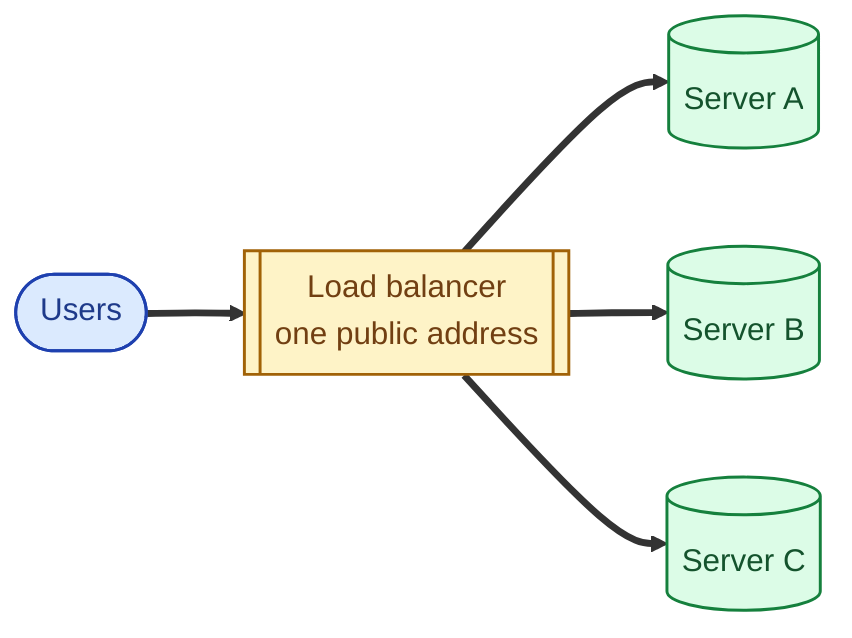
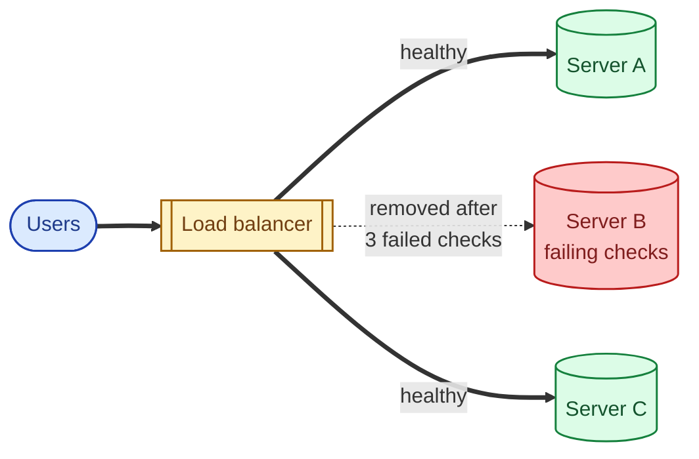
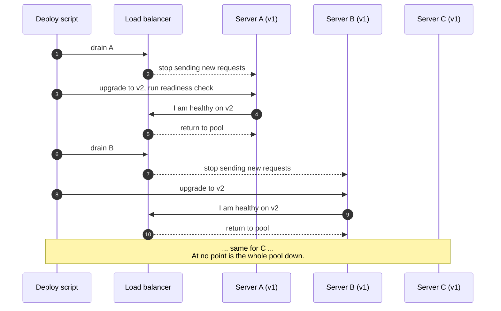
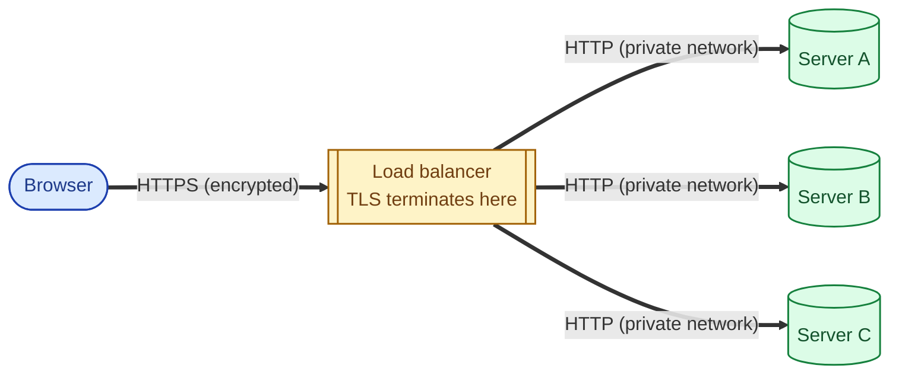

A load balancer is a single front door for your service. Requests come in to one address. The load balancer picks one of your backend servers and forwards the request to it. That is the whole idea. Everything else is a refinement of that one idea.

## The problem it solves

You ship a service. One server, one IP address, one DNS record. It can handle 1,000 requests per second. Things go well. Traffic grows to 3,000 per second. Your one server cannot keep up.

The fix is obvious: more servers. Three of them, say, behind some address. But which address? You cannot put three IPs in DNS and hope the user picks the right one. You cannot make the user know about your topology. You need a thing in front of those three servers that:

- Has the one address users hit.
- Knows about all three backends.
- Picks one for each incoming request.
- Notices when a backend dies and stops sending traffic to it.

That thing is a load balancer.

## The basic picture

The user has no idea there are three servers. They send to one address. The load balancer fans the traffic out.

## What happens, request by request

1. A request arrives at the load balancer.
2. The load balancer looks at its **pool** of healthy backends.
3. It picks one (using some algorithm: round robin, least connections, hashing).
4. It forwards the request.
5. The backend responds.
6. The load balancer sends the response back to the user.

The user only sees latency. They have no idea their first request hit server A and their second hit server C.

## When a server dies

This is the part most people forget. A load balancer is not just a fan-out. It is also a **watchdog**.

Every few seconds, it pings each backend with a health check (often something like `GET /healthz`). If a backend fails two or three checks in a row, the load balancer takes it out of rotation.

The user sees no error. Traffic just routes around B. When B recovers and starts passing health checks again, the load balancer puts it back in the pool.

## Rolling deploys: the same trick, on purpose

Once the LB can take a backend out and put it back in safely, you can do zero-downtime deploys. Drain one instance at a time, upgrade it, return it to the pool, repeat. Users see no interruption.

## TLS termination: one place, not three

A common second job for the load balancer is **terminating TLS**. Browsers talk HTTPS to the LB; the LB talks plain HTTP (or HTTPS, if you want defence in depth) to backends inside the trusted network. You manage one certificate, not one per backend.

You rotate the certificate on the LB only. Backends do not even know HTTPS is involved. This alone is often the reason small teams put a load balancer in front of a single backend.

## When you actually need one

You probably need a load balancer if any of these are true:

- You have more than one backend instance running the same code.
- You want to deploy new code without dropping connections.
- One backend dying should not take down the service.
- You want to terminate TLS in one place, not on every backend.
- You want to push request buffering, timeouts, and retries out of your app code and into infrastructure.

You probably do not need one yet if you have one server and your traffic fits comfortably on it, or you are a side project with three users.

Even with one backend, a load balancer is often worth it for the operational reasons alone (TLS, deploys, sane health-based routing during recovery).

## Two real scenarios

**Scenario one: you grew up.**

You started with one server behind a Cloudflare DNS record. Traffic grew. You added a second server. Now you put an Application Load Balancer (AWS) or Cloud Load Balancing (GCP) in front, point DNS at the LB, and add both backends to the pool.

Your users notice nothing. You can now deploy without a maintenance window. You can let a backend die without paging anyone at 3 a.m.

**Scenario two: a sudden flash crowd.**

A post about your product hits the top of Hacker News. You wake up to a thousand-times traffic spike. Your one backend would have crashed in the first minute.

Behind a load balancer with autoscaling attached to the same pool, your fleet grows from 3 backends to 30. The load balancer picks up each new instance the moment it passes its first health check. Latency stays flat. You go back to sleep.

## What you still have to decide

A load balancer is one category with several real choices inside it. Each is its own page in this library:

- **L4 vs L7**: does the load balancer route by IP and port, or does it understand URLs and headers? See [L4 vs L7 load balancing](/practice/system-design/concepts/029-l4-vs-l7/).
- **Algorithm**: round robin, least connections, consistent hashing. The one you pick has more impact than people expect. See [Load balancing algorithms](/practice/system-design/concepts/030-lb-algorithms/).
- **Sticky sessions**: should the same user always be routed to the same backend? Sometimes yes, often no. See [Sticky sessions](/practice/system-design/concepts/031-sticky-sessions/).

## Common mistakes

- **Treating the load balancer as just routing.** It is also health checks, TLS termination, request timeouts, and sometimes retries. Configure those. Do not just point traffic at it and forget.
- **Forgetting the LB is itself a single point of failure.** Run more than one. Managed LBs from AWS or GCP are usually multi-instance already, but verify it before you assume.
- **Round robin on stateful backends.** If user state lives in memory on a specific backend (try not to do that), round robin will scramble it. You want sticky sessions, or to externalise state to Redis.
- **No backend connection cap.** One slow backend should not be allowed to monopolise the LB's connection pool. Set per-backend caps so one bad instance does not poison the whole pool.
- **A useless health check.** A `/healthz` that just returns 200 from the framework tells you almost nothing. Make it actually check the database connection and any critical dependency. The whole point is to detect a broken backend before users do.

## Quick recap

- A load balancer is a single front door in front of many backends.
- It picks a backend per request, watches their health, and removes dead ones.
- You need one once you have more than one backend, want zero-downtime deploys, or want TLS in one place.
- The interesting decisions (L4 vs L7, algorithm, stickiness) are each their own topic.

This concept shows up in **Stage 4 (Scaling and reliability)** of the [System Design Roadmap](/practice/system-design/roadmap/).
