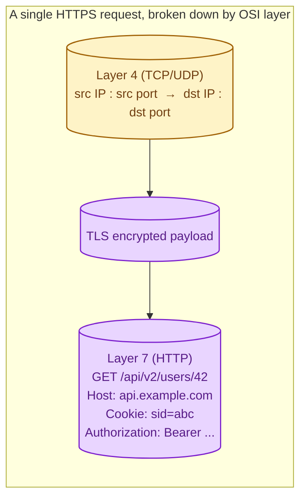
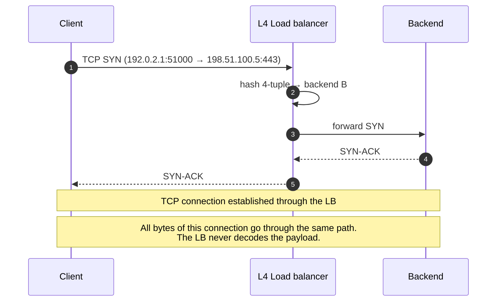
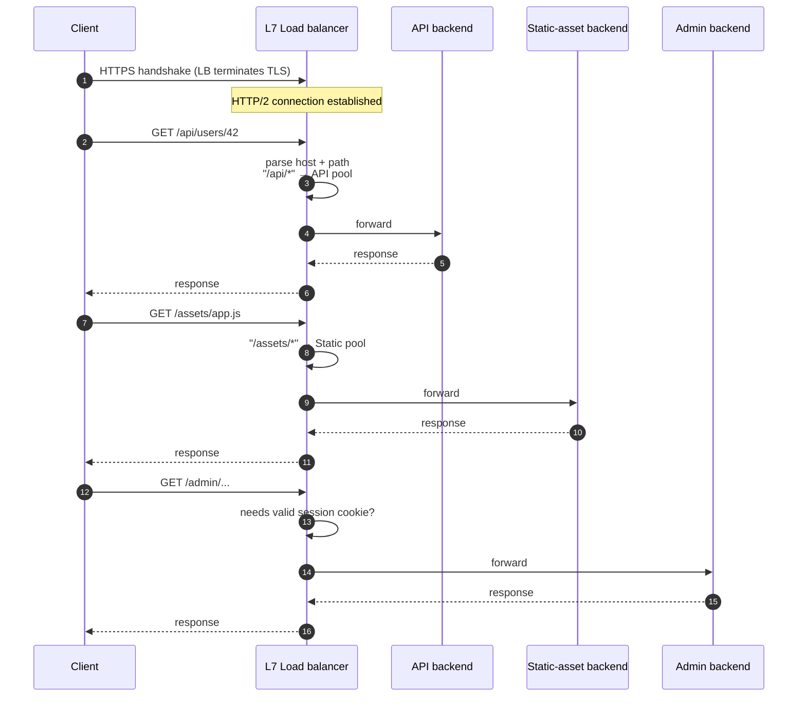
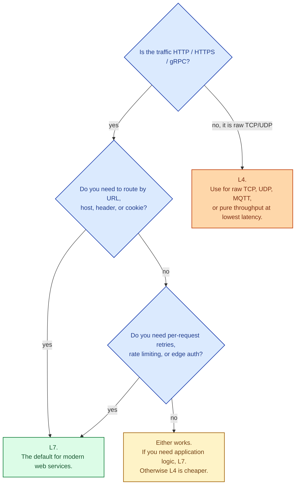

An L4 load balancer routes based on what it can see at the TCP or UDP layer: source/destination IP addresses and ports. It does not look inside the packet. An L7 load balancer terminates the TCP connection, decodes the HTTP request, and routes based on what the request is asking for: the URL, the headers, the cookies, the method. The deeper the layer, the smarter the routing, the higher the cost.

## What each layer can see

An L4 LB sees only the outer envelope: who is talking to whom on which port. An L7 LB cracks the envelope open and reads the letter. That extra reading costs CPU and adds latency, but it gives the LB the information it needs to make smart routing choices.

## L4: route by connection, fast and dumb

The LB receives a TCP packet, looks at the connection's tuple (source IP, port, destination IP, port), picks a backend (often by hashing the tuple), and forwards every packet of that connection to the same backend. The backend talks back through the LB. The LB has no idea what application is running on top of TCP; it could be HTTP, gRPC, MQTT, or your custom binary protocol.

**Strength.** Very fast. Single-digit microseconds per packet. Protocol-agnostic. Can carry any TCP or UDP traffic. Cheap to run.

**Weakness.** Routing decisions are per connection, not per request. Every request inside one connection (e.g., HTTP/2 streams on one TCP connection) lands on the same backend. The LB cannot route by URL, host, or any application detail.

Used by: AWS NLB, Google Network LB, HAProxy in TCP mode, MetalLB.

## L7: route by request, smart and slower

The LB terminates the client's TLS connection, decodes the HTTP request, and decides per request which backend to send it to. Different paths on the same connection can go to different backends.

**Strength.** Path-based routing, header-based routing, host-based routing (multi-tenant SaaS), per-request retries, request-level rate limiting, edge auth, content-based decisions. This is the modern web edge.

**Weakness.** Slower per request (microseconds to a millisecond). The LB does the TLS work. Application-aware features cost CPU. Cannot route non-HTTP traffic (a TCP-level service needs L4 or a special-mode L7).

Used by: AWS ALB, Google HTTP(S) LB, NGINX, Envoy, Traefik, Cloudflare in its standard mode.

## The decision

For modern web apps, the answer is L7 almost every time. L4 is the right tool for non-HTTP services, ultra-low-latency systems, or when you explicitly do not want the LB looking at your bytes (passthrough TLS, where TLS terminates on the backend).

## Two scenarios

**Scenario one: a SaaS with multiple subdomains.**

`api.example.com` goes to the API pool, `admin.example.com` goes to the admin pool, `static.example.com` goes to a static-asset backend, and the marketing site goes elsewhere. Only an L7 LB can read the `Host` header and route accordingly.

**Scenario two: a high-throughput multiplayer game server cluster.**

Custom UDP protocol, microsecond latency budget. An L7 LB cannot help (the LB has no HTTP to decode), and the extra processing would blow the latency budget. L4 with consistent hashing on source IP is the right pick.

## HTTP/2 and HTTP/3 change the LB math

L7 LBs read HTTP. HTTP/2 multiplexes many requests onto one TCP connection; HTTP/3 runs on QUIC over UDP. An L4 LB sees only one connection per client and pins all multiplexed streams to one backend. That defeats the multiplexing win.

If your backends speak HTTP/2 and you want per-request load distribution, you need an L7 LB that understands HTTP/2 streams. This is why most modern reverse proxies (Envoy, NGINX, ALB) ship with HTTP/2 stream balancing.

## What this connects to

- **Load balancer basics.** The shape this concept fits inside. See [Load balancer: why, how, when](/practice/system-design/concepts/028-load-balancer-basics/).
- **Load balancing algorithms.** Algorithm choice plays differently at L4 vs L7. See [Load balancing algorithms](/practice/system-design/concepts/030-lb-algorithms/).
- **Sticky sessions.** Easier at L7 (cookies) than at L4 (source-IP hash). See [Sticky sessions](/practice/system-design/concepts/031-sticky-sessions/).
- **HTTP/2 and HTTP/3.** L4 vs L7 choice changes once you adopt them. See [HTTP/2 and HTTP/3](/practice/system-design/concepts/002-http2-and-http3/).
- **TCP vs UDP.** L7 effectively means "load balance HTTP"; L4 covers everything else. See [TCP vs UDP](/practice/system-design/concepts/001-tcp-vs-udp/).

## Common mistakes

- **L4 in front of HTTP/2 backends.** The LB pins each TCP connection to one backend. All multiplexed streams stuck there. Your "scaled out" backend is one box for that client.
- **L7 for pure throughput workloads.** Putting an L7 LB in front of a gigabit-per-second video stream is overkill and burns CPU you do not need to spend.
- **Forgetting the TLS termination point.** L7 terminates TLS at the LB. If your compliance posture requires TLS end-to-end to the backend, the LB must re-encrypt before forwarding.
- **Assuming L7 is always "more secure."** It does enable WAF features, edge auth, and content inspection. It also becomes a hot target with broad access to plaintext. Configure carefully.
- **Mixing L4 and L7 without a plan.** Some teams chain L4 in front of L7 (NLB → ALB on AWS). It can be the right call, but every hop adds latency. Justify it.

## Quick recap

- L4: routes by TCP/UDP tuple, fast, protocol-agnostic, dumb. Pins each connection to one backend.
- L7: terminates TLS, decodes HTTP, routes per request by URL/host/header. Slower, smarter, modern default for web.
- HTTP/2 and HTTP/3 push you toward L7 once you adopt them.
- Use L4 for raw protocols and lowest-latency throughput; L7 for everything HTTP-shaped.

This concept sits in **Stage 4 (Scaling and reliability)** of the [System Design Roadmap](/practice/system-design/roadmap/).
