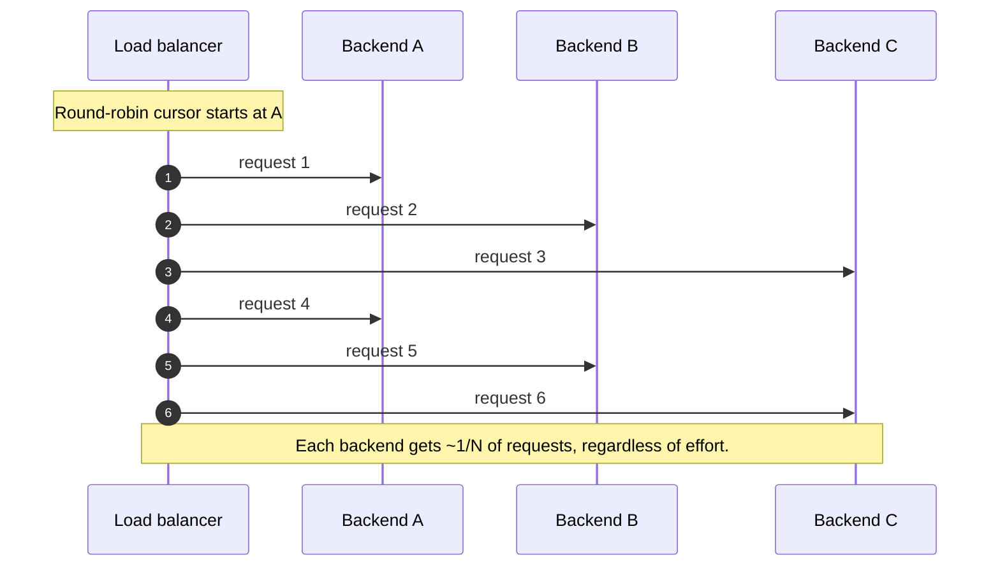
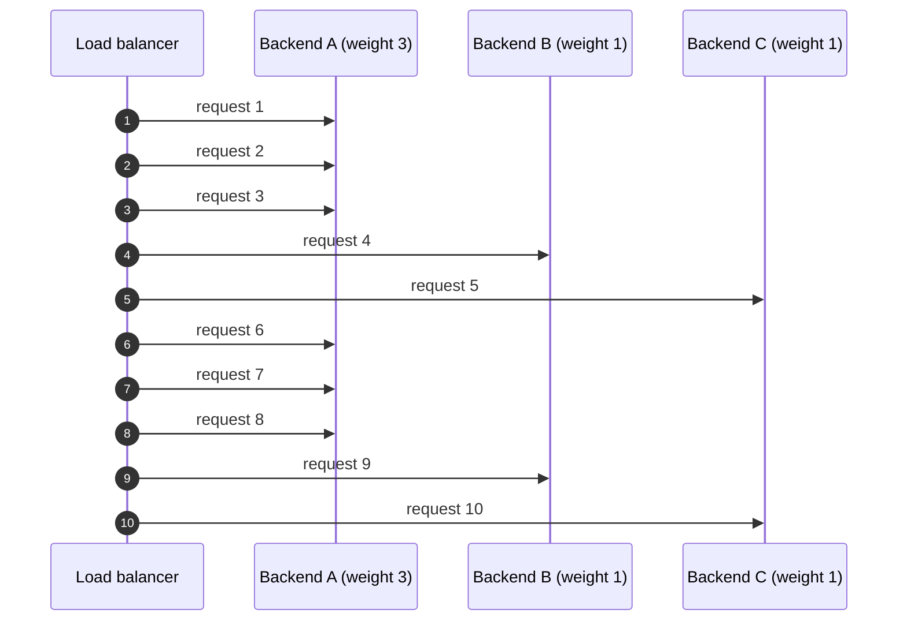
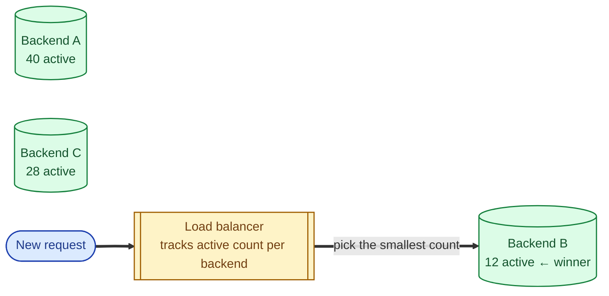
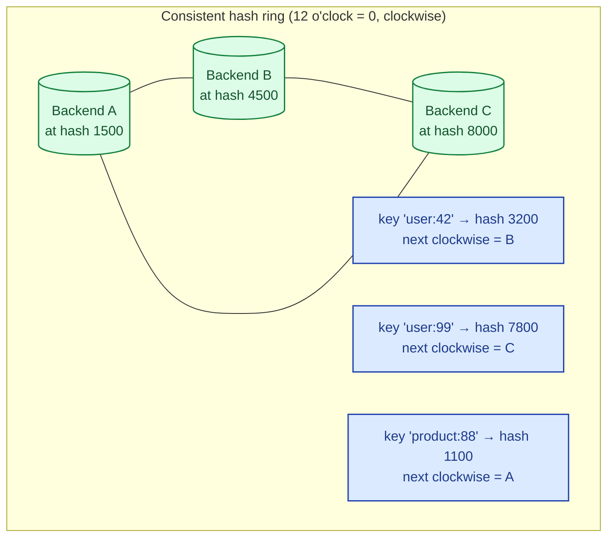
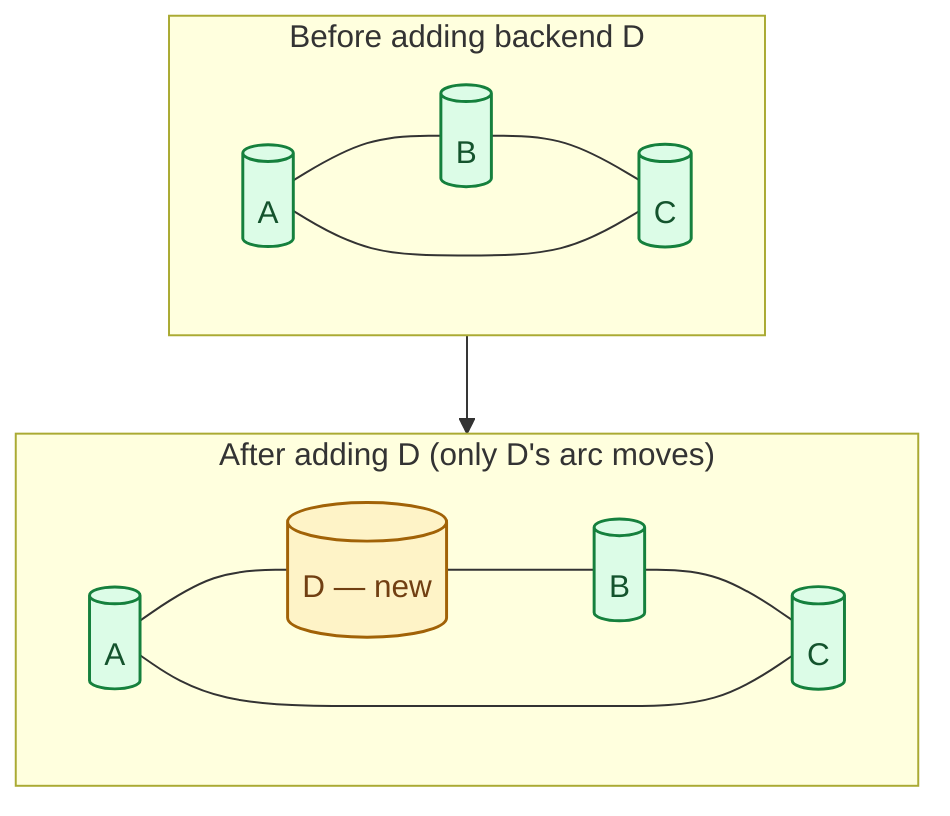
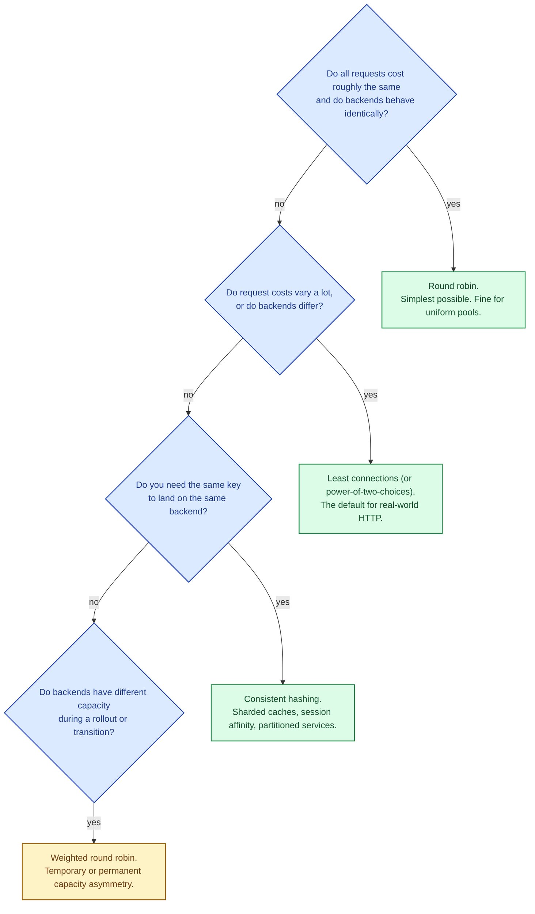

A load balancer's algorithm is the rule it uses to pick a backend for each incoming request. Pick the wrong one and you can have a "load balancer" that sends 80% of traffic to one backend while the others sit idle, or one that scrambles a user's session every 30 seconds, or one that has to rebalance the entire pool every time a single backend dies. The four algorithms below cover almost every real production choice.

## Round robin: take turns

Send request 1 to backend A, request 2 to B, request 3 to C, request 4 back to A. Cycle forever.

**Strength.** Stateless, trivial, no per-backend bookkeeping needed.

**Weakness.** Assumes every request costs the same and every backend is equally fast. In reality, requests vary by 1000x in cost (a thumbnail vs a search) and backends drift (one box has a hot cache, one is GC'ing). Round robin keeps sending the slow box its share anyway.

When to use: low-variance workloads, identical backends, simplest possible setup.

## Weighted round robin: take turns, with bias

Same idea, but the LB skips lower-weight backends more often. Useful when backends have different capacity (e.g., during a rolling upgrade with bigger machines online).

A gets three times as many requests as B or C. Same trade-offs as plain round robin; a small upgrade to take backend size into account.

## Least connections: send to the least busy

The LB tracks how many active requests each backend currently has and sends the new one to whichever has the fewest. Reacts to real load instead of assuming uniformity.

**Strength.** Adapts automatically to slow backends, GC pauses, and uneven request costs. The single best default for variable workloads.

**Weakness.** Needs per-backend state on the LB. New backends look "empty" briefly and get hammered until they catch up. (Power-of-two-choices is a clever fix: pick two backends at random, then pick the less loaded of those two. Same effect, much less bookkeeping.)

When to use: most variable, real-world web workloads. This is the right default for L7 LBs in front of HTTP services.

## Consistent hashing: same key, same backend

Hash a key from the request (often the user ID, session ID, or full URL) onto a circular ring. Hash each backend onto the same ring. Each request goes to the next backend clockwise from its hash.

**Strength.** Same key always goes to the same backend, with no central state. The killer feature is what happens when a backend is added or removed: only the keys in that arc move, not the whole pool.

With a naive `hash mod N`, going from 3 backends to 4 reshuffles about 75% of all keys. With consistent hashing, only 1/4 of keys move. This is why every modern distributed system uses consistent hashing for sharding and cache routing.

In practice, each backend hashes to many points on the ring (virtual nodes), so the distribution is more even and the impact of adding/removing a backend is smoothed across the ring.

**Weakness.** Uneven distribution if the hash points are not well-spread (mitigated by virtual nodes). Hot keys still go to one backend; the algorithm balances uniformly across keys, not across actual work.

When to use: caches where the same key should hit the same backend, sticky routing without server-side state, sharded systems.

## Picking an algorithm

For 80% of HTTP applications, least connections (or its modern variant, power-of-two-choices) is the right default. Reach for consistent hashing when you need affinity. Round robin is fine for simple pools but rarely the best choice in production.

## Two scenarios

**Scenario one: an API behind an L7 ALB.**

Mixed request costs (quick GETs alongside slow searches). Backends sometimes pause for GC. Pick least connections so the LB always sends new requests to the box that is least busy right now. Hit rate of slow backends stays low.

**Scenario two: a Memcached cluster.**

Five cache nodes. You want `user:42` to always hash to the same node so the cache hit rate stays high. Consistent hashing. When you add a sixth node, only ~1/6 of keys move; the rest still hit warm caches.

## What this connects to

- **Load balancer basics.** Algorithm choice is part of LB configuration. See [Load balancer: why, how, when](/practice/system-design/concepts/028-load-balancer-basics/).
- **L4 vs L7.** L4 can do round robin and consistent hashing on the 5-tuple; L7 can do all four, plus header-aware variants. See [L4 vs L7 load balancing](/practice/system-design/concepts/029-l4-vs-l7/).
- **Sticky sessions.** Sometimes implemented via consistent hashing of a session cookie. See [Sticky sessions](/practice/system-design/concepts/031-sticky-sessions/).
- **Sharding strategies.** Consistent hashing is also the standard for sharding databases and caches. See [Sharding strategies](/practice/system-design/concepts/012-sharding-strategies/).

## Common mistakes

- **Round robin on variable workloads.** A slow box and a fast box get the same number of requests; p99 latency suffers because the slow one piles up.
- **Least connections without a warmup grace period.** A freshly-added backend has zero active connections, so the LB dumps everything on it. Add a slow-start period that ramps it up.
- **Consistent hashing without virtual nodes.** Three real backends mean three points on the ring. Uneven arcs cause uneven load. Use 100+ virtual nodes per real backend.
- **Hashing on the wrong key.** Hashing on the user ID is great for affinity. Hashing on a near-unique key like a request ID gives you random distribution, not consistent hashing.
- **Forgetting health-aware variants.** All these algorithms should skip unhealthy backends. The LB needs to combine the algorithm with active health checking.
- **Picking by reputation.** "Consistent hashing is the modern one." Not for stateless HTTP. Match the algorithm to the workload.

## Quick recap

- Round robin: take turns. Simple, fine for uniform pools.
- Weighted round robin: take turns with bias. Useful during transitions.
- Least connections: send to the least busy backend. Default for real HTTP.
- Consistent hashing: same key, same backend, minimal disruption when the pool changes.
- Most production HTTP LBs default to least connections or power-of-two-choices for variable workloads.

This concept sits in **Stage 4 (Scaling and reliability)** of the [System Design Roadmap](/practice/system-design/roadmap/).
