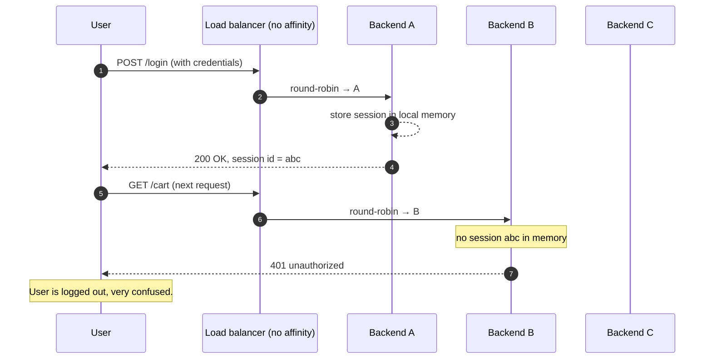
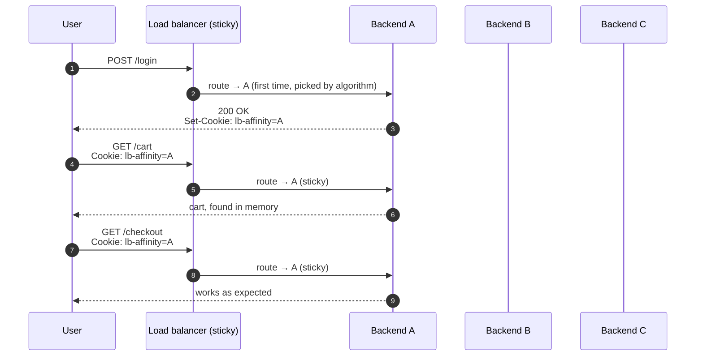
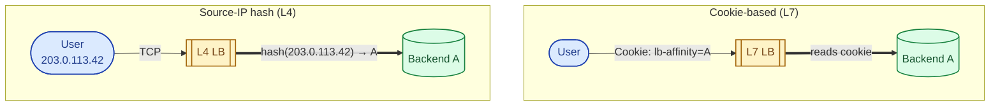
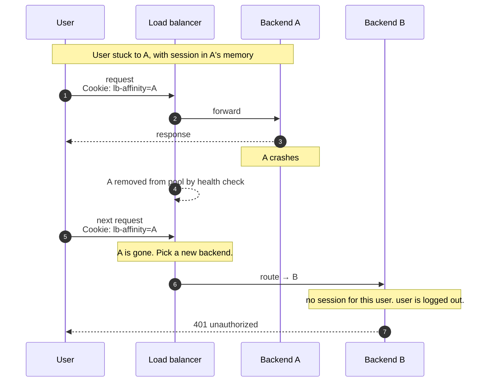
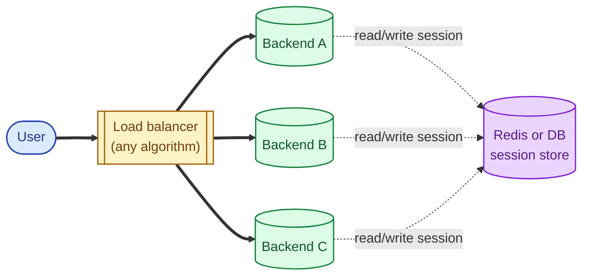

A sticky session (sometimes called session affinity) is the load balancer's promise that requests from one user always go to the same backend. It is the workaround for state that lives on a specific backend instead of in shared storage. Sticky sessions solve a real problem, but they make a load balancer worse at load balancing. The senior move is usually to get rid of the need for them, not to lean on them harder.

## The problem they solve

A user logs in. Their session data (cart, auth state, in-progress form) lives in the memory of the backend that handled the login. The next request from the same user lands on a different backend, which has none of that state. The user is logged out, the cart is empty, the form is gone.

The fix is one of two things: store session state somewhere shared (Redis, database, a JWT cookie), or pin the user to one backend so the state stays with them. The first is the right answer for most systems. The second is sticky sessions.

## Sticky sessions: pin the user to a backend

The LB attaches a marker to the user's first response that says "your backend is A". The user's browser sends that marker back on every subsequent request, and the LB routes accordingly.

Now the session state on Backend A stays useful for the duration of the user's interaction.

## The two ways stickiness is implemented

**Cookie-based.** The LB sets its own cookie (or reads an existing application cookie) and uses its value to choose the backend. This is what L7 LBs do by default. Survives the user changing IPs (mobile, VPN).

**Source-IP hash.** The LB hashes the client IP and uses the result to pick a backend. This is what L4 LBs do because they cannot read HTTP cookies. Breaks the moment the user's IP changes (carrier handoff, NAT, VPN switch).

Cookie-based is more reliable for users; source-IP-hash is the only option at the network layer.

## What sticky sessions cost

The whole point of a load balancer is to spread work. Sticky sessions partly defeat this:

- **Uneven load.** Some backends end up with the heaviest users. The LB cannot move them.
- **Loss of session on backend death.** If backend A dies mid-session, every sticky user pinned to A loses their state. They now log in again and start over.
- **Hard to scale up.** Adding a new backend does not relieve the load on existing sticky backends until users re-enter.
- **Hard to scale down.** Cannot retire a backend until its sessions drain (or expire), which can take hours.
- **Deploy gotchas.** Rolling restarts drop sessions on every backend you cycle.

Every sticky-session architecture has this failure mode. Most teams discover it the first time a backend dies in production.

## The better answer: get rid of the need

Stateless backends + shared session storage is almost always the right architecture. Every backend can serve any user, and a backend dying is a non-event.

The session lives in Redis. Any backend can pull it. Load balancing picks freely. Backend death loses no state. This is the modern default and the answer to almost every "we need sticky sessions" conversation.

The alternative shared-state pattern is a **stateless token** (JWT, signed cookie): the session state lives in the cookie itself, signed by the server so the backend can trust it. No central store, no stickiness needed.

## When sticky sessions are still the right call

- **Legacy applications** that store session in memory and cannot be rewritten today.
- **Stateful protocols** like WebSocket and long-polling, where the connection must keep talking to the same backend for the connection's life.
- **In-memory caches you cannot share** (e.g., expensive ML feature lookups warmed per backend), where affinity raises cache hit rate enough to be worth it.
- **gRPC streams.** A single stream is one TCP connection's worth of bytes; the LB has to send all stream traffic to the same backend.

For WebSockets and streams, "stickiness" is intrinsic to the connection, not a configuration choice.

## Two scenarios

**Scenario one: an old monolith with in-memory sessions.**

You inherit a Rails app from 2016. Sessions live in cookie-store on the server, no Redis backend in sight. You enable cookie-based stickiness on the ALB while you write the migration to Redis sessions. The team plans to drop stickiness after the migration ships. This is sticky-sessions-as-a-bridge, the only good reason to enable them in 2026.

**Scenario two: a WebSocket-heavy chat app.**

Each user opens a long-lived WebSocket. Messages route through that connection. The LB has to keep the connection on one backend for its whole life; that backend keeps the connection's state in memory. This is not "sticky sessions" in the traditional sense; it is the nature of WebSockets, and there is no way around it. The trade-off is real: a backend restart drops every connection on it.

## What this connects to

- **Load balancer basics.** Stickiness is a configuration on top of any LB. See [Load balancer: why, how, when](/practice/system-design/concepts/028-load-balancer-basics/).
- **L4 vs L7.** Affinity mechanism differs (IP hash vs cookie). See [L4 vs L7 load balancing](/practice/system-design/concepts/029-l4-vs-l7/).
- **Load balancing algorithms.** Consistent hashing on a session key is one way to implement stickiness without per-backend state. See [Load balancing algorithms](/practice/system-design/concepts/030-lb-algorithms/).
- **Stateless vs stateful services.** Sticky sessions are mostly a workaround for stateful services. See [Stateless vs stateful services](/practice/system-design/concepts/040-stateless-vs-stateful/).

## Common mistakes

- **Reaching for stickiness before externalising state.** The default should be stateless backends + Redis sessions. Stickiness is a bridge, not a destination.
- **Forgetting the failure mode.** A backend dying = all its sticky users logged out. If your stickiness is "load bearing" for the user experience, you have a paged-at-3-am bug waiting.
- **Long stickiness with short backend lifetimes.** Stickiness for an hour and pod lifetimes of 15 minutes (autoscaling, rolling deploys) means most users hit the death case constantly.
- **Mixing L4 source-IP affinity with NAT.** Many users behind the same corporate NAT share a source IP. They all hash to the same backend. You have just created a hot spot.
- **Not setting a fallback when the cookie is missing.** First request, cleared cookies, private window: the LB needs a sane default. Usually round robin until the cookie is set.
- **Believing stickiness raises cache hit rate enough to justify the cost.** Sometimes true (in-memory ML features), often not. Measure.

## Quick recap

- Sticky sessions: pin a user to the same backend so their in-memory state is found again.
- Implemented via cookie (L7) or source-IP hash (L4).
- They cost even load distribution, scale-up flexibility, and resilience to backend failure.
- The right answer is usually to externalise state (Redis, JWT) and drop stickiness entirely.
- WebSockets and streams are intrinsically sticky for the life of the connection; not a configuration choice.

This concept sits in **Stage 4 (Scaling and reliability)** of the [System Design Roadmap](/practice/system-design/roadmap/).
