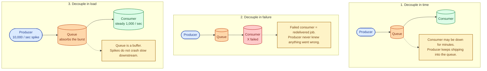
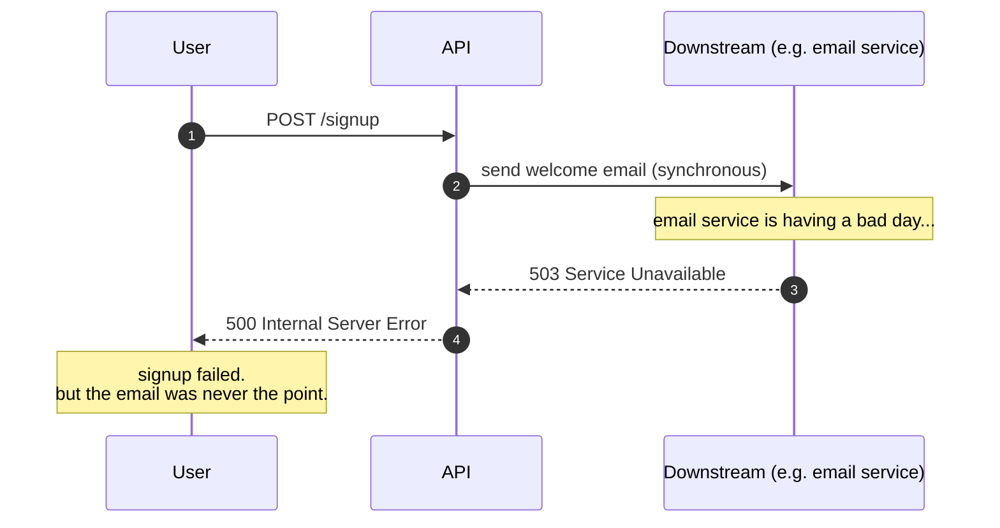
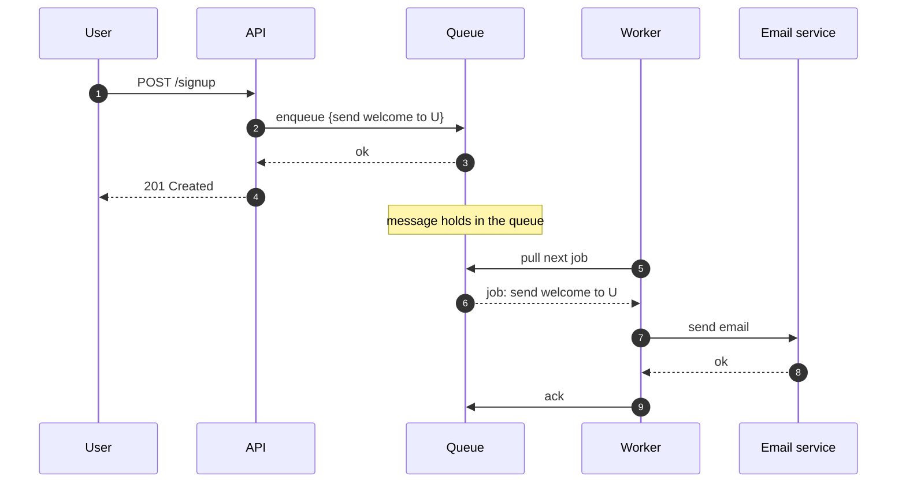
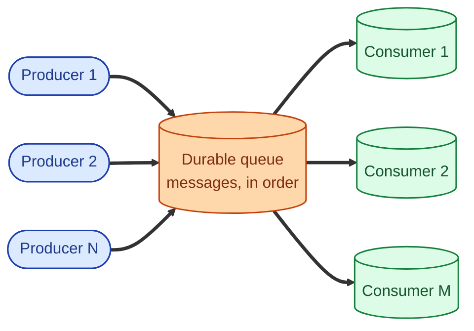

A message queue is a piece of middleware that sits between a producer and a consumer. The producer drops a message in; the queue holds it; a consumer picks it up later. That is the whole idea. The reason you reach for one is almost never "we need a queue." It is "we need the producer and the consumer to be decoupled in time, in failure, or in load." Once you start needing any of those three, no amount of clever HTTP retries replaces what a queue gives you for free.

## The three things a queue actually buys you

Most "we should use a queue" arguments collapse to one of these three. If none of them is true for your workload, a queue is overhead.

## Without a queue: tight coupling, easy to break

A synchronous call between two services looks simple. It is also fragile. When the downstream is slow, the upstream is slow. When the downstream is down, the upstream errors out to its own caller. The two services have to be up together, scaled together, and deployed without breaking each other.

The user's signup just failed because of an unrelated email service. The two should never have been linked tightly enough for one to take down the other.

## With a queue: decoupled, resilient

The same flow, with the email task enqueued instead of called.

The user gets a fast successful response. The email service can be down for an hour; the queue holds the work; the worker retries when the service is healthy again. The signup path is no longer coupled to the email service's uptime.

## What a queue is, structurally

Many producers, many consumers, one queue in the middle. The producers do not know the consumers exist. The consumers can be scaled independently. The queue absorbs the impedance mismatch between fast and slow sides, between bursty and steady traffic, between healthy and recovering.

## When you actually need one

- The work is **slow** and you cannot block the caller for it (encoding a video, generating a report).
- The work is **best-effort** and the caller does not need a confirmation right now (logs, metrics, side effects).
- The downstream is **unreliable** and you do not want its outages to take the upstream with it.
- You have **bursty traffic** and a slower downstream that would otherwise be crushed.
- You need **fan-out**: one event triggers many independent reactions.

## When a queue is overhead

- The caller needs the result to continue ("did the payment succeed?"). That is sync, no queue.
- Latency end-to-end matters more than throughput, and a queue adds delay.
- Volume is small enough that a thread pool inside the application is enough.
- The "queue" you would build is just retry-with-backoff inside the caller. Often the right answer for occasional flaky downstreams.

## Two scenarios

**Scenario one: an order checkout that triggers many side effects.**

The user buys something. You need to: charge the card, record the order, update inventory, send a confirmation email, update a search index, send a webhook to the warehouse, ship analytics, kick off a recommendation refresh. Charging the card is sync (user is waiting). Everything else goes onto a queue. The checkout completes in 200 ms instead of 4 seconds, and a flaky email service stops being a launch blocker.

**Scenario two: an IoT telemetry firehose.**

50,000 sensor readings per second, with the database able to write maybe 8,000 per second sustained. Without a queue, the ingest layer drops messages or stalls. With a queue (Kafka, in this kind of workload), the queue absorbs the spike, the database consumes at its own pace, and a brief database hiccup just deepens the queue rather than losing data.

## What this connects to

- **Synchronous vs asynchronous.** A queue is the canonical async tool. See [Synchronous vs asynchronous](/practice/system-design/concepts/005-sync-vs-async/).
- **Delivery semantics.** Queues redeliver on failure; you choose the guarantee. See [At-most-once vs at-least-once vs exactly-once](/practice/system-design/concepts/034-delivery-semantics/).
- **Idempotency.** Mandatory for any consumer of a queue with redelivery. See [Idempotency](/practice/system-design/concepts/021-idempotency/).
- **Kafka vs RabbitMQ vs SQS.** Which queue. See [Kafka vs RabbitMQ vs SQS](/practice/system-design/concepts/033-kafka-vs-rabbitmq-vs-sqs/).
- **Pub/sub vs point-to-point queue.** The shape of the delivery. See [Pub/sub vs point-to-point queue](/practice/system-design/concepts/035-pubsub-vs-queue/).

## Common mistakes

- **Adding a queue without idempotency on the consumer.** Queues redeliver. Your worker will see the same job twice. If "send email" runs twice, the user gets two emails.
- **Using a queue for sync work.** "User submits → enqueue → poll for the result" is just a slower sync call. If the caller needs the answer now, keep it sync.
- **Unbounded queues.** Producers outrun consumers, the queue grows, eventually disks fill. Always cap the queue or apply backpressure. See [Bulkheads and rate limiting](/practice/system-design/concepts/047-bulkheads-and-rate-limiting/).
- **No dead-letter queue (DLQ).** Some messages will fail every retry. They need to land somewhere visible, not loop forever or vanish.
- **Treating the queue as a database.** Queues are for transient work. If you need to "query the queue", you wanted a database.
- **Forgetting ordering matters or does not.** Some workloads (per-user activity, per-order events) need per-key ordering. Most queues offer this only with extra effort (Kafka partitions, FIFO SQS).

## Quick recap

- A queue decouples producer and consumer in time, failure, and load.
- Use one when work is slow, best-effort, bursty, or downstream is unreliable.
- Skip it when the caller needs the result right now.
- Idempotency on the consumer is mandatory.
- The right queue is not "a queue"; pick the one that fits the workload.

This concept sits in **Stage 3 (Caching, queues, and async work)** of the [System Design Roadmap](/practice/system-design/roadmap/).
