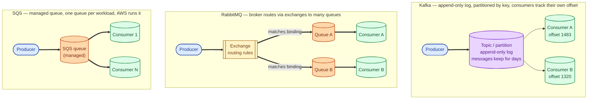
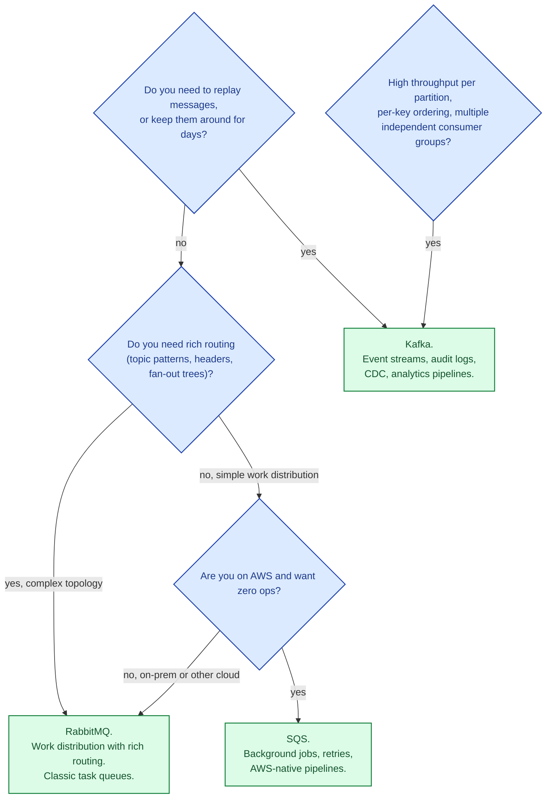

The three names cover most of the real-world messaging choices. They look interchangeable from the outside ("put a message in, get a message out") and are deeply different inside. Kafka is a log. RabbitMQ is a broker with sophisticated routing. SQS is a managed queue. Knowing which one you actually want matters more than knowing the operational details of any one of them, because changing later is expensive.

## The three models, side by side

Same goal, three deeply different designs. The shape of the broker shapes everything you can do with it.

## Kafka: log first, queue second

Kafka stores messages in an **append-only log** per partition. Producers add to the end. Consumers track a position (offset) and read forward. The log itself is durable: messages stay around for days or weeks, not just until a consumer reads them.

That single change enables most of Kafka's superpowers:

- **Replay.** A new consumer can start from the beginning of the log and re-process everything.
- **Multiple independent consumers.** Each one keeps its own offset; they do not compete for messages.
- **Ordering within a partition.** Messages with the same key (e.g., user_id) always go to the same partition and are delivered in order.
- **Huge throughput.** Sequential disk writes are the fastest thing a disk can do; Kafka shapes the workload to favour them.

The cost:

- Operationally heavier (running brokers, ZooKeeper or KRaft, tuning replication and retention).
- Not natively rich at message-level routing or per-message ACKs.
- "Just a queue" is overpaying for what Kafka offers.

Used for: event streams, change-data-capture, analytics pipelines, audit logs, telemetry.

## RabbitMQ: routing first, broker second

RabbitMQ is a classic broker. Producers send to **exchanges** that route, based on rules (routing keys, topic patterns, headers, fanout), into **queues**. Consumers pull from queues with per-message acknowledgements.

Strengths:

- **Routing.** Topic exchanges, header exchanges, fanout exchanges, direct exchanges. Mix and match to express almost any routing intent declaratively.
- **Per-message ACKs.** Consumer says "I handled this", the broker removes it. If the consumer fails, the message redelivers cleanly.
- **Priority queues, dead-letter queues, TTLs, delayed delivery.** Built-in patterns for things you would otherwise have to implement.

Cost:

- Messages are usually consumed once and gone (no log to replay).
- Throughput per broker is lower than Kafka.
- Mirroring and clustering are workable but more delicate than Kafka's replication model.

Used for: task queues, complex routing topologies, work distribution with rich semantics.

## SQS: managed queue, no servers

SQS is AWS's "just give me a queue" product. You create a queue and start using it. No brokers to operate, no ZooKeeper, no clustering decisions. Two flavours:

- **Standard SQS.** At-least-once delivery, best-effort ordering, very high throughput.
- **FIFO SQS.** Exactly-once-style delivery, strict ordering within a message group, lower throughput.

Strengths:

- **Zero ops.** AWS handles durability, scaling, and HA. You pay per request.
- **Tight AWS integration.** Lambda triggers, dead-letter queues, IAM, EventBridge.
- **Excellent for "boring" queues.** Background jobs, notifications, retry-with-DLQ patterns.

Cost:

- AWS-only.
- No replay, no multi-consumer groups (other consumers cannot independently read the same queue without fan-out via SNS).
- Higher latency than a co-located RabbitMQ.

Used for: any AWS-native workload that needs a queue and does not need a log.

## The picker

A useful one-liner per system:

- **Kafka:** "I want a log of events that many independent things will read."
- **RabbitMQ:** "I want work to flow through queues with smart routing and per-message acks."
- **SQS:** "I want a queue and I never want to think about queue infrastructure again."

## Two scenarios

**Scenario one: an analytics pipeline ingesting events from many services.**

Hundreds of thousands of events per second. Multiple downstream teams want to consume the same events independently (the analytics warehouse, the recommendation system, the fraud team). Old events sometimes need to be re-processed when a downstream's logic changes. This is Kafka territory. Each consumer tracks its own offset; retention is days; re-processing is just rewinding.

**Scenario two: a background job system for a SaaS app.**

User actions enqueue jobs ("send email", "regenerate PDF", "sync to CRM"). Workers pull and process. Per-job retries with DLQ. Lives in AWS. Throughput is moderate. Use SQS. You will not regret it. The day you need richer routing, switch to RabbitMQ; the day you need a log, switch to Kafka. Most jobs never need either.

## What this connects to

- **Why use a message queue.** Why you reach for any of these in the first place. See [Why use a message queue](/practice/system-design/concepts/032-why-message-queue/).
- **Delivery semantics.** Each system offers different guarantees. See [At-most-once vs at-least-once vs exactly-once](/practice/system-design/concepts/034-delivery-semantics/).
- **Pub/sub vs queue.** Kafka is closer to pub/sub; SQS is a queue; RabbitMQ does both. See [Pub/sub vs point-to-point queue](/practice/system-design/concepts/035-pubsub-vs-queue/).
- **Event sourcing.** Kafka is the canonical event-sourcing log. See [Event sourcing vs state-based persistence](/practice/system-design/concepts/036-event-sourcing/).
- **Idempotency.** Required by all three when retries happen. See [Idempotency](/practice/system-design/concepts/021-idempotency/).

## Common mistakes

- **Kafka because Kafka.** It is operationally heavy. If you are not using the log or partitioned ordering, you are paying for nothing.
- **RabbitMQ for huge throughput streaming.** Not its shape. Kafka.
- **SQS for "I want pub/sub."** SQS is a queue; for fanout you also need SNS. Or pick something that does both natively.
- **One topic / queue per microservice without thought.** Topology matters. A topic per business event is usually better than a topic per service.
- **Forgetting retention and disk costs.** Kafka with infinite retention is expensive. Decide a real number.
- **No dead-letter handling.** "We will fix it later" lasts until a poison message loops forever.

## Quick recap

- Kafka: a durable log, replayable, partitioned, many independent consumers.
- RabbitMQ: a broker with rich routing and per-message ACKs.
- SQS: a managed queue on AWS with zero ops.
- Pick by the shape you need (log, routing, managed), not by what you have used before.

This concept sits in **Stage 3 (Caching, queues, and async work)** of the [System Design Roadmap](/practice/system-design/roadmap/).
