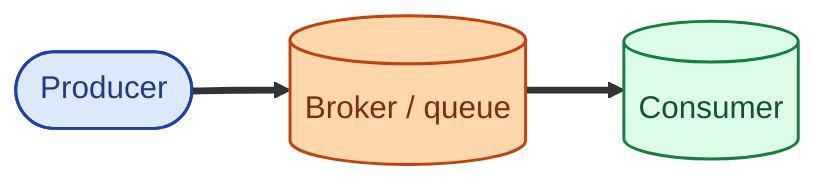
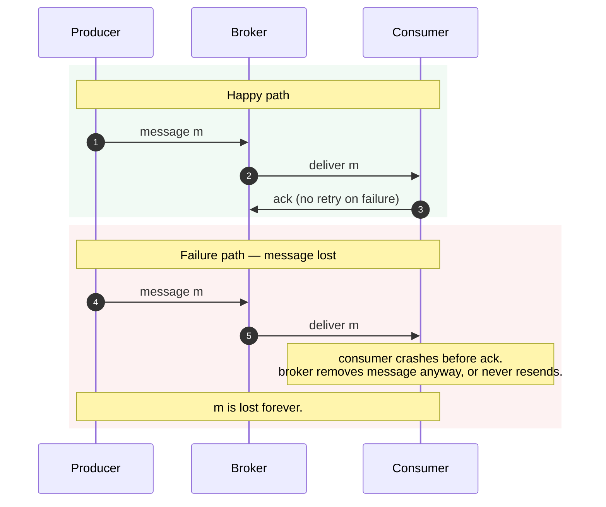
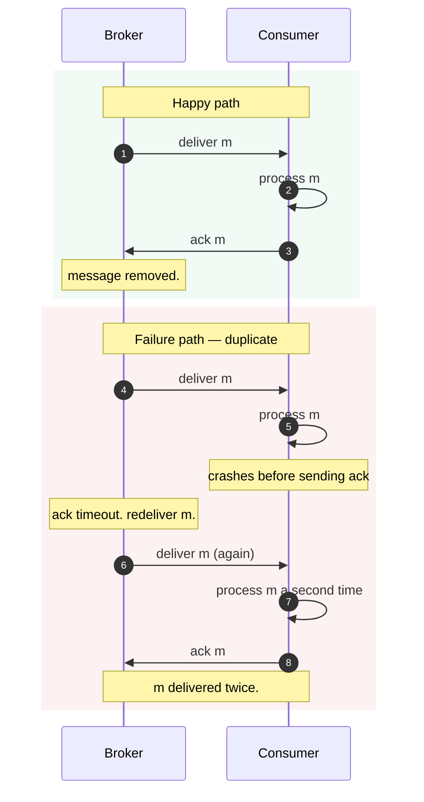
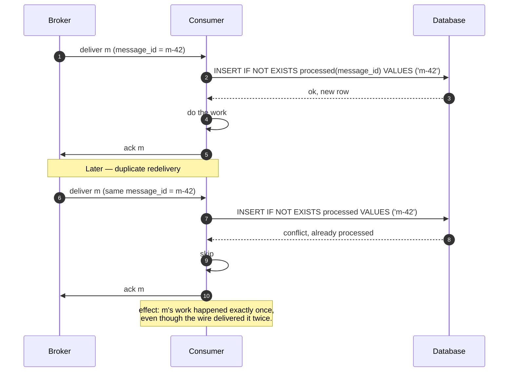
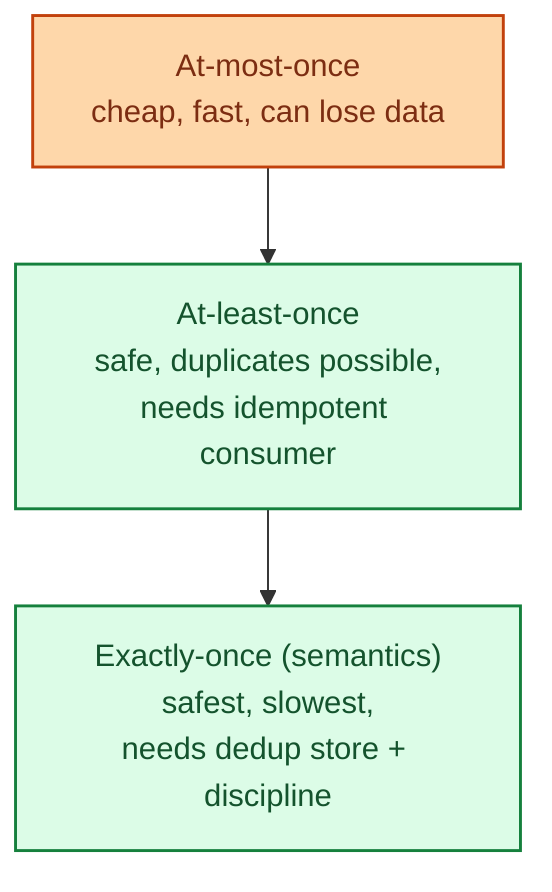

The three phrases describe what a message broker promises about a message reaching a consumer. At-most-once means it may be lost but never duplicated. At-least-once means it may be duplicated but never lost. Exactly-once is the famous one and is misunderstood more than any other phrase in distributed systems. Once you see what each one really costs, the question "which one do I want?" answers itself.

## The setup

Any message travels three hops: producer to broker, broker stores it, broker to consumer. A failure at any hop changes what the receiver eventually sees. The delivery guarantee is about which possibilities are allowed.

## At-most-once: may be lost, never duplicated

The producer sends, the broker delivers, the consumer processes. If anything fails, the message is gone.

**Strength.** Simple. Fast. No duplicate-handling on the consumer.

**Weakness.** You can lose messages. Use only when the cost of losing one is genuinely zero.

Used for: telemetry, metric pings, fire-and-forget logging where missing a fraction of a percent is fine.

## At-least-once: may be duplicated, never lost

The consumer must acknowledge the message before the broker removes it. If the consumer crashes or the ack is lost, the broker redelivers.

**Strength.** No data loss. Standard guarantee from Kafka, SQS, RabbitMQ, and almost every modern queue.

**Weakness.** Consumer will see duplicates. This is fine if and only if the consumer is idempotent. See [Idempotency](/practice/system-design/concepts/021-idempotency/). Without it, "send email" can send twice.

Used for: 95% of real workloads. The default for any modern queue.

## Exactly-once: what it really means

Exactly-once delivery in the strict sense is impossible across a network you do not control. What "exactly-once" actually means in production systems is **at-least-once delivery combined with idempotent processing**, so the effect is the same as exactly-once even though the wire actually delivered twice.

**Strength.** The right model for the workloads that need it (payments, billing, order placement).

**Weakness.** Requires a deduplication store and discipline. Some systems (Kafka transactions, idempotent producers + transactional consumers) ship "exactly-once semantics" inside a specific boundary, but the moment you cross into another system, you are back to at-least-once + idempotency.

## Where the costs land

The cost is always paid somewhere. Either you pay it in lost messages, or you pay it in duplicate-handling, or you pay it in deduplication infrastructure. Nothing is free.

## When to pick which

**At-most-once:** telemetry, debug logs, real-time gauges where occasional gaps do not matter. Almost never the right pick for application logic.

**At-least-once:** the default for everything else. Combined with idempotent consumers, this covers 95% of real workloads. Background jobs, webhooks, ETL pipelines, notifications.

**Exactly-once (semantics):** money. Inventory decrement. Order placement. Anything where running the side effect twice is a real business problem.

## Two scenarios

**Scenario one: a webhook receiver.**

The provider (Stripe, GitHub, Shopify) sends webhooks with at-least-once delivery and warns you about it loudly in their docs. Your handler stores `(provider, event_id)` in a table on first arrival and skips if it sees it again. Effect: exactly-once business logic on top of at-least-once delivery. The whole industry runs this way.

**Scenario two: a payment processor.**

A consumer pulls "charge $99 from user 42" from the queue. Without idempotency, a retry charges twice. With an idempotency key plus a unique constraint in the charges table, the second attempt sees the existing row and returns success without acting. Same outcome as exactly-once even though the queue delivered twice.

## What this connects to

- **Idempotency.** The companion concept; exactly-once is at-least-once plus idempotency. See [Idempotency](/practice/system-design/concepts/021-idempotency/).
- **Why use a message queue.** Delivery semantics are why you care about queue behaviour. See [Why use a message queue](/practice/system-design/concepts/032-why-message-queue/).
- **Kafka vs RabbitMQ vs SQS.** Each ships with specific defaults around these semantics. See [Kafka vs RabbitMQ vs SQS](/practice/system-design/concepts/033-kafka-vs-rabbitmq-vs-sqs/).
- **Retry with backoff.** Retries are what create duplicates in the first place. See [Retry with exponential backoff and jitter](/practice/system-design/concepts/046-retry-backoff-jitter/).

## Common mistakes

- **Designing for at-most-once because "exactly-once is hard."** You will lose messages and discover it years later in a reconciliation.
- **Believing "exactly-once delivery" exists end-to-end across systems.** It does not. The honest goal is at-least-once delivery plus idempotent processing.
- **Idempotency keys that are not stable.** Generated at retry time = different key per retry = no dedup. Generate the key once at the original request.
- **No dead-letter queue.** Some messages will fail every retry. A DLQ captures them for inspection.
- **Idempotency-store TTLs that are too short.** A retry that arrives after the dedup record expires is a duplicate. Keep keys for at least 24 hours, often longer.
- **Treating ack as "I have the message" instead of "I have finished the work."** Acking too early turns at-least-once into at-most-once during a crash.

## Quick recap

- At-most-once: never duplicates, may lose. Telemetry only.
- At-least-once: never lost, may duplicate. The default.
- Exactly-once (semantics): at-least-once + idempotent consumer. The right model for money and irreversible side effects.
- Idempotency on the consumer is what makes any of this actually work.

This concept sits in **Stage 4 (Scaling and reliability)** of the [System Design Roadmap](/practice/system-design/roadmap/).
